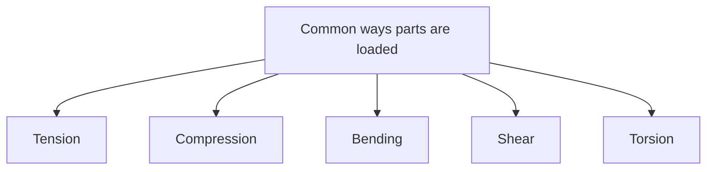
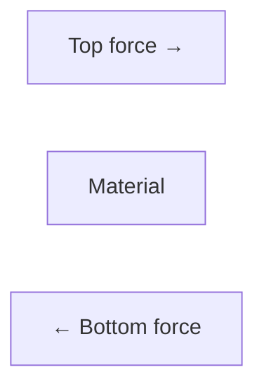
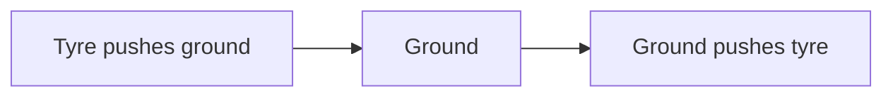
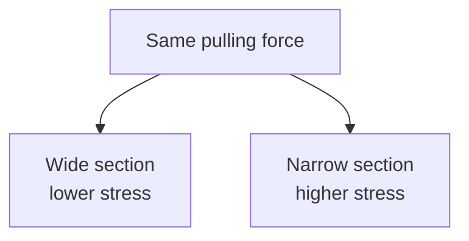
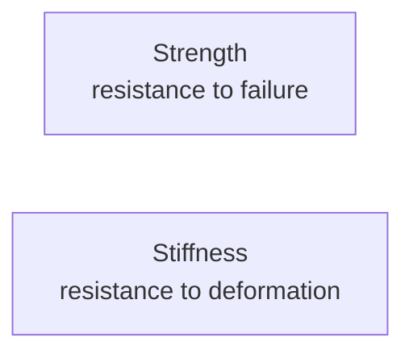
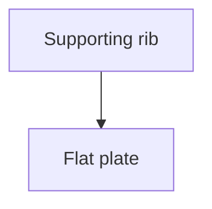
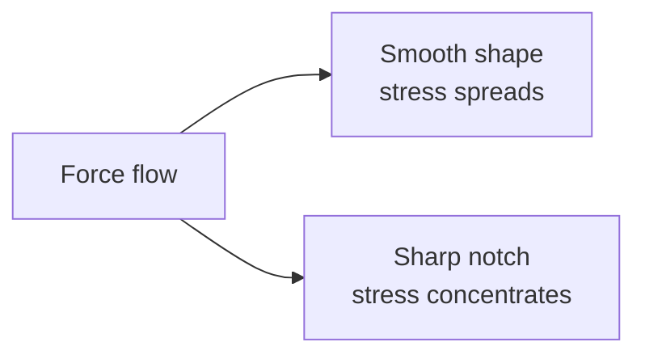
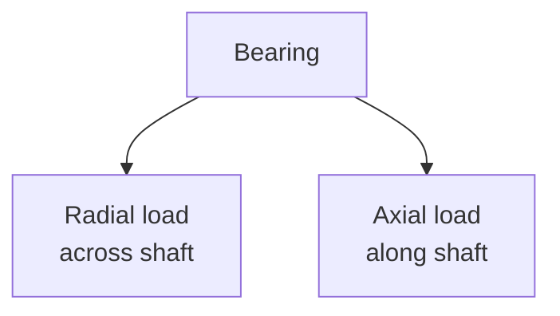
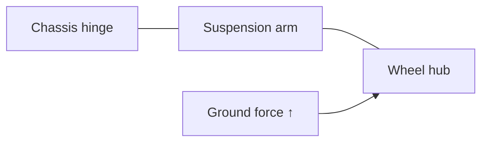

# Chapter 04 — Forces and Why Parts Break

> **"Parts do not break because they are unlucky.  
> They break because forces found a path through them."**

---

# Learning Objectives

By the end of this chapter you will be able to:

- Explain the main ways a part can be loaded.
- Identify tension, compression, bending, shear and torsion.
- Describe the difference between load, stress and strength.
- Understand why holes, sharp corners and thin sections can become weak points.
- Explain why repeated small loads may eventually cause failure.
- Draw simple force diagrams for suspension arms, shock towers and chassis parts.
- Make better first guesses about where a printed part needs reinforcement.

---

# Before We Begin

Take a plastic ruler.

You can:

- pull it
- push it
- bend it
- twist it
- slide one end sideways

The same ruler reacts differently to each action.

A part that survives one kind of force may fail under another.

For example:

- a rope is excellent in pulling
- a brick is excellent in squeezing
- a thin sheet may bend easily
- a metal shaft may resist twisting

This chapter is about learning to see those different kinds of force.

That skill is essential when designing 3D printed RC parts.

---

# A Story: The Bridge Made From Paper

Imagine laying one sheet of paper across two books.

Now place a coin in the middle.

The paper bends.

Add more coins.

Eventually it collapses.

Now fold the paper into a shallow U-shape and place it across the same books.

Try the coins again.

The same amount of paper can now hold much more weight.

Why?

The material did not change.

The shape changed.

This gives us a powerful engineering lesson:

> Strength depends on both material and geometry.

Geometry means the shape and arrangement of the part.

---

# What Is a Load?

A **load** is a force or combination of forces acting on a part.

Examples:

- the buggy's weight pressing on the suspension
- the motor twisting the drivetrain
- a wheel hitting a rock
- a screw squeezing two parts together
- a landing force after a jump
- tyre grip pulling on a suspension arm

Loads may be:

- small
- large
- steady
- repeated
- sudden
- changing direction

The type of load matters as much as its size.

---

# Five Main Ways Parts Are Loaded

We will begin with five simple load types.

1. Tension
2. Compression
3. Bending
4. Shear
5. Torsion



---

# Tension

Imagine two people pulling opposite ends of a rope.

The rope is being stretched.

That is **tension**.

Tension means:

> A pulling load that tries to stretch a part.

Examples:

- a tow rope
- a cable
- a zip tie being pulled tight
- a steering link under pull
- the lower side of a bent suspension arm


A part under tension may:

- stretch
- narrow
- crack
- snap

---

# Compression

Imagine pushing both ends of a sponge toward the centre.

The sponge is being squeezed.

That is **compression**.

Compression means:

> A pushing load that tries to shorten or crush a part.

Examples:

- a chair leg holding weight
- a spring being compressed
- a shock tower mount under landing force
- a screw clamping two parts together
- the upper side of a bent beam


A part under compression may:

- shorten
- squash
- buckle
- crack
- crush

---

# Bending

Hold a ruler at both ends and press in the middle.

The ruler bends.

That is **bending**.

Bending happens when one side of a part stretches while the opposite side squeezes.


For a simple beam bending downward:

- the top side is usually compressed
- the bottom side is usually stretched

This is why the outer surfaces of a beam are so important.

---

# Shear

Take a stack of cards.

Hold the bottom cards still.

Push the top cards sideways.

The layers slide over one another.

That is **shear**.

Shear means:

> A load that tries to slide one part of a material past another.

Examples:

- scissors cutting paper
- a bolt holding two plates together
- a suspension hinge pin resisting sideways force
- a screw being pushed sideways
- layers in a print trying to slide apart



A part under shear may:

- slide
- tear
- split
- shear a screw or pin

---

# Torsion

Hold a towel at both ends and twist.

The towel experiences torsion.

**Torsion** means:

> A twisting load along the length of a part.

Examples:

- a driveshaft carrying motor torque
- a screwdriver shaft
- a wheel axle
- a chassis twisting during cornering
- a hex driver turning a screw


A part under torsion may:

- twist elastically
- stay permanently twisted
- crack
- snap

---

# Most Real Parts See More Than One Load

A suspension arm may experience:

- bending from the wheel load
- shear at the hinge pin
- tension on one side
- compression on the other
- impact during a crash

A driveshaft may experience:

- torsion from motor torque
- bending because of joint angle
- impact when landing with throttle applied

Real engineering is rarely one load at a time.

But separating the loads helps us understand the whole problem.

---

# Load Paths

A **load path** is the route a force follows through the machine.

Imagine the buggy landing from a jump.

The load path may be:


The force does not disappear.

It travels through every connected part.

Each part must carry the load to the next one.

---

# Reaction Forces

Push your hand against a table.

You push down on the table.

The table pushes up on your hand.

That upward force is a **reaction force**.

Whenever one object pushes on another, the second object pushes back.

In the buggy:

- tyre pushes on ground
- ground pushes on tyre
- suspension pushes on chassis
- chassis pushes on suspension



Reaction forces are why the chassis and mounts must be strong.

---

# Static and Dynamic Loads

## Static Load

A static load changes slowly or remains mostly steady.

Examples:

- buggy resting on the ground
- battery sitting in its tray
- screw clamping two parts together

## Dynamic Load

A dynamic load changes with time.

Examples:

- wheel hitting bumps
- buggy accelerating
- steering rapidly left and right
- drivetrain torque changing
- suspension moving

Dynamic loads are often harder on parts because they keep changing.

---

# Impact Loads

Imagine gently placing a book on a table.

Now drop the same book from shoulder height.

The book has the same mass.

But the impact is much larger.

An **impact load** happens when force is applied very quickly.

Examples:

- hitting a wall
- landing a jump
- a wheel striking a rock
- a gear suddenly jamming
- rolling the buggy

Impact loads can be much greater than normal driving loads.

This is why a part may survive ordinary use but fail in a crash.

---

# Stress

Imagine standing on snow.

With normal shoes, you may sink.

With snowshoes, your weight spreads over a larger area.

The total load is similar.

But the pressure on each small area is lower.

In a material, **stress** describes how concentrated the load is.

A simple idea is:

```text
Stress = Force ÷ Area
```

You do not need to calculate it yet.

Just remember:

> The same force creates more stress when it passes through a smaller area.

---

# A Concrete Example of Stress

Suppose two plastic straps carry the same pull.

- Strap A is 10 mm wide.
- Strap B is 2 mm wide.

The narrow strap has less material carrying the load.

So the stress inside it is greater.

The narrow strap is more likely to fail.



---

# Strength

**Strength** describes how much stress a material or part can withstand before failing.

Different materials have different strengths.

But part strength also depends on:

- thickness
- shape
- print orientation
- holes
- sharp corners
- temperature
- repeated loading
- damage
- manufacturing quality

A strong material can still make a weak part if the geometry is poor.

---

# Stiffness

Strength and stiffness are not the same.

## Strength

How much load a part can survive before failure.

## Stiffness

How much a part resists bending, stretching or twisting.

A rubber band can stretch a long way without breaking.

It may be strong enough for its job, but it is not stiff.

A glass ruler may feel stiff, but it can fail suddenly.



A buggy part may need:

- enough strength not to break
- enough stiffness to keep geometry accurate
- enough flexibility to absorb impacts

---

# Elastic Deformation

Bend a plastic ruler gently.

Release it.

It returns to its original shape.

This is **elastic deformation**.

Elastic deformation means:

> A temporary shape change that disappears when the load is removed.

Springs are designed to deform elastically.

Suspension arms may flex slightly and return.

---

# Permanent Deformation

Bend a paperclip too far.

It stays bent.

This is **permanent deformation**.

The material has gone beyond its elastic range.

A permanently bent part may still be in one piece, but it is damaged.

Examples:

- bent driveshaft
- warped chassis
- stretched screw hole
- deformed motor mount

---

# Fracture

A **fracture** is a crack or complete break.

A fracture may be:

- sudden
- gradual
- caused by impact
- caused by repeated loading
- caused by a sharp weak point
- caused by poor layer bonding

The fracture surface often contains clues about why the part failed.

---

# Brittle and Ductile Failure

## Brittle Failure

A brittle part breaks with little visible bending.

Examples:

- dry twig
- glass
- some cold or poorly printed plastics

Brittle failure can happen suddenly.

## Ductile Failure

A ductile part bends, stretches or changes shape before breaking.

Examples:

- soft metal wire
- some flexible plastics
- warm nylon

Ductile behaviour may give warning before complete failure.

---

# Buckling

Take a drinking straw.

Pulling it lengthwise is difficult.

Now press both ends toward each other.

It may suddenly bend sideways.

That is **buckling**.

Buckling happens when a long, thin part under compression becomes unstable and bends.

Examples:

- thin chassis brace
- tall shock tower
- slender printed post
- long screw spacer


A part may buckle before the material itself is crushed.

---

# Why Shape Matters

Return to the paper bridge.

A flat sheet bends easily.

A folded sheet resists bending much better.

That happens because more material is moved away from the middle of the bend.

This is why beams often use shapes such as:

- I-beams
- box sections
- channels
- ribs
- tubes

```text
Flat strip:     ______

Channel:        |____|

Box section:    |____|
                |____|

I-beam:         =====
                  ||
                =====
```

The shape can increase stiffness without using a solid block of material.

---

# Ribs

A **rib** is a thin wall added to support a larger surface.

Ribs can:

- reduce bending
- spread loads
- connect walls
- add stiffness with little material

Printed chassis parts often use ribs instead of making everything solid.



A rib should follow the expected load path.

Random ribs may add weight without solving the real problem.

---

# Fillets and Rounded Corners

Imagine tearing paper.

A tiny cut makes it easier to start the tear.

Sharp corners can act like that tiny cut.

They concentrate stress.

A **fillet** is a rounded inside corner.

```text
Sharp corner:   |_
Rounded corner: |)
```

Fillets help force flow smoothly through a change in shape.

They are especially useful where:

- a thin wall meets a thick wall
- a bracket meets a base
- a suspension arm changes width
- a screw boss joins a plate

---

# Stress Concentration

A **stress concentration** is a small area where stress becomes much higher than in the surrounding material.

Common causes:

- sharp inside corners
- holes
- scratches
- notches
- sudden thickness changes
- poor print seams
- cracks



Stress concentrations are common starting points for cracks.

---

# Holes Are Useful but Important

We need holes for:

- screws
- bearings
- shafts
- cable routing
- weight reduction

But a hole removes material.

It also changes the path that force must follow.

A hole placed in a highly loaded area may weaken the part.

That does not mean holes are bad.

It means they should be placed and shaped thoughtfully.

---

# Sudden Changes in Thickness

Imagine a thick beam that suddenly becomes very thin.

The force must squeeze through the thin region.

Stress increases there.

A smoother transition spreads the load more gradually.

```text
Sudden step:     ======__

Smooth change:   =====\___
```

Tapered or rounded transitions are often stronger than sudden steps.

---

# Fastener Loads

Screws and bolts can experience several kinds of load.

## Tension in a Screw

The screw is pulled along its length.

## Shear in a Screw

Connected parts try to slide sideways across the screw.

## Clamping Force

Tightening the screw squeezes parts together.

A well-designed joint often uses clamping friction to carry load instead of forcing the screw shaft to carry all the shear.

---

# Bearing Loads

Bearings support rotating shafts.

They may experience:

- radial load
- axial load

## Radial Load

Force acts sideways across the shaft.

Example:

- buggy weight on a wheel bearing

## Axial Load

Force acts along the shaft.

Example:

- a wheel being pushed inward or outward



Some bearings handle one type better than the other.

---

# Fatigue

Bend a paperclip slightly.

It survives.

Bend it back and forth many times.

Eventually it breaks.

This is **fatigue**.

Fatigue means:

> Failure caused by repeated loading, often at loads smaller than a one-time breaking load.

Examples in an RC buggy:

- suspension arm flexing over bumps
- steering link moving repeatedly
- chassis twisting during turns
- driveshaft experiencing repeated torque changes
- body mount vibrating

---

# Why Repeated Loads Matter

A part may pass one strong test but fail after 100 runs.

This does not always mean the material was too weak for a single load.

It may mean:

- tiny cracks grew over time
- layer bonds weakened
- screw holes loosened
- heat and cooling cycles caused damage
- repeated bending caused fatigue

Durability is about surviving many load cycles, not just one.

---

# Creep

Hang a weight from a plastic strip.

It may stretch slowly over hours or days.

This is called **creep**.

Creep means:

> Slow permanent deformation under a steady load.

Creep becomes more serious when plastic is warm.

Possible buggy examples:

- battery strap mount slowly bending
- suspension geometry changing while stored
- motor mount moving because of heat
- screw bosses deforming under constant clamping

Some printed plastics resist creep better than others.

---

# Heat Changes Mechanical Behaviour

Plastic often becomes softer when warm.

A motor mount that feels stiff at room temperature may flex near a hot motor.

A gear cover near the motor may deform.

A battery tray left in a hot car may warp.

When designing parts near heat sources, consider:

- motor temperature
- ESC temperature
- sunlight
- hot vehicle interiors
- friction heat

Mechanical design and thermal design are connected.

---

# Print Orientation and Force Direction

3D printed parts are made from layers.

Imagine stacking many sheets of paper and gluing them together.

The stack may be strong in one direction but easier to split between sheets.

Printed parts behave similarly.

```text
Layers:

========
========
========
========
```

A load pulling across the layers may be handled differently from a load trying to separate the layers.

This direction-dependent behaviour is called **anisotropy**.

We will study it in detail in the 3D printing chapters.

For now, remember:

> The direction a part is printed can change how it fails.

---

# A Simple Printed-Part Example

Imagine a hook.

If printed standing upright, the layers may run across the narrow neck.

A pulling load may separate those layers.

If printed flat, the material paths may follow the hook shape more effectively.

The best orientation depends on:

- load direction
- surface quality
- supports
- dimensional accuracy
- print time

There is rarely one perfect orientation for every requirement.

---

# Safety Factor

Suppose you believe a bracket will experience a load of 10 units.

Would you design it to fail at exactly 10?

No.

Small errors, impacts and material differences may push the load higher.

Engineers add extra capacity.

This is called a **safety factor**.

A safety factor means designing for more load than normally expected.

Example:

```text
Expected load = 10 units
Design capacity = 20 units
Safety factor = 2
```

This is only a simple example.

Real safety factors depend on:

- risk
- material
- uncertainty
- impact
- temperature
- manufacturing quality
- consequences of failure

---

# Strong Enough Is Better Than Strongest

Imagine making every buggy part ten times thicker.

The buggy might become:

- heavy
- slow
- expensive
- difficult to print
- difficult to assemble

Extra material can also transfer crash loads into more expensive parts.

Good design does not mean maximum strength everywhere.

It means:

> Enough strength, stiffness and durability for the job.

---

# Designing a Controlled Weak Point

Sometimes one cheap part should fail before an expensive part.

For example:

- a replaceable servo saver protects the servo
- a plastic spur gear may protect the motor shaft
- a body mount may bend before the chassis cracks
- a small printed bumper may absorb a crash

This is called a **sacrificial part**.

A sacrificial part is designed to protect the rest of the system.

It should be:

- inexpensive
- easy to replace
- predictable
- safe when it fails

---

# Analysing a Suspension Arm

A suspension arm connects the wheel hub to the chassis.

Possible loads include:

- upward force from the ground
- backward force during braking
- sideways force during turning
- impact from a collision
- shock force from landing


Likely weak areas include:

- hinge-pin holes
- shock mounting holes
- thin sections
- sharp inside corners
- layer boundaries
- areas near the wheel hub

---

# Analysing a Shock Tower

The shock tower supports the upper ends of the shock absorbers.

During a landing:

1. Wheels move upward.
2. Suspension arms push the shocks.
3. Shocks push the shock tower.
4. Shock tower transfers force into the chassis.


The tower may experience:

- bending
- tension
- compression
- impact
- repeated fatigue

A very tall, thin tower may flex or buckle.

Ribs and smooth transitions can help.

---

# Analysing a Motor Mount

A motor mount must:

- hold the motor in position
- resist motor torque
- keep gear mesh correct
- survive heat
- resist vibration

If the mount flexes:

- pinion and spur alignment may change
- gears may become noisy
- teeth may strip
- motor heat may increase

The mount does not need only strength.

It also needs stiffness and temperature resistance.

---

# Analysing the Chassis

The chassis carries nearly every subsystem.

It may experience:

- bending between front and rear axles
- torsion during cornering
- impact during landing
- concentrated loads near mounts
- vibration from drivetrain
- heat near electronics

A completely rigid chassis is not always ideal.

Some controlled flex may improve grip.

But too much flex can:

- change steering geometry
- disturb gear alignment
- allow components to touch
- create fatigue

---

# Force Diagrams

A force diagram is a simple drawing showing:

- the part
- the main forces
- the directions of those forces
- support points

It does not need to be beautiful.

Example: a simple suspension arm.

```text
Chassis pin ●================● Wheel hub
            ↑                ↑
         support          ground force
```

You can improve this with arrows and labels.



The purpose is to make invisible forces visible.

---

# Hands-On Activity 1 — Paper Beam Test

You need:

- paper
- two books
- coins

## Test A: Flat Paper

1. Place the books a short distance apart.
2. Lay one sheet of paper across them.
3. Add coins to the middle.
4. Count how many it holds.

## Test B: Folded Channel

1. Fold the long edges upward to make a channel.
2. Place it across the books.
3. Add coins again.
4. Compare the result.

Record:

- paper shape
- number of coins
- where bending started
- where failure happened

---

# Hands-On Activity 2 — Tension and Compression

You need:

- sponge
- elastic band
- drinking straw

Try:

- pulling the elastic band
- squeezing the sponge
- pressing the straw from both ends

Identify:

- tension
- compression
- buckling

Write one sentence explaining each observation.

---

# Hands-On Activity 3 — Find Stress Concentrations

Look at three household objects.

Search for:

- rounded corners
- ribs
- holes
- thin sections
- sudden shape changes

Possible objects:

- chair
- plastic storage box
- remote control
- bicycle pedal
- toy
- shelf bracket

Ask:

- Why is this corner rounded?
- Why is this rib here?
- Where would a crack probably start?
- Which area carries the load?

---

# Hands-On Activity 4 — Paperclip Fatigue

You need:

- one paperclip
- eye protection
- adult supervision

Steps:

1. Bend one section slightly.
2. Bend it back.
3. Repeat carefully.
4. Count the cycles until it weakens or breaks.

Do not hold it near your face.

Record:

- number of bends
- whether it became warm
- where it broke
- what the fracture location tells you

---

# Engineering Challenge — Suspension Arm Force Map

Draw a simple suspension arm.

Add arrows for:

- upward ground force
- backward braking force
- sideways cornering force
- force at the chassis hinge
- force at the shock mount

Then mark:

- likely bending areas
- likely shear areas
- possible stress concentrations
- places where a fillet may help
- places where extra thickness may help

Do not design the final part yet.

The goal is to practise seeing forces.

---

# Thinking Like an Engineer

Suppose a suspension arm breaks near a screw hole.

A poor response is:

> "Make the whole arm twice as thick."

A better investigation asks:

- Did the hole remove too much material?
- Was there a sharp corner?
- Did the screw squeeze the plastic too hard?
- Did the print layers run in a weak direction?
- Did the wheel hit something?
- Was the part too stiff to absorb impact?
- Did a crack grow through repeated use?
- Was the material cold or damaged?

The fracture location is evidence.

Use it.

---

# Reading a Failure

When a part breaks, record:

- date
- part version
- material
- print orientation
- print settings
- temperature
- activity before failure
- exact fracture location
- whether failure was sudden or gradual
- photographs
- your best guess at the cause

Do not throw the broken part away immediately.

It may be your best teacher.

---

# Common Beginner Mistakes

## Mistake 1 — Making Everything Solid

Solid parts are not automatically best.

They may be:

- heavy
- slow to print
- wasteful
- poor at controlling flex

Good geometry often beats extra material.

---

## Mistake 2 — Adding Ribs Everywhere

A rib should support a real load path.

Random ribs may add weight without solving the weak point.

---

## Mistake 3 — Using Sharp Inside Corners

Sharp corners can concentrate stress.

Use smooth transitions where appropriate.

---

## Mistake 4 — Ignoring Print Direction

A shape that looks strong in CAD may split along print layers.

Consider force direction before choosing print orientation.

---

## Mistake 5 — Confusing Stiffness With Strength

A stiff part can still break suddenly.

A flexible part can survive large movement.

Choose the behaviour needed for the job.

---

## Mistake 6 — Designing Only for Normal Driving

Crashes, jumps and wheel impacts create much larger loads.

Consider abnormal but likely events.

---

## Mistake 7 — Ignoring Repeated Loading

A part that survives one test may fail after many cycles.

Durability matters.

---

## Mistake 8 — Reinforcing the Symptom

A break at one location may be caused by a load elsewhere.

Trace the full load path before redesigning.

---

# Optional Challenge — Compare Beam Shapes

Create paper beams with these shapes:

1. flat strip
2. U-channel
3. triangular fold
4. closed rectangular tube

Use the same paper size if possible.

Test each across the same gap.

Record:

| Shape | Coins held | Failure type | Notes |
|---|---:|---|---|
| Flat |  |  |  |
| U-channel |  |  |  |
| Triangle |  |  |  |
| Box |  |  |  |

Explain why some shapes perform better.

---

# Optional Challenge — Controlled Weak Point

Imagine the buggy hits a wall.

Choose one part that should fail first to protect expensive components.

Possible choices:

- bumper mount
- body mount
- servo saver
- replaceable suspension link

Describe:

- what it protects
- how it should fail
- how it will be replaced
- why it is safer than making everything rigid

---

# Chapter Summary

In this chapter, we learned that parts can be loaded in several ways:

- tension
- compression
- bending
- shear
- torsion

We also learned that:

- forces travel through load paths
- impact loads can be much larger than normal loads
- stress increases when force is concentrated into a small area
- strength and stiffness are different
- parts can deform elastically or permanently
- long thin parts may buckle
- rounded corners and smooth transitions can reduce stress concentration
- repeated loads can cause fatigue
- steady loads can cause creep
- heat can soften plastic
- print orientation changes mechanical behaviour
- good design aims for enough strength, not maximum material
- failure can be studied as useful evidence

---

# New Words

| Word | Meaning |
|---|---|
| Load | A force or combination of forces acting on a part. |
| Tension | A pulling load that tries to stretch a part. |
| Compression | A pushing load that tries to shorten or crush a part. |
| Bending | Loading that stretches one side of a part and compresses the other. |
| Shear | Loading that tries to slide one part of material past another. |
| Torsion | Twisting load along a part. |
| Load path | The route force follows through a structure or machine. |
| Reaction force | A force produced in response to another force. |
| Static load | A load that changes slowly or remains mostly steady. |
| Dynamic load | A load that changes with time. |
| Impact load | A force applied very quickly. |
| Stress | How concentrated a load is inside a material. |
| Strength | The ability to withstand stress before failure. |
| Stiffness | Resistance to bending, stretching or twisting. |
| Elastic deformation | Temporary shape change that disappears after unloading. |
| Permanent deformation | Shape change that remains after unloading. |
| Fracture | A crack or complete break. |
| Brittle | Breaking with little visible deformation. |
| Ductile | Deforming noticeably before breaking. |
| Buckling | Sudden sideways bending under compression. |
| Rib | A thin supporting wall added to increase stiffness. |
| Fillet | A rounded inside corner. |
| Stress concentration | A small region where stress becomes much higher. |
| Fatigue | Failure caused by repeated loading. |
| Creep | Slow permanent deformation under steady load. |
| Anisotropy | Different properties in different directions. |
| Safety factor | Extra load capacity added beyond the expected load. |
| Sacrificial part | A replaceable part intended to protect more valuable parts. |

---

# Review Questions

1. What is a load?
2. What is tension?
3. What is compression?
4. What happens inside a part during bending?
5. What is shear?
6. What is torsion?
7. Give one RC buggy example for each of the five load types.
8. What is a load path?
9. Why can a landing be more damaging than the buggy resting on the ground?
10. What is stress?
11. Why does a narrow section experience more stress under the same force?
12. What is the difference between strength and stiffness?
13. What is elastic deformation?
14. What is permanent deformation?
15. What is buckling?
16. Why can a folded sheet be stiffer than a flat sheet?
17. What is a stress concentration?
18. Why are fillets useful?
19. What is fatigue?
20. What is creep?
21. Why does heat matter for printed plastic parts?
22. Why does print orientation affect strength?
23. What is a safety factor?
24. Why might a sacrificial part be a good design choice?
25. What information should you record after a part breaks?

---

# Chapter Checklist

- [ ] I can identify tension, compression, bending, shear and torsion.
- [ ] I can trace a simple load path.
- [ ] I understand the difference between static, dynamic and impact loads.
- [ ] I understand stress in simple terms.
- [ ] I know the difference between strength and stiffness.
- [ ] I understand elastic and permanent deformation.
- [ ] I know what buckling is.
- [ ] I understand why shape affects stiffness.
- [ ] I can identify ribs, fillets and stress concentrations.
- [ ] I understand fatigue and creep.
- [ ] I know why heat and print orientation matter.
- [ ] I understand the purpose of a safety factor.
- [ ] I completed at least one hands-on activity.
- [ ] I drew a force map for a buggy part.
- [ ] I added my observations to my engineering notebook.

---

# Looking Ahead

We can now describe how forces act on buggy parts and why parts may bend, loosen or break.

The next step is learning how engineers turn guesses into facts.

In the next chapter, we will study **measurement**.

We will learn:

- why rulers are not enough for every job
- how to use digital calipers
- how to measure holes, shafts and depths
- why repeated measurements may differ
- how to record dimensions clearly
- how measurement mistakes create parts that almost fit, but do not
