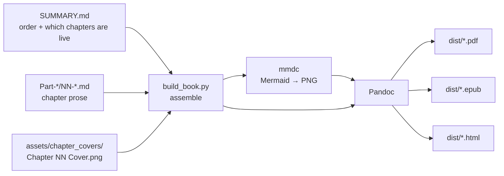

# Building the Published Handbook 🏗️

This repo is written as a GitHub-flavoured Markdown book. `SUMMARY.md` is the
table of contents, chapters live in `Part-*/`, and each finished chapter has a
full-page cover in `assets/chapter_covers/`. This document explains how those
pieces are combined into a **published artifact** — a print-ready PDF, an EPUB
ebook, and/or a standalone HTML file — using `scripts/build_book.py`.

Nothing here changes how the book renders on GitHub. The build reads the source,
assembles a temporary combined file in `build/`, and writes outputs to `dist/`.

## How the pieces combine



1. **Order & inclusion** come from `SUMMARY.md`. A chapter is treated as
   *published* only when its row links to a `.md` file that actually exists, so
   planned-but-unwritten chapters are skipped automatically. Keep `SUMMARY.md`
   current and the book builds in the right order with no other config.
2. **Covers** are matched to chapters by number: a file named
   `NN-Something.md` looks for `assets/chapter_covers/Chapter NN Cover.png` and,
   if found, drops it in as a full-bleed opener page *before* the chapter text.
   Covers never live in the prose, so GitHub stays clean.
3. **Mermaid diagrams** are pre-rendered to PNG with `mmdc`, because PDF/EPUB
   engines can't run Mermaid the way GitHub does. (PNG, not SVG: mmdc's SVG
   wraps labels in HTML `<foreignObject>` elements that WeasyPrint drops, so
   diagrams rendered as empty boxes.) Skip this with `--no-mermaid`
   (diagrams then appear as code blocks).
4. **Pandoc** turns the assembled Markdown into the final format(s); the PDF is
   styled by `scripts/print.css`.

## Prerequisites

The build shells out to two external tools. A Linux/macOS environment (or
Windows + WSL) is strongly recommended — WeasyPrint's native libraries are
painful to install on bare Windows.

| Tool | Purpose | Install |
| --- | --- | --- |
| **Pandoc** | Markdown → PDF/EPUB/HTML | `apt install pandoc` · `brew install pandoc` · [pandoc.org/installing](https://pandoc.org/installing.html) |
| **WeasyPrint** | HTML/CSS → PDF (Pandoc's PDF engine here) | `pipx install weasyprint` · [weasyprint docs](https://weasyprint.org) |
| **mermaid-cli** (`mmdc`) | Mermaid → SVG | `npm install -g @mermaid-js/mermaid-cli` |

For nice emoji and the Lato covers, also install the fonts the book uses:
`fonts-lato` and `fonts-noto-color-emoji` (Debian/Ubuntu) or the equivalents.

> **Tip.** Verify the source without installing anything:
> `python scripts/build_book.py --list` only reads `SUMMARY.md`.

### Windows quick start (WSL)

WeasyPrint is smoothest on Linux, so on Windows run the build inside WSL.

```powershell
# 1. In PowerShell (Administrator) — one time, then reboot:
wsl --install
```

```bash
# 2. In the Ubuntu terminal (unzip is needed or puppeteer's Chromium
#    download fails with "no zip archiver is available"):
sudo apt update
sudo apt install -y pandoc weasyprint nodejs npm unzip fonts-lato fonts-noto-color-emoji
sudo npm install -g @mermaid-js/mermaid-cli

# mermaid-cli drives headless Chromium; if `mmdc` errors about missing
# libraries, install its runtime deps:
sudo apt install -y libnss3 libatk1.0-0 libatk-bridge2.0-0 libcups2 libdrm2 \
  libxkbcommon0 libxcomposite1 libxdamage1 libxfixes3 libxrandr2 libgbm1 \
  libpango-1.0-0 libasound2

# 3. Check the tools are visible:
pandoc --version && weasyprint --version && mmdc --version

# 4. The Windows repo is mounted under /mnt/c — build from there:
cd /mnt/c/Dev/Kids_Engineering_handbook_RC_Cars
python3 scripts/build_book.py --pdf          # -> dist/VoltForgeGear.pdf
```

The finished `dist/` PDF is on your Windows drive, openable from Explorer.

## Usage

```bash
# dry run — list chapters + which covers were matched (no external tools)
python scripts/build_book.py --list

# print-ready PDF -> dist/VoltForgeGear.pdf
python scripts/build_book.py --pdf

# everything, plus the glossary as back matter
python scripts/build_book.py --pdf --epub --html --include-glossary

# fast preview without rendering diagrams
python scripts/build_book.py --pdf --no-mermaid

# partial build — only the listed NN- chapters (e.g. proofing a chapter)
python scripts/build_book.py --pdf --chapters 00,01
```

When building as root (WSL default-less setups, CI), Chromium refuses to
start without a sandbox flag. Point `MMDC_PUPPETEER_CONFIG` at a JSON file
containing `{"args": ["--no-sandbox"]}` and the script passes it to `mmdc`:

```bash
printf '{"args": ["--no-sandbox"]}' > /root/pptr.json
MMDC_PUPPETEER_CONFIG=/root/pptr.json python3 scripts/build_book.py --pdf
```

Outputs land in `dist/`; intermediates (combined Markdown, rendered diagrams)
land in `build/`. Both are safe to delete and should be added to `.gitignore`.

## Filename convention (important)

Covers are matched by the pattern **`Chapter NN Cover.png`** (two-digit number,
single spaces). The current Chapter 1 file `Chapter-01-Cover .png` won't match —
rename it to `Chapter 01 Cover.png` so the build finds it.

## What each output is good for

- **PDF** — the "published book": fixed layout, uses the full-page covers
  exactly as designed, best for print or sharing a single file.
- **EPUB** — reflowable ebook for phones and e-readers; covers appear inline and
  the first cover becomes the book cover.
- **HTML** — one self-contained page; handy for a quick web preview. For a
  proper browsable **website**, use Honkit or mdBook against the same
  `SUMMARY.md` (a separate, optional pipeline) and publish to GitHub Pages.

## Troubleshooting

- *A written chapter is missing from the PDF* → its `SUMMARY.md` row isn't a
  Markdown link to an existing file. Fix the link/path.
- *A cover didn't appear* → filename doesn't match `Chapter NN Cover.png`, or the
  chapter file isn't prefixed `NN-`.
- *Diagrams are code blocks, not pictures* → `mmdc` isn't on `PATH`, or you
  passed `--no-mermaid`.
- *Emoji render as tofu boxes* → install `fonts-noto-color-emoji` (WeasyPrint
  uses system fonts).
