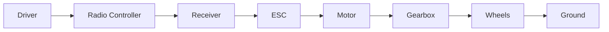
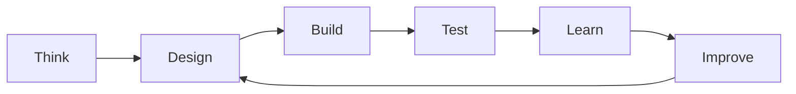

# Chapter 00 - How to Use This Handbook

> **Target Audience**
>
> This handbook is written for curious builders aged about 11 and older.
>
> You do **not** need to know engineering.
>
> You do **not** need to own a 3D printer.
>
> You do **not** need to have built an RC car before.
>
> You only need curiosity and the willingness to build, test and learn.

---

# Learning Objectives

By the end of this chapter you will be able to:

- Explain who this handbook is for and what you will build.
- Describe the engineering cycle and why it never finishes.
- Follow the five workshop rules.
- Set up your own engineering notebook.

---

# Welcome

Welcome!

Over the next few months you are going to become an engineer.

Not because someone gives you a certificate.

Not because you read lots of books.

But because you will learn to look at problems differently.

By the end of this handbook you will have designed and built your own 3D printed brushless RC buggy.

Along the way you will also learn ideas used by real engineers who design:

- Formula One cars
- Mars rovers
- Drones
- Aircraft
- Robots
- Spacecraft

The buggy is simply our classroom.

---

# This Is Not Just About RC Cars

Imagine someone teaches you to bake one cake.

You can make that cake.

But what happens if someone asks you to bake cookies?

Or bread?

Or pizza?

You might not know where to start.

Now imagine instead someone teaches you:

- ingredients
- mixing
- measuring
- cooking
- timing
- temperature

Now you can make hundreds of recipes.

Engineering is exactly the same.

We are **not** learning how to copy one RC car.

We are learning how machines work.

Once you understand the ideas, you can build almost anything.

---

# Our Goal

Our finished buggy will look something like this.

But before we build it...

...we need to understand it.

---

# The Engineering Cycle

Every engineer follows almost the same process.

It looks like this.

Notice something important.

There is **no Finish box.**

Good engineering is always improving.

Every version teaches us something.

---

# A Different Way of Thinking

Many beginners think engineering is about getting everything right the first time.

It isn't.

Real engineers expect mistakes.

Imagine learning to ride a bicycle.

The first time you try you wobble.

Maybe you fall over.

That doesn't mean you failed.

It means your brain has collected new information.

The next attempt is better.

Engineering works exactly the same way.

Every failed print...

Every broken part...

Every loose screw...

Every stripped thread...

Every crash...

is information.

Failures are not enemies.

They are teachers.

---

# Our Workshop Rules

Whenever we build something we follow five simple rules.

---

## Rule 1

Understand before building.

It is tempting to start printing parts immediately.

Don't.

If you understand *why* something exists, designing it becomes much easier.

---

## Rule 2

Measure before cutting.

Imagine buying a new shelf.

You cut all the wood.

Then you discover it is 10 mm too short.

Now you need to buy more wood.

Professional engineers measure many times.

Then they cut once.

---

## Rule 3

Change one thing at a time.

Suppose your buggy drives badly.

You change:

- tyres
- suspension
- motor
- battery
- gearing

Now it drives better.

Which change helped?

You don't know.

Instead...

Change one thing.

Test.

Observe.

Repeat.

---

## Rule 4

Write everything down.

Engineers have terrible memories.

Instead they keep notebooks.

Every design decision.

Every measurement.

Every failure.

Every improvement.

If Version 8 is worse than Version 7...

...you can always go back.

---

## Rule 5

Stay curious.

Never stop asking:

> Why?

Children ask this naturally.

Great engineers never stop.

---

# The Four Questions

Whenever we learn something new, we will answer four questions.

## What is it?

First we identify the thing.

---

## Why does it exist?

Every part has a purpose.

Nothing is there by accident.

---

## How does it work?

Only after understanding its purpose do we learn how it works.

---

## Could we improve it?

Now we begin thinking like designers.

---

# How This Book Is Organised

Each chapter follows the same pattern.

1. **Learning Objectives** - what you will be able to do.
2. **Before We Begin** - a short story to set the scene.
3. **Simple Explanations** - the ideas, one small step at a time.
4. **Hands-On Activities** - experiments you can try yourself.
5. **Engineering Challenge** - a bigger task to test your new skills.
6. **Chapter Summary** - the key ideas in one place.
7. **New Words** - the vocabulary you have learned.
8. **Review Questions** - check your understanding.
9. **Chapter Checklist** - tick off what you completed.
10. **Looking Ahead** - a preview of the next chapter.

This means every chapter builds naturally on the previous one.

---

# Engineering Notebook

One of the best habits you can develop is keeping an engineering notebook.

It can be:

- a paper notebook
- a sketchbook
- a tablet
- a Markdown folder
- Obsidian
- Joplin
- OneNote

It doesn't matter.

Just write things down.

For every experiment record:

- Date
- What you built
- What happened
- What surprised you
- What you learned
- What you will try next

Professional engineers do exactly this.

---

# Our First Engineering Challenge

Look around your room.

Choose one object.

It could be:

- a chair
- a bicycle
- headphones
- a computer mouse
- a lamp
- a keyboard

Now answer these questions.

1. What is its job?
2. What smaller parts does it contain?
3. Which parts move?
4. Which parts do not move?
5. Which parts carry weight?
6. Which part would break first?
7. If you could redesign it, what would you change?

Congratulations.

You have just started thinking like an engineer.

---

# Remember This

The goal of this handbook is **not** to build a perfect RC buggy.

The goal is to become the kind of person who can design machines.

The buggy is simply the first machine we will build.

---

# Chapter Summary

You have learned that:

- Engineering is a way of thinking.
- Mistakes are valuable.
- Engineers improve things through many small steps.
- Good engineers measure, observe and record.
- Every machine is made from smaller systems.
- Curiosity is one of the most important engineering tools.

---

# New Words

| Word | Meaning |
|---|---|
| Machine | Something made from parts working together to do useful work, such as a bicycle, a clock or an RC buggy. |
| Engineer | Someone who designs, improves and understands how things work. They do not know every answer, but they know how to discover answers. |
| Design | A plan for building something. Recipes tell you how to bake a cake; designs tell you how to build a machine. |
| Prototype | A practice version. Its job is not to be perfect. Its job is to teach us something. |

---

# Review Questions

1. What is the goal of this handbook?
2. What are the six steps of the engineering cycle?
3. Why is there no Finish box in the engineering cycle?
4. Why do engineers change only one thing at a time when testing?
5. What should you record in your engineering notebook after every experiment?
6. Why are failures useful to an engineer?

---

# Chapter Checklist

- [ ] I understand what this handbook is trying to teach.
- [ ] I know the engineering cycle.
- [ ] I understand why prototypes exist.
- [ ] I have started an engineering notebook.
- [ ] I completed the first engineering challenge.
- [ ] I am ready to start learning how machines are organised.

---

# Looking Ahead

In the next chapter we answer a simple question:

**What are we actually building?**

We will open up the RC buggy and discover that it is not one machine at all.

It is a team of smaller systems, each with its own job.