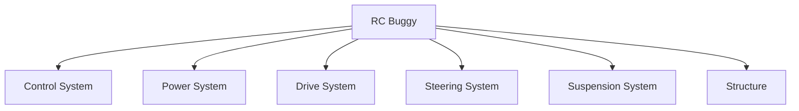
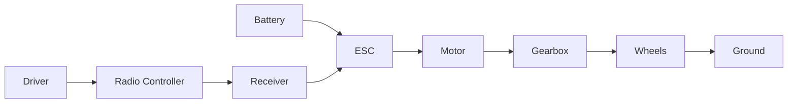

# Chapter 01 - What Are We Building?

> **"To understand a machine, don't start with the smallest part.
> Start by asking what job the whole machine is trying to do."**

---

# Learning Objectives

By the end of this chapter you will be able to:

- Explain the main purpose of an RC buggy.
- Identify the major systems inside the buggy.
- Understand why engineers divide complex machines into smaller pieces.
- Begin looking at everyday objects as collections of systems.

---

# Before We Begin

Imagine somebody hands you a cardboard box.

Inside the box are **1,200 LEGO pieces.**

There are wheels.

Windows.

Doors.

Axles.

Tiny coloured bricks.

Long beams.

Pins.

Nothing is assembled.

Now imagine they ask you:

> "Can you build the castle?"

Most people would immediately start looking for instructions.

Why?

Because a castle is **too complicated to think about all at once.**

Instead we naturally divide it into smaller jobs.

First the walls.

Then the towers.

Then the gates.

Then the roof.

Finally the decorations.

Without even realising it, you have used one of the most important engineering ideas.

> **Break a big problem into smaller problems.**

This chapter is all about learning that skill.

---

# What Is an RC Buggy?

Before we can build one, we should answer a simple question.

## What is its job?

Take a minute before reading further.

Really think about it.

What does an RC buggy actually do?

You might answer:

> "It drives."

That is true.

But engineers like more precise answers.

A better answer is:

> **An RC buggy converts electrical energy into controlled movement.**

Don't worry if that sentence sounds complicated.

We are going to unpack every part of it.

---

# A Simpler Explanation

Imagine pushing a shopping trolley.

You decide:

- where it goes
- how fast it moves
- when it stops
- when it turns

You are controlling movement.

An RC buggy does exactly the same thing.

The only difference is that your hands are replaced by a radio controller.

---

# One Big Job

Every machine has **one main purpose**.

A toaster heats bread.

A washing machine cleans clothes.

A drill makes holes.

An RC buggy's purpose is simple:

> **Move where the driver wants it to move.**

Everything else exists to help achieve that goal.

---

# The Ice Cream Shop

Let's imagine something completely different.

Suppose you own an ice cream shop.

Many different people work there.

One person serves customers.

One person makes the ice cream.

One person cleans the shop.

One person orders ingredients.

One person takes payments.

If everybody tried to do every job...

...the shop would become chaos.

Instead each person has a specific responsibility.

Machines work exactly the same way.

Instead of people...

they have **systems**.

---

# A New Word

## System

A **system** is simply:

> **A group of parts working together to perform one job.**

That's all.

Nothing mysterious.

Your body is a system.

Your school is a system.

Your computer is a system.

An RC buggy is also a system.

---

# Looking Inside the Buggy

Instead of seeing one machine...

let's imagine opening it up.



Each box has one important job.

Let's meet them one by one.

---

# System 1 - The Brain

Imagine riding a bicycle.

Your brain decides:

- Go faster.
- Slow down.
- Turn left.
- Stop.

Your muscles then carry out those instructions.

The buggy also has a brain.

Not a thinking brain like yours.

A control brain.

Its job is to receive commands from the radio controller.

Later we will discover this system contains:

- radio receiver
- ESC
- servo

For now just remember:

> The brain decides what the buggy should do.

---

# System 2 - The Muscles

Your muscles move your body.

The buggy has muscles too.

Those muscles are called the **motor**.

The motor spins.

That spinning motion eventually turns the wheels.

Without muscles...

nothing moves.

---

# System 3 - The Skeleton

Stand up.

Feel your back.

Feel your shoulders.

Feel your arms.

Your bones keep everything in the correct place.

Without bones...

your muscles would have nothing to pull against.

The buggy also has bones.

Engineers call this the **chassis**.

The chassis holds everything together.

```text
Motor
   |
Battery
   |
Receiver
   |
Servo

All mounted onto

====================
      CHASSIS
====================
```

Think of the chassis as the backbone of the entire machine.

---

# System 4 - The Joints

Your knees bend.

Your elbows bend.

Your ankles bend.

These joints allow movement while still keeping everything connected.

The buggy needs something similar.

Its suspension allows the wheels to move up and down while keeping them attached to the car.

Without suspension...

every bump would launch the buggy into the air.

---

# System 5 - The Feet

Imagine trying to run while wearing socks on an ice rink.

It wouldn't work very well.

Your shoes grip the ground.

The buggy's tyres perform the same job.

The motor never actually pushes against the road.

The tyres do.

This is an important idea.

The motor only spins.

The tyres create movement by pushing against the ground.

---

# System 6 - The Food Supply

Imagine running a race without breakfast.

Eventually you become tired.

Machines also need energy.

Instead of food...

our buggy eats electricity.

That electricity comes from a battery.

The battery stores energy until we need it.

---

# Putting Everything Together

Now we can draw the complete picture.



Don't worry if some of those words are unfamiliar.

Each one will have its own chapter later.

---

# Why Engineers Divide Machines Into Systems

Imagine your television stops working.

Would you replace:

- the screen
- the speakers
- the remote
- the power cable
- every circuit board

Probably not.

Instead you first ask:

> Which system has failed?

Engineers do exactly this.

Breaking a machine into systems makes solving problems much easier.

---

# Everyday Systems

Let's practise.

Can you identify the systems inside these objects?

## Bicycle

Possible systems:

- steering
- brakes
- drivetrain
- frame
- wheels

---

## Computer

Possible systems:

- power supply
- processor
- memory
- storage
- display
- keyboard

---

## Human Body

Possible systems:

- skeleton
- muscles
- nervous system
- digestive system
- breathing system

Notice something?

Very different machines.

Very similar idea.

Everything is built from systems.

---

# Engineering Thinking

From now on, whenever you see a machine, ask yourself:

> What systems can I find?

This simple question is one of the biggest differences between an engineer and everyone else.

Most people see:

"A bicycle."

An engineer sees:

- frame
- steering
- drivetrain
- brakes
- wheels
- bearings
- fasteners

The engineer sees the hidden structure.

---

# Mini Investigation

Choose one object nearby.

It could be:

- headphones
- office chair
- fan
- printer
- vacuum cleaner
- keyboard
- toy

Now answer:

1. What is the machine trying to do?
2. What systems can you identify?
3. Which system looks most complicated?
4. Which system would you redesign?

Write your answers in your engineering notebook.

---

# Common Beginner Mistakes

## Mistake 1

"I need to understand every part before I start."

No.

Understand the big picture first.

The details come later.

---

## Mistake 2

Thinking the motor "moves the buggy."

The motor only spins.

Many other systems are needed before the buggy actually moves.

---

## Mistake 3

Trying to memorise names.

Don't memorise.

Understand.

The names become easy once the ideas make sense.

---

# Chapter Challenge

Draw your own RC buggy.

It does **not** have to be accurate.

Instead, draw six boxes.

Label them:

- Brain
- Muscles
- Skeleton
- Joints
- Feet
- Food Supply

Draw arrows showing how they work together.

Don't worry about getting it perfect.

This drawing will become better every time you learn something new.

---

# Chapter Summary

In this chapter we discovered that an RC buggy is **not one machine.**

It is a collection of smaller systems.

Each system performs one job.

Together they allow the buggy to move exactly where the driver wants.

This idea might seem simple.

But almost every engineering project begins in exactly this way.

Before solving problems...

understand the system.

---

# New Words

| Word | Meaning |
|---|---|
| Machine | Something built from parts that performs useful work. |
| System | A group of parts working together to perform one job. |
| Chassis | The main structural frame of the buggy. |
| Motor | Converts electrical energy into spinning motion. |
| Suspension | Allows the wheels to move over bumps while keeping control. |

---

# Review Questions

1. What is the main job of an RC buggy?
2. In your own words, what is a system?
3. Name three systems inside the RC buggy and the job each one does.
4. Why do engineers break big machines into smaller systems?
5. The motor only spins. What else is needed before the buggy actually moves?
6. What systems can you find in a bicycle?

---

# Chapter Checklist

- [ ] I know the main job of an RC buggy.
- [ ] I understand what a system is.
- [ ] I can identify the major systems inside the buggy.
- [ ] I completed the investigation activity.
- [ ] I drew my first system diagram.
- [ ] I added notes to my engineering notebook.

---

# Looking Ahead

In the next chapter we will learn a new way of seeing machines.

Instead of looking at individual parts...

we will learn to see **connections**.

This is called **Systems Thinking**, and it is one of the most powerful tools used by engineers.