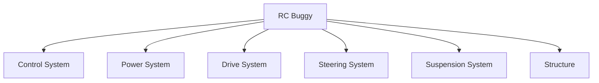
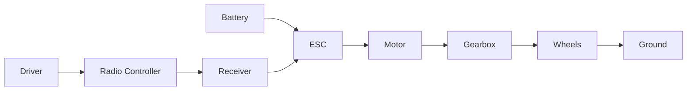

# Chapter 01 - What Are We Building? 🏎️

> **"To understand a machine, don't start with the smallest part.
> Start by asking what job the whole machine is trying to do."**

---

# Learning Objectives 🎯

By the end of this chapter you will be able to:

- Explain the main purpose of an RC buggy.
- Identify the major systems inside the buggy.
- Understand why engineers divide complex machines into smaller pieces.
- Begin looking at everyday objects as collections of systems.

---

# Before We Begin 🧱

Imagine somebody hands you a cardboard box. Inside are **1,200 LEGO
pieces**: wheels, windows, doors, axles, tiny coloured bricks, long beams
and pins. Nothing is assembled.

Now imagine they ask you:

> "Can you build the castle?"

Most people would immediately start looking for instructions. Why? Because a
castle is **too complicated to think about all at once**. Instead we
naturally divide it into smaller jobs: first the walls, then the towers,
then the gates, then the roof, and finally the decorations.

Without even realising it, you have used one of the most important
engineering ideas.

> **Break a big problem into smaller problems.**

This chapter is about learning that skill, and our RC buggy is the perfect
machine to practise on - because, as we are about to see, it is really six
smaller machines working together.

---

# What Is an RC Buggy?

Before we can build one, we should answer a simple question.

## What is its job?

Take a minute before reading further and really think about it. What does an
RC buggy actually do?

You might answer:

> "It drives."

That is true, but engineers like more precise answers. A better answer is:

> **An RC buggy converts electrical energy into controlled movement.**

Don't worry if that sentence sounds complicated. We are going to unpack
every part of it.

---

# A Simpler Explanation 🛒

Imagine pushing a shopping trolley.

You decide:

- where it goes
- how fast it moves
- when it stops
- when it turns

You are controlling movement. An RC buggy does exactly the same thing - the
only difference is that your hands are replaced by a radio controller.

---

# One Big Job

Every machine has **one main purpose**. A toaster heats bread, a washing
machine cleans clothes, a drill makes holes.

An RC buggy's purpose is simple:

> **Move where the driver wants it to move.**

Everything else exists to help achieve that goal.

---

# The Ice Cream Shop 🍦

Let's imagine something completely different. Suppose you own an ice cream
shop where many different people work. One person serves customers, one
makes the ice cream, one cleans the shop, one orders ingredients, and one
takes payments.

If everybody tried to do every job, the shop would become chaos. Instead,
each person has a specific responsibility. Machines work exactly the same
way - but instead of people, they have **systems**.

---

# A New Word

## System

A **system** is simply:

> **A group of parts working together to perform one job.**

That's all - nothing mysterious. Your body is a system. So is your school,
and so is your computer. An RC buggy is also a system.

---

# Looking Inside the Buggy 🔍

Instead of seeing one machine, let's imagine opening it up.

Each box has one important job. Let's meet them one by one.

---

# System 1 - The Brain 🧠

Imagine riding a bicycle. Your brain decides: go faster, slow down, turn
left, stop. Your muscles then carry out those instructions.

The buggy also has a brain - not a thinking brain like yours, but a control
brain. Its job is to receive commands from the radio controller.

Later we will discover this system contains:

- a radio receiver (the part that hears the controller's signals - Chapter 23)
- an ESC (the motor's electronic speed controller - Chapter 25)
- a servo (a small motor that turns the steering - Chapter 24)

For now just remember:

> The brain decides what the buggy should do.

---

# System 2 - The Muscles 💪

Your muscles move your body, and the buggy has muscles too. Those muscles
are called the **motor**. The motor spins, and that spinning motion
eventually turns the wheels.

Without muscles, nothing moves.

---

# System 3 - The Skeleton 🦴

Stand up and feel your back, your shoulders, your arms. Your bones keep
everything in the correct place. Without bones, your muscles would have
nothing to pull against.

The buggy also has bones. Engineers call this the **chassis**, and it holds
everything together.

> **[Sketch: side view of a flat chassis plate with the motor, battery,
> receiver and servo mounted on top, each part labelled, showing one
> structural part holding everything in place]**

Think of the chassis as the backbone of the entire machine.

---

# System 4 - The Joints 🦵

Your knees, elbows and ankles bend. These joints allow movement while still
keeping everything connected.

The buggy needs something similar. Its suspension allows the wheels to move
up and down while keeping them attached to the car.

> **🤔 Think about it.** Jump off a low step and land with stiff, straight
> legs. Now jump again and land with bent knees. Which landing felt
> softer - and where did the "thump" go?

When a wheel hits a bump, the bump gives the wheel a sharp push upwards,
and that push has to go somewhere. With suspension, the wheel rides up over
the bump on its own while a spring soaks up the push - just like your bent
knees - and the body of the buggy barely moves. Without suspension, the
whole buggy takes the hit at once: the push flings the entire car upwards,
the tyres leave the ground, and a buggy in the air cannot steer or brake.

> **[Sketch: two side-by-side views of the buggy hitting the same bump -
> left "no suspension": the whole buggy pitched into the air, all four
> tyres off the ground; right "with suspension": one wheel riding up over
> the bump while the body stays level and the other tyres stay pressed on
> the ground]**

---

# System 5 - The Feet 👟

Imagine trying to run while wearing socks on an ice rink. It wouldn't work
very well, because your shoes are what grip the ground. The buggy's tyres
perform the same job.

This is an important idea:

> The motor never actually pushes against the road.
> The motor only spins.
> The tyres create movement by pushing against the ground.

---

# System 6 - The Food Supply 🔋

Imagine running a race without breakfast - eventually you become tired.
Machines also need energy. Instead of food, our buggy eats electricity,
which comes from a battery. The battery stores energy until we need it.

---

# Putting Everything Together 🧩

Now we can draw the complete picture.

Don't worry if some of those words are unfamiliar. Each one will have its
own chapter later.

> **☕ Good place to pause.** Stretch, get a drink, or look at a machine
> near you and guess what its systems are. The next section starts a new
> idea.

---

# Why Engineers Divide Machines Into Systems

Imagine your television stops working. Would you replace the screen, the
speakers, the remote, the power cable and every circuit board all at once?
Probably not. Instead you first ask:

> Which system has failed?

Engineers do exactly this. Breaking a machine into systems makes solving
problems much easier.

---

# Everyday Systems 🚲

Let's practise. Can you identify the systems inside these objects?

## Bicycle

Possible systems:

- steering
- brakes
- drivetrain (the chain and gears that carry your pedalling to the back
  wheel - Chapter 3 meets the buggy's version)
- frame
- wheels

## Computer

Possible systems:

- power supply
- processor
- memory
- storage
- display
- keyboard

## Human Body

Possible systems:

- skeleton
- muscles
- nervous system
- digestive system
- breathing system

Notice something? Very different machines, very similar idea: everything is
built from systems.

> **📚 Learn more**
>
> - BBC Bitesize (KS2 Design and Technology): search "mechanical systems" -
>   levers, gears and pulleys: everyday machines broken into simple parts
>   that each do one job
> - Explain That Stuff: search "tools and machines" - friendly explanations
>   of how familiar machines work inside

---

# Engineering Thinking

From now on, whenever you see a machine, ask yourself:

> What systems can I find?

This simple question is one of the biggest differences between an engineer
and everyone else.

Most people see "a bicycle". An engineer sees:

- frame
- steering
- drivetrain
- brakes
- wheels
- bearings (smooth rings that let the wheels spin freely)
- fasteners (the screws and bolts holding it all together)

The engineer sees the hidden structure.

---

# Hands-On Activity 1 - Systems Hunt 🔎

No equipment needed - just your eyes and your engineering notebook.

Choose one object nearby. It could be:

- headphones
- office chair
- fan
- printer
- vacuum cleaner
- keyboard
- toy

Now answer:

1. What is the machine trying to do?
2. What systems can you identify?
3. Which system looks most complicated?
4. Which system would you redesign?

Write your answers in your engineering notebook.

---

# Hands-On Activity 2 - Draw Your Buggy as Six Boxes ✏️

No equipment needed - just paper and a pencil.

Draw your own RC buggy. It does **not** have to be accurate. Instead, draw
six boxes and label them:

- Brain
- Muscles
- Skeleton
- Joints
- Feet
- Food Supply

Draw arrows showing how they work together. Don't worry about getting it
perfect - this drawing will become better every time you learn something
new.

---

# Chapter Mini Project - The Cotton Reel Crawler 🛠️

Time to build a machine you can keep. This one is nearly a hundred years
old - children were building it from scraps during the Second World War -
and it contains the same systems you have just met.

You will need:

- an empty thread spool (a "cotton reel") - a short, stiff cardboard tube
  works too
- a rubber band a little longer than the spool
- a paper clip or used matchstick
- a pencil (or a lolly stick)
- a thin slice of candle with a hole through it, a metal washer, or a dab
  of solid soap
- sticky tape and scissors

> **⚠️ SAFETY**
>
> Ask an adult to cut the candle slice and make its hole. Scissors cut
> card and fingers equally well - cut away from yourself, on a table.

If you would like to see the build before trying it:

> **🎬 Watch the build**
>
> - Instructables (instructables.com): search "cotton reel tanks" - a
>   seven-step photo build of exactly this machine
> - YouTube: search "cotton reel tank" with an adult - short videos showing
>   the winding and the crawl
> - Minieco (minieco.co.uk): search "cotton reel tanks" - photos of
>   finished tanks, plus a trick: notch the rims and it climbs over
>   obstacles

Build steps:

1. Push the rubber band all the way through the hole in the spool.
2. At one end, slip the paper clip through the loop and tape it flat
   against the spool, so the band cannot turn at that end.
3. At the other end, thread the band through the candle slice (or washer),
   then slip the pencil through the loop.
4. Wind the pencil round and round - 20 to 40 turns - so the band twists up
   tight inside the spool.
5. Put the crawler on the floor, pencil trailing behind, and let go.

If the spool spins without moving, it needs grip: stretch a spare rubber
band around each rim as a tyre. If it stops instantly, the pencil may be
jamming - the candle slice is there to let it slide smoothly.

Now the engineering part. Your crawler is a complete machine, so find its
systems:

- Where is the energy stored? The twisted rubber band is its battery.
- What are its muscles? The band untwisting is its motor.
- What is its skeleton? The spool holds everything together.
- What are its feet? The rims - and the tyre bands, if you added them,
  grip just like the buggy's tyres.
- What does the trailing pencil do? It presses against the floor so the
  twisting force turns the spool instead of spinning the pencil - it is
  part of how the muscle power reaches the feet.

And one system is missing. There is no brain: **you** are the control
system, deciding how many turns to wind. In Part 3 we will give our buggy
a real control system, so the driver's commands arrive by radio instead.

Put the crawler somewhere safe - a shelf, a windowsill, a box lid. It is
the first machine in your engineering showcase 🏆, and by the end of this
book it will have plenty of company.

---

# Common Beginner Mistakes ❌

## Mistake 1 - Trying to understand every part first

"I need to understand every part before I start." No - understand the big
picture first. The details come later.

## Mistake 2 - Thinking the motor moves the buggy

The motor only spins. Many other systems are needed before the buggy
actually moves.

## Mistake 3 - Memorising names instead of ideas

Don't memorise - understand. The names become easy once the ideas make
sense.

---

# Chapter Summary 📝

In this chapter we discovered that an RC buggy is **not one machine**. It is
a collection of smaller systems, and each system performs one job. Together
they allow the buggy to move exactly where the driver wants.

This idea might seem simple, but almost every engineering project begins in
exactly this way. Before solving problems, understand the system.

---

# New Words 📖

| Word | Meaning |
|---|---|
| Machine | Something built from parts that performs useful work. |
| System | A group of parts working together to perform one job. |
| Chassis | The main structural frame of the buggy. |
| Motor | Converts electrical energy into spinning motion. |
| Suspension | Allows the wheels to move over bumps while keeping control. |

---

# Review Questions ❓

1. What is the main job of an RC buggy?
2. In your own words, what is a system?
3. Name three systems inside the RC buggy and the job each one does.
4. Why do engineers break big machines into smaller systems?
5. The motor only spins. What else is needed before the buggy actually moves?
6. What systems can you find in a bicycle?
7. The chapter compares the chassis to your bones. Why is that a good
   comparison? What would happen to the buggy without it?
8. Your buggy switches on, but the wheels do not turn when you steer with
   the controller. Which system would you check first, and why?
9. A friend says: "The battery makes the buggy move, so the battery is the
   most important system." Do you agree? Explain your answer.
10. Pick a machine in your home. What is its one main purpose, and which
    systems help it do that job?

---

# Chapter Checklist ✅

- [ ] I know the main job of an RC buggy.
- [ ] I understand what a system is.
- [ ] I can identify the major systems inside the buggy.
- [ ] I completed the Systems Hunt activity.
- [ ] I drew my buggy as six labelled boxes.
- [ ] I built the cotton reel crawler and found each of its systems.
- [ ] My crawler is on my showcase shelf.
- [ ] I added notes to my engineering notebook.

---

# Looking Ahead 🔭

In the next chapter, **Chapter 2 - Systems Thinking**, we will learn a new
way of seeing machines. Instead of looking at individual parts, we will
learn to see **connections** - one of the most powerful tools used by
engineers.
