# Chapter 02 - Systems Thinking

> **"A pile of parts is not a machine.  
> The relationships between the parts are what make the machine work."**

---

# Learning Objectives 🎯

By the end of this chapter you will be able to:

- Explain what **systems thinking** means.
- Describe a system using inputs, processes and outputs.
- Recognise a system boundary.
- Find feedback loops in everyday life.
- Explain why changing one buggy part may affect several other parts.
- Draw a system map for the RC buggy.

---

# Before We Begin

Imagine placing these items on a table:

- two wheels
- a chain
- pedals
- handlebars
- a seat
- a bicycle frame

Do you have a bicycle?

Not yet. You have the correct parts, but they are not connected. Now imagine connecting the handlebars to the seat and the pedals to the front wheel. You still do not have a useful bicycle, because the parts must be connected in the **right way**.

This gives us an important engineering idea:

> A machine is not only made from parts.  
> It is also made from relationships.

A relationship tells us how one part affects another. In our buggy, the motor affects the gears, the gears affect the wheels, the wheels affect the ground, and the ground affects the movement of the whole machine.

Systems thinking is the skill of seeing those relationships.

---

# A Simple Story: The Bath That Will Not Fill 🛁

Imagine turning on a bath tap. Water flows into the bath - but someone forgot to put in the plug, so water is also escaping through the drain. You might turn the tap higher, and more water enters. But if water leaves faster than it enters, the bath still will not fill.

Looking only at the tap does not explain the problem. You must look at the whole system:

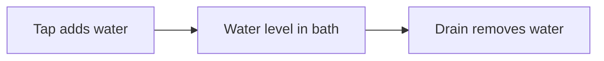

The water level depends on both the tap and the drain.

This is systems thinking. It means asking:

- What enters the system?
- What happens inside it?
- What leaves?
- What parts affect one another?
- What happens when one part changes?

---

# A New Engineering Phrase

## Systems Thinking

The bath, the tap and the drain worked together. Our buggy is exactly the same: the battery, motor, gears and wheels only make sense together. Engineers have a name for seeing machines this way.

**Systems thinking** means:

> Looking at the whole machine and the connections between its parts, instead of studying each part alone.

It does not mean ignoring details.

It means understanding the whole first, then studying the details in the correct place.

---

# Input, Process and Output

Most systems can be understood using three simple ideas.

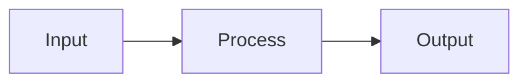

## Input

An **input** is something that enters a system.

It could be:

- energy
- information
- material
- movement
- a command

## Process

A **process** is what the system does with the input.

It changes, moves, stores, measures or controls something.

## Output

An **output** is what leaves the system.

It could be:

- movement
- sound
- heat
- light
- information
- a finished object

> **📚 Learn more**
>
> - BBC Bitesize (GCSE Design and Technology): search "systems approach
>   to designing" - inputs, processes and outputs the way school D&T
>   teaches them (a GCSE topic, so a look ahead)

---

# Example 1 - A Toaster

A toaster is simple enough to study.

## Inputs

- Bread
- Electrical energy
- A darkness setting
- The user's command to start

## Process

- Electrical energy heats metal wires.
- The hot wires warm the bread.
- A timer decides when to stop.

## Outputs

- Toast
- Heat
- A clicking sound
- The bread popping upward

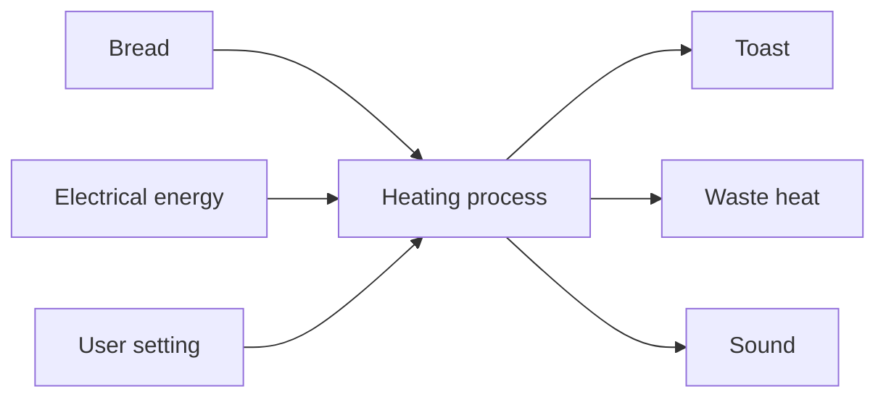

Notice that one system can have several inputs and several outputs.

---

# Example 2 - The RC Buggy

Our buggy also has inputs, processes and outputs.

## Inputs

- Electrical energy from the battery
- Steering commands from the driver
- Speed commands from the driver
- Forces from bumps, jumps and crashes
- Air moving around the body

## Processes

- The receiver reads radio commands.
- The ESC (the motor's electronic speed controller - Chapter 25) controls electrical power.
- The motor converts electrical energy into rotation.
- The gearbox changes speed and twisting force.
- The steering system changes wheel direction.
- The suspension allows the wheels to follow the ground.

## Outputs

- Forward or backward movement
- Turning
- Heat
- Sound
- Vibration
- Tyre wear

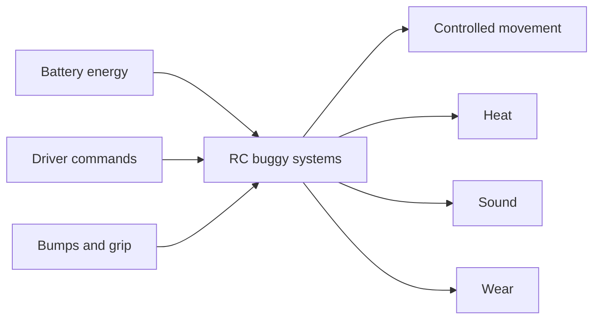

The main output is movement. But the unwanted outputs matter too: heat may damage electronics, vibration may loosen screws, and wear may reduce grip.

A good engineer notices both useful and unwanted outputs.

---

# Useful Outputs and Unwanted Outputs

Imagine a hair dryer. Its useful output is warm moving air. Its unwanted outputs include:

- noise
- wasted heat
- vibration

Machines nearly always create more than one output, and the same is true for the buggy.

| System | Useful output | Possible unwanted output |
|---|---|---|
| Motor | Rotation | Heat |
| Gearbox | Changed speed and torque | Noise and wear |
| Tyres | Grip | Wear |
| Suspension | Controlled wheel movement | Friction |
| Battery | Electrical energy | Heat |

An unwanted output is not always a failure. Sometimes it is simply a cost of making the useful output.

---

# System Boundaries

Imagine drawing a circle around the toaster. Everything inside the circle belongs to the toaster system, and everything outside it belongs to the environment around it.

That circle is called a **system boundary**.

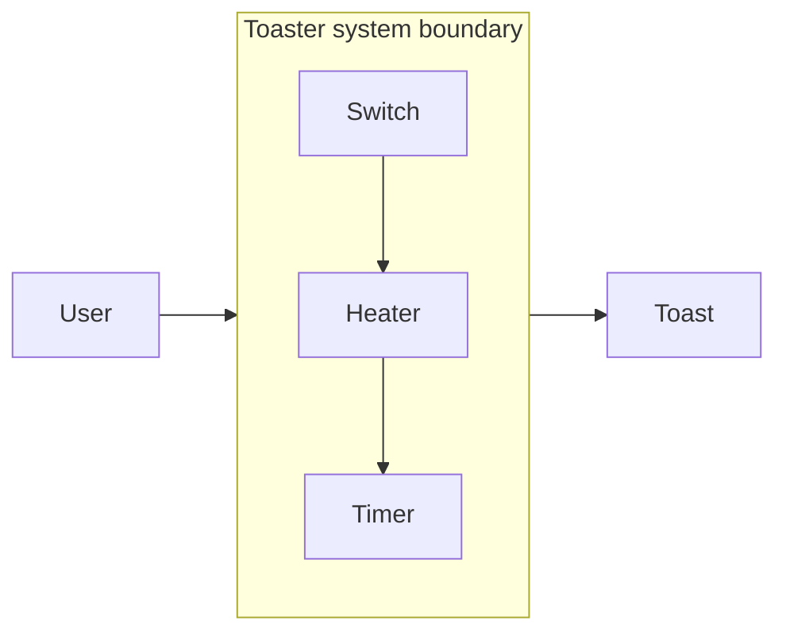

A boundary is not always a real wall. It is a thinking tool that helps us decide what we are studying.

---

# Choosing the Right Boundary

Suppose the buggy is moving slowly. We could study only the motor, which gives us a small boundary.

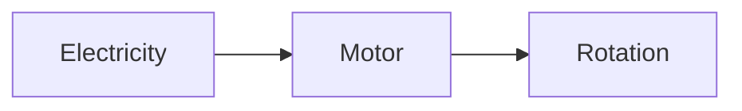

But the problem may not be inside the motor. It could be caused by:

- a weak battery
- an incorrect gear ratio
- tight bearings
- tyres rubbing the body
- a brake setting in the ESC
- rough ground

We may need a larger boundary.

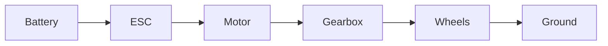

The correct boundary depends on the question: a small boundary helps us study detail, and a large boundary helps us find hidden connections.

---

# The Buggy Is a System of Systems

In Chapter 01, we divided the buggy into major systems. Each of those systems contains smaller systems.

For example, the drive system may contain:

- motor
- pinion gear
- spur gear
- differential
- driveshafts
- axles
- wheels

Do not worry if some of those part names are new - we will meet them all properly in Chapter 3.

This kind of smaller system inside a larger system is called a **subsystem**.

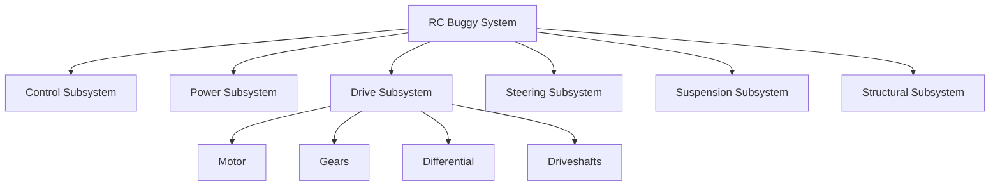

> **[Sketch: photo or labelled drawing of the real buggy with the six
> subsystems annotated - control, power, drive, steering, suspension,
> structure - so the abstract tree above maps onto a real object]**

We can keep dividing until we reach individual parts, but we do not always need to. We stop when we have enough detail to answer the current question.

---

# Connections Carry Things

Parts inside a system communicate through connections.

A connection may carry:

- energy
- force
- motion
- information
- heat
- material

Consider the battery cable. It is not just a piece of wire - it is a connection that carries electrical energy. The driveshaft is a connection that carries rotation and torque (twisting force - Chapter 3 explains it properly). The radio signal is a connection that carries information.

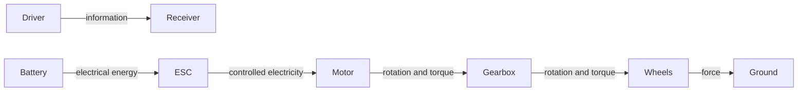

When studying a system, always ask:

> What travels through this connection?

> **📚 Learn more**
>
> - BBC Bitesize (KS3 Physics): search "energy stores and transfers" -
>   how energy moves from store to store; most of the buggy's connections
>   are carrying energy from one place to another

---

# A Chain of Dependence

> **🤔 Think about it.** Suppose we fit the buggy with much larger tyres. Before reading on, write down two other things you think would change. Bigger tyres roll farther in one turn - so is that change free?

Larger tyres would carry the buggy farther with every turn of the motor - but the motor would have to push harder on every turn, drawing more electrical current and making more heat. One "simple" change ripples through the whole machine. Let us follow a ripple like that, step by step.

Imagine that the battery is nearly empty. What happens next?

1. Battery voltage falls.
2. The ESC has less electrical energy available.
3. The motor produces less useful power.
4. The wheels accelerate more slowly.
5. The buggy feels weak.

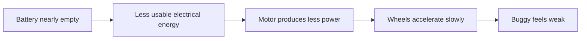

One change can travel through the whole system.

This is called a **chain of cause and effect**.

---

# Cause and Effect

A **cause** is something that creates a change.

An **effect** is the result of that change.

Example:

- Cause: A wheel bearing becomes tight.
- Effect: The wheel becomes harder to turn.

But the chain may continue:

- The motor works harder.
- More electrical current flows.
- The motor and ESC become hotter.
- The battery empties faster.
- The buggy slows down.

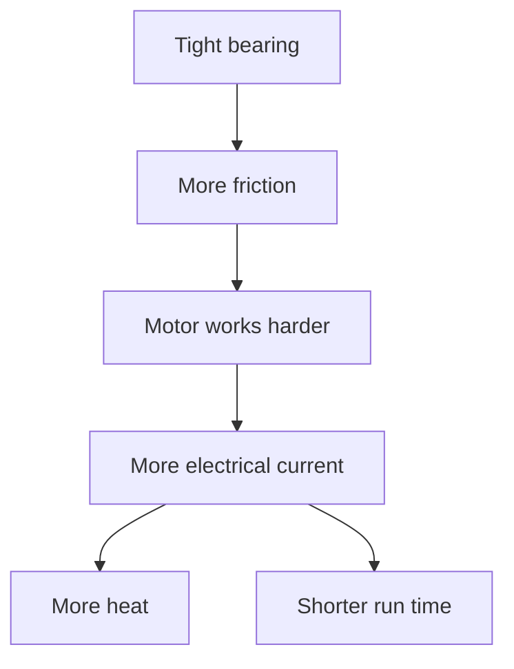

The tight bearing is a small mechanical problem, but it creates electrical and thermal effects too. That is why systems thinking matters.

---

> **☕ Good place to pause.** Stretch, get a drink, or try following one change through the buggy (Activity 2) now. The next section starts a new idea: feedback.

---

# Feedback 🔁

> **🤔 Think about it.** Find a straight line on the floor - a floorboard edge or a line between tiles. Walk along it with your eyes open. Easy. Now try it with your eyes closed. Why do you drift off the line without noticing?

With your eyes closed you still know how to walk - but you get no information about the result of each step, so small errors quietly pile up. Open your eyes and everything changes: you can see when you move away from the line, and you correct your direction.

This repeated loop - act, observe, compare, correct - is called **feedback**.

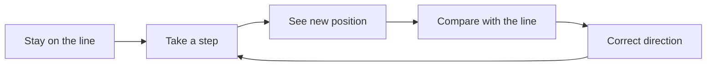

Feedback means:

> Using information about a result to decide what to do next.

> **📚 Learn more**
>
> - Explain That Stuff (explainthatstuff.com): search "thermostats" -
>   the thermostat that keeps your house warm is a machine built entirely
>   around feedback: it measures, compares and corrects, all day long

---

# Feedback While Driving

When driving the buggy:

1. You move the steering control.
2. The buggy turns.
3. Your eyes observe the new direction.
4. Your brain compares it with the direction you wanted.
5. You make another steering adjustment.

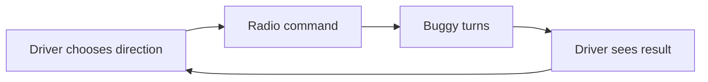

The driver is part of the control system. Without the driver, a normal RC buggy does not know whether it is heading toward the correct place.

---

# Fast and Slow Feedback

Some feedback happens very quickly.

For example:

- correcting the steering while driving
- an ESC protecting itself from overheating
- a battery alarm warning about low voltage

Other feedback happens slowly.

For example:

- noticing tyre wear after several runs
- improving a suspension arm after repeated breakages
- changing the chassis after studying many test notes

Both types are useful.

---

# Positive and Negative Feedback

These words can sound like praise and criticism. In engineering, they mean something different.

## Negative Feedback

Negative feedback pushes a system back toward a target.

Example:

- The buggy moves left of the desired path.
- The driver steers right.
- The buggy returns toward the path.

It reduces the error.

## Positive Feedback

Positive feedback makes a change grow larger.

Imagine a loose wheel.

1. The wheel wobbles.
2. The wobble loosens the nut further.
3. The wheel wobbles even more.
4. The nut becomes even looser.

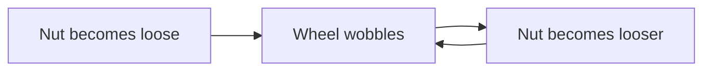

Positive feedback is not always good. It simply means the change reinforces itself.

---

# Trade-Offs ⚖️

Suppose you install a larger motor. That may make the buggy faster. But it may also:

- draw more current
- create more heat
- empty the battery faster
- damage gears
- increase wheelspin
- add weight
- require a larger ESC

A change can improve one result while making another result worse.

This is called a **trade-off**.

A trade-off means:

> Gaining one benefit while accepting a cost somewhere else.

---

# A Concrete Trade-Off: Stronger Parts

Suppose a suspension arm keeps breaking, so you make it thicker.

Possible benefits:

- stronger
- less likely to crack

Possible costs:

- heavier
- slower to print
- uses more material
- may transfer crash force into a more expensive part
- may flex less than desired

The strongest part is not automatically the best part. The best part is the one that performs the correct job inside the whole system.

---

# Requirements

Before designing a system, engineers write down what it must do.

These are called **requirements**.

A requirement is a clear statement of what the design must achieve.

Examples for our buggy:

- The buggy must move under its own electrical power.
- The driver must be able to steer left and right.
- The battery must be removable without dismantling the gearbox.
- The wheels must remain attached during normal driving.
- Printed parts must fit on the chosen printer.
- Hot electronics must have enough airflow.

Requirements help us make decisions. Without them, words such as "better" and "fast" are too vague.

---

# Making Requirements Concrete

Compare these two statements:

> The buggy should be fast.

and:

> The buggy should reach 30 kilometres per hour on short grass using a 2-cell battery (a battery built from two smaller units, called cells - Chapter 22 explains them properly).

The second statement is easier to test.

Compare:

> The battery should be easy to remove.

and:

> One person should be able to remove the battery in less than one minute using no tools.

Again, the second statement is measurable. Good requirements are concrete enough to test.

---

# Constraints

A requirement says what the design must do.

A **constraint** says what limits the design.

Examples:

- Maximum printer bed size
- Available budget
- Available tools
- Battery dimensions
- Motor mounting pattern
- Maximum safe temperature
- Available build time

Imagine making a sandwich. The requirement may be:

> Make lunch for one person.

The constraints may be:

- only the ingredients in the kitchen
- five minutes
- no cooking
- no nuts because of an allergy

Engineering always happens inside constraints.

---

# Interfaces 🔗

Suppose two LEGO bricks must connect. The studs on one brick must match the holes on the other.

The place where two systems meet is called an **interface**.

Examples in the buggy include:

- motor to motor mount
- motor shaft to pinion gear
- battery connector to ESC connector
- servo horn (the small arm on the steering servo's shaft - Chapter 24) to steering link
- bearing to printed housing
- wheel hex (the six-sided adapter that turns the wheel - Chapter 29) to wheel

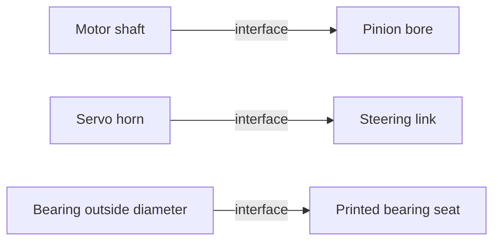

> **[Sketch: close-up photo of a pinion gear meshing with a spur gear -
> the motor-to-drivetrain interface, where two systems meet tooth to
> tooth]**

Interfaces are common places for problems. A part may work perfectly alone but fail to connect to another part.

---

# Why Interfaces Deserve Special Attention

Imagine buying a phone charging cable with the wrong plug. The cable may be excellent, and the phone may be excellent - but the connection does not fit. The system fails at the interface.

In our buggy, interface problems may include:

- screw holes in the wrong place
- a shaft that is too large for a bearing
- a connector with the wrong type
- a servo horn that does not match the servo
- a battery that is too tall for the tray

Later, measurement and tolerances will help us design reliable interfaces.

---

# A System Map for the Buggy

A system map shows the main parts and the important flows between them.

Here is a first version.

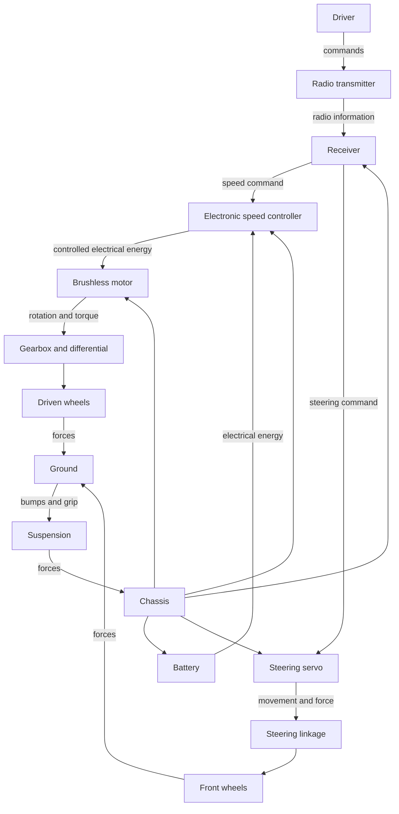

This diagram is not a drawing of where the parts sit. It is a map of how they affect one another - and that difference is important.

---

# System Diagram vs Physical Drawing

A physical drawing shows:

- shape
- size
- location
- holes
- surfaces

A system diagram shows:

- relationships
- flows
- dependencies
- cause and effect

Both are useful, but they answer different questions.

| Diagram type | Main question |
|---|---|
| System diagram | How do the parts work together? |
| Physical drawing | What shape and size are the parts? |

We use the system diagram before detailed CAD because it helps us understand what must connect.

---

> **☕ Good place to pause.** Stretch, get a drink, and come back with a torch in your hand. The rest of the chapter is hands-on.

---

# Hands-On Activity 1 - Analyse a Torch

Find a battery-powered torch.

Do not take it apart unless an adult says it is safe.

In your engineering notebook, write:

## Inputs

Examples:

- battery energy
- button press

## Process

Examples:

- switch closes a circuit
- electrical energy reaches the lamp or LED

## Outputs

Examples:

- light
- heat

Then draw:

```text
Input -> Process -> Output
```

Add a system boundary around the parts that belong to the torch.

---

# Hands-On Activity 2 - Follow One Change

Choose one of these changes:

- The buggy gets heavier.
- The tyres become larger.
- The battery voltage increases.
- A bearing becomes tight.
- The chassis becomes more flexible.
- The motor becomes more powerful.

Write at least three possible effects.

Example:

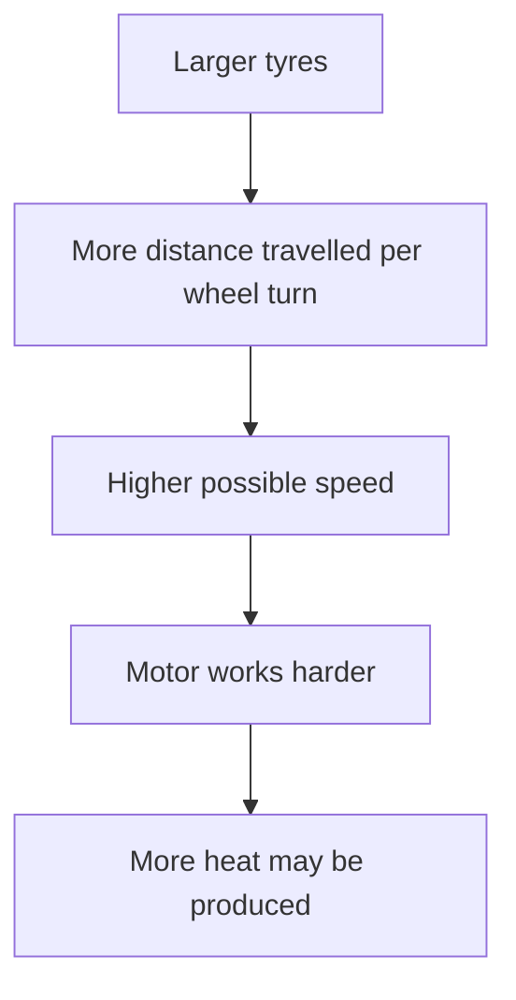

Do not worry about being perfectly correct. The goal is to practise following connections.

---

# Hands-On Activity 3 - Draw the First Buggy System Map

Draw these six boxes:

- Driver
- Battery
- Control
- Motor and drivetrain
- Steering
- Wheels and ground

Connect them with arrows.

Write on each arrow what travels through it.

Possible labels include:

- command
- electrical energy
- rotation
- force
- visual information

Your diagram does not need to match the one in this chapter. A useful diagram is more important than a beautiful diagram.

---

# Chapter Mini Project - The Kitchen Chain Reaction 🛠️

A system only works when every connection between its parts works. In this build you will feel that truth in your fingers: you are going to make a chain-reaction machine - a line of everyday objects in which each one triggers the next. Every hand-off between objects is an interface, and you are the engineer who has to make each one work.

You will need:

- a clear stretch of floor or a large table
- dominoes, books or DVD cases (anything that topples in a row)
- a marble or small ball
- cardboard tubes, or card folded into a ramp
- string, spoons, cups, a toy car - raid the recycling box and (with permission) the kitchen drawer
- tape

> **⚠️ SAFETY**
>
> Show a responsible adult what you plan to build before you start, and
> build with them nearby - they can spot a hazard you cannot. Use
> unbreakable objects only - no glass, nothing sharp, nothing hot. Build
> away from table edges, stairs, screens and pets, and put the kitchen
> things back when you finish.

> **🎬 Watch the build**
>
> - Exploratorium Tinkering (exploratorium.edu): search "chain reaction" -
>   the museum's classic activity, with a downloadable photo guide
> - Exploratorium Tinkering (exploratorium.edu): search "chain reaction
>   at home" - the same activity rebuilt from kitchen objects
> - YouTube (with an adult): search "simple chain reaction machine at
>   home" - watch one run from start to finish before you build

Build steps:

1. Choose a satisfying ending - the finale. A marble dropping into a mug, or a string pulling up a paper flag, both work well.
2. Build ONE link first: one object making the next object move. A domino run that nudges a marble is a classic start.
3. Test that single link five times. Only add the next link when the first works every time.
4. Grow the chain to at least four links, testing each new link on its own before testing the whole chain.
5. Run the whole machine. When it stops halfway (it will), look closely at the interface where it stopped: what was supposed to travel across, and why did it not arrive?

The reflection is where the learning lands. In your engineering notebook:

- Draw your whole machine as boxes and arrows, exactly like the system maps in this chapter.
- Label every arrow with what it carries: a push, a roll, a pull, a tip.
- Mark the interface that failed most often. Interfaces are where systems fail - your machine just proved this chapter's biggest idea.

Notice one thing your machine does NOT have: feedback. Once started, it cannot watch its own progress and correct itself - one bad hand-off and the whole chain stops. That is exactly why you had to test each link so carefully.

Keep your favourite link - the single cleverest hand-off - and your boxes-and-arrows drawing for the showcase shelf, and photograph the full machine before you tidy it away.

---

# Thinking Like an Engineer

Suppose the buggy does not move when the throttle is pressed.

Someone who looks only at parts might say:

> "The motor is broken."

Someone using systems thinking asks:

- Is the transmitter switched on?
- Is the receiver receiving the command?
- Is the ESC armed?
- Is the battery charged?
- Are the connectors fully inserted?
- Can the gears rotate?
- Are the wheels blocked?
- Has a protection system stopped the ESC?

Systems thinking prevents us from replacing good parts because of a bad guess.

---

# Common Beginner Mistakes ❌

## Mistake 1 - Looking at Only One Part

A hot motor does not always mean the motor is faulty. The cause could be:

- incorrect gearing
- tight bearings
- oversized tyres
- too much vehicle weight
- poor airflow

Look at the connected system.

---

## Mistake 2 - Forgetting Unwanted Outputs

Heat, sound, vibration and wear are outputs too. Ignoring them can create later failures.

---

## Mistake 3 - Making a Diagram Too Detailed

A useful first diagram may contain only six boxes. Do not draw every screw and wire - add detail only when it helps answer a question.

---

## Mistake 4 - Believing One Improvement Helps Everything

A faster motor may reduce run time. A stronger arm may increase weight. A softer suspension may improve grip but allow the chassis to hit the ground.

Expect trade-offs.

---

## Mistake 5 - Ignoring Interfaces

Many build problems happen where two parts meet. Check mounting holes, connectors, shaft sizes and clearances early.

---

# Optional Challenge - The Slow Buggy Mystery 🕵️

Imagine the buggy is slower than expected. Create a cause map with at least five possible causes.

You might begin with:

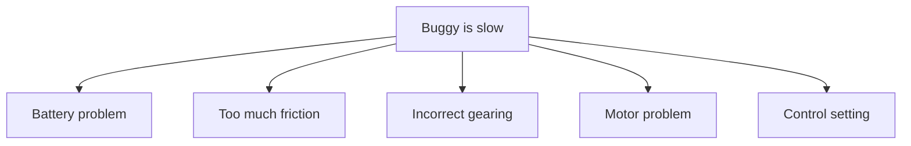

Now add two more ideas beneath each cause.

Example:

- Battery problem
  - not fully charged
  - damaged connector

- Too much friction
  - tight bearing
  - tyre rubbing body

This type of diagram is useful during troubleshooting.

---

# Chapter Summary 📝

In this chapter, we learned that a machine is more than a collection of parts.

A working system contains:

- parts
- connections
- flows
- boundaries
- inputs
- processes
- outputs
- feedback

We also learned that one change can travel through several systems: a tight bearing can increase motor heat, a larger motor can require a stronger drivetrain, and a heavier chassis can change suspension behaviour.

Systems thinking helps us predict these effects before we build.

---

# New Words 📖

| Word | Meaning |
|---|---|
| Systems thinking | Studying the whole system and the relationships between its parts. |
| Input | Something that enters a system. |
| Process | What the system does with an input. |
| Output | Something that leaves a system. |
| System boundary | An imaginary line showing what is inside and outside the system being studied. |
| Subsystem | A smaller system inside a larger system. |
| Feedback | Information about a result that is used to decide what to do next. |
| Cause | Something that creates a change. |
| Effect | The result of a change. |
| Trade-off | A benefit gained while accepting a cost somewhere else. |
| Requirement | A clear statement of what a design must do. |
| Constraint | A limit within which a design must work. |
| Interface | The place where two parts or systems connect. |

---

# Review Questions ❓

1. Why is a pile of correct parts not automatically a working machine?
2. What are the three basic stages in an input-process-output diagram?
3. Give two inputs and two outputs for an RC buggy.
4. What is a system boundary?
5. What is feedback?
6. Why might a tight bearing make the motor hotter?
7. What is a trade-off?
8. What is the difference between a requirement and a constraint?
9. Give three examples of interfaces in an RC buggy.
10. Why should engineers draw a simple system map before detailed CAD?

---

# Chapter Checklist ✅

- [ ] I can explain systems thinking in my own words.
- [ ] I understand inputs, processes and outputs.
- [ ] I know what a system boundary is.
- [ ] I can identify at least one feedback loop.
- [ ] I can trace a chain of cause and effect.
- [ ] I understand that design changes create trade-offs.
- [ ] I know the difference between requirements and constraints.
- [ ] I can identify interfaces between buggy parts.
- [ ] I completed at least one hands-on activity.
- [ ] I drew my first buggy system map.
- [ ] I built my chain-reaction machine and traced its chain on paper.
- [ ] I added my results to my engineering notebook.

---

# Looking Ahead 🔭

We now understand how to divide the buggy into systems and how those systems affect one another.

Next, in **Chapter 3 - How Machines Move**, we will follow something as it travels through the machine:

**motion and force.**

We will learn why the motor does not directly "push" the buggy, how twisting force reaches the tyres, and why gears can trade speed for pulling strength.
