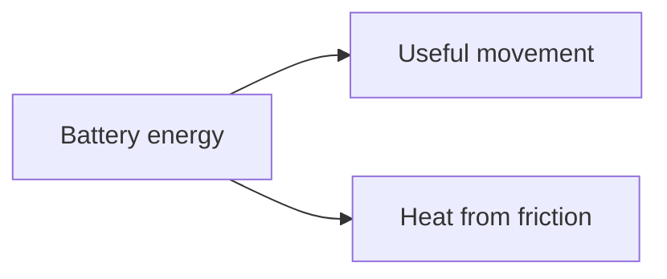
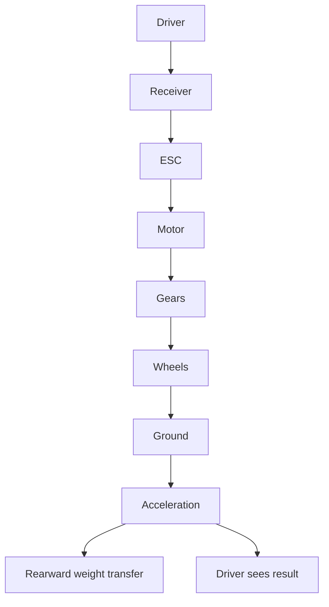

# Chapter 03 - How Machines Move

> **"The motor does not push the buggy forward.  
> It starts a chain of motion that ends at the ground."**

---

# Learning Objectives 🎯

By the end of this chapter you will be able to:

- Explain the difference between movement and force.
- Describe torque as twisting force.
- Trace motion from the motor to the tyres.
- Explain why gears can make a machine slower but stronger.
- Understand why friction can help and hurt.
- Draw a force-flow diagram for the RC buggy.

---

# Before We Begin

Imagine holding one end of a pencil while someone slowly twists the other
end. You feel the twist travel through the pencil. The pencil does not
move forward - it carries a turning action from one end to the other.

Machines do this all the time. Inside our buggy, a motor turns a shaft,
the shaft turns a gear, that gear turns another gear, and a driveshaft
carries the turning out to a wheel. Only when the tyre pushes against the
ground does the buggy actually move forward.

This chapter follows that chain.

---

# A Common Mistake

Many people say:

> "The motor pushes the car."

That is not quite correct. The motor creates rotation - turning movement.
That turning movement travels through the **drivetrain**: the whole chain
of parts that carries rotation from the motor to the driven wheels. (The
gearbox you met in Chapter 2 is part of what engineers call the
drivetrain.)

At the end of the chain, the tyres push backward on the ground, and the
ground pushes the buggy forward.

This may sound strange at first, but it is one of the most important
ideas in vehicle engineering.

---

# Motion

A **motion** is any change in position.

There are two common kinds we will use.

## Straight-Line Motion

An object changes position along a line.

Examples:

- a drawer sliding open
- a lift moving upward
- a buggy driving forward

Engineers call this **linear motion**.

## Turning Motion

An object rotates around a centre.

Examples:

- a wheel turning
- a fan spinning
- a door swinging
- a motor shaft rotating

Engineers call this **rotational motion**.

> **[Sketch: a drawer sliding along a straight arrow (linear motion)
> beside a wheel turning around its centre (rotational motion)]**

Our buggy changes rotational motion into linear motion: the wheels
rotate, and the whole buggy moves forward.

---

# Force

Imagine a heavy box on the floor.

It will not move until something pushes or pulls it.

A **force** is a push or a pull.

Examples:

- your hand pushing a door
- gravity pulling an object downward
- a spring pushing suspension back into position
- the ground pushing against a tyre

Force can:

- start movement
- stop movement
- change speed
- change direction
- bend or break a part

---

# Motion and Force Are Not the Same

An object can move without a large force acting on it. Imagine a toy car
rolling across a smooth floor: once it is moving, only a small force is
needed to keep it moving.

An object can also experience force without moving. Push hard against a
wall - you apply plenty of force, but the wall does not move.

So:

> Force can cause motion, but force and motion are not the same thing.

> **📚 Learn more**
>
> - BBC Bitesize (KS3 Physics): search "forces" - pushes, pulls, and what
>   balanced and unbalanced forces do to motion
> - PhET Simulations (phet.colorado.edu): search "Forces and Motion:
>   Basics" - push a crate on screen and watch what force does to motion

---

# Speed

**Speed** tells us how quickly something moves.

A buggy moving 10 metres in one second is faster than one moving 2 metres in one second.

For a rotating part, we often talk about how many turns it makes in one minute.

This is called:

**revolutions per minute**

or:

**RPM**

One revolution means one complete turn.

```text
1 revolution = 1 full turn
60 RPM = 60 full turns each minute
```

A motor may spin thousands of times per minute.

---

# Torque

Now imagine opening a tight jam jar. You are not pushing the lid in a
straight line - you are twisting it. That twisting action is called
**torque**.

Torque means:

> Twisting force around a centre.

Examples:

- turning a screwdriver
- pedalling a bicycle
- using a spanner
- a motor turning a shaft
- a wheel axle turning a wheel

---

# A Door Handle Experiment

> **🤔 Think about it.** Go to a door and push it shut with one finger
> right next to the hinge. Now push it shut with the same finger next to
> the handle. Why is one so much harder, when the door and your finger
> have not changed?

Only one thing changed: how far from the hinge you pushed. The same force
creates more turning effect when it is applied farther from the centre.
That is why door handles live on the far edge of the door - the designer
is giving your hand the biggest possible turning effect.

> **[Sketch: top view of a door with the hinge on the left; two equal
> force arrows pushing on the door, one close to the hinge and one at the
> handle, each arrow's distance from the hinge labelled - the far arrow
> swings the door easily, the near one struggles]**

Torque depends on:

- how much force is applied
- how far the force acts from the centre

You do not need the maths yet.

Just remember:

> More distance from the centre creates more turning effect.

> **📚 Learn more**
>
> - BBC Bitesize (KS3 Physics): search "moments" - the school name for
>   the turning effect of a force, with seesaw and spanner examples

---

# Rotation, Speed and Torque

A motor gives us two important things:

- rotational speed
- torque

Rotational speed tells us how quickly the shaft turns.

Torque tells us how strongly it can twist.

These are related, but they are not the same.

A small motor may spin very quickly but struggle to turn a heavy load.

A slow motor may produce strong torque.

This is where gears become useful.

---

# Following the Motion Through the Buggy

The motor does not directly turn the wheels.

The motion travels through several parts.


Let us look at each step.

---

# Step 1 - The Motor Turns

The brushless motor (a type of electric motor with no rubbing electrical
contacts inside - Chapter 26) converts electrical energy into rotation.

Its shaft spins.

The shaft is a round metal rod sticking out of the motor.

A small gear attaches to the shaft.

That small gear is called the **pinion gear**.

---

# Step 2 - The Pinion Turns the Spur Gear

The pinion gear touches a larger gear.

That larger gear is called the **spur gear**.

The teeth of the two gears push against each other.

When the small gear turns one way, the large gear turns the opposite way.

The gears change the relationship between speed and torque.

---

# Step 3 - The Differential Shares the Motion

The spur gear sends motion into the differential.

A **differential** is a special group of gears that sends motion to both driven wheels while allowing them to turn at different speeds.

Why would the wheels need different speeds?

> **🤔 Think about it.** Walk around a tight corner side by side with a
> friend, with your friend on the outside of the turn. Who has to take
> bigger, faster steps? And what would happen if you were both forced to
> match steps exactly?

Your friend on the outside walks around a larger circle, so they must
travel farther in the same time - they need faster steps. When the buggy
turns, its wheels face the same problem: the outside wheel travels around
a larger circle than the inside wheel, so it must turn faster.

> **[Sketch: top-down view of the buggy driving around a left-hand curve;
> dashed arcs traced by the inside and outside wheels, the outside arc
> clearly longer, labelled "shorter path" and "longer path"]**

Without a differential, the tyres would scrub and fight each other during
turns - like you and your friend stumbling when you are forced to match
steps.

---

# Step 4 - Driveshafts Carry the Rotation

The differential turns the driveshafts.

A **driveshaft** is a shaft that carries rotation from one place to another.

It acts like the twisted pencil from the beginning of the chapter.

The driveshaft does not create the rotation.

It carries it.

---

# Step 5 - Axles Turn the Wheels

The driveshafts connect to the wheel axles.

The axles turn the wheels.

The wheels turn the tyres.

Now the rotating motion has reached the ground.

---

# Step 6 - The Tyres Push on the Ground

This is the final and most important step.

As the tyre turns, the bottom of the tyre tries to move backward against the ground.

Because the tyre grips the surface, the ground pushes the tyre forward.

The tyre pushes backward on the ground.

The ground pushes forward on the tyre.

That forward force moves the buggy.

Engineers call this pair of forces *action and reaction*: whenever one
thing pushes on another, the other pushes back just as hard in the
opposite direction. It is also known as Newton's third law, and we will
meet it properly in Chapter 4.

> **[Sketch: side view of a driven wheel on the ground; an arrow at the
> tyre's contact patch pointing backward labelled "tyre pushes ground",
> and an equal arrow pointing forward labelled "ground pushes tyre"]**

This is why grip matters.

Without grip, the wheel spins but the buggy does not accelerate properly.

---

# A Simple Analogy: Walking

When you walk, your foot pushes backward against the ground, and the
ground pushes you forward - action and reaction again. If you try to walk
on ice, your foot slips. The same leg muscles are working, but there is
less grip.

The buggy behaves the same way.

---

# The Force Path

A **force path** is the route that force follows through a structure or machine.

In our buggy, one important force path is:


If one part in the path is too weak, the path may fail.

Possible failures include:

- stripped gear teeth
- twisted driveshaft
- loose wheel hex (the six-sided adapter that locks a wheel onto its
  axle - Chapter 29)
- cracked wheel hub
- tyre slipping on the rim

A strong motor can reveal weak parts elsewhere.

---

# Gears: Trading Speed for Strength ⚙️

Imagine riding a bicycle uphill.

In a hard gear:

- the bicycle moves far for each pedal turn
- pedalling is difficult

In an easy gear:

- the bicycle moves less for each pedal turn
- pedalling is easier

You traded speed for turning strength.

RC gear systems do the same thing.

> **📚 Learn more**
>
> - Explain That Stuff (explainthatstuff.com): search "gears" - why gears
>   can give you speed or strength, but never both at once
> - BBC Bitesize (KS3 Design and Technology): search "mechanical systems" -
>   gears, levers and linkages as school D&T teaches them

---

# A Simple Gear Pair

Imagine a small gear with 10 teeth turning a large gear with 40 teeth.

The small gear must turn four times to make the large gear turn once.

```text
Small gear: 10 teeth
Large gear: 40 teeth

40 / 10 = 4
```

This is a **4 to 1 ratio**.

It may be written as:

```text
4:1
```

The output turns four times slower.

But it gains more torque.

> **[Sketch: a 10-tooth pinion meshing with a 40-tooth gear, teeth
> interlocking at the contact point; arrows showing the small gear
> spinning fast one way and the large gear turning slowly the other way,
> labelled "4 turns" and "1 turn"]**

Real buggy gears use exactly the same idea with finer teeth: a typical
1/10 buggy pinion has 15 to 30 teeth and its spur gear 70 to 90. The
numbers here are simply easier to picture.

---

# Gear Ratio

A **gear ratio** compares the sizes of connected gears.

For a simple pair:

```text
Gear ratio = driven gear teeth / driving gear teeth
```

The driving gear is the gear providing motion.

The driven gear is the gear receiving motion.

In our buggy:

- pinion gear = driving gear
- spur gear = driven gear

Example:

```text
Spur gear = 60 teeth
Pinion gear = 20 teeth

60 / 20 = 3

Gear ratio = 3:1
```

The motor turns three times for one turn of the spur gear.

---

# Lower Gearing and Higher Gearing

These phrases can be confusing.

## Lower Gearing

Usually means:

- smaller pinion or larger spur
- lower vehicle speed
- more pulling strength
- easier work for the motor
- often less heat

## Higher Gearing

Usually means:

- larger pinion or smaller spur
- higher possible speed
- less mechanical advantage
- harder work for the motor
- often more heat

| | Lower gearing | Higher gearing |
|---|---|---|
| Top speed | lower | higher (if the motor copes) |
| Torque at the wheels | more | less |
| Work for the motor | easier | harder |
| Heat | usually less | usually more |

Higher gearing does not always make the buggy faster.

If the motor cannot handle the load, it may overheat and slow down.

---

# Mechanical Advantage

A gear system can make a small input force produce a larger output force.

This effect is called **mechanical advantage**.

A long spanner gives mechanical advantage.

A bicycle's easy gear gives mechanical advantage.

A buggy's reduction gears give mechanical advantage.

You gain force.

But you give up speed or distance.

Machines do not create free energy.

They trade one useful result for another.

---

# The Price of More Torque

Suppose a gear system gives four times more torque.

The output turns about four times slower, ignoring losses.

This is a trade-off.

```text
More torque <-> less speed
More speed <-> less torque
```

This relationship is one reason engineers choose gear ratios carefully.

---

> **☕ Good place to pause.** Stretch, get a drink, or try the pencil and
> door activities at the end of the chapter now. The next section starts
> a new idea: friction.

---

# Friction

Rub your hands together quickly. They become warm - that warmth comes
from friction.

**Friction** is a force that resists sliding or rolling motion between surfaces.

Friction can be useful.

It can also waste energy.

> **📚 Learn more**
>
> - BBC Bitesize (KS3 Physics): search "friction" - where friction comes
>   from and when it helps or hinders
> - PhET Simulations (phet.colorado.edu): search "Forces and Motion:
>   Basics" - the Friction screen lets you make the ground icy or rough

---

# Useful Friction

The tyres need friction to grip the ground.

Brakes use friction to slow a vehicle.

Screws stay tight partly because of friction.

Shoes use friction so we do not slip.

Without friction, the buggy could not accelerate, brake or steer.

---

# Wasteful Friction

Too much friction inside the drivetrain creates problems.

Examples:

- tight bearings
- gears pressed too closely together
- bent shafts
- tyres rubbing the body
- dry joints
- brakes dragging

Wasteful friction changes useful energy into heat.



The more energy wasted as heat, the less remains for movement.

---

# Rolling Resistance

Even when a wheel rolls instead of slides, it still resists motion slightly.

This is called **rolling resistance**.

Causes include:

- tyre deformation
- soft ground
- bearing friction
- wheel misalignment

Soft tyres on grass have more rolling resistance than hard wheels on smooth concrete.

---

# Grip and Slip

A tyre works best when it grips the ground.

If the motor applies more torque than the tyre can transfer, the tyre slips.

This is called **wheelspin**.


More motor power does not help if the tyres cannot use it.

This is another systems-thinking lesson.

The power system and tyre system must match.

---

> **☕ Good place to pause.** Stretch, get a drink, or try the friction
> test (Activity 4) now. The next section moves from grip to how the
> buggy's weight shifts as it speeds up and slows down.

---

# Weight Transfer

Imagine standing still and suddenly sprinting forward - your body leans
back slightly at first. A buggy does something similar during
acceleration.

As it accelerates:

- more load moves toward the rear tyres
- less load remains on the front tyres

During braking:

- more load moves toward the front tyres

This is called **weight transfer**.

The buggy's total weight does not jump from one end to the other.

The forces pressing the tyres into the ground change.

> **[Sketch: two side views of the buggy - accelerating with the nose
> lifting and the rear squatting, arrows showing extra load on the rear
> tyres; braking with the nose diving, arrows showing extra load on the
> front tyres]**

Weight transfer affects grip, steering and stability.

We will study it more deeply in the suspension chapters.

---

# Inertia

Imagine a book resting on a table. It stays still until something moves
it. Now slide it: it keeps moving until friction slows it down.

This resistance to changing motion is called **inertia**.

Inertia means:

> An object resists changes to its movement.

A heavy buggy usually has more inertia than a light buggy.

That means it takes more force to:

- accelerate
- stop
- turn

But it may also feel more stable over small bumps.

---

# Mass and Weight

These words are often used as if they mean the same thing.

They are related, but different.

## Mass

Mass describes how much matter an object contains.

It is commonly measured in kilograms or grams.

## Weight

Weight is the force created when gravity pulls on mass.

On Earth, more mass usually means more weight.

For this beginner project, we will often use the everyday word "weight."

But remember that engineers distinguish the two.

---

# Momentum

A moving object can be difficult to stop. A bowling ball moving slowly
may be harder to stop than a tennis ball moving at the same speed, and a
fast buggy is harder to stop than a slow buggy.

This property is called **momentum**.

Momentum increases when:

- mass increases
- speed increases

A fast, heavy buggy carries more momentum into a crash.

That is why high speed increases the forces on printed parts.

> **📚 Learn more**
>
> - BBC Bitesize: search "momentum" - a GCSE topic, so a look ahead, but
>   the examples make mass-times-speed easy to picture

---

# Acceleration

Acceleration means a change in velocity.

Velocity means speed in a particular direction.

Acceleration happens when the buggy:

- speeds up
- slows down
- changes direction

Even a buggy moving at constant speed around a corner is accelerating because its direction changes.

The stronger the force compared with the buggy's mass, the greater the acceleration.

---

# Power

Imagine carrying a week's shopping up the stairs. You could haul every
bag up in one fast trip, or make several slow, easy trips. Either way the
same shopping ends up at the top - the same total work gets done - but
the fast trip takes something extra. That something is power.

**Power** tells us how quickly work is done or energy is transferred.

A motor is the same. Torque tells us how strongly it can twist; power
tells us how quickly it can keep delivering that twist. Two motors may
have similar torque, but the one that can hold it at higher speed
delivers more power - like the person who can carry the same bags
upstairs at a run.

We will study electrical power in Chapter 21.

For now, remember:

> Power combines forceful action with speed.

---

# Why a Fast Motor May Not Make a Fast Buggy

Suppose a motor spins very quickly.

The buggy may still be slow if:

- gearing is too low
- wheels are too small
- friction is high
- battery voltage drops
- tyres slip
- the buggy is very heavy
- the motor overheats
- the ESC (the motor's electronic speed controller - Chapter 25) limits
  power

Speed is the result of the whole system.

Not just the motor.

---

# The Motion Path and the Support Path

There are two important paths inside the buggy.

## Motion Path

This carries rotation to the wheels.


## Support Path

This carries forces back through the structure.


When the tyres push on the ground, the ground pushes back through the buggy's structure.

The chassis must handle these forces.

A drivetrain can work perfectly while a weak suspension mount still breaks.

---

# What Happens During Acceleration?

Let us follow one acceleration event.

1. The driver presses the throttle.
2. The transmitter (the radio handset in the driver's hands - Chapter 23)
   sends a command.
3. The receiver (the small radio box inside the buggy - Chapter 23)
   passes the command to the ESC.
4. The ESC sends controlled electrical power to the motor.
5. The motor produces torque.
6. The pinion turns the spur gear.
7. The differential sends rotation to the driveshafts.
8. The wheels turn.
9. The tyres push backward on the ground.
10. The ground pushes the buggy forward.
11. The buggy accelerates.
12. Weight transfers toward the rear.
13. The driver sees the result and adjusts the throttle.



This is a system event.

Electrical, mechanical and human systems all participate.

---

# What Happens During Braking?

Braking is not simply the opposite of acceleration.

1. The driver requests less speed or braking.
2. The ESC changes motor control.
3. The motor resists rotation.
4. The drivetrain carries that resistance to the wheels.
5. The tyres push forward against the ground.
6. The ground pushes backward on the buggy.
7. The buggy slows.
8. Weight transfers toward the front.

If grip is low, the tyres may slide.

If braking force is too strong, the buggy may become unstable.

---

# Hands-On Activity 1 - Pencil Driveshaft ✏️

You need:

- a pencil
- two people, if possible

Steps:

1. Hold one end of the pencil gently.
2. Ask the other person to twist the opposite end.
3. Feel the twist arrive through the pencil.
4. Hold the pencil more firmly.
5. Notice how the twisting resistance changes.

Write in your notebook:

- What moved?
- What carried the torque?
- Where did the resistance come from?

The pencil is acting like a simple shaft.

---

# Hands-On Activity 2 - Door Torque Test 🚪

Use a normal door.

1. Push close to the hinge.
2. Push halfway along the door.
3. Push near the handle.
4. Use roughly the same effort each time.

Record:

- Which position was easiest?
- Which position created the greatest turning effect?
- What changed: the force, the distance from the hinge, or both?

This activity makes torque concrete.

---

# Hands-On Activity 3 - Simple Gear Model

Use two round objects of different sizes.

Examples:

- bottle caps
- cardboard circles
- toy gears
- coins placed on paper

Mark one point on each circle.

Roll or rotate the small circle around the larger one.

Observe:

- the small circle needs more turns
- the larger circle turns more slowly
- size changes the relationship between rotations

This is not a perfect gear model, but it helps you see the idea.

---

# Hands-On Activity 4 - Friction Test

You need:

- a small toy car
- a smooth surface
- a towel or carpet

Steps:

1. Push the toy car gently across the smooth surface.
2. Measure or estimate how far it travels.
3. Repeat on the towel or carpet.
4. Use a similar push each time.

Record:

- Which surface created more rolling resistance?
- Which surface stopped the car sooner?
- Where did the lost motion go?

Some energy became heat and deformation.

---

# Chapter Mini Project - The Cardboard Gear Pair 🛠️

Reading about gear ratios is one thing. Turning a gear pair you built
yourself, and feeling the ratio in your fingers, is another. This build
gives you a working pinion and spur of your own - the same pair that
lives inside the buggy, scaled up in cardboard.

You will need:

- corrugated cardboard (an old delivery box is perfect)
- two round things to trace, one about twice the size of the other
  (a mug and a large tin, or two different jar lids)
- two pencils or wooden skewers for axles
- scissors, glue and sticky tape
- a spare piece of cardboard for the base
- a marker pen

> **⚠️ SAFETY**
>
> Corrugated cardboard is tough to cut. Use scissors, cut away from
> yourself on a table, and ask an adult if you want to use a craft
> knife - especially for the axle holes.

> **🎬 Watch the build**
>
> - 4-H (4-h.org): search "make your own cardboard gears" - a printable
>   photo activity sheet using exactly this corrugated-strip method
> - Instructables (instructables.com): search "working gears from
>   junkmail and cardstock" - a step-by-step photo build
> - Technovation (technovation.org): search "how to make a gearbox with
>   moving parts" - takes the same idea further into a full gearbox

Build steps:

1. Trace and cut two cardboard discs, one about twice the diameter of
   the other. The small one is your pinion, the large one your spur.
2. Cut long strips of corrugated cardboard about 1 cm wide, then peel
   the flat paper off one side so the wavy corrugations are exposed.
   Those waves are your gear teeth.
3. Glue a strip around the rim of each disc, teeth facing outward, and
   trim so the ends meet neatly.
4. Count the teeth on each gear and write the number in the middle of
   its disc.
5. Push a pencil or skewer through the centre of each gear.
6. Fix both axles to the base (tape works, or push skewers right
   through) so the two gears mesh - teeth interlocking, but not jammed
   tight.
7. Draw one bold arrow on the face of each gear so you can count turns.

Now the engineering part - the reflection:

1. Turn the large gear exactly one full turn and count how many turns
   the small gear makes. Then divide your two tooth counts. Do the
   numbers agree? That is your gear ratio, made visible.
2. Pinch the small gear's axle gently to resist it while a helper turns
   the large gear. Now swap: resist the large gear while they turn the
   small one. Which gear is harder to stop? That is the torque trade -
   the slower gear twists with more strength.
3. Label your pair: the small gear is the pinion, the large one is the
   spur. In the buggy, the motor spins the pinion and the spur turns
   slower but stronger - you have just felt why.

Your gear pair has no motor - you are its motor, which is exactly why
you can feel what the buggy's motor will feel. Put it on your showcase
shelf next to the cotton reel crawler.

---

# Engineering Challenge - Draw the Complete Motion Path

Draw a diagram containing:

- battery
- ESC
- motor
- pinion
- spur gear
- differential
- driveshaft
- wheel
- tyre
- ground
- chassis

Use different arrow labels for:

- electrical energy
- rotation
- torque
- ground force

Your diagram may look like this:


Improve the diagram in your own notebook.

---

# Thinking Like an Engineer

Suppose the motor spins, but the buggy does not move.

Possible causes include:

- loose pinion gear
- stripped spur gear
- broken differential
- disconnected driveshaft
- loose wheel hex
- tyre spinning on the rim
- wheels lifted off the ground

The motor is working.

But the motion path is broken.

A useful troubleshooting question is:

> At what point does the motion stop travelling?

Start at the motor and follow the chain one step at a time.

---

# Another Troubleshooting Example

Suppose the buggy moves, but the motor becomes hot.

Possible causes:

- gearing is too high
- drivetrain friction is high
- wheels are too large
- buggy is too heavy
- tyres are rubbing
- motor timing (an advanced motor setting - Chapter 26) is set too
  aggressively
- cooling airflow is poor

The hot motor is the symptom.

The cause may be elsewhere in the system.

---

# Common Beginner Mistakes ❌

## Mistake 1 - Confusing Speed with Torque

A fast-spinning motor does not always have enough torque for the load.

Speed and torque are different properties.

---

## Mistake 2 - Thinking Bigger Gears Always Mean More Speed

The result depends on which gear is driving and which is driven.

A larger spur gear usually lowers vehicle gearing.

A larger pinion usually raises vehicle gearing.

---

## Mistake 3 - Ignoring Friction

A drivetrain that feels slightly tight by hand can waste significant energy at high speed.

Check free movement before adding more power.

---

## Mistake 4 - Believing Wheelspin Means Strong Acceleration

Wheelspin looks dramatic.

But slipping tyres often produce less useful acceleration than gripping tyres.

---

## Mistake 5 - Strengthening Only One Part

A stronger motor may break the next weakest drivetrain part.

Power upgrades should be considered as system changes.

---

## Mistake 6 - Forgetting the Ground

The buggy cannot accelerate without a force from the ground.

Tyres and surface conditions are part of the motion system.

---

# Optional Challenge - Compare Two Gear Ratios

Calculate these simple ratios.

## Setup A

```text
Spur gear: 60 teeth
Pinion gear: 20 teeth
```

## Setup B

```text
Spur gear: 60 teeth
Pinion gear: 15 teeth
```

Questions:

1. What is the ratio for Setup A?
2. What is the ratio for Setup B?
3. Which setup gives more torque multiplication?
4. Which setup gives a higher possible wheel speed?
5. Which setup is likely to be easier on the motor?

Answers:

```text
Setup A: 60 / 20 = 3:1
Setup B: 60 / 15 = 4:1
```

Setup B gives more torque multiplication and lower wheel speed.

---

# Optional Challenge - Find the Broken Motion Path

Imagine this sequence:

- The motor spins.
- The pinion spins.
- The spur gear does not spin.

What could be wrong?

Possible answers:

- pinion is not touching the spur gear
- gear teeth are stripped
- motor mount is loose
- gear mesh is too wide

Now imagine:

- Motor spins.
- Spur spins.
- Driveshaft does not spin.

Possible causes:

- broken differential
- stripped internal gear
- disconnected output cup (the socket where a driveshaft plugs into the
  differential - Chapter 27)
- broken shaft

This is how engineers isolate faults.

---

# Chapter Summary 📝

In this chapter, we learned how movement travels through the buggy.

The motor creates rotational motion and torque.

The drivetrain carries that motion through:

- pinion gear
- spur gear
- differential
- driveshafts
- wheels
- tyres

The tyres push backward on the ground.

The ground pushes the buggy forward.

We also learned that:

- force is a push or pull
- torque is twisting force
- speed and torque are different
- gears trade speed for torque
- friction can be useful or wasteful
- grip limits how much wheel torque can become acceleration
- the whole structure carries reaction forces
- a broken motion path can stop the buggy even when the motor works

---

# New Words 📖

| Word | Meaning |
|---|---|
| Motion | A change in position. |
| Linear motion | Movement along a path. |
| Rotational motion | Turning around a centre. |
| Force | A push or pull. |
| Speed | How quickly something moves. |
| Revolution | One complete turn. |
| RPM | Revolutions per minute. |
| Torque | Twisting force around a centre. |
| Drivetrain | The parts that carry motor rotation to the driven wheels. |
| Pinion gear | The small gear attached to the motor shaft. |
| Spur gear | The larger gear driven by the pinion. |
| Differential | A gear system that lets driven wheels turn at different speeds. |
| Driveshaft | A shaft that carries rotation and torque. |
| Force path | The route force follows through a machine or structure. |
| Gear ratio | A comparison between the sizes or tooth counts of gears. |
| Mechanical advantage | A force increase gained by trading speed or distance. |
| Friction | A force that resists movement between surfaces. |
| Rolling resistance | Resistance that acts against a rolling wheel. |
| Grip | The tyre's ability to transfer force to the ground without slipping. |
| Wheelspin | A condition where a driven tyre rotates faster than the vehicle moves. |
| Inertia | Resistance to a change in motion. |
| Momentum | The motion carried by a moving mass. |
| Acceleration | A change in speed or direction. |
| Power | How quickly energy is transferred or work is done. |
| Weight transfer | A change in how strongly different tyres are pressed against the ground during acceleration, braking or turning. |

---

# Review Questions ❓

1. What is the difference between linear and rotational motion?
2. What is a force?
3. What is torque?
4. Why is pushing a door near the handle easier than pushing near the hinge?
5. What does RPM measure?
6. Trace the motion path from the motor to the ground.
7. Why does a differential allow the buggy to turn more easily?
8. What does a 4:1 gear ratio mean?
9. What usually happens when gearing is made lower?
10. What usually happens when gearing is made higher?
11. Give two examples of useful friction.
12. Give two examples of wasteful friction.
13. Why can a wheel spin without moving the buggy forward effectively?
14. What is inertia?
15. Why does a heavier, faster buggy usually hit harder in a crash?
16. What is the difference between the motion path and support path?
17. Why might a more powerful motor damage the drivetrain?
18. What troubleshooting question helps locate a broken drivetrain?

---

# Chapter Checklist ✅

- [ ] I understand the difference between motion and force.
- [ ] I can explain torque using a real-world example.
- [ ] I know what RPM means.
- [ ] I can trace the drivetrain from motor to tyre.
- [ ] I understand why the tyres push backward on the ground.
- [ ] I understand why the ground pushes the buggy forward.
- [ ] I can calculate a simple gear ratio.
- [ ] I understand the trade-off between speed and torque.
- [ ] I can identify useful and wasteful friction.
- [ ] I understand grip and wheelspin.
- [ ] I know what inertia and momentum mean in simple terms.
- [ ] I completed at least one hands-on activity.
- [ ] I built the cardboard gear pair and felt the ratio and the torque
      trade for myself.
- [ ] I drew a motion-path diagram.
- [ ] I added observations to my engineering notebook.

---

# Looking Ahead 🔭

We can now trace motion and force through the buggy.

The next step is to study forces more carefully.

In Chapter 04 - Forces and Why Parts Break, we will explore:

- pushing
- pulling
- bending
- stretching
- squeezing
- twisting
- impacts

We will learn why parts break, why shape matters, and how engineers decide where a printed part needs to be thicker, thinner, stiffer or more flexible.
