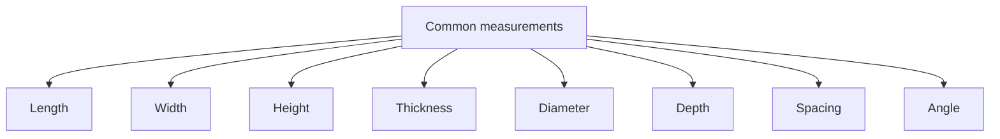
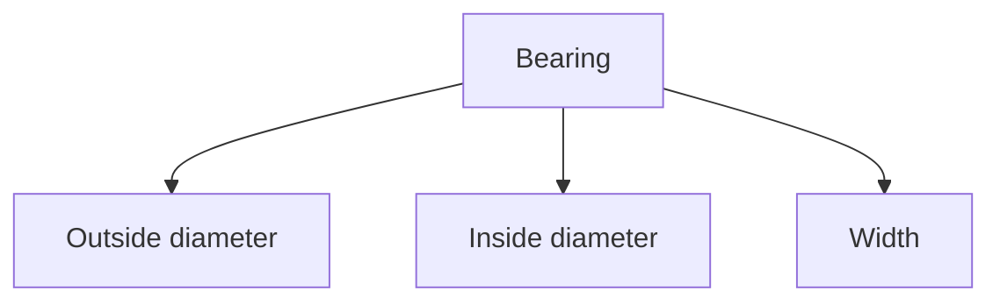
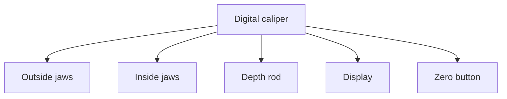
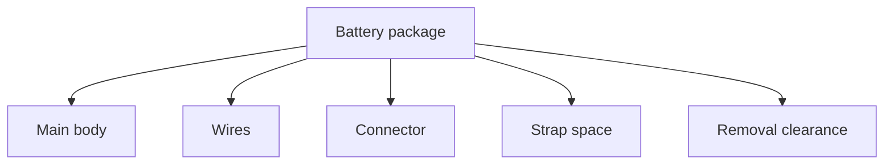
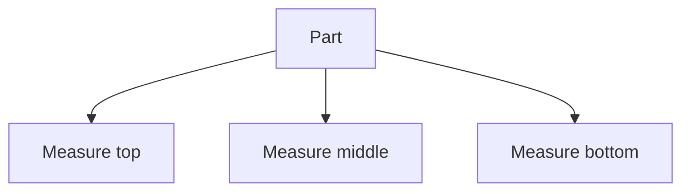
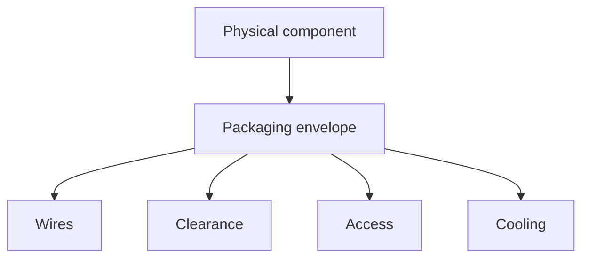

# Chapter 05 - Measurement

> **"A part that is almost the right size is often completely useless."**

---

# Learning Objectives

By the end of this chapter you will be able to:

- Explain why measurement matters in engineering.
- Choose a suitable tool for a measurement.
- Measure outside size, inside size, depth and spacing.
- Use millimetres consistently.
- Record measurements so another person can understand them.
- Recognise common measuring mistakes.
- Create a first component measurement sheet for the buggy project.

---

# Before We Begin

Imagine buying a new door.

The wall opening is 800 mm wide.

The door is 805 mm wide.

The difference is only 5 mm.

That sounds small.

But the door does not fit.

Now imagine a wheel axle that is 0.3 mm too large for a bearing.

Again, the error sounds tiny.

But the axle may not enter the bearing at all.

Engineering often happens in small differences.

A successful build depends on knowing what those differences are.

---

# A Story: The Shelf That Was Nearly Right

Suppose you measure a space for a shelf.

You glance at a ruler and write:

```text
About 60 cm
```

You cut the board.

It is slightly too long.

You trim it.

Now it is slightly too short.

You add a bracket to hide the gap.

The shelf works, but only after extra effort.

A careful builder would have asked:

- Which points should be measured?
- Is the wall straight?
- Is the opening the same width at the top and bottom?
- What unit should be used?
- How exact does the shelf need to be?
- Should there be a small installation gap?

The lesson is simple:

> Measurement is not only reading a number.  
> It is deciding exactly what the number means.

---

# What Is Measurement?

Measurement means:

> Comparing something with an agreed standard.

When we say a shaft is 5 mm wide, we are comparing its width with the millimetre.

Measurements usually contain two things:

1. A number
2. A unit

```text
5 mm
```

Without the unit, the number is incomplete.

Five millimetres is very different from five centimetres.

---

# Units

A **unit** is an agreed amount used for comparison.

Common length units include:

- millimetres
- centimetres
- metres
- inches

For this project, we will mainly use **millimetres**.

The abbreviation is:

```text
mm
```

Examples:

```text
3 mm screw
5 mm shaft
12 mm bearing
135 mm chassis width
```

Using one main unit reduces mistakes.

---

# Why Millimetres?

RC parts are small.

Centimetres are often too large for clear design work.

For example:

```text
0.3 cm
```

is easier to misunderstand than:

```text
3 mm
```

Most CAD tools, 3D printer settings and hobby component drawings work well in millimetres.

---

# Metric Conversions

The basic relationships are:

```text
10 millimetres = 1 centimetre
100 centimetres = 1 metre
1000 millimetres = 1 metre
```

Examples:

```text
25 mm = 2.5 cm
120 mm = 12 cm
350 mm = 35 cm
```

Try to avoid changing units repeatedly during a project.

Choose millimetres and stay with them.

---

# What Do We Measure?

A part can have many different dimensions.

Common examples include:

- length
- width
- height
- thickness
- outside diameter
- inside diameter
- depth
- centre-to-centre spacing
- angle



---

# Length, Width and Height

These words describe the size of an object in different directions.

But there is no universal rule for which direction must be called length.

Engineers make the meaning clear using:

- drawings
- labels
- arrows
- agreed orientation

For example:

```text
Battery:
Length = 139 mm
Width  = 47 mm
Height = 25 mm
```

The labels matter.

A list of three numbers without labels is dangerous.

---

# Thickness

Thickness describes the distance between two opposite surfaces.

Examples:

- chassis plate thickness
- shock tower thickness
- washer thickness
- body panel thickness

Thickness can strongly affect stiffness and strength.

---

# Diameter

A circle's **diameter** is the distance across the circle through its centre.

Examples:

- shaft diameter
- screw diameter
- bearing outside diameter
- wheel diameter
- hole diameter

The diameter symbol is often written as:

```text
Ø
```

Example:

```text
Ø5 mm shaft
```

This means a shaft with a diameter of 5 mm.

---

# Radius

A **radius** is the distance from the centre of a circle to its edge.

The radius is half the diameter.

```text
Radius = Diameter / 2
```

Example:

```text
Diameter = 10 mm
Radius = 5 mm
```

CAD software often asks for either radius or diameter.

Read the field carefully.

---

# Inside and Outside Diameter

A bearing has at least two important circular measurements.

- Outside diameter
- Inside diameter

The inside diameter is the hole through the bearing.

The outside diameter is the size that fits into the housing.



A bearing might be described as:

```text
5 x 11 x 4 mm
```

This often means:

```text
Inside diameter = 5 mm
Outside diameter = 11 mm
Width = 4 mm
```

Always confirm the order used by the supplier.

---

# Depth

Depth tells us how far something extends inward.

Examples:

- hole depth
- bearing-seat depth
- screw recess depth
- slot depth

A hole can have the correct diameter but still be too shallow.

---

# Spacing

Spacing tells us how far features are apart.

For mounting holes, engineers often measure:

**centre-to-centre spacing**

That means from the centre of one hole to the centre of another.

```text
Hole centre *--------* Hole centre
            < 20 mm >
```

Measuring edge-to-edge can create confusion if hole diameters differ.

---

# Centre-to-Centre Measurement

Suppose two 4 mm holes are separated by 20 mm from centre to centre.

The nearest edges are only 16 mm apart.

```text
20 mm centre spacing
minus 2 mm radius
minus 2 mm radius
= 16 mm edge gap
```

The two measurements describe different things.

Always label which one you mean.

---

# Choosing a Measuring Tool

Different tools suit different jobs.

Common tools for this project include:

- ruler
- tape measure
- digital calipers
- angle gauge
- printed templates
- feeler gauges
- scales

The first two important tools are the ruler and digital calipers.

---

# The Ruler

A ruler is good for:

- rough overall length
- large spacing
- checking printer bed size
- measuring chassis dimensions
- quick estimates

A ruler is not ideal for:

- shaft diameter
- small holes
- bearing width
- tiny gaps
- accurate wall thickness

A ruler usually measures to the nearest millimetre reasonably well.

---

# Reading a Metric Ruler

On a common metric ruler:

- numbered marks show centimetres
- smaller marks show millimetres

```text
0    1    2    3 cm
|....|....|....|
```

There are 10 millimetres between each centimetre mark.

When measuring:

1. Align the zero mark with the starting edge.
2. Look straight down.
3. Read the mark at the ending edge.
4. Record the unit.

---

# Parallax Error

Place a ruler on a table.

Look at a mark from the side.

Then look from directly above.

The apparent reading changes.

This is called **parallax error**.

Parallax happens when the viewing angle makes a mark appear shifted.

To reduce it:

- look straight at the scale
- keep the ruler close to the object
- avoid measuring from an angle

---

# Measuring From a Damaged Ruler End

Some rulers have a worn or rounded end.

If the object is aligned with that end, the reading may be wrong.

A safer method is:

1. Start at the 10 mm mark.
2. Read the final position.
3. Subtract 10 mm.

Example:

```text
Start = 10 mm
End = 67 mm
Length = 67 - 10 = 57 mm
```

---

# Digital Calipers

Digital calipers are one of the most useful tools in this project.

They can measure:

- outside dimensions
- inside dimensions
- depth
- steps

A typical digital caliper has:

- outside jaws
- inside jaws
- depth rod
- sliding body
- display
- zero button
- unit button
- locking screw



---

# Caliper Safety

Digital calipers are not dangerous tools, but use them carefully.

Do not:

- use them as pliers
- use them as a clamp
- force the jaws
- measure spinning parts
- measure live electrical conductors
- scratch soft surfaces unnecessarily
- drop them

The jaw tips can also be sharp.

Handle them with care.

---

# Zeroing the Calipers

Before measuring:

1. Wipe the jaw faces.
2. Close the jaws gently.
3. Press the zero button.
4. Check the display reads 0.00 mm.
5. Open and close once more.
6. Check zero again.

If the zero changes, inspect for dirt or damage.

---

# Measuring an Outside Dimension

Use the large lower jaws.

Examples:

- shaft diameter
- bearing outside diameter
- plate thickness
- battery width

Steps:

1. Open the jaws wider than the part.
2. Place the part between the flat jaw faces.
3. Close gently.
4. Keep the jaws square to the part.
5. Read the display.
6. Repeat the measurement.


Do not squeeze hard.

Plastic parts can deform.

---

# Measuring a Shaft Diameter

A shaft should be measured in more than one place.

Why?

The shaft may be:

- worn
- tapered
- damaged
- slightly oval

Measure:

- near one end
- near the middle
- in a second rotational direction

Record the readings.

---

# Measuring an Inside Dimension

Use the smaller upper jaws.

Examples:

- hole diameter
- slot width
- inside of a tube

Steps:

1. Close the small jaws.
2. Insert them into the opening.
3. Open them gently until they touch both sides.
4. Keep the caliper square.
5. Read the display.
6. Repeat at another angle if the hole may be oval.

Inside measurements with inexpensive calipers may be less reliable than outside measurements.

Use care.

---

# Measuring Depth

Use the depth rod that extends from the end of the caliper.

Examples:

- blind hole depth
- recess depth
- bearing-seat depth

Steps:

1. Rest the caliper body flat across the opening.
2. Extend the depth rod until it touches the bottom.
3. Keep the body level.
4. Read the display.

A tilted caliper gives an incorrect result.

---

# Measuring a Step

The rear faces of some calipers can measure a step.

For example:

- height difference between two surfaces
- shoulder depth
- raised lip height

This feature is useful but easy to overlook.

---

# Measuring Hole Spacing

Centre-to-centre spacing can be difficult to measure directly.

There are several methods.

## Method 1 - Same-Size Holes

Measure from the same edge of one hole to the same edge of the other.

For equal-size holes, this equals centre-to-centre spacing.

```text
Left edge of hole A -> left edge of hole B
```

## Method 2 - Outside and Inside Measurements

For two equal holes:

1. Measure outside-to-outside.
2. Measure the hole diameter.
3. Subtract one hole diameter.

```text
Centre spacing = outside distance - hole diameter
```

## Method 3 - Use Pins or Screws

Insert matching pins into the holes.

Measure across the pins.

Then calculate the centre spacing.

This can be easier than measuring soft or irregular hole edges.

---

# Measuring Soft Parts

Soft parts include:

- tyres
- foam
- flexible printed parts
- rubber seals

Calipers can squeeze them and change the result.

Use very light pressure.

Repeat several times.

For tyres, record whether you measured:

- unloaded
- mounted
- compressed
- inflated, if applicable

A measurement without conditions may be misleading.

---

# Measuring Threads

Threads are more complicated than plain shafts.

A screw has:

- outside diameter
- thread spacing
- head diameter
- head height
- length
- drive type

A screw called M3 usually has a thread diameter near 3 mm.

But the measured outside diameter may be slightly under 3 mm.

Do not identify a screw from diameter alone.

Later chapters will cover fasteners in detail.

---

# Screw Length

Screw length is usually measured from the surface that sits against the part.

For many cap-head screws:

```text
Length excludes the head.
```

For countersunk screws:

```text
Length often includes the head.
```

Always check the standard or supplier drawing.

---

# Measuring Bearings

For each bearing, record:

- inside diameter
- outside diameter
- width
- seal or shield type
- quantity

Example:

```text
Bearing ID: 5.00 mm
Bearing OD: 11.00 mm
Bearing width: 4.00 mm
Type: rubber sealed
Quantity: 4
```

Do not rely only on appearance.

Many bearings look nearly identical.

---

# Measuring a Battery

A battery measurement sheet should include:

- length
- width
- height
- cable exit location
- connector size
- wire bend space
- strap location
- corner shape

The solid battery body is not the whole packaging problem.

Wires and connectors need room too.



---

# Measuring a Motor

Useful motor dimensions include:

- body diameter
- body length
- shaft diameter
- shaft length
- mounting-hole spacing
- mounting screw size
- connector or wire location

Do not guess the mounting-hole spacing from the motor diameter.

Use a supplier drawing when available and verify critical dimensions.

---

# Measuring a Servo

A servo is more than a rectangular box.

Record:

- body length
- body width
- body height
- mounting-tab spacing
- mounting-hole diameter
- output shaft location
- output spline height
- wire exit location
- movement clearance

The servo horn also needs room to rotate.

A mount that fits the body may still block the horn.

---

# Nominal and Actual Size

A part's name may not equal its exact measured size.

The named size is often called the **nominal size**.

The measured size is the **actual size**.

Example:

```text
Nominal shaft size: 5 mm
Actual measured size: 4.98 mm
```

Both numbers are useful.

The nominal size identifies the standard.

The actual size helps design the fit.

---

# Why Measurements Differ

Measure the same object five times.

You may get:

```text
10.01 mm
10.03 mm
10.02 mm
10.00 mm
10.02 mm
```

Why?

Possible reasons:

- tool resolution
- hand pressure
- jaw angle
- surface roughness
- part shape
- temperature
- dirt
- human reading

Small variation is normal.

The goal is to understand and control it.

---

# Repeating Measurements

For important dimensions:

1. Measure at least three times.
2. Remove and reposition the tool each time.
3. Record every reading.
4. Look for unusual values.
5. Use a sensible representative value.

Do not simply repeat until you get the number you expected.

That is not measurement.

That is confirmation bias.

---

# Average Measurement

A simple average can be useful.

Example:

```text
10.01 mm
10.03 mm
10.02 mm
```

Add them:

```text
10.01 + 10.03 + 10.02 = 30.06
```

Divide by three:

```text
30.06 / 3 = 10.02 mm
```

Average:

```text
10.02 mm
```

Do not calculate more decimal places than the tool can meaningfully support.

---

# Resolution

**Resolution** is the smallest change a tool can display or distinguish.

A digital caliper may display:

```text
0.01 mm
```

That does not guarantee every reading is accurate to 0.01 mm.

Display resolution and real accuracy are different.

---

# Accuracy

**Accuracy** describes how close a measurement is to the true value.

A tool can show many decimal places but still be inaccurate.

Example:

```text
Display: 12.37 mm
True value: 12.10 mm
```

The display looks precise, but the result is not accurate.

We will study accuracy and precision more deeply in the next chapter.

---

# Measurement Uncertainty

No measurement is perfectly exact.

There is always some doubt.

This doubt is called **measurement uncertainty**.

For beginner work, you might record:

```text
Width = approximately 47.2 mm
```

or:

```text
Width = 47.2 mm, measured three times
```

Later, more formal notation may be used.

For now, honest notes are better than false certainty.

---

# Temperature Matters

Materials expand when warm and shrink when cold.

For most beginner measurements, the effect is small.

But it can matter for:

- long parts
- tight fits
- hot motors
- printed parts fresh from the printer
- parts stored in cold conditions

Do not measure a hot printed part for a critical fit and assume it will stay the same size.

Let it cool first.

---

# Cleanliness Matters

A small piece of dirt between caliper jaws can change a measurement.

A plastic burr around a hole can make the hole appear smaller.

Before measuring:

- wipe the part
- remove loose strings
- check for burrs
- inspect the measuring faces
- avoid measuring over raised text or seams

Measure the real surface, not the dirt on it.

---

# Orientation Matters

A rectangular printed part may not have exactly the same width at:

- the top
- the middle
- the bottom

A circular hole may not be perfectly circular.

Measure in multiple positions when shape matters.



Variation itself is useful information.

---

# Recording Measurements

A measurement is only useful if it can be understood later.

A good record contains:

- part name
- feature name
- value
- unit
- tool
- date
- notes
- repeated readings where important

Example:

| Part | Feature | Reading 1 | Reading 2 | Reading 3 | Chosen value | Tool | Notes |
|---|---|---:|---:|---:|---:|---|---|
| Bearing | Outside diameter | 10.99 | 11.00 | 10.99 | 11.00 mm | Caliper | Clean, metal |
| Battery | Width | 46.8 | 46.9 | 46.8 | 46.8 mm | Caliper | Light jaw pressure |

---

# Use Clear Feature Names

Avoid labels such as:

```text
Measurement A
Measurement B
Thing width
Small hole
```

Use names such as:

```text
Motor body diameter
Servo mounting-hole spacing
Battery maximum width
Bearing-seat depth
Front axle diameter
```

Clear names reduce future confusion.

---

# Add Sketches

A simple sketch can remove ambiguity.

Example:

```text
       <------ 47 mm ------->
      _______________________
     |                       |
     |        Battery        | 25 mm high
     |_______________________|
              139 mm long
```

The sketch does not need to be artistic.

It needs to make the measurement meaning clear.

---

# Photograph With a Scale

A photograph can help, especially for irregular parts.

Place a ruler or known object in the image.

But do not rely on a photograph alone for critical dimensions.

Perspective can distort apparent size.

Use photos as supporting evidence.

---

# Supplier Drawings

A supplier drawing may include:

- dimensions
- mounting holes
- shaft sizes
- thread sizes
- recommended clearances
- tolerances

Supplier drawings are valuable.

But verify critical dimensions on the actual part when possible.

Manufacturers may update products.

Low-cost parts may vary.

The delivered part is the one your design must fit.

---

# Do Not Measure From a Screen Image

A product image on a website may be:

- resized
- cropped
- distorted
- shown at an angle
- not exactly the same model

Do not use screen pixels as real dimensions unless the image is a proper scaled technical drawing.

---

# Reference Dimensions

Sometimes one trusted measurement helps estimate others.

This is called a reference dimension.

For example, if a drawing contains a known 5 mm shaft, it may help identify scale.

But this is less reliable than direct measurement.

Use it only for early planning, not final fit.

---

# Measurement Plan

Before measuring a component, create a small plan.

Ask:

1. What must connect to this part?
2. Which dimensions control the fit?
3. Which dimensions control movement?
4. Which dimensions are only for appearance?
5. Which tool should measure each feature?
6. Which dimensions need repeated readings?

This prevents wasting time measuring unimportant details.

---

# Critical Dimensions

A **critical dimension** is one that strongly affects function or fit.

Examples:

- bearing outside diameter
- shaft diameter
- mounting-hole spacing
- gear centre distance
- battery tray width
- servo output position
- wheel hex size

A decorative curve may not be critical.

Focus effort where mistakes matter.

---

# Measuring for Movement

A moving part needs more than a static size.

You may need to measure:

- full steering sweep
- suspension travel
- servo horn path
- driveshaft angle
- wheel clearance
- shock movement
- cable movement

A part may fit while stationary but collide during motion.

---

# Swept Volume

Imagine moving a broom through a room.

The broom occupies many positions during the movement.

The full space it passes through is its **swept volume**.

For the buggy:

- servo horn sweeps through an arc
- wheel moves during steering
- suspension arm moves up and down
- driveshaft angle changes
- wires bend during battery removal

Design clearance for the swept volume, not only the resting position.


---

# Measuring Steering Movement

To study steering:

1. Place the wheels straight.
2. Record the resting position.
3. Turn fully left.
4. Observe wheel and linkage clearance.
5. Turn fully right.
6. Observe again.
7. Measure important gaps.

Do not force the servo beyond its safe travel.

---

# Measuring Suspension Travel

Suspension travel is the distance the wheel moves up and down.

You can study it by:

1. Supporting the chassis.
2. Letting the wheel hang.
3. Measuring a reference position.
4. Pushing the wheel upward gently.
5. Measuring the compressed position.
6. Subtracting the readings.

Be careful not to damage shocks or joints.

---

# Measuring Angles

Some RC dimensions are angles rather than lengths.

Examples:

- steering angle
- shock angle
- caster
- camber
- motor position

Angle tools may include:

- protractor
- digital angle gauge
- CAD measurement
- smartphone inclinometer, with caution

Length measurements and trigonometry can also be used later.

---

# Hands-On Activity 1 - Ruler Practice

Choose five household objects.

Measure each with a ruler.

Record:

- object
- feature
- measurement
- unit

Example:

| Object | Feature | Measurement |
|---|---|---:|
| Notebook | Width | 148 mm |
| Pen | Length | 142 mm |

Repeat one object three times.

Compare your readings.

---

# Hands-On Activity 2 - Caliper Practice

With adult supervision where needed, measure:

- coin diameter
- coin thickness
- pencil diameter
- screw head diameter
- small box wall thickness
- bottle-cap inside diameter

For each measurement:

1. Zero the calipers.
2. Measure three times.
3. Record all readings.
4. Note which jaws were used.

---

# Hands-On Activity 3 - Bearing Record

If you have a bearing, create a record.

Measure:

- inside diameter
- outside diameter
- width

Add:

- photograph
- sketch
- type, if known
- intended buggy location

If you do not have a bearing, use a washer or small ring-shaped part.

---

# Hands-On Activity 4 - Packaging Envelope

Choose one component such as:

- battery
- servo
- motor
- receiver

Measure the solid body.

Then identify extra space needed for:

- wires
- connectors
- movement
- installation
- removal
- airflow

Draw a larger box around the component.

This larger box is its **packaging envelope**.



---

# Engineering Challenge - Create a Component Measurement Sheet

Choose one real component that may be used in the buggy.

Create a Markdown file or notebook page containing:

## Identification

- Component name
- Manufacturer
- Model
- Date measured
- Measuring tools

## Main Dimensions

- Length
- Width
- Height
- Relevant diameters
- Hole spacing
- Depths

## Interfaces

- Mounting screws
- Shaft or spline
- Connector
- Cable exit
- Mating parts

## Movement

- Rotating parts
- Swept volume
- Required clearance

## Notes

- Repeated readings
- Surface condition
- Measurement uncertainty
- Supplier drawing differences

This sheet will later help build the CAD model.

---

# Thinking Like an Engineer

Suppose a printed bearing housing is too tight.

A beginner may say:

> "The printer is inaccurate."

An engineer asks:

- What is the actual bearing diameter?
- What is the actual printed hole diameter?
- Was the part measured after cooling?
- Was the hole measured in more than one direction?
- Is there a seam or burr?
- Was the CAD diameter correct?
- Did the slicer compensate for holes?
- Was the caliper zeroed?
- Was the bearing housing meant to be a press fit?

Measurement turns a complaint into a solvable problem.

---

# Common Beginner Mistakes

## Mistake 1 - Forgetting Units

Writing:

```text
Width = 47
```

is incomplete.

Write:

```text
Width = 47 mm
```

---

## Mistake 2 - Measuring Only Once

One reading may contain an error.

Repeat critical measurements.

---

## Mistake 3 - Squeezing the Calipers

Too much force can deform plastic, rubber and thin parts.

Use gentle contact.

---

## Mistake 4 - Measuring at an Angle

Tilted calipers often give a larger or smaller reading.

Keep the jaws square.

---

## Mistake 5 - Trusting Too Many Decimal Places

A display showing 0.01 mm does not make every measurement truly accurate to 0.01 mm.

Record sensible precision.

---

## Mistake 6 - Measuring the Wrong Feature

Outside diameter and inside diameter are not interchangeable.

Centre spacing and edge spacing are not interchangeable.

Label the feature clearly.

---

## Mistake 7 - Ignoring Wires and Movement

A component body may fit while its wires, connector or moving horn do not.

Measure the full packaging envelope.

---

## Mistake 8 - Using Only Supplier Dimensions

Supplier data is valuable, but the actual delivered part may differ.

Verify critical dimensions.

---

## Mistake 9 - Measuring a Hot Print

Plastic changes size as it cools.

Wait before making critical measurements.

---

## Mistake 10 - Designing Directly From Memory

Even simple parts are easy to remember incorrectly.

Measure and record.

---

# Optional Challenge - Measure an Irregular Object

Choose an object that is not a simple box.

Examples:

- computer mouse
- game controller
- toy car body
- handle
- curved bracket

Create a simplified measurement model using:

- overall length
- overall width
- overall height
- key hole locations
- important clearances
- one or two profile sketches

The goal is not to reproduce every curve.

The goal is to capture the dimensions needed for function.

---

# Optional Challenge - Compare Tools

Measure the same object using:

- ruler
- digital calipers
- printed scale, if available

Record the results.

Ask:

- Which tool was easiest?
- Which gave the most repeatable readings?
- Which was suitable for the feature?
- Did more decimal places make the result more trustworthy?

---

# Chapter Summary

In this chapter, we learned that measurement is more than reading a number.

A useful measurement requires:

- a clearly named feature
- a number
- a unit
- a suitable tool
- correct technique
- repeated readings where necessary
- honest notes about uncertainty

We also learned how to measure:

- outside dimensions
- inside dimensions
- depth
- steps
- hole spacing
- component packaging envelopes

Measurements connect the real world to CAD.

A good measurement record allows us to design parts that fit, move and can be assembled.

---

# New Words

| Word | Meaning |
|---|---|
| Measurement | Comparison of something with an agreed standard. |
| Unit | An agreed amount used for comparison. |
| Millimetre | A metric unit of length equal to one thousandth of a metre. |
| Diameter | Distance across a circle through its centre. |
| Radius | Distance from the centre of a circle to its edge. |
| Inside diameter | Diameter of a circular opening. |
| Outside diameter | Diameter across the outside of a round part. |
| Depth | Distance inward from a surface. |
| Centre-to-centre spacing | Distance from the centre of one feature to the centre of another. |
| Parallax error | Reading error caused by viewing a scale from an angle. |
| Calipers | A tool for measuring outside, inside, depth and step dimensions. |
| Nominal size | The named or standard size of a part. |
| Actual size | The measured size of a particular part. |
| Resolution | The smallest change a tool can display or distinguish. |
| Accuracy | Closeness of a measurement to the true value. |
| Measurement uncertainty | The amount of doubt associated with a measurement. |
| Critical dimension | A dimension that strongly affects fit or function. |
| Swept volume | The full space occupied by a part as it moves. |
| Packaging envelope | The total space needed for a component, including wires, access, cooling and movement. |
| Reference dimension | A trusted known dimension used to help interpret other dimensions. |

---

# Review Questions

1. What two things must every complete measurement include?
2. Why are millimetres useful for RC design?
3. What is the difference between diameter and radius?
4. What three dimensions commonly describe a bearing?
5. What does centre-to-centre spacing mean?
6. When is a ruler more suitable than calipers?
7. What is parallax error?
8. Why should calipers be zeroed before use?
9. Which caliper jaws measure outside dimensions?
10. Which caliper jaws measure inside dimensions?
11. How is depth measured with digital calipers?
12. Why should a shaft be measured in several places?
13. Why can soft parts be difficult to measure?
14. What is the difference between nominal and actual size?
15. Why might repeated measurements differ?
16. What is resolution?
17. Why does a display of 0.01 mm not guarantee 0.01 mm accuracy?
18. What is measurement uncertainty?
19. Why should a printed part cool before critical measurement?
20. What information belongs in a measurement record?
21. What is a critical dimension?
22. What is swept volume?
23. Why is a battery's body size not its complete packaging envelope?
24. Why should supplier drawings be verified?
25. What should you measure before designing a servo mount?

---

# Chapter Checklist

- [ ] I understand why measurement matters.
- [ ] I record both numbers and units.
- [ ] I can convert between millimetres and centimetres.
- [ ] I understand length, width, height, thickness and depth.
- [ ] I know the difference between radius and diameter.
- [ ] I know the difference between inside and outside diameter.
- [ ] I understand centre-to-centre spacing.
- [ ] I can choose between a ruler and digital calipers.
- [ ] I can zero digital calipers.
- [ ] I can measure outside, inside and depth dimensions.
- [ ] I repeat critical measurements.
- [ ] I understand nominal and actual size.
- [ ] I know what resolution and uncertainty mean.
- [ ] I understand critical dimensions and packaging envelopes.
- [ ] I completed at least one measuring activity.
- [ ] I created a component measurement sheet.
- [ ] I added the results to my engineering notebook.

---

# Looking Ahead

We can now collect dimensions from the real world.

But a new question appears:

> How trustworthy are those measurements?

In the next chapter, we will explore **accuracy and precision**.

We will learn:

- why repeated results can be tightly grouped but still wrong
- why one correct-looking result may be unreliable
- how calibration affects tools
- how random and systematic errors differ
- how to choose a sensible number of decimal places
- how to report measurements honestly
