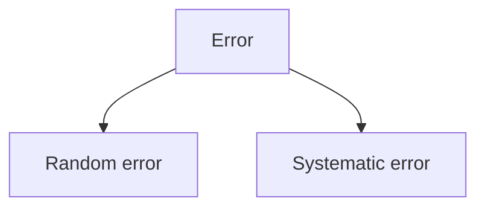
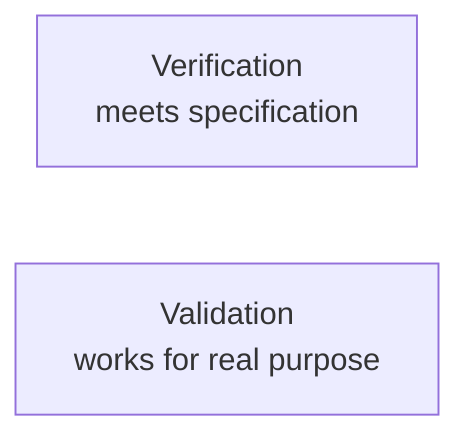

# Chapter 06 - Accuracy, Precision and Error

> **"A number can look exact and still be wrong."**

---

# Learning Objectives

By the end of this chapter you will be able to:

- Explain the difference between **accuracy** and **precision**.
- Recognise when repeated measurements are consistent but wrong.
- Identify random error and systematic error.
- Explain what calibration and zero error mean.
- Choose sensible decimal places.
- Decide when a measurement is good enough for a design task.
- Create a simple checking routine before using dimensions in CAD.

---

# Before We Begin

Imagine throwing five darts at a dartboard. Four different things can happen. Your darts might land in a tight cluster right on the bullseye, or in a tight cluster off in a corner. They might spread loosely around the centre, or scatter all over the board.

Every one of those patterns has a name in engineering, and every measuring tool you will ever use behaves like one of them. A tight cluster on the bullseye is accurate and precise. A tight cluster in the corner is precise but inaccurate - consistent, and consistently wrong. A loose spread around the centre is accurate on average but not precise. A scatter everywhere is neither.

> **[Sketch: four dartboards in a 2x2 grid - top-left "accurate AND precise"
> (tight cluster on the bullseye), top-right "precise, not accurate" (tight
> cluster near the edge), bottom-left "accurate on average, not precise"
> (loose spread around the centre), bottom-right "neither" (darts scattered
> everywhere)]**

Keep this picture in your head for the whole chapter. It is the signature image of measurement quality.

---

# Accuracy

**Accuracy** means:

> How close a measurement is to the true value.

Suppose a shaft is truly 5.00 mm in diameter.

A reading of:

```text
5.01 mm
```

is quite accurate.

A reading of:

```text
5.60 mm
```

is not accurate.

The difficulty is that we do not always know the true value exactly.

That is why engineers use standards, calibration tools and repeated checks.

---

# Precision

**Precision** means:

> How closely repeated measurements agree with one another.

Suppose you measure the same shaft five times.

```text
5.52 mm
5.51 mm
5.52 mm
5.51 mm
5.52 mm
```

These readings are very close together.

They are precise.

But if the shaft is truly 5.00 mm, they are not accurate.

This gives us an important lesson:

> Precision does not guarantee accuracy.

> **Learn more**
>
> - BBC Bitesize (KS3 Science): search "accuracy and precision" - the same dartboard idea, with practice questions
> - BBC Bitesize (KS3 Science): search "errors in measurement"

---

# Accuracy and Precision Together

A good measurement process aims for both: close to the true value, and repeatable.

But different jobs need different levels.

Measuring a body shell may not require the same accuracy as measuring a bearing seat.

---

# A Concrete Example

Suppose four students measure the same 10.00 mm block.

## Student A

```text
10.00
10.01
10.00
9.99
```

Accurate and precise.

## Student B

```text
10.42
10.41
10.42
10.41
```

Precise but inaccurate.

## Student C

```text
9.70
10.30
9.80
10.20
```

Average may be near 10.00, but the readings are not precise.

## Student D

```text
9.20
10.70
9.60
10.40
```

Neither accurate nor precise.

---

# Why Precision Can Be Misleading

A digital display may show:

```text
12.37 mm
```

The two decimal places make the value look trustworthy.

But the tool may have:

- a zero error
- dirty jaws
- bent jaws
- poor calibration
- low battery
- incorrect units
- too much measuring pressure

The display is precise in appearance.

That does not prove the result is accurate.

---

# Error

In measurement, **error** means:

> The difference between a measured value and the true value.

Error does not always mean someone made a careless mistake - some error is unavoidable in every real measurement. The goal is to reduce it, understand it, and report it honestly.

---

# Two Main Types of Error

We will begin with:

1. Random error
2. Systematic error



---

# Random Error

Random error changes unpredictably from one measurement to another.

Possible causes:

- slight hand movement
- changing jaw pressure
- rough surfaces
- small angle differences
- electronic noise
- reading variation

Example:

```text
10.01 mm
9.99 mm
10.02 mm
10.00 mm
```

The readings move slightly above and below the likely value.

Repeating measurements helps reveal random error.

---

# Systematic Error

Systematic error pushes measurements in the same direction.

Possible causes:

- calipers not zeroed
- ruler starting edge worn
- tool calibrated incorrectly
- measuring from the wrong reference
- using the wrong unit
- thermal expansion
- software scaling error

Example:

True value:

```text
10.00 mm
```

Readings:

```text
10.30 mm
10.31 mm
10.30 mm
10.29 mm
```

The results are repeatable but consistently too large.

Repeating the measurement does not remove systematic error.

You must find and correct the cause.

---

# Random vs Systematic Error

| Type | Pattern | Example cause | Helpful response |
|---|---|---|---|
| Random error | Readings scatter | Hand pressure changes | Repeat and average |
| Systematic error | Readings shift together | Tool not zeroed | Correct the method or tool |

This distinction is extremely important.

Averaging many wrong measurements does not make them right.

> **[Sketch: two dot-strips above a number line marked with the true value -
> "random error" dots scattered evenly around the true value, "systematic
> error" dots clustered tightly but shifted to one side of it]**

---

# Zero Error

Close digital calipers gently.

They should read:

```text
0.00 mm
```

Suppose they read:

```text
0.18 mm
```

That is a **zero error**.

Every reading may be shifted by about 0.18 mm.

The solution may be:

- clean the jaws
- close them correctly
- press zero
- inspect for damage
- replace or repair the tool

Always check zero before critical work.

---

# Calibration

**Calibration** means:

> Comparing a measuring tool with a trusted reference and correcting or recording any difference.

A trusted reference could be:

- gauge block
- known calibration bar
- certified standard
- accurately made pin
- trusted micrometer standard

For beginner work, you may not own formal calibration equipment.

You can still perform useful checks.

---

# Simple Calibration Checks

Possible checks include:

- close calipers and verify zero
- measure a trusted drill shank
- compare two measuring tools
- measure a known bearing
- check a ruler against another ruler
- verify units are millimetres

These checks do not replace professional calibration.

But they can reveal obvious problems.

---

# Reference Objects

A reference object is useful only if its dimension is trustworthy.

Examples:

- a random coin may be worn
- a printed cube may be inaccurate
- a cheap screw may vary
- a supplier's nominal size may not be exact

Do not assume an object is a standard just because its size is written on the packet.

---

# Repeatability

**Repeatability** means:

> Getting similar results when the same person measures the same thing with the same method and tool.

If your readings are:

```text
20.01
20.00
20.02
20.01
```

repeatability is good.

If they are:

```text
19.70
20.30
19.90
20.20
```

repeatability is poor.

Good repeatability helps us trust the measurement process.

---

# Reproducibility

**Reproducibility** means:

> Getting similar results when something important changes, such as the person, tool or location.

Suppose two people measure the same bearing.

Person A:

```text
10.99 mm
```

Person B:

```text
11.00 mm
```

That is good reproducibility.

If Person B gets:

```text
11.35 mm
```

the process should be investigated.

---

# Why Different People Measure Differently

Differences may come from:

- jaw pressure
- measurement angle
- feature interpretation
- tool handling
- choosing different contact points
- rounding
- recording mistakes

Clear procedures improve reproducibility.

---

# Resolution Revisited

A tool's **resolution** is the smallest change it displays.

Example:

```text
Digital caliper resolution = 0.01 mm
```

But actual uncertainty may be larger.

A tool can display 0.01 mm while only being trustworthy to around 0.02 mm, 0.05 mm or worse depending on quality and method.

Never confuse display resolution with guaranteed accuracy.

---

# Significant Figures

**Significant figures** are digits that meaningfully describe a measurement.

Suppose a ruler can reasonably measure to the nearest millimetre.

Writing:

```text
125.000 mm
```

pretends to know far more than the ruler can tell us.

A more honest record is:

```text
125 mm
```

With digital calipers, this may be sensible:

```text
12.34 mm
```

But only if the measurement method supports that level of detail.

---

# Decimal Places

Decimal places are the digits after the decimal point.

Examples:

```text
12 mm       = 0 decimal places
12.3 mm     = 1 decimal place
12.34 mm    = 2 decimal places
```

More decimal places do not automatically mean better data.

Use enough detail for the task.

---

# Sensible Reporting

For a body shell:

```text
Width approx. 180 mm
```

may be enough.

For a shaft:

```text
Diameter = 4.98 mm
```

may be appropriate.

For a rough cardboard mock-up:

```text
Length approx. 140 mm
```

may be all that is needed.

Match the measurement detail to the design decision.

---

# False Precision

**False precision** means showing more detail than the measurement can justify.

Example:

```text
Battery length = 138.72641 mm
```

If measured with ordinary calipers, this is unrealistic.

A better result might be:

```text
Battery length = 138.7 mm
```

False precision can make weak data look scientific.

Avoid it.

---

# Rounding

Rounding reduces a number to a sensible level of detail.

Example:

```text
Measured value = 12.347 mm
Rounded to 2 decimal places = 12.35 mm
Rounded to 1 decimal place = 12.3 mm
```

Standard rounding rule:

- next digit 0-4: keep the last digit
- next digit 5-9: increase the last digit by one

Do not round early during a calculation if the extra detail may matter.

Round the final result.

---

# Averaging Measurements

Suppose you record:

```text
10.02
10.01
10.03
```

Average:

```text
(10.02 + 10.01 + 10.03) / 3
= 10.02 mm
```

Averages help reduce random variation.

But averaging cannot fix:

- wrong tool units
- zero error
- wrong feature
- bent tool
- systematic bias

---

# Range

The **range** is the difference between the largest and smallest readings.

Example:

```text
Largest = 10.05 mm
Smallest = 9.98 mm

Range = 10.05 - 9.98
Range = 0.07 mm
```

A small range usually suggests better repeatability.

---

# Outliers

An **outlier** is a value far from the others.

Example:

```text
10.01
10.02
10.00
11.26
10.01
```

The 11.26 mm reading is suspicious.

Possible causes:

- tool slipped
- wrong feature measured
- recording error
- unit changed
- debris between jaws

Do not delete an outlier just because you dislike it.

Investigate it.

---

# Measurement Procedure

A good measurement procedure makes results more reliable.

Example for a bearing outside diameter:

1. Clean bearing and jaws.
2. Confirm millimetre mode.
3. Close and zero calipers.
4. Measure with light pressure.
5. Keep jaws square.
6. Record reading.
7. Rotate bearing 90 degrees.
8. Measure again.
9. Repeat once more.
10. Record average and range.

A procedure turns measurement into a repeatable process.

---

# Measurement Traceability

**Traceability** means being able to follow a measurement back to:

- the tool
- the method
- the date
- the reference
- the person
- the original readings

For this project, simple traceability may look like:

```text
Part: 5x11x4 bearing
Feature: Outside diameter
Tool: Digital caliper A
Date: 2026-07-11
Readings: 10.99, 11.00, 10.99 mm
Chosen value: 11.00 mm
Notes: Clean bearing, light pressure
```

This makes future checking possible.

---

# Verification

**Verification** means checking that something meets a stated requirement.

Example requirement:

```text
Bearing housing must accept an 11 mm bearing.
```

Verification could include:

- measuring the printed hole
- test-fitting the bearing
- checking insertion force
- checking that the bearing stays in place

Measurement is part of verification.

---

# Validation

**Validation** means checking that the design works for the real purpose.

A bearing may fit the hole perfectly.

But if the housing cracks during driving, the design is not valid for the job.

Verification asks:

> Did we build it as specified?

Validation asks:

> Did we build the right thing for real use?



Both matter.

---

# Accuracy Needed for Different Features

Not every dimension needs the same care.

## High Accuracy Needed

Examples:

- bearing fit
- shaft fit
- gear centre distance
- servo spline location
- screw clearance
- wheel hex fit

## Medium Accuracy Needed

Examples:

- battery tray walls
- electronics mounting
- body post spacing
- cable channels

## Lower Accuracy Often Acceptable

Examples:

- decorative body curves
- logo position
- non-contact surfaces
- visual chamfers

Spend effort according to function.

---

# Measurement Budget

Imagine you have one hour to measure a component.

Do not spend 50 minutes measuring decorative curves.

Focus on:

- interfaces
- moving clearances
- critical dimensions
- assembly access

This is a **measurement budget**.

Time is also a project resource.

---

# Error Stacking

Suppose three parts line up in a row.

Each one is slightly wrong.

Part A is 0.2 mm too long.

Part B is 0.2 mm too long.

Part C is 0.2 mm too long.

Together:

```text
0.2 + 0.2 + 0.2 = 0.6 mm
```

Small errors can add together.

This is called **error stacking** or **tolerance stack-up**.

We will study tolerances fully in the next chapter.

---

# A Buggy Example: Motor and Spur Alignment

Suppose:

- motor mount hole is shifted 0.2 mm
- motor body position is shifted 0.2 mm
- spur gear position is shifted 0.2 mm

The total misalignment may become large enough to affect gear mesh.

Each part looked almost correct.

The system does not.

---

# Checking With More Than One Method

For an important dimension, use two methods when practical.

Example: hole spacing.

Method 1:

- measure same-edge to same-edge

Method 2:

- insert pins and measure across them

If both methods agree, confidence increases.

This is called a **cross-check**.

---

# Compare Against Function

Numbers should always connect to function.

Suppose a hole measures:

```text
3.18 mm
```

Is that good?

We cannot answer until we know:

- What screw goes through it?
- Should the screw slide freely?
- Should the screw cut its own thread?
- Is the part printed or machined?
- Will paint or dirt reduce the hole?
- Is movement allowed?

A measurement is not good or bad by itself.

It is good or bad for a purpose.

---

# Good Enough

Engineering is not about making every measurement perfect.

It is about making it good enough for the requirement.

A body clip hole may work with a generous clearance.

A bearing seat may need much tighter control.

Ask:

> What happens if this dimension is wrong by 0.1 mm?

Possible answers:

- nothing important
- slight visual difference
- part rattles
- part will not fit
- gear alignment fails
- bearing cracks the housing

The consequence determines the needed accuracy.

---

# Hands-On Activity 1 - Dartboard Accuracy Model

Draw four targets on paper.

On each target, draw five dots.

Create these patterns:

1. Accurate and precise
2. Precise but inaccurate
3. Accurate on average but not precise
4. Neither accurate nor precise

Label each pattern.

Then write one measurement example for each.

---

# Hands-On Activity 2 - Repeated Measurement Test

Choose one rigid object.

Examples:

- coin
- bearing
- metal washer
- pen barrel
- small block

Measure the same feature ten times.

Record all readings.

Calculate:

- average
- largest value
- smallest value
- range

Ask:

- Are the results precise?
- Is there an obvious outlier?
- What may have caused the variation?

---

# Hands-On Activity 3 - Zero Error Experiment

With digital calipers:

1. Close the jaws.
2. Record the reading.
3. Open and close them five times.
4. Record each zero reading.
5. Clean the jaws.
6. Repeat.

Do not intentionally damage or force the tool.

Ask:

- Does zero repeat?
- Did cleaning change the result?
- Is the tool stable?

---

# Hands-On Activity 4 - Two-Person Measurement

Ask another person to measure the same object.

Use the same tool.

Do not show them your value first.

Compare:

- feature selected
- measurement method
- hand pressure
- result
- decimal places

This tests reproducibility.

---

# Engineering Challenge - Build a Measurement Confidence Sheet

Choose one critical component dimension.

Good examples:

- bearing outside diameter
- motor shaft diameter
- servo body width
- mounting-hole spacing
- battery maximum width

Create a record with:

## Identification

- Component
- Feature
- Why it matters

## Tool Check

- Tool name
- Unit mode
- Zero check
- Reference check, if available

## Measurements

- At least five readings
- Average
- Range
- Outliers

## Error Review

- Possible random errors
- Possible systematic errors
- Surface condition
- Temperature
- Measuring pressure

## Final Decision

- Chosen value
- Sensible decimal places
- Confidence level: low, medium or high
- Whether a second method is needed

---

# Thinking Like an Engineer

Suppose three printed holes all measure 0.4 mm too small.

A beginner might enlarge each CAD hole by guessing.

An engineer asks:

- Is the caliper accurate?
- Are the holes truly circular?
- Is the slicer shrinking holes?
- Is the printer over-extruding?
- Is the material contracting?
- Are the holes being measured correctly?
- Is the same systematic error appearing in every print?

A repeated pattern often points to a systematic cause.

---

# Another Example: Inconsistent Bearing Fit

Suppose three identical printed bearing seats behave differently.

Possible causes include:

- random printer variation
- changing temperature
- inconsistent part cooling
- different print orientation
- elephant's foot
- debris
- warped print bed
- measurement pressure
- bearing size variation

The correct response is not to change everything at once.

Measure each factor and look for patterns.

---

# Common Beginner Mistakes

## Mistake 1 - Treating Precision as Accuracy

Repeated wrong readings can be very precise.

Check the tool and method.

---

## Mistake 2 - Believing the Display

A digital display can show a confident-looking wrong answer.

Verify zero and references.

---

## Mistake 3 - Averaging Systematic Error

Averaging helps random variation.

It does not correct a constant bias.

---

## Mistake 4 - Deleting Outliers Without Investigation

An outlier may reveal a real problem.

Find the cause first.

---

## Mistake 5 - Reporting Too Many Decimal Places

Do not pretend to know more than the tool and method support.

---

## Mistake 6 - Using Different Methods Without Recording Them

Changing pressure, orientation or tool changes the measurement process.

Record the method.

---

## Mistake 7 - Measuring Only the Easy Dimensions

Critical interfaces deserve the most careful work.

---

## Mistake 8 - Confusing Verification and Validation

A part can meet its drawing and still fail in real use.

---

## Mistake 9 - Seeking Perfect Measurement

Perfect measurement is impossible.

Seek enough confidence for the requirement.

---

# Optional Challenge - Detect a Hidden Bias

Measure the same object with two different tools.

Examples:

- two digital calipers
- caliper and micrometer
- two rulers
- caliper and known gauge

Take at least five readings with each tool.

Compare averages.

If one tool consistently reads higher, investigate:

- zero
- calibration
- pressure
- alignment
- tool wear

Do not assume which tool is correct without evidence.

---

# Optional Challenge - Accuracy for Different Jobs

Choose these three features:

1. Decorative body vent
2. Battery tray width
3. Bearing seat diameter

For each, answer:

- What happens if it is 0.5 mm wrong?
- What happens if it is 0.1 mm wrong?
- How many decimal places are useful?
- What tool should measure it?
- Is test fitting required?

This activity connects accuracy to function.

---

# Chapter Summary

In this chapter, we learned that accuracy and precision are different.

- Accuracy means closeness to the true value.
- Precision means closeness between repeated measurements.

We also learned:

- random error causes scatter
- systematic error causes consistent bias
- zero error shifts every reading
- calibration compares a tool with a trusted reference
- repeatability checks the same method
- reproducibility checks results across people or conditions
- resolution is not the same as accuracy
- false precision makes weak data look stronger than it is
- averaging helps random error but not systematic error
- verification checks requirements
- validation checks real-world usefulness
- measurement effort should match the consequence of being wrong

A trustworthy number comes from a trustworthy process.

---

# New Words

| Word | Meaning |
|---|---|
| Accuracy | Closeness of a measurement to the true value. |
| Precision | Closeness of repeated measurements to one another. |
| Error | Difference between a measured value and the true value. |
| Random error | Unpredictable variation between measurements. |
| Systematic error | A consistent shift that affects measurements in the same direction. |
| Zero error | Measurement shift caused by a tool not reading zero when it should. |
| Calibration | Comparison of a tool with a trusted reference. |
| Repeatability | Agreement when the same measurement is repeated under the same conditions. |
| Reproducibility | Agreement when person, tool or conditions change. |
| Significant figures | Digits that meaningfully describe a value. |
| Decimal place | A digit position to the right of a decimal point. |
| False precision | Reporting more detail than the measurement supports. |
| Rounding | Reducing a number to a sensible level of detail. |
| Average | Sum of values divided by the number of values. |
| Range | Difference between the largest and smallest values. |
| Outlier | A value far from the other results. |
| Traceability | Ability to follow a measurement back to its method, tool and records. |
| Verification | Checking that something meets a stated requirement. |
| Validation | Checking that something works for its real purpose. |
| Cross-check | Checking a result using another method. |
| Error stacking | Small errors adding together across several parts. |

---

# Review Questions

1. What is accuracy?
2. What is precision?
3. Can a measurement be precise but inaccurate?
4. What is random error?
5. What is systematic error?
6. Why does repeating measurements help random error?
7. Why does repeating measurements not fix systematic error?
8. What is zero error?
9. What is calibration?
10. What is repeatability?
11. What is reproducibility?
12. Why can two people get different results?
13. What is false precision?
14. Why should decimal places match the tool and task?
15. What is an outlier?
16. Why should an outlier be investigated?
17. What is the range of a set of readings?
18. What does traceability mean?
19. What is the difference between verification and validation?
20. Why do bearing seats need more careful measurement than decorative curves?
21. What is error stacking?
22. Why can three nearly correct parts create one badly aligned assembly?
23. What is a cross-check?
24. What does "good enough" mean in engineering?
25. Why is a trustworthy process more important than a confident-looking number?

---

# Chapter Checklist

- [ ] I can explain accuracy in my own words.
- [ ] I can explain precision in my own words.
- [ ] I understand that precision does not guarantee accuracy.
- [ ] I can identify random and systematic error.
- [ ] I know how to check for zero error.
- [ ] I understand calibration.
- [ ] I know the difference between repeatability and reproducibility.
- [ ] I understand resolution and false precision.
- [ ] I can round measurements sensibly.
- [ ] I can calculate an average and range.
- [ ] I know how to investigate an outlier.
- [ ] I understand verification and validation.
- [ ] I understand that different features need different accuracy.
- [ ] I completed at least one hands-on activity.
- [ ] I created a measurement confidence sheet.
- [ ] I added my results to my engineering notebook.

---

# Looking Ahead

We now know how to measure and how to judge the quality of a measurement.

The next question is:

> How much difference can two connected parts allow?

In the next chapter, we will study **tolerances and fits**.

We will learn:

- why a 5 mm shaft should not always go into a 5 mm hole
- the difference between clearance, transition and interference fits
- why 3D printed holes often need adjustment
- how tolerances stack across assemblies
- how to design parts that can actually be assembled
- how to create small test coupons before printing a large component
