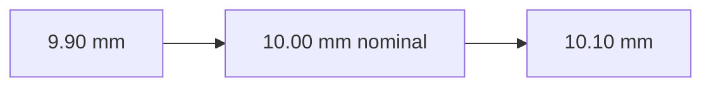
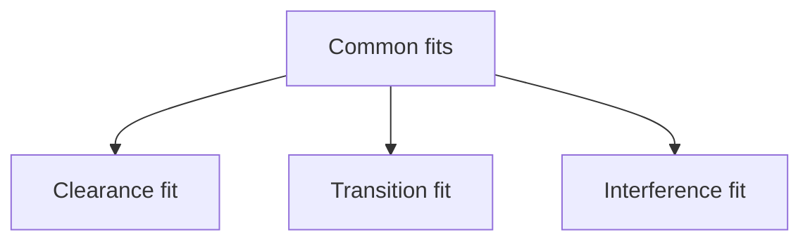
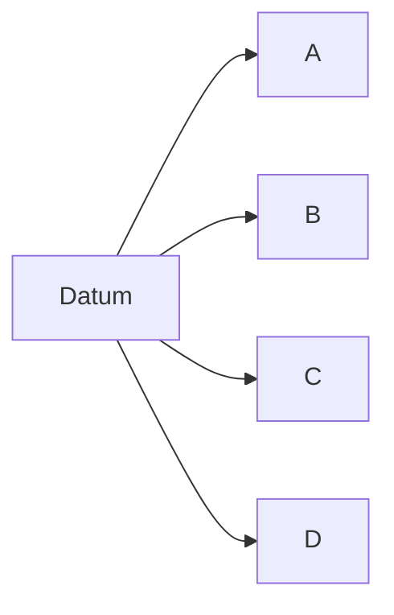
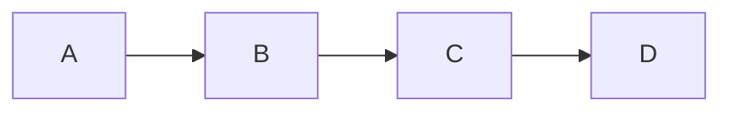
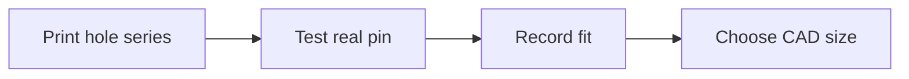

# Topic 1.7 - Tolerances and Fits

> **"Two parts can both be made correctly and still fail to fit together."**

---

# Learning Objectives

By the end of this topic you will be able to:

- Explain what a tolerance is.
- Understand why dimensions are allowed to vary.
- Describe clearance, transition and interference fits.
- Explain why a 5 mm shaft usually should not go into a 5 mm printed hole.
- Choose a sensible first clearance for different types of connections.
- Understand tolerance stack-up.
- Design a simple test coupon to discover how your printer behaves.

---

# Before We Begin

Imagine building a wooden box with a lid.

If the lid is exactly the same size as the opening, what happens?

It may:

- jam
- scrape
- refuse to enter
- fit only when pushed hard

Now make the lid slightly smaller.

It can slide into place.

But if it is too small, it rattles.

The useful fit exists between two bad extremes:

- too tight
- too loose

This topic is about designing that useful middle.

---

# Why Exact Size Is Not Real

Suppose a drawing says:

```text
Shaft diameter = 5.00 mm
```

In the real world, a manufactured shaft may measure:

```text
4.98 mm
4.99 mm
5.00 mm
5.01 mm
```

No process makes every part perfectly identical.

Variation comes from:

- tool wear
- material shrinkage
- machine calibration
- temperature
- measurement error
- printer settings
- surface roughness
- material batch differences

Engineering accepts this.

Instead of demanding impossible perfection, engineers define acceptable limits.

---

# Tolerance

A **tolerance** is:

> The allowed amount a dimension may vary.

Example:

```text
10.00 ± 0.10 mm
```

This means the dimension may be as small as:

```text
9.90 mm
```

or as large as:

```text
10.10 mm
```



Any value inside that range is acceptable.

---

# Nominal Size

The **nominal size** is the named or target size.

Example:

```text
Nominal shaft size = 5 mm
```

The actual shaft may be slightly different.

Nominal size is useful for naming and planning.

Actual size determines the real fit.

---

# Upper and Lower Limits

A tolerance creates two limits.

## Upper Limit

The largest acceptable size.

## Lower Limit

The smallest acceptable size.

Example:

```text
20.0 ± 0.2 mm
```

Upper limit:

```text
20.2 mm
```

Lower limit:

```text
19.8 mm
```

---

# Bilateral Tolerance

A **bilateral tolerance** allows variation in both directions.

Example:

```text
10.0 ± 0.2 mm
```

The size may be larger or smaller than nominal.

---

# Unilateral Tolerance

A **unilateral tolerance** allows variation mainly in one direction.

Example:

```text
10.0 +0.2 / -0.0 mm
```

This means:

```text
Minimum = 10.0 mm
Maximum = 10.2 mm
```

Unilateral tolerances are useful when one side of the nominal size must not be crossed.

---

# Why Tolerance Exists

Tolerance helps answer:

- How much variation is acceptable?
- Will the part still work?
- Can it still be assembled?
- Will movement remain smooth?
- Will strength remain safe?
- Can the part be made economically?

Tighter tolerances usually require:

- better machines
- more checking
- slower production
- more rejected parts
- higher cost

Use tight tolerances only where the function needs them.

---

# Fit

A **fit** describes the relationship between two parts that connect.

Common examples:

- shaft in bearing
- screw through hole
- bearing in housing
- servo in mount
- battery in tray
- body post through body hole
- pin in hinge

The fit depends on both parts.

---

# Hole and Shaft Language

Engineers often describe connected cylindrical parts as:

- hole
- shaft

The "shaft" may be:

- a metal axle
- a printed pin
- a screw
- a bearing outside diameter
- a round peg

The "hole" may be:

- a drilled opening
- a bearing seat
- a printed bore
- a wheel hub
- a sleeve

The language describes the fitting relationship, not only the object's job.

---

# Clearance

**Clearance** is the empty space between connected parts.

For a round shaft and hole:

```text
Clearance = Hole size - Shaft size
```

Example:

```text
Hole = 5.30 mm
Shaft = 5.00 mm

Clearance = 0.30 mm
```

A positive number means the hole is larger.

---

# Three Main Types of Fit

The three useful categories are:

1. Clearance fit
2. Transition fit
3. Interference fit



---

# Clearance Fit

A **clearance fit** means the hole is larger than the shaft.

The parts can:

- slide
- rotate
- assemble easily
- be removed easily

Examples:

- screw through a clearance hole
- axle through a non-bearing guide
- body post through a body hole
- battery sliding into a tray
- hinge pin through a suspension arm

```text
Hole:   (     )
Shaft:    | |
Space remains between them
```

Too much clearance causes:

- wobble
- rattle
- poor alignment
- wear
- inaccurate steering

Too little clearance causes:

- binding
- difficult assembly
- friction
- cracking

---

# Transition Fit

A **transition fit** lies near the boundary between clearance and interference.

Depending on actual part sizes, it may:

- slide with light pressure
- need a gentle push
- hold without obvious looseness

Examples:

- removable locating peg
- lightly held bearing
- alignment dowel
- printed cover that snaps into place gently

Transition fits are sensitive to printer and material variation.

They should be tested.

---

# Interference Fit

An **interference fit** means the shaft or inserted part is larger than the opening.

The parts must deform slightly during assembly.

Examples:

- press-fit bearing
- metal pin pressed into plastic
- printed plug held by friction
- tightly fitted wheel insert

```text
Opening smaller than inserted part
```

Interference fits can hold parts without screws.

But too much interference may:

- crack the housing
- deform the bearing
- make removal impossible
- create high stress
- damage printed layers

---

# A Simple Fit Example

Suppose a bearing outside diameter is:

```text
11.00 mm
```

Possible printed seat designs:

## Loose Clearance

```text
Hole = 11.30 mm
```

Likely easy to insert, but may rattle.

## Close Fit

```text
Hole = 11.05 mm
```

May be snug depending on printer behaviour.

## Nominal Match

```text
Hole = 11.00 mm
```

May print undersized and become too tight.

## Interference

```text
Hole = 10.90 mm
```

May require pressing and may crack the housing.

The CAD value alone does not guarantee the printed result.

---

# Why Printed Holes Often Come Out Small

3D printed holes may print smaller than their CAD size because of:

- extrusion width
- curved tool paths
- material shrinkage
- over-extrusion
- layer squish
- polygon approximation
- slicer behaviour
- printer calibration
- cooling

A CAD hole of:

```text
5.00 mm
```

might print as:

```text
4.70 mm
```

or:

```text
4.85 mm
```

This is why test pieces are valuable.

---

# Why Printed Shafts May Come Out Large

Printed shafts or pegs may print oversized because of:

- over-extrusion
- seam blobs
- first-layer expansion
- rough surface
- dimensional calibration
- material flow

A CAD shaft of:

```text
5.00 mm
```

may behave like a larger part during assembly.

The rough surface also increases friction.

---

# Compensation

**Compensation** means changing the CAD or slicer dimension to produce the desired real result.

Example:

```text
Desired printed hole = 5.00 mm
Printer produces holes 0.20 mm small
CAD hole may need to be about 5.20 mm
```

This is only an example.

The correct value must be tested on your printer, material and settings.

---

# Do Not Memorise One Magic Clearance

You may hear advice such as:

```text
Always add 0.2 mm.
```

That is not universally correct.

Required clearance depends on:

- printer
- nozzle size
- material
- layer height
- print orientation
- part size
- desired movement
- temperature
- wear
- surface finish

Use starting values as experiments, not laws.

---

# Clearance per Side

Suppose a round shaft is 5.00 mm and a hole is 5.40 mm.

Total diameter clearance:

```text
5.40 - 5.00 = 0.40 mm
```

Clearance per side:

```text
0.40 / 2 = 0.20 mm
```

This distinction matters.

Sometimes designers say "0.2 mm clearance" but do not say whether they mean:

- total difference
- clearance on each side

Always state it clearly.

---

# Functional Fits for the Buggy

Different parts need different fits.

| Connection | Likely fit goal |
|---|---|
| Screw through mounting plate | Free clearance |
| Bearing in removable housing | Close or light press fit |
| Hinge pin in suspension arm | Free movement with little wobble |
| Battery in tray | Easy sliding clearance |
| Servo in mount | Small clearance for installation |
| Wheel hex in wheel | Close fit |
| Body post through shell | Loose clearance |
| Cover locating tab | Transition fit |

One number cannot serve every connection.

---

# Running Fit

A **running fit** allows repeated movement.

Examples:

- rotating shaft in a plain printed guide
- suspension pin through an arm
- sliding battery latch
- steering linkage pin

A running fit needs enough clearance for:

- surface roughness
- dirt
- temperature change
- slight misalignment
- repeated motion

Very small clearance may work on a clean desk and bind outdoors.

---

# Sliding Fit

A **sliding fit** allows movement along a path with little wobble.

Examples:

- battery tray rail
- adjustable motor plate
- removable electronics drawer

The design must balance:

- smooth movement
- low wobble
- print variation
- dirt resistance

---

# Locational Fit

A **locational fit** positions one part accurately.

Examples:

- motor locating boss
- gearbox case alignment pin
- servo locating pocket
- bearing shoulder

A locating feature may use a close fit while screws provide clamping.

This separates two jobs:

- feature locates
- screws hold

That is often better than asking screws to do both.

---

# Press Fit

A **press fit** uses interference to hold parts together.

The inserted part pushes against the surrounding material.

Press fits are useful but risky in printed plastic.

Important factors include:

- wall thickness
- material flexibility
- layer direction
- insertion chamfer
- interference amount
- temperature
- bearing sensitivity

Always test press fits before using them in a large part.

---

# Snap Fit

A **snap fit** uses temporary bending during assembly.

A tab bends.

It passes over an edge.

It returns toward its original position and locks.

Examples:

- battery cover
- cable clip
- electronics lid
- body panel latch

Snap fits need:

- flexible material
- smooth root fillets
- enough bending length
- controlled strain
- assembly access

A short thick tab may break.

A longer thinner tab may flex safely.

---

# Threaded Fit

A screw may connect to a printed part in several ways.

## Clearance Hole and Nut

Screw passes freely through the print and tightens into a nut.

## Self-Tapped Thread

Screw cuts or forms a thread directly in the plastic.

## Heat-Set Insert

A heated metal insert is placed into the plastic.

## Captive Nut

A nut sits in a shaped pocket.

Each method needs different hole dimensions.

Do not use one "M3 hole" for every screw connection.

---

# Example M3 Hole Purposes

Possible CAD hole sizes might differ for:

- M3 screw clearance
- M3 self-tapping into plastic
- M3 heat-set insert
- M3 nut trap
- M3 countersunk head

The correct size depends on the actual hardware and process.

Use supplier recommendations and print tests.

---

# Allowance

**Allowance** is the intentional difference between mating parts.

Example:

```text
Battery width = 47.0 mm
Tray internal width = 48.0 mm
Allowance = 1.0 mm total
```

The allowance is designed in on purpose.

The actual clearance may vary because both parts have tolerances.

---

# Worst-Case Fit

Suppose a shaft can be:

```text
4.98 to 5.02 mm
```

and a hole can be:

```text
5.05 to 5.15 mm
```

Smallest clearance occurs with:

```text
Smallest hole - largest shaft
5.05 - 5.02 = 0.03 mm
```

Largest clearance occurs with:

```text
Largest hole - smallest shaft
5.15 - 4.98 = 0.17 mm
```

The fit may vary from 0.03 mm to 0.17 mm clearance.

This is a **worst-case analysis**.

---

# Why Worst-Case Analysis Matters

A prototype may fit because you happened to combine:

- a small shaft
- a large hole

Another build may jam because it combines:

- a large shaft
- a small hole

Design should work across the expected variation, not only one lucky pair.

---

# Tolerance Stack-Up

Imagine three spacers placed in a row.

Each spacer is intended to be:

```text
10.0 mm
```

Each has a tolerance of:

```text
±0.2 mm
```

Nominal total:

```text
30.0 mm
```

Worst-case smallest total:

```text
9.8 + 9.8 + 9.8 = 29.4 mm
```

Worst-case largest total:

```text
10.2 + 10.2 + 10.2 = 30.6 mm
```

Total possible range:

```text
1.2 mm
```

Small part variations added into a large assembly variation.

---

# Buggy Stack-Up Example

Suppose wheel position depends on:

- chassis width
- suspension arm length
- hub width
- wheel hex thickness

If each part varies slightly, total track width may change enough to affect:

- body clearance
- steering geometry
- tyre rubbing
- left-right symmetry

A dimension chain should be studied as a system.

---

# Datum

A **datum** is a chosen reference point, line or surface.

Measurements are taken from that reference.

Examples:

- bottom of chassis
- centreline of vehicle
- front bulkhead face
- motor mounting surface

Using one clear datum reduces error stacking.

---

# Why One Datum Helps

Suppose three holes are measured from one another:

```text
Hole A to B
Hole B to C
Hole C to D
```

Each spacing error adds.

A better method may be to locate every hole from one common datum:

```text
Datum to A
Datum to B
Datum to C
Datum to D
```



This can reduce accumulated positional error.

---

# Baseline Dimensioning

**Baseline dimensioning** measures several features from one common reference.

This is useful for:

- motor mount slots
- suspension pickup points
- servo mounting holes
- chassis component locations

It often makes inspection easier.

---

# Chain Dimensioning

**Chain dimensioning** measures each feature from the previous feature.

This can be convenient.

But errors may stack along the chain.



Use chain dimensions carefully when the final position matters.

---

# Clearance Around Rectangular Parts

A battery tray needs clearance in:

- width
- length
- height

Example:

```text
Battery width = 47.0 mm
Tray width = 48.0 mm
Total width clearance = 1.0 mm
Clearance per side = 0.5 mm
```

But also consider:

- rounded corners
- labels
- swelling
- straps
- dirt
- wire exit
- removal angle

A simple box dimension may not capture everything.

---

# Thermal Expansion

Parts change size with temperature.

Most of the time, the change is small.

But tight fits can be affected by:

- hot motor mount
- cold outdoor running
- warm battery
- sun-heated body
- freshly printed parts

A fit that is perfect indoors may tighten or loosen outdoors.

---

# Dirt and Outdoor Use

An RC buggy runs in:

- dust
- sand
- grass
- mud
- small stones

A close sliding fit may collect dirt and jam.

Outdoor mechanisms often need:

- more clearance
- drainage
- covers
- easy cleaning
- replaceable wear parts

Design for the real environment.

---

# Surface Roughness

A printed surface is not perfectly smooth.

Layer lines and seams create high points.

Two rough surfaces may need more clearance than two polished surfaces.

A fit may improve after:

- light sanding
- reaming
- drilling
- deburring

If post-processing is planned, document it as part of the process.

---

# Elephant's Foot

The first printed layer may spread outward.

This is often called **elephant's foot**.

It can make:

- tabs too wide
- slots too narrow
- bottom edges interfere
- parts difficult to assemble

Possible solutions include:

- printer calibration
- first-layer compensation
- small chamfers
- post-processing

Do not redesign the entire part until you identify the cause.

---

# Chamfers for Assembly

A **chamfer** is a sloped edge.

A small chamfer can guide parts together.

Examples:

- bearing entering housing
- peg entering hole
- screw entering clearance hole
- battery entering tray

```text
Sharp entry:    | |
Chamfered:     \   /
```

Chamfers improve assembly without changing the main fit.

---

# Lead-In

A **lead-in** is an entry feature that helps alignment.

It may be:

- chamfer
- rounded edge
- tapered pin
- widened slot entrance

Lead-ins are especially useful for parts assembled by children or in the field.

---

# Test Coupons

A **test coupon** is a small printed sample used to test one design question.

Instead of printing a complete suspension arm to test a hole, print a small block containing several hole sizes.

Benefits:

- faster
- cheaper
- easier to compare
- less material
- clearer results

---

# Hole Test Coupon

Example hole series for a 5 mm pin:

```text
5.00 mm
5.10 mm
5.20 mm
5.30 mm
5.40 mm
5.50 mm
```

After printing, test the real pin in each hole.

Record:

- will not enter
- press fit
- snug fit
- free sliding fit
- loose fit



---

# Peg Test Coupon

You can also test printed pegs.

Example:

```text
4.70 mm
4.80 mm
4.90 mm
5.00 mm
5.10 mm
```

Test them in a real bearing or hole.

Printed external and internal dimensions may behave differently.

Test both when needed.

---

# Snap-Fit Coupon

A snap-fit coupon may test tabs with:

- different thicknesses
- different lengths
- different hook depths
- different fillets

This is safer than guessing on a full battery lid.

---

# Record the Whole Print Setup

A fit result is only reusable if you record:

- printer
- nozzle
- layer height
- material
- material brand
- print orientation
- wall count
- temperature
- slicer
- scaling or compensation
- date

Change the process and the fit may change.

---

# First-Pass Starting Clearances

The values below are only starting experiments for typical hobby FDM printing.

They are not guaranteed.

| Fit goal | Possible starting total clearance |
|---|---:|
| Very close non-moving fit | 0.10-0.20 mm |
| Sliding fit | 0.20-0.40 mm |
| Easy assembly | 0.40-0.60 mm |
| Dirty outdoor movement | 0.50 mm or more |
| Loose body or cable opening | 0.60 mm or more |

For round features, confirm whether clearance is:

- total diameter difference
- per-side clearance

Always test.

---

# Designing a Bearing Seat

A bearing seat should consider:

- actual bearing OD
- printed hole behaviour
- insertion force
- wall thickness
- bearing removal
- housing split
- temperature
- bearing distortion

Possible approaches:

## Loose Seat With Retainer

Bearing slides in easily and is held by:

- cover
- clip
- screw
- shoulder

## Snug Seat

Bearing pushes in by hand and remains in place.

## Press Fit

Bearing requires controlled pressing.

For a beginner build, a retained close fit is often easier to service than a strong press fit.

---

# Designing a Hinge-Pin Hole

The suspension hinge pin should move smoothly without excessive wobble.

Consider:

- pin diameter
- hole diameter
- print orientation
- arm width
- dirt
- wear
- lubrication
- whether a metal bushing is used

A tight hole may be reamed or drilled after printing.

If post-processing is required, state it in the build instructions.

---

# Designing a Battery Tray

The battery tray must allow:

- insertion
- removal
- wire routing
- straps
- slight battery size variation
- possible swelling
- dirt
- protective padding

A tray that grips the battery tightly on every side may damage it or make removal difficult.

Use straps or a latch to retain it.

Do not depend only on a jam fit.

---

# Designing a Servo Pocket

A servo pocket should account for:

- body tolerance
- label thickness
- wire exit
- mounting tabs
- horn movement
- installation angle
- removal tool access

A small body clearance plus screws is usually better than a press fit.

---

# Thinking Like an Engineer

Suppose a printed pin will not enter a printed hole.

Do not immediately scale the whole model.

Ask:

- What are the actual dimensions?
- Is the hole undersized?
- Is the pin oversized?
- Is there a seam?
- Is elephant's foot interfering?
- Is the part tilted?
- Is the intended fit sliding or press?
- Did the material change?
- Did print orientation change?
- Would a chamfer help?
- Is post-processing planned?

Fit problems contain several possible causes.

Measure before changing CAD.

---

# Hands-On Activity 1 - Everyday Fits

Find examples of:

- loose clearance fit
- sliding fit
- snug transition fit
- interference fit
- snap fit

Possible objects:

- pen cap
- bottle lid
- drawer
- USB plug
- toy brick
- battery cover
- chair leg insert

For each, record:

- parts involved
- type of fit
- whether movement is needed
- what would happen if tighter
- what would happen if looser

---

# Hands-On Activity 2 - Paper Tolerance Game

Draw a target dimension:

```text
50 ± 2 mm
```

Cut five paper strips while trying to make each 50 mm long.

Measure them.

Classify each as:

- acceptable
- too short
- too long

Then calculate:

- smallest
- largest
- range

This makes tolerance concrete.

---

# Hands-On Activity 3 - Design a Fit Coupon

Create a CAD sketch or paper design for a fit coupon.

For a 5 mm shaft, include holes:

```text
5.0
5.1
5.2
5.3
5.4
5.5 mm
```

Add labels next to each hole.

If you have access to a printer, print it using the material planned for the buggy.

Test the actual shaft.

---

# Hands-On Activity 4 - Stack-Up Experiment

Use three or more small objects, such as:

- washers
- coins
- printed spacers
- cardboard strips

Measure each thickness.

Add the individual measurements.

Then measure the combined stack.

Compare:

```text
Sum of individual measurements
vs
Measured total stack
```

Discuss why they may differ.

---

# Engineering Challenge - Build a Fit Library

Create a project file called:

```text
fit-library.md
```

For each tested fit, record:

## Test Setup

- Printer
- Material
- Nozzle
- Layer height
- Orientation
- Date

## Mating Part

- Part name
- Nominal size
- Actual measured size

## Test Geometry

- CAD size
- Printed measured size
- Fit result

## Fit Rating

Use simple labels:

- impossible
- press
- snug
- smooth
- loose
- very loose

## Final Recommendation

Example:

```text
For a 5.00 mm steel pin in PETG:
CAD hole 5.30 mm gave smooth movement.
Printed flat with 0.20 mm layers.
```

Over time, this becomes a valuable design reference.

---

# Common Beginner Mistakes

## Mistake 1 - Making Connected Parts the Same CAD Size

A 5 mm shaft and 5 mm hole may not assemble.

Design the intended fit.

---

## Mistake 2 - Using One Clearance Everywhere

Moving, locating, pressing and loose parts need different fits.

---

## Mistake 3 - Ignoring Printer-Specific Behaviour

A fit that works on one printer may fail on another.

Test your process.

---

## Mistake 4 - Confusing Total and Per-Side Clearance

State clearly how clearance is measured.

---

## Mistake 5 - Making Press Fits Too Aggressive

Printed housings can crack or distort bearings.

Start conservatively and test.

---

## Mistake 6 - Ignoring Dirt and Temperature

Outdoor parts need more real-world allowance than clean desk models.

---

## Mistake 7 - Changing a Large Part to Test One Hole

Use a small coupon.

---

## Mistake 8 - Forgetting Chamfers

A small lead-in can turn a difficult assembly into an easy one.

---

## Mistake 9 - Measuring Only Nominal Sizes

Actual parts vary.

Measure the real hardware.

---

## Mistake 10 - Ignoring Tolerance Stack-Up

Several small errors can create one large assembly error.

---

# Optional Challenge - Worst-Case Battery Tray

Suppose:

```text
Battery width: 46.8 to 47.4 mm
Printed tray width: CAD value ±0.3 mm
```

You want at least:

```text
0.3 mm clearance per side
```

Questions:

1. What is the largest possible battery?
2. What is the smallest possible printed tray if CAD width is 48.0 mm?
3. Will the largest battery have enough clearance?
4. What CAD tray width gives safer worst-case clearance?

Work through the values.

Example:

```text
Largest battery = 47.4 mm
Smallest 48.0 mm tray = 47.7 mm
Total clearance = 0.3 mm
Per-side clearance = 0.15 mm
```

That is less than the desired 0.3 mm per side.

The tray should be wider.

---

# Optional Challenge - Common Datum Layout

Draw a chassis centreline.

Place four mounting holes.

Create two dimension plans:

## Chain Plan

```text
Hole 1 -> Hole 2 -> Hole 3 -> Hole 4
```

## Baseline Plan

```text
Centreline -> Hole 1
Centreline -> Hole 2
Centreline -> Hole 3
Centreline -> Hole 4
```

Explain which plan better controls each hole's position relative to the centreline.

---

# Topic Summary

In this topic, we learned that real parts always vary.

A tolerance defines acceptable variation.

A fit describes how connected parts behave together.

The main fit types are:

- clearance fit
- transition fit
- interference fit

We also learned:

- printed holes often come out small
- printed shafts may come out large
- compensation must be tested
- different functions need different clearances
- outdoor movement needs dirt allowance
- chamfers and lead-ins improve assembly
- small dimensional errors can stack across a system
- common datums can reduce accumulated error
- test coupons are faster and cheaper than guessing
- a fit library becomes a printer-specific engineering tool

The correct fit is not the tightest fit.

It is the fit that allows the part to perform its job reliably.

---

# New Words

| Word | Meaning |
|---|---|
| Tolerance | The allowed variation in a dimension. |
| Nominal size | The named or target size of a part. |
| Upper limit | The largest acceptable size. |
| Lower limit | The smallest acceptable size. |
| Bilateral tolerance | Variation allowed above and below nominal. |
| Unilateral tolerance | Variation allowed mainly in one direction. |
| Fit | The relationship between two connected parts. |
| Clearance | Empty space between mating parts. |
| Clearance fit | A fit where the opening is larger than the inserted part. |
| Transition fit | A fit near the boundary between clearance and interference. |
| Interference fit | A fit where the inserted part is larger than the opening. |
| Running fit | A fit designed for repeated movement. |
| Sliding fit | A fit designed for controlled sliding. |
| Locational fit | A fit used to position a part accurately. |
| Press fit | An interference fit assembled using force. |
| Snap fit | A connection made by temporary elastic bending. |
| Allowance | An intentional dimensional difference between mating parts. |
| Compensation | An adjustment made to achieve the desired real size. |
| Worst-case analysis | Checking the most extreme allowed combination of dimensions. |
| Tolerance stack-up | Accumulation of dimensional variation across several parts. |
| Datum | A chosen reference point, line or surface. |
| Baseline dimensioning | Locating several features from one common reference. |
| Chain dimensioning | Locating each feature from the previous one. |
| Chamfer | A sloped edge. |
| Lead-in | A feature that guides parts into alignment during assembly. |
| Test coupon | A small sample used to test one design feature or process. |
| Elephant's foot | Outward spreading of the first printed layer. |
| Fit library | A record of tested dimensions and resulting fits. |

---

# Review Questions

1. Why can real parts not be made to one perfectly exact size?
2. What is a tolerance?
3. What is nominal size?
4. What are upper and lower limits?
5. What is the difference between bilateral and unilateral tolerance?
6. What is a clearance fit?
7. What is a transition fit?
8. What is an interference fit?
9. How is clearance calculated for a shaft and hole?
10. What is the difference between total clearance and per-side clearance?
11. Why may a 5 mm CAD hole print smaller than 5 mm?
12. Why should you not memorise one universal clearance?
13. What is a running fit?
14. What is a locational fit?
15. What is a press fit?
16. Why can a strong press fit be risky in printed plastic?
17. What is allowance?
18. What is worst-case analysis?
19. What is tolerance stack-up?
20. What is a datum?
21. How does baseline dimensioning differ from chain dimensioning?
22. Why does outdoor dirt affect fit design?
23. What is elephant's foot?
24. Why are chamfers useful?
25. What is a test coupon?
26. What information should be stored in a fit library?
27. Why is a retained bearing fit often easier to service than a heavy press fit?
28. Why should the real battery be measured before designing its tray?
29. What should be checked when a printed pin will not enter a printed hole?
30. Why is the tightest fit not always the best fit?

---

# Topic Checklist

- [ ] I understand why dimensions need tolerances.
- [ ] I know nominal size, upper limit and lower limit.
- [ ] I understand bilateral and unilateral tolerances.
- [ ] I can explain clearance, transition and interference fits.
- [ ] I can calculate total clearance.
- [ ] I understand clearance per side.
- [ ] I know why printed holes and shafts may need compensation.
- [ ] I understand that fit depends on function.
- [ ] I know what running, sliding, locational and press fits are.
- [ ] I understand allowance and worst-case fit.
- [ ] I can explain tolerance stack-up.
- [ ] I know what a datum is.
- [ ] I understand baseline and chain dimensioning.
- [ ] I know why chamfers and lead-ins help assembly.
- [ ] I understand the value of test coupons.
- [ ] I completed at least one hands-on activity.
- [ ] I created or planned a fit coupon.
- [ ] I started a fit library.
- [ ] I added results to my engineering notebook.

---

# Looking Ahead

We can now measure parts and decide how closely they should fit.

The next step is learning how engineers communicate shape and size clearly.

In the next topic, we will study **engineering drawings**.

We will learn:

- why one picture is not enough
- front, top and side views
- hidden features
- centre lines
- section views
- dimension placement
- notes and callouts
- how a drawing becomes a contract between design and manufacturing
