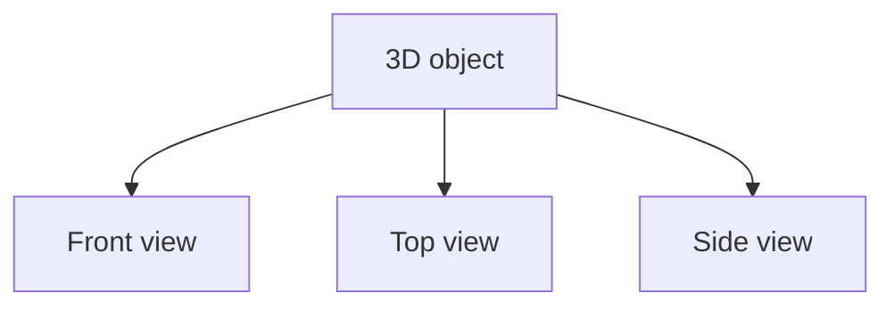
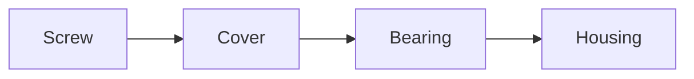
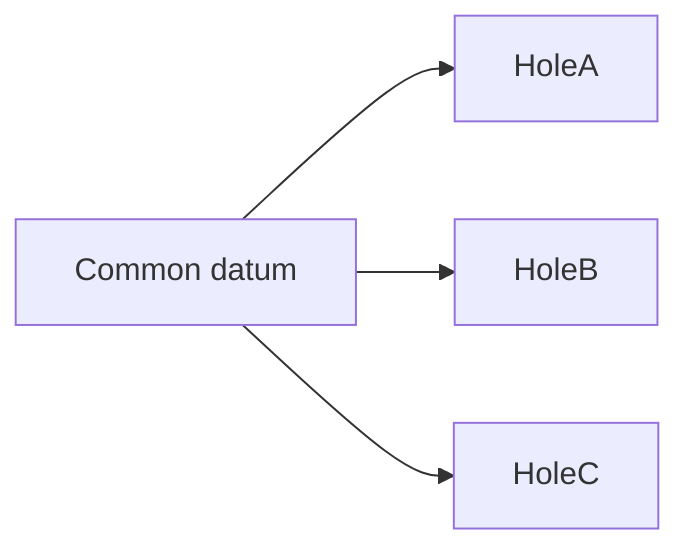
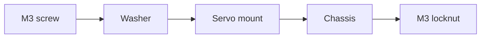

# Topic 1.8 - Engineering Drawings

> **"A good drawing lets another person build the same part without asking what you meant."**

---

# Learning Objectives 🎯

By the end of this topic you will be able to:

- Explain the purpose of an engineering drawing.
- Understand why one picture is often not enough.
- Read front, top and side views.
- Recognise visible edges, hidden edges and centre lines.
- Understand simple section views.
- Place dimensions so they are clear and not repeated.
- Add notes, hole callouts and tolerances.
- Create a beginner engineering drawing for a simple buggy part.

---

# Before We Begin

Imagine describing a toy block over the phone.

You say:

> "It is rectangular, with two holes near one side and a slot underneath."

The other person asks:

- How long is it?
- How wide?
- How deep are the holes?
- Are the holes centred?
- How wide is the slot?
- Which side is "underneath"?
- Are the corners square or rounded?

Words alone become confusing.

A photograph helps, but it may hide important details.

A 3D model helps, but another person may still need exact dimensions.

Engineering drawings solve this problem.

---

# What Is an Engineering Drawing?

An **engineering drawing** is:

> A precise visual instruction that describes the shape, size and important details of a part or assembly.

It is not mainly an artistic picture.

Its purpose is communication.

A good drawing helps someone:

- make the part
- inspect the part
- assemble the part
- understand interfaces (the places where parts connect - remember Topic 1.2)
- compare the result with the design

The best drawings do one more thing: they capture **design intent** - *why* a
feature is the size and shape it is. A hole is not just "5.3 mm"; it is
"5.3 mm so the 5 mm pin can spin freely". We will return to design intent near
the end of this topic, but keep the idea in mind as you read: a drawing
records reasons, not just sizes.

---

# A Drawing Is a Contract

Imagine ordering a custom shelf.

You say:

> "Make it about this long."

The result may not match your expectation.

Now imagine giving a drawing that states:

```text
Length = 600 mm
Width = 200 mm
Thickness = 18 mm
Two mounting holes, Ø6 mm
Hole spacing = 400 mm
```

The drawing becomes an agreement.

It says what the part should be.

In engineering, the drawing often acts like a contract between:

- designer
- maker
- inspector
- assembler
- customer

---

# Sketches and Drawings Are Different

A sketch is useful for ideas.

An engineering drawing is useful for exact communication.

## Sketch

- fast
- rough
- flexible
- may not be to scale
- useful during thinking

## Engineering Drawing

- structured
- dimensioned
- consistent
- clear enough to manufacture
- useful after design decisions are made

Both are important.

Do not wait for a perfect drawing before thinking.

Use sketches first, then formalise the design.

---

# Why One Picture Is Not Enough

> **🤔 Think about it.** Picture a mug seen straight from the side - a
> rectangle with a curved top. Now picture the same mug seen straight from
> directly above. What shape is it now? How can one object be two different
> shapes?

From the side the mug looks rectangular; from above it looks like a circle. Both views are correct - and neither one, on its own, shows the whole shape. That is exactly why one picture is not enough.

The same is true for RC parts.

A bracket may look simple from the front but contain:

- hidden holes
- underside recesses
- stepped surfaces
- angled slots

Engineering drawings use multiple views.

---

# Orthographic Views

**Orthographic projection** is a method of showing an object using flat views from different directions.

The most common views are:

- front
- top
- side



Each view shows two dimensions clearly.

> **📚 Learn more**
>
> - BBC Bitesize (KS3 Design and Technology): search "isometric and
>   orthographic drawing" - worked examples of the views in this topic

---

# Front View

The front view is usually chosen to show the most useful shape.

It may show:

- main profile
- important holes
- overall height
- overall width

There is no universal rule that the "front" must be the physical front of the vehicle.

Choose the view that communicates the part best.

---

# Top View

The top view looks down on the object.

It often shows:

- length
- width
- hole positions
- slot positions
- component layout

For a chassis plate, the top view may be the most important view.

---

# Side View

The side view often shows:

- thickness
- step heights
- hole depths
- angled features
- raised bosses

A flat-looking top view may hide important vertical information.

---

# How Views Line Up

Views are arranged so features align.

A hole in the front view should line up with the same hole in the top or side view.

> **[Sketch: three aligned views of a simple plate with one hole - top view
> directly above the front view, side view directly to its right, with thin
> vertical and horizontal construction lines showing the hole and the plate
> edges lining up exactly between all three views]**

Alignment helps the reader understand that the views describe one object. If a
feature does not line up between views, one of the views is wrong.

---

# First-Angle and Third-Angle Projection

Different countries and industries arrange the views around the front view in
two different orders, called **first-angle** and **third-angle projection**.
You will meet them properly when you use professional CAD - do not worry about
the difference now.

For this handbook the rule is simple:

> Pick one system, write it in the title block, and keep it consistent.

---

# Visible Lines

Visible edges are drawn with solid lines.

These show edges you can see from that view.

```text
------------
```

Use clear, consistent line weight.

---

# Hidden Lines

A feature may exist behind the visible surface.

Hidden edges are often shown with dashed lines.

```text
- - - - - - -
```

Examples:

- hole passing through the part
- internal pocket
- underside recess
- hidden step

Hidden lines help, but too many can make a drawing confusing.

A section view may be clearer.

---

# Centre Lines

A **centre line** marks the centre of a circular or symmetrical feature.

It is usually drawn using a long-short pattern.

```text
- - . - - . - -
```

Centre lines help show:

- hole centres
- shaft centres
- symmetry
- rotation axes

They are useful for dimensioning hole spacing.

Here are the three basic line types in one place:

| Line type | How it looks | What it means |
|---|---|---|
| Visible line | solid | an edge you can see from this view |
| Hidden line | dashed | an edge hidden behind the surface |
| Centre line | long-short-long | the centre of a hole, shaft or line of symmetry |

---

# Symmetry

A part is symmetrical when one side mirrors the other.

If a part is symmetrical, the drawing can show:

- centre line
- half-width dimension
- mirrored features

But do not assume symmetry unless it is stated or obvious.

---

# Section Views

Imagine cutting a cake and looking at the cut surface.

You can see the layers inside.

A **section view** does the same thing for a part.

It imagines the part cut by a plane so internal features become visible.

> **[Sketch: a block shown three ways - the whole outside view, then the same
> block with a cutting plane slicing through it, then the resulting section
> view with the cut faces filled with diagonal hatching so the internal hole
> becomes visible]**

Section views are useful for:

- bearing seats
- countersinks
- stepped holes
- internal channels
- wall thickness
- snap fits
- nut traps (shaped pockets that hold a nut - Topic 1.7)

> **📚 Learn more**
>
> - Onshape Learning Centre (learn.onshape.com): search "drawings" - a
>   beginner walkthrough of turning a 3D model into a dimensioned drawing,
>   including section views

---

# Section Hatching

Cut material is often shown with diagonal lines called **hatching**.

```text
///////
///////
```

Hatching tells the reader which material has been cut.

Different parts in an assembly may use different hatch directions.

---

# A Simple Section Example

Suppose a printed block contains a stepped hole.

From the top, it may look like one circle.

A section view can show:

```text
Top opening: Ø10 mm
Lower hole: Ø5 mm
Depth of large opening: 3 mm
```

Without a section view, the depth may be unclear.

---

# Detail Views

A **detail view** enlarges a small region.

Use it when a feature is too small to dimension clearly in the main view.

Examples:

- snap hook
- fillet
- tiny screw recess
- gear tooth clearance
- retaining lip

A detail view should be labelled.

Example:

```text
DETAIL A
Scale 4:1
```

---

# Exploded Views

An **exploded view** shows assembly parts separated along their assembly direction.



Exploded views help explain:

- assembly order
- fastener location
- part relationships
- replacement process

They are useful for build instructions.

They do not replace detailed part drawings.

---

# Isometric Views

An **isometric view** is a 3D-looking view that shows several faces at once.

It helps readers recognise the part.

But it may hide exact dimensions.

A good drawing often includes:

- orthographic views for precision
- isometric view for understanding

> **☕ Good place to pause.** That is the family of views - front, top, side,
> section, detail, exploded and isometric. Stretch or get a drink. The next
> part is about putting numbers on a drawing: dimensions, callouts and notes.

---

# Dimensions

A dimension tells the size or location of a feature.

A dimension usually contains:

- extension lines
- dimension line
- arrowheads
- number
- unit, if not stated globally

```text
|<------ 50 mm ------>|
```

Dimensions should be easy to read.

---

# Dimension Only What Matters

Do not cover the page with every possible measurement.

Dimension features needed to:

- make the part
- inspect the part
- assemble the part
- understand critical interfaces

Avoid unnecessary dimensions.

More dimensions can create contradictions.

---

# Do Not Dimension the Same Feature Twice

> **🤔 Think about it.** You helpfully write the part's width - 50 mm - on
> both the front view and the top view. Later you change it to 52 mm on the
> front view and forget the top. Which one is right now, and how would the
> person building it ever know?

Suppose overall width is shown in both front and top views. If one value is later changed and the other is not, the drawing conflicts.

A feature should normally have one controlling dimension.

Reference dimensions may be shown differently and clearly marked - usually by putting the number in brackets, like `(50)`, to say "this is for information only, not the controlling dimension".

---

# Overall and Local Dimensions

Use both:

## Overall Dimensions

- full length
- full width
- full height

## Local Dimensions

- hole diameter
- hole spacing
- pocket depth
- wall thickness
- slot width

The reader needs both the big picture and the details.

---

# Dimension From Useful Datums

In Topic 1.7, we learned about datums.

Use a common datum when feature position matters.

Examples:

- vehicle centreline
- bottom chassis surface
- front edge of bulkhead
- motor mounting face

This reduces tolerance stack-up (small errors adding up across an assembly - Topic 1.7).



---

# Avoid Dimensioning to Hidden Lines

Dimensions attached to hidden lines can be difficult to read.

If an internal feature matters, use:

- section view
- another orthographic view
- detail view

Make the feature visible before dimensioning it.

---

# Hole Callouts

A hole callout describes a hole clearly.

Examples:

```text
Ø3.2 THRU
```

means:

- 3.2 mm diameter
- passes completely through

```text
Ø6 × 4 DEEP
```

means:

- 6 mm diameter
- 4 mm deep

```text
4 × Ø3.2 THRU
```

means:

- four holes
- each 3.2 mm diameter
- all through

---

# Countersink

A **countersink** is a cone-shaped recess for a countersunk screw head.

A callout may include:

- hole diameter
- countersink diameter
- countersink angle

Example:

```text
Ø3.2 THRU
CSK Ø6.0 × 90°
```

---

# Counterbore

A **counterbore** is a flat-bottomed cylindrical recess.

It can hide:

- cap screw head
- nut
- washer
- bearing shoulder

A section view is often useful.

Example:

```text
Ø3.2 THRU
C'BORE Ø6.0 × 3 DEEP
```

Countersink and counterbore are easy to mix up:

| Recess | Shape | Made for |
|---|---|---|
| Countersink | cone-shaped | angled (countersunk) screw heads, so the head sits flush |
| Counterbore | flat-bottomed cylinder | socket-head cap screws, nuts, washers or a bearing shoulder |

---

# Threads

Thread callouts should state the thread size and depth where needed.

Example:

```text
M3 × 0.5, 8 DEEP
```

For printed parts, also state the intended method:

- printed thread
- tapped after printing
- self-tapping screw
- heat-set insert (a metal thread pushed into the plastic with a hot iron - Topic 1.7)

The drawing should match the real manufacturing process.

---

# Radii and Fillets

Rounded features may be called out using:

```text
R3
```

This means a radius of 3 mm.

For several identical corners:

```text
4 × R3
```

Fillets are important because they affect strength and printability.

---

# Chamfers

A chamfer callout may look like:

```text
1 × 45°
```

This means a 1 mm chamfer at 45 degrees.

For printed parts, chamfers can help:

- first-layer quality
- assembly
- support reduction
- edge safety

---

# Slots

A slot should be described with:

- width
- length
- end radius, if needed
- position

Example:

```text
Slot 4 mm wide × 20 mm long
```

If the slot ends are semicircular, the radius is often half the width.

---

# Tolerances on Drawings

A drawing can show tolerance in several ways.

## Individual Tolerance

```text
10.00 ± 0.10 mm
```

## Limit Dimensions

```text
10.10
 9.90
```

## General Tolerance Note

Example:

```text
Unless otherwise stated:
Linear dimensions ±0.2 mm
Angles ±1°
```

Critical features may still need individual tighter tolerances.

---

# Fit Callouts

A drawing may describe fit intent.

Examples:

```text
Bearing seat for 11 mm OD bearing
Snug hand fit
```

or:

```text
Ø5.3 hole for Ø5.0 pin
Running clearance
```

For hobby printed parts, practical notes can be more useful than formal industrial fit codes.

---

# Surface Finish

Surface finish describes how smooth or rough a surface should be.

For printed parts, useful notes may include:

- remove support material
- deburr hole
- ream to final size
- sand sliding face
- do not sand locating boss
- bearing seat must be clean

The drawing should describe any required post-processing.

---

# Material Note

A drawing should identify the intended material.

Examples:

```text
Material: PETG
Material: Nylon
Material: Aluminium 6061
```

Material affects:

- strength
- stiffness
- heat resistance
- fit
- print settings

A drawing without material may be incomplete.

> **☕ Good place to pause.** You now know the views, the dimensions, the
> callouts and the notes that make up a drawing. Stretch - the rest is about
> tying a drawing to a real part (revision, title block, design intent) and
> then drawing one yourself.

---

# Manufacturing Note

For printed parts, useful notes include:

```text
Print orientation: flat face down
Layer height: 0.20 mm
Minimum wall count: 4
Supports: none
Post-process: ream hinge hole to Ø3.0 mm
```

Be careful not to place every slicer setting on the part drawing.

Detailed process instructions may belong in a separate manufacturing note.

---

# Revision

Designs change.

A drawing should record revision information.

Example:

```text
Revision A - First prototype
Revision B - Increased fillet at arm root
Revision C - Enlarged bearing seat
```

Revision control helps match:

- CAD file
- STL
- drawing
- printed part
- test notes

---

# Title Block

A title block is an information box on the drawing.

It may include:

- part name
- part number
- revision
- material
- scale
- units
- projection method
- designer
- date
- drawing number

Example:

```text
Part: Front Servo Mount
Part No: RCB-STM-001
Revision: A
Material: PETG
Units: mm
Scale: 1:1
```

---

# Part Numbers

A part number gives each part a unique identity.

Example system:

```text
RCB-CHA-001  Chassis plate
RCB-STM-001  Servo mount
RCB-BAT-001  Battery tray
RCB-SUS-001  Front suspension arm
```

A consistent system helps files and drawings stay organised.

---

# Scale

Drawing scale compares the drawing size with the real part.

Examples:

```text
1:1 = full size
2:1 = drawing twice real size
1:2 = drawing half real size
```

Never measure a printed paper drawing unless you know:

- the scale
- printing was not resized
- the drawing is intended to be measured

Dimensions control the part, not the paper size.

---

# Units

State units clearly.

Example:

```text
ALL DIMENSIONS IN MILLIMETRES
```

This avoids writing "mm" beside every dimension.

Do not mix inches and millimetres without very clear labelling.

---

# Notes

General notes may include:

```text
1. Remove all sharp edges.
2. Do not scale drawing.
3. All dimensions in mm.
4. Bearing seat to be test fitted before final assembly.
5. Print orientation shown in manufacturing note.
```

Notes should be short and useful.

Avoid vague statements such as:

```text
Make strong.
```

---

# Drawings for 3D Printed Parts

A 3D printed part drawing should communicate:

- functional geometry
- critical dimensions
- interfaces
- material
- print orientation when important
- post-processing
- fit intent
- revision

The STL (the 3D model file a printer reads - Part 2) alone is not enough for long-term project documentation.

A drawing explains the design intent.

---

# Design Intent

**Design intent** means:

> The reason a feature has a particular shape, size or relationship.

Examples:

- hole is oversized for free screw clearance
- rib follows the landing-force path
- slot allows motor adjustment
- chamfer guides bearing insertion
- thin tab is intended to flex
- pocket captures an M3 nut

If someone changes the CAD later, design intent helps them avoid breaking the function.

---

# A Drawing Should Answer Questions

For a servo mount, the drawing should answer:

- Which servo size fits?
- Where are the mounting holes?
- What screw size is used?
- How much body clearance exists?
- Where does the wire exit?
- Does the horn have movement space?
- Which surface sits on the chassis?
- What material is intended?
- Which revision is this?

If the drawing leaves these unclear, it needs improvement.

---

# Assembly Drawings

An assembly drawing shows how several parts connect.

It may include:

- exploded view
- item numbers
- bill of materials
- fastener notes
- assembly order
- torque or threadlock notes

Example:



---

# Bill of Materials

A **bill of materials**, or **BOM**, lists the parts in an assembly.

Example:

| Item | Part | Quantity | Notes |
|---|---|---:|---|
| 1 | Servo mount | 1 | Printed PETG |
| 2 | M3 × 12 screw | 4 | Socket head |
| 3 | M3 washer | 4 | Steel |
| 4 | M3 locknut | 4 | Nylon insert |
| 5 | Steering servo | 1 | Standard size |

The drawing item numbers should match the BOM.

---

# Interface Control Drawing

Sometimes the most important information is how one component connects to another.

An **interface control drawing** may focus on:

- mounting holes
- external envelope
- connector location
- moving clearance
- shaft position

This is useful when the internal shape is less important than the connection.

For example, a motor interface drawing may show:

- body diameter
- shaft location
- screw pattern
- mounting face
- wire exit

---

# Drawing a Simple Bracket

Imagine a bracket with:

- rectangular base
- two screw holes
- one raised wall
- one rounded corner

A clear drawing may include:

## Top View

- overall length
- overall width
- hole spacing
- hole diameters

## Front View

- wall height
- base thickness
- fillet radius

## Side View

- wall thickness
- hole depth, if not through

## Isometric View

- quick visual recognition

> **☕ Good place to pause.** That is the whole language of drawings. Stretch,
> grab paper, a pencil and a ruler - the rest of this topic is hands-on, and
> it ends with a challenge where someone rebuilds a part from your drawing
> alone.

---

# Hands-On Activity 1 - Three Views of a Box

Choose a simple object:

- eraser
- small box
- battery
- toy block

Draw:

- front view
- top view
- side view

Keep the views aligned.

Add:

- overall length
- overall width
- overall height

The goal is clarity, not artistic perfection.

---

# Hands-On Activity 2 - Hidden Feature

Use a small box with a hole, recess or lid.

Draw one view where the feature is hidden.

Represent it with dashed lines.

Then create a section view that shows the same feature clearly.

Compare which is easier to understand.

---

# Hands-On Activity 3 - Dimension a Washer

Draw a washer using:

- top view
- section view

Add:

- outside diameter
- inside diameter
- thickness
- centre lines

Example data:

```text
OD = 12 mm
ID = 5 mm
Thickness = 1 mm
```

---

# Hands-On Activity 4 - Create a Title Block

Make a reusable title block template containing:

- project
- part name
- part number
- revision
- material
- units
- scale
- date
- designer

Save it for future drawings.

---

# Topic Mini Project - The Blueprint Challenge 🛠️

This topic's big idea is that a good drawing lets another person build your part without asking what you meant. The only way to know whether your drawing is that good is to test it - so build something, draw it, and have someone rebuild it from the drawing alone.

You will need:

- a small object you build yourself (5-10 pieces of a construction toy like
  LEGO, or a simple folded-and-taped card shape)
- paper, a pencil and a ruler
- a partner (a friend, sibling or adult)
- your engineering notebook

> **⚠️ SAFETY**
>
> Show a responsible adult what you plan to build before you start, and
> build with them nearby. If you cut or fold card, scissors are sharp - cut
> away from your fingers and ask an adult for help with any tricky cuts.

> **🎬 Watch the build**
>
> - TeachEngineering (teachengineering.org): search "seeing all sides
>   orthographic drawing" - the classroom version of this build-and-draw
>   exchange
> - BBC Bitesize (KS3 Design and Technology): search "isometric and
>   orthographic drawing" - a refresher on the views before you draw

Build steps:

1. Build your small object and keep it hidden from your partner.
2. Draw it as an engineering drawing: front, top and side views, kept aligned, plus an isometric view for recognition.
3. Add every dimension needed to rebuild it - overall sizes, and where each block or fold sits. Add a title block with the part name and units.
4. Hand your partner **only the drawing** - not the object. Ask them to build a copy from the drawing alone, without asking you any questions.

The reflection is where the learning lands. In your notebook:

- Put the two objects side by side. Where do they differ? Every difference is a place your drawing was unclear.
- Which was harder to get right: the shape, or where things were positioned? Positioning is usually where drawings fail - which is exactly why datums matter (Topic 1.7).
- Fix the drawing so that a stranger could get it perfect, and note what you changed.

Keep your drawing and both objects for the showcase shelf. A drawing that let someone rebuild your part, with no questions asked, is a real engineering achievement.

---

# Engineering Challenge - Draw a Servo Mount

Create a simple engineering drawing for a servo mount.

Include:

## Views

- top
- front
- side
- isometric

## Dimensions

- overall length
- overall width
- base thickness
- servo pocket size
- mounting-hole spacing
- screw-hole diameter
- wall height

## Notes

- material
- units
- print orientation
- intended servo
- clearance intent
- post-processing

## Title Block

- part name
- part number
- revision
- date

It is acceptable to draw by hand for the first version.

The goal is to communicate the design clearly.

---

# Thinking Like an Engineer

Suppose someone prints your bracket and the screw holes are in the wrong place.

Before blaming them, ask:

- Were the hole positions dimensioned?
- Was the datum clear?
- Was the drawing view ambiguous?
- Was centre-to-centre spacing shown?
- Were units stated?
- Did two dimensions conflict?
- Was the correct revision used?
- Was the drawing scaled instead of reading dimensions?

A drawing problem can become a manufacturing problem.

Good communication is part of engineering.

---

# Common Beginner Mistakes ❌

## Mistake 1 - Using Only an Isometric View

A 3D-looking view is helpful, but it may hide exact geometry.

Add orthographic views.

---

## Mistake 2 - Dimensioning Every Line

Too many dimensions create clutter and contradictions.

Dimension what is needed.

---

## Mistake 3 - Repeating Dimensions

One feature should have one controlling dimension.

---

## Mistake 4 - Dimensioning From Random Edges

Use functional datums.

---

## Mistake 5 - Hiding Important Features

Use a section or detail view.

---

## Mistake 6 - Forgetting Units

State units clearly in the title block or notes.

---

## Mistake 7 - Forgetting Material

Material affects how the part behaves.

---

## Mistake 8 - Leaving Out Revision

Old drawings can produce old parts.

---

## Mistake 9 - Trusting Scale Instead of Dimensions

Do not measure a screen or resized printout.

Read the dimension values.

---

## Mistake 10 - Drawing Shape Without Intent

Explain critical fits, interfaces and post-processing.

---

# Optional Challenge - Reverse-Engineer a Simple Part

Choose a simple real part:

- spacer
- washer
- battery clip
- small bracket
- cable guide

Measure it.

Create:

- orthographic views
- section view if needed
- dimensions
- title block
- material note
- revision A

Then ask another person to describe the part using only your drawing.

If they are confused, improve the drawing.

---

# Optional Challenge - Assembly Drawing

Create a simple assembly drawing for:

- bracket
- two screws
- washers
- nuts
- base plate

Add:

- exploded view
- item numbers
- BOM
- assembly note

Example note:

```text
Tighten until bracket is secure.
Do not crush printed part.
```

---

# Topic Summary 📝

In this topic, we learned that engineering drawings are precise communication tools.

A good drawing may include:

- front, top and side views
- visible lines
- hidden lines
- centre lines
- section views
- detail views
- isometric views
- dimensions
- tolerances
- hole callouts
- notes
- material
- revision
- title block

We also learned:

- one picture is often not enough
- dimensions should be clear and not repeated
- useful datums reduce confusion and stack-up
- section views reveal internal geometry
- assembly drawings and BOMs explain how parts connect
- drawings preserve design intent
- a good drawing helps another person build and inspect the part without guessing

---

# New Words 📖

| Word | Meaning |
|---|---|
| Engineering drawing | A precise visual instruction describing a part or assembly. |
| Orthographic projection | Showing an object using flat views from different directions. |
| Front view | A view chosen to show the main shape or most useful features. |
| Top view | A view looking down on the object. |
| Side view | A view looking from one side. |
| Visible line | Solid line showing an edge that can be seen. |
| Hidden line | Dashed line showing an edge behind a visible surface. |
| Centre line | Line marking the centre of a circular or symmetrical feature. |
| Section view | A view showing the inside of a part using an imaginary cut. |
| Hatching | Diagonal lines showing cut material in a section. |
| Detail view | Enlarged view of a small feature. |
| Exploded view | Assembly view with parts separated along assembly direction. |
| Isometric view | 3D-looking view showing several faces. |
| Dimension | Numerical description of size or location. |
| Hole callout | Text describing hole diameter, depth and type. |
| Countersink | Cone-shaped recess for a countersunk screw head. |
| Counterbore | Flat-bottomed cylindrical recess. |
| Title block | Information box identifying the drawing. |
| Revision | Recorded version of a design or drawing. |
| Part number | Unique identifier for a part. |
| Scale | Relationship between drawing size and real size. |
| Bill of materials | List of parts and quantities in an assembly. |
| Design intent | The reason a feature has a particular form or relationship. |
| Interface control drawing | Drawing focused on how one component connects to another. |

---

# Review Questions ❓

1. What is the main purpose of an engineering drawing?
2. How is a sketch different from an engineering drawing?
3. Why is one picture often not enough?
4. What are the three common orthographic views?
5. What is the purpose of a front view?
6. What do hidden lines show?
7. What do centre lines show?
8. What is a section view?
9. Why is hatching used?
10. When should a detail view be used?
11. What is the purpose of an isometric view?
12. Why should the same feature not be dimensioned twice?
13. Why should dimensions use functional datums?
14. What does Ø mean?
15. What does "THRU" mean in a hole callout?
16. What is a countersink?
17. What is a counterbore?
18. How are radii and chamfers called out?
19. Why should tolerances be included?
20. What information belongs in a title block?
21. Why is revision control important?
22. Why should drawings not be scaled from a screen image?
23. What is a BOM?
24. What is design intent?
25. Why can a drawing error become a manufacturing error?
26. What extra information is useful for a 3D printed part?
27. Why is a section view often better than many hidden lines?
28. What is an interface control drawing?
29. Why should material be stated?
30. What should a servo-mount drawing communicate?

---

# Topic Checklist ✅

- [ ] I understand the purpose of an engineering drawing.
- [ ] I know the difference between a sketch and a formal drawing.
- [ ] I can draw front, top and side views.
- [ ] I can align orthographic views.
- [ ] I recognise visible, hidden and centre lines.
- [ ] I understand simple section views.
- [ ] I can add overall and local dimensions.
- [ ] I know why dimensions should not be repeated.
- [ ] I can use a datum for feature location.
- [ ] I understand basic hole callouts.
- [ ] I recognise countersinks, counterbores, radii and chamfers.
- [ ] I know how tolerances appear on drawings.
- [ ] I created a title block template.
- [ ] I understand revision and part numbering.
- [ ] I know the purpose of an assembly drawing and BOM.
- [ ] I completed at least one hands-on activity.
- [ ] I created a simple drawing for an RC part.
- [ ] I added the drawing and notes to my engineering notebook.

---

# Looking Ahead 🔭

We can now communicate what a part should look like and how large it should be.

The next question is:

> How do engineers move from a problem to a tested design?

In the next topic, **Topic 1.9 - The Engineering Design Process**, we will study how engineers turn a problem into a tested design.

We will learn:

- how to define a problem
- how to write requirements
- how to generate several ideas
- how to compare ideas fairly
- how to build prototypes
- how to test one question at a time
- how to improve a design using evidence
