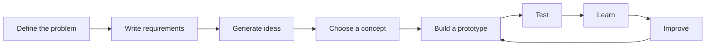
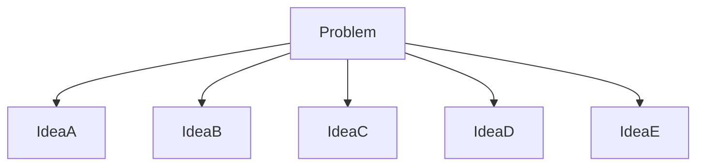
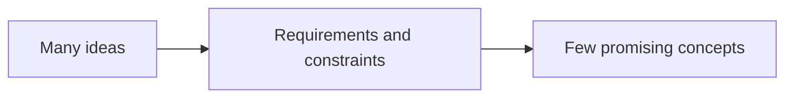
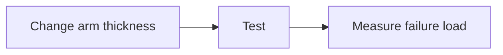
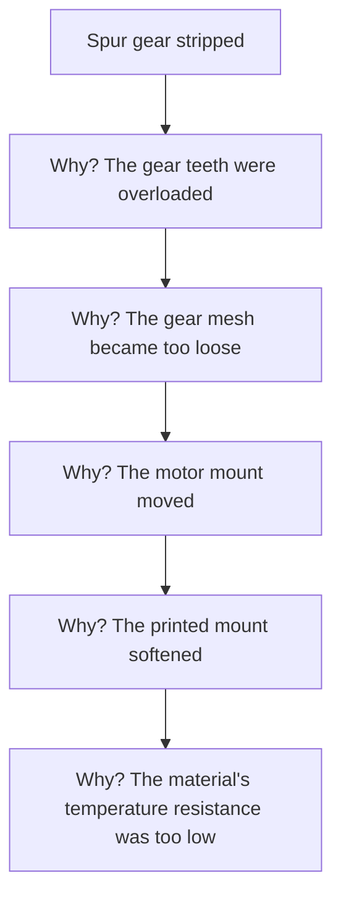

# Topic 1.9 - The Engineering Design Process

> **"A good engineer does not begin with an answer.  
> A good engineer begins with a clear question."**

---

# Learning Objectives 🎯

By the end of this topic you will be able to:

- Explain the main stages of the engineering design process.
- Define a problem clearly.
- Separate requirements from constraints.
- Generate several possible solutions.
- Compare ideas using evidence instead of preference.
- Build prototypes that answer one question at a time.
- Create simple test plans.
- Improve a design using observations and measurements.
- Record versions so you know what changed.

---

# Before We Begin

Imagine your school asks you to design a bridge made from paper.

A poor approach is:

1. Fold something quickly.
2. Put weight on it.
3. Watch it collapse.
4. Add more tape.
5. Repeat randomly.

A better approach is:

1. Decide what the bridge must do.
2. Identify the limits.
3. Sketch several ideas.
4. Choose one to test.
5. Build a small prototype.
6. Measure what happens.
7. Improve one weakness.
8. Test again.

Both approaches involve building.

Only one is engineering.

---

# Engineering Is a Cycle

The engineering process is not a straight road.

It is a loop.



You may move backward at any time.

A test may reveal that:

- the requirement was unclear
- the chosen idea was poor
- the measurement method was weak
- the real problem was different

Going backward is not failure. It is part of the process.

> **📚 Learn more**
>
> - BBC Bitesize (KS3 Design and Technology): search "iterative design" -
>   the design, make and evaluate loop, the same cycle shown above

---

# Step 1 - Define the Problem

Suppose someone says:

> "Build a better battery tray."

What does "better" mean?

Possible meanings:

- lighter
- stronger
- easier to print
- easier to remove
- safer in a crash
- compatible with more batteries
- cheaper
- less likely to trap dirt

The word "better" is not enough.

A clear problem statement might be:

> The current battery tray is difficult to load because the connector catches on the side wall. Design a tray that allows one-handed battery removal while keeping the battery secure during normal driving.

Now the problem is concrete.

---

# Problem Statement

A **problem statement** is a short description of:

- what is wrong
- who experiences the problem
- when it happens
- why it matters

A useful pattern is:

```text
[User] needs a way to [task]
because [current problem or reason].
```

Example:

```text
A beginner builder needs a way to install and remove the battery
without tools because the battery must be charged away from the buggy.
```

---

# Problem vs Solution

> **🤔 Think about it.** A friend says "we need a sliding tray with two
> clips." It sounds helpful - but what have they quietly decided already,
> before anyone has checked whether a tray is even the best answer?

Compare:

> We need a better battery holder.

with:

> We need a sliding tray with two clips.

The second sentence already assumes the answer.

That can block better ideas.

A problem describes the need.

A solution describes one possible response.

Keep them separate at the beginning.

---

# Step 2 - Understand the User

A design can be technically clever and still be unpleasant to use.

Ask:

- Who will use it?
- What experience do they have?
- How strong are their hands?
- What tools do they own?
- Will they wear gloves?
- Will the buggy be dirty?
- Will the part be repaired outdoors?
- How often will it be removed?

For this handbook, the user may be:

- a new RC builder
- about 11 years old or older
- comfortable with technology
- inexperienced with 3D printing
- using ordinary hobby tools

That affects the design.

---

# User Needs

A **user need** describes what the user must be able to do.

Examples:

- remove the battery without taking apart the chassis
- identify which screw belongs where
- replace a broken arm with simple tools
- understand the assembly instructions
- avoid touching hot components

User needs may become requirements.

---

# Step 3 - Write Requirements

A requirement describes what the design must do.

Good requirements are:

- clear
- measurable
- testable
- connected to the real need

Weak requirement:

```text
The tray should be easy to use.
```

Stronger requirement:

```text
One person shall remove the battery in less than 60 seconds
using no tools.
```

---

# Requirement Language

Formal engineers use three careful words: **shall** (required), **should** (preferred) and **may** (optional). For a beginner project, plain language is completely fine - the important thing is that each requirement is clear and testable.

---

# Functional Requirements

A **functional requirement** says what the design must do.

Examples:

- hold the servo
- allow steering movement
- keep the battery secure
- transmit torque
- protect the receiver
- allow the suspension arm to rotate

---

# Performance Requirements

A **performance requirement** says how well the design must do the job.

Examples:

- survive a 0.5 metre drop
- support a 1 kilogram load
- allow 25 degrees of steering
- remain below 80 °C
- remove in less than one minute
- fit a battery up to 48 mm wide

---

# Interface Requirements

An **interface requirement** describes how a part must connect.

Examples:

- use four M3 screws
- fit a standard-size servo
- accept an 11 mm bearing
- align with chassis holes 30 mm apart
- provide clearance for a 5 mm shaft

Interfaces should be defined early.

---

# Safety Requirements

Safety requirements protect people, equipment and the environment.

Examples:

- battery shall not contact sharp edges
- rotating gears shall have a cover
- hot motor shall not touch wiring
- steering linkage shall not pinch fingers during normal handling
- part shall not expose sharp printed support remnants

Safety is not an optional extra.

---

# Step 4 - Identify Constraints

A constraint limits the solution.

Examples:

- printer bed size
- available material
- budget
- build time
- chosen motor
- chosen battery
- available screws
- maximum vehicle width
- no machine tools
- beginner assembly skill

A constraint does not describe what the design should achieve.

It describes the box inside which you must work.

---

# Hard and Soft Constraints

## Hard Constraint

Must not be broken.

Examples:

- part must fit on printer bed
- battery voltage must match electronics
- wheel must clear chassis
- material must be safe for the temperature

## Soft Constraint

Preferred, but negotiable.

Examples:

- print under three hours
- use less than 100 g material
- avoid supports
- match body style

Knowing which constraints are hard prevents wasted effort.

---

# Step 5 - Research What Already Exists

Before designing, look at:

- donor RC platforms
- existing battery trays
- servo mounts
- suspension arms
- manufacturer drawings
- repair guides
- known failure modes

Research helps you avoid repeating old mistakes.

But research does not mean copying blindly.

Ask:

- Why was it designed this way?
- What problem does this feature solve?
- Does the same reason apply to our buggy?
- What could be simplified?

---

# Benchmarking

**Benchmarking** means comparing existing solutions.

Possible comparison table:

| Design | Easy to print | Easy to repair | Strong | Light | Uses standard hardware |
|---|---|---|---|---|---|
| Design A | Yes | Yes | Medium | Medium | Yes |
| Design B | No | Medium | High | Low | No |
| Design C | Yes | High | Medium | High | Yes |

Benchmarking turns vague impressions into structured observations.

---

# Step 6 - Break the Problem Into Smaller Problems

Suppose we are designing a servo mount.

Smaller questions include:

- How does it attach to the chassis?
- How does the servo attach to it?
- Where does the wire exit?
- How much clearance does the horn need?
- How will the servo be removed?
- Which loads act on the mount?
- Which print orientation is best?
- Which screws are available?

This is decomposition.

**Decomposition** means breaking a large problem into smaller, manageable questions.

---

# Step 7 - Generate Several Ideas

The first idea is rarely the only possible idea.

For a battery holder, possible concepts include:

- strap
- hinged lid
- sliding tray
- snap clip
- side rail
- top plate
- hook-and-loop fastener
- removable cassette

Generate several ideas before choosing.

This is called **concept generation**.

---

# Divergent Thinking

First, open up and think wide: make as many different ideas as you can, without judging them yet. Grown-ups call this **divergent thinking**. At this stage:

- do not judge too quickly
- do not worry about perfect details
- combine ideas
- sketch quickly
- include strange ideas

The goal is variety.



---

# Convergent Thinking

Then do the opposite: narrow that big pile down to the few most promising ideas. Grown-ups call this **convergent thinking**. Now ask:

- Which ideas meet the requirements?
- Which violate hard constraints?
- Which are easy to prototype?
- Which have fewer risky assumptions?
- Which are easiest to repair?



Both thinking styles are needed.

---

# Sketch Before CAD

A hand sketch can be made in one minute.

A CAD model may take much longer.

Early sketches should show:

- main shape
- interfaces
- movement
- fasteners
- possible load paths

Do not add perfect detail.

The sketch is for thinking.

---

# Concept Cards

For each idea, create a small concept card.

Example:

```text
Concept: Sliding Battery Tray

How it works:
Battery sits in a removable tray that slides into chassis rails.

Advantages:
- Easy removal
- Battery protected
- Good cable organisation

Risks:
- Dirt may jam rails
- Adds parts
- Needs accurate fit

Questions:
- How is it locked?
- Can it be removed with body installed?
```

> **[Sketch: a filled-in concept card for the sliding battery tray - a quick
> thumbnail drawing of the tray sliding into its rails at the top, with the
> "how it works", "advantages", "risks" and "questions" notes written
> underneath]**

A good concept card always includes a quick thumbnail sketch, not just words. Concept cards make comparison easier.

---

# Step 8 - Compare Ideas Fairly

Do not choose only because:

- it looks cool
- it was your first idea
- it uses the most complex mechanism
- someone online used it

Use criteria connected to the requirements.

Possible criteria:

- safety
- fit
- strength
- weight
- print time
- ease of assembly
- repairability
- cost
- risk

---

# Decision Matrix

A **decision matrix** compares concepts against criteria.

Example:

Score each idea from 1 to 5.

| Criterion | Strap | Sliding tray | Hinged lid |
|---|---:|---:|---:|
| Easy to print | 5 | 3 | 3 |
| Easy to remove battery | 3 | 5 | 4 |
| Dirt resistance | 5 | 2 | 4 |
| Low part count | 5 | 2 | 3 |
| Secure hold | 4 | 5 | 5 |
| Total | 22 | 17 | 19 |

The highest total is not automatically the winner.

The matrix helps expose trade-offs.

---

# Weighted Decision Matrix

Some criteria matter more than others. If keeping the battery secure matters more than how easy the part is to print, give it a larger **weight**. You multiply each score by its weight, then add up the weighted scores.

Here is the battery-holder comparison again, now weighted. The weight is in brackets, and each cell shows score → score × weight:

| Criterion (weight) | Strap | Sliding tray | Hinged lid |
|---|---:|---:|---:|
| Secure hold (×5) | 4 → 20 | 5 → 25 | 5 → 25 |
| Easy to remove (×4) | 3 → 12 | 5 → 20 | 4 → 16 |
| Dirt resistance (×2) | 5 → 10 | 2 → 4 | 4 → 8 |
| Easy to print (×1) | 5 → 5 | 3 → 3 | 3 → 3 |
| Weighted total | 47 | 52 | 52 |

Notice the winner changed. In the unweighted matrix the strap won with 22. Once "secure hold" and "easy removal" are weighted as the things that matter most, the sliding tray and hinged lid pull ahead. Weighting makes your real priorities visible.

---

# Be Careful With Scores

A decision matrix is not magic.

Scores may still contain opinion.

Improve it by:

- defining what each score means
- using test data where possible
- involving more than one reviewer
- recording assumptions

The matrix supports judgement.

It does not replace judgement.

---

# Step 9 - Identify Risks

A **risk** is something uncertain that could cause trouble.

Examples:

- printed latch may break
- bearing fit may be too tight
- motor mount may soften with heat
- battery may not clear the body
- dirt may jam a slider
- chosen screws may be unavailable

A simple risk table:

| Risk | Likelihood | Impact | Response |
|---|---|---|---|
| Slider jams with dirt | Medium | Medium | Increase clearance and add drain slots |
| Snap tab breaks | Medium | High | Print test coupon |
| Battery too tall | Low | High | Measure actual battery |

---

# Risk Reduction

You can reduce risk by:

- measuring
- researching
- testing
- simplifying
- using standard parts
- building small prototypes
- adding safety margins
- choosing reversible decisions

Do not try to remove all risk.

Make the important risks visible and manageable.

---

# Assumptions

An **assumption** is something believed to be true without full proof.

Examples:

- motor will stay below 70 °C
- battery will not exceed 48 mm width
- PETG will be stiff enough
- user owns M3 hardware
- servo horn will clear the chassis

(How hot a motor gets, and how stiff a plastic like PETG stays, are material questions - materials are covered in Part 2.)

Write assumptions down, then test the important ones. Hidden assumptions cause surprises.

> **☕ Good place to pause.** That is the front half of the design process:
> problem, users, requirements, constraints, ideas, comparison, risks and
> assumptions - all before building. Stretch. The next half is where you
> build, test and improve.

---

# Step 10 - Build a Prototype

A **prototype** is a learning tool.

Its job is to answer a question.

It does not need to be:

- beautiful
- durable
- final material
- full size
- fully functional

Different questions need different prototype types.

---

# Types of Prototype

You rarely need the final material to learn something - often paper or cardboard answers the question faster and cheaper. Here are the common prototype types:

| Prototype type | Good for | Example |
|---|---|---|
| Paper prototype | layout, packaging, size, access | a paper battery footprint placed on a card chassis |
| Cardboard mock-up | component arrangement, clearance, wheelbase | a cardboard chassis to check where the servo sits |
| Appearance prototype | shape, proportions, body style | a shaped block showing the look, with no working parts |
| Fit prototype | bearing seat, screw hole, snap fit, hinge pin | a small test coupon (a printed sample that tests one fit - Topic 1.7) |
| Functional prototype | steering, suspension travel, latch, crash behaviour | a working steering linkage made from temporary parts |

Cardboard and paper are often better first steps than jumping straight to CAD.

---

# Proof of Concept

A **proof of concept** checks whether an idea can work at all.

Example:

> Can a printed flexible (living) hinge - a thin strip of plastic that bends
> instead of turning on a pin - survive 100 openings?

The proof of concept may look nothing like the final part. Its only job is to test the principle.

---

# Prototype One Question at a Time

Bad prototype question:

> Is the whole buggy good?

Better questions:

- Does the bearing fit?
- Does the servo horn clear?
- Can the battery be removed?
- Does the arm survive a 0.5 m drop?
- Does the motor mount keep gear mesh?

Specific questions produce useful answers.

---

# Step 11 - Write a Test Plan

A **test plan** describes:

- what you are testing
- why
- equipment
- procedure
- measurements
- pass condition
- safety precautions

Example:

```text
Test: Battery retention

Purpose:
Check whether battery remains secure during normal movement.

Procedure:
1. Install battery.
2. Close retention system.
3. Shake chassis gently in six directions.
4. Measure battery movement.
5. Inspect latch.

Pass condition:
Battery moves less than 2 mm and does not release.
```

---

# Fair Tests

A fair test changes one main variable while keeping others as constant as possible.

Suppose you test two suspension arms.

Keep the same:

- material
- print settings
- orientation
- test weight
- drop height
- fixture

Change only the geometry.

Otherwise, you may not know what caused the difference.

> **📚 Learn more**
>
> - BBC Bitesize (KS3 Science): search "variables" - independent, dependent
>   and control variables, the fair-test idea used all through school science

---

# Control Variable

A **control variable** is something kept the same during a test.

Examples:

- material
- temperature
- battery voltage
- tyre type
- print orientation
- test surface

Control variables make comparisons meaningful.

---

# Independent and Dependent Variables

## Independent Variable

The thing you deliberately change.

Example:

```text
Suspension arm thickness
```

## Dependent Variable

The result you measure.

Example:

```text
Maximum load before failure
```



All three fit into one buggy sentence: *we change the suspension arm thickness (independent variable) and measure the failure load (dependent variable), while keeping the material, drop height and test rig the same (control variables)* - otherwise we would not know what actually caused the difference.

---

# Pass and Fail Criteria

Before testing, decide what success means.

Weak criterion:

```text
It feels strong.
```

Better criterion:

```text
Part shall support 5 kg for 60 seconds without permanent deformation.
```

A test without a pass condition often produces arguments instead of answers.

---

# Qualitative and Quantitative Data

## Qualitative Data

Descriptive observations.

Examples:

- noisy
- smooth
- difficult to insert
- cracked near hole
- wobble visible

## Quantitative Data

Numerical measurements.

Examples:

- 0.4 mm movement
- 62 °C temperature
- 45 second removal time
- 3.2 kg failure load

Use both.

Numbers show amount. Descriptions show behaviour.

> **📚 Learn more**
>
> - BBC Bitesize (KS3 Science): search "collecting and recording data" -
>   results tables, and the difference between numbers and descriptions

---

# Test Repetition

One successful test may be luck.

Repeat important tests.

Examples:

- print three samples
- perform ten latch cycles
- repeat steering movement 100 times
- run several battery packs

Repeated testing reveals variation and fatigue.

---

# Destructive and Non-Destructive Tests

## Non-Destructive Test

Part remains usable.

Examples:

- measure fit
- check alignment
- observe flex
- test movement

## Destructive Test

Part is intentionally pushed to failure.

Examples:

- bend until break
- pull until crack
- overload a bracket
- crash-test a bumper sample

Destructive tests teach limits.

Use safe procedures and adult supervision.

---

# Step 12 - Record Results

A good test record includes:

- date
- part number
- revision
- material
- print settings
- test setup
- measurements
- photographs
- pass or fail
- unexpected observations
- next action

Without records, repeated tests lose value.

---

# Test Table Example

| Test ID | Part revision | Variable | Result | Pass? | Notes |
|---|---|---|---|---|---|
| BAT-01 | A | 0.4 mm side clearance | Jammed | No | Connector catches |
| BAT-02 | B | 0.8 mm side clearance | Smooth | Yes | Slight rattle |
| BAT-03 | C | 0.6 mm side clearance | Smooth | Yes | Best compromise |

This table tells a design story.

---

# Step 13 - Learn From Failure

A failed test answers a question.

Example:

> The snap tab broke after 12 cycles.

Useful follow-up questions:

- Where did it break?
- Was the root too sharp?
- Was it too short?
- Was print direction poor?
- Was material too brittle?
- Did the test exceed normal use?
- Did failure happen gradually?

Failure becomes valuable when recorded and interpreted.

---

# Root Cause

The **root cause** is the underlying reason a problem happened.

Symptom:

```text
Bearing became loose.
```

Possible root causes:

- housing creep (the plastic slowly giving way under a steady load - materials are covered in Part 2)
- excessive heat
- seat oversized
- wall too thin
- repeated impact
- incorrect material

Do not stop at the first visible symptom.

---

# Five Whys

The **Five Whys** method repeatedly asks "why?"

Example:



The final answer may reveal a more useful redesign target.

You do not always need exactly five questions.

Ask until the cause is actionable.

---

# Step 14 - Improve One Thing at a Time

> **🤔 Think about it.** Your mount keeps failing, so you change five things
> at once - material, wall thickness, print orientation, fillet and screw
> type. The new version survives. Which change actually fixed it?

You cannot tell. Any one of the five might have solved it - or two of them together, while a third quietly made things worse and got masked. Change one major variable at a time when you can, so the result points at a single cause. This is **controlled iteration**.

---

# Iteration

An **iteration** is one pass through the design-build-test-improve cycle.

Example:

```text
Revision A -> test -> learn
Revision B -> test -> learn
Revision C -> test -> learn
```

Each iteration should answer a question.

---

# Version Numbers

Use clear version labels.

Example:

```text
V0.1 - cardboard layout
V0.2 - first printed fit test
V0.3 - increased wire clearance
V0.4 - added retention tab
V1.0 - first complete usable version
```

Version labels help match files and physical parts.

---

# Revision Notes

Each version should record:

- what changed
- why it changed
- expected effect
- actual result

Example:

```text
Revision B:
Increased root fillet from 2 mm to 5 mm
because Revision A cracked at the sharp corner.

Result:
Survived 20 drop tests without visible cracking.
```

---

# Reversible and Irreversible Decisions

A **reversible decision** is easy to change later. An **irreversible decision** is expensive or difficult to undo.

| Reversible (easy to change) | Irreversible (hard to undo) |
|---|---|
| electronics tray position | buying incompatible electronics |
| screw length | choosing a printer too small |
| body colour | machining a custom gearbox |
| removable spacer | gluing a battery permanently |

Make reversible decisions early. Delay irreversible decisions until the evidence is stronger.

---

# Minimum Viable Prototype

A **minimum viable prototype** is the simplest version that can answer the current question.

For steering:

- cardboard chassis
- servo
- two pivots
- simple links

You may not need:

- body
- motor
- suspension
- battery tray

Build only what is needed to learn.

---

# Design Freeze

At some point, you may temporarily stop changing the design so you can:

- build a complete prototype
- test the full system
- document the version
- compare results

This is called a **design freeze**.

It does not mean the design can never change.

It means changes are paused for a defined test stage.

---

# Scope Creep

**Scope creep** happens when a project keeps gaining new goals.

Example:

Initial goal:

```text
Build a simple 2WD buggy.
```

Later additions:

- four-wheel drive
- autonomous steering
- camera
- suspension telemetry
- lights
- GPS
- custom gearbox

The project may never finish.

Keep advanced ideas in a future list.

Protect the current goal.

---

# Definition of Done

A **definition of done** describes when a task or version is complete.

Example for a servo mount:

```text
- Servo fits without force.
- Horn rotates through full range.
- Mount attaches with four M3 screws.
- Wire exits without pinching.
- Part survives 100 steering cycles.
- Drawing and STL are saved.
```

Done should be testable.

---

# Design Reviews

A **design review** is a structured check before moving forward.

Ask:

- Does it meet requirements?
- Are interfaces correct?
- Are safety risks addressed?
- Is assembly possible?
- Can it be printed?
- Can it be repaired?
- What assumptions remain?
- What is the next test?

A review can be done alone or with another person.

---

# Review Checkpoints

Useful checkpoints include:

## Concept Review

Before detailed CAD.

## Preliminary Design Review

After basic layout and interfaces.

## Prototype Review

After first physical tests.

## Final Build Review

Before calling Version 1.0 complete.

> **☕ Good place to pause.** You have now seen the whole loop, from a vague
> problem to a reviewed Version 1.0. Stretch - the rest of the topic shows
> two worked examples, then hands you the process to run yourself.

---

# The Engineering Notebook

Your notebook should capture:

- problem
- requirements
- constraints
- sketches
- decisions
- measurements
- tests
- failures
- changes
- lessons

Do not rewrite history to make the process look perfect.

Messy learning is useful evidence.

---

# Example Project: Battery Tray

Let us follow the full process.

## Problem

Battery is difficult to remove because wires catch on the chassis.

## Requirements

- battery removable in under 60 seconds
- no tools required
- battery retained during normal driving
- connector not pinched
- fits 47 mm wide battery

## Constraints

- 220 x 220 mm printer bed
- PETG
- M3 hardware
- no metal machining

## Concepts

- strap
- hinged lid
- sliding cassette

## Chosen Prototype

Cardboard sliding cassette.

## Test

Insert and remove battery ten times.

## Result

Works, but wire exit is too narrow.

## Revision

Increase wire channel width by 6 mm.

This is the design process in action.

---

# Example Project: Shock Tower

## Problem

First tower bends during landing.

## Requirement

Tower shall return to original position after a 0.5 m drop test.

## Possible Causes

- too thin
- poor rib direction
- weak print orientation
- material too flexible
- shock mounted too high

## Prototype Plan

Print three small tower variants:

- thicker plate
- added rear rib
- changed print orientation

## Test

Use same drop setup.

## Record

Measure permanent bend after each test.

This turns guessing into evidence.

> **☕ Good place to pause.** That is the whole design process, twice over.
> Stretch, grab paper and a pencil - the rest is hands-on, and it ends with a
> phone stand you design, test and improve from start to finish.

---

# Hands-On Activity 1 - Rewrite a Vague Problem

Rewrite each vague statement.

## Vague

```text
Make the buggy better.
```

## Vague

```text
The steering is bad.
```

## Vague

```text
The battery holder is annoying.
```

Create specific problem statements.

Include:

- user
- task
- problem
- reason

---

# Hands-On Activity 2 - Requirements and Constraints

Choose one part:

- servo mount
- battery tray
- bumper
- receiver box
- body mount

Write:

- five requirements
- five constraints
- two safety requirements
- two interface requirements

Mark each as:

- hard
- soft

---

# Hands-On Activity 3 - Generate Ten Ideas

Choose one design problem.

Set a timer for ten minutes.

Sketch ten possible ideas.

Rules:

- one idea per minute
- no judging during the ten minutes
- strange ideas are allowed
- labels are more important than drawing skill

Afterward, circle the three most promising ideas.

---

# Hands-On Activity 4 - Decision Matrix

Create a decision matrix for the three ideas.

Choose five criteria.

Score each idea from 1 to 5.

Then ask:

- Did the result surprise you?
- Which score is least certain?
- Which criterion matters most?
- Is a prototype needed before deciding?

---

# Topic Mini Project - The Cardboard Phone Stand 🛠️

You have read the whole design process. Now run it, start to finish, on something small and real: a cardboard stand that holds a phone or tablet at a good angle for watching a video. It is the perfect size to practise defining, building, testing and improving.

You will need:

- corrugated cardboard (an old delivery box)
- a ruler, a pencil and scissors
- a phone or tablet to test with (ask permission first)
- your engineering notebook

> **⚠️ SAFETY**
>
> Show a responsible adult what you plan to build before you start, and
> build with them nearby. Scissors are sharp - cut away from your fingers,
> and ask an adult to help score or cut thick cardboard. Test with a cheap
> or well-protected device, over a soft surface, in case the stand tips.

> **🎬 Watch the build**
>
> - Instructables (instructables.com): search "cardboard phone stand" - a
>   step-by-step photo build you can adapt
> - YouTube (with an adult): search "DIY cardboard phone stand" - several
>   folding designs to compare

Run the whole process:

1. **Define and set requirements.** Write a one-line problem ("I need to prop a phone at a comfortable angle to watch videos hands-free") and two or three measurable requirements - for example: holds the phone at about 60°, does not tip when tapped, folds flat to store.
2. **Concepts.** Sketch three different stands (a folded V, an L-shape with a back leg, a slotted easel). Choose one with a quick decision matrix or a reasoned choice.
3. **Build.** Make your chosen stand from cardboard.
4. **Test.** Stand the phone in it. Does it hold your target angle? Give it a gentle tap - does it tip? Record what happens (a photo helps).

The reflection is where the learning lands. In your notebook:

- Did it pass your requirements? If it tipped, that is a failed test - and a useful one.
- Change **one thing** to fix the biggest weakness (a wider base, a lower angle, a deeper lip), rebuild just that, and test again. Note which change helped.
- Which was harder: deciding what "good" meant, or building it? For most engineers, defining the problem well is the hard part.

Keep your final stand - and your first "failed" one - for the showcase shelf. Two versions with test notes tell the story of a real design process.

---

# Engineering Challenge - Design a Simple Bumper

Use the full process.

## Problem

The front of the buggy needs protection from low-speed collisions.

## Requirements

Possible starting requirements:

- attach using standard screws
- protect the front chassis edge
- avoid blocking steering
- print without excessive support
- be replaceable
- avoid sharp edges

## Constraints

- chosen printer size
- chosen material
- available fasteners
- target vehicle width

## Work Products

Create:

1. Problem statement
2. Requirements
3. Constraints
4. Three concepts
5. Decision matrix
6. Small prototype plan
7. Test plan
8. Definition of done

Do not build the final bumper yet.

The purpose is to practise the process.

---

# Thinking Like an Engineer

Suppose a test fails.

Do not ask only:

> How do I make it stronger?

Ask:

- Did the requirement make sense?
- Did the test represent real use?
- Was the failure expected?
- Was the material correct?
- Did the interface create the load?
- Did the prototype answer the right question?
- What is the smallest useful next change?

The quality of the next question determines the quality of the next design.

---

# Common Beginner Mistakes ❌

## Mistake 1 - Starting With CAD

CAD is not the first step.

Define the problem first.

---

## Mistake 2 - Falling in Love With the First Idea

Generate alternatives.

Your first idea may still win, but it should earn that place.

---

## Mistake 3 - Using Vague Requirements

"Strong" and "easy" need measurable meaning.

---

## Mistake 4 - Testing Everything at Once

A complicated test can hide the cause.

Test one question at a time.

---

## Mistake 5 - Changing Many Variables

You may not know what solved the problem.

---

## Mistake 6 - Ignoring Failed Tests

A failure is useful only if recorded and studied.

---

## Mistake 7 - Forgetting the User

A technically impressive design may be difficult to assemble or repair.

---

## Mistake 8 - Adding Features Forever

Protect the current project scope.

---

## Mistake 9 - Calling a Prototype Final

A prototype teaches.

A final design must also be documented, repeatable and maintainable.

---

## Mistake 10 - No Definition of Done

Without a finish condition, tasks continue forever.

---

# Optional Challenge - Failure Investigation

Choose a broken household object or imagine a failed buggy part.

Create:

- symptom
- possible causes
- Five Whys chain
- evidence needed
- proposed test
- smallest next change

Do not jump directly to a final redesign.

---

# Optional Challenge - Requirement Traceability

Create a table linking requirements to tests.

| Requirement ID | Requirement | Test |
|---|---|---|
| BAT-REQ-01 | Battery removable in under 60 seconds | Timed removal test |
| BAT-REQ-02 | Battery remains secure | Shake and drive test |
| BAT-REQ-03 | Connector not pinched | Visual inspection |

This is called **requirement traceability**.

It proves that every important requirement has a way to be checked.

---

# Topic Summary 📝

In this topic, we learned that engineering is an iterative process.

The main stages are:

- define the problem
- understand the user
- write requirements
- identify constraints
- research
- generate ideas
- compare concepts
- identify risks
- build prototypes
- test
- record
- improve

We also learned:

- a problem is not the same as a solution
- requirements should be measurable
- hard and soft constraints are different
- multiple ideas improve design quality
- decision matrices expose trade-offs
- assumptions and risks should be visible
- prototypes should answer specific questions
- fair tests control variables
- pass criteria should be written before testing
- failures contain useful evidence
- one major change at a time improves learning
- revisions and design notes preserve history
- a definition of done prevents endless work

Engineering is not guessing until something works.

It is learning in a controlled way.

---

# New Words 📖

| Word | Meaning |
|---|---|
| Problem statement | Clear description of the need or difficulty to solve. |
| User need | Something the user must be able to do or experience. |
| Requirement | Testable statement of what a design must do. |
| Functional requirement | Statement of the function a design must perform. |
| Performance requirement | Statement of how well a function must be performed. |
| Interface requirement | Statement describing how parts or systems must connect. |
| Safety requirement | Requirement intended to reduce harm or damage. |
| Constraint | Limit within which the design must work. |
| Hard constraint | Limit that must not be broken. |
| Soft constraint | Preferred limit that may be negotiable. |
| Benchmarking | Comparing existing solutions. |
| Decomposition | Breaking a large problem into smaller questions. |
| Concept generation | Producing several possible solutions. |
| Divergent thinking | Creating many different ideas. |
| Convergent thinking | Narrowing ideas using evidence and criteria. |
| Decision matrix | Table used to compare concepts against criteria. |
| Risk | Uncertain event or condition that may cause trouble. |
| Assumption | Belief treated as true without full proof. |
| Prototype | A version built to learn something. |
| Proof of concept | Test showing whether an idea can work in principle. |
| Test plan | Written description of how a test will be performed. |
| Control variable | A factor kept constant during a test. |
| Independent variable | The factor deliberately changed. |
| Dependent variable | The result measured. |
| Qualitative data | Descriptive information. |
| Quantitative data | Numerical information. |
| Root cause | Underlying reason a problem occurred. |
| Five Whys | Method of repeatedly asking why to find a deeper cause. |
| Iteration | One design-build-test-improve cycle. |
| Revision | Recorded version of a design. |
| Minimum viable prototype | Simplest prototype that answers the current question. |
| Design freeze | Temporary pause on design changes for a test stage. |
| Scope creep | Uncontrolled growth of project goals. |
| Definition of done | Testable conditions for completion. |
| Design review | Structured check of a design before the next stage. |
| Requirement traceability | Linking each requirement to a test or verification method. |

---

# Review Questions ❓

1. Why is engineering a cycle rather than a straight line?
2. What is a problem statement?
3. What is the difference between a problem and a solution?
4. Why should the user be studied?
5. What makes a requirement testable?
6. What is a functional requirement?
7. What is a performance requirement?
8. What is an interface requirement?
9. What is a hard constraint?
10. What is a soft constraint?
11. What is benchmarking?
12. What is decomposition?
13. Why should several concepts be generated?
14. What is divergent thinking?
15. What is convergent thinking?
16. What is a decision matrix?
17. Why are decision-matrix scores not perfect facts?
18. What is a risk?
19. What is an assumption?
20. What is the purpose of a prototype?
21. What is a proof of concept?
22. Why should a prototype answer one main question?
23. What belongs in a test plan?
24. What is a control variable?
25. What is the independent variable?
26. What is the dependent variable?
27. What is the difference between qualitative and quantitative data?
28. What is root cause?
29. How does the Five Whys method work?
30. Why should one major variable be changed at a time?
31. What is an iteration?
32. Why are revision notes important?
33. What is a minimum viable prototype?
34. What is scope creep?
35. What is a definition of done?
36. What is a design review?
37. What is requirements traceability?
38. Why can a failed test be useful?
39. Why should reversible decisions be made early?
40. Why should CAD not always be the first design activity?

---

# Topic Checklist ✅

- [ ] I understand the engineering design cycle.
- [ ] I can write a clear problem statement.
- [ ] I know the difference between a problem and a solution.
- [ ] I can identify user needs.
- [ ] I can write functional and performance requirements.
- [ ] I can separate requirements from constraints.
- [ ] I understand hard and soft constraints.
- [ ] I can break a problem into smaller questions.
- [ ] I can generate several design concepts.
- [ ] I understand divergent and convergent thinking.
- [ ] I can build a simple decision matrix.
- [ ] I can identify assumptions and risks.
- [ ] I understand different prototype types.
- [ ] I can write a basic test plan.
- [ ] I understand control, independent and dependent variables.
- [ ] I can define pass and fail criteria.
- [ ] I know the difference between qualitative and quantitative data.
- [ ] I can use failure evidence to look for root cause.
- [ ] I understand iteration and revision control.
- [ ] I can write a definition of done.
- [ ] I completed at least one hands-on activity.
- [ ] I created a design-process package for a simple bumper.
- [ ] I added the results to my engineering notebook.

---

# Looking Ahead 🔭

We now have the core thinking tools needed to begin a real engineering project.

In the next topic - the **Part 1 Capstone, your First Engineering Challenge** - we will combine everything from Part 1 in one practical project.

We will:

- define a small RC-related problem
- measure real objects
- write requirements
- sketch concepts
- create a drawing
- build a cardboard or simple printed prototype
- test it
- record the result
- prepare for the workshop and 3D printing topics
