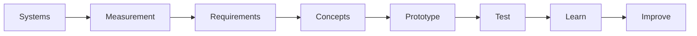
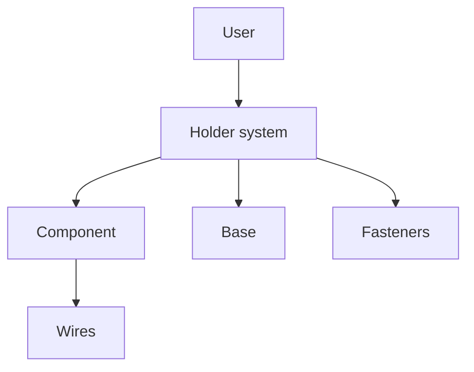
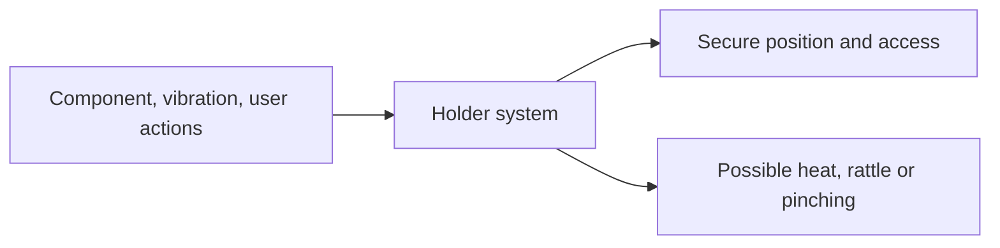
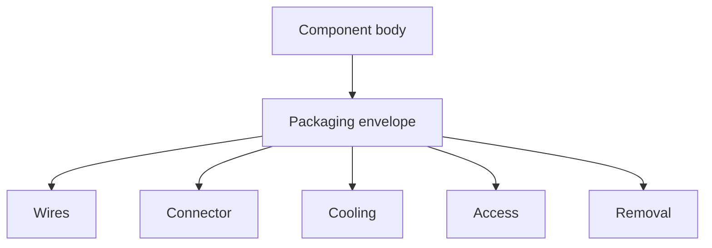

# Chapter 10 — First Engineering Challenge

> **"The best way to learn engineering is to use it."**

---

# The Challenge

Design a simple holder for a small RC-related component.

The holder must:

- keep the component in a known position
- allow the component to be installed and removed
- protect wires or moving parts
- attach to a flat base
- be understandable from your notes and drawing

You may choose one of these components:

- RC receiver
- small ESC
- steering servo
- battery
- switch
- cooling fan
- small sensor
- a similarly sized household object if RC parts are not yet available

The first prototype may be made from:

- cardboard
- paper
- foam board
- modelling clay
- reusable building blocks
- simple 3D printed material, if available

The goal is not to make a finished buggy part.

The goal is to complete one full engineering cycle.

---

# Why This Challenge Comes Now

So far, we have learned how to:

- see systems
- trace forces and motion
- understand why parts fail
- measure real objects
- judge measurement quality
- design useful fits
- communicate with drawings
- follow an engineering process

This challenge combines those skills.



You are now going to create evidence that you can use those ideas together.

---

# What You Will Produce

By the end of the challenge, you should have:

1. A problem statement
2. A user description
3. A system boundary
4. A component measurement sheet
5. A packaging-envelope sketch
6. Requirements
7. Constraints
8. At least three concepts
9. A decision matrix
10. A prototype
11. A test plan
12. Test results
13. An engineering drawing
14. A revision note
15. A short design review
16. A definition of done checklist

Do not worry if the first version is rough.

A complete rough process is more valuable than one beautiful sketch with no evidence behind it.

---

# Safety First

Before starting:

- Work in a clear area.
- Ask an adult before using blades, drills, soldering tools or hot equipment.
- Use safety glasses when cutting rigid materials or testing parts to failure.
- Do not puncture, crush or modify a battery.
- Do not power an ESC or motor for this challenge unless supervised and required.
- Keep fingers away from moving servo horns.
- Do not use a spinning motor or wheel during this first challenge.
- Use only low-risk materials for the first prototype.

This challenge is about design thinking, not dangerous testing.

---

# Choosing the Component

Choose a component that is simple enough to measure.

Good first choices:

## Receiver

Advantages:

- usually small
- no moving parts
- simple rectangular shape
- needs wire clearance
- useful for learning packaging

## Servo

Advantages:

- clear mounting features
- has a moving output
- introduces swept volume
- useful for learning interface design

## Battery

Advantages:

- easy to measure
- introduces retention and removal
- requires cable and connector space
- teaches safety and packaging

## Small ESC

Advantages:

- introduces cooling
- needs wire-routing space
- teaches access and mounting

For the easiest first project, choose a receiver or small rectangular object.

---

# Step 1 — Define the User

Write down who will use the holder.

Example:

```text
The user is a beginner RC builder who must be able to install and remove
the receiver using ordinary hobby tools.
```

Now answer:

- How experienced is the user?
- Which tools are available?
- Will the part be used indoors or outdoors?
- Will it get dirty?
- How often will it be removed?
- Could wires be damaged?
- Does the user need to see labels or buttons?

---

# Step 2 — Write the Problem Statement

Use this pattern:

```text
[User] needs a way to [task]
because [current problem or reason].
```

Example:

```text
A beginner RC builder needs a way to hold the receiver securely
because loose movement may pull wires and damage connections.
```

Avoid including the solution.

Weak version:

```text
We need a snap-fit receiver box.
```

This assumes the answer before ideas are explored.

---

# Step 3 — Define the System Boundary

Decide what belongs inside this design problem.

For a receiver holder, the boundary may include:

- receiver
- holder
- mounting screws
- foam pad
- wires near the holder
- flat mounting surface

It may exclude:

- radio transmitter
- battery chemistry
- motor
- entire chassis



A clear boundary prevents the project from becoming too large.

---

# Step 4 — Identify Inputs and Outputs

Even a simple holder is a system.

Possible inputs:

- component weight
- vibration
- installation force
- wire pull
- screw clamping force

Possible useful outputs:

- component remains located
- wires remain protected
- part can be removed
- vibration is reduced

Possible unwanted outputs:

- heat trapped
- wires pinched
- rattle
- difficult access
- excess weight

Create a simple input-process-output diagram.



---

# Step 5 — Inspect Before Measuring

Look carefully at the component.

Do not touch a powered component.

Ask:

- Which faces are flat?
- Which corners are rounded?
- Where do wires leave?
- Are there labels or buttons?
- Are there mounting tabs?
- Which surfaces may become warm?
- Which areas must remain visible?
- Does anything move?

Make a rough sketch before taking measurements.

---

# Step 6 — Create a Measurement Plan

List the measurements needed.

Example for a receiver:

- body length
- body width
- body height
- wire exit location
- connector height
- corner radius estimate
- clearance above plugs
- mounting surface size

Example for a servo:

- body size
- mounting-tab spacing
- mounting-hole diameter
- output-shaft location
- horn height
- horn swept volume
- wire exit position

Mark each dimension as:

- critical
- useful
- decorative

Spend the most care on critical dimensions.

---

# Step 7 — Measure the Component

Use the techniques from Chapters 05 and 06.

For each critical dimension:

1. Clean the part and tool.
2. Check units.
3. Check zero.
4. Measure gently.
5. Repeat at least three times.
6. Record all readings.
7. Calculate an average if useful.
8. Note uncertainty or surface problems.

Example table:

| Feature | Reading 1 | Reading 2 | Reading 3 | Chosen value | Notes |
|---|---:|---:|---:|---:|---|
| Body width | 31.18 | 31.20 | 31.19 | 31.2 mm | Rigid plastic |
| Body height | 16.04 | 16.03 | 16.05 | 16.0 mm | Excludes plugs |
| Wire exit width | 8.1 | 8.0 | 8.1 | 8.1 mm | Flexible wires |

---

# Step 8 — Draw the Packaging Envelope

The packaging envelope is larger than the solid component.

Include space for:

- wires
- plugs
- movement
- installation
- removal
- cooling
- fingers
- tools



Sketch the envelope around the component.

Label:

- body dimensions
- required side clearance
- wire bend space
- top access
- removal direction

---

# Step 9 — Identify Interfaces

List everything the holder must connect to.

Possible interfaces:

- component to holder
- holder to base
- screw to printed hole
- wire to cable opening
- lid to body
- foam pad to component

For each interface, record:

- mating part
- nominal size
- actual measured size
- desired fit
- fastening method
- assembly direction

Example:

| Interface | Desired behaviour |
|---|---|
| Receiver body to pocket | Small clearance, no squeezing |
| Holder to base | M3 screw clearance |
| Wire to slot | Free movement without sharp edges |
| Lid to holder | Removable by hand |

---

# Step 10 — Write Requirements

Create at least six requirements.

Example receiver-holder requirements:

```text
REQ-01: The holder shall locate the receiver during normal handling.
REQ-02: The receiver shall be removable in less than 60 seconds.
REQ-03: No wire shall be bent around an edge sharper than R2 mm.
REQ-04: The holder shall attach using no more than four M3 screws.
REQ-05: The holder shall allow access to all receiver plugs.
REQ-06: The holder shall not cover the receiver status light.
REQ-07: The holder should print without support material.
REQ-08: The holder may include a foam vibration pad.
```

Requirements should be testable.

---

# Step 11 — Write Constraints

Create at least six constraints.

Possible constraints:

- available printer size
- available material
- cardboard thickness
- chosen fasteners
- component dimensions
- base size
- limited build time
- no permanent glue
- no battery modification

Mark each constraint as hard or soft.

Example:

| Constraint | Type |
|---|---|
| Must fit on 220 × 220 mm printer bed | Hard |
| Use M3 hardware already available | Hard |
| Print in under 2 hours | Soft |
| Avoid support material | Soft |
| No permanent glue on receiver | Hard |

---

# Step 12 — Define Success Before Designing

Write a definition of done.

Example:

```text
The challenge is done when:

- the component fits without force
- wires are not pinched
- the holder attaches to a flat base
- the component can be removed
- the holder survives a gentle shake test
- a drawing and test record are complete
```

This prevents endless redesign.

---

# Step 13 — Generate at Least Three Concepts

Do not begin CAD after the first idea.

Create at least three different concepts.

Possible holder concepts:

## Concept A — Open Tray With Strap

- simple base
- side walls
- hook-and-loop strap

## Concept B — Clip-In Cage

- flexible side clips
- open top
- quick removal

## Concept C — Two-Piece Box

- lower tray
- removable lid
- screw or snap retention

## Concept D — Foam-Pad Platform

- flat base
- foam tape
- cable guide

## Concept E — Sliding Cassette

- component sits in removable carrier
- carrier slides into base

Sketch each concept.

---

# Step 14 — Create Concept Cards

For each concept, record:

```text
Concept name:
How it works:
Advantages:
Risks:
Questions:
Likely material:
Assembly method:
```

Example:

```text
Concept: Open Tray With Strap

How it works:
Receiver sits between four low walls.
A reusable strap crosses the top.

Advantages:
Simple, visible, easy to print.

Risks:
Strap may press connectors.
Receiver may move vertically.

Questions:
How high should the walls be?
Where should the wire opening go?
```

---

# Step 15 — Compare Concepts

Choose criteria connected to the requirements.

Possible criteria:

- component protection
- wire safety
- removal speed
- print simplicity
- low part count
- repairability
- dirt resistance
- visibility
- low weight

Create a decision matrix.

| Criterion | Open tray | Clip cage | Two-piece box |
|---|---:|---:|---:|
| Easy to build | 5 | 3 | 3 |
| Easy removal | 5 | 4 | 3 |
| Protection | 2 | 3 | 5 |
| Wire access | 5 | 4 | 3 |
| Low risk | 5 | 3 | 3 |
| Total | 22 | 17 | 17 |

Explain why the chosen concept is the best first prototype.

Do not hide uncertainty.

---

# Step 16 — Identify Risks and Assumptions

Create a risk table.

| Risk or assumption | Likelihood | Impact | Test or response |
|---|---|---|---|
| Pocket may be too tight | Medium | Medium | Make cardboard model or fit coupon |
| Wires may hit side wall | Medium | High | Test wire bend with real part |
| Clip may break | Medium | Medium | Build simple clip sample |
| Base screws may be inaccessible | Low | High | Check assembly sequence |

This turns surprises into planned questions.

---

# Step 17 — Build a Low-Cost Prototype

Use cardboard or another easy material first.

For a tray:

1. Draw the base.
2. Cut it slightly larger than the component.
3. Fold or attach side walls.
4. Add wire openings.
5. Place the component inside.
6. Check removal.
7. Mark interference areas.
8. Revise the cardboard.

Do not permanently attach the real component.

Use removable tape or soft bands if needed.

---

# Why Cardboard Is Valuable

Cardboard can test:

- size
- access
- layout
- assembly direction
- wire routing
- user handling

It cannot accurately test:

- final strength
- final fit
- heat resistance
- long-term durability

A prototype is useful when its limitations are understood.

---

# Step 18 — Test the Prototype

Create a written test plan.

Example:

## Test 1 — Installation

Purpose:

- verify the component can be installed safely

Procedure:

1. Start timer.
2. Install component.
3. Route wires.
4. Secure holder.
5. Stop timer.

Pass condition:

- installation under 60 seconds
- no wire pinching
- no excessive force

## Test 2 — Removal

Pass condition:

- removal under 60 seconds
- no tools beyond those allowed
- no damage

## Test 3 — Gentle Shake

Pass condition:

- component remains inside
- movement below chosen limit
- no connector impact

## Test 4 — Access

Pass condition:

- plugs, buttons or lights remain accessible as required

---

# Step 19 — Record Results

Use a table.

| Test | Requirement | Result | Pass? | Observation |
|---|---|---|---|---|
| Installation | Under 60 s | 42 s | Yes | Wire slot slightly narrow |
| Removal | Under 60 s | 35 s | Yes | Easy to grip |
| Shake | Remains secure | 3 mm movement | No | Needs top restraint |
| Access | Plugs reachable | All reachable | Yes | Label partly covered |

Record:

- facts
- measurements
- unexpected behaviour
- photographs
- video, if useful

---

# Step 20 — Identify the Root Problem

Suppose the shake test fails.

The symptom is:

```text
Component moves upward.
```

Possible root causes:

- side walls only control sideways movement
- no top restraint
- pocket clearance too large
- foam pad compresses
- strap location is poor

Use evidence.

Do not simply make every wall thicker.

---

# Step 21 — Make One Main Revision

Choose the smallest useful change.

Example:

```text
Revision B:
Added a removable top strap.
Kept base and side-wall dimensions unchanged.
```

Why one main change?

Because the next test can show whether the strap solved the problem.

---

# Step 22 — Retest

Repeat the same test conditions.

Compare Revision A and Revision B.

| Revision | Vertical movement | Removal time | Result |
|---|---:|---:|---|
| A | 3.0 mm | 35 s | Fails retention |
| B | 0.5 mm | 42 s | Passes |

Now you have evidence.

---

# Step 23 — Create an Engineering Drawing

Create a drawing of the improved concept.

Include:

- front view
- top view
- side view
- isometric sketch
- overall dimensions
- pocket size
- mounting-hole size and spacing
- wire opening
- material
- units
- revision
- part name
- fit notes
- post-processing notes, if relevant

Example title block:

```text
Project: RC Buggy Handbook
Part: Receiver Holder
Part No: RCB-ELE-001
Revision: B
Material: Cardboard prototype / PETG planned
Units: mm
Scale: NTS
```

---

# Step 24 — Add a Bill of Materials

Example:

| Item | Part | Quantity | Notes |
|---|---|---:|---|
| 1 | Receiver holder | 1 | Prototype |
| 2 | M3 × 12 screw | 2 | Planned final assembly |
| 3 | M3 washer | 2 | Planned |
| 4 | M3 locknut | 2 | Planned |
| 5 | Soft foam pad | 1 | Optional |
| 6 | Reusable strap | 1 | Retention |

---

# Step 25 — Write Revision Notes

Example:

```text
Revision A:
Initial open tray.
Result: Passed fit and access tests, failed retention test.

Revision B:
Added top strap and enlarged wire opening by 3 mm.
Result: Passed all current prototype tests.
```

Revision notes should tell the design story.

---

# Step 26 — Conduct a Design Review

Ask these questions.

## Problem

- Does the design solve the original problem?

## Requirements

- Which requirements passed?
- Which remain untested?
- Did any requirement turn out to be unnecessary?

## Interfaces

- Does the component fit?
- Are wires safe?
- Are fasteners accessible?
- Can the part be removed?

## Safety

- Are there sharp edges?
- Could a wire be pinched?
- Could heat be trapped?
- Could a battery be damaged?

## Manufacturing

- Can it be made with available tools?
- Can it fit on the printer?
- Will support material be needed?
- Are test coupons needed?

## Maintenance

- Can it be cleaned?
- Can it be replaced?
- Can the component be removed without damage?

---

# Step 27 — Decide What Comes Next

Possible next decisions:

- move to a simple CAD model
- make another cardboard revision
- print a fit coupon
- choose a different concept
- gather missing component data
- update requirements
- stop because the concept is good enough for now

The correct next step depends on evidence.

---

# The Final Challenge Report

Create a Markdown file using this structure:

```markdown
# First Engineering Challenge Report

## 1. Problem Statement

## 2. User

## 3. System Boundary

## 4. Measurements

## 5. Packaging Envelope

## 6. Requirements

## 7. Constraints

## 8. Concepts

## 9. Decision Matrix

## 10. Risks and Assumptions

## 11. Prototype

## 12. Test Plan

## 13. Results

## 14. Revision

## 15. Engineering Drawing

## 16. Bill of Materials

## 17. Design Review

## 18. Lessons Learned

## 19. Next Step
```

This report is the main artifact for the challenge.

---

# Suggested Repository Structure

Store the challenge files like this:

```text
activities/
└── first-engineering-challenge/
    ├── README.md
    ├── requirements.md
    ├── measurements.md
    ├── concepts.md
    ├── test-plan.md
    ├── test-results.md
    ├── design-review.md
    ├── drawings/
    └── images/
```

This prepares you for working like a real project team.

---

# Example Requirement Traceability Table

| Requirement ID | Requirement | Verification method | Result |
|---|---|---|---|
| REQ-01 | Component remains located | Shake test | Pass |
| REQ-02 | Removal under 60 seconds | Timed removal | Pass |
| REQ-03 | Wires not pinched | Visual inspection | Pass |
| REQ-04 | Attaches using M3 hardware | Assembly check | Not yet tested |
| REQ-05 | Status light visible | Visual inspection | Fail |

This table prevents requirements from being forgotten.

---

# Thinking Like an Engineer

Imagine the prototype fails.

That does not mean the project failed.

Ask:

- Did the test answer a useful question?
- Did the failure reveal a weak assumption?
- Is the requirement correct?
- Is the interface wrong?
- Can a small change solve it?
- Is another concept now better?
- What should be measured next?

A failed prototype that teaches something is successful engineering.

A beautiful prototype that teaches nothing is decoration.

---

# Common Beginner Mistakes

## Mistake 1 — Choosing a Project That Is Too Large

Do not design the entire chassis for this challenge.

Choose one small holder.

---

## Mistake 2 — Skipping the Problem Statement

A solution without a clear need is difficult to judge.

---

## Mistake 3 — Measuring Only the Component Body

Include wires, connectors, access and removal.

---

## Mistake 4 — Starting With One Final Idea

Generate at least three concepts.

---

## Mistake 5 — Building Before Defining Success

Write requirements and pass criteria first.

---

## Mistake 6 — Making the Prototype Too Detailed

Build the simplest version that answers the question.

---

## Mistake 7 — Testing Without Recording

A forgotten result cannot guide the next revision.

---

## Mistake 8 — Changing Everything After a Failure

Change one main variable where possible.

---

## Mistake 9 — Treating Cardboard Strength as Final Strength

Cardboard tests shape and access, not final material performance.

---

## Mistake 10 — Calling It Finished Without Documentation

The report, drawing and revision notes are part of the engineering work.

---

# Optional Extension 1 — Create a CAD Block Model

If you already know basic CAD:

1. Model the component as a simple block.
2. Add the packaging envelope.
3. Model the holder around the envelope.
4. Keep features simple.
5. Export screenshots.
6. Do not add decorative details yet.

This is a packaging model, not a final production design.

---

# Optional Extension 2 — Print a Fit Coupon

Before printing the full holder, test:

- component side clearance
- screw holes
- snap tabs
- strap slots
- wire channels

Create a small coupon with several values.

Record the best result in your fit library.

---

# Optional Extension 3 — Compare Two Materials

Build the same simple prototype in:

- cardboard
- foam board
- printed PLA or PETG, if available

Compare:

- stiffness
- ease of cutting or printing
- fit
- assembly
- repairability

Do not compare final strength unless the tests are fair and safe.

---

# Optional Extension 4 — Peer Review

Give your drawing and instructions to another person.

Do not explain them verbally.

Ask the person to answer:

- What does the part do?
- Which component fits inside?
- How is it mounted?
- Which dimensions are critical?
- How is the component removed?
- Which revision is this?

Any confusion reveals documentation that can be improved.

---

# Sprint 1 Completion Review

Before moving to Part 2, check that you can do the following.

## Systems

- identify major buggy subsystems
- draw inputs, processes and outputs
- trace a cause-and-effect chain

## Motion and Forces

- trace motion from motor to ground
- explain torque
- identify tension, compression, bending, shear and torsion
- draw a simple load path

## Measurement

- use a ruler and digital calipers
- record units
- repeat critical measurements
- distinguish accuracy and precision

## Fits

- explain clearance, transition and interference
- understand printer-specific compensation
- create a fit coupon plan

## Communication

- draw front, top and side views
- add dimensions and notes
- create a title block

## Process

- define a problem
- write requirements and constraints
- generate concepts
- build a prototype
- write a test plan
- record and review results

If several items are incomplete, repeat small activities before continuing.

---

# Chapter Summary

In this challenge, you applied the full engineering process to one small component holder.

You:

- defined a problem
- identified a user
- chose a system boundary
- measured a real object
- created a packaging envelope
- wrote requirements and constraints
- generated several ideas
- compared concepts
- identified risks
- built a low-cost prototype
- tested it
- recorded evidence
- revised one main feature
- created a drawing
- completed a design review

This is the same basic pattern used in much larger engineering projects.

The scale changes.

The thinking remains similar.

---

# New Words

| Word | Meaning |
|---|---|
| Packaging envelope | Total space required by a component, including access, wires, cooling and movement. |
| Requirement traceability | Link between each requirement and the test used to check it. |
| Design review | Structured evaluation of a design before continuing. |
| Challenge report | Document containing the problem, design work, tests and conclusions. |
| Peer review | Review performed by another person. |
| Packaging model | Simplified representation used to test component size and arrangement. |
| Retention | Method used to prevent a part from moving or escaping. |
| Installation sequence | Order in which parts are fitted. |
| Serviceability | Ease with which a part can be inspected, removed, cleaned or replaced. |
| Evidence | Measurements, observations or test results used to support a conclusion. |

---

# Review Questions

1. What is the goal of the first engineering challenge?
2. Why should the selected component be small and simple?
3. What belongs inside a system boundary?
4. Why is a packaging envelope larger than the component body?
5. Which measurements should receive the most attention?
6. Why should the real part be measured more than once?
7. What is an interface?
8. Why should requirements be written before concepts are selected?
9. What is the difference between a requirement and a constraint?
10. Why should at least three concepts be generated?
11. What is the purpose of a decision matrix?
12. Why should risks and assumptions be written down?
13. What can a cardboard prototype test well?
14. What can a cardboard prototype not test well?
15. Why should pass conditions be written before testing?
16. What is requirement traceability?
17. Why should one main change be made between revisions?
18. What belongs in revision notes?
19. Why is an engineering drawing part of the challenge?
20. What is the purpose of a design review?
21. What should happen when a prototype fails?
22. Why is documentation part of engineering?
23. What is serviceability?
24. Why can peer review improve a drawing?
25. What evidence is needed before moving to CAD?

---

# Chapter Checklist

- [ ] I selected a small component or substitute object.
- [ ] I wrote a user description.
- [ ] I wrote a clear problem statement.
- [ ] I defined the system boundary.
- [ ] I drew an input-process-output diagram.
- [ ] I inspected the component before measuring.
- [ ] I created a measurement plan.
- [ ] I measured critical dimensions at least three times.
- [ ] I drew a packaging envelope.
- [ ] I identified the important interfaces.
- [ ] I wrote at least six requirements.
- [ ] I wrote at least six constraints.
- [ ] I created a definition of done.
- [ ] I generated at least three concepts.
- [ ] I created concept cards.
- [ ] I completed a decision matrix.
- [ ] I recorded risks and assumptions.
- [ ] I built a low-cost prototype.
- [ ] I wrote a test plan.
- [ ] I recorded test results.
- [ ] I made one evidence-based revision.
- [ ] I repeated the relevant tests.
- [ ] I created an engineering drawing.
- [ ] I created a bill of materials.
- [ ] I wrote revision notes.
- [ ] I completed a design review.
- [ ] I created the final challenge report.
- [ ] I added all evidence to the project repository.
- [ ] I completed the Sprint 1 review.

---

# Looking Ahead

You have completed the first part of the handbook.

You now have the basic thinking tools used throughout the rest of the project.

In Part 2, we will enter the workshop.

We will learn:

- workshop safety
- tool selection
- screwdrivers and hex drivers
- cutting and drilling
- soldering basics
- 3D printer anatomy
- slicers
- first prints
- CAD fundamentals
- materials
- fasteners
- bearings
- practical prototyping

The next stage turns engineering ideas into physical parts.
