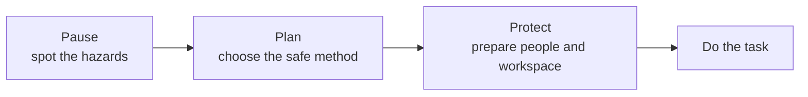
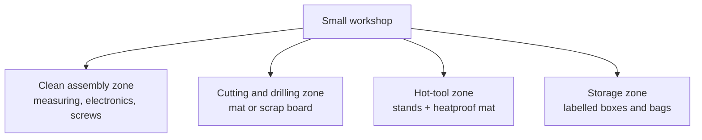

# Topic 2.1 - Workshop Safety and Setup

> **"The fastest way to finish a project is to avoid injuries, lost parts and damaged tools."**

---

# Learning Objectives

By the end of this topic you will be able to:

- Explain the difference between a **hazard** and a **risk**.
- Use the Pause-Plan-Protect routine before starting any task.
- Set up a small four-zone workspace on an ordinary table.
- Say when power must be disconnected and when an adult must supervise.
- Store tools and small parts so you can find any one of them in seconds.
- Stop work safely - and know why stopping is a skilled decision.

---

# Before We Begin

Here is a secret: you have been training for workshop safety your whole life. The training happened in your kitchen.

Think about what a kitchen actually contains. Something hot enough to burn you badly (the oven). Blades sharp enough to need a special block to live in (the knives). A machine with spinning blades (the blender). Stored energy that could scald you (a kettle full of boiling water). On paper, a kitchen sounds terrifying.

And yet your family cooks in it every day, usually while chatting, without anyone getting hurt. How?

Because kitchens run on quiet rules that everyone follows without even noticing. Pan handles get turned inwards so nobody knocks them. Knives go back in the block, never blade-up in the washing-up bowl. You grab the roasting tin with oven gloves, not enthusiasm. Nobody leaves the hob on and wanders off.

Nobody calls this "kitchen safety training". It is just how the kitchen works.

A workshop is the same room with different tools. The oven becomes a soldering iron. The knives become craft blades. The blender becomes a drill. And the same quiet rules - know what is hot, give sharp things a home, respect things that spin - keep you building instead of bleeding.

This topic turns your kitchen sense into workshop sense. That is all safety is.

---

# Why This Matters for Our Buggy

Building the buggy involves measuring, cutting, drilling, soldering, tightening, charging batteries and testing spinning wheels. Almost all of it is safe *when done properly*. Problems come from rushing, mess, the wrong tool, or starting without thinking.

There is a project reason to care too, straight from our guiding principles: injuries, lost screws and broken tools all cost time and money that should be buying learning. Safety is not a boring extra bolted onto engineering.

> Safety is a design requirement, like fit or strength. We design the *way we work*, not just the parts.

---

# Hazard and Risk

These two words sound similar but engineers use them precisely.

A **hazard** is something that *could* cause harm: a sharp blade, a hot iron, a spinning drill, a damaged battery.

A **risk** is how *likely* that harm is, and how bad it would be.

Back to the kitchen: a chef's knife is always a hazard - it never stops being sharp. But a knife in the knife block is a low risk. The same knife lying on the edge of the counter under a tea towel, blade facing out? Same hazard. Completely different risk.

| Situation | Hazard | Risk |
|---|---|---|
| Blade covered, in a labelled box | Sharp blade | Low |
| Open blade hidden under paper | Sharp blade | High |
| Soldering iron unplugged and cold | Hot tool | Low |
| Hot iron lying across loose wires | Hot tool | High |

Notice what changed in each pair: not the tool - the *situation*. That is the most useful safety idea in this whole topic:

> You usually cannot remove the hazard.
> You can almost always lower the risk.

---

# Pause, Plan, Protect

Before any workshop task, run this three-step routine. It takes under a minute - about as long as reading a recipe before turning on the hob.

**Pause.** Stop before touching the tool. What could move? What could get hot? What could cut? What could roll away and vanish?

**Plan.** Choose the right tool. Decide where the part will be held, where *both* your hands will go, and whether an adult needs to be there. Decide what you will do if something goes wrong - deciding it now is easy; deciding it mid-problem is not.

**Protect.** Prepare the space: glasses on, part clamped, hair tied back, power disconnected, table clear, hot tools in their stands.



---

# PPE: Oven Gloves for Engineers

**PPE** stands for personal protective equipment - things you *wear* to reduce harm. You already own the kitchen version: oven gloves. Nobody grabs a roasting tin bare-handed and hopes.

For this project, the PPE that matters is:

- **Safety glasses** - oven gloves for your eyes. Wear them for drilling, cutting rigid material, clipping wire (cut ends fly!), bending metal, and any test where a part might snap. Ordinary glasses are not safety glasses; proper ones are cheap and fit over them.
- **Closed shoes** - dropped tools find bare toes with impressive accuracy.
- **A dust mask** - when sanding makes dust.

One rule matters more than all the equipment:

> PPE is the *last* line of defence, not the first.
> Glasses protect you while drilling - they do not excuse skipping the clamp.

> **SAFETY**
>
> Never wear loose gloves near anything that spins - drills, motor shafts, wheels.
> Fabric can catch and pull your hand *into* the machine. Bare, careful hands
> are safer around rotation. (Same reason you tie back long hair, tuck away
> hoodie cords and take off dangling jewellery - a blender does not care that
> it was only your scarf.)

---

# Power Off Is the Default

You would never poke a fork into a plugged-in toaster to free stuck bread. You unplug it first - the ten-second habit that removes the risk entirely.

The buggy has its own version. Before touching gears, wheels, steering links, motor mounts or wiring:

> Disconnect the battery. Every time.

Do not trust the transmitter switch alone. A radio glitch or a nudged trigger can start the motor while your fingers are in the drivetrain - and remember from Topic 1.3 how much torque reaches those gears.

```text
Adjusting or inspecting -> battery disconnected
Testing movement       -> battery connected, just for the test
```

---

# Batteries Need Respect

A charged battery is like a kettle of just-boiled water: quietly holding a lot of energy, perfectly safe handled properly, and not something you drop, stab or leave with a toddler.

The full battery topic is coming (Topic 3.3 - Batteries and Battery Safety), but from today:

- Never crush, bend, puncture or open a battery.
- Never use one that is swollen, leaking, hot or damaged.
- Never let metal tools touch across its terminals - that is a short circuit, and shorts make heat fast.
- Charge only with the correct charger, only with an adult, only away from flammable clutter.
- Disconnect the battery before mechanical work (you knew that one already).

> **SAFETY**
>
> If a battery ever swells, gets unusually hot, smells odd or starts smoking:
> move away and tell an adult. Do not pick it up to inspect it. This rule is
> also on the project [safety card](../SAFETY.md), which lives beside every
> topic of this handbook.

---

# Hot Things

Here is the sneaky thing about heat, and every cook knows it: **a hot pan looks exactly like a cold pan.**

The workshop is full of parts that look innocent while holding a burn: the soldering iron (obviously), the hot glue gun and the glue itself, the 3D printer nozzle and bed (Topic 2.2), a motor after hard running, an ESC (the motor's speed controller - Topic 3.6) after a long test.

So borrow the kitchen habits:

- Hot tools live in a stand, like a pan on a trivet - never flat on the bench.
- Give your bench a **hot zone**: one clearly-agreed spot where hot things sit while they cool. If it is in the hot zone, treat it as hot.
- Wait before touching, and never test temperature with a fingertip. Hover the back of your hand near (not on) a part to feel radiated heat.

---

# Sharp Things

Every cook also knows the strangest knife fact: **a blunt knife is more dangerous than a sharp one.** A blunt blade needs more force, and more force means less control - and a slip. The same is true of craft knives and drill bits.

The rules:

- Cut *away* from your body, with your other hand out of the blade's path.
- Use a cutting mat, and make several light passes instead of one heroic one.
- Cover or retract blades the moment you stop cutting - a knife block for the workshop.
- Replace damaged or dull blades; ask an adult to supervise knife, saw and drill work.

---

# Spinning Things

Drills, rotary tools, motor shafts, gears, wheels: things that rotate are the workshop's blender, and they earn the same respect - lid on, fingers out.

The one rule that prevents the classic drilling injury:

> Never hold a small part in your fingers while drilling it. Clamp it.

A drill bit can grab the part and spin it instantly - faster than you can let go. It stops being a part and becomes a propeller with sharp corners. Clamping also frees both hands to control the tool, which is why every school workshop in the country teaches it (see this topic's Learn More).

Before spinning anything: clamp the work, glasses on, hair and cords secured, hands clear, and let it stop completely before you reach in - the same patience you give a blender before poking a spoon in.

---

# Fumes, Dust, Food and Drink

Some jobs make air you should not breathe: soldering smoke, sanding dust, some glues. The kitchen rule applies - you turn on the extractor fan or crack a window when frying, and you do the same here. Work with ventilation, keep your face out of rising smoke, and never *deliberately* sniff anything.

And keep food and drink away from the bench entirely. A drink beside open electronics is a coin-flip you do not need, and fingers that have handled solder or lubricant should be washed before they handle a sandwich.

---

# Stop-Work Signals

Your house has a smoke alarm. In the workshop, *you* are the smoke alarm.

Stop immediately if: a tool suddenly sounds different, a part shifts in its clamp, anything smokes or smells hot, a blade slips more than once, someone walks into your work area - **or you simply feel unsure**.

And here is the one that surprises people: stop if you are tired or frustrated. Ask any adult about cooking while distracted and they will show you a scar. Judgement and control fade before you notice they are fading.

> Stopping is not failure. Stopping is a controlled engineering decision -
> and it is always available to you, free, with no permission needed.

---

> **Good place to pause.** Before reading on, look at wherever you plan to work
> and spot three hazards. Write them in your notebook. The next section is about
> building the workspace itself.

---

# Your Workshop Can Be a Table

You do not need a garage. A corner of a desk, a folding table, or the dining table borrowed for the afternoon all work, as long as the space is stable, well lit, easy to clear, and away from small children and pets.

Professional chefs have a phrase worth stealing: *mise en place* - "everything in its place" - the setup done *before* cooking starts so that mid-recipe there is no hunting, no improvising, no chaos. Your workshop setup is mise en place for engineering.

Three qualities matter more than size:

- **Light.** You need to see hairline cracks, wire colours and measurement marks. A desk lamp you can move beats leaning your face closer to a spinning tool.
- **Stability.** A wobbly table ruins accurate measuring and makes cutting genuinely dangerous. Check a temporary table before each session.
- **Air.** For soldering or gluing, open a window or use a small extraction fan - but do not point a strong fan at the bench, or it will scatter your screws and chill your solder joints.

---

# The Four Zones

Kitchens solved this problem centuries ago: the chopping board is not on the hob, and the washing-up does not happen in the cutlery drawer. Different jobs get different areas.

Divide your bench - even a small one - into four zones:



- **Clean assembly zone** - measuring, electronics, bearings, final assembly. No dust, no glue, no drinks.
- **Cutting and drilling zone** - always over a cutting mat or scrap board.
- **Hot-tool zone** - heatproof mat, tool stands, no loose paper, cables routed so nobody snags them.
- **Storage zone** - can be a single box if space is tight.

On a small desk the zones might each be the size of a placemat. That is fine. What matters is that *you* know where the hot things are allowed to be.

> **[Sketch: top-down view of a small desk divided into four labelled zones -
> soldering iron in a stand in the hot zone, cutting mat in the cutting zone,
> parts tray in the clean zone, labelled boxes in the storage zone]**

---

# A Home for Every Tool and Every Screw

An RC buggy runs on tiny parts: screws, nuts, washers, bearings, clips, spacers. Each one is small enough to vanish into carpet forever, and some cost real money.

The defence is boring and unbeatable: **everything gets a labelled home.** Divided boxes, labelled bags, jars, a magnetic tray for steel parts. Label by size and type:

```text
Good label: M3 x 12 socket-head screws
Weak label: small black screws
```

Two habits complete the system:

- **The project tray.** One shallow tray (a food-container lid works) holds every part of the thing you are currently working on. Parts go in the tray, never loose on the table. No more screws rolling off the edge of the world.
- **Photo first, then strip parts in a line.** When taking something apart, photograph it, then lay the parts out left-to-right in removal order. The line *is* your reassembly instructions, in reverse.

Check tool condition as you use them - cracked handles, worn hex tips, damaged cables - and use the *correct* tool, not the nearest one. Everyone has used a butter knife as a screwdriver; everyone has also chewed up a screw head doing it. On the buggy, a stripped screw can hold the whole project hostage.

---

# Build Your Kit Slowly

Straight from our guiding principles: **each purchase should unlock a real task.** Do not buy a 200-piece tool set on day one.

| Useful now | Buy when a task needs it | Do not buy yet |
|---|---|---|
| Clear surface + desk lamp | Digital calipers (Topic 1.5 makes them tempting) | Big cheap tool sets |
| Cutting mat or scrap board | Soldering iron (Topic 2.9) | Duplicate tools |
| Safety glasses | Wire cutters, clamps, drill | Specialist RC tools |
| Ruler, pencil, notebook | 3D printer accessories (Topic 2.2) | Materials with no planned use |
| Parts tray + labelled bags | | |

The full list, with what each tool is first needed for, lives in [TOOLS.md](../TOOLS.md). And remember that borrowing counts: family, school, library maker spaces and RC clubs all lend tools - learn the tool's rules, return it clean, and report any damage.

---

# The Tidy Ending

Watch a good cook: they clean *as they go*, and the kitchen is nearly tidy when the meal is served. Cleaning is not what happens after the work. It is part of the work.

End every session the same way:

1. Disconnect power.
2. Leave hot tools cooling safely in the hot zone.
3. Return tools to their homes; cover blades.
4. Store batteries properly.
5. Label anything half-finished.
6. Write the next step in your notebook.

That last one is the secret weapon. "Next: drill the second hole at 32 mm" turns your next session's first five confused minutes into five productive ones.

---

> **Good place to pause.** The ideas are done - what remains is practice.
> The activities below build your actual workspace.

---

# Hands-On Activity 1 - The Hazard Hunt

*No equipment needed - just your eyes and your notebook.*

Train your hazard-spotting on the room where you already know the answers: the kitchen.

1. Stand in the kitchen doorway. Find something hot, something sharp, something that spins, and something storing energy.
2. For each one, spot the *rule* your family already uses to keep its risk low (knife block, oven glove, kettle placed back from the edge).
3. Now do the same at your planned workspace. Find at least five hazards and write one risk-reducing action for each:

| Hazard | What could happen? | How to lower the risk |
|---|---|---|
| Cable across the floor | Someone trips | Route it along the wall |
| Open blade under paper | Cut hand | Retract and store the blade |

The skill you are practising is *seeing situations, not just objects* - and you will use it every single session.

---

# Hands-On Activity 2 - Build the Four-Zone Workspace

*You need: a table, four paper labels, some boxes or containers, a cutting mat or scrap board.*

1. Clear the entire surface. (Yes, entirely. Mise en place.)
2. Label the four zones: clean, cutting, hot tools, storage.
3. Put only the correct things in each zone, and route cables away from walking paths.
4. Photograph or sketch the result for your notebook.

Then answer honestly: what felt crowded? What would need to move before you could solder safely? Where will small screws live?

---

# Hands-On Activity 3 - The Dry Run

*You need: scrap material, a clamp, a pencil to act as a pretend drill, safety glasses.*

Pilots rehearse before they fly. You will rehearse a drilling job with zero power involved.

1. Put on the safety glasses (yes, even for a pretend drill - you are training the habit, and habits do not know the difference).
2. Mark a pretend hole. Clamp the material.
3. Say out loud: "Part secure. Hands clear. Glasses on."
4. Pretend to drill. Stop. Wait for the imaginary spinning to end.
5. Unclamp, and clear the area.

Record which step you nearly forgot - that is the one to watch when the drill is real.

---

# Hands-On Activity 4 - The 30-Second Test

*You need: bags/boxes/jars, labels, and a handful of safe parts to organise.*

Sort your parts by type, fasteners by size (`M3 x 12`, not "smallish"). Label every container. Set up your project tray.

Then measure your organisation like an engineer measures anything:

```text
Find: one named part (e.g. an M3 x 12 screw)
Time: ______ seconds
Pass condition: under 30 seconds
```

If you fail, your storage design needs iterating - exactly like any other design.

---

# Engineering Challenge - Your Workshop Safety Card

Make a one-page card to live beside your workspace - your personal version of the project [safety card](../SAFETY.md).

**Before work:** table stable and clear - lighting good - correct tool ready - glasses to hand - hair and loose clothing secured - battery disconnected unless testing - adult present when required.

**During work:** hands out of cutting and spinning paths - work clamped - hot tools in their stands - drinks away from the bench - stop-work signals respected.

**After work:** power off - hot tools cooling - blades covered - batteries checked and stored - parts labelled - next step written down.

Decorate it, laminate it, tape it to the wall. A safety card you made is one you will actually read.

---

# Near Misses: Free Lessons

A **near miss** is trouble that *almost* happened: the screw that flew past your ear, the part that slipped in the clamp, the hot iron that nearly touched its own cable.

You already know this feeling from home - the time you nearly slipped on the stairs and forever after held the rail. The near miss taught you for free what an accident would have taught you expensively.

Engineers treat near misses as data (remember "failures are teachers" from Topic 0.0?). When one happens, write three lines:

```text
Near miss: part shifted while drilling
Cause:     clamp too far from the hole
Change:    clamp closer to the drilling point
```

Then investigate like an engineer, not a victim of luck: was the part clamped? Was the tool damaged? Was I rushing? The aim is a reusable rule, not just relief.

---

# Common Beginner Mistakes

## Mistake 1 - Starting on a cluttered table

Clutter hides blades and eats screws. Clear the zone first - it takes two minutes.

## Mistake 2 - Leaving the battery connected

"I'm only adjusting the gear mesh" is exactly when the motor bites. Disconnect first, every time.

## Mistake 3 - Holding a small part while drilling

The bit grabs, the part spins, fingers are in the way. Clamp it - no exceptions.

## Mistake 4 - Buying a mountain of tools on day one

Money spent before the need is known is learning lost. Buy when a task demands it.

## Mistake 5 - Forcing the wrong driver into a screw

The head strips, and now you own a screw that will never come out. Check the fit before applying force.

## Mistake 6 - Working tired or annoyed

The buggy will still be there tomorrow. Write down the next step and walk away - that is the professional move.

## Mistake 7 - Treating cleanup as optional

Tonight's mess is next session's hazard hunt. The tidy ending is part of the job.

---

# Topic Summary

In this topic we learned that:

- You already understand safety culture - the kitchen taught you. The workshop just changes the tools.
- A **hazard** is what could cause harm; **risk** is how likely and how bad. You lower risk by changing the situation.
- **Pause, Plan, Protect** before every task; **PPE** is the last line of defence, not a substitute for a safe method.
- Power off is the default: disconnect the battery before touching anything mechanical, and treat batteries like kettles of energy.
- Hot things look cold, blunt blades slip, and spinning tools demand clamps and clear hands.
- A four-zone workspace on an ordinary table beats an expensive messy one, and every tool and screw needs a labelled home.
- Stopping - including when tired or unsure - is a skilled engineering decision, and near misses are free lessons worth recording.

---

# New Words

| Word | Meaning |
|---|---|
| Hazard | Something that could cause harm. |
| Risk | How likely harm is, and how serious it would be. |
| PPE | Personal protective equipment - things worn to reduce harm, such as safety glasses. |
| Ventilation | Replacing stale or contaminated air with cleaner air. |
| Hot zone | The agreed bench area where hot tools and parts are allowed to be. |
| Tool path | The space a tool or moving part travels through - keep body parts out of it. |
| Near miss | An event that could have caused harm but did not; a free lesson. |

---

# Review Questions

1. A craft knife sits in a labelled box with its blade retracted. What is the hazard, and why is the risk low?
2. What are the three steps of Pause-Plan-Protect?
3. Why do safety glasses not excuse skipping the clamp?
4. Why must the battery be disconnected before adjusting gears - and why is the transmitter switch not enough?
5. What is sneaky about hot parts, and how does the hot zone help?
6. Why is a blunt blade more dangerous than a sharp one?
7. What can happen if you hold a small part in your fingers while drilling it?
8. Name three stop-work signals. Which one applies to *you* rather than the tools?
9. What is a near miss, and what three lines should you write when one happens?

---

# Topic Checklist

- [ ] I can explain hazard vs risk with my own example.
- [ ] I use Pause-Plan-Protect before workshop tasks.
- [ ] I know when glasses are needed and why gloves are banned near spinning tools.
- [ ] I disconnect batteries before mechanical work.
- [ ] I know the warning signs of a damaged battery and what to do.
- [ ] I built my four-zone workspace (Activity 2).
- [ ] I completed the hazard hunt - kitchen and workshop (Activity 1).
- [ ] My parts passed the 30-second test (Activity 4).
- [ ] I made my workshop safety card.
- [ ] I know that stopping when unsure is always allowed.

---

# Learn More

> **Learn more**
>
> - BBC Bitesize (Design and Technology) - search "health and safety"
> - Your tool's own manual - the manufacturer's safety pages are written for that exact tool
> - If you join a school, library or club workshop, take their induction - it is this topic, taught hands-on

---

# Looking Ahead

Your bench now has a hot zone. In the next topic, we put something in it.

Topic 2.2 introduces the 3D printer: a robot that draws with melted plastic, layer by layer, and builds almost any shape you can design. It is the tool that will make most of our buggy's parts - and now you have the workspace, and the habits, to run it safely.
