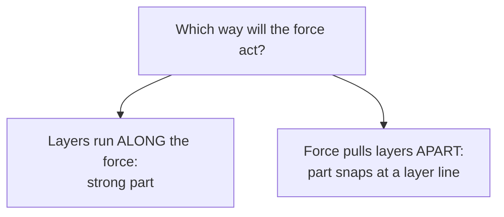

# Chapter 11 - 3D Printing Fundamentals

> **"A 3D printer does not print objects.
> It prints thin slices of objects, thousands of times in a row."**

---

# Learning Objectives

By the end of this chapter you will be able to:

- Explain what **additive manufacturing** means and how it differs from cutting and carving.
- Name the main parts of an FDM printer and what each one does.
- Describe the journey from a computer model to a printed part.
- Explain why printed parts are weaker between layers, and use that to choose a print orientation.
- Compare PLA and PETG and choose one for a buggy part.
- Follow the safety rules every time a printer is running.

---

# Before We Begin

Imagine decorating a cake with an icing bag.

You squeeze the bag, and a thin line of icing comes out of the nozzle. You can write a name, draw a flower, or pipe a border around the edge. If you keep piping lines on top of each other, something interesting happens: the icing starts to grow upwards. Pipe enough careful layers and you can build a little icing wall.

Now imagine an icing bag that never gets tired, never wobbles, and can place each line in exactly the right spot, thousands of times in a row.

That is a 3D printer.

Instead of icing, it squeezes out melted plastic. Instead of your hand, a computer moves the nozzle. And instead of a cake, it builds on a flat plate - one thin layer at a time - until a real, solid object appears.

In this chapter we find out how that works, what printers are good at, what they are bad at, and how to stay safe around them.

---

# What Is 3D Printing?

There are two big families of making things.

**Cutting away** - you start with a block of material and remove what you do not need. A sculptor carving stone works this way. So do drills, saws and CNC machines (computer-controlled cutting machines - more in later chapters).

**Adding on** - you start with nothing and build the part up, bit by bit. A bricklayer works this way. So does our cake decorator.

3D printing belongs to the second family. Engineers call it **additive manufacturing** - "additive" simply means *adding material* instead of cutting it away.

The kind of 3D printing we will use is called **FDM**, which stands for **fused deposition modelling**. That sounds complicated, but you already understand it:

- *deposition* means putting material down
- *fused* means the layers melt together
- *modelling* means building a shape

Melted plastic is put down in lines, layer upon layer, and each new layer fuses onto the one below.

> **Learn more**
>
> - Explain That Stuff - How do 3D printers work: <https://www.explainthatstuff.com/how-3d-printers-work.html>
> - BBC Bitesize (KS3 Design and Technology) - search "CAD and CAM"

---

# Why This Matters for Our Buggy

Remember our project rule: **buy precision, build structure.**

We will not print motors, bearings or gears - those need factory precision (see the guiding principles). But we *will* print:

- chassis plates
- the battery tray
- electronics mounts
- servo and motor mounts
- bumpers and covers
- brackets and adapters

Every one of those parts starts life inside a printer. If you understand how the printer builds them, you will design better parts - and you will know why a part failed when it breaks.

---

# Meet the Printer

Before we print anything, let's meet the machine. An FDM printer has surprisingly few main parts.

| Part | Its job |
|---|---|
| **Filament** | The raw material: a long strand of plastic, usually 1.75 mm thick, wound onto a spool like garden wire. |
| **Extruder** | A motor with toothed wheels that grips the filament and pushes it forward, like squeezing the icing bag. |
| **Hot end** | The heater block that melts the filament, typically at 200-250 °C. |
| **Nozzle** | The tiny metal tip at the bottom of the hot end. Most nozzles have a 0.4 mm hole - about the thickness of four sheets of paper. |
| **Build plate** | The flat surface the part is built on. Often heated to help the plastic stick. Also called the *bed*. |
| **Motion system** | Motors and rails that move the nozzle (and sometimes the plate). Engineers name the directions X (left-right), Y (front-back) and Z (up-down). |

> **[Sketch: labelled front view of an FDM printer - spool of filament, extruder,
> hot end with nozzle, part being printed, heated build plate, motion rails]**

Think back to Chapter 2: the printer is itself a system of systems. Material supply (spool and extruder), heat (hot end), movement (motors and rails), and a control brain (the printer's electronics) all work together to do one job - place melted plastic in exactly the right spot.

---

> **SAFETY**
>
> A 3D printer is a robot with a soldering-iron-hot tip.
>
> - The nozzle runs at 200-250 °C. It stays dangerously hot for minutes after printing stops. Never touch it.
> - The build plate can reach 60-85 °C - hot enough to burn.
> - The motion system moves fast and does not know your fingers are there. Keep hands out while it is moving.
> - Melting plastic releases tiny particles and fumes. Print in a ventilated room, not a small closed bedroom. PLA is the mildest choice, which is one reason we start with it.
> - Always have an adult check the first layer of a print with you, and never leave a printer running alone in the house.
>
> The full workshop rules live in Chapter 10 and on the project [safety card](../SAFETY.md).

---

# From Idea to Part

A part does not go straight from your imagination into the printer. It makes a journey through several forms:


Let's walk the journey step by step.

**1. CAD model.** You design the part in a CAD program (computer-aided design - Chapter 13 is all about this). The CAD model is the *design*: exact sizes, holes, and shapes.

**2. STL file.** The CAD program exports an **STL** file. An STL describes only the outside *skin* of your part as thousands of tiny triangles. It contains no sizes, no notes, no design intent - remember from Chapter 8 why the drawing matters, not just the shape. Always keep the original CAD file; the STL is only an export, like a photo of your design.

**3. Slicer.** A **slicer** is a program that does exactly what its name says: it cuts your model into thin horizontal slices and plans the nozzle's route through every single one. This is also where you choose the settings: layer height, infill, supports and temperatures. The slicer is where most printing decisions are made.

**4. G-code.** The slicer saves its plan as **G-code**: a long list of simple instructions the printer follows one by one. "Move here. Push out this much plastic. Move there." A single small part can take hundreds of thousands of instructions.

**5. Printing.** The printer reads the G-code and builds the part, layer by layer. It follows the plan exactly - even if the plan is wrong. The printer has no idea what it is building.

That last point is worth repeating, because it explains most printing failures:

> The printer does not print your part.
> It prints your *settings*.

---

# Layers

Slice a loaf of bread and lay the slices flat, one on top of another, in order. You have rebuilt the loaf - out of flat slices.

That is exactly how your part is built. Each slice is one **layer**, and the **layer height** is how thick each slice is. A typical layer is 0.2 mm - about the thickness of two sheets of paper.

Layer height is a trade-off (remember trade-offs from Chapter 2):

| Layer height | Surface | Print time | Good for |
|---|---|---|---|
| 0.1 mm | Very smooth | Slow | Display models, fine details |
| 0.2 mm | Good | Medium | Most buggy parts - our default |
| 0.3 mm | Ridged | Fast | Rough drafts and test fits |

Because the part is made of flat slices, curved and sloped surfaces show tiny steps, like a staircase pretending to be a ramp. Thinner layers make smaller steps - and much longer prints.

> **[Sketch: the same sloped surface printed at 0.1 mm and 0.3 mm layer height,
> showing small stair-steps vs large stair-steps]**

---

> **Good place to pause.** Stretch, get a drink, or try Hands-On Activity 1 now.
> The next section connects printing back to forces and breaking - Chapter 4 territory.

---

# Layers Are the Weak Direction

Here is the most important engineering fact in this chapter.

When the nozzle lays down a new layer, the plastic below it has already cooled. The new layer melts onto it and grips - but that grip is never quite as strong as the solid plastic within a layer.

Remember **anisotropy** from Chapter 4: a material that behaves differently in different directions. A printed part is strong *along* its layers and weaker *between* them - like a deck of cards that slides apart between cards but is hard to tear through.

This means **print orientation is a design decision**, not an afterthought.

Think about a suspension arm from Chapter 4. In use, it gets bent up and down by bumps. If we print it standing upright, the bending force pulls the layers apart - the weak direction. If we print it lying flat, the layers run along the arm, and the force has to break through solid plastic.



> **[Sketch: the same bracket printed flat and printed upright, with a force
> arrow, showing the crack following a layer line in the upright version]**

Rule of thumb for the buggy:

> Lay the part down so the layers run along the biggest force.

When a printed part breaks, look at the broken surface. If the break is clean and flat along a layer line, orientation was probably the problem - you have just read a failure, exactly like Chapter 4 taught.

Before slicing any part, answer these four questions in your notebook:

| Question | Why it matters |
|---|---|
| What forces act on this part? | Layers must run along the biggest one. |
| Which face must be flat and clean? | The face on the build plate prints flattest. |
| Which holes or fits are critical? | Vertical holes print rounder than horizontal ones. |
| Where would supports touch? | Supported surfaces come out rough. |

Sometimes the answers fight each other. That is normal - orientation is a trade-off, like everything else in engineering.

---

# The First Layer

Ask anyone who prints: the first layer is the whole game.

The first layer is the only one that sticks to the build plate. Every other layer sticks to plastic. If the first layer does not grip properly, the part comes loose halfway through, and the printer keeps piping plastic into thin air - producing a bird's nest of spaghetti instead of a part.

A good first layer is:

- **slightly squashed** onto the plate, not resting on top of it
- **complete** - no gaps between the lines
- **stuck down** at every corner

This squashing is also why the bottom edge of a part often bulges slightly outward - the **elephant's foot** you met in Chapter 7. Now you know where it comes from.

Watch the first layer of every print. If it goes down well, the print will probably succeed. If it does not, stop the print - the next twenty minutes will not fix a bad first layer.

---

# Warping

Plastic shrinks a little as it cools. The bottom of the part cooled ages ago; the top is still warm. The result: the part slowly tries to curl upwards at the corners, like a drying autumn leaf. This is **warping**.

You will notice it most on:

- large flat parts (like our chassis plates)
- sharp corners
- cold rooms and draughts

A heated build plate fights warping by keeping the bottom layers warm and relaxed until the print finishes. Rounded corners help too - remember from Chapter 4 how corners concentrate stress? They concentrate shrinking as well.

This is one reason our buggy will use a *modular* chassis made from smaller bolted-together sections instead of one huge plate. Small parts warp less, print faster, and when one section breaks you reprint that section - not the whole chassis.

---

# Overhangs and Supports

The nozzle can only pipe plastic onto something. Each layer needs the layer below to rest on.

So what happens when a shape leans outward, like the top of the letter "Y"?

A small lean is fine. Each layer can stick out a little past the one below - up to about **45 degrees** from vertical is the classic rule of thumb. Steeper than that, and the plastic starts drooping into thin air.

An **overhang** is any part of the model that leans out or sticks out with nothing below it. For big overhangs, the slicer can add **support material**: thin, deliberately flimsy scaffolding printed under the overhang, which you snap off afterwards.

Supports work, but they cost time, waste plastic, and leave rough patches. Good designers avoid them where possible:

- turn the part over (the best support is a better orientation)
- use chamfers - remember from Chapter 7 how a 45-degree chamfer guides parts together? It also makes a printable overhang
- split the part in two and bolt it together

> **[Sketch: the letters T, Y and H printed upright - the T needing support,
> the Y just self-supporting at 45 degrees, the H bridging between legs]**

---

# Infill: Parts Are Not Solid

Here is a secret: printed parts are mostly hollow.

Inside the outer skin (the *walls*), the slicer fills the space with a pattern - a honeycomb, a grid, or wavy lines. This inside pattern is called **infill**, and you choose how dense it is.

| Infill | Feels like | Good for |
|---|---|---|
| 10-15% | Light, drum-like | Test fits, display parts |
| 20-40% | Solid and stiff | Most buggy parts - our usual range |
| 50-100% | Heavy, nearly solid | Rarely worth it |

Why not always print 100% solid? Because it is slower, heavier and more expensive - and usually *not much stronger*. Just like the I-beam in Chapter 4, most of a part's strength comes from its shape and its outer walls, not from filling the middle. Adding walls usually beats adding infill.

A light buggy accelerates faster and breaks less when it crashes. Infill is one of your easiest weight-saving tools.

---

# What Printers Do Badly

Printers are honest but imperfect. Chapter 7 warned you: exact size is not real. Here is how that plays out in printing.

- **Holes come out slightly small.** Print a 5.0 mm hole and expect roughly 4.8 mm. This is why the fit coupons from Chapter 7 exist - print a test row of holes *before* the real part.
- **The first layer spreads.** Elephant's foot makes the bottom edge slightly wider. A small chamfer on the bottom edge hides it.
- **Fine details blur.** The nozzle is 0.4 mm wide; it cannot draw anything thinner than its own tip. Text and tiny pins need to be chunky.
- **Bridges sag.** Plastic piped across a gap droops slightly, like a washing line.
- **Every printer is different.** Your neighbour's settings are a starting point, not a promise.

None of this is a problem if you expect it. All of it is a problem if you design as though the printer were perfect.

> Print a coupon before you print the part.
> (Our guiding principles call this "prototype interfaces before full parts".)

---

# A Print Is Not Free

Filament looks cheap, so it is tempting to print everything. But every print also costs machine time, electricity, your preparation time, and someone's supervision. A six-hour print that fails at hour five - or succeeds and turns out to be the wrong design - is an expensive lesson.

So before you press print, ask:

- Could a cardboard version answer this question first?
- Could I print only the risky feature, not the whole part?
- Is this design about to change anyway?
- Would a ready-made part do the job better?

Good engineers climb a ladder of cheaper answers first:

```text
Sketch -> cardboard mock-up -> test coupon -> partial print -> full part
```

Here is the ladder in action for a battery tray:

1. Draw the battery outline on paper. (Is the layout sensible?)
2. Build a cardboard tray. (Do the wires fit? Can the battery come out?)
3. Print a coupon of just the strap slot. (Does the strap actually fit?)
4. Print one corner of the tray. (Is the wall stiff enough?)
5. Print the complete tray - now with almost nothing left to guess.

Each step is cheaper than the one after it, and each one catches mistakes the next step would have made expensive. This is guiding principle 4: prove the idea before improving the material.

---

# Choosing a Filament: PLA vs PETG

There are dozens of filament materials. For this project, two matter.

| | **PLA** | **PETG** |
|---|---|---|
| Nozzle temperature | about 210 °C | about 230-250 °C |
| Build plate | about 60 °C (works even unheated) | about 70-85 °C (heated bed needed) |
| Ease of printing | Easiest of all | Medium - needs tuning |
| Stiffness | Very stiff | Slightly bendier |
| Toughness in a crash | Brittle - can snap | Tough - bends and survives |
| Heat resistance | Softens around 55-60 °C (a hot car!) | Better - around 70-80 °C |
| Best buggy use | Prototypes, test fits, indoor parts | Final parts, bumpers, anything near the motor |

(Temperatures are typical values from the Prusa material guides - always check your own filament's label, because brands differ.)

Our plan follows the guiding principles: **prove the idea in PLA, then print the final part in PETG.** PLA is cheap, easy and forgiving - perfect for coupons and prototypes. PETG shrugs off crashes and summer heat - worth the extra tuning for parts that must survive.

> **Learn more**
>
> - Prusa Knowledge Base - material guides for PLA and PETG: <https://help.prusa3d.com/filament-material-guide>
> - Explain That Stuff - how plastics work: search "plastics" at explainthatstuff.com

---

> **Good place to pause.** The teaching is done - what remains is practice.
> The activities below are where this chapter actually sticks.

---

# Hands-On Activity 1 - Slice a Shape by Hand

*No printer needed. You need: corrugated cardboard, scissors, a pencil, glue.*

You are going to be the slicer.

1. Choose a simple object with a curved shape - a mug, a small bottle, or draw a dome.
2. Imagine cutting it into horizontal slices as thick as your cardboard.
3. Draw and cut each slice out of cardboard: a stack of circles or ovals, each slightly different from the last.
4. Glue the slices in order, bottom to top.

Look at your model from the side. Those steps on the curved surface are exactly what a printer produces - your cardboard thickness is the layer height.

**Extension - feel the weak direction.** Make two small stacks of card strips, taped the same way. Bend the first so the layers peel apart, then bend the second along the layers. Feel the difference? You have just demonstrated anisotropy with your own hands - the same reason print orientation matters.

In your engineering notebook, record: how many layers did you need? What would change if your cardboard were half as thick? Which way was the card stack weakest?

---

# Hands-On Activity 2 - Layer Detective

*No printer needed. You need: your eyes and any 3D printed object - or photos of printed parts online.*

Many things around you were printed: phone stands, game pieces, hooks, school projects. Find one (or search for photos of 3D printed parts).

1. Find the layer lines. Which direction do they run?
2. Work out which face was on the build plate. (Look for a flatter, shinier face - and maybe a slight elephant's foot.)
3. Now think like Chapter 4: if you wanted to break this part with your hands, which direction would you bend it? Do the layers help it or weaken it there?
4. Was this part printed in a smart orientation? Write your verdict in your notebook.

---

# Hands-On Activity 3 - Your First Print (if you have a printer)

*Printer needed. Adult supervision required - read the SAFETY box again before starting.*

Do not print a buggy part yet. Print the tests that make every later part better:

1. **A calibration cube** (a simple 20 mm cube - every slicer ships with one, or your adult can download one). Measure it with the technique from Chapters 5 and 6: three measurements per side, written in your notebook. How close to 20.00 mm did you get?
2. **A hole coupon from Chapter 7**: a small plate with holes labelled 5.0 to 5.5 mm. Test which hole actually fits a 5 mm shaft or bolt.
3. Record both results in your **fit library** (Chapter 7). This page of your notebook will guide every buggy part you ever print.

Watch the whole first layer of each print. That habit alone will save you more failed prints than any upgrade.

And if a print fails? Failure is data. Photograph it before you touch it, then record in your notebook: the file name, material, layer height, orientation, where it failed, and your best guess why. One recorded failure teaches more than three lucky successes.

---

# Common Beginner Mistakes

## Mistake 1 - Printing the final part first

The most expensive print is the big one that fails. Coupons and small tests first - always. Our guiding principles are strict about this for a reason.

## Mistake 2 - Ignoring orientation

Choosing orientation by "what looks tidy on the plate" instead of "which way does the force act". The part prints beautifully, then snaps along a layer line on its first bump.

## Mistake 3 - Cranking the infill to 100%

It feels stronger. It mostly is not. It is definitely slower, heavier and more expensive. Add walls or improve the shape instead - Chapter 4's lesson again: shape beats material.

## Mistake 4 - Walking away from the first layer

Ninety per cent of failed prints announce themselves in the first five minutes. Watch the first layer, every time.

## Mistake 5 - Expecting CAD sizes from the printer

You designed a 5.0 mm hole, so you expect a 5.0 mm hole. Chapter 7 already told you the truth: every process has tolerance. Measure, adjust, and keep your fit library up to date.

## Mistake 6 - Trying to print everything

Bearings, gears, shafts and springs are precision parts. Buy precision, build structure.

---

# Chapter Summary

In this chapter we learned that:

- 3D printing is **additive manufacturing**: parts are built up in thin layers instead of carved from a block.
- FDM printers melt plastic **filament** and pipe it through a **nozzle**, layer by layer, onto a **build plate**.
- A part travels from CAD model to **STL** to **slicer** to **G-code** - and the printer prints your *settings*, not your intentions.
- Parts are weaker *between* layers than along them, so **print orientation is a design decision** driven by forces.
- The first layer decides most prints; **warping**, **overhangs** and undersized holes are normal and manageable.
- Parts are mostly hollow: walls plus **infill**, chosen as a trade-off between weight, time and strength.
- A print costs time as well as plastic: climb the ladder - sketch, cardboard, coupon, partial print - before committing to the full part.
- **PLA** is for learning and prototypes; **PETG** is for parts that must survive crashes and heat.

---

# New Words

| Word | Meaning |
|---|---|
| Additive manufacturing | Making a part by adding material layer by layer, instead of cutting it away. |
| FDM (fused deposition modelling) | 3D printing by melting plastic and laying it down in fused layers. |
| Filament | The raw material for FDM printing: a long plastic strand wound on a spool. |
| Extruder | The motor mechanism that grips the filament and pushes it into the hot end. |
| Hot end | The heated part of the printer that melts the filament. |
| Nozzle | The tiny metal tip (usually 0.4 mm) that the melted plastic comes out of. |
| Build plate | The flat, often heated surface a print is built on. Also called the bed. |
| Slicer | Software that cuts a 3D model into layers and plans the nozzle's path and settings. |
| G-code | The list of simple move-and-extrude instructions a printer follows. |
| STL | A file format that describes a part's outer surface as many small triangles. |
| Layer height | The thickness of each printed layer, typically 0.2 mm. |
| Infill | The internal pattern that partly fills a printed part, chosen as a percentage. |
| Overhang | A part of a model that leans out with nothing below to build on. |
| Support material | Sacrificial scaffolding printed under overhangs and removed afterwards. |
| Warping | Corners of a print curling up as the plastic cools and shrinks unevenly. |

---

# Review Questions

1. What does "additive" mean in additive manufacturing?
2. Put these in the order a part travels through them: G-code, CAD model, slicer, printer, STL.
3. Why is a printed part weaker between its layers than along them?
4. A suspension arm gets bent up and down in use. Should it be printed lying flat or standing upright, and why?
5. Why is the first layer of a print so important?
6. What is the rough overhang angle a printer can manage without supports?
7. Why do printed parts usually not need 100% infill? (Hint: think of Chapter 4's I-beam.)
8. You need a bumper that survives crashes and a quick test fit for a battery tray. Which filament would you pick for each, and why?
9. Your 5.0 mm designed hole printed at 4.8 mm. Which chapter's tool - and which test object - helps you plan for this next time?

---

# Chapter Checklist

- [ ] I can explain layer-by-layer printing to someone else.
- [ ] I know the journey: CAD -> STL -> slicer -> G-code -> printer.
- [ ] I can name the main parts of an FDM printer.
- [ ] I know the safety rules and why the nozzle and bed are dangerous.
- [ ] I built the cardboard slice model (Activity 1).
- [ ] I examined a printed part like a layer detective (Activity 2).
- [ ] If I have a printer: I printed and measured a calibration cube and a hole coupon.
- [ ] I added new results to my engineering notebook and fit library.

---

# Looking Ahead

In this chapter, the slicer got one small section. In the next chapter it takes centre stage.

We will install a slicer, load a ready-made model, choose our settings, and produce our first real prints - no CAD needed yet, because thousands of free models are ready to download.

Designing your own shapes comes right after that, in Chapter 13 (CAD Fundamentals). If you want a head start on it, Tinkercad (tinkercad.com) is a free, kid-friendly CAD tool.
