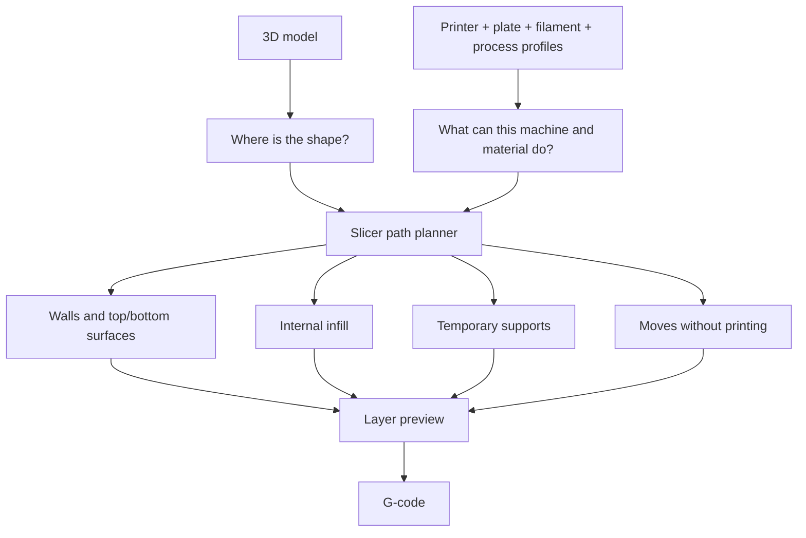

# Topic 2.3 - Slicer Software and First Prints
> **"The slicer is the printer's route planner.
> A wrong route can ruin a perfect model."**

---

# Learning Objectives 🎯
By the end of this topic you will be able to:

- Explain what a slicer decides before a printer begins moving.
- Choose a slicer that matches your printer.
- Select the correct printer, build plate, filament and process profiles.
- Move, rotate, scale and arrange a model on the virtual build plate.
- Choose sensible beginner settings without changing everything at once.
- Read the sliced preview like an X-ray of the future print.
- Start, watch, stop and record a safe first print.

---

# Before We Begin
Imagine planning a drive to a place you have never visited. You know the destination, but that is not enough. A satnav must choose every road, every turn and every junction between you and the destination. It also needs to know what vehicle you are driving.
A route suitable for a bicycle may be impossible for a van.

A 3D model is like the destination. It describes the final shape, but it does not tell the printer exactly how to get there. The **slicer** turns that shape into a route for the nozzle. It decides where each line of plastic goes, which lines form the outside walls, where the inside pattern sits, when the nozzle travels without printing, and whether temporary supports are needed.

For our buggy, those decisions affect much more than appearance. A battery tray with weak walls may crack around its strap slot. A servo mount with the wrong orientation may split between layers.
A large chassis section with poor bed adhesion may curl before it is half finished. The CAD model can be correct and the print can still fail. The slicer is where a design becomes a manufacturing plan.

---

# What the Slicer Actually Does
Remember the journey from Topic 2.2:

```text
CAD model -> STL or 3MF -> slicer -> G-code -> printer -> part
```

The slicer receives a three-dimensional shape and cuts it into horizontal layers. For each layer, it plans a path for the nozzle. Then it writes those paths as G-code instructions. That sounds like one job, but the slicer is really making several plans at once:



The model says, "Make this shape." The slicer answers:

- Which printer will make it?
- Which material will be used?
- How thick will the layers be?
- How many outside walls will it have?
- How much of the inside will be filled?
- Which areas need temporary support?
- How will the part stick to the build plate?
- How fast and how hot should the printer run?

The printer then follows that plan without understanding the object.

> The printer cannot tell whether it is making a toy, a buggy bracket or a mistake.

---

# The Same Journey in Different Slicers
Slicer programs do not all look the same. Buttons move, names vary, and updates change the screen. The main journey is still nearly always:

```text
Choose profiles -> import model -> position model -> choose settings
-> slice -> inspect preview -> export or send -> print
```

This topic teaches that journey rather than one exact set of buttons. That makes the skill useful even when your software updates or you use a different printer.

---

# Choosing Your Slicer
The best beginner slicer is usually the one recommended by your printer's manufacturer. Its ready-made profiles have already been tested with that machine.

| Slicer | Sensible starting point | Why a beginner might choose it |
|---|---|---|
| **Bambu Studio** | Bambu Lab printers | Manufacturer profiles, plate-based workflow and direct printer connection. |
| **PrusaSlicer** | Original Prusa printers and many compatible FDM printers | Clear profiles, strong preview tools and detailed official guidance. |
| **UltiMaker Cura** | UltiMaker printers and many third-party printers | Wide printer support and a simple Recommended mode before Custom settings. |
| **OrcaSlicer** | Many modern FDM printers | Strong calibration tools and broad printer support; better after you know the basics. |

This is not a competition. A slicer is a tool, and the right tool is the one with a correct, supported profile for your printer. Start with one slicer. Learn its workflow. Do not install four programs and mix their settings during your first week.

> **📚 Learn more**
>
> - Your printer manufacturer's support site - search "recommended slicer" and your exact printer model.
> - Prusa Knowledge Base - search "First print with PrusaSlicer" for a screenshot-led beginner workflow.
> - UltiMaker Support - search "Cura quality settings" to see how layer height controls quality and time.

---

# Download from the Official Source
Software is part of workshop safety. A random download page can contain an old version, altered installer or misleading advert button. Use one of these routes:

- the slicer link supplied by the printer manufacturer
- the slicer's official website
- the slicer's official GitHub page, when the manufacturer points there
- a school or makerspace installation managed by an adult

Avoid search results that copy the slicer's name but use an unrelated website address. Before installing:

1. Ask an adult if you do not manage the computer yourself.
2. Check that the operating system is supported.
3. Check that you have enough storage space.
4. Close important work before installing.
5. Record the slicer name in your engineering notebook.

You do not need to chase every new release. A stable version that supports your printer is more useful than a brand-new version you do not understand.

---

# Profiles: Recipes for the Slicer
Imagine baking bread. The recipe changes if you use a small loaf tin, a fan oven or a different flour. You cannot copy only the baking time and ignore everything else. A slicer **profile** is a saved group of settings that belong together. For a normal FDM print, three profiles matter most. Some slicers also treat the build plate as a separate choice.

## 1. Printer Profile
The printer profile tells the slicer about the machine:

- build volume
- nozzle size
- movement limits
- G-code type
- number of nozzles
- start and finish routines

The **build volume** is the three-dimensional space the printer can safely reach. It is the printer's room. A model outside that room cannot be printed there. Selecting a similar-looking printer is not good enough. The wrong profile may use the wrong bed size, temperatures or start routine.

## 2. Filament Profile
The filament profile tells the slicer how the material normally behaves:

- nozzle temperature
- build plate temperature
- cooling
- flow limits
- other material-specific rules

PLA and PETG do not use the same recipe. The spool label and the manufacturer's profile are the starting points.

## 3. Process Profile
The process profile describes how you want this print made:

- layer height
- walls
- top and bottom layers
- infill
- supports
- speed
- other quality choices

Names vary between slicers. You may see "process", "print settings", "quality" or "preset". The idea is the same.

## 4. Build Plate Choice
Some printers have more than one plate surface. The slicer may ask whether you are using a smooth, textured, cool or engineering plate. Choose the plate that is physically on the printer. The correct filament with the wrong plate profile can still give the wrong temperature or adhesion advice.

---

# The Four-Check Rule
Before importing a model, check these four items at the top of the slicer:

```text
1. Exact printer
2. Actual build plate
3. Actual filament
4. Sensible beginner process profile
```

Say them out loud during your first few prints.

```text
Printer correct.
Plate correct.
Filament correct.
Process correct.
```

This takes ten seconds. It can prevent an hour-long failed print.

> **🤔 Think about it.**
> Imagine putting a frozen pizza into an oven.
> You follow the correct time but accidentally use the grill setting instead of the oven setting.
> Is the recipe wrong, or is the machine setup wrong?

The slicer works the same way. A good model and sensible layer height cannot rescue the wrong machine or material profile. Always check the full setup before changing smaller settings.

---

# Importing a Model
Most slicers let you drag a model file onto the window or use an Import command. The model appears on a picture of the printer's build plate. Common file types include:

- **STL**, which carries the outside surface of one model
- **3MF**, which can carry models, positions, profiles and project information together

A **3MF project file** is useful when you want to save the whole plate setup. It is closer to saving a complete cooking plan than saving only a photo of the finished meal. An STL can still be perfect for sharing a plain model. Just remember that it normally does not carry your chosen printer or print settings.

## Check the Model Immediately
When a model appears, ask:

- Is it the size I expected?
- Is it sitting on the plate?
- Is any part outside the build volume?
- Is it lying in a sensible orientation?
- Did the slicer report a damaged model?

Units can cause surprises. A model designed in inches but read as millimetres may arrive tiny. A model designed in millimetres but read as inches may arrive enormous. Do not scale a model until you understand why its size is wrong. A 5 mm bearing hole scaled with the whole part is no longer a 5 mm bearing hole.

---

# The Virtual Build Plate
The build plate on screen is not decoration. It is a plan of the real printing area. A model must:

- fit inside the boundary
- stay away from forbidden areas shown by the slicer
- sit on the plate unless supports are deliberately holding it
- leave enough space for other models

The slicer may colour an invalid model differently or show a warning. Never ignore a warning just because the Slice button still works.

> **[Sketch: a slicer screen with one model safely inside the build plate, one model partly outside the boundary, and one model floating above the plate; warning areas clearly labelled]**

---

# Moving, Rotating, Scaling and Arranging
Slicers usually provide four basic model tools. Engineers call these changes **transforms**.

## Move
Move changes where the model sits on the build plate. The centre is usually a safe first location. Do not push a model against the plate edge unless you have a reason. The edges may cool differently from the centre on some printers.

## Rotate
Rotate changes the model's orientation. This can change:

- strength
- surface quality
- support use
- print time
- bed contact
- accuracy of holes

Rotate is often the most important tool in the whole slicer.

## Scale
Scale changes size. Uniform scaling changes every direction by the same percentage. Non-uniform scaling stretches only one direction. Use scaling carefully for engineering parts. If you enlarge a servo mount by 110%, every hole and wall also grows by 110%. The servo will not politely grow to match.

Scale is useful for decorative models. For fitted buggy parts, return to the CAD model when a dimension is wrong.

## Arrange
Arrange places several models on one plate without overlap. Printing several parts together can save setup time. It can also risk more material if one part comes loose and hits the others. For first prints, use one small model at a time.

---

> **☕ Good place to pause.**
> Open your slicer now if you have a computer.
> Find the printer, filament and process profile areas without changing anything.
> The next section turns those profiles into a print plan.

---

# Orientation: The First Design Decision
Topic 2.2 taught the rule:

> Lay the part down so the layers run along the biggest force.

The slicer is where you act on that rule. Orientation is a trade-off between five questions:

| Question | What you are trying to improve |
|---|---|
| Which way will the main force act? | Strength between layers. |
| Which face must be flat and neat? | Surface against the build plate. |
| Which holes must be round and accurate? | Hole direction and support quality. |
| How much of the model touches the plate? | Adhesion and stability. |
| Where would supports touch? | Surface finish and clean-up. |

## Buggy Example: Servo Mount
Imagine a U-shaped servo mount. The servo pushes sideways against its mounting ears. Printed upright, the ears may be pulled apart along layer lines. Printed on its side, the layers may run through the ears more strongly, but the inner shelf may need support. There may not be one perfect answer. You choose the orientation that protects the most important function, then redesign the shape if the compromise is poor.

> **[Sketch: three orientations of the same U-shaped servo mount, with arrows for steering force, highlighted layer directions, bed contact and support areas]**

This is why slicer knowledge improves CAD. You begin to design shapes that are easier to orient and need fewer supports.

---

# Core Setting 1 - Layer Height
Layer height is the thickness of each horizontal slice. You met it in Topic 2.2. For a normal 0.4 mm nozzle, a 0.2 mm profile is a sensible beginner choice for many printers. It balances detail and time. Always prefer the ready-made profile supplied for your printer.

| Layer choice | Likely result | Useful for |
|---|---|---|
| Fine | Smoother detail, more layers, longer print | Small text or detailed display pieces. |
| Standard | Balanced quality and time | Most early buggy parts and test pieces. |
| Draft | More visible layers, fewer layers, shorter print | Rough layout checks and fast prototypes. |

Do not choose the smallest layer height because it sounds "best". A test bracket does not need the surface of a model spaceship. Quality means fit for purpose, not maximum detail.

---

# Core Setting 2 - Walls
A printed part is like a house. The outer walls carry a surprising amount of the load, while the inside can remain partly empty. Slicers call these outer printed loops **walls** or **perimeters**. Both words refer to the solid lines around the outside of each layer. More walls usually mean:

- a stronger outer shell
- thicker material around holes
- more print time
- more filament

For a decorative token, a light default may be enough. For a buggy bracket with a bolt hole, walls are often more valuable than very high infill. Do not copy a wall count from a random video without checking the nozzle and profile. Use the slicer's tested beginner profile, then change one thing only when a test shows a need.

---

# Core Setting 3 - Top and Bottom Layers
Infill is not meant to remain visible. The slicer prints solid layers over the top and underneath the part. The **top layers** close the roof. The **bottom layers** form the floor.

Too few top layers can leave gaps where the roof bridges across the infill. Too few bottom layers can make the base thin. For first prints, keep the profile defaults. A standard profile normally connects top and bottom thickness to the chosen layer height. Remember the one-new-difficulty rule. You do not need to tune layer height, walls, top layers, bottom layers and speed during the same print.

---

# Core Setting 4 - Infill
Infill is the internal pattern inside the walls. You met the idea in Topic 2.2. The slicer lets you choose both a percentage and a pattern. For early prints, the percentage matters more than the pattern name.

| Infill range | Sensible use |
|---|---|
| Low | Visual models and very quick shape checks. |
| Medium | General brackets, trays and early buggy structures. |
| High | Special local needs after testing, not the default answer. |

Do not treat the percentage as a strength meter. Thirty per cent infill does not simply mean "thirty per cent strong". Strength also depends on material, walls, layer direction, shape and load. When a part fails near a screw hole, adding more infill far away from the hole may do almost nothing. A thicker wall around the hole or better orientation may solve the real problem.

---

# Core Setting 5 - Supports
Supports are temporary scaffolding for plastic that would otherwise be printed in mid-air. The easy beginner mistake is switching supports on for everything. That can create:

- extra print time
- wasted filament
- rough surfaces
- difficult removal
- small support pieces trapped inside holes

Use this order:

```text
1. Can I rotate the model?
2. Can I place a flat face on the plate?
3. Can I accept a small change to the design?
4. Only then: where are supports truly needed?
```

Some slicers offer supports from the build plate only. Others can start supports on the model itself. Supports growing from the model may reach more places, but they can mark more surfaces. For your first print, choose a model that needs no support. Learn normal printing before adding removable scaffolding.

---

# Core Setting 6 - Bed Adhesion Helpers
A model needs enough contact with the build plate to survive movement and cooling. Slicers offer three common helpers.

## Skirt
A **skirt** is one or more lines printed around the model without touching it. It helps:

- start the flow of filament
- show whether the first layer is reaching the plate correctly
- reveal an obviously wrong plate setup before the model begins

A skirt does not hold the model down because it does not touch it.

## Brim
A **brim** is a flat border attached to the bottom edge of the model. Think of standing in muddy ground. Snowshoes stop you sinking because they spread your weight over a larger area. A brim gives a narrow or warp-prone part a larger footprint on the plate. After printing, you peel or trim the brim away.

## Raft
A **raft** is a thicker disposable platform printed underneath the model. It can help with difficult adhesion problems, but it uses more material, takes longer and leaves a rougher bottom surface. It is rarely the first answer on a correctly prepared modern build plate.

| Helper | Touches model? | Main job |
|---|---|---|
| Skirt | No | Prime the nozzle and check the first-layer path. |
| Brim | Yes, around the edge | Increase contact area and resist lifting. |
| Raft | Yes, underneath | Create a disposable platform for difficult cases. |

Start with the printer manufacturer's normal recommendation. Add a brim when the geometry or real test result gives you a reason.

---

# Temperature and Speed: Trust the Profile First
Temperature and speed are exciting settings because changing them feels powerful. They are also easy ways to create several problems at once. For your first prints:

- choose the correct filament profile
- use the temperature range printed on the spool only as a check
- keep the manufacturer's normal speed profile
- do not copy "fastest possible" settings from another machine

Different printers can use different speeds because their motion systems, hot ends and cooling systems differ. A number that works on one printer is not automatically safe or useful on another. Advanced calibration comes later. Today the goal is a controlled first print, not a speed record.

---

# The Seam
A wall loop has to start and finish somewhere. That join can leave a small line of marks up the side of the print. The slicer calls this the **seam**. On a round object, the seam may look like a vertical row of tiny dots. On a buggy part, place it away from:

- a sliding fit
- a sealing face
- a visible front edge
- a thin stressed corner

For a first print, use the profile default. The important skill is recognising the seam in the preview and on the finished part.

---

# Slice: Turning Choices into Paths
When you press Slice, the slicer calculates the paths for every layer. The model view changes into a **preview** of the planned print. Do not rush from Slice to Print. The preview is your design review.

A professional does not inspect only the finished bridge. They inspect the drawings before concrete is poured. The sliced preview is the manufacturing drawing for your printer.

---

# The Preview Is an X-Ray of the Future Print
The model view shows what you hope to make. The preview shows what the printer will actually attempt. Most slicers colour different path types:

- outside walls
- inner walls
- infill
- top and bottom surfaces
- supports
- travel moves
- seams

The exact colours vary. The categories matter more than the colours.

> **[Signature visual: a large slicer preview of a simple buggy bracket. Left panel shows the whole object; right panels zoom into the first layer, a middle layer and the top layer. Colour-coded arrows label outer walls, inner walls, infill, support, seam and a travel move. A vertical layer slider connects the three views.]**

## Use the Layer Slider
Drag the layer slider from bottom to top. Watch the part grow. At the first layer, check:

- Is every intended piece touching the plate?
- Are tiny isolated shapes appearing?
- Is a brim present when you expected one?
- Are holes and gaps where they should be?

In the middle, check:

- Do the walls continue around holes?
- Does infill support the top surfaces?
- Are supports growing only where needed?
- Does any feature begin in mid-air?

At the top, check:

- Do top surfaces close completely?
- Do small details disappear?
- Does the final shape match the model view?

## Look for Islands
An **island** is a piece of a layer that appears with nothing beneath it. The nozzle cannot begin drawing in empty air. An island may mean:

- support is needed
- the model should be rotated
- the model contains an error
- a tiny detail is below the printer's useful size

Do not assume the slicer will solve every island automatically. Look through the layers yourself.

## Look at Travel Moves
A **travel move** is nozzle movement without intentionally printing plastic. Long travel moves can cross open spaces and sometimes leave fine strings. You do not need to tune travel settings today. Just learn to recognise the difference between a printing path and a move to another area.

---

# Estimate Before You Print
After slicing, the software normally estimates:

- print time
- filament length or mass
- sometimes material cost

An estimate is not a promise. The printer may move differently during heating, calibration or automatic checks. Still, estimates help you compare plans before spending time and plastic.

## Worked Example - What Will the Filament Cost?
**Question:**
A sliced bracket is estimated to use 18 g of filament. A 1 kg spool costs £20. Approximately how much filament does the bracket use in money? **Known values:**

```text
Part mass = 18 g
Spool mass = 1,000 g
Spool price = £20
```

**Rule:**

```text
Material cost = part mass / spool mass × spool price
```

**Calculation:**

```text
Material cost = 18 / 1,000 × £20
              = 0.018 × £20
              = £0.36
```

**Meaning:** The plastic in the bracket costs about 36 pence. That does not include electricity, failed prints, machine wear or your time. Record the slicer's mass estimate and the real result in the cost ledger when the build begins.

## Compare Plans, Not Just Numbers
Suppose Plan A takes 45 minutes and Plan B takes 1 hour 10 minutes. The faster plan is not automatically better. Ask what changed:

- Was the layer height made rougher?
- Were important walls removed?
- Did the part rotate into a weaker direction?
- Did support disappear because the model now bridges badly?

A low estimate is useful only when the print still meets the requirement.

---

> **☕ Good place to pause.**
> You now know the decisions.
> The next section turns them into a repeatable first-print routine.

---

# The First-Print Launch Routine
Pilots use a checklist because familiar steps are exactly the ones people skip. Your first-print routine has five gates.


## Gate 1 - Profiles
Confirm:

- exact printer
- actual build plate
- loaded filament type
- beginner process profile

## Gate 2 - Model
Confirm:

- correct size
- correct orientation
- inside the build volume
- sitting on the plate
- one small model for the first print

## Gate 3 - Settings
Confirm:

- normal layer height
- profile-default walls and top/bottom layers
- modest infill
- no supports unless clearly needed
- adhesion helper only when justified

## Gate 4 - Preview
Confirm:

- first layer is complete
- no unsupported islands
- holes remain open
- supports are where expected
- time and material estimates are sensible

## Gate 5 - Physical Printer
Confirm:

- correct plate is fitted
- plate is clean according to the manufacturer's instructions
- correct filament is loaded
- nozzle area is clear
- no tools or loose objects are inside the machine
- ventilation is ready
- an adult is present for the first layer

Only then do you start the print.

---

# Choose a Boring First Model
Your first print should not be your dream buggy chassis. It should be small, flat enough to stick well and simple enough to inspect. Good first choices include:

- the printer manufacturer's included test model
- a 20 mm calibration cube
- a simple flat token
- the hole coupon from Topic 1.7

Avoid for now:

- tall thin models
- large flat chassis plates
- models needing many supports
- hinged print-in-place toys
- multi-colour prints
- downloaded files with unexplained settings

Boring is good. A simple part lets you see the process clearly.

---

# Files from the Internet Are Not Instructions
A downloaded model may be useful, but the person who uploaded it does not know:

- your exact printer
- your build plate
- your filament
- your room temperature
- your safety setup
- your learning goal

Treat model descriptions as suggestions, not commands. Before downloading:

- use a trusted model library or manufacturer source
- ask an adult before making an account
- avoid files that ask you to run extra software
- read comments for repeated print problems
- prefer a plain model file over unknown G-code

> **⚠️ SAFETY**
>
> Never run G-code downloaded for another person's printer.
> G-code can contain machine-specific temperatures, movement limits and start routines.
> Download the model, slice it yourself with the correct profile, and inspect the preview.

This is the digital version of using the correct tool for the job.

---

# Starting the Print Safely
> **⚠️ SAFETY**
>
> Show a responsible adult or guardian the print plan before starting, and keep them nearby for the first layer.
> The nozzle may exceed 200 °C, the build plate may burn, and the machine moves automatically.
> Keep hands, hair, sleeves and tools away from the moving area.
> Print in a ventilated room and never leave a printer running alone in the house.

Start the print using the method approved for your printer:

- save to the printer's removable storage
- send over a local or cloud connection
- use the printer manufacturer's app

Whichever route you use, check the file name before pressing Start. A clear name beats `final_final_v7_REAL.gcode`. Use a name that records the job:

```text
20mm-cube_PLA_0p20_v01
```

That tells you:

- the model
- the material
- the layer profile
- the revision

---

# Watch the First Layer
The first layer is where the digital plan meets the real machine. Stay with it. A healthy first layer usually shows lines that:

- stick to the plate
- sit close together without large gaps
- are gently flattened rather than round like loose string
- follow the planned shape
- remain attached at corners

Stop the print if:

- filament curls around the nozzle
- the model slides or lifts
- lines do not stick
- the nozzle appears to scrape the plate
- the printer makes an unfamiliar harsh sound
- the wrong model or material is being used

Stopping early is not wasting a print. It is preventing a larger waste. Take a photograph before cleaning a failure. The shape of the failure is evidence.

---

# During the Rest of the Print
You do not need to stare at every layer. You do need an agreed supervision plan with an adult. Check at useful moments:

- after the first layer
- when supports begin
- when a narrow tall section begins
- before leaving the room
- near completion

Do not reach into a moving printer to remove a string or loose piece. Pause or stop using the printer controls, then wait until movement has ended. If the printer is enclosed, keep the door or lid in the position recommended for that material and machine. Do not invent ventilation rules from another printer.

---

# Removing and Inspecting the Print
> **⚠️ SAFETY**
>
> Wait for the printer and build plate to cool before removing the part.
> Never force a sharp scraper towards your hand or body.
> Ask an adult to supervise any scraper, blade or support-removal tool.

Follow the plate manufacturer's removal method. Many flexible plates release a cooled print when gently flexed. Do not attack a hot plate with a metal tool. Inspect the print before deciding whether it is "good" or "bad". Use four views:

## 1. Bottom
- Are the first-layer lines joined?
- Is the outline complete?
- Is there too much squashing or a wide elephant's foot?

## 2. Sides
- Are the layer lines even?
- Is there a visible seam?
- Are corners lifting?
- Are there gaps or blobs?

## 3. Top
- Is the top surface closed?
- Are holes open?
- Did small details appear?

## 4. Size and Function
- Does it fit the intended object?
- Does a measured dimension match the requirement within a useful tolerance?
- Is it strong in the expected direction?

A beautiful surface is not enough if the part does not fit. A rough prototype can still pass if it answers the question.

---

# Record the Print
A print without a record becomes a rumour. A print with a record becomes engineering evidence. Use this notebook entry:

```text
Print ID:
Date:
Model file:
Slicer and project file:
Printer profile:
Plate:
Filament:
Process profile / layer height:
Orientation:
Supports:
Adhesion helper:
Estimated time:
Actual result:
Measurements:
What worked:
What failed:
One change for next print:
```

Change only one important setting at a time. Otherwise, you will not know which change caused the improvement or new problem. Remember the fair-test pattern from Topic 1.9:

- **independent variable** - the one setting you deliberately change
- **dependent variable** - what you measure or observe
- **control variables** - what you keep the same

Example:

```text
Question: Does a brim stop the corner lifting?
Independent variable: brim off vs brim on
Dependent variable: corner lift measured in millimetres
Controls: same model, plate, filament, orientation and room
```

---

# When a Print Fails
A failed print is not a single category. The failure shape points to the cause.

| Symptom | First thing to check | Do not immediately do |
|---|---|---|
| Model does not stick | Plate choice, cleanliness and first layer | Raise every temperature. |
| Corner lifts | Bed contact, draughts and brim need | Add 100% infill. |
| Part snaps along layers | Orientation and load direction | Print the same weak orientation thicker. |
| Supported face is rough | Orientation and support contact | Blame the filament. |
| Hole is too small | Fit coupon and printer tolerance | Scale the whole model. |
| Fine strings between areas | Material condition and profile | Change ten travel settings at once. |

Troubleshooting follows the design process:

```text
Observe -> form a cause idea -> change one thing -> print a small test -> compare
```

Do not use a full buggy part as a calibration object. Print the smallest object that can answer the question.

---

# Hands-On Activity 1 - Be the Nozzle
*No computer or printer needed.* You need:

- squared paper
- pencil
- ruler
- two different coloured pens or pencils

Draw a 12 × 8 square rectangle on the grid. Inside it, draw a 4 × 2 rectangular hole. This is one layer of a pretend buggy mounting plate.

## Round 1 - Walls
1. Trace the outside boundary in one colour.
2. Trace the hole boundary in the same colour.
3. Draw a second line just inside both boundaries.
4. These are your two walls.

## Round 2 - Infill
1. Fill the remaining inside area with diagonal lines.
2. Leave a regular gap between lines.
3. Do not draw through the hole.

## Round 3 - Travel
1. Use the second colour to show how your pencil moves from one separate printing area to another without drawing plastic.
2. Try to find a short route.

Now compare your plan with a classmate or adult. Did you choose the same starting point? Did one route contain less travel?
Did either route accidentally cross the hole with printed material? You have just planned walls, infill and travel for one layer.

---

# Hands-On Activity 2 - Profile Detective
*Computer helpful; no printer needed.* Open your chosen slicer and select the exact printer. Do not import a model yet. Find and record:

| Item | What your slicer calls it | Your choice |
|---|---|---|
| Printer profile | | |
| Build plate | | |
| Filament profile | | |
| Process or quality profile | | |
| Nozzle size | | |
| Build volume | | |

Now deliberately choose the wrong filament profile, but do not save or print. Notice which temperatures or warnings change. Return immediately to the correct profile. The point is not to memorise every number. The point is to notice that one profile choice changes a group of linked settings.

---

# Hands-On Activity 3 - Preview X-Ray
*Computer and slicer needed; no printer needed.* Import a small support-free model supplied by the printer manufacturer or a plain calibration cube.

1. Confirm the four profiles.
2. Centre the model on the plate.
3. Slice using a standard profile.
4. Open Preview.
5. Move the layer slider from bottom to top.
6. Identify walls, infill, top surfaces and travel moves.
7. Record estimated time and material mass.

Now make one comparison:

- standard layer height vs draft layer height, **or**
- low infill vs medium infill, **or**
- skirt vs brim

Change only that one setting. Slice again. Record what changed in time, material and paths. Restore the original profile when finished.

---

# Hands-On Activity 4 - Controlled First Print
*Printer needed.*

> **⚠️ SAFETY**
>
> Show a responsible adult or guardian the print plan before starting, and keep them nearby for the first layer.
> Confirm the hot and moving areas from Topic 2.2.
> Keep hands out of the printer while it moves, and allow the plate to cool before removal.

Choose one small support-free test model. The manufacturer's included test model or a 20 mm cube is ideal.

## Test Question
```text
Can this printer, plate, filament and standard profile produce a complete,
stuck-down first print with recognisable walls, infill and top surfaces?
```

## Procedure
1. Complete all five launch gates.
2. Photograph the sliced preview.
3. Start the print with an adult nearby.
4. Watch the whole first layer.
5. Stop immediately if a stop-work signal appears.
6. Let the print and plate cool.
7. Remove the part using the approved method.
8. Photograph the bottom, side and top.
9. Measure the model if it has a known dimension.
10. Complete the print record.

## Pass Condition
The print:

- remained attached until completion
- contains the intended shape
- has no dangerous machine behaviour
- can be inspected and measured
- gives you one useful next action

A dimension does not need to be perfect for the first print to pass. The first goal is a controlled, recorded manufacturing cycle.

---

# Topic Mini Project - Laminated Cardboard Cable Guide 🛠️
You are going to make a working cable guide by building it from flat cardboard layers. It will hold a charging cable, earphone lead or piece of string at the edge of your desk. This is not a decorative model. It performs a real job, and its shape only exists because you planned and stacked its layers.

## What You Need
- corrugated card or several layers of cereal-box card
- squared paper
- pencil and ruler
- scissors
- glue or tape
- a short piece of cable or string to test
- optional paper clip or clothes peg to clamp layers while glue dries

## The Shape
Your guide will look like a small block with a channel through it. Each cardboard layer is one slicer layer. Some layers will contain a complete slot.
Others will partly close the slot and form a retaining lip.

> **[Sketch: exploded view of eight cardboard layers. Layers 1-5 have an open U-shaped cable channel; layers 6-8 narrow the opening to create a retaining lip. Arrows show stacking direction, walls and the final cable path.]**

> **⚠️ SAFETY**
>
> Show a responsible adult or guardian what you plan to build before starting, and build with them nearby.
> Use scissors carefully and cut away from your body.
> Ask an adult to do any craft-knife cutting; a knife is optional and not required.
> Keep glue away from eyes and follow the label instructions.

> **🎬 Watch the build**
>
> - YouTube (with an adult) - search "stacked cardboard contour model tutorial" to see how flat layers become a 3D form.
> - Prusa Knowledge Base - search "First print with PrusaSlicer" to compare your hand-planned layers with a real slicer preview.
> - UltiMaker Cura tutorials - search "layer view preview" to see walls, infill and travel paths separated on screen.

## Step 1 - Measure the Cable
Lay the cable or string on squared paper. Draw a channel slightly wider than it. The channel should hold the cable without crushing it. This is a fit decision, so remember Topic 1.7.

## Step 2 - Draw the Base Layer
Draw a rectangle about 60 mm long and 35 mm wide. Near one short edge, draw a U-shaped channel leading into the block. Label this pattern `Layer A`.

## Step 3 - Plan the Retaining Layers
Copy Layer A several times. For the final two or three layers, make the mouth of the U slightly narrower than the cable. These upper layers form a lip. The cable can be pressed through the narrow opening and then rests in the wider channel. Label this pattern `Layer B`.

## Step 4 - Make the Layer List
Write your hand-made G-code plan:

```text
Layers 1-5: Layer A
Layers 6-8: Layer B
```

Your numbers may differ depending on card thickness. The important point is that the object changes shape as the layers rise.

## Step 5 - Cut the Layers
Trace and cut the required number of A and B layers. Keep the edges as consistent as you can. Stack them without glue first. Check that the channels line up. This is your preview stage. Correct problems before committing material.

## Step 6 - Add Hand-Drawn Toolpaths
Before gluing, choose one middle layer. Draw:

- two outer walls around its boundary
- two walls around the channel
- diagonal infill lines in the remaining area
- one dotted travel move between separate areas

This layer becomes the visible explanation of how a slicer thinks.

## Step 7 - Glue the Stack
Glue the layers in order. Keep their outside edges and channels aligned. Use a paper clip, clothes peg or a book as gentle pressure while drying. Do not block the cable channel with glue.

## Step 8 - Test the Guide
Once dry, place the guide near the edge of a desk. Use tape underneath if needed. Press the cable through the narrow opening. It should settle into the wider channel and resist falling out.

## Step 9 - Iterate
If the cable will not enter:

- widen the mouth slightly
- remove one retaining layer
- use thinner card for the top

If the cable falls out:

- narrow the mouth
- add another retaining layer
- deepen the channel

Change one thing, then test again.

## Reflection - Read Your Handmade Print
Label the finished guide with small arrows:

- layer direction
- outer wall
- channel wall
- infill example
- retaining lip
- cable path

Then answer:

1. Which layers made the guide perform its job?
2. Where would a real slicer show a bridge or overhang?
3. Which face would you place on a printer's build plate?
4. Would the printed layer direction help or weaken the retaining lip?
5. Which feature should be tested as a coupon before printing a full buggy cable guide?

Your guide does not contain real printed filament, temperature settings or machine tolerances. You supplied the cutting force and alignment that a printer would normally supply. Keep the cable guide on your showcase shelf or use it on your desk. It is your first working object built from a layer plan.

---

# Thinking Like an Engineer - Freeze a Known-Good Setup
Once a print works, save the project file before experimenting. Use a clear name:

```text
20mm-cube_PLA_standard_KNOWN-GOOD.3mf
```

Then duplicate it for tests:

```text
20mm-cube_PLA_brim-test_v01.3mf
```

This creates a safe return point. If later changes make the print worse, you can compare against the known-good setup. Engineers call this controlling the baseline. In this handbook, it also supports the rule of reversible decisions.

---

# Stop Point Before More Tuning
Do not begin advanced calibration until you can repeatedly:

- select the correct profiles
- position a model
- slice it
- inspect every layer
- run a safe first layer
- remove and record the print

Stop after one or two successful simple prints. Do not buy special nozzles, build plates, dryers or calibration gadgets yet. A new purchase should solve a measured limitation, not a feeling that the printer needs accessories. Your next learning step is CAD, not endless slicer tuning.

---

# Common Beginner Mistakes ❌
## Mistake 1 - Selecting a similar printer instead of the exact printer
A profile is a machine recipe. Similar names do not guarantee the same build volume, nozzle or start routine.

## Mistake 2 - Using the wrong filament profile
The spool says PETG while the slicer says PLA. Stop and correct the setup before printing.

## Mistake 3 - Pressing Print without opening Preview
The model view shows the hope. Preview shows the planned paths. Inspect the plan.

## Mistake 4 - Changing many settings at once
The print improves or worsens, but you cannot tell which change caused it. Return to a known-good profile and change one variable.

## Mistake 5 - Using 100% infill as the answer to weakness
Orientation, walls and shape often matter more. Find where and how the part failed.

## Mistake 6 - Scaling a fitted part in the slicer
The outside grows, but so do holes, slots and mounting distances. Correct engineering dimensions in CAD.

## Mistake 7 - Trusting downloaded G-code
G-code belongs to a machine setup. Download a model and slice it using your own correct profile.

## Mistake 8 - Printing the biggest exciting part first
A simple test print teaches the workflow with less time, risk and material. Climb the prototype ladder.

## Mistake 9 - Walking away during the first layer
A poor first layer usually becomes a larger failure. Watch it and stop early when needed.

## Mistake 10 - Calling every rough print a printer problem
The cause may be orientation, model geometry, wrong profile, damp filament or unrealistic tolerance. Observe before adjusting.

---

# Topic Summary 📝
In this topic we learned that:

- A slicer is the printer's route planner, turning a model into layer-by-layer nozzle paths.
- The safest beginner choice is usually the slicer and profiles recommended for the exact printer.
- A complete setup includes the printer, build plate, filament and process profiles.
- Moving, rotating, scaling and arranging are different transforms; rotation is often the most important for strength and supports.
- The core beginner settings are layer height, walls, top and bottom layers, infill, supports and bed adhesion helpers.
- A skirt primes and checks flow, a brim increases contact area, and a raft creates a disposable platform.
- Temperature and speed should begin with tested profiles, not copied numbers from another printer.
- The sliced preview is an X-ray of the future print and must be inspected layer by layer.
- Time and material estimates help compare plans, but the lowest number is not automatically the best design.
- A controlled first print uses five gates: profiles, model, settings, preview and physical printer.
- The first layer must be watched, failures recorded, and only one important variable changed at a time.
- A known-good project file gives you a reversible baseline for later experiments.

---

# New Words 📖
| Word | Meaning |
|---|---|
| Profile | A saved group of related slicer settings for a printer, material or print process. |
| Build volume | The three-dimensional space a printer can safely reach and print inside. |
| Transform | A change to a model's position, rotation or scale. |
| 3MF | A project file format that can store models, positions and print settings together. |
| Wall | A solid printed loop around the outside or around a hole in each layer; also called a perimeter. |
| Perimeter | Another name for a printed wall following a layer's boundary. |
| Top layers | Solid layers that close the upper surfaces of a print. |
| Bottom layers | Solid layers that form the base surfaces of a print. |
| Skirt | A line printed around, but not touching, the model to start flow and check the first layer. |
| Brim | A thin border attached to the model's bottom edge to increase build-plate contact. |
| Raft | A disposable printed platform underneath a model. |
| Seam | The visible line or marks where wall loops start and finish. |
| Preview | The slicer's layer-by-layer view of the paths the printer will attempt. |
| Island | A section of a layer that begins with nothing underneath it. |
| Travel move | A nozzle movement between places without intentionally printing material. |

---

# Review Questions ❓
1. Why is a 3D model like a destination rather than a complete route?
2. What four profile or machine choices should you check before importing a model?
3. Why should a beginner normally start with the slicer recommended by the printer manufacturer?
4. What is the difference between an STL model and a 3MF project file?
5. Which transform most strongly affects layer strength and support use?
6. Why is scaling a servo mount in the slicer risky?
7. Explain the difference between a skirt, brim and raft.
8. Why does adding more infill not always repair a weak screw hole?
9. Name four things to inspect with the preview's layer slider.
10. Why should downloaded G-code for another printer not be used?
11. A corner lifts from the plate. What should you inspect before changing many temperatures?
12. How does saving a known-good project make later experiments reversible?

---

# Topic Checklist ✅
- [ ] I installed or identified the slicer recommended for my exact printer.
- [ ] I can find the printer, plate, filament and process profiles.
- [ ] I can explain why those four choices must match the real setup.
- [ ] I can import, move and rotate a model on the virtual build plate.
- [ ] I know why fitted engineering parts should usually be corrected in CAD rather than scaled.
- [ ] I can explain layer height, walls, top/bottom layers and infill.
- [ ] I can choose between no helper, skirt, brim and raft for a stated reason.
- [ ] I inspected a sliced model from its first layer to its final layer.
- [ ] I can identify walls, infill, support and travel paths in Preview.
- [ ] I completed the five-gate first-print launch check.
- [ ] I watched and recorded a complete first layer.
- [ ] I completed a print record with one useful next action.
- [ ] I built and tested the laminated cardboard cable guide.
- [ ] I saved a known-good project file or understand why I should.

---

# Looking Ahead 🔭
You can now prepare and manufacture a model that somebody else designed. The slicer decides how to make the shape, but it cannot decide what the shape should be. Topic 2.4 introduces **CAD Fundamentals**. You will learn how to create your own accurate shapes from sketches and dimensions, beginning with simple blocks, holes and constraints. That is the moment the buggy changes from a collection of downloaded files into your design.
