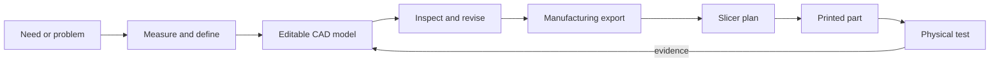

# Topic 2.4 - CAD Fundamentals

> **"CAD is not digital drawing.
> It is a set of instructions for rebuilding your idea exactly."**

---

# Learning Objectives 🎯

By the end of this topic you will be able to:

- Explain what **CAD** does and how it connects design to manufacturing.
- Move around a three-dimensional workspace without accidentally moving the part.
- Use the X, Y and Z axes, an origin and a workplane.
- Build a simple solid from basic shapes or from a flat sketch.
- Use dimensions and constraints so a model changes predictably.
- Explain the difference between a native CAD file and an exported manufacturing file.
- Create, inspect, revise and save your first accurate buggy-related model.

---

# Before We Begin

Imagine asking a friend to make a cardboard box for your battery.

You say, "Make it about this big," while holding your hands apart. Your friend makes a box, but the battery does not fit. The box is too narrow, the cable exit is on the wrong side, and the lid cannot open.

Now imagine giving the same friend a clear set of instructions:

```text
Inside length: 105 mm
Inside width: 36 mm
Inside height: 25 mm
Cable opening: centred on the short end
Opening width: 12 mm
```

Your friend can now rebuild the idea without guessing. If the battery changes, you can update the numbers instead of waving your hands differently.

A CAD model is that kind of instruction set. It stores shapes, sizes, positions and relationships so a computer can rebuild the design. For our buggy, CAD will create trays for the battery (Topic 3.3), electronics mounts, brackets for the steering servo (Topic 3.5), bumpers and adapters that match real parts rather than imagined ones.

The slicer from Topic 2.3 can plan how to print a shape. CAD decides what that shape is.

---

# What CAD Means

**CAD** stands for **computer-aided design**. It means using computer software to create, inspect and change an accurate design.

The computer does not replace your engineering thinking. It helps you express that thinking clearly.

A CAD program can help you:

- create exact geometry
- measure distances and angles
- keep holes aligned
- repeat features evenly
- view a part from any direction
- test whether parts overlap
- revise dimensions without redrawing everything
- export a model for 3D printing or other manufacturing

The word *aided* matters. CAD is a tool, like a ruler or a drill. A clever tool can still make a poor part when the requirement is unclear.



This is the engineering design process from Topic 1.9 with a digital model in the middle.

---

# A Model Is Not Just a Picture

A photograph of a house shows what the house looks like. It does not tell a builder the wall thickness, the size of hidden pipes or the exact position of every window.

An STL file from Topic 2.2 is similar. It describes the outer skin of a shape using triangles. It is useful for slicing, but it has forgotten much of the design story.

A native CAD model can remember things such as:

- this plate is 60 mm long
- this hole is centred
- these two sides are equal
- this edge is horizontal
- this slot stays 8 mm from the end
- this thickness is controlled by one named value

That remembered logic is what makes a CAD model editable.

> Keep the native CAD file.
> An STL is an export, not your master design.

Think of the native file as the editable recipe and the STL as a photograph of the finished cake. You can eat the cake in the photograph with your eyes, but you cannot change its ingredients.

---

# CAD and CAM

You may also hear **CAM**, which means computer-aided manufacturing.

CAD describes the design. CAM plans how a machine will make it.

For our FDM printer:

```text
CAD program -> creates the shape
Slicer      -> plans the manufacturing paths
Printer     -> follows those paths
```

The slicer is a simple form of CAM software.

A model can be correct in CAD and still be printed badly because of slicer settings. A print can also be beautifully made from a badly designed CAD model. The two stages solve different problems.

| Question | Mostly answered in |
|---|---|
| Is the hole in the correct place? | CAD |
| Is the wall thick enough by design? | CAD |
| Which way should the part face on the build plate? | CAD and slicer together |
| How many walls should be printed? | Slicer |
| What nozzle temperature should be used? | Slicer and material profile |
| Did the physical part actually fit? | Measurement and testing |

---

# Choosing a CAD Tool

CAD programs use different buttons, but the useful ideas travel between them. You are learning those ideas, not memorising one screen.

Three sensible beginner routes are:

| Route | Example | Strength | Limitation |
|---|---|---|---|
| Shape-based browser CAD | Tinkercad | Easiest first hour; build with boxes, cylinders and holes | Complex revisions can become awkward |
| Browser-based parametric CAD | Onshape Education | Sketches, constraints, features and professional workflows | Needs an account and internet connection |
| Desktop parametric CAD | FreeCAD | Free, open-source and works without a cloud account | The interface takes longer to learn |

A **shape-based** modeller feels like building with digital blocks. You add solid shapes, overlap them and subtract hole-shapes.

A **parametric** modeller feels more like writing a changeable recipe. You create sketches, add dimensions and constraints, then build features from them.

Both can make useful buggy parts. The parametric approach becomes more powerful when parts need many controlled revisions.

This topic gives two paths for the first digital model:

- **Path A - shape-based CAD**, written around Tinkercad-style tools
- **Path B - sketch-based CAD**, written around tools such as Onshape or FreeCAD

Choose one path for the guided model. You do not need to complete both today.

> **📚 Learn more**
>
> - Tinkercad 3D Design - use its official guided, step-by-step tutorials to practise shapes, holes, workplanes and alignment.
> - Onshape Learning Centre - open the free "CAD Basics" pathway for sketches, constraints and features.
> - FreeCAD Documentation - search "Creating a simple part with PartDesign" for the official beginner workflow.

---

# Digital Workshop Setup

CAD has no hot nozzle, but it still needs sensible setup.

> **⚠️ SAFETY**
>
> Ask a responsible adult before creating an online account or installing software. Use an education or student account when available, and never place your full name, school, address or private information in public file names or models. Download desktop software only from the official source.
>
> **These tools have age rules, and you are probably under them.** Tinkercad requires a parent or teacher to authorise an account for anyone under 13. Onshape requires account holders to be 13 or over. Neither is a reason to give a false birthday - it is a reason for the adult to set the account up in their name and hand it to you. FreeCAD needs no account at all, which is one good reason to choose it.

Find these controls before modelling: Save, Undo, Orbit, Pan, Zoom, named views, units and the model list. Use a mouse when possible, keep drinks away from the keyboard and take a movement break every 25-30 minutes.

The Pause-Plan-Protect routine from Topic 2.1 still works:

```text
Pause:   What am I trying to model?
Plan:    Which measurements and relationships matter?
Protect: Save a revision before a major change.
```

# Looking Around Without Moving the Part

Put a mug on a table. Walk around it. The mug has not moved; only your viewpoint has changed.

CAD uses three camera movements:

- **Orbit** - walk around the object.
- **Pan** - slide your view sideways without turning it.
- **Zoom** - move your viewpoint closer or farther away.

These camera controls do not change the model.

Moving a selected shape is different. That changes the design itself.

> **🤔 Think about it.**
> Put a small object on a table and look at it from the front.
> Now move your head to the side without touching the object.
> Did the object's shape change, or did only the view change?

A common beginner mistake is trying to orbit but dragging the part instead. Before dragging, check what is selected and which mouse button or gesture your software uses. Use Undo immediately when something jumps unexpectedly.

```text
Camera moved -> view changed
Part moved   -> model changed
```

---

# Named Views

Engineering drawings in Topic 1.8 used front, top and side views. CAD gives you the same views, plus an angled **isometric view** that helps you see three faces at once.

| View | Useful for |
|---|---|
| Top | Plan shape, hole spacing and left-right layout |
| Front | Height, width and vertical features |
| Right or side | Length, height and profile shape |
| Isometric | Understanding the whole three-dimensional form |

Use named views whenever the model looks confusing. A perfectly flat top view makes sketching a rectangle easier than fighting an angled view.

> **[F7 comparison array - Figure 2.4.1: one simple mounting plate shown four times: top, front, right and isometric views. The same two mounting holes are highlighted in a contrasting colour in every view, with thin leader lines joining the same hole across the four panels so the reader sees one object, not four objects]**
>
> *Figure 2.4.1 - Four views, one part. The holes do not move - only your viewpoint does.*
>
> *Alt text: A mounting plate shown in top, front, right and isometric views with the same two holes highlighted in each.*

---

# X, Y and Z

A map uses two directions: across and up the page. A three-dimensional model needs a third direction for height.

CAD normally names the directions:

```text
X -> left and right
Y -> forwards and backwards
Z -> up and down
```

The colours vary by program, so read the axis labels rather than memorising colours.

The point where X, Y and Z are all zero is the **origin**. It is the model's permanent reference corner or centre.

Remember the datum analogy from Topic 1.5: everyone measures height from the same floor. The origin is the shared floor for CAD coordinates.

A **coordinate** tells you a position by its distance along the axes. For example:

```text
X = 20 mm
Y = 10 mm
Z = 0 mm
```

This means the point sits 20 mm along X, 10 mm along Y and on the base level. You do not need to type coordinates for every feature, but you should understand what they mean.

> **[F1 annotated screenshot - Figure 2.4.2: a CAD viewport with the origin marked at the centre and the three axes drawn as coloured arrows: X to the right, Y away from the viewer, Z upward. A small plate sits on the origin. A point on the plate is called out with its coordinates, and a corner inset shows the same axis trio as it appears in the navigation cube]**
>
> *Figure 2.4.2 - Every position in the model is measured from one fixed point - the origin - along these three directions.*
>
> *Alt text: CAD viewport showing the origin and X, Y and Z axes as coloured arrows with a plate positioned on them.*

---

# Workplanes

Try drawing a square in the air. Your finger moves, but there is no surface to hold the drawing.

CAD solves this with a **workplane**: a flat surface on which you place shapes or draw a sketch. It is digital graph paper.

The three main starting planes are usually:

- XY - often the top or base plane
- XZ - often the front plane
- YZ - often the side plane

The exact naming of "front" depends on the program. The important question is not which plane sounds correct. It is which plane gives you the clearest starting shape.

For a flat mounting plate, start on the plane that shows the plate's length and width. Then add thickness away from that plane.

For a side bracket shaped like the letter L, the side plane may show the most useful outline.

> Choose the workplane that shows the part's clearest silhouette.

> **[F2 cross-section - Figure 2.4.3: a solid bracket drawn semi-transparent, with three flat planes passing through it: one horizontal at the base, one vertical front-to-back, and one on an angled face of the part. A sketch rectangle is drawn on each plane, showing that a sketch always lies flat on the plane it belongs to. The clearest silhouette plane is highlighted]**
>
> *Figure 2.4.3 - A sketch always lies flat on its plane - so choosing the plane decides what shape you are able to draw.*
>
> *Alt text: A semi-transparent bracket with three workplanes passing through it, each carrying a flat sketch.*

---

# Units First

A number without a unit is a trap. A plate that is 60 could mean 60 mm, 60 cm or 60 inches.

For this handbook, use **millimetres** for buggy parts. Check the document units before modelling.

```text
Buggy mechanical parts -> millimetres
Angles                  -> degrees
```

Do not scale a finished model by 25.4 just because inches were selected accidentally. Correct the units and rebuild or convert carefully while the model is still simple.

A 1 mm mistake can be larger than the clearance in a bearing seat. Topic 1.7 already showed why exact-looking numbers still need tolerances. CAD does not remove that reality.

---

> **☕ Good place to pause.**
> Practise orbit, pan, zoom and the named views now.
> The next section explains how CAD turns flat ideas into solid parts.

---

# Two Ways to Build a Solid

Most beginner mechanical CAD work follows one of two routes.

## Route 1 - Combine Simple Solids

Imagine building a castle from wooden blocks. A box becomes the wall. A cylinder becomes a tower. Another cylinder, marked as a hole, removes material for a doorway.

Shape-based CAD uses this idea. Engineers call adding and subtracting solid shapes **Boolean operations**. The name comes from mathematical logic, but the actions are simple:

```text
Add       -> join solids together
Subtract  -> remove one shape from another
Intersect -> keep only the overlapping region
```

Tinkercad's Solid, Hole and Group tools are examples of this method.

## Route 2 - Sketch and Create Features

Imagine drawing the end shape of a biscuit cutter, then pushing that shape through dough. The flat outline controls the solid that appears.

Sketch-based CAD usually works like this:

```text
Choose plane -> draw sketch -> constrain and dimension
-> create 3D feature -> add another sketch -> create another feature
```

A rectangle can be extruded into a plate. A circle on the plate can be cut through it to make a hole. A second rectangle can add a raised block.

These steps form a model history that can be edited later.

Neither route is fake CAD. They are two ways to describe geometry.

---

# Sketches: Flat Instructions

A **sketch** is a controlled two-dimensional drawing used to create or position three-dimensional features. It may contain:

- points
- straight lines
- circles
- arcs
- rectangles
- construction lines
- dimensions
- constraints

A sketch is not an artistic drawing. It is a geometric instruction.

To create a solid by extrusion, the sketch normally needs a closed outline with no gaps. Imagine filling the shape with paint. If the paint would leak through a tiny gap, the profile is open. If the paint stays inside, the profile is closed.

```text
Closed rectangle -> can become a solid plate
Three-sided box  -> cannot enclose a solid area
Circle with a gap -> not a closed profile
```

Tiny gaps are hard to see. When an extrusion fails, zoom in and inspect every corner before blaming the software.

---

# Dimensions: Exact Size

Drag a rectangle with the mouse and it may look correct. Looking correct is not an engineering requirement.

A **dimension** gives geometry an exact size or position. You met dimensions in Topic 1.8. In CAD, they are not only labels; they can control the model.

Examples:

```text
Plate length = 60 mm
Plate width  = 30 mm
Hole diameter = 4.0 mm
Hole centre from end = 10 mm
```

Use as few important dimensions as possible while still defining the design. A crowded sketch is harder to understand and easier to contradict.

Good dimensions describe what matters:

- overall size
- feature size
- location from a clear datum
- spacing between repeated features
- angles that control function

Weak dimensions describe a chain of accidental mouse positions.

Remember tolerance stack-up from Topic 1.7. Dimensioning every hole from the previous hole can allow small errors to build along the row. Dimension important positions from one shared datum when possible.

---

# Constraints: Rules Between Shapes

Draw a rectangle by hand. Its sides look horizontal and vertical, but a computer only sees four lines unless you give it rules.

A **constraint** is a rule that controls a geometric relationship. Common sketch constraints include:

| Constraint | Rule it creates |
|---|---|
| Horizontal | A line stays level |
| Vertical | A line stays upright |
| Coincident | Two points stay joined |
| Parallel | Two lines keep the same direction |
| Perpendicular | Two lines meet at 90° |
| Equal | Two lengths or radii stay equal |
| Concentric | Circles or arcs share one centre |
| Symmetric | Geometry mirrors around a centreline |
| Tangent | A line or curve touches smoothly without a corner |

Shape-based CAD may not use sketch constraints by name. It still uses similar ideas through Align, Mirror, Group and exact size fields.

The point is not the button. The point is the rule.

> A dimension says "how much".
> A constraint says "what relationship must stay true".

---

# Design Intent

Suppose a plate has a hole that should always stay in the middle.

You could place it by eye. It is centred only until the plate changes size.

You could type its X position as 30 mm on a 60 mm plate. It is centred only while the plate remains 60 mm long.

Or you could tell CAD:

```text
The hole centre is symmetric between the two end edges.
```

Now the hole stays centred when the plate becomes 70 mm long. The reason behind how a model should behave is called **design intent**. Design intent answers questions such as:

- Should this hole stay centred?
- Should these two walls remain equal?
- Should this slot stay a fixed distance from the edge?
- Should changing one thickness update several connected features?
- Which dimension represents the real requirement?

A strong CAD model captures these answers. A weak model captures only today's shape.

> **🤔 Think about it.**
> Draw a rectangle on paper and place a dot "in the middle" by eye.
> Now imagine the rectangle becomes twice as wide.
> Which instruction survives the change better: "dot at 30 mm" or "dot centred between the ends"?

This is why constraints matter. They make the model remember the reason, not only the result.

> **[F3 right-versus-wrong array - Figure 2.4.4: two panels showing models that look identical at first. Left, wrong: an unconstrained sketch where the hole was simply dragged into place; when the plate is widened, the hole stays where it was and ends up off-centre. Right, correct: the hole is constrained to the centre; widening the plate moves the hole with it. Both panels show a before-and-after of the same width change]**
>
> *Figure 2.4.4 - Both models look the same until something changes - then the one that recorded the reason survives the edit.*
>
> *Alt text: Two panels comparing an unconstrained hole that drifts off-centre when the plate is widened with a constrained hole that stays centred.*

---

# Under-Defined, Fully Defined and Over-Defined

In sketch-based CAD, geometry can have three useful states.

## Under-Defined

Something can still move, rotate or change size.

Imagine a noticeboard pinned with one drawing pin. The paper can still spin.

An under-defined sketch is not automatically wrong. It may be a quick early idea. But accidental movement becomes more likely.

## Fully Defined

Every important movement and size has been controlled.

The noticeboard paper now has enough pins to hold its intended position. Changing a named dimension still changes it deliberately.

## Over-Defined

Two or more rules fight or repeat the same information.

You tell CAD that a line must be 30 mm long, then add another rule that forces it to 35 mm. The software cannot satisfy both.

When the program reports a conflict:

1. Stop adding constraints.
2. Read which dimensions or rules are highlighted.
3. Remove the repeated or contradictory rule.
4. Add only the relationship the design actually needs.

More constraints are not always better. Correct constraints are better.

---

# Extrusion: Giving a Sketch Thickness

Roll pastry flat and press a star-shaped cutter into it. The star outline continues through the thickness of the pastry.

An **extrusion** takes a flat profile and extends it in a straight direction to create or remove material.

```text
Rectangle + 4 mm extrusion -> flat plate
Circle + through cut       -> hole
L-shape + 20 mm extrusion  -> bracket body
```

Different programs use names such as:

- Extrude
- Pad for adding material
- Pocket for removing material

The idea is the same.

> **[Signature visual, F4 sequence strip - Figure 2.4.5: four panels reading left to right. Panel 1: a rectangle sketch on the origin, fully dimensioned 60 x 30 mm, constraint symbols visible. Panel 2: the same sketch extruded upward into a solid plate. Panel 3: two holes cut through, dimensioned from the same origin. Panel 4: the 60 mm dimension edited to 70 mm - the plate grows, the holes stay correctly placed, and a callout reads: nothing had to be redrawn]**
>
> *Figure 2.4.5 - This is the whole promise of parametric CAD: change one number, and everything that depended on it updates itself.*
>
> *Alt text: Four panels showing a dimensioned sketch, an extrusion, two holes, and the part correctly updating when one dimension changes.*

The sketch controls the outline. The extrusion controls the depth. Keep those jobs separate in your mind.

> **[F4 sequence strip - Figure 2.4.6: three panels. Panel 1: a flat closed sketch profile lying on a workplane. Panel 2: the same profile part-way through being pulled upward, shown mid-extrusion with a ghosted outline and a height dimension. Panel 3: the finished solid. Beneath, a second short row shows the same profile used to cut instead of add, removing material from a block]**
>
> *Figure 2.4.6 - One profile, two jobs: pulled outward it adds material, pushed inward it removes it.*
>
> *Alt text: Three panels showing a flat profile extruded into a solid, and a second row showing the same profile cutting into a block.*

---

# Features and Feature History

A **feature** is one modelling operation that creates or changes geometry. Examples include:

- extrusion
- cut
- hole
- fillet
- chamfer
- mirror
- pattern

Sketch-based CAD normally records features in order. This ordered record is the **feature history** or feature tree.

```text
1. Base sketch
2. Base extrusion
3. Hole sketch
4. Hole cut
5. Edge fillet
```

The order matters. A fillet cannot round an edge that does not exist yet. A hole attached to a face may fail if an earlier edit removes that face.

Think of the feature history as cooking instructions. "Bake the cake" must come before "spread icing on the cake".

Name important sketches and features when the software allows it:

```text
Weak: Sketch003
Better: Battery outline

Weak: Extrude006
Better: Base thickness
```

Clear names turn future repairs into reading instead of archaeology.

> **[F1 annotated screenshot - Figure 2.4.7: a CAD feature history panel down the left side, listing features in order with clear names such as base plate sketch, base extrude, mounting holes, cable slot and edge fillets. An arrow shows the reader clicking an early feature to edit it, and the model on the right updates. A second version of the same panel beside it shows unhelpful default names such as Sketch1, Pad, Pocket, Fillet001]**
>
> *Figure 2.4.7 - The history is a list of your own decisions - named well, it becomes instructions for the next you.*
>
> *Alt text: A CAD feature history panel with clearly named features beside a version using default names such as Sketch1 and Pad.*

---

# Parameters: Numbers with Jobs

A **parameter** is a named value that controls part of the design. Instead of remembering that 36 mm happens to be the tray width, name the reason:

```text
battery_width = 34 mm
side_clearance = 1 mm
tray_inside_width = battery_width + 2 × side_clearance
```

## Worked Example - Battery Tray Width

**Question:** What inside width should a tray have for a 34 mm battery with 1 mm clearance on each side? **Known values:**

```text
Battery width = 34 mm
Clearance per side = 1 mm
Number of sides = 2
```

**Rule:**

```text
Tray inside width = battery width + 2 × side clearance
```

**Calculation:**

```text
Tray inside width = 34 mm + 2 × 1 mm
                  = 34 mm + 2 mm
                  = 36 mm
```

**Meaning:** A 36 mm inside width gives the battery 1 mm of space on its left and 1 mm on its right. The final printed fit must still be checked because Topic 1.7 taught us that printer error and material behaviour affect real size.

Parameters are powerful because one measured change can update several connected features. Do not create a named parameter for every tiny number on your first model. Name values that represent real requirements or repeated choices.

---

# Symmetry, Mirrors and Patterns

Buggy parts often have repeated geometry:

- left and right mounting holes
- four wheel-hub bolt positions
- ventilation slots
- mirrored side walls

Drawing each copy separately invites mismatch. Use rules that express the repetition.

Mirror copies geometry across a centreline or plane. Pattern repeats a feature by a spacing, direction or angle.

```text
Good intent: two holes mirrored around the plate centreline
Weak intent: two circles dragged until they look similar
```

The same rule appeared in Topic 1.8. Symmetry reduces the number of dimensions needed and makes drawings easier to inspect.

Do not mirror something merely because the model looks balanced. Real buggy parts may need an offset for wires, gears or access. Symmetry is a design choice, not decoration.

---

# Build Function Before Detail

Whether you use shape blocks or sketches, most simple parts follow the same story:

```text
Create the main material
Add required supports or walls
Remove space for screws, components and wires
Finish selected edges last
```

For a servo mount (the servo is the motor that steers the front wheels - Topic 3.5), make the base and upright walls before cutting screw holes and the servo opening. Start with the packaging envelope from Topic 1.5: the component plus room for wires, fasteners, movement and access.

A circle on a face becomes a useful hole only when you decide its size, position and depth. Ask what passes through it, which datum locates it, whether it is a clearance or locating fit, and whether the printer can make it in the chosen orientation. Use the fit library from Topic 1.7 rather than scaling the whole part to repair one hole.

Edge rounding creates a curved edge, while chamfers cut flat slopes across edges. Both can guide assembly, reduce sharp corners and improve printability, but add them after the main dimensions, holes and clearances work.

```text
Function first -> fit second -> printability third -> appearance last
```

# The Native File and the Export

A **native file** is the editable design saved in the CAD program's own format or cloud document. It keeps as much design history as that program supports.

A neutral file is made for sharing geometry between different CAD programs. A common example is **STEP**. It usually carries solid geometry better than STL, but may not preserve your full feature history.

For this project, keep three useful forms when possible:

| File | Keep it for |
|---|---|
| Native CAD file or cloud document | Editing dimensions, constraints and features |
| STEP export | Sharing accurate solid geometry between CAD systems |
| 3MF or STL export | Sending a printable shape to the slicer |

The manufacturing export should never be your only copy. Use clear names:

```text
Servo-Mount_V0.1_native
Servo-Mount_V0.1.step
Servo-Mount_V0.1.3mf
```

The file extension will depend on the software. The name should still say what the part is and which revision it belongs to.

> **📚 Learn more**
>
> - Onshape Learning Centre: search "CAD Basics" - the free pathway through sketches, constraints and features, taught by the people who wrote the software
> - FreeCAD documentation: search "Creating a simple part with PartDesign" - the official beginner walkthrough, and no account needed to follow it

> **[F7 comparison array - Figure 2.4.8: three file cards side by side. Card 1, the native CAD file: shown with its full feature tree and editable dimensions. Card 2, a STEP file: solid geometry preserved, but the feature tree greyed out. Card 3, an STL: a mesh of triangles only, dimensions gone. Under each, what you can still change, and what has been lost for good]**
>
> *Figure 2.4.8 - Each export throws something away, and only the native file keeps the reasons behind the shape.*
>
> *Alt text: Three cards comparing a native CAD file, a STEP file and an STL by what each format preserves and loses.*

---

# Save Revisions, Not Mystery Copies

Bad file history looks like this:

```text
mount.stl
mount-new.stl
mount-new2.stl
mount-final.stl
mount-final-REAL.stl
```

Good revision history explains the change:

```text
Servo-Mount_V0.1 - first measured model
Servo-Mount_V0.2 - hole spacing corrected
Servo-Mount_V0.3 - cable clearance added
```

A **revision** is a documented design change. A project **version** is a larger working stage, such as the cardboard car or the radio-controlled prototype.

Before a major change:

1. Save or duplicate the current revision.
2. Write what you intend to change.
3. Change one main idea.
4. Inspect the result.
5. Record what the evidence says.

This keeps decisions reversible, following the guiding principles.

---

> **☕ Good place to pause.**
> You now know the language of a CAD model.
> The next section turns those ideas into one small, accurate part.

> **[F3 right-versus-wrong array - Figure 2.4.9: two folder listings side by side. Left, wrong: files named plate, plate2, plate-final, plate-final-REAL, plate-new2, with no dates and no way to tell which is current. Right, correct: files named buggy-plate-rev-A, buggy-plate-rev-B, buggy-plate-rev-C, each with a one-line note beside it saying what changed]**
>
> *Figure 2.4.9 - Mystery copies cost you the one thing revisions are for: knowing what changed and why.*
>
> *Alt text: Two folder listings comparing vague duplicate file names with a clear sequence of named revisions.*

---

# Your First CAD Part - A Two-Hole Mounting Plate

You will model a simple plate that could become a cable-guide base, sensor mount or test coupon on the buggy.

The part is intentionally plain. Plain parts reveal whether your workflow is correct.

## Part Requirement

Create one solid plate with:

```text
Length: 60 mm
Width: 30 mm
Thickness: 4 mm
Two holes: Ø4 mm through
Hole centres: 10 mm from each short end
Both holes: centred across the 30 mm width
```

The hole-centre spacing is therefore:

```text
60 mm - 10 mm - 10 mm = 40 mm
```

The signature requirement is not merely "two holes". It is that both holes stay centred if the plate width changes.

> **[F6 measured drawing - Figure 2.4.10: a dimensioned top view of a 60 x 30 mm plate with two 4 mm diameter holes. Every dimension runs from the same left edge and the same bottom edge, in the baseline style from Topic 1.8. Hole centres are called out at 10 mm and 50 mm from the left edge and 15 mm from the bottom. Overall sizes sit outside the outline]**
>
> *Figure 2.4.10 - Every dimension starts from the same two edges, so one error cannot cascade into the next.*
>
> *Alt text: Dimensioned top view of a plate with two holes, all dimensions measured from a common left and bottom edge.*

---

# Before You Model

Write these five lines in your notebook:

```text
Part: Two-hole mounting plate
Purpose: First controlled CAD model
Datum: Plate centre and base face
Critical dimensions: 60 × 30 × 4 mm, Ø4 holes, 40 mm spacing
Expected change: Width may change; holes must stay centred
```

This is design intent before software. Check:

- document units are millimetres
- the file has a useful name
- you know how to Undo
- you know how to save
- you can reach top and isometric views

Then choose Path A or Path B.

---

# Path A - Shape-Based CAD

Use this path in Tinkercad or a similar modeller that builds from solid and hole shapes. Button names may differ slightly.

## Step 1 - Create the Base

1. Place a box on the main workplane.
2. Set its exact size to `60 × 30 × 4 mm`.
3. Make sure its bottom sits on the workplane.
4. Rename it `Base plate` if the software supports names.

Do not resize by eye. Type the dimensions.

## Step 2 - Create the First Hole Tool

1. Place a cylinder on the workplane.
2. Change it from Solid to Hole.
3. Set its diameter to `4 mm`.
4. Make its height greater than the plate thickness, such as `8 mm`.

A cutting shape should pass completely through the material. If it ends exactly on a face, tiny placement errors can leave a paper-thin skin.

## Step 3 - Centre the Hole Across the Width

Select the base and the hole cylinder. Use Align so their centres match across the plate's 30 mm width.

Do not centre them along the 60 mm length. The hole belongs 10 mm from one end, not in the middle of the plate.

## Step 4 - Position from the End Datum

Set the hole centre 10 mm from the left short end. How this is entered varies by tool. You may use:

- a ruler or coordinate tool
- a temporary 10 mm reference block
- exact movement fields

Check the position in top view.

## Step 5 - Duplicate for the Second Hole

Duplicate the hole cylinder. Move the copy 40 mm along the plate length. The two centres should now be 40 mm apart.

A mirror tool is even better when available because it records the symmetry more clearly.

## Step 6 - Subtract the Holes

Select the base and both hole cylinders. Group or subtract them.

Orbit underneath the part. Confirm both holes pass through completely.

## Step 7 - Test the Design Intent

Change the plate width from 30 mm to 36 mm. Ask:

- Did the holes remain centred?
- If not, which alignment relationship was lost?
- Can you repair the model without guessing?

Shape-based modelling may require you to realign features after changes. That is useful evidence about the method's limits.

Return the width to 30 mm when the test is complete.

---

# Path B - Sketch-Based CAD

Use this path in Onshape, FreeCAD or another parametric solid modeller. Terms may differ, but the logic should match.

## Step 1 - Create a Part Document

1. Create a new part or Part Studio.
2. Confirm millimetres are active.
3. Rename the document `Two-Hole-Mounting-Plate_V0.1`.
4. Choose the plane that shows plate length and width.

## Step 2 - Sketch the Base Rectangle

1. Start a sketch on the chosen base plane.
2. Draw a centre rectangle around the origin if the tool has one.
3. Constrain its centre to the origin.
4. Dimension the overall length as `60 mm`.
5. Dimension the overall width as `30 mm`.

A centred rectangle makes later symmetry easier.

If you use a corner rectangle instead, constrain one corner or the rectangle centre deliberately. Do not leave the whole shape floating.

## Step 3 - Inspect the Sketch State

Try gently dragging a corner or line.

- If the rectangle changes size, a dimension is missing.
- If the whole rectangle moves, its position is not fixed.
- If nothing unintended moves, the base sketch is controlled.

Do not add random constraints merely to make a warning disappear. Understand what movement remains.

## Step 4 - Extrude the Base

Finish the sketch. Extrude or Pad it by `4 mm` to create a solid plate.

Rename the feature `Base thickness`. Orbit the model and confirm:

- one solid exists
- the base is rectangular
- the thickness is 4 mm

## Step 5 - Sketch the Holes

1. Select the top face of the plate.
2. Start a new sketch.
3. Draw a construction centreline along the plate's length.
4. Draw two circles with their centres on that line.
5. Set both circle diameters to `4 mm`, or constrain the radii equal and dimension one circle.
6. Dimension each circle centre 10 mm from its nearest short end.

Alternative design intent:

- position one circle 20 mm from the plate centre
- mirror it across the centre plane

Both methods produce 40 mm spacing. The mirror method expresses symmetry more directly.

## Step 6 - Cut Through

Finish the sketch. Use a Cut, Pocket or Remove extrusion. Choose `Through all` when available.

Rename the feature `Mounting holes`.

## Step 7 - Test the Design Intent

Edit the base width from 30 mm to 36 mm. Rebuild the model.

The holes should remain on the width centreline. If they move away from the centre, inspect the hole sketch constraints.

Return the width to 30 mm after the test.

## Step 8 - Read the Feature History

Your history should tell a short story:

```text
Base sketch
Base thickness
Hole sketch
Mounting holes
```

Select each item and identify what it controls. That is the beginning of model debugging.

---

# Inspect Before Exporting

A correct-looking isometric view is not enough. Use an inspection routine.

## Geometry Check

- Is there one intended solid?
- Do both holes pass through?
- Are any tiny unwanted slivers present?
- Are the holes circular and equal?

## Dimension Check

Measure in CAD:

```text
Overall length = 60 mm
Overall width = 30 mm
Overall thickness = 4 mm
Hole diameter = 4 mm
Hole-centre spacing = 40 mm
```

## View Check

Inspect:

- top
- front
- side
- underside
- isometric

The underside view catches cuts that stopped too early.

## Design-Intent Check

Change one planned value temporarily:

```text
Width: 30 mm -> 36 mm
```

Do the holes remain centred? Then Undo or restore 30 mm.

## Manufacturing Check

Ask:

- Which face will sit on the build plate?
- Will the holes print in a sensible direction?
- Does the part need support?
- Is the wall around each hole wide enough for the expected load?
- Should this be a coupon before becoming part of a larger mount?

For this flat plate, the largest face should normally sit on the build plate. The print should need no support.

---

# Export Without Losing the Design

Save the native model first. Then export:

- STEP if you want a transferable solid model
- 3MF or STL for the slicer, depending on your workflow

Use millimetres and confirm the exported scale in the slicer.

Open the export in the slicer from Topic 2.3. Check the displayed dimensions before slicing:

```text
60 × 30 × 4 mm
```

If the slicer shows a giant or microscopic plate, stop. Do not fix an unknown unit problem by dragging the scale until it looks right. Return to CAD and check units or export settings.

Save the slicer project separately. The CAD model and slicer project have different jobs.

---

# A First Print Is Optional

Printing the plate is useful only when it answers a question: did the export keep its scale, do the Ø4 mm holes fit, and does the plate remain flat? If hole fit is the only uncertainty, print a smaller coupon instead of the whole plate.

> **⚠️ SAFETY**
>
> Ask a responsible adult to supervise the print and first-layer check. Follow all hot-nozzle, heated-bed, moving-machine and ventilation rules from Topics 2.1-2.3.

Record the CAD revision and slicer profile with the result.

# Troubleshooting the First Model

| Symptom | Likely cause | First useful action |
|---|---|---|
| Rectangle will not extrude | Sketch profile is open | Zoom into every corner and close gaps |
| Sketch slides around | Position is under-defined | Constrain it to the origin or a clear datum |
| CAD reports conflicting constraints | Same idea was controlled twice, or rules disagree | Remove the repeated or contradictory rule |
| Hole does not pass through | Cut depth is too short | Use Through all or extend the cutting shape past the base |
| Hole moves when width changes | Centre relationship was not captured | Add centreline symmetry, alignment or a formula |
| Export has the wrong size in the slicer | Units or export scale are wrong | Check document units and re-export |
| Model becomes difficult to edit | Too many unnamed shapes or features | Rename important items and simplify the history |
| Fillet fails after a revision | The selected edge changed or vanished | Suppress the fillet, repair main geometry, then reapply it |
| Imported STL cannot be edited easily | It contains surface triangles, not your original design history | Return to the native CAD model |

When something fails, find the earliest feature that is wrong. Later features often fail only because they depend on that earlier mistake.

```text
First wrong feature -> likely cause
Last red warning    -> often only the victim
```

---

> **☕ Good place to pause.**
> Save your model, stand up and look away from the screen.
> The remaining activities turn CAD ideas into habits you can test without expensive equipment.

---

# Hands-On Activity 1 - Human Coordinates

*No computer or special equipment needed.*

Choose one corner of a room as the origin. Pretend:

```text
X runs along one wall
Y runs along the other wall
Z runs upwards
```

Point to three objects and describe their approximate positions. For example:

```text
Chair: 2 steps in X, 3 steps in Y, floor level
Shelf: 1 step in X, 4 steps in Y, 5 hand-widths in Z
```

Now ask another person to stand at a coordinate you call out.

The measurements do not need to be accurate. The activity teaches the bigger idea: every position needs a shared origin, directions and units.

**Reflection:** What would happen if the other person chose a different corner as the origin without telling you? That is why CAD datums and drawing datums must be shared.

---

# Hands-On Activity 2 - The Constraint Puzzle

*You need: paper and pencil. A ruler is an optional upgrade.* Draw a rough four-sided shape that looks almost like a rectangle. Now add rules one at a time:

1. Top and bottom are horizontal.
2. Left and right are vertical.
3. Every corner is joined.
4. Opposite sides are equal.
5. Width is 60 mm.
6. Height is 30 mm.
7. The centre sits on a marked origin.

After each rule, ask what movement is still possible.

- Could the shape slide?
- Could it rotate?
- Could it become wider?
- Could one corner separate?

Then draw two circles and create a rule set that keeps them:

- equal in diameter
- on the width centreline
- mirrored around the plate centre

**Reflection:** Circle the rules that describe size and underline the rules that describe relationships. The circled rules are dimensions. The underlined rules are constraints.

---

# Hands-On Activity 3 - Build the Two-Hole Plate

*Computer with a CAD program needed. No printer needed.* Complete Path A or Path B from this topic. When the model is finished:

1. Save the native file as revision V0.1.
2. Capture a top-view screenshot.
3. Capture an isometric screenshot.
4. Measure the five critical values in CAD.
5. Change the width to 36 mm and test whether the holes stay centred.
6. Return the width to 30 mm.
7. Export STEP and 3MF or STL when your software supports them.
8. Open the printable export in the slicer and confirm `60 × 30 × 4 mm`.

Write one sentence in your notebook:

```text
My model's design intent is ________________________________.
```

A strong answer names the relationship, not merely the shape.

---

# Hands-On Activity 4 - Revision Experiment

*Computer with your saved model needed.*

Save an experiment copy. Change the plate length, remove one centring rule and observe what breaks, using Undo after each test. Identify the earliest feature or relationship that caused the later problem.

**Reflection:** Which rule protected the design when a dimension changed?

# Thinking Like an Engineer - Model the Reason

Two models can make the same printed shape today. Only one may be easy to change tomorrow.

Imagine two battery trays: **Model A** uses many fixed positions measured from random edges. **Model B** uses named battery width, side clearance, wall thickness and a centre plane.

Both fit the current battery. Then the battery supplier changes the pack width from 34 mm to 36 mm.

Model A needs several separate edits and may leave one feature behind. Model B changes one parameter and rebuilds the connected geometry.

The time saved is useful, but the bigger advantage is trust. A model that captures the reason for each relationship is easier to inspect.

Professional CAD is not mainly about making complicated shapes. It is about making controlled decisions visible.

---

# Topic Mini Project - Dimension-Driven Workshop Phone Stand 🛠️

Your phone or small tablet often shows the handbook, CAD instructions or a printer camera while your hands are busy. You will build a keepable cardboard stand using CAD thinking before opening CAD.

The stand will be designed from measurements and relationships rather than copied by eye. It becomes a useful tool for your workshop and a physical reminder that a good model begins with requirements.

## What You Will Build

A small stand with:

- one base
- one angled back support
- one front stop
- two equal side braces

The width adapts to the device. The side braces mirror each other. The back angle can be revised after testing.

## Materials

Use household or scrap materials only:

- corrugated cardboard from a delivery box
- thinner cereal-box card for templates
- paper
- pencil
- ruler
- tape or glue
- scissors
- the phone or small device to be supported
- optional rubber band for extra grip

No printer, calipers or bought parts are required.

> **⚠️ SAFETY**
>
> Show a responsible adult or guardian what you plan to build before starting, and build with them nearby.
> Use scissors carefully and cut away from your body.
> If thick card needs a craft knife, an adult must make those cuts on a cutting mat; never cut towards a hand holding the card.
> Keep glue away from eyes and follow its label.
> Test the stand over a table or soft surface before trusting it with a valuable device.

> **🎬 Watch the build**
>
> - Science Buddies - search "Design a Cell Phone Stand" for a photographed engineering-design activity using cardboard.
> - Instructables - search "Simple, But Elegant Cardboard Phone Stand" to see common stand shapes and braces, with an adult.
> - Tinkercad 3D Design - use the official beginner tutorials if you later model your stand digitally.

## Step 1 - Write the Requirement

Write:

```text
The stand must hold my device upright on a table,
allow me to see the screen,
and remain stable when I tap the screen gently.
```

Add one personal requirement. Examples:

- charging cable must stay connected
- device must work in portrait and landscape
- stand must fold flat
- camera must remain uncovered

## Step 2 - Measure the Device

Use a ruler. Record:

```text
Device width W = ______ mm
Device thickness T = ______ mm
Device height H = ______ mm
```

A ruler is accurate enough for this cardboard prototype. The stand is proving layout and function, not a precision fit.

## Step 3 - Create the Parameters

Use these starting rules:

```text
Stand width = W + 20 mm
Base depth = 100 mm
Back height = about 0.7 × H, or at least 90 mm
Front-stop height = T + 12 mm
Side braces = equal and mirrored
```

A phone 75 mm wide gives:

```text
Stand width = 75 mm + 20 mm = 95 mm
```

The extra 10 mm on each side gives space for the device and uneven cardboard edges.

## Step 4 - Draw the Parts

On paper or cereal-box card, draw:

1. **Base:** stand width × 100 mm.
2. **Back:** stand width × chosen back height.
3. **Front stop:** stand width × front-stop height.
4. **Side brace:** one triangle that connects base and back.

Cut only the paper templates first. Tape them together loosely and place the device against them.

This is the cheapest valid prototype.

## Step 5 - Choose the Viewing Angle

Try three back angles:

```text
Nearly upright
Medium lean
Large lean
```

Do not chase an exact degree measurement unless you have a protractor. Choose the angle that gives:

- a clear screen
- stable balance
- easy tapping
- cable access

Mark the chosen brace shape.

## Step 6 - Capture Symmetry

Trace the same side-brace template twice. Do not draw the second brace separately.

This is a physical mirror operation. The two sides will match because they share one source geometry.

Label the original template:

```text
MASTER SIDE BRACE - DO NOT GLUE
```

Keep it for revisions.

## Step 7 - Transfer to Cardboard

Trace the approved templates onto corrugated cardboard. Keep the corrugation direction the same on both braces.

Ask the adult to help with any difficult cuts. Cut the base, back, stop and two braces.

## Step 8 - Assemble Reversibly

Tape the back to the base first. Tape the front stop in place. Attach the two side braces.

Use tape before permanent glue. This follows the guiding principle to prefer reversible decisions.

Check that both braces touch the same reference edges. Those edges are your physical datums.

## Step 9 - Test

Place the stand on a table or soft surface. Load the device carefully.

Test:

1. Does the stand remain upright for 30 seconds?
2. Can you tap the screen gently without tipping it?
3. Can the charging cable connect?
4. Can you remove the device easily?
5. Do both braces carry the back evenly?

Record Pass or Revise for each question.

## Step 10 - Make One Revision

Change one feature only. Examples:

- increase base depth by 20 mm
- reduce the back angle
- raise the front stop
- cut a centred cable opening
- widen the stand for landscape use

Write:

```text
Revision V0.2
Change:
Reason:
Result:
```

Then retest.

## Step 11 - Label the CAD Ideas

On the finished stand or a small card beside it, label:

- **datum** - the base surface or centreline you measured from
- **dimension** - one exact size
- **constraint** - the two side braces must be equal
- **parameter** - device width W
- **feature** - front stop or cable opening
- **revision** - the controlled change after testing

Your stand has no digital feature tree. The labelled templates and build order are its physical history.

## Step 12 - Keep the Artifact

Place the stand on your showcase shelf or use it beside the printer. Keep the master brace template and the V0.2 note with it.

A finished object is useful. A finished object with its design evidence is engineering.

---

# Stop Point Before More Software

You now need only the ability to navigate, use millimetres, create and size geometry, place features from a datum, save the native source, export a manufacturing file and revise one important dimension. Stop before installing plug-ins, learning advanced surfaces or buying a more powerful computer. The next learning problem is designing simple parts from real requirements.

# Common Beginner Mistakes ❌

## Mistake 1 - Modelling before measuring

The screen makes invention feel productive. A beautiful battery tray based on a guessed battery size is still wrong.

## Mistake 2 - Dragging until it looks right

Mouse movement creates approximate geometry. Use exact dimensions for engineering features.

## Mistake 3 - Confusing camera movement with part movement

The view should orbit around the part. If the part changes position, Undo and learn the correct control.

## Mistake 4 - Leaving geometry floating

An under-defined sketch or unaligned shape can shift during later edits. Anchor it to the origin, a centreline or a clear datum.

## Mistake 5 - Adding every possible constraint

Repeated rules can conflict. Use the smallest clear set that captures the design intent.

## Mistake 6 - Drawing repeated features separately

Separate copies drift apart during revisions. Use equal, mirror, align or pattern relationships.

## Mistake 7 - Rounding edges before the main shape works

Early edge details make revisions fragile. Build function and fit first.

## Mistake 8 - Editing an STL as though it were the master model

The triangle skin has lost much of the original design logic. Return to the native CAD file.

> **[F3 right-versus-wrong array - Figure 2.4.11: eight compact rows of paired panels, one per mistake above, consistent viewing angle within each pair. Examples: a sketch dragged roughly into place beside one properly constrained; a model built with no origin reference beside one anchored to it; a wall thickness guessed beside one measured from the real component; a hole placed by eye beside one dimensioned from a datum; an STL opened for editing beside the native file being edited and re-exported]**
>
> *Figure 2.4.11 - Every pair is the same part modelled twice - the right-hand version survives its first design change.*
>
> *Alt text: Eight right-versus-wrong pairs covering constraints, origin use, measured dimensions, datums, naming, units and editing STLs instead of the native file.*

# Topic Summary 📝

In this topic we learned that:

- **CAD** is computer-aided design: software helps you create and revise accurate engineering geometry.
- A native CAD model is an editable instruction set, while an STL is mainly a triangle skin for manufacturing.
- CAD defines the shape; CAM tools such as the slicer plan how a machine will make it.
- Orbit, pan and zoom move the camera, while transforms move or resize the actual model.
- X, Y and Z describe three-dimensional directions; the origin is the shared reference point.
- A workplane is digital graph paper on which shapes or sketches begin.
- Shape-based CAD combines solids and hole-shapes; parametric CAD builds features from sketches, dimensions and constraints.
- A closed sketch profile can be extruded to add or remove material.
- Dimensions control sizes and positions; constraints control relationships.
- **Design intent** describes how the model should behave when something changes.
- Under-defined geometry can still move, fully defined geometry is controlled, and over-defined geometry contains conflicting or repeated rules.
- Features form an ordered history that should tell the story of the part.
- Parameters give important values names and allow connected geometry to update together.
- Mirrors and patterns preserve repeated relationships better than separately drawn copies.
- The native model, STEP export and 3MF or STL export each serve a different job.
- Revisions should be saved and explained so experiments remain reversible.
- The two-hole mounting plate is simple enough to reveal whether your complete CAD-to-slicer workflow works.

---

# New Words 📖

| Word | Meaning |
|---|---|
| CAD | Computer-aided design: using software to create, inspect and change an accurate design. |
| CAM | Computer-aided manufacturing: software planning how a machine will make a design. |
| Workplane | A flat digital surface on which shapes are placed or sketches are drawn. |
| Origin | The fixed reference point where the model's X, Y and Z coordinates are zero. |
| Coordinate | A set of values that locates a point along the X, Y and Z axes. |
| Sketch | A controlled two-dimensional drawing used to create or locate three-dimensional features. |
| Constraint | A rule that controls a geometric relationship, such as parallel, equal or centred. |
| Design intent | The reason a model's geometry should behave in a particular way when it changes. |
| Parametric model | A model controlled by dimensions, named values and relationships that can be edited. |
| Extrusion | Extending a flat profile in a straight direction to add or remove material. |
| Feature | One modelling operation that creates or changes geometry. |
| Feature history | The ordered record of sketches and features used to build a model. |
| Parameter | A named value that controls one or more parts of a design. |
| Native file | The editable source model saved in the CAD program's own format or cloud document. |
| STEP | A neutral file format used to share accurate solid geometry between many CAD programs. |

---

# Review Questions ❓

1. Why is a native CAD model more useful for revisions than an STL file?
2. What is the difference between CAD and CAM in our 3D-printing workflow?
3. Explain orbit, pan and zoom using the mug-on-a-table analogy.
4. What do the X, Y and Z axes describe, and what is the origin?
5. Why is a workplane like digital graph paper?
6. What is the difference between a dimension and a constraint?
7. A hole must stay in the middle when a plate becomes wider. What design intent should the model capture?
8. What is the difference between under-defined and over-defined sketch geometry?
9. Why must a sketch outline usually be closed before it can create a solid extrusion?
10. Put these features in a sensible order: edge fillet, base extrusion, hole cut, base sketch.
11. Why is mirroring two holes better than drawing each hole separately by eye?
12. A battery is 34 mm wide and needs 1 mm clearance on both sides. What tray inside width is required?
13. Which file would you keep for editing, which would you use to share solid geometry, and which would you send to a slicer?
14. Your exported part appears 25.4 times too large in the slicer. What should you check before scaling it?

---

# Topic Checklist ✅

- [ ] I can explain CAD as an editable design instruction set.
- [ ] I understand the different jobs of CAD, the slicer and the printer.
- [ ] I can orbit, pan and zoom without moving the model.
- [ ] I can return to top, front, side and isometric views.
- [ ] I know what X, Y, Z, the origin and a workplane mean.
- [ ] My CAD document uses millimetres.
- [ ] I can explain shape-based and sketch-based modelling.
- [ ] I can identify a closed sketch profile.
- [ ] I can explain the difference between dimensions and constraints.
- [ ] I can give an example of design intent from the buggy.
- [ ] I understand under-defined, fully defined and over-defined geometry.
- [ ] I created a 60 × 30 × 4 mm two-hole mounting plate.
- [ ] My two Ø4 mm holes are centred and 40 mm apart.
- [ ] I tested whether the holes remain centred when the plate width changes.
- [ ] I inspected the model from several views and measured its critical geometry.
- [ ] I saved the native source and exported a manufacturing file.
- [ ] I opened the export in the slicer and confirmed its size.
- [ ] I completed the coordinate and constraint activities.
- [ ] I built, tested and revised the cardboard workshop phone stand.
- [ ] My mini project is labelled with its datum, dimension, constraint, parameter, feature and revision.

---

# Looking Ahead 🔭

You can now create controlled geometry, but a useful part needs more than correct buttons. It needs a requirement, real measurements, sensible clearances, printable walls and access for tools and wires.

Topic 2.5, **Designing Simple Parts**, turns these CAD fundamentals into practical buggy components. You will move from a training plate to parts such as spacers, cable guides, brackets and equipment mounts, using the prototype ladder before committing to a full print.

---

# Answers 🔑

1. Because the native file keeps the sketches, dimensions, constraints and feature history - the *reasons* behind the shape. An STL keeps only a skin of triangles, so changing a size means rebuilding the model rather than editing a number.
2. CAD is computer-aided *design*: it creates the shape and stores its sizes and relationships. CAM is computer-aided *manufacturing*: it plans how a machine will make that shape. In our workflow the slicer does the CAM job.
3. Orbit is walking around the mug; pan is sliding the whole table sideways; zoom is leaning closer or further away. In all three the mug never moves - only your viewpoint does.
4. They are the three directions used to locate every point in the model: X left-right, Y front-back, Z up-down. The origin is the fixed point where all three are zero, and everything else is measured from it.
5. Because a sketch lies flat on it, exactly as a drawing lies flat on graph paper. You cannot draw a flat shape in mid-air, so you choose the plane first and the sketch belongs to it.
6. A dimension sets a size or position as a number. A constraint sets a *relationship* - parallel, equal, centred, tangent - that stays true even when the numbers change.
7. That the hole is centred on the plate. Constraining it to the centreline captures that intent; typing a fixed distance from one edge only records where it happened to be today.
8. An under-defined sketch still has freedom left: parts of it can be dragged. An over-defined sketch has contradictory rules, where two dimensions or constraints demand different things at once and the software cannot satisfy both.
9. Because an open outline does not separate inside from outside. The software cannot tell which region should become solid, so there is nothing definite to give thickness to.
10. Base sketch, base extrusion, hole cut, edge fillet. Shape first, then features cut into it, then finishing details last - so a later size change does not destroy the fillets.
11. Because mirroring records the intent that the two holes belong together, symmetrically. Drawn by eye they are independent, so changing the plate width moves one and not the other.
12. 36 mm. The battery is 34 mm, plus 1 mm clearance on each side: 34 + 1 + 1 = 36 mm inside width.
13. Keep the native CAD file for editing, use STEP to share accurate solid geometry with another CAD program, and send an STL or 3MF to the slicer.
14. The units. 25.4 is the number of millimetres in an inch, so the model was almost certainly made in inches and read as millimetres, or exported with the wrong unit setting. Fix the units rather than scaling, because scaling would leave every hole the wrong size.
