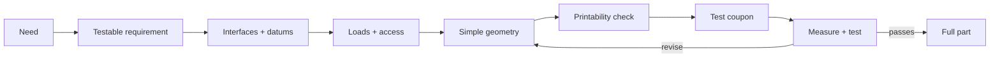

# Topic 2.5 - Designing Simple Parts

> **"A simple part is not a part with few shapes.
> It is a part with few unanswered questions."**

---

# Learning Objectives 🎯

By the end of this topic you will be able to:

- Turn “we need a bracket” into a clear, testable requirement.
- Draw a packaging envelope that includes wires, fingers, tools and movement.
- Identify the interfaces and datums that control whether a part fits.
- Follow the load path through a part and reinforce the places that need it.
- Use walls, ribs, gussets and bosses instead of making everything solid.
- Design holes, slots, chamfers and corners that can actually be printed and assembled.
- Model a small universal cable-tie mount for the buggy.
- Print only a test coupon first, then revise from evidence.

---

# Before We Begin

Look at a coat hook fixed to a wall.

It may be only a bent piece of metal or plastic with two screw holes. It looks simple. Yet the hook has quietly answered many questions.

How far should it stick out? Where will the load pull? How close can the screw holes sit to the edge? Can a screwdriver reach them? Will a coat slide off? Will the hook crack where the upright meets the base?

The shape is small because the thinking happened first.

Our buggy will need many parts like that: cable guides, mounts for the receiver (the module that picks up your radio commands - Topic 3.4), battery stops (Topic 3.3), spacers, brackets, covers and adapters. None is as exciting as a motor. Yet a two-millimetre error in one small mount can trap a battery, bend a wire or make the whole electronics tray impossible to remove.

In Topic 2.4, you learned how CAD stores an editable design. In this topic, you learn what instructions to give CAD. We will move from “draw a shape” to “design a part that fits, prints, works and can be repaired”.

---

# Drawing Is Not Yet Designing

Imagine drawing a beautiful bridge that does not reach the other side of the river.

The drawing may be neat. It may even look realistic. It still fails its job.

**Designing** means choosing a form that meets a need under real limits. Those limits may include:

- size
- force
- movement
- heat
- available tools
- print direction
- fasteners
- cost
- access for assembly and repair

CAD can make any geometry you ask for. It cannot decide whether that geometry is useful unless you give it useful rules.



The model comes after the questions, not before them.

---

# Start with the Job

“We need a mount” is not a requirement. It is only a complaint.

A useful part brief says what the part must do and how you will know it worked.

Compare these:

```text
Vague idea:
Make a mount for the receiver.

Useful requirement:
Hold the receiver on the electronics tray during normal driving,
allow its two wires to leave without sharp bends,
and let the receiver be removed in under one minute using one tool.
```

The second version gives you design decisions to make and tests to run.

Before modelling any simple part, answer five questions:

1. What must the part hold, guide, protect or connect?
2. Which other parts does it touch?
3. What forces or movement will it experience?
4. What must a hand or tool reach?
5. What evidence will count as a pass?

Write the answers in one small **part brief**.

A part brief should fit on half a notebook page. If it needs three pages, the part may not be simple yet.

---

# Requirements: Must, Should and Could

Packing for a school trip teaches this idea.

You **must** take any required medicine. You **should** take a waterproof coat. You **could** take a second game for the journey. If the bag becomes too heavy, the “could” item leaves first.

Use the same order for a part:

| Level | Meaning | Cable-mount example |
|---|---|---|
| **Must** | The part fails without it | Bolt to the tray and hold the cable tie |
| **Should** | Valuable, but the first prototype can survive without it | Rounded corners and tool access from above |
| **Could** | Optional improvement | Embossed label or colour marker |

This stops decoration from stealing time from function.

```text
Must -> prove first
Should -> add after the musts work
Could -> add only if it earns its cost
```

Remember the engineering design process from Topic 1.9: requirements are promises that testing can check.

---

# The Packaging Envelope

A suitcase does not need room for only your clothes.

It also needs room to close the lid, reach the handle and pull out the item packed at the bottom. The suitcase plus that working room is the useful envelope.

A **packaging envelope** is the space a component needs, including room for:

- the component itself
- connectors and wire bends
- movement
- cooling air
- screw heads and nuts
- fingers or tools
- installation and removal

Suppose a receiver measures `35 × 25 × 15 mm`. A box exactly that size may fit the receiver and still be unusable. Its plug could need another 18 mm for the wire to bend gently. Your fingers may need space to press the connector release.

> **[F5 force and motion overlay - Figure 2.5.1: top view of a small radio receiver. A solid rectangle shows the receiver body itself. A larger dashed rectangle around it shows the packaging envelope, with labelled allowances for the aerial lead, the plug and its finger room, the wires bending away, and the space a hand needs to lift it out]**
>
> *Figure 2.5.1 - The part you design is never the size of the component - it is the size of the component plus everything that has to happen around it.*
>
> *Alt text: Top view of a receiver with a dashed packaging envelope around it, labelled for aerial, plug, wires and hand access.*

For our buggy, the empty space around a component is often as important as the plastic around it.

> **🤔 Think about it.**
> Put a mug tightly between two books.
> Can you still grasp the handle and lift the mug straight out?
> Now move one book away by a few centimetres.
> Which arrangement has the better packaging envelope?

The first arrangement fits the mug's body. The second supports actual use. A CAD interference check can show that two solids do not overlap, but it cannot prove that your fingers or screwdriver can reach them unless you model or test that space too.

---

# Interfaces First

When two train carriages meet, the coupling matters more than the colour of either carriage.

An **interface** is the place where parts meet, connect or exchange something. A mechanical interface may include:

- a face that rests against another face
- holes for bolts
- a shaft passing through a bearing
- a slot holding a cable tie
- a lip locating a cover
- space for a connector

For a simple buggy mount, list every interface before drawing the outside shape.

Example:

```text
Interface A: bottom face touches electronics tray
Interface B: two M3 screws pass through mounting holes
Interface C: cable tie passes through central slot
Interface D: screwdriver reaches screw heads from above
Interface E: cable bundle rests across top surface
```

These interfaces define the useful part. Everything else supports them.

A **functional feature** is geometry with a specific job, such as a mounting hole, locating face, cable slot or tool-access opening. Before adding any feature, finish the sentence: `This feature exists to...` If you cannot finish it, the feature may not belong in the first revision.

The guiding principle “standardise interfaces” begins here. A mount that uses the buggy's shared M3 grid can move to a different tray later. A mount with random hole spacing belongs only to one revision.

---

# Choose a Datum

Imagine measuring everyone's height in a room.

If one person stands on the floor, another on a chair and another on a cushion, the numbers cannot be compared. Everyone needs the same starting floor.

A **datum** is that agreed reference. You met datums in Topic 1.5 and Topic 1.8. In a simple part, sensible datums are often:

- the flat mounting face
- the centre plane
- one straight edge
- the centre of a shaft or hole

For a symmetrical mounting plate, use the centre plane as the left-right datum. The holes and slot can stay centred when the width changes.

For a bracket that sits against a chassis edge, that contact face may be the better datum.

Weak dimensioning:

```text
Hole 2 is 24 mm from Hole 1.
Hole 1 was dragged until it looked right.
```

Stronger dimensioning:

```text
Plate centre is the datum.
Hole centres are ±12 mm from the centre.
Both holes lie on the width centreline.
```

The second description records design intent. Change the plate length and the hole pattern can remain centred.

---

# Critical Dimensions

Not every dimension deserves equal attention.

The colour of a shelf does not affect whether it fits between two walls. Its width does.

A **critical dimension** is a size or position that strongly affects function, fit, safety or assembly.

For a cable-tie mount, critical dimensions may be:

- mounting-hole spacing
- hole diameter
- slot width
- material thickness around the slot
- screwdriver access

Less critical dimensions may include:

- exact corner radius
- embossed label height
- a non-contact outside curve

Mark critical dimensions in your notebook before modelling.

```text
C = critical to fit or function
R = reference or flexible
```

Example:

```text
C  Hole spacing: 24 mm
C  Hole diameter: chosen from M3 fit coupon
C  Cable-tie slot: measured tie width + tested clearance
R  Outer corner radius: about 3 mm
R  Label position: wherever it remains readable
```

This tells you what to measure first after printing.

---

# Follow the Load Path

Carry a shopping bag by one handle.

The weight travels from the food, through the bottom of the bag, up the side material, into the handle and finally into your hand. That route is the **load path**.

A buggy part also passes force from one place to another.

For a cable mount:

```text
Cable pulls on tie
-> tie pulls on slot
-> slot loads the plate
-> plate loads the screw areas
-> screws transfer force into the tray
```

If the material between the slot and the screws is thin, the path has a weak bridge. Adding plastic far away in a decorative corner may do nothing useful.

Ask these questions:

- Where does the force enter?
- Where must it leave?
- Which narrow section carries it between those places?
- Does the force try to pull layers apart?
- Is there a sharp corner along the route?

> **[Signature visual, F5 force and motion overlay - Figure 2.5.2: top view of the cable-tie mount with the load path drawn as a continuous shaded band. Arrows show force entering at the central tie slot, spreading outward through the two ribs, passing around the mounting holes and leaving into the chassis at the bolts. A second faded panel beside it shows the same part with the ribs deleted, and the load path pinched into a thin line that necks down at the slot]**
>
> *Figure 2.5.2 - Follow the force from where it enters to where it leaves - anywhere the path narrows is where the part will break.*
>
> *Alt text: Top view of a cable-tie mount with a shaded load path from the slot through ribs to the bolts, beside a version without ribs where the path narrows.*

This is the signature visual for the topic: material should follow the job.

---

# Shape Beats Bulk

Try holding a sheet of paper flat between two hands. It bends easily.

Now fold the long edges upwards to make a shallow channel. The same paper becomes much harder to bend. You did not add material. You moved it away from the middle where it could do more work.

Topic 1.4 showed that shape can matter more than the amount of material. Printed parts use the same idea.

Instead of filling a whole part solid, designers use:

- walls
- ribs
- gussets
- bosses
- flanges
- curved shells

Each puts material where the load path needs it.

A thick solid block may be heavy, slow to print and still weak in the wrong direction. A thinner shell with well-placed reinforcement can be lighter and stiffer.

---

# Walls

A cardboard box is strong because its thin faces create a three-dimensional shell.

A **wall** is a relatively thin sheet-like part of the model. Walls create boundaries, carry loads and connect features.

(Careful with this word: Topic 2.3 used **wall** for a printed loop around a layer. Here it means a thin sheet-like region of the part itself. The slicer's walls are how this wall gets made.)

For FDM printing, wall thickness should match what the nozzle and slicer can produce. With a common `0.4 mm` nozzle, one printed line is often about `0.4-0.5 mm` wide. A structural wall should normally contain several printed lines, not one fragile thread.

> **[F2 cross-section - Figure 2.5.3: a magnified cross-section through three walls printed with a 0.4 mm nozzle. Left: a single-line wall, drawn thin and marked fragile. Middle: a two-line wall. Right: a four-line wall at roughly 1.6 mm, marked structural. Each printed line is drawn as a separate rounded bead so the reader can count them, with the wall thickness dimensioned beneath]**
>
> *Figure 2.5.3 - Wall thickness is really a count of printed lines - you are choosing how many beads sit side by side.*
>
> *Alt text: Cross-sections of one-line, two-line and four-line printed walls with thicknesses dimensioned.*

A useful beginner rule is:

> Design important walls for at least three or four perimeter lines, then inspect the sliced preview.

Depending on the printer profile, that may be roughly `1.3-1.8 mm`. It is a starting point, not a universal guarantee. Use thicker walls around high loads, hot areas or fasteners, and test the real part.

> **📚 Learn more**
>
> - Prusa Knowledge Base: search "Modeling with 3D printing in mind" - official worked examples of thin walls, overhangs, tolerances and when to split a part

Do not repair every weak part by making every wall thicker. First inspect:

- load path
- orientation
- sharp corners
- fastener position
- whether a rib or gusset would work better

---

# Ribs

The raised lines under a plastic storage box are not decoration.

A **rib** is a thin raised wall that stiffens a larger wall or plate. It is like folding a crease into card so the card resists bending.

Ribs are useful when:

- a wide plate flexes
- force must travel between two features
- a wall needs support without becoming solid
- the part needs stiffness but not much extra weight

Place ribs along the load path. A rib that stops just before the loaded feature cannot pass the force into it.

Good rib:

```text
loaded slot -> rib -> screw boss
```

Weak rib:

```text
loaded slot -> empty gap -> decorative rib elsewhere
```

Keep rib thickness printable. In many beginner parts, a rib about the same thickness as the main wall is easier to print and understand than an extremely thin one.

> **[F7 comparison array - Figure 2.5.4: three panels of the same flat panel carrying the same load, drawn from the side with the bending exaggerated. Panel 1: a thin plate, bending a lot. Panel 2: the same plate made twice as thick, bending less but drawn with a weight symbol showing it is much heavier. Panel 3: the original thin plate with two shallow ribs standing up from it, bending as little as panel 2 but with a much lighter weight symbol]**
>
> *Figure 2.5.4 - A rib buys stiffness by moving material away from the middle, where bending is resisted - far cheaper than thickening everything.*
>
> *Alt text: Three side views comparing a thin bending plate, a heavy thick plate, and a light ribbed plate with equal stiffness.*

---

# Gussets

Push sideways on the upright part of a cardboard letter L. The corner folds.

Now tape a triangular piece across the inside corner and push again. The triangle stops the angle changing so easily.

A **gusset** is a reinforcing web, often triangular, placed where two walls meet. It spreads force through a wider area and reduces bending at the corner.

Gussets are useful on:

- L-brackets
- motor or servo mount uprights
- bumper posts
- raised shelves
- vertical tabs

> **🤔 Think about it.**
> Fold a strip of card into an L shape and press the upright sideways.
> Now hold a small triangular scrap in the inside corner and press again.
> Why does the triangle change the movement?

The open L can change angle like a hinge. The triangle fixes three side lengths, so the corner has to bend or tear rather than simply fold. This is why triangles appear in bridges, bicycle frames and buggy brackets.

---

# Bosses

Look inside a plastic toy or remote control. The screws often enter raised round towers rather than passing through a huge solid block.

A **boss** is a raised area around a hole or fastening point. It adds local material where pressure and force are concentrated.

A boss can:

- support a screw head or washer
- provide depth for a threaded insert later
- spread load into a thin plate
- locate another part
- connect to ribs

A good boss joins the surrounding structure smoothly. A tall isolated tower can snap off at its base.

```text
Weak: isolated tower on thin floor
Better: boss connected to nearby walls or ribs
```

For early buggy parts, through-bolts and nuts are often safer and more reusable than forcing a screw directly into a thin printed hole.

---

> **☕ Good place to pause.**
> Try Hands-On Activity 1 or 2 now.
> The next section turns holes, slots and corners into reliable interfaces.

---


> **☕ Good place to pause.**
> Four big ideas so far: the job, the envelope, the datum and the load path.
> The next run is about shaping material - walls, ribs, gussets and bosses.

---

# Holes Have Jobs

A hole is not simply “empty material”. It is an interface.

Before drawing a hole, ask what it must do:

- let a bolt pass freely
- locate a shaft accurately
- hold a screw thread
- provide tool access
- reduce weight
- route a wire
- allow adjustment

A **clearance hole** lets a fastener pass through without gripping its thread. The nut or threaded part on the other side provides the clamping force.

For an M3 bolt, a CAD diameter of exactly `3.0 mm` is usually not a useful printed clearance hole. The printer may make the hole slightly small, and the bolt itself needs room to pass.

Do not memorise one magic diameter. Use the fit library from Topic 1.7:

1. Print several nearby hole sizes in a coupon.
2. Test them with the actual bolt.
3. Choose the smallest size that gives the required fit.
4. Record the printer, material and orientation.

A common starting range for an M3 printed clearance hole may be around `Ø3.3-3.6 mm`, but your coupon decides.

---

# Keep Holes Away from Edges

Tear a hole near the edge of a sheet of paper. Very little paper remains to resist the pull.

A hole in a part creates a narrow strip of material between the hole and the outside edge. If that strip is too thin, it can crack or split.

When placing a hole, check:

- distance from hole edge to part edge
- room for the screw head or washer
- room for the nut underneath
- room for a tool
- load direction
- printed layer direction

Do not place a screw hole by measuring only its centre. Inspect the material left around it.

A useful starting rule: leave **at least one screw diameter of material all the way around a screw hole**, measured from the edge of the hole outwards. For an M3 screw that means about 3 mm of material before you reach the outside edge or the next hole. It is a starting point, not a guarantee - a heavily loaded corner may want more, and a light cover may manage with less. Test the real part.

> **[F6 measured drawing - Figure 2.5.5: a plate corner with an M3 clearance hole, dimensioned to show the rule: at least one screw diameter of material all the way around the hole, so 3 mm of material for an M3 screw. A shaded ring marks that minimum material, and a second hole placed too near the edge shows the ring breaking out through the side]**
>
> *Figure 2.5.5 - A useful starting rule: keep at least one screw diameter of material around a screw hole, measured from the hole edge.*
>
> *Alt text: A plate corner showing an M3 hole with a shaded ring of minimum surrounding material, and a second hole too close to the edge.*

> **[F3 right-versus-wrong array - Figure 2.5.6: three top views of the same mounting hole. Version A, wrong: the hole sits close to the outer edge and a crack runs from hole to edge through the thin strip of material. Version B, wrong: edge distance is fine but the screw head overlaps a tall wall, with a driver drawn unable to reach straight down. Version C, correct: edge material at least one screw diameter wide, room for the washer, and clear space for a driver, each dimension called out]**
>
> *Figure 2.5.6 - A hole can be the right size and still be wrong - what matters is the material and the access around it.*
>
> *Alt text: Three views of a mounting hole: one cracking near the edge, one blocked by a wall, and one with correct edge distance and tool access.*

---

# Slots Allow More Than One Position

A round hole chooses one position. A **slot** permits movement or adjustment along one direction.

Slots can be useful for:

- cable ties of different widths
- motor adjustment
- strap routing
- manufacturing variation
- aligning two modules

But every slot removes more material than a round hole. It also creates two curved ends where stress can gather.

Use rounded slot ends rather than sharp rectangular internal corners. The rounded ends spread force and are easier for many CAD tools and printers to make.

For a cable tie:

```text
Slot length -> enough for tie width plus entry clearance
Slot width  -> enough for tie thickness plus print clearance
```

Measure the actual tie. Cable ties that look identical can differ.

If the slot fit is uncertain, print the slot and a small surrounding patch as a test coupon. Do not print the whole mount to learn one width.

---

# Tool Access Is Part of the Hole

A bolt may fit through a hole while the assembly remains impossible.

Imagine a screw head placed 2 mm from a tall wall. The screw is visible, but the screwdriver cannot line up with it. The hole fits. The design fails.

Model or check the **access clearance**:

- screwdriver shaft above the screw
- hex key swing around the bolt
- spanner space around a nut
- fingers needed to hold the nut
- room to remove the fastener after nearby parts are installed

A useful trick is to add a temporary transparent cylinder in CAD representing the screwdriver shaft. If the cylinder hits the part, the real tool will too.

Delete or hide the checking shape before export.

---

# Capturing a Nut

Holding a tiny nut under a chassis while turning a screw above it needs three hands.

A **captive nut** sits in a shaped pocket that prevents it rotating or falling away. The pocket can make assembly much easier.

> **[F2 cross-section - Figure 2.5.7: a cut-through of a printed boss with a hexagonal pocket holding a nut. The pocket walls grip the nut flats so it cannot turn, and a screw is shown entering from the opposite face and engaging the thread. A second panel shows the pocket printed too large, with the nut visibly loose and rotating, and a third shows it too small with the nut not seating flat]**
>
> *Figure 2.5.7 - The pocket has to match the nut across its flats - too loose and it spins, too tight and it will not seat.*
>
> *Alt text: Cross-section of a hexagonal captive-nut pocket holding a nut, beside versions that are too loose and too tight.*

A hexagonal nut pocket needs:

- width across the flats plus tested clearance
- enough depth to hold the nut
- an opening or insertion route
- access for removal if the design should remain serviceable

Do not guess from the name “M3 nut”. Measure the actual nut or use a verified drawing, then test a small pocket coupon. Different nut types and suppliers vary.

Captive features are useful, but they add difficulty. Use a normal through-bolt and loose nut in the first prototype when that answers the question cheaply.

---

# Chamfers Guide Assembly

Try pushing the square end of a pencil through a hole only slightly larger than it. Perfect alignment is fiddly.

Sharpening the pencil creates a sloping lead-in that guides it towards the centre.

A **chamfer** is a flat sloping cut across an edge. You met chamfers in Topic 1.7. They can:

- guide a bolt, shaft or tab into place
- remove a sharp edge
- reduce elephant's foot at the bottom of a print
- turn a difficult overhang into a printable slope
- make a part easier to handle

Use small chamfers where they solve a job. Do not chamfer every edge merely because the CAD tool makes it easy.

A bottom-edge chamfer of about `0.5-1 mm` is often enough to protect a fitting edge from first-layer bulge. Test it on the real printer.

---

# Fillets Spread Stress

A road does not usually turn through an instant 90° corner. It curves so the car changes direction gradually.

A **fillet** is a rounded inside or outside edge. In a loaded internal corner, a fillet can spread stress over a wider area instead of forcing it through one sharp line.

Fillets can:

- reduce stress concentration
- make a part safer to handle
- help material flow between joined features
- improve appearance

But print orientation matters. A large fillet facing the build plate may create a steep curved overhang and a rough underside. A chamfer may print more cleanly in that position.

```text
Internal loaded corner -> fillet or gusset may help
Bottom outside edge     -> chamfer may print better
Decorative top edge     -> either may be acceptable
```

Function and orientation decide.

---

# Avoid Knife-Edge Features

A real knife edge becomes infinitely thin at its tip. A printer nozzle cannot make infinitely thin plastic.

Avoid features that fade to nothing, such as:

- walls thinner than one printable line
- pointed wedges with no flat end
- tiny raised lettering
- narrow fins
- almost-touching surfaces

The slicer may delete them, thicken them unexpectedly or produce a fragile thread.

Inspect the layer preview from Topic 2.3. If a feature disappears, changing the printer speed will not bring missing geometry back. Redesign the feature so the nozzle can make it.

> **[F3 right-versus-wrong array - Figure 2.5.8: two cross-sections side by side. Left, wrong: a wall tapering down to a knife edge, with a magnified inset showing the nozzle unable to lay a complete line at the tip, leaving a ragged fragile sliver. Right, correct: the same wall truncated to a flat edge at least one nozzle width across, printing as a clean complete line]**
>
> *Figure 2.5.8 - The nozzle cannot draw anything thinner than itself - a knife edge becomes a ragged sliver, not a sharp edge.*
>
> *Alt text: Two cross-sections comparing a wall tapering to a knife edge with a ragged tip and a wall truncated to a printable flat edge.*

---

# Design for Support-Free Printing

Build a tower from wooden blocks. Every block needs something below it.

FDM printing works the same way. Each new line of plastic normally rests on the previous layer. A design that avoids unnecessary support material prints faster, wastes less plastic and gives cleaner functional surfaces.

A **support-free** part is designed to print in its chosen orientation without temporary support material. Useful strategies include:

- put a broad flat face on the build plate
- use slopes near 45° instead of flat ceilings
- use chamfers beneath ledges
- keep bridges short
- split a difficult part into modules
- turn circular horizontal holes into teardrop or diamond-shaped openings when exact roundness is not required
- move cosmetic detail away from supported faces

The classic 45° guideline is a starting point, not a law. Cooling, material, layer height and printer design all matter. Some modern printers handle steeper overhangs. Your slicer preview and test piece decide.

> **[F7 comparison array - Figure 2.5.9: four cross-sections of the same ledge. First, a flat 90 degree overhang with drooping plastic and a support scaffold beneath. Second, a 45 degree chamfer printing cleanly with no support, marked with its angle. Third, a short bridge spanning between two walls with a slight sag. Fourth, the ledge redesigned so the overhang disappears entirely. A tick or cross sits under each]**
>
> *Figure 2.5.9 - Three ways to survive an overhang, and one way to remove the problem altogether - the fourth is usually best.*
>
> *Alt text: Four cross-sections comparing an unsupported overhang, a 45 degree chamfer, a bridge and a redesign that removes the overhang.*


> **📚 Learn more**
>
> - Onshape Learning Centre: search "Design intent" - how dimensions and relationships decide whether a model survives its next change
> - Tinkercad Learn: practise Align, Ruler, Hole, Duplicate and Group before modelling the universal mount
---

# Print Orientation Begins in CAD

Topic 2.2 taught that FDM parts are weaker between layers. Topic 2.3 taught you to rotate a model in the slicer.

The best time to think about orientation is before the model is finished.

For each part, ask:

1. Which way does the largest force act?
2. Which face must be flat and accurate?
3. Which holes or slots are critical?
4. Which orientation avoids support?
5. Which orientation gives a stable first layer?

Sometimes no single orientation wins every question. That is a trade-off.

Example: an L-bracket printed standing on its base has easy vertical holes but may split at the layer line where the upright meets the base. Printed on its side, the layers may follow the L shape more strongly, but some holes become horizontal and less accurate.

Possible responses:

- change the geometry
- add a gusset
- use teardrop holes
- split the bracket into two bolted pieces
- print a test piece in both orientations

Do not simply add infill and hope.

---

# One Part or Several?

A lunchbox is not moulded permanently around your sandwich. The lid is separate because access matters.

A design can improve when one difficult part becomes two simple parts.

Split a part when it gives you:

- better print orientation
- fewer supports
- easier replacement
- access to trapped fasteners
- interchangeable modules
- smaller, faster prints
- reusable standard interfaces

Keep it as one part when splitting would add:

- loose fasteners with no benefit
- alignment problems
- weak joints
- unnecessary assembly time
- more failure points

Our guiding principles prefer modularity, but modular does not mean “maximum number of pieces”. It means useful boundaries with clear jobs and interfaces.

---

# Design for Assembly

Imagine assembling a flat-pack shelf and discovering that the final screw is hidden behind the panel you fitted first.

A part can fit perfectly and still have the wrong **assembly sequence**.

Before approving a design, act out the order:

```text
1. Place part on tray.
2. Insert screws from above.
3. Hold nuts below.
4. Tighten with screwdriver and spanner.
5. Feed cable tie through slot.
6. Place cables.
7. Tighten tie.
8. Cut tie tail safely.
```

Ask:

- Can every part reach its final position?
- Can every screw be inserted?
- Can every tool reach?
- Can the cable tie be replaced without removing the tray?
- Can the mounted component still be unplugged?

Assembly is not something that happens after design. It is one of the design conditions.

---

# Design for Serviceability

A car bonnet opens because engines need inspection. A sealed bonnet might look smooth, but it would turn every small repair into a disaster.

Serviceability means the part can be inspected, cleaned, adjusted, removed and replaced.

For buggy parts, prefer:

- bolts instead of permanent glue
- accessible screw heads
- removable covers
- visible damage
- standard fasteners
- cable routes that do not cross moving parts
- replaceable sacrificial pieces

A **sacrificial feature** is designed to fail cheaply before an expensive part fails. A bumper tab may break in a crash so the chassis and electronics survive.

Sacrificial does not mean carelessly weak. It means the break point is chosen, local and replaceable.

---

# Use Reversible Decisions

Early designs should be easy to change.

Good first-version choices:

```text
Slotted hole instead of one guessed position
Bolted plate instead of glued box
Separate cable guide instead of a guide fused into the chassis
Replaceable spacer instead of changing the whole tray height
```

Reversible decisions reduce fear. If the evidence says the part is wrong, you can change one module instead of restarting the vehicle.

This is why our first digital part in this topic is a small bolt-on mount rather than a complete electronics tray.

---

> **☕ Good place to pause.**
> You now have the main design rules.
> The next section applies them to one real buggy part from brief to test coupon.

---


> **☕ Good place to pause.**
> That is the whole design vocabulary.
> What follows is one part designed from beginning to end, using all of it.

---

# Guided Design - Universal Cable-Tie Mount

We will design a small plate that bolts to a standard M3 mounting grid and provides a slot for a cable tie.

It could secure:

- a receiver wire bundle
- an ESC cable group
- a sensor lead later
- a small foam pad around an electronic module

The mount is intentionally separate from the electronics tray. If the cable route changes, we replace this small part rather than the whole tray.

---

# Part Brief

Write this in your notebook before opening CAD:

```text
Part: Universal cable-tie mount, Revision 0.1

Job:
Bolt to a flat electronics tray and hold one small cable tie.

Must:
- use two M3 mounting positions on a 24 mm spacing
- allow the selected cable tie to pass through
- print flat without support
- leave both screw heads accessible from above
- have no sharp outside corners

Should:
- centre the tie slot between the mounting holes
- reinforce the load path from slot to screws
- remain below 6 mm total height

Could:
- include a small direction arrow or part label

Test:
The actual bolts and tie fit, the mount stays fixed under a gentle cable pull,
and the tie can be replaced without removing the mount.
```

Do not copy the slot dimensions blindly. Measure the cable tie you will actually use.

---

# Starting Geometry

Use these dimensions for the first model:

```text
Base length:       36 mm
Base width:        18 mm
Base thickness:     3 mm
Hole spacing:      24 mm, symmetrical about centre
Hole diameter:     from your M3 clearance coupon
Tie-slot length:   measured tie width + about 1 mm entry room
Tie-slot width:    measured tie thickness + tested clearance
Corner radius:      3 mm
Local pads:         1.5 mm raised around the holes
Maximum height:     4.5 mm before optional markings
```

These are prototype dimensions, not a universal standard.

The mounting pattern is controlled from the part centre:

```text
Left hole centre:  X = -12 mm
Right hole centre: X = +12 mm
Both holes:        Y = 0 mm
Tie slot:          centred at X = 0, Y = 0
```

This makes the design symmetrical and easy to revise.

> **[F6 measured drawing - Figure 2.5.10: dimensioned top and side views of the universal cable-tie mount. The 36 x 18 x 3 mm rounded base carries two clearance holes on 24 mm centres, a rounded central slot, and two shallow raised pads joined towards the slot by short ribs. The side view shows the 3 mm base plus 1.5 mm local pads. All dimensions run from the centre plane and the bottom face]**
>
> *Figure 2.5.10 - This is the drawing you would hand to somebody else - every number needed to rebuild the part, and nothing else.*
>
> *Alt text: Dimensioned top and side views of the cable-tie mount showing base size, hole centres, slot and pad heights.*

---

# Step 1 - Measure the Interfaces

Measure or identify:

- actual M3 bolt diameter
- screw-head diameter
- washer diameter, if used
- cable-tie width
- cable-tie thickness
- available tray area
- screwdriver access above

Use calipers if you have them. A ruler and a paper comparison strip are enough for the first cardboard check.

Record the tool and uncertainty, following Topic 1.5.

```text
Cable tie width:       ______ mm
Cable tie thickness:   ______ mm
Chosen slot length:    ______ mm
Chosen slot width:     ______ mm
M3 coupon result:      Ø______ mm
```

If you do not have the real hardware yet, stop at a paper or CAD model. Do not invent a final fit around imaginary parts.

---

# Step 2 - Draw the Packaging Envelope

Draw a `36 × 18 mm` rectangle on paper.

Place or sketch:

- two screw heads
- the central tie slot
- the cable bundle crossing the top
- a screwdriver shaft above each screw
- the nearest tray edge or wall

Check that these envelopes do not collide.

The mount may be only 18 mm wide, but the screwdriver envelope may be much wider above it. That is acceptable if the surrounding buggy space is clear.

---

# Step 3 - Create the Base

In your chosen CAD tool:

1. Create a new part named `Universal-Cable-Tie-Mount_V0.1`.
2. Confirm millimetres.
3. Choose the base plane.
4. Create a centred `36 × 18 mm` rounded rectangle.
5. Extrude it to `3 mm`.

If your tool does not have a rounded-rectangle command, make a rectangle and add `3 mm` corner fillets after the main dimensions work.

Keep the bottom face completely flat. It is the mounting interface and the build-plate face.

---

# Step 4 - Add the Mounting Holes

Create two through holes from one shared centre datum.

Sketch-based route:

1. Start a sketch on the top face.
2. Add a horizontal construction centreline.
3. Add one vertical centreline through the origin.
4. Place two equal circles on the horizontal centreline.
5. Dimension their centres `±12 mm` from the origin.
6. Set the diameter to your coupon value.
7. Cut through all.

Shape-based route:

1. Add one hole cylinder.
2. Set its diameter and make it taller than the plate.
3. Align it with the plate width centre.
4. position its centre 12 mm left of the plate centre.
5. Duplicate or mirror it 24 mm to the right.
6. Subtract both from the base.

Change the base length temporarily from 36 mm to 42 mm. The holes should remain 24 mm apart and centred. Restore 36 mm afterwards.

---

# Step 5 - Add the Cable-Tie Slot

Create a rounded slot at the centre.

If your CAD tool has a slot command, use it. Otherwise combine:

- one rectangle
- two equal circles at its ends

The slot must pass fully through the base.

Check:

- the slot is centred
- its rounded ends are equal
- enough material remains between slot and holes
- the real tie has entry clearance

Do not add a large slot “just to be safe”. A larger slot removes load-carrying material and gives the cable bundle more room to move.

---

# Step 6 - Add Local Pads

Create a shallow raised pad around each mounting hole.

One simple method:

1. Sketch a circle or rounded shape around each hole.
2. Keep enough room for the screw head or washer.
3. Extrude the pads upward by `1.5 mm`.
4. Keep the hole open through the pad.

## Worked Example - Total Height

**Question:** The base is `3.0 mm` thick and the raised pad adds `1.5 mm`. What is the total height at the pad?

**Known values:**

```text
Base thickness = 3.0 mm
Pad height     = 1.5 mm
```

**Rule:** Add the stacked heights.

**Calculation:**

```text
Total height = 3.0 mm + 1.5 mm
             = 4.5 mm
```

**Meaning:** The screw area is `4.5 mm` tall, while the rest of the base remains `3.0 mm` tall. This stays below the part brief's `6 mm` maximum.

The pads spread screw pressure and give the fastener areas more stiffness without thickening the whole plate.

---

# Step 7 - Connect the Load Path

Add two short ribs from the slot area towards the hole pads.

Keep them low enough that the cable tie and screw heads remain accessible.

A simple starting rib may be:

```text
Height above base: 1.5 mm
Thickness:         about 1.5-2.0 mm
```

Exact values depend on your printer and design. Inspect the slicer preview to confirm each rib receives several extrusion lines or a sensible variable-width path.

The ribs should merge smoothly into the pads and the slot surround. Avoid tiny gaps.

---

# Step 8 - Add Useful Edge Treatment

Add only the edge treatments that solve a problem:

- small chamfers at the top of the tie slot to guide the tie
- a `0.5-1 mm` chamfer around the bottom outside edge to protect the fit from elephant's foot
- small fillets where ribs meet pads if your CAD model remains stable

Do not round every edge before testing the critical geometry. Decorative features can make revisions harder.

Save as Revision 0.1 before adding optional markings.

---

# Step 9 - Inspect the CAD Model

Use the routine from Topic 2.4.

## Geometry

- One intended solid exists.
- Both holes pass through.
- The slot passes through.
- Ribs and pads merge with the base.
- No hidden slivers or floating pieces exist.

## Critical Dimensions

```text
Overall length:       36 mm
Overall width:        18 mm
Base thickness:        3 mm
Hole spacing:         24 mm
Hole diameter:        coupon result
Slot dimensions:      measured and recorded
Total local height:    4.5 mm
```

## Design Intent

Temporarily change:

```text
Base width: 18 mm -> 22 mm
```

The holes and slot should remain on the centreline. Restore 18 mm.

Temporarily change:

```text
Hole spacing: 24 mm -> 26 mm
```

Both holes should move symmetrically. Restore 24 mm.

## Access

- Screw heads do not collide with ribs.
- A screwdriver can approach vertically.
- The cable tie can enter and leave the slot.
- The tie tail has somewhere safe to point after trimming.

---

# Step 10 - Inspect the Sliced Preview

Export a 3MF or STL while keeping the native CAD model.

Import the mount into the slicer from Topic 2.3.

Recommended first orientation:

```text
Flat bottom face on build plate
Pads and ribs facing upward
No supports
```

Inspect layer by layer:

- Do the holes remain open?
- Does the slot remain open?
- Do the ribs appear as real toolpaths?
- Are there enough perimeter lines around the holes and slot?
- Does the bottom chamfer appear as expected?
- Is any feature missing?

If the slicer deletes a feature, return to CAD. Do not treat a missing rib as a printer fault.

---


> **☕ Good place to pause.**
> The model is finished on screen. Now it has to survive the real world.
> The next steps print the risky feature before committing to the whole part.

---

# Step 11 - Print the Risk, Not the Part

The risky features are the M3 clearance hole and cable-tie slot.

Create a small **test coupon** containing:

- one mounting hole with the local pad
- one short section of the tie slot
- the same base thickness
- the same print orientation

A coupon about `20 × 18 mm` may be enough. Keep the exact local geometry from the real design.

Why not print the complete mount first?

Because the coupon can answer:

- Does the bolt pass?
- Does the screw head sit properly?
- Does the tie enter?
- Is the slot too loose?
- Does the chamfer help?
- Are the ribs printable?

The full mount cannot answer those questions better. It only spends more time and material.

---

# Coupon Test Plan

Follow the fair-test pattern from Topic 1.9.

```text
Question:
Do the selected M3 hole and cable-tie slot provide usable clearance?

Independent variable:
Hole or slot size, when comparing coupon variants.

Dependent variable:
Whether the real bolt and tie pass, move and stay controlled.

Control variables:
Same printer, material, orientation, layer height and slicer profile.

Pass condition:
Bolt passes without drilling or force.
Tie passes by hand without tearing the slot.
Neither interface has obvious unwanted wobble.
```

Record the result:

| Feature | CAD size | Actual item | Result | Next revision |
|---|---:|---|---|---|
| M3 hole | ___ mm | M3 bolt | tight / pass / loose | ___ mm |
| Tie slot length | ___ mm | ___ mm tie | tight / pass / loose | ___ mm |
| Tie slot width | ___ mm | ___ mm thick | tight / pass / loose | ___ mm |

Change one dimension at a time when possible.

---

# Step 12 - Print and Test the Full Mount

> **⚠️ SAFETY**
>
> Ask a responsible adult to supervise the print. Keep hands away from the moving mechanism, hot nozzle and heated build plate. Watch the complete first layer, never leave the printer running alone in the house, and let the part and build plate cool before removal. Use only disconnected scrap wire or string during the mechanical test.

Only after the coupon passes:

1. Save the model as Revision 0.2 if dimensions changed.
2. Export a fresh manufacturing file.
3. Slice with the same tested orientation and profile.
4. Inspect the preview again.
5. Print with the safety routine from Topics 2.1-2.3.
6. Measure the critical dimensions.
7. Bolt the mount to a scrap test plate or safe mock-up.
8. Feed the cable tie through.
9. Secure a bundle of string or disconnected scrap wire.
10. Pull gently by hand in the expected direction.

Do not test with a live battery or powered buggy yet. This topic is proving the mechanical interface.

Pass when:

- the bolts fit
- the mount sits flat
- the tie fits and remains replaceable
- the ribs and slot show no cracks under a gentle pull
- tools can reach both screws

Failure is evidence. Photograph the failure before changing the design.

---

# Read the Failure

Different failure shapes suggest different causes.

| Evidence | Possible cause | Sensible next check |
|---|---|---|
| Crack runs from slot to outside edge | Too little material or sharp stress path | Increase edge distance, round slot ends or add a rib |
| Pad separates from base along a layer | Poor orientation or abrupt feature junction | Improve orientation, add a fillet or merge with rib |
| Mount bends but does not crack | Plate lacks stiffness | Add a rib or increase section depth before making it solid |
| Bolt does not pass | Hole undersized for this process | Revise coupon diameter |
| Tie rattles badly | Slot oversized | Reduce one slot dimension and retest |
| Screwdriver hits rib | Access envelope missed | Move or lower rib |
| Bottom does not sit flat | Elephant's foot, warping or raised geometry | Check first layer, bottom chamfer and model face |

Do not make five changes after one failure. You will not know which change helped.

---

# A Simple Design Review

Before calling a part ready, hold a one-person design review. Read each question aloud.

## Job

- What exact job does the part do?
- Which requirement proves that job?

## Interfaces

- What does it touch?
- Which dimensions control those contacts?
- Are real components measured?

## Forces

- Where does the load enter and leave?
- Does material connect those points?
- Are sharp corners in the load path?

## Assembly

- Can each fastener and tool reach?
- Can the part be installed in the real order?
- Can it be removed later?

## Printing

- Which face goes on the build plate?
- Which way do the layers run?
- Are supports avoidable?
- Can the nozzle make every wall and feature?

## Evidence

- What coupon proves the riskiest interface?
- What will be measured?
- What is the pass condition?

A five-minute review can prevent a five-hour print.

---

# Practical Starting Rules

These are useful first questions, not laws.

| Feature | Beginner starting thought | Verify by |
|---|---|---|
| Structural wall | Several perimeter lines, often roughly 1.3-1.8 mm or more with a 0.4 mm nozzle | Slicer preview and load test |
| M3 clearance hole | Start near coupon sizes around Ø3.3-3.6 mm | Actual bolt and printer coupon |
| Bottom fitting edge | Small 0.5-1 mm chamfer may avoid elephant's foot | Fit coupon |
| Overhang | Prefer about 45° slopes or gentler when uncertain | Printer-specific overhang test |
| Bridge | Keep short and non-critical | Bridge test and surface inspection |
| Internal corner | Fillet or gusset when it carries load | Failure test |
| Screw area | Leave room for head, washer, nut and tools | Packaging-envelope sketch |
| Repeated features | Control from a common datum or pattern | Revision test in CAD |

The sentence “my printer can do it” is not evidence until your printer has done it with the same material, orientation and settings.

---


> **☕ Good place to pause.**
> Design done. The activities below build the habits behind it -
> start with the one that needs nothing but a pencil.

---

# Hands-On Activity 1 - Part Job Detective

*No equipment needed. Use your eyes and hands.*

Find three safe household parts such as:

- a shelf bracket
- a clothes peg
- a bottle cap
- a drawer handle
- a cable clip
- a food-container lid

For each one, answer:

```text
Job:
Interfaces:
Datum or locating surface:
Load path:
Access needed:
Feature that makes it easier to manufacture or assemble:
Likely weak point:
```

Do not judge by appearance alone. Turn the object over and inspect hidden ribs, bosses, clips and screw pockets.

**Upgrade with equipment:** Photograph each part and mark arrows and labels on the image for your engineering notebook.

---

# Hands-On Activity 2 - Packaging Envelope in Paper

*You need: paper, pencil and one safe household object.*

Choose a small object that could represent buggy electronics, such as an eraser, matchbox-sized empty carton or small remote control.

1. Trace its body on paper.
2. Draw a second outline for finger access.
3. Add space for any cable, lid, button or connector.
4. Draw a screwdriver or hand approach path.
5. Shade the areas that a mount must not block.
6. Cut out the envelope and place it in a drawn buggy-tray rectangle.

Now rotate the envelope. Can you find a layout that uses less tray area without blocking access?

Record which empty space was necessary and which was wasted.

---

# Hands-On Activity 3 - Shape Beats Bulk Test

*You need: two equal card strips, tape, two books and coins.*

> **⚠️ SAFETY**
>
> Show a responsible adult what you plan to test before starting, and work with them nearby. Use only light loads such as coins. Keep feet and fragile objects away from the test area. Stop before the card collapses suddenly.

1. Leave the first strip flat.
2. Fold the long edges of the second strip upwards to make a shallow channel.
3. Bridge each strip across the same gap between two books.
4. Add coins one at a time at the centre.
5. Record when each strip bends noticeably.

| Shape | Coins before noticeable bend | What changed? |
|---|---:|---|
| Flat strip | ___ | Baseline |
| Folded channel | ___ | Same material, deeper section |

The independent variable is shape. Keep material, span and coin position the same.

**Extension:** Add a narrow folded rib under the flat strip and repeat.

---

# Hands-On Activity 4 - Red-Pencil Design Review

*You need: paper and a coloured pencil.*

Draw or copy this deliberately poor bracket description:

```text
A 50 × 20 mm plate with:
- one M3 hole exactly Ø3.0 mm
- the hole 1 mm from the edge
- a tie slot with sharp square ends
- a tall rib covering half the screw head
- a large rounded underside that must print in mid-air
- no room to insert the tie after assembly
```

Circle each problem and write a correction.

Try to find at least six issues under these headings:

- fit
- strength
- access
- printing
- assembly
- serviceability

Then draw the corrected top and side views.

---

# Hands-On Activity 5 - Model the Universal Mount

*Computer and CAD software needed. A printer is optional.*

If you choose to print, follow the printer safety callout in Step 12 and work with an adult.

Build the universal cable-tie mount using the guided design.

Save these files or revisions:

```text
Universal-Cable-Tie-Mount_V0.1_native
Universal-Cable-Tie-Mount_V0.1.step
Universal-Cable-Tie-Mount_V0.1.3mf or .stl
Cable-Tie-Mount-Coupon_V0.1
```

Take screenshots of:

- the part brief
- top view with dimensions
- isometric view
- load-path arrows
- sliced preview
- coupon result, if printed

The evidence is part of the artifact.

---

# Thinking Like an Engineer - Reuse the Rule

A strong design rule can create a family of parts.

The universal mount uses:

- a standard M3 interface
- a centred functional slot
- local reinforcement
- support-free orientation
- a coupon-tested fit

Keep those rules and change only the central feature. The same base could become:

- a wire-loop guide
- a small antenna-tube holder
- a sensor pad
- a body-clip keeper
- a label plate

This is platform thinking from the guiding principles. You are not designing one isolated object. You are building a reusable interface language for the buggy.

---

# Topic Mini Project - Modular Cardboard Mounting Tile 🛠️

You will build a keepable cardboard module that holds a pretend electronics box, routes two “cables” and can be removed from a base without destroying either part.

The model is not decoration. It demonstrates requirements, interfaces, packaging, reinforcement, assembly and serviceability.

## What You Will Build

A small mounting tile with:

- one flat base
- four standard corner mounting points
- one removable component strap
- two cable routes
- one raised or reinforced region
- tool and finger access
- labelled datums and load paths

The component will be a safe empty box, eraser or folded paper block. Do not use a battery or live electronics.

## Materials

Use household and scrap materials only:

- corrugated cardboard
- cereal-box card or thick paper
- pencil and ruler
- tape or glue
- string, wool or disconnected scrap wire for pretend cables
- rubber bands or paper strips for a removable strap
- coins for a gentle load test
- scissors
- hole punch, optional

No printer or calipers are needed.

> **⚠️ SAFETY**
>
> Show a responsible adult or guardian what you plan to build before starting, and build with them nearby. Ask the adult to supervise all cutting. Cut away from your body and keep your other hand out of the cutting path. Do not use a craft knife unless the adult takes responsibility for that step. Keep rubber bands pointed away from faces. Use only an empty box or paper block - never a battery or powered electronics.

> **🎬 Watch the build**
>
> - YouTube - search “Cardboard Construction Techniques: L Brace” (with an adult) to see how a folded brace makes a right-angle joint stronger.
> - YouTube - search “Gusset Triangle Brace cardboard” (with an adult) to see triangular reinforcement before you build your raised region.
> - Tinkercad Learn - search “ruler align holes” to see the digital equivalents of datums, alignment and subtracting openings.

## Step 1 - Write the Requirement

Copy and complete:

```text
The tile must hold ________________________________.
It must allow two pretend cables to leave towards ________________.
The component must be removable in under ______ seconds.
The tile must survive a gentle test load of ______ coins.
The tile must attach to a larger base without permanent glue.
```

Choose modest, safe values.

## Step 2 - Make the Pretend Component

Use an empty small carton, eraser or folded paper block.

Measure its rough length and width with a ruler. Draw its outline on paper.

Add:

- finger space on two sides
- cable bend space at one end
- room for the strap to pass

This is the packaging envelope.

## Step 3 - Choose the Tile Datum

Cut a rectangular cardboard tile roughly `120 × 90 mm`.

Draw:

- one centreline along the length
- one centreline across the width
- a small origin mark where they cross

These are your shared datums.

Write `TOP` and an arrow showing the buggy's imagined front direction.

## Step 4 - Create Standard Mounting Points

Mark four points symmetrically near the corners. Keep them the same distance from the centre lines.

Make small holes with a pencil point or hole punch under adult supervision.

Use string loops, reusable tape tabs or paper fasteners to attach the tile to a second scrap-card base.

The tile must be removable without tearing the base.

## Step 5 - Position the Component Envelope

Place the paper packaging envelope on the tile.

Check:

- finger access
- cable direction
- mounting-hole clearance
- room to remove the component vertically or sideways

Trace only after the position works.

## Step 6 - Build a Removable Strap

Choose one reversible method:

- paper strip through two slots
- rubber band around two cardboard tabs
- string loop through holes
- reusable tape strap folded back on itself

The strap must hold the pretend component but release without damaging the tile.

Do not glue the component down. The project is teaching serviceability.

## Step 7 - Route the Cables

Use two pieces of string as cables.

Make cable guides from folded paper or cereal-box card. Each guide should:

- keep the string away from mounting holes
- avoid a sharp bend
- allow the string to be removed
- point towards the chosen exit direction

Label the cable path with arrows.

## Step 8 - Add Reinforcement

Choose one area that bends or carries load.

Reinforce it with one of these:

- a folded rib
- a triangular gusset
- a doubled local pad around a hole
- a folded edge flange

Do not double every surface. Put the reinforcement on the load path.

Draw force arrows showing why it is there.

## Step 9 - Run the Assembly Test

Remove everything, then time a complete assembly:

```text
Attach tile to base.
Fit pretend component.
Secure strap.
Route both cables.
```

Record the time.

Now remove the component without removing the whole tile.

Pass when:

- the component can be fitted and removed
- the cables remain accessible
- the mounting points do not tear
- the strap can be reused

## Step 10 - Run the Gentle Load Test

Place the number of coins from your requirement on the pretend component or tile.

Lift or tilt the base gently over a table while an adult watches.

Observe:

- where the tile bends
- whether the strap slips
- whether a mounting hole begins to tear
- whether a cable guide blocks removal

Stop before sudden failure.

## Step 11 - Make One Revision

Choose the most important evidence and change one idea.

Examples:

```text
Problem: corner hole begins to tear
Revision: add local cardboard pad around that interface

Problem: cable bends sharply
Revision: move guide 15 mm farther away

Problem: removal needs two hands under the tile
Revision: change strap direction

Problem: tile bends across the middle
Revision: add one folded rib along the load path
```

Test again under the same conditions.

## Step 12 - Label the Engineering

Label these directly on the artifact:

- requirement
- datum
- packaging envelope
- interface
- load path
- critical dimension
- reinforcement
- access space
- revision

Add a small card:

```text
Modular Mounting Tile
Revision: ______
Best design decision: ______________________________
Evidence for the revision: __________________________
What a printed version would need: __________________
```

## Step 13 - Reflect

Answer in your notebook:

1. Which empty space was essential?
2. Which feature carried the load?
3. Which interface was hardest to design?
4. What would have failed if the component were glued permanently?
5. Which feature would you test as a printed coupon first?
6. What does the cardboard model not prove about a final printed part?

Your cardboard model cannot prove printed tolerances, layer strength, temperature resistance or material toughness. It can prove layout, access, assembly order and many interface decisions for almost no cost.

## Step 14 - Keep the Artifact

Keep the tile, its requirement card and the first failed or revised piece together.

Place them on your showcase shelf. The earlier revision is not rubbish. It is evidence that the final arrangement was engineered rather than guessed.

---

# Stop Point Before the Full Tray

Do not design the complete buggy electronics tray yet.

Stop when you can:

- write a useful part brief
- identify interfaces and datums
- draw a packaging envelope
- explain a load path
- add reinforcement for a reason
- create a test coupon
- revise one feature from evidence

A full tray combines many components, wires, cooling needs and mounting standards. We will approach that later through staged prototypes.

The smallest useful next step is the universal mount or its coupon.

---

# Common Beginner Mistakes ❌

## Mistake 1 - Opening CAD before writing the job

The screen fills with geometry before the problem is understood. Write the part brief first.

## Mistake 2 - Modelling only the component body

The part fits the receiver but blocks its wires and your fingers. Model the packaging envelope.

## Mistake 3 - Dimensioning from accidental edges

A small revision makes every feature drift. Use clear datums and symmetry.

## Mistake 4 - Making the whole part solid

The print becomes heavy and slow while the real weak corner remains weak. Follow the load path and use shape.

## Mistake 5 - Adding ribs as decoration

A rib that does not connect loaded features cannot carry much useful force. Join the load entry to the load exit.

## Mistake 6 - Using an exact bolt diameter as a printed clearance hole

Real printers and bolts need clearance. Use the fit coupon.

## Mistake 7 - Checking the bolt but not the tool

The screw fits, but the screwdriver cannot reach. Include access clearance.

## Mistake 8 - Rounding every edge immediately

Dozens of fillets make the model harder to revise and can create overhangs. Prove function first.

## Mistake 9 - Ignoring print orientation until slicing

The finished shape allows only weak or support-heavy orientations. Think about the build plate while designing.

## Mistake 10 - Printing the whole part to test one slot

A five-minute coupon could answer the question. Print the risk first.

## Mistake 11 - Changing several dimensions after one failure

The next print works, but you do not know why. Make one main change and record it.

## Mistake 12 - Trapping a replaceable component

A beautiful mount requires cutting wires or breaking glue to service it. Design the removal path.

---

> **[F3 right-versus-wrong array - Figure 2.5.11: twelve compact rows of paired panels, one per mistake above, consistent viewing angle within each pair. Examples: a part drawn before its job was written down beside one built from a part brief; a hole placed by eye beside one dimensioned from a datum; a thick solid slab beside a thin ribbed panel of the same stiffness; a screw hole at the very edge beside one with a full screw diameter of material around it; a knife-edge feature beside the same edge given a chamfer; a part needing supports everywhere beside the same part reoriented to print support-free]**
>
> *Figure 2.5.11 - Every pair is the same part designed twice - the difference on the right is a decision made before any modelling started.*
>
> *Alt text: Twelve right-versus-wrong pairs covering part briefs, datums, ribs, hole placement, edge distance, chamfers, tool access, captive nuts and print orientation.*

# Topic Summary 📝

In this topic we learned that:

- Designing begins with a testable job, not a shape on the screen.
- Requirements can be sorted into must, should and could so function comes first.
- A packaging envelope includes the component plus wires, movement, fingers, fasteners and tools.
- Interfaces define where the part meets the rest of the buggy, and datums keep those interfaces controlled.
- Critical dimensions deserve the earliest measurement and testing.
- A load path shows where force enters, travels and leaves a part.
- Shape beats bulk: walls, ribs, gussets and bosses place material where it earns its weight.
- Holes and slots are functional interfaces that need edge distance, clearance and tool access.
- Chamfers can guide assembly and improve printability; fillets can spread stress, but orientation decides which is useful.
- Support-free geometry, print orientation and layer direction belong in the design process.
- Modular, reversible and serviceable parts are easier to improve and repair.
- The right first print is often a coupon containing only the risky interface.
- A cardboard model can prove packaging, access and assembly before any filament is spent.

---

# New Words 📖

| Word | Meaning |
|---|---|
| Part brief | A short written description of a part's job, limits and pass conditions. |
| Critical dimension | A size or position that strongly affects fit, function, safety or assembly. |
| Functional feature | A piece of geometry that performs a specific job, such as a hole, locating lip or cable slot. |
| Load path | The route force follows through a part from where it enters to where it leaves. |
| Wall | A thin sheet-like region that forms or connects part surfaces. |
| Rib | A thin raised wall used to stiffen a plate or carry force between features. |
| Gusset | A reinforcing web, often triangular, added where walls meet. |
| Boss | A raised area around a hole or fastening point that adds local support. |
| Clearance hole | A hole deliberately larger than a fastener so the fastener passes through freely. |
| Access clearance | Empty space reserved so a hand or tool can reach and operate a feature. |
| Captive nut | A nut held by a shaped pocket so it cannot rotate or fall away during assembly. |
| Assembly sequence | The order in which parts and fasteners must be fitted. |
| Sacrificial feature | A cheap, replaceable feature intended to fail before a more valuable part. |
| Support-free | Designed to print in the chosen orientation without temporary support material. |

---

# Review Questions ❓

1. Why is “make a bracket” not yet a useful requirement?
2. What extra spaces belong in a packaging envelope besides the component body?
3. Name three possible interfaces on a buggy electronics mount.
4. Why is a centre plane a useful datum for a symmetrical mounting plate?
5. What makes a dimension critical?
6. Describe the load path through the universal cable-tie mount.
7. How can a rib make a plate stiffer without making the whole plate solid?
8. What is the difference between a rib, a gusset and a boss?
9. Why is a CAD hole of exactly `Ø3.0 mm` unlikely to be a dependable printed clearance hole for an M3 bolt?
10. A screw fits its hole, but the screwdriver hits a nearby wall. Which design check was missed?
11. When might a chamfer print better than a fillet?
12. Give two ways to avoid support material by changing the design rather than changing slicer settings.
13. Why might two simple bolted parts be better than one complicated printed part?
14. What should a test coupon copy from the final part?
15. Your printed mount cracks from the tie slot towards the outside edge. Name two design changes worth testing one at a time.
16. What can the cardboard mounting tile prove, and what can it not prove about a printed part?

---

# Topic Checklist ✅

- [ ] I can turn a vague part idea into a short part brief.
- [ ] I can separate must, should and could requirements.
- [ ] I draw the packaging envelope, not only the component body.
- [ ] I can list the interfaces a part must serve.
- [ ] I choose a clear datum before placing important features.
- [ ] I can identify critical dimensions.
- [ ] I can draw arrows showing a load path.
- [ ] I know the jobs of walls, ribs, gussets and bosses.
- [ ] I leave room around holes for edges, heads, washers, nuts and tools.
- [ ] I use a fit coupon rather than trusting an exact nominal hole size.
- [ ] I can explain when a chamfer or fillet is useful.
- [ ] I consider support, orientation and layer direction while modelling.
- [ ] I inspect the CAD model and sliced preview before printing.
- [ ] I can create a coupon containing only the risky interface.
- [ ] I record one main revision and the evidence behind it.
- [ ] I completed at least one no-printer activity.
- [ ] I built and labelled the modular cardboard mounting tile.
- [ ] I kept the artifact and its earlier revision for my showcase shelf.

---

# Looking Ahead 🔭

A shape can be designed correctly and still fail because the wrong material was chosen.

PLA is easy to print but may soften in a hot car. PETG is tougher but can flex and string. Flexible materials behave differently again, and every filament reacts to heat, moisture, impacts and layer direction.

Topic 2.6, **3D Printing Materials**, will turn filament names into engineering choices. You will compare stiffness, toughness, heat resistance, print difficulty and cost, then choose which material belongs in a prototype, bumper, bracket or final buggy part.

---

# Answers 🔑

1. Because it says nothing about what the bracket must *do*. A useful requirement states the job, the limits and how you will know it passed - what it holds, how it attaches, what loads it takes and how quickly it must come off.
2. Room for wires and their bend radius, plugs and the fingers that fit them, movement of the part in use, fasteners and their heads, and access for a tool or a hand.
3. Any three of: the chassis it bolts to, the component it holds, the cable route passing through it, the fasteners, and the tool access needed to fit it.
4. Because a symmetrical part has features on both sides of the same line. Measuring from the centre plane means the holes stay centred when the width changes, instead of drifting off to one side.
5. That it strongly affects fit, function, safety or assembly. A dimension is critical when getting it wrong stops the part doing its job - not simply because it is easy to measure.
6. Force enters at the cable-tie slot, spreads outward through the two ribs, passes around the mounting holes, and leaves through the bolts into the chassis.
7. By adding depth where the bending happens. A plate resists bending mostly through its outer material, so a thin rib standing up from it moves material away from the middle - much more stiffness for very little extra weight.
8. A rib is a thin raised wall stiffening a panel or carrying force between features. A gusset is a reinforcing web, often triangular, added where two walls meet. A boss is a raised pad around a hole or fixing point that adds local material.
9. Because printed holes come out undersized, so a Ø3.0 mm hole will typically print nearer 2.8 mm and the bolt will not pass. A clearance hole is deliberately larger than the fastener, and the amount comes from your own fit library.
10. Access clearance. The hole was designed by its size and position alone, without reserving the space a driver needs to reach it and turn.
11. On a downward-facing edge that would otherwise be an overhang. A 45 degree chamfer is self-supporting, whereas a fillet on the same edge curves out into unsupported air and may need support material.
12. Any two of: reorient the part so the overhang disappears, replace an overhang with a 45 degree chamfer, split the part into two pieces that each print flat, or redesign the feature so nothing hangs in mid-air.
13. Because each simple part can be printed in its best orientation, tested on its own, and replaced by itself when it breaks. One complicated part usually forces a compromise orientation and means reprinting everything when one feature fails.
14. The risky feature at full size and in the same print orientation - the hole, the slot or the wall you are unsure of - not the whole shape scaled down.
15. Any two of: add or thicken the ribs between the slot and the bolts, increase the material around the slot, add a fillet where the crack started, increase the wall thickness locally, or reorient the part so the layers run across the crack rather than along it. Change one at a time so you know which worked.
16. It can prove the layout: whether the envelope is right, whether the cable and tool access work, and whether the interfaces line up. It cannot prove anything about strength, stiffness, layer direction or how the printed plastic will actually fail.
