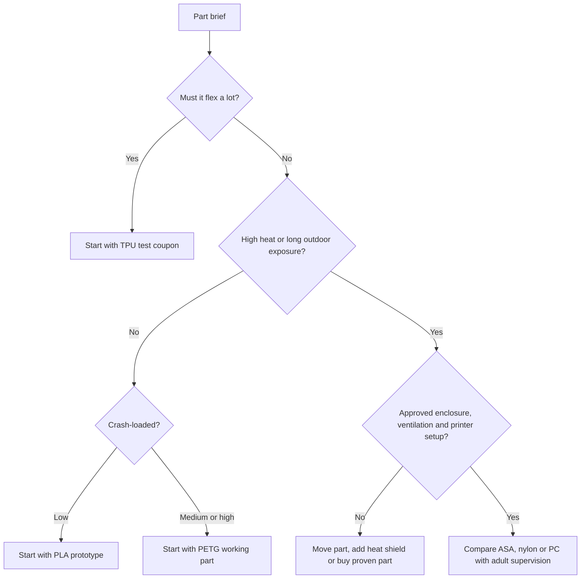

# Topic 2.6 - 3D Printing Materials

> **"The best material is not the strongest material.
> It is the material whose behaviour matches the job."**

---

# Learning Objectives 🎯

By the end of this topic you will be able to:

- Explain why “strong” is not enough information when choosing a material.
- Compare **stiffness**, **toughness**, flexibility, heat resistance and printability.
- Choose PLA, PETG or TPU for several real buggy parts.
- Explain why some advanced filaments need an enclosure, ventilation, drying or a special nozzle.
- Read a filament label and use the correct slicer profile.
- Store filament to reduce moisture problems.
- Design a fair test using identical material coupons.
- Build a keepable material-property sample board from household scraps.

---

# Before We Begin

Imagine choosing shoes for three different jobs.

For a school race, you might choose light trainers.
For a muddy walk, you might choose waterproof boots.
For standing on ice, you might choose shoes with soft, grippy soles.

It would make no sense to ask, “Which shoe is strongest?”

Strong against what?
Light enough for what?
Flexible where?
Safe at what temperature?

Materials work the same way.

A stiff plastic may hold the buggy’s receiver perfectly but crack in a hard collision.
A rubbery plastic may make an excellent bumper but a terrible motor mount.
A heat-resistant plastic may survive near the motor but be difficult to print without an enclosure.

In Topic 2.5, you learned to place material where a part needs it.
In this topic, you learn to choose what that material should be.

The buggy will not use one magic plastic.
It will use a small team of materials, each chosen for a reason.

---

# Why This Matters for Our Buggy

Our buggy will experience many different conditions:

- impacts from kerbs and jumps
- bending in suspension and brackets
- vibration from the drivetrain
- heat near the motor and ESC (the motor’s speed controller - Topic 3.6)
- sunlight and rain during outdoor use
- repeated tightening and removal of fasteners
- flexing of cable guides and bumpers

One material cannot be best at all of these.

A sensible first plan is:

```text
PLA  -> quick prototypes, fit checks and indoor learning parts
PETG -> many durable structural and general buggy parts
TPU  -> flexible bumpers, pads, guards and strain relief
```

More demanding materials may appear later, but only when a real requirement justifies the extra equipment and risk.

This follows our guiding principle: **one new difficulty at a time**.

---

# Material Is a Design Decision

Think about a drinking cup.

A paper cup, glass tumbler, steel camping mug and silicone cup can have almost the same shape.
Yet each behaves differently when dropped, squeezed, heated or packed into a bag.

The shape matters.
The material matters.
The way it was made matters too.

For a printed part, performance comes from four things working together:


A PETG bracket with a poor load path may fail before a well-designed PLA bracket.
A nylon part printed wet may perform worse than a dry PETG part.
A strong material printed in the wrong orientation may split between layers.

Do not use the material name as a replacement for engineering.

---

# “Strong” Is Not One Property

Suppose someone says, “This shelf is strong.”

Do they mean it will not bend?
Do they mean it will survive being hit?
Do they mean it will hold weight for five years?
Do they mean it will not soften in a hot room?

Engineers separate those questions into **material properties**.

A **material property** is a measurable way a material behaves, such as how easily it bends, stretches, cracks or softens.

For our buggy, the most useful properties are:

| Property | Plain-language question | Buggy example |
|---|---|---|
| Stiffness | How hard is it to bend? | Does the steering mount flex? |
| Toughness | How much damage can it absorb before breaking? | Does the bumper survive a crash? |
| Strength | How much load can it carry before failing? | Does the motor mount hold its bolts? |
| Elasticity | Does it spring back after bending? | Does a flexible guard return to shape? |
| Heat resistance | Does it keep its shape when warm? | Does a mount soften near the motor? |
| Creep resistance | Does it slowly change shape under a constant load? | Does a battery strap mount sag over months? |
| UV resistance | Does sunlight damage it? | Can an outdoor body mount remain reliable? |
| Printability | How easily can our printer make it well? | Does it need an enclosure or very dry filament? |

You do not need the material with the highest score in every row.
You need the material whose useful properties match the part brief.

---

# Stiffness

Hold a wooden ruler at one end and push the other end sideways.

Now do the same with a rubber strip of similar size.

The ruler resists bending more.
It is more **stiff**.

**Stiffness** is resistance to bending or changing shape under a load.

A stiff material is useful when movement would cause poor control or misalignment.

Buggy parts that often need stiffness include:

- steering-servo mounts (the servo steers the front wheels - Topic 3.5)
- bearing supports
- drivetrain alignment brackets
- chassis sections
- sensor mounts

But stiffness is not the same as toughness.
A dry twig is stiff and still snaps easily.

> **[F3 right-versus-wrong array - Figure 2.6.1: two panels testing the same idea. Left: a dry twig and a steel ruler side by side, both barely bending under a hand load, both labelled stiff. Right: the twig snapped clean in two while the ruler has sprung back unharmed, labelled brittle and tough. A caption strip beneath reads: stiffness is how much it bends, toughness is what happens next]**
>
> *Figure 2.6.1 - Stiff and strong are not the same word. The twig wins on stiffness and loses completely on toughness.*
>
> *Alt text: A dry twig and a steel ruler shown barely bending, then the twig snapped while the ruler springs back.*

---

# Toughness

Drop a ceramic mug and a plastic washing-up bowl from the same low height.

The mug may be harder and more rigid.
The bowl is more likely to bounce and survive.

**Toughness** is the ability to absorb energy and damage before breaking.

Tough materials are useful for:

- bumpers
- skid plates
- wheel guards
- parts near crash zones
- clips that may be knocked

A tough part may bend visibly and still be doing its job.

> **🤔 Think about it.**
> Hold a dry spaghetti strand and a rubber band.
> Which feels stiffer?
> Which would survive being bent around your finger?
> Does “stiffer” mean “better” for every job?

The spaghetti is stiff but brittle.
The rubber band is flexible and tough in a different way.
The correct choice depends on the job.

> **[F7 comparison array - Figure 2.6.2: a four-column array of the same small test bar made from four imaginary materials, each column showing what happens under the same load: stiff and brittle (barely bends, then snaps), stiff and tough (barely bends, then deforms), flexible and elastic (bends far, springs back), soft and tough (bends far, stays bent). Each column has a small buggy part icon showing where that behaviour is wanted]**
>
> *Figure 2.6.2 - Four different behaviours, none of them simply better - each is right for a different buggy part.*
>
> *Alt text: Four columns comparing stiff-brittle, stiff-tough, flexible-elastic and soft-tough behaviour under the same load.*

---

# Brittleness

A crisp biscuit can hold its shape until the moment it snaps.

It gives little warning and little bending.

**Brittleness** is the tendency to break with little bending or stretching first.

Brittleness is not always bad.
A rigid prototype can be useful because dimensions remain steady and failure is easy to see.

It becomes a problem when a part must survive impacts, repeated flexing or cold conditions.

PLA can behave more brittlely than PETG or TPU, especially in thin crash-loaded features.
That does not make PLA useless.
It means we choose its jobs carefully.

---

# Elasticity

Stretch an elastic band gently, then release it.

It returns close to its original shape.

**Elasticity** is the ability to return towards the original shape after a load is removed.

An elastic bumper can absorb an impact and spring back.
A flexible cable guide can move aside during assembly and return afterwards.

Do not confuse elastic with soft.
Some stiff materials spring back after tiny bends.
TPU can spring back after much larger bends.

If a part stays permanently bent, the load went beyond its useful elastic range or the material slowly changed shape.

---

# Creep: The Slow Failure

Press your thumb into a sponge for one second and it springs back.

Leave a heavy book on soft foam for a month and the dent may remain.

**Creep** is slow, permanent change of shape while a material carries a load for a long time.

Nothing dramatic has to happen.
The part can change quietly.

Creep matters in printed buggy parts such as:

- battery clamps kept tight for weeks
- motor mounts held near heat
- suspension parts carrying the buggy’s weight in storage
- screw joints that crush soft plastic
- belt or strap tensioners

A part that passes a five-second hand test may still fail a five-week duty.

> **🤔 Think about it.**
> Bend a plastic ruler gently for one second and release it.
> Now imagine storing it bent under books for six months.
> Why might the result be different even though the load never increased?

Time is part of the test condition.
Heat often makes creep happen faster.
This is why long-term load and temperature belong in the part brief.

> **[F4 sequence strip - Figure 2.6.3: four panels of the same printed bracket holding a battery, labelled day 1, week 1, month 1 and month 3. The bracket is identical in panel 1 and sags progressively further in each later panel, with a dashed line marking its original position and the growing gap dimensioned. A small thermometer icon in the corner shows a warm environment throughout]**
>
> *Figure 2.6.3 - Creep is failure in slow motion - the part passes every test on the day it is made, then quietly gives up.*
>
> *Alt text: Four panels showing a printed bracket sagging progressively over three months under constant load.*

---

# Heat Resistance

A chocolate bar can feel solid on a cool table and turn soft in a warm pocket.

The material did not disappear.
Its behaviour changed with temperature.

Printed plastics also become softer as they get warmer.
The exact behaviour depends on the material, brand, print settings, load and test method.

For our decisions, use a simple question:

> Will this part stay stiff enough at the hottest temperature it will actually experience?

Possible heat sources on the buggy include:

- the motor
- the ESC (the module that controls power to the motor - Topic 3.6)
- direct summer sunlight
- a closed car boot
- friction near rotating parts
- a hot printer enclosure during manufacturing

PLA is easy to print but can soften at temperatures a dark car interior may reach.
PETG usually keeps useful shape at higher temperatures than ordinary PLA.
ASA, ABS, nylon and polycarbonate may offer greater heat capability, but they add printing difficulty and safety requirements.

Never choose a material from a single impressive temperature printed on a shop page.

> **📚 Learn more**
>
> - Prusa Knowledge Base: search "material table" - the manufacturer's own comparison of printing temperatures, strengths and what each filament is actually for
> - Your filament's own spool label and data sheet - the only source that describes the exact plastic in your printer
Check the manufacturer’s technical information and test the actual part under controlled conditions.

---

# UV and Weather Resistance

Leave some plastics in sunlight for months and they fade, chalk or become weaker.

**UV resistance** is a material’s ability to resist damage from ultraviolet light in sunlight.

This matters for buggy parts that live outdoors or sit near a sunny window.

ASA is known for better outdoor and UV performance than ABS.
PETG is often a practical outdoor choice for hobby parts.
PLA can still work for short outdoor sessions, but long exposure and heat are not its strongest jobs.

Water itself may not immediately destroy common filament, but moisture can affect stored filament before printing and dirt can enter joints after use.

Outdoor suitability is a system question, not only a filament question.

---

> **☕ Good place to pause.**
> Look at three plastic objects around you.
> Decide which property each object seems to value most.
> The next section meets the material families we may use.

---

# Thermoplastics: Plastic That Can Melt Again

Warm modelling clay, butter or chocolate and it becomes easier to shape.
Cool it and it firms again.

A **thermoplastic** is a plastic that softens when heated and hardens when cooled.

FDM filament is thermoplastic.
The printer heats it, pushes it through the nozzle and lets it cool into a new shape.

This is different from a material that cures through a one-way chemical reaction.

The ability to soften again is useful for printing, but it also explains why a finished part can lose stiffness near heat.

Common FDM thermoplastics include:

- PLA
- PETG
- TPU
- ABS
- ASA
- polyamide, usually called nylon
- polycarbonate, usually shortened to PC

Each family can contain many recipes.
Two spools labelled PETG may not print or behave identically.
Brand, colour, additives and manufacturing quality can all make a difference.

Treat the label as a family name, not a complete test report.

---

# PLA - The Learning Material

PLA is like the squared paper of 3D printing.

It is easy to start with, holds detail well and makes design mistakes visible quickly.

> **[F1 annotated photograph - Figure 2.6.4: a printed PLA test bracket photographed at an angle, with callouts on what PLA does well and badly: crisp corners and clean detail marked as strengths, a clean flat snap across a layer line marked brittle, and a slumped edge on a part left in a sunny window marked low heat resistance]**
>
> *Figure 2.6.4 - PLA tells you the truth about your design quickly, because it fails cleanly rather than bending out of shape.*
>
> *Alt text: A printed PLA bracket with callouts on crisp detail, a clean brittle break, and a heat-slumped edge.*

## What PLA is good at

PLA is usually:

- easy to print
- low in warping
- stiff
- good at sharp detail
- widely available
- suitable for fast prototypes
- useful for checking fits and dimensions

For our buggy, PLA is excellent for:

- test coupons
- packaging mock-ups
- drilling templates
- indoor electronics mounts
- fit-check versions
- jigs used during assembly
- visual models

## Where PLA struggles

Ordinary PLA is often:

- more brittle in impacts than PETG or TPU
- less suitable near heat
- less forgiving for snap fits that bend repeatedly
- risky for parts left in a hot car

A thick, well-designed PLA part can still be strong.
A thin, sharp-cornered PLA part in a crash zone may fail quickly.

## The VoltForge rule for PLA

```text
Use PLA to learn cheaply and quickly.
Do not automatically trust it for heat or repeated impacts.
```

PLA is not “only for toys”.
It is a useful engineering material when its properties match the requirement.

---

# PETG - The General Buggy Material

Imagine the difference between a brittle clear food container and a tougher reusable storage box.

PETG often gives a useful middle ground: still fairly easy to print, but tougher and more heat-tolerant than ordinary PLA.

## What PETG is good at

PETG is commonly chosen for:

- functional brackets
- battery trays
- electronics mounts
- guards and covers
- chassis modules
- parts that may experience knocks
- parts needing better heat resistance than PLA

PETG is usually tougher than PLA and can bend more before breaking.
It is a strong candidate for many final buggy parts.

## Where PETG needs care

PETG can:

- produce more strings between features
- stick very strongly to some build surfaces
- show less crisp detail than PLA
- flex more than PLA in the same shape
- absorb some moisture during storage

More flexible does not always mean better.
A PETG steering mount that flexes may reduce steering accuracy even if it never snaps.
The answer may be a better shape, thicker ribs or a different material.

## The VoltForge rule for PETG

```text
Use PETG for many durable working parts.
Check stiffness, surface choice and moisture before blaming the design.
```

Always use the build-surface instructions from your printer manufacturer.
Some printer sheets need a separating layer for PETG because the bond can be too strong.

---

# TPU - The Flexible Material

Think of a trainer sole, phone case or soft cable strain relief.

These parts need to bend, grip and absorb energy.

TPU stands for thermoplastic polyurethane.
It is a flexible filament family used when bending is the job, not a defect.

> **[F7 comparison array - Figure 2.6.5: three flexible samples side by side, each being squashed by the same finger pressure: a shore 95A sample barely deforming, an 85A sample deforming clearly, and a very soft grade deforming a lot. Beside each, a familiar object at roughly the same hardness - a skateboard wheel, a shoe sole and a pencil eraser. A note marks 95A as the easiest to print]**
>
> *Figure 2.6.5 - The Shore number is a rough feel, not a full specification - but it tells you which grade will be kind to a beginner.*
>
> *Alt text: Three TPU samples of different Shore hardness being squashed, compared with a skateboard wheel, shoe sole and eraser.*

## What TPU is good at

TPU can be useful for:

- bumpers
- impact pads
- cable strain relief
- protective boots
- flexible dust guards
- tyre experiments
- anti-rattle pads
- soft battery cushions

TPU can absorb crash energy and return towards its original shape.

## Shore hardness

Not all TPU is equally soft.

A pencil eraser, shoe sole and skateboard wheel are all rubbery, but they feel different.

**Shore hardness** is a scale used to describe how resistant a soft material is to indentation.
For flexible filament, you may see labels such as `95A` or `85A`.

Within the same scale, a lower number usually means softer and more flexible.
A `95A` TPU is often easier for beginners than very soft grades.

The number does not describe every property.
Two 95A materials can still print differently.

## Where TPU needs care

Flexible filament can:

- buckle in the filament path
- require slower printing
- string heavily
- be difficult in printers that push filament through a long guide tube
- make dimensions and holes less crisp
- grip build surfaces strongly
- absorb moisture

Use a manufacturer profile and begin with a small test.

## The VoltForge rule for TPU

```text
Use TPU where controlled flex, grip or impact absorption is required.
Do not use it for a part that must hold alignment rigidly.
```

A TPU bumper and PETG bumper are not simply two strengths of the same idea.
They manage impact differently.

---

# ASA and ABS - Heat and Enclosure Territory

ABS is used in many manufactured plastic products.
ASA is related to ABS but is usually preferred where outdoor UV and weather resistance matter.

Both can offer useful toughness and heat resistance.
They can also warp strongly as they cool.

That makes an enclosure important for larger or more demanding parts.

## Possible buggy jobs

ASA may suit:

- outdoor body mounts
- sun-exposed covers
- warm enclosures
- parts that need more heat resistance than PETG

ABS may suit:

- enclosed-printer functional parts
- parts where its post-processing or material behaviour is specifically useful

For our beginner build, neither is the default choice.
PETG can answer many of the same early questions with less difficulty.

> **⚠️ SAFETY**
>
> ASA and ABS can release fumes and very small airborne particles during printing.
> Only print them with a responsible adult, suitable ventilation and the printer manufacturer’s recommended enclosure or filtration setup.
> Do not place an enclosed printer in a bedroom or other occupied small room.
> Ventilation must not create a cold draught across the print, because that can increase warping.
> Never improvise a flammable enclosure around a hot printer.

## The VoltForge rule for ASA and ABS

```text
Use only when heat, weather or another clear requirement justifies them.
Treat enclosure and air management as part of the process, not optional accessories.
```

---

# Nylon - Tough but Thirsty

A nylon cable tie can bend sharply, survive vibration and resist repeated use better than many rigid plastics.

Printed nylon can offer excellent toughness and useful wear resistance.
It can suit gears, hinges, clips and demanding mechanical parts when printed correctly.

But nylon is strongly **hygroscopic**.

A hygroscopic material pulls moisture from the surrounding air.
Think of dry cereal left open in a humid kitchen: it quietly loses its crispness.

Wet nylon may hiss, pop, bubble or create rough surfaces as water turns into steam in the hot end.
It can also lose strength and layer quality.

Nylon often needs:

- careful drying
- dry storage
- printing from a dry box
- an appropriate build surface
- controlled temperatures
- good ventilation or enclosure practice

Some nylons also warp strongly.

For our beginner buggy, nylon is a later material, not a shortcut around weak design.

---

# Polycarbonate - High Performance, High Demands

Polycarbonate is used when high impact and heat performance are important.

It may suit demanding technical parts, but it commonly needs:

- high nozzle temperature
- high bed temperature
- an enclosure
- dry filament
- careful build-surface preparation
- a printer whose hot end is approved for the required temperature

It can warp and is not usually the sensible first material for an 11-year-old’s home workshop.

The guiding principle applies again:

> Do not buy difficulty before the project needs it.

A well-designed PETG part should be tested before moving to polycarbonate.

> **☕ Good place to pause.**
> You have now met the main and advanced filament families.
> The next section turns their differences into a repeatable selection method.

---

# Composite Filaments

Concrete contains stone mixed into cement.
Plywood contains layers arranged to change how the sheet behaves.
A material made from two or more different materials is a **composite**.

Many 3D printing composites use a base plastic filled with short carbon, glass, wood or metal particles.

Carbon- or glass-filled filament may offer:

- greater stiffness
- reduced warping in some formulations
- a different surface finish
- improved dimensional stability

It does not automatically make every printed part tougher.
Some filled materials become more brittle.
The short fibres do not cross layer boundaries like long fabric fibres in a racing-car body panel.
Layer orientation still matters.

Filled filaments can also be **abrasive**.

An abrasive material wears surfaces through rubbing, like fine sandpaper.
Carbon fibre, glass fibre and glow-in-the-dark additives can wear a soft brass nozzle.

> **⚠️ SAFETY**
>
> Use fibre-filled or metal-filled filament only with an adult and with printer parts approved by the manufacturer.
> Many require a hardened nozzle and some require an enclosure or filtration.
> Avoid sanding fibre-filled prints unless the manufacturer’s safety instructions, dust control and suitable PPE are in place.
> Never assume “carbon fibre” means safe, lightweight or stronger in every direction.

## The VoltForge rule for composites

```text
Use composites only after a plain material has revealed a real limitation.
Upgrade the nozzle and safety setup before the spool.
```

---

# The Working Material Set

The handbook’s early buggy stages can be built with a small material set.

| Material | Main character | Best early jobs | Main caution |
|---|---|---|---|
| PLA | Stiff and easy | Prototypes, coupons, jigs, indoor mounts | Brittle impacts and low heat resistance |
| PETG | Tough general-purpose | Trays, brackets, guards, chassis modules | Stringing, flex and strong bed adhesion |
| TPU 95A | Flexible and impact-absorbing | Bumpers, pads, strain relief | Slow printing and less accurate features |

Everything else is an upgrade path, not a shopping list.

A learner with one spool of PLA can still complete almost every exercise in this topic.

---

# The Signature Visual - A Property Map

Imagine a map with stiffness from left to right and impact absorption from bottom to top.

PLA would sit towards the stiff side but lower in impact absorption.
PETG would sit somewhat less stiff and higher in toughness.
TPU would sit far towards the flexible side and high in its ability to deform and absorb impact.

ASA, nylon and polycarbonate would occupy other regions depending on their exact formulation.

> **[Signature visual, F7 comparison array - Figure 2.6.6: a two-axis material map. The horizontal axis runs from flexible to stiff, the vertical from brittle impact response to high impact absorption. PLA, PETG and TPU appear as broad labelled regions rather than exact points, because print settings move them. Small notes read: geometry and print settings can move the result. Buggy icons place a receiver tray near PLA and PETG, a bumper near PETG and TPU, and a motor mount near PETG and the advanced heat-resistant materials]**
>
> *Figure 2.6.6 - Materials are regions, not points - which is why two prints of the same filament can behave differently.*
>
> *Alt text: A two-axis map of flexibility against impact absorption with PLA, PETG and TPU as broad regions and buggy parts placed on it.*

The regions are broad because material brands, additives, temperature and printing change the result.

The visual teaches the real lesson:

> Materials are not arranged from weak to strong.
> They occupy different behaviour spaces.

---

# A Material Selection Routine

Before choosing a filament, run this six-question routine.

## 1. What is the part’s main job?

Does it hold alignment, absorb impact, flex, protect, guide or insulate?

## 2. What is the worst realistic load?

A gentle indoor roll and a kerb impact are different duties.

## 3. What temperature will it experience?

Include motors, sunlight, storage and enclosed spaces.

## 4. Must it bend or stay rigid?

“Does not break” is not enough if it bends so much that steering changes.

## 5. Can our printer make this material safely and reliably?

Check nozzle, bed, enclosure, ventilation, filament path and build surface.

## 6. Can a cheaper prototype answer the question first?

Use PLA before spending time tuning an advanced material.



This is a starting route, not a law.
Testing decides.

---

# Worked Example - Choosing a Bumper Material

## The question

Which of PLA, PETG and TPU should we test first for a front bumper?

## What we know

The bumper must:

- absorb crash energy
- avoid snapping into sharp pieces
- survive normal outdoor warmth
- be printable on our beginner machine
- remain light

We decide that crash behaviour matters most.

## The rule

Give each requirement a weight from 1 to 3.
Then score each material from 1 to 5 for this specific job.

```text
Weighted score = weight × material score
Total = all weighted scores added together
```

These numbers are our engineering judgement, not universal material data.
They help us make the reasoning visible.

## The scores

| Requirement | Weight | PLA | PETG | TPU 95A |
|---|---:|---:|---:|---:|
| Absorb impact | 3 | 2 | 4 | 5 |
| Avoid brittle snap | 3 | 2 | 4 | 5 |
| Hold basic shape | 2 | 5 | 4 | 2 |
| Easy to print | 1 | 5 | 4 | 2 |
| Low mass | 1 | 4 | 4 | 4 |

## The calculation

For PETG:

```text
Impact:           3 × 4 = 12
Avoid snap:       3 × 4 = 12
Hold shape:       2 × 4 =  8
Easy to print:    1 × 4 =  4
Low mass:         1 × 4 =  4
PETG total              = 40
```

For TPU 95A:

```text
Impact:           3 × 5 = 15
Avoid snap:       3 × 5 = 15
Hold shape:       2 × 2 =  4
Easy to print:    1 × 2 =  2
Low mass:         1 × 4 =  4
TPU total               = 40
```

PLA scores:

```text
Impact:           3 × 2 =  6
Avoid snap:       3 × 2 =  6
Hold shape:       2 × 5 = 10
Easy to print:    1 × 5 =  5
Low mass:         1 × 4 =  4
PLA total               = 31
```

## What the result means

PETG and TPU tie, but they would make different bumpers.

PETG suits a firmer bumper that spreads the load into the chassis.
TPU suits a flexible bumper that deforms to absorb energy.

The score does not choose the winner.
It identifies the two materials worth testing.

Our next action is not to argue about the table.
It is to print identical bumper coupons in PETG and TPU and compare them fairly.

---

# Material Choice for Common Buggy Parts

| Buggy part | First prototype | Likely working material | Why |
|---|---|---|---|
| Receiver tray | PLA | PLA or PETG | Low load; stiffness and easy printing matter |
| Battery tray | PLA | PETG | Needs toughness, strap resistance and some heat margin |
| Front bumper | PLA shape check | PETG or TPU | Crash behaviour matters more than perfect detail |
| Cable strain relief | PLA fit check | TPU | Must bend without cutting into the wire |
| Servo mount | PLA | PETG, or a stiffer proven material if testing shows flex | Alignment matters; check stiffness |
| Motor mount | Card/PLA packaging model | Proven metal part or heat-capable printed design | Heat, alignment and screw load are demanding |
| Decorative body detail | PLA | PLA | Easy detail and low load |
| Outdoor antenna guide | PLA | PETG or ASA later | Repeated knocks and weather exposure |

Notice the motor mount row.

Our guiding principle says **buy precision, build structure**.
A proven metal motor mount may be safer, stiffer and cheaper than chasing a difficult filament.
Choosing not to print is also material engineering.

---

# Material, Geometry and Orientation Work Together

A material change is only one design lever.

Suppose a PETG bracket bends too much.
Possible responses include:

- switch to a stiffer material
- add a rib
- shorten the unsupported distance
- move the fastener
- increase wall thickness locally
- change print orientation
- split the load between two brackets
- use a metal insert or purchased bracket

The cheapest useful change may be geometry, not filament.

Suppose a PLA guard snaps along a layer line.
Changing to PETG may help, but first ask:

- Did the force pull layers apart?
- Was there a sharp corner?
- Was the wall only one or two extrusion lines thick?
- Did the screw crush the part?
- Was the part cold or already cracked?

A new spool cannot fix an unanswered failure.

> **☕ Good place to pause.**
> Choose one buggy part and name its most important material property.
> The next section explains why storage can change the material before printing even begins.

---

> **☕ Good place to pause.**
> You now know how to choose a material on evidence.
> What follows is how to keep it in the condition that evidence assumed.

---

# Moisture - The Invisible Ingredient

Leave a dry cracker uncovered in a humid room.

It pulls water from the air and becomes soft without looking dramatically different.

Many filaments do something similar.
They are hygroscopic to different degrees.

Moisture in filament reaches the hot end, turns into steam and disturbs the melted plastic.

Possible signs include:

- popping or crackling sounds
- tiny bubbles
- rough or cloudy surfaces
- extra stringing
- weak layer bonding
- uneven extrusion
- a print that changes quality during the job

Nylon and TPU are especially sensitive.
PETG can also show moisture problems.
PLA is less demanding but still benefits from sensible storage.

A new sealed spool is not guaranteed to be perfectly dry.
A spool that printed well last month may need drying today.

> **📚 Learn more**
>
> - Prusa Knowledge Base: search "drying filament" - which materials absorb water fastest and how to dry each one safely

> **[F3 right-versus-wrong array - Figure 2.6.7: two printed test strips photographed close up under the same light. Left, wet filament: a rough surface with visible pitting, small bubbles and fine strings between features, with a magnified inset of steam escaping the nozzle. Right, the same filament dried: smooth even lines, sharp edges, no strings. Both labelled with the same spool and the same settings]**
>
> *Figure 2.6.7 - Same spool, same settings, same printer - the only difference is the water the plastic had absorbed from the air.*
>
> *Alt text: Two printed strips from the same filament, one rough and stringy when wet, one smooth after drying.*

---

# Store Filament Like an Ingredient

Flour, tea and breakfast cereal are kept in closed containers because air and moisture change them.

Filament deserves the same habit.

A simple storage system includes:

- a resealable bag or sealed box
- fresh desiccant packs
- a label showing material and colour
- the date opened
- a record of drying
- protection from direct sunlight and heat

**Desiccant** is a moisture-absorbing material, often supplied in small packets.
It helps keep already-dry filament dry.
It does not always rescue a wet spool by itself.

Drying requires controlled heat appropriate to the exact filament and spool.
Too much heat can deform the filament or melt the spool.

> **⚠️ SAFETY**
>
> Never dry filament in a kitchen oven used for food unless the filament and appliance manufacturers explicitly approve that method.
> Use a purpose-built filament dryer or another adult-approved method with temperature control.
> Follow the filament maker’s temperature and time guidance.
> Keep dryers and printers on a stable, non-flammable surface with clear ventilation.

Do not copy a drying temperature from a different material.
PLA, PETG, TPU and nylon do not share one safe setting.

---

# The Spool Passport

Engineers need **traceability**: the ability to connect a result back to the material and process that produced it.

A spool can have a small passport in your notebook or on a tag.

```text
Material:          PETG
Brand and product: ______________________
Colour:            ______________________
Diameter:          1.75 mm
Date opened:       ______________________
Stored in:         ______________________
Last dried:        ______________________
Printer profile:   ______________________
Useful notes:      ______________________
```

For every important print, record:

- spool identity
- nozzle size and type
- layer height
- orientation
- key temperatures
- print date
- result

“PETG failed” is weak evidence.

“Blue Brand-X PETG, opened three months, not dried, printed upright, split at Layer 41” is evidence you can use.

Colour is part of the identity because pigments and additives can affect printing slightly.
Do not assume every colour from one range behaves exactly the same.

---

# Use Manufacturer Profiles First

A slicer profile is like a tested recipe.

Changing six ingredients before tasting the first cake makes troubleshooting almost impossible.

When trying a material:

1. Confirm the printer supports it.
2. Confirm the nozzle and build surface support it.
3. Choose the manufacturer’s material profile.
4. Read the spool label.
5. Print a small known test.
6. Change one setting at a time only when evidence demands it.

Temperatures printed in this handbook are examples, not commands.
The spool and printer documentation are the source of truth for the exact setup.

Do not choose the hottest possible setting because “hotter bonds better”.
Too much heat can increase stringing, sagging, fumes and poor detail.

---

# Nozzles Are Part of Material Choice

The filament does not travel through empty space.
It touches gears, tubes, the hot end and the nozzle.

A standard brass nozzle works well for many plain PLA, PETG and TPU filaments.
Abrasive filled materials can wear it wider over time.

A worn `0.4 mm` nozzle may quietly behave like a larger nozzle, changing line width and accuracy.

Before using a special filament, check:

- required nozzle material
- minimum nozzle diameter
- maximum hot-end temperature
- whether the extruder can feed flexible filament
- whether the build plate needs glue or a release layer
- whether the printer needs an enclosure or filtration

The correct spool with the wrong hardware is still the wrong setup.

---

# Sustainable Material Use

A plant-based origin does not make a printed object vanish safely in the garden.

PLA is often described as bio-based and industrially compostable under specific conditions.
That does not mean a failed PLA print should be placed in home compost or dropped into nature.

The most useful environmental actions in this project are simpler:

- prove the idea in card first
- print test coupons instead of full failed parts
- use sensible infill and walls
- reuse supports and scraps where a local recycling route accepts them
- keep designs modular so one broken part can be replaced
- label material waste rather than mixing everything together
- buy only materials with a planned job
- use refill systems where they work safely with your equipment

Waste avoided beats waste explained.

A durable PETG part used for years may be a better choice than three PLA parts that repeatedly soften or crack.
The life of the part belongs in the decision.

---

> **☕ Good place to pause.**
> Make a three-column page headed PLA, PETG and TPU.
> Add one likely buggy job and one caution under each.
> The next section turns material claims into fair tests.

---

# Test Materials, Not Stories

Filament packaging often uses impressive words:

```text
strong
professional
tough
engineering grade
high speed
carbon
premium
```

These words do not answer your part brief.

A useful test copies the real duty as closely as possible.

For a bumper, test impact and return to shape.
For a tray, test stiffness, fastener areas and heat exposure.
For a cable guide, test repeated flexing and wire protection.

One universal “strongest filament” test cannot choose every part.

---

# Fair Material Tests

Remember the fair-test pattern from Topic 1.9.

To compare materials, change the material and keep other important conditions as similar as possible.

## Independent variable

The thing deliberately changed:

```text
filament material
```

## Dependent variable

The measured result:

```text
maximum load before a chosen deflection
number of bends before cracking
distance a bumper deflects after an impact
mass of the printed coupon
```

## Control variables

Things kept the same:

- CAD geometry
- dimensions
- print orientation
- number of walls
- layer height
- infill pattern and percentage
- nozzle size
- test span
- load position
- test temperature
- measurement method

Some material profiles need different temperatures and speeds.
That is acceptable because each material must be printed correctly.
Record the differences.

The test is fair when the comparison question is clear and uncontrolled changes are minimised.

---

# The Three-Coupon Rule

One result can be luck.

Print at least three identical coupons from each material when the decision matters.

Why three?

- one may contain a hidden print flaw
- measurements always vary
- repeated results show whether the behaviour is consistent

Example result:

| Material | Coupon 1 | Coupon 2 | Coupon 3 | Pattern |
|---|---:|---:|---:|---|
| PLA | cracked at 18 bends | 20 | 19 | consistent brittle failure |
| PETG | whitened at 36 | 41 | 39 | more bends before damage |
| TPU | no crack at 100 | no crack | no crack | test needs a new stopping rule |

The TPU result does not mean “infinite strength”.
It means this bending test did not reach its useful failure condition.
A different test is needed.

---

# Test Coupon 1 - The Bend Bar

A simple bend bar is a rectangular strip with rounded ends.

Suggested starting geometry:

```text
Length:    100 mm
Width:      15 mm
Thickness:   3 mm
```

This is not a standard laboratory specimen.
It is a classroom comparison coupon.

Print every bar in the same orientation with the same layer direction.

Possible tests:

- support it between two blocks and add coins at the centre
- measure deflection under the same load
- bend it around the same cylinder
- count repeated bends to a chosen angle

Do not mix impact, bending and heat into one score.
Each test answers one question.

> **[F6 measured drawing - Figure 2.6.8: a dimensioned drawing of the bend bar test coupon, with its length, width and thickness called out, and a note that every bar must be printed in the same orientation with the same settings. A second small view shows the bar supported at both ends with a load applied at the centre, and the deflection dimension marked]**
>
> *Figure 2.6.8 - A coupon is only useful if every copy is identical apart from the one thing you are testing.*
>
> *Alt text: Dimensioned drawing of a bend bar coupon with a second view showing it supported at both ends under a centre load.*

---

# Test Coupon 2 - The Screw Pad

A material may survive bending and still fail around a fastener.

Create a flat pad with:

- one clearance hole chosen from your fit library
- a fixed edge distance
- room for the same washer
- a marked centreline

Test:

- whether the hole prints consistently
- whether tightening crushes the surface
- whether the edge splits
- whether the screw loosens after repeated light movement

Use the same screw, nut, washer and tightening method each time.

> **⚠️ SAFETY**
>
> Show an adult the coupon test before starting.
> Wear safety glasses when bending printed coupons or loading them to failure.
> Keep your face and hands out of the possible snap path.
> Use small loads and a tray to catch coins or washers.
> Stop if a fixture slips, cracks sharply or becomes unstable.

Failure testing should be controlled, not dramatic.

---

# Read the Failure Surface

The broken surface is a message.

Look for:

- a flat split along layer lines
- stretched or whitened plastic
- a crack from a sharp corner
- crushed material under a washer
- a hole tearing towards an edge
- a thin wall peeling away
- a void caused by poor extrusion

Possible interpretations:

| Evidence | Possible cause | Next useful change |
|---|---|---|
| Clean split between layers | Orientation or layer bonding | Rotate, tune profile or redesign load path |
| White stretched zone before break | Material yielded before failure | Check whether controlled flex is acceptable |
| Crack begins at sharp inside corner | Stress concentration | Add fillet, gusset or smoother transition |
| Surface full of bubbles | Wet filament | Dry and repeat before judging material |
| Screw head sinks into part | Local pressure or creep | Add washer, boss or harder insert |
| All coupons vary widely | Process not controlled | Check moisture, temperature and test method |

Do not throw away failed coupons immediately.
Label them and keep the most informative one in your material library.

> **[F1 annotated photograph - Figure 2.6.9: three broken coupon ends photographed close up at the same magnification. First, a brittle break: flat, glassy, layer lines clearly visible across the whole face. Second, a ductile break: stretched, whitened, necked down before parting. Third, a layer separation: the break follows one clean horizontal line with no material torn at all. Each has a callout naming what it proves]**
>
> *Figure 2.6.9 - The broken face is evidence - it tells you whether the material, the orientation or the print settings let you down.*
>
> *Alt text: Three broken coupon ends showing a flat brittle break, a stretched ductile break, and a clean layer separation.*

---

# A Buggy Material Decision Sheet

Use one page for each important part.

```text
Part: ______________________________________
Main job: __________________________________
Largest load: ______________________________
Impact duty: low / medium / high
Required behaviour: stiff / tough / flexible
Hottest expected condition: _______________
Outdoor exposure: none / occasional / long-term
Critical interface: ________________________
Printer limits: ____________________________
Cheapest valid prototype: __________________
Candidate materials: _______________________
Test coupon: _______________________________
Pass condition: ____________________________
Chosen material and reason: ________________
```

This page creates requirement traceability from the part’s job to the chosen material and test.

---

# Hands-On Activity 1 - Property Detective

*No special equipment needed.*

Choose five safe objects from around the home, such as:

- a cereal box
- an elastic band
- a plastic food lid
- a wooden pencil
- a foam sponge

Do not break valuable objects.
Observe only.

For each object, complete this table:

| Object | Stiff or flexible? | Tough or brittle? | Springs back? | Likely reason for material choice |
|---|---|---|---|---|
| Cereal box | | | | |
| Elastic band | | | | |

Then choose one object and answer:

> What would go wrong if this object were made from a very different material?

Example:

```text
A screwdriver handle made from soft foam would be comfortable,
but it would not transfer enough torque or hold the metal shaft securely.
```

You are practising material choice from the job backwards.

---

# Hands-On Activity 2 - Stiffness Is Not Toughness

*You need: one strip of ordinary paper, one strip of corrugated card and one elastic band.*

1. Hold each sample across the same gap between two books.
2. Press gently at the middle with one finger.
3. Rank the samples from most stiff to least stiff.
4. Bend each sample gently around a pencil.
5. Rank them by how well they survive and return.
6. Compare the two rankings.

Record:

```text
Most stiff: ______________________
Most able to bend and recover: ___
Did one sample win both tests? ___
```

The activity demonstrates why “strongest” is a poor material requirement.

---

# Hands-On Activity 3 - Choose the Buggy Material

*No printer needed.*

For each part below, choose PLA, PETG or TPU as the first material to test.
Write one property and one caution.

1. A quick drilling template used once.
2. A front bumper for low-speed crashes.
3. A receiver tray inside the chassis.
4. A soft pad under the battery.
5. A steering mount that must not flex.

There may be more than one sensible answer.
Your reason matters more than matching a hidden answer.

Example:

```text
Part: soft battery pad
Choice: TPU
Reason: it can compress and protect the battery from vibration
Caution: it must not trap heat or make the battery difficult to remove
```

---

# Hands-On Activity 4 - Make a Spool Passport

*You need: your engineering notebook or a small card.*

Choose one real spool or imagine the first spool you will buy.

Create the spool passport from this topic.
Add:

- a material symbol
- the date opened
- storage location
- printer profile name
- one successful setting
- one known caution

Attach the card to the storage box, not loose on the moving spool.

If you already print, photograph the spool label and keep the photo with your print notes.

---

# Hands-On Activity 5 - Compare Slicer Profiles

*Computer and slicer needed; no printer required.*

Load the same simple bend-bar model three times.

Assign:

- PLA profile to Copy A
- PETG profile to Copy B
- TPU profile to Copy C, if your slicer and printer support it

Do not print yet.

Compare:

- nozzle temperature
- bed temperature
- print speed
- cooling
- estimated time
- any printer warnings

Record what changed and why you think it changed.

The model is identical.
The process plan changes because the material behaves differently.

If your printer does not support TPU, record that as an engineering constraint rather than bypassing the warning.

---

# Hands-On Activity 6 - Printed Material Comparison

*Printer access required; adult supervision required.*

Use the same bend-bar CAD file for two materials you already own.
PLA and PETG are a useful comparison.

## Question

Which material produces the stiffer bar, and which survives more bending in our test?

## Independent variable

Filament material.

## Dependent variables

- centre deflection under a fixed small load
- number of repeated gentle bends before visible damage

## Control variables

- geometry
- print orientation
- layer height
- wall count
- infill
- test gap
- load
- bend angle
- room conditions

## Procedure

1. Print three bars from each material using approved profiles.
2. Label every bar immediately.
3. Store them in the same room for at least one hour before testing.
4. Place each bar across the same two supports.
5. Add the same small mass at the centre.
6. Measure or compare the deflection.
7. Remove the load and check whether the bar returns.
8. Perform the agreed repeated-bend test.
9. Photograph the first visible damage.
10. Compare the spread of results, not only the best coupon.

## Pass condition

Define the part requirement first.

Example:

```text
Receiver tray support:
Deflect less than 2 mm under the agreed load
and show no crack after 20 gentle bends.
```

A material can pass one requirement and fail another.

---

# Thinking Like an Engineer - Material Substitution

A drawing may specify PETG, but the workshop has only PLA.
Can you substitute it?

Sometimes yes.
Sometimes no.

A **material substitution** changes the specified material while trying to preserve the required function.

Before substituting, compare:

- stiffness
- impact duty
- heat
- weather
- creep
- layer bonding
- fit and shrink behaviour
- printer setup

Then decide whether to:

- use the substitute only for a prototype
- change the geometry
- lower the permitted load
- add a warning label
- repeat the validation test
- wait for the correct material

Changing from PETG to PLA without recording it is not a substitution plan.
It is an uncontrolled revision.

> **☕ Good place to pause.**
> The comparison tools are complete.
> The mini project now turns them into a physical material library for your workshop.

---

# Topic Mini Project - Material Behaviour Sample Board 🛠️

You will build a keepable board that compares several household materials by behaviour, not appearance.

The board will become the first page of your physical material library.

It will not tell you exact numbers for PLA, PETG or TPU.
It will train the decision habit that makes those numbers useful.

## What the artifact teaches

Your board will show that one sample can be:

- stiff but brittle
- flexible but not elastic
- soft but tough
- light but easily crushed
- strong in one direction and weak in another

That is the same thinking used to choose filament for the buggy.

## Materials

Use household and scrap materials only:

- a piece of corrugated card for the backing board
- ordinary paper
- cereal-box card
- corrugated-card strip
- aluminium foil folded into a strip
- fabric ribbon or an old clean cloth strip
- one or two elastic bands
- tape or glue
- pencil and ruler
- coins or identical metal washers for gentle loading
- two books or small boxes as supports

Do not buy anything specially.

> **⚠️ SAFETY**
>
> Show a responsible adult or guardian what you plan to build before starting, and build with them nearby.
> Use only clean, safe scrap materials approved by the adult.
> Ask the adult to handle any difficult cutting.
> Aluminium-foil edges and cut card can be sharp, so fold edges inward and work slowly.
> Use only small coin loads, keep the test low over a tray or floor, and never stack heavy books on the samples.

> **🎬 Watch the build**
>
> - NASA STEM - search “Assessing Structural Integrity Activity” to see simple materials tested under controlled loads.
> - BBC Bitesize - search “properties of materials” to review why different jobs need different material behaviour.
> - YouTube - search “paper bridge engineering challenge coins” and watch with an adult before starting.

## Step 1 - Prepare the board

Cut or tear a backing board roughly the size of an A4 sheet.

Write the title:

```text
VOLTForge MATERIAL BEHAVIOUR LIBRARY - BOARD 1
```

Divide the board into five sample spaces.

Label the spaces:

1. paper
2. cereal-box card
3. corrugated card
4. folded foil
5. fabric or elastic

Leave room below each sample for test results.

## Step 2 - Make equal test strips

Make each solid strip approximately:

```text
Length:  150 mm
Width:    25 mm
```

The fabric or elastic sample may be narrower if that is what you have.
Record the real size.

Try to keep the test strips similar so the comparison is not completely controlled by geometry.

Do not glue the strips to the board yet.

## Step 3 - Predict

Before testing, rank the samples for:

- stiffness
- ability to bend without damage
- ability to spring back
- resistance to tearing

Write your predictions lightly in pencil.

A prediction makes the test more than a demonstration.
It gives your evidence something to challenge.

## Step 4 - Stiffness test

Place two books `100 mm` apart.

Lay one strip across the gap.
Place one coin at the centre.

Observe the bend.

Add coins one at a time up to a small adult-approved limit.

Do not push the sample to a sudden dangerous snap.

Score stiffness:

```text
1 = bends a great deal
2 = bends clearly
3 = medium
4 = bends slightly
5 = hardly bends in this test
```

Use the same gap and coin position for every sample.

## Step 5 - Bend survival test

Wrap each strip gently around the same pencil.

Release it.

Record:

- returned close to flat
- stayed bent
- creased
- tore
- cracked
- could not be wrapped safely

This is not the same test as stiffness.
Do not combine the observations too early.

## Step 6 - Direction test

Corrugated card and fabric may behave differently in different directions.

Test the corrugated strip with its flutes running along the gap.
Then rotate or make a second strip with flutes across the gap.

Test fabric along and across its weave if possible.

Record the difference.

You have demonstrated anisotropy from Topic 2.2 without a printer.

## Step 7 - Impact-survival observation

Hold each sample just above the table and drop one coin onto its centre from a fixed small height, such as `100 mm`.

Use the same coin and height.

Observe:

- dent
- bounce
- crease
- tear
- no visible change

This is a gentle comparison, not a destructive impact test.

## Step 8 - Build the display

Tape one end of each tested sample to the board so the sample can still be lifted and flexed.

Do not glue the entire strip flat.
The board should remain interactive.

Below each sample, add a small property card:

```text
STIFFNESS:          __ / 5
BEND SURVIVAL:      __ / 5
SPRINGS BACK:       yes / partly / no
DIRECTION MATTERS:  yes / no / not tested
BEST JOB:           __________________
POOR JOB:           __________________
```

## Step 9 - Add buggy roles

Assign each household sample a pretend buggy role based on behaviour.

Examples:

- stiff card -> temporary electronics tray
- corrugated card -> early chassis mock-up
- elastic -> temporary retention only
- fabric -> flexible dust flap
- folded foil -> heat-reflection demonstration, not a structural mount

Explain why each role is temporary or limited.

Your sample board is not permission to place household materials beside hot or moving buggy parts.
It is a thinking model.

## Step 10 - Add the filament bridge

At the bottom of the board, write:

```text
HOUSEHOLD BEHAVIOUR        FILAMENT QUESTION
stiff card                 Would PLA or PETG hold alignment better?
elastic band               Would TPU flex and return?
corrugated card direction  How will print layers change the result?
foil near heat              Which real part needs heat resistance?
```

This reflection connects the artifact to 3D printing.

## Step 11 - Reflection

Answer these questions in your notebook:

1. Which sample was stiffest?
2. Which survived bending best?
3. Did the stiffest sample also survive bending best?
4. Which sample changed most when rotated?
5. Which filament property would you test for a buggy bumper?
6. Which property would you test for a servo mount?
7. What did this project fail to measure?

Important limitations include:

- samples had different thicknesses
- household materials are not filament
- scores were observational
- temperature was not tested
- long-term creep was not tested
- the loading was small

Recognising limitations makes the project more scientific, not less successful.

## Step 12 - Keep the artifact

Write your name, date and `Revision A` on the back.

Keep the board on your showcase shelf or workshop wall.

When you print real PLA, PETG and TPU coupons, add labelled samples beside it.
Your material library can grow with the buggy.

---

# Stop Point Before Buying More Filament

Do not buy five special spools because the names sound advanced.

Before the next purchase, you should know:

- which real part needs the material
- which property the current material failed
- whether geometry or orientation could fix it
- whether your printer supports the new filament
- whether a new nozzle, enclosure or dryer is required
- how you will test the improvement
- how the remaining spool will be stored and used

A purchase passes the stop point only when it unlocks a planned experiment.

For most learners, the sensible path is:

```text
1 spool PLA
-> prove fit and workflow
-> 1 spool PETG for durable parts
-> small amount of TPU when a flexible part appears
-> advanced material only after evidence
```

---

# Common Beginner Mistakes ❌

## Mistake 1 - Asking for the strongest filament

Strength is not one behaviour.
Name the load, temperature, movement and failure you care about.

## Mistake 2 - Using PLA for a hot part because the prototype fitted

Fit at room temperature does not prove survival near a motor or in a hot car.
Test the real duty or choose a more suitable material.

## Mistake 3 - Choosing TPU for every crash-loaded part

TPU absorbs impact but may flex too much to hold alignment.
A bumper and a steering mount have different jobs.

## Mistake 4 - Upgrading material before fixing geometry

A sharp corner and poor load path can defeat an expensive filament.
Read the failure first.

## Mistake 5 - Printing wet filament and blaming the brand

Popping, bubbles, rough extrusion and weak layers may be moisture evidence.
Dry and repeat before judging.

## Mistake 6 - Copying one temperature from the internet

Use the spool label, printer documentation and tested profile.
Different formulations need different settings.

## Mistake 7 - Ignoring the build surface

PETG, TPU and high-temperature materials can need different adhesion or release methods.
Follow the printer maker’s instructions.

## Mistake 8 - Printing abrasive filament through an unsuitable nozzle

Carbon, glass and glow additives can wear brass.
Check hardware before loading the spool.

## Mistake 9 - Treating “carbon fibre” as a magic strength label

Filled filament may be stiffer but also more brittle.
It still has layer lines and directional behaviour.

## Mistake 10 - Buying every material at once

Unused spools absorb moisture and money.
Buy the next learning step, not the entire catalogue.

## Mistake 11 - Comparing different shapes and calling it a material test

If one bar is thicker, the geometry may dominate the result.
Use identical coupons and record controls.

## Mistake 12 - Keeping no material record

Months later, “the red filament” is not enough information.
Use a spool passport and label every coupon.

---

> **[F3 right-versus-wrong array - Figure 2.6.10: twelve compact rows of paired panels, one per mistake above, consistent viewing angle within each pair. Examples: a spool chosen from a shop headline figure beside one chosen against a written part brief; a wet spool printed straight from an open shelf beside the same spool dried and stored with desiccant; a part swapped to a stronger material beside the same part reoriented instead; an untested claim copied from a forum beside a printed coupon being measured]**
>
> *Figure 2.6.10 - Every pair is the same decision made twice - the difference on the right is evidence rather than a headline.*
>
> *Alt text: Twelve right-versus-wrong pairs covering material choice, drying, storage, orientation, testing and reading failures.*

# Topic Summary 📝

In this topic we learned that:

- A material is chosen for a job, not for a single “strong” label.
- **Stiffness** resists bending, while **toughness** describes damage absorbed before breaking.
- **Brittleness**, **elasticity**, heat, weather and **creep** can matter as much as short-term strength.
- PLA is the easiest learning and prototype material, but ordinary PLA needs care around impacts and heat.
- PETG is a useful general material for many durable buggy parts, although it can flex, string and stick strongly to some surfaces.
- TPU is for controlled flexibility, grip and impact absorption, not rigid alignment.
- ASA and ABS need enclosure and air-management planning; nylon and polycarbonate add moisture and temperature demands.
- Composite filament can be stiff and dimensionally useful but may be abrasive and is not automatically tougher.
- Filament absorbs moisture, so sealed storage, desiccant, traceability and correct drying matter.
- A fair comparison changes material while keeping coupon geometry, orientation and test method controlled.
- The best upgrade is the one that solves an observed limitation.

---

# New Words 📖

| Word | Meaning |
|---|---|
| Material property | A measurable way a material behaves, such as how easily it bends, stretches or softens. |
| Stiffness | Resistance to bending or changing shape under a load. |
| Toughness | Ability to absorb energy and damage before breaking. |
| Brittleness | Tendency to break with little bending or stretching first. |
| Elasticity | Ability to return towards the original shape after a load is removed. |
| Creep | Slow, permanent change of shape while carrying a load for a long time. |
| Thermoplastic | Plastic that softens when heated and hardens again when cooled. |
| Shore hardness | A scale describing how resistant a soft or rubbery material is to indentation. |
| Hygroscopic | Able to pull moisture from the surrounding air. |
| Desiccant | A material used to absorb moisture inside a sealed container. |
| Composite | A material made by combining two or more different materials. |
| Abrasive | Able to wear another surface through rubbing, like fine sandpaper. |
| Material substitution | Replacing a specified material while checking that the required function is still met. |
| Traceability | The ability to connect a result back to the exact material and process that produced it. |

---

# Review Questions ❓

1. Why is “strongest filament” not a complete engineering requirement?
2. What is the difference between stiffness and toughness? Give one buggy part that needs each.
3. Why can a part pass a short hand test but fail months later through creep?
4. Give two sensible uses for PLA and explain one situation where ordinary PLA needs caution.
5. Why might PETG suit a battery tray better than ordinary PLA?
6. Why is TPU useful for a bumper but usually poor for a steering-servo mount?
7. What extra safety and equipment checks appear before printing ASA, ABS or advanced engineering materials?
8. What does hygroscopic mean, and what signs can wet filament produce?
9. Why can carbon-, glass- or glow-filled filament require a hardened nozzle?
10. In a fair bend-bar comparison, name the independent variable, one dependent variable and four control variables.
11. A PLA bracket split cleanly along a layer line. What should you investigate before buying a more expensive filament?
12. Why is a purchased metal motor mount sometimes a better engineering decision than an advanced printed one?

---

# Topic Checklist ✅

- [ ] I can explain why stiffness and toughness are different.
- [ ] I can give examples of brittle, elastic and creep behaviour.
- [ ] I can choose sensible first jobs for PLA, PETG and TPU.
- [ ] I know why heat and sunlight belong in a material decision.
- [ ] I know that ASA, ABS, nylon, PC and composites need extra checks.
- [ ] I can explain why some filled filaments need a hardened nozzle.
- [ ] I can recognise common signs of wet filament.
- [ ] I made or planned a spool passport.
- [ ] I can identify the independent, dependent and control variables in a material test.
- [ ] I completed the Material Behaviour Sample Board mini-project.
- [ ] I recorded the limitations of my household-material comparison.
- [ ] I will not buy a new material without a part, property and test plan.

---


# Looking Ahead 🔭

Choosing the material is only half the connection.

The part still needs screws, nuts, washers, drivers, clamps and the correct way to tighten them.

In Topic 2.7 - **Hand Tools and Fasteners**, we will meet the tools that grip, turn, hold and assemble our buggy.
We will learn why an M3 screw is not “just a small screw”, how washers spread force into printed plastic, why driver fit matters, and how to build joints that can be removed without destroying the part.

---

# Answers 🔑

1. Because it does not say strong against what. A material can resist bending, impact, heat, wear or long-term load, and no filament wins at all of them. A requirement has to name the job, the loads and the conditions before "strongest" means anything.
2. Stiffness is how much a material bends under load; toughness is how much energy it absorbs before breaking. A chassis plate wants stiffness so it does not flex; a bumper wants toughness so it survives a crash.
3. Because creep is slow. A short hand test only shows the immediate response, but under constant load - especially when warm - the plastic keeps deforming for weeks. The part passes on day one and sags by month three.
4. PLA suits prototypes, test coupons and indoor parts where detail matters. It needs caution anywhere warm - a part left in a car interior or in direct sun can soften and lose its shape.
5. Because a battery tray takes knocks, is near warm electronics, and must not crack around its strap slot. PETG bends rather than snapping and keeps useful shape at higher temperatures than ordinary PLA.
6. A bumper's job is to absorb impact by deforming, which is exactly what TPU does well. A servo mount's job is to hold the servo still, and a flexible mount lets the servo move under load - so the steering becomes vague and imprecise.
7. Ventilation and an enclosure, because these materials release more fume and need a stable warm environment; a printer that can reach the required temperatures; and often a hardened nozzle. Adult supervision and the Topic 2.1 rules apply throughout.
8. Hygroscopic means the material pulls moisture out of the air. Wet filament can print with a rough pitted surface, popping or hissing sounds, steam at the nozzle, stringing, bubbles and weak layer bonding.
9. Because the filler particles are abrasive. They wear a normal brass nozzle away from the inside, so the hole slowly grows and every dimension drifts. A hardened nozzle resists that wear.
10. Independent variable: the material. Dependent variable: the deflection under load, or the force at which the bar breaks. Control variables: the same printer, the same print orientation, the same layer height and walls, the same coupon dimensions, the same support points and the same load position.
11. Investigate the print orientation first, then wall count and infill around the break, then whether the filament was dry. A clean split along a layer line usually points at orientation, not at the material being too weak.
12. Because the mount holds a component that must stay precisely aligned while getting hot and vibrating. That is exactly what our guiding principles mean by buy precision, build structure - the money is better spent where accuracy matters most.
