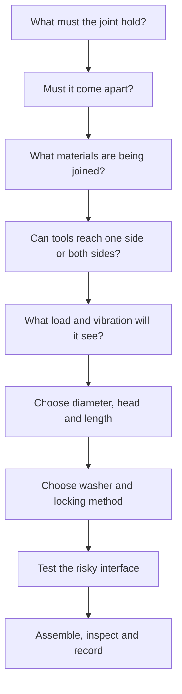

# Topic 2.7 - Hand Tools and Fasteners

> **"A tiny screw can hold a whole system together - or stop the whole system when it is damaged."**

---

# Learning Objectives 🎯

By the end of this topic you will be able to:

- Identify the hand tools most useful for assembling and servicing our buggy.
- Explain how a screw thread turns rotation into clamping movement.
- Read a name such as `M3 × 12` and understand what the numbers mean.
- Measure a fastener without guessing.
- Match a screw head to the correct driver profile and size.
- Start a screw straight and recognise cross-threading before damage occurs.
- Tighten a joint firmly without crushing plastic or stripping a thread.
- Choose between a through-bolt, captured nut, self-tapping screw and heat-set insert.
- Use washers and locking methods where vibration makes them useful.
- Build a reusable fastener training board from household and scrap materials.

---

# Before We Begin

Imagine assembling flat-pack furniture.

The box contains twenty panels, fifty screws and one tiny hex key.
Most of the parts are easy to understand.
The trouble begins when two screws look almost identical.

One is 30 mm long.
One is 35 mm long.

Use the short one in the wrong place and it barely reaches the thread.
Use the long one in the wrong place and it may burst through the other side.
Use the wrong end of the hex key and the screw head may round off before the furniture is even standing.

Our buggy has the same problem, only smaller.

A battery tray, servo mount, bumper and chassis module may all use screws only a few millimetres wide.
The buggy will vibrate, crash, collect dirt and need regular repairs.
Every joint must hold securely **and** come apart when we need to service it.

That is why hand tools and fasteners are not a small side topic.
They are the system that lets every other buggy system stay connected, aligned and replaceable.

---

# Why This Matters for Our Buggy

Remember the guiding principle **modular by default**.

A modular buggy needs parts that can be:

- fitted accurately
- removed without damage
- replaced without rebuilding everything
- tightened again many times
- checked after a test run

Glue can join parts, but glue often makes a decision permanent.
A screw creates a reversible decision.

That matters when:

- a suspension arm breaks
- a motor needs adjustment
- a servo must be replaced
- the electronics tray needs cleaning
- a battery size changes
- one printed module is revised

A well-chosen fastener turns a pile of parts into a serviceable machine.
A damaged or poorly chosen fastener can turn a five-minute repair into an afternoon of frustration.

---

# Fasteners: The Small Parts with a Big Job

A coat button, a zip and a shoelace all do a similar job.
They hold separate pieces together.

A **fastener** is a part used to join other parts.

Our buggy will use several fastener families:

| Fastener | How it holds | Useful buggy jobs |
|---|---|---|
| Screw or bolt | A spiral thread pulls parts together | Chassis, mounts, suspension, covers |
| Nut | Provides an internal thread for a screw or bolt | Through-joints and removable modules |
| Washer | Spreads load beneath a head or nut | Printed parts, slots and soft materials |
| Clip or pin | Blocks movement without a screw thread | Body posts, shafts and hinge pins |
| Cable tie | Loops and locks around parts | Wires, temporary mounts and prototypes |
| Hook-and-loop strap | Wraps around and releases repeatedly | Battery retention |

This topic concentrates on threaded fasteners: screws, bolts, nuts, washers and the hand tools used with them.

Pins, clips and straps will appear again when we assemble the real buggy.

---

# A Screw Is a Spiral Ramp

Walk up a steep hill and you gain height quickly, but the push feels hard.
Walk up a long, gentle ramp and you travel farther, but the climb feels easier.

A screw thread is a ramp wrapped around a cylinder.

The raised spiral ridge is the **thread**.
When you rotate the screw, the spiral moves the screw forward or backwards.


The distance from one thread ridge to the next is the **pitch**.

A fine pitch has thread ridges close together.
A coarse pitch has them farther apart.

For beginner buggy work, use the standard metric screws supplied with your parts.
Do not mix screws that look similar but have different pitches.
They may begin to enter and then damage each other.

> **[Signature visual: a normal ramp beside the same ramp wrapped around a screw. A second panel shows the screw head, external thread, two clamped plates, washer and nut, with arrows showing rotation becoming forward movement and clamp force.]**

---

# What Tightening Actually Does

When a screw turns into a nut or threaded hole, it does more than fill the hole.

The screw pulls its head and the nut towards each other.
The parts between them are squeezed together.

This squeezing is **clamp force**.

Clamp force is what normally stops the parts sliding apart.
The screw is not supposed to act like a loose pin rattling inside a hole.

Imagine pressing two books together between your hands.
If you squeeze gently, the books slide.
If you squeeze firmly, friction between the covers helps them stay aligned.

A tightened buggy joint works in a similar way.

The screw creates the squeeze.
The contact between the parts carries much of the working load.

> **🤔 Think about it.**
> Place two pieces of paper on a table.
> Press one finger lightly on top and try to slide the lower sheet.
> Now press harder and try again.
> What changed, even though you did not add glue or a pin?

The extra squeeze increased friction between the sheets.
A well-tightened joint uses clamp force and friction to help parts act like one assembly.

---

# More Tight Is Not Always More Secure

Here is the trap.

If some tightening is useful, it feels as though more tightening must be better.

It is not.

Too much tightening can:

- strip the screw head
- strip the thread
- crush a printed wall
- pull a nut through plastic
- split layers around a hole
- bend a thin metal bracket
- distort a bearing seat
- make future removal almost impossible

Remember Topic 2.6.
PLA, PETG and TPU do not behave like steel.
A printed part may slowly deform beneath a small screw head, especially when warm.

The aim is not “as tight as possible”.

> The aim is enough clamp force for the job, without damaging the joint.

---

# Torque: Turning Effort

Opening a jam jar is easier when the lid is large.
Pushing a door is easier near the handle than near the hinge.

In both cases, your hand acts farther from the centre of rotation.
The same force produces a bigger turning effect.

Engineers call this turning effect **torque**.

With a hex key, the long arm can create more torque than the short arm.
That is useful when loosening a stubborn screw.
It also makes overtightening easier.

For tiny buggy screws:

- use fingertips, not your whole arm
- use the short leverage you need, not the longest lever available
- stop when the parts are seated and the screw is firm
- use a proper torque driver only when a manufacturer gives a torque value

Do not add a pipe, pliers or another tool to lengthen a small hex key.
That improvised lever can destroy the fastener before you feel much resistance.

---

# The Four Jobs in Every Screw Joint

A successful screw joint answers four questions.

## 1. Where will the screw pass?

The parts need aligned holes.

A **clearance hole** is slightly larger than the screw, allowing the screw to pass through without cutting its own thread.

For a printed part, the correct designed size depends on your printer and fit library from Topic 1.7.
A nominal `Ø3.2 mm` or slightly larger hole is a common starting point for an M3 clearance hole, but your test coupon is the evidence that matters.

## 2. Where will the thread live?

The screw needs something threaded to pull against:

- a separate nut
- a captured nut
- a heat-set insert
- a metal component with a threaded hole
- a self-tapping screw forming a thread in plastic

## 3. Where will the clamp force spread?

A broad screw head or washer spreads force across more material.
A tiny head pressing directly into soft plastic concentrates the load.

## 4. Can a tool reach it?

A perfectly strong screw is useless if the driver cannot reach its head.
A nut is frustrating if it spins inside a hidden pocket.

Remember the packaging envelope from Topic 2.5.
The envelope must include the screw, the nut, the driver and your fingers.

---

# Reading a Metric Fastener Name

Our buggy will mainly use metric fasteners.

A typical label looks like this:

```text
M3 × 12 socket-head screw
```

It tells you:

```text
M3     -> thread diameter is about 3 mm
× 12   -> screw length is 12 mm
head   -> the shape and driver type at the top
```

The `M` means metric thread.

Common small sizes you may meet are:

| Size | Approximate thread diameter | Typical buggy use |
|---|---:|---|
| M2 | 2 mm | Tiny electronics, miniature linkages |
| M2.5 | 2.5 mm | Small mounts and some servos |
| M3 | 3 mm | Common chassis, brackets and RC hardware |
| M4 | 4 mm | Larger joints, wheels or heavy brackets |

These examples are not universal.
Use the size specified by the component, drawing or tested design.

An M3 screw will not correctly fit an M2.5 nut.
A near match is still a mismatch.

---

# Pitch Is Part of the Identity

Two screws can have the same outside diameter and different pitches.

Metric fasteners are often written with the pitch included:

```text
M3 × 0.5
```

This means:

```text
3 mm nominal thread diameter
0.5 mm between neighbouring thread ridges
```

The common coarse pitches used by many standard small metric fasteners include:

| Thread | Common coarse pitch |
|---|---:|
| M2 | 0.4 mm |
| M2.5 | 0.45 mm |
| M3 | 0.5 mm |
| M4 | 0.7 mm |

Do not memorise the table as permission to guess.
Use labelled storage, the original component instructions or a thread gauge where needed.

If a screw does not turn easily by hand for its first few rotations, stop.
It may have the wrong pitch or may be entering crookedly.

> **📚 Learn more**
> - Bossard Knowledge Hub - search “metric ISO threads” for the standard thread shape, pitch and tolerance tables.
> - Bolt Depot - open “Fastener Basics” for illustrated screw, nut and washer identification.
> - Bolt Depot - open “Thread Pitch and Thread Count” for a clear picture of metric pitch.

---

# How Fastener Length Is Measured

Most screw lengths are measured from the underside of the head to the tip.

A countersunk screw is different because its head sits inside the material.
Its stated length normally includes the head.

| Head style | Length usually starts from |
|---|---|
| Socket head, button head or pan head | Under the head |
| Countersunk or flat head | Top of the head |

> **[Sketch: side views of a socket-head screw and a countersunk screw. Dimension arrows show the socket-head length starting under the head and the countersunk length including the head.]**

Measure the actual fastener when identification matters.
Packaging can be mixed, labels can fall off and online descriptions can be wrong.

---

# Worked Example: Choosing Screw Length

## The question

Two printed plates must be joined with an M3 screw, one washer and a nut.
What screw length should we try first?

## Known values

```text
Top plate thickness      = 3.0 mm
Bottom plate thickness   = 2.5 mm
Washer thickness         = 0.5 mm
Measured nut thickness   = 3.0 mm
Extra thread beyond nut  = about 1.0 mm
```

## The rule

Add every thickness the screw must pass through or engage.

## The calculation

```text
Required length
= 3.0 + 2.5 + 0.5 + 3.0 + 1.0
= 10.0 mm
```

## The result

An `M3 × 10` screw is a sensible first choice.

Then assemble and inspect it.

The screw should fully engage the nut without projecting so far that it catches wires, fingers or moving parts.

A calculation chooses the first candidate.
A physical check verifies the real joint.

---

# Screw Head Shapes

The head shape affects tool access, height, load spreading and how the finished joint sits.

| Head shape | What it is like | Useful when | Watch out for |
|---|---|---|---|
| Socket head | Tall cylinder with internal hex | Strong general buggy joints | Needs height above the head |
| Button head | Low, rounded and broad | Covers, guards and low-profile areas | Smaller driver recess may strip sooner |
| Countersunk head | Cone-shaped underside sits flush | A flat surface is genuinely required | Can split printed layers or centre badly |
| Pan head | Broad, slightly rounded top | Electronics and general assemblies | Usually uses cross or Torx driver |
| Grub screw | No projecting head | Hubs, collars and gears | Easy to lose and easy to overtighten |

Do not choose a countersunk head just because it looks neat.

The cone pushes sideways as it tightens.
In a printed part, that sideways force can act like a wedge and split the material.

Use countersinks only when the design needs them and there is enough material around the hole.

For early buggy structures, a socket-head or button-head screw with a washer is often more forgiving.

---

# Driver Profiles: Shape Must Match Shape

The shaped recess in a screw head is the **driver profile**.

The tool tip must match both:

- the profile shape
- the profile size

Common profiles include:

| Profile | What you see | Typical tool |
|---|---|---|
| Internal hex | Six flat sides inside the head | Hex key or hex driver |
| Torx | Six rounded star points | Torx driver |
| Phillips | Simple cross | Phillips screwdriver |
| Pozidriv | Cross plus extra small marks | Pozidriv screwdriver |
| Slotted | One straight slot | Flat-blade screwdriver |

Phillips and Pozidriv look similar.
They are not the same profile.

Using the wrong cross-head driver reduces contact.
The tool climbs out, damages the recess and may slip towards your hand or the part.

The same problem happens with a hex key that is almost the right size.

`2.0 mm` and `5/64 inch` are close, but they are not interchangeable just because one enters the recess.

> The correct tool should sit deeply, with little wobble and contact across the full shape.

---

# The Tool-Fit Check

Before applying force:

1. Clean dirt from the screw recess.
2. Identify the profile.
3. Try the most likely size without turning.
4. Press the tool fully into the recess.
5. Rock it very slightly.
6. Choose another size if the fit feels loose.
7. Keep the driver in line with the screw while turning.

A loose fit is a warning, not an invitation to press harder.

If the screw head is already damaged, stop before making it worse.
Ask an adult to help choose a removal method.

Methods for damaged fasteners belong in troubleshooting, not in a first assembly attempt.

---

# Hex Keys and Hex Drivers

Hex socket screws are common on RC vehicles because the tool fits deeply and works well in small sizes.

Two common tool forms are:

- an L-shaped hex key
- a screwdriver-style hex driver

A screwdriver-style driver is often easier to keep straight and control with fingertips.
An L-key is cheap, compact and useful for reaching awkward places.

Some L-keys have a rounded **ball end**.
The ball end can turn a screw from a slight angle, which is helpful for access.

But the contact area is smaller.

Use the ball end for quick turning at low load.
Use the straight end for initial loosening and final tightening.

A worn hex key can damage every screw it touches.
Replace a key with rounded corners.

---

# Screwdrivers

A screwdriver has three jobs:

- match the profile
- stay aligned with the screw
- transfer controlled torque from your hand

Choose a handle that allows fingertip control for small screws.
A large handle can produce more torque than a tiny fastener needs.

Press along the screw axis while turning.
This keeps the tip seated.

Do not use a screwdriver as:

- a chisel
- a lever
- a hole punch
- a scraper near electronics

Misuse can damage the tip, the workpiece and your hand.

A damaged screwdriver then becomes a poor fastener tool too.

---

# Spanners, Sockets and Nut Drivers

A nut must often be held while the screw turns.

Useful tools include:

- an open-ended spanner
- a small socket and handle
- a nut driver

A nut driver looks like a screwdriver with a small socket at the end.
It is easy to control on small nuts.

Choose the exact metric size.
An adjustable spanner can work on larger nuts, but it is clumsy around M3 hardware and can round the corners.

Hold the nut squarely.
Do not let the tool tilt and touch nearby wires or printed walls.

When a nut is inside a designed pocket, the pocket may stop it rotating.
That is useful, but the pocket must fit correctly and remain accessible.

---

# Pliers Are Not Universal Spanners

Pliers grip by squeezing their jaws into a surface.

They are useful for:

- holding a small unthreaded pin
- bending a wire tab
- gripping a nut temporarily when the correct spanner cannot reach
- pulling a split pin

They are not the first choice for tightening normal nuts.

Pliers can chew the nut corners and slip suddenly.
Use the correct spanner, socket or nut driver whenever possible.

Never grip a threaded section with ordinary pliers if the thread must still work.
The teeth can crush the thread ridges.

---

# Side Cutters and Small-Part Tools

Side cutters are designed to cut wire, cable ties and soft pins within their rating.

They are not designed to cut every screw.
A hardened steel screw can damage the cutting edges or send a sharp piece flying.

Tweezers, magnetic pickup tools and small trays are useful because buggy hardware is tiny.
They reduce the temptation to chase a dropped washer with the point of a screwdriver.

A soft brush helps remove dust from a screw recess before the driver goes in.

These humble tools protect the expensive ones.

> **⚠️ SAFETY**
>
> Show a responsible adult the tool and task before cutting wire, cable ties or metal.
> Wear safety glasses because cut ends can fly.
> Point the cut end away from every person.
> Use cutters only on materials and sizes the manufacturer allows.
> Disconnect the buggy battery before working near gears, wheels, motor shafts or wiring.

---

# A Small Buggy Hand-Tool Kit

Buy tools when they unlock a real task.
Do not begin with a huge low-quality set.

A practical starter kit may contain:

| Tool | Why it earns a place |
|---|---|
| Metric hex drivers or keys | Most common buggy socket screws |
| Small Phillips and Pozidriv drivers | Electronics, chargers and household hardware |
| Small Torx drivers if your parts use them | Exact fit for Torx fasteners |
| Metric nut drivers or spanners | Hold M2-M4 nuts accurately |
| Needle-nose pliers | Pins, wire tabs and awkward small parts |
| Side cutters | Cable ties and suitable wire |
| Tweezers or magnetic pickup | Washers, nuts and clips |
| Parts tray | Stops fasteners rolling away |
| Steel rule or calipers | Identifies length and diameter |
| Soft brush | Cleans recesses and threads |

The exact kit follows the hardware you actually own.

Do not buy imperial tools for metric fasteners unless a real component needs them.
Do not buy duplicate tools because a large set looks impressive.

A precise set of five useful drivers beats fifty loose-fitting bits.

---

# Tool Quality Means Fit, Not Decoration

A shiny handle does not make a good tool.

For our work, useful quality means:

- the tip matches the stated size
- edges are crisp, not rounded
- the shaft is straight
- the handle gives control
- the size marking is readable
- the tool can be replaced individually

Inspect tools before each session, as Topic 2.1 taught.

Retire a driver tip when:

- corners are visibly rounded
- it rocks inside known-good screws
- it repeatedly slips
- the shaft is bent
- the handle is cracked or loose

A worn driver spreads damage through the whole fastener collection.

---

> **☕ Good place to pause.**
> Try Hands-On Activity 1 now.
> The next section explains how to start and tighten a screw without damaging the joint.

---

# Starting a Screw Straight

A zip works only when both sides meet correctly at the bottom.
If the first tooth is wrong, pulling harder makes the jam worse.

A screw thread works the same way.

**Cross-threading** happens when the screw enters at the wrong angle or the thread ridges do not engage correctly.

Warning signs include:

- the screw looks tilted
- it becomes stiff immediately
- it turns only part of a rotation
- gritty metal or plastic appears
- the head is still far from the part but turning is hard

A correctly matched small screw should usually turn several rotations by fingertips before much resistance appears.

Use this starting routine:

1. Align the parts without forcing them.
2. Put the screw through the clearance hole.
3. Hold the screw square to the thread.
4. Turn it backwards very gently until you feel a tiny click or drop.
5. Turn forwards using fingertips.
6. Stop if it becomes stiff too early.
7. Remove it and inspect alignment, pitch and thread condition.

The backward turn helps the first thread ridges find their starting position.
It is a locating trick, not a reason to force the screw.

---

# Tightening One Screw

Use a controlled sequence.

## Step 1 - Prepare

- Disconnect power.
- Clean the screw and thread.
- Check the correct fastener and driver.
- Confirm wires and moving parts are clear.

## Step 2 - Start by hand

Turn the screw using fingertips or the top of the driver.
It should enter smoothly.

## Step 3 - Seat the parts

Continue until the head or washer touches the surface.
Do not apply strong torque yet.

## Step 4 - Snug the joint

Give a small controlled turn until the parts are firmly clamped.
Watch the printed material around the head.

## Step 5 - Inspect

Check that:

- the parts meet without a gap
- the washer is flat
- the screw is straight
- the plastic is not whitening, cracking or sinking
- the screw does not project into a wire or moving part

## Step 6 - Mark or record if important

A small paint mark across a critical screw and part can reveal movement later.
Use only a safe marker approved by an adult and compatible with the material.

---

# Tightening Several Screws

A cover or chassis plate may use four screws.

If you fully tighten the first screw while the others are loose, the part can twist or trap itself out of position.

Use this sequence:

1. Insert every screw loosely.
2. Check that all holes align.
3. Bring each screw down until it just touches.
4. Tighten in small steps.
5. Move across the part rather than around one edge.
6. Finish with a final light check.

For a four-screw rectangle, use a crossing pattern:

```text
1 ----- 3
|       |
4 ----- 2
```

The aim is to spread clamp force evenly.

This is similar to tightening the lid of a food container a little at each corner instead of crushing one corner first.

---

# When a Screw Will Not Move

Do not immediately use more force.

Ask what changed.

Possible causes include:

- wrong driver size
- dirt in the recess
- threadlocker was used
- corrosion
- damaged thread
- bent screw
- nut spinning behind the part
- screw bottomed out in a blind hole
- plastic melted or deformed around an insert

Try the safest checks first:

1. Confirm the driver profile and size.
2. Press the driver fully into the recess.
3. Support the part so it cannot flex.
4. Check whether the nut is rotating.
5. Ask an adult before applying more torque, heat or chemicals.

Never heat a screw near a battery, electronics, unknown plastic or fuel-like material.

Damaged-fastener removal is a troubleshooting task, not a contest of strength.

---

# Washers: Snowshoes for Screw Heads

Stand in deep snow wearing ordinary shoes and you sink.
Wear snowshoes and the same body weight spreads over a larger area.

A **washer** does the same job beneath a screw head or nut.

It spreads clamp force over a wider area.

Washers are especially useful when:

- the part is plastic, card or another soft material
- the hole is a slot
- the screw head is small
- the surface might be scratched
- the hole printed slightly large
- repeated assembly may wear the surface

A washer does not repair a badly cracked part.
It does not make an undersized boss magically strong.

It supports a sound design by reducing local pressure.

> **[Sketch: two cross-sections of a screw clamping a printed plate. In the first, the small head sinks into the plastic. In the second, a washer spreads the same force across a wider area. Pressure arrows are dense under the bare head and spread beneath the washer.]**

---

# Nuts

A nut is a separate part with an internal thread.

The simplest removable printed-part joint is often:

```text
screw head -> washer -> printed parts -> washer -> nut
```

Advantages:

- strong metal thread
- easy to inspect
- hardware is inexpensive
- no heat needed
- repeated assembly is possible

Disadvantages:

- you may need a tool on both sides
- the nut can be lost
- it needs space behind the part
- access may be impossible after other systems are installed

Design access before printing the part.
Do not assume your fingers will somehow fit later.

---

# Nyloc Nuts

A normal nut may slowly rotate loose under vibration.

A **nyloc nut** contains a nylon locking ring.
The screw thread presses into the ring, adding resistance to rotation.

Nyloc nuts are useful on joints that:

- experience vibration
- must remain removable
- have access for a spanner or nut driver

The locking ring must engage the screw thread.
If the screw is too short to reach it, the locking feature is not doing its job.

Nyloc nuts should not be treated as immortal.
Repeated use, heat or damage can reduce their resistance.
Replace one that turns unusually freely or has a damaged ring.

---

# Captured Nuts

Imagine trying to tighten a screw inside a closed cardboard box.
You cannot hold the nut with a spanner because your hand cannot reach it.

A **captured nut** sits inside a shaped pocket that stops it rotating or falling away.

For printed parts, a captured-nut pocket can make assembly much easier.

Good pocket design includes:

- enough clearance for the real nut
- a flat face that resists rotation
- an opening to insert or remove the nut
- support beneath the nut
- tool and screw access
- enough surrounding material to carry the load

Print a test coupon before the full part.

Nut sizes vary by manufacturer and type.
The name `M3 nut` tells you the thread, not every outside dimension.

A pocket based only on a website drawing may be too tight on your real nut.
Measure the real hardware.

---

# Heat-Set Inserts

A screw driven directly into printed plastic may wear the hole after repeated removal.

A **heat-set insert** is a small metal threaded sleeve installed into a printed hole using controlled heat.
The plastic softens around the insert and grips its textured outside as it cools.

Advantages:

- durable metal thread
- one-sided tool access
- professional, repeatable assembly
- useful for covers and modules removed often

Disadvantages:

- needs a correctly designed hole
- needs enough plastic around it
- installation can tilt or overheat the part
- requires a hot tool and practice
- insert dimensions vary

Heat-set inserts are not automatically stronger than every through-bolt.
The joint still depends on surrounding printed layers and geometry.

A through-bolt and nut may be safer and simpler for a heavily loaded beginner joint.

> **⚠️ SAFETY**
>
> Heat-set inserts require a soldering iron or dedicated heated tool.
> The tool and insert can cause serious burns, and the hot insert looks almost unchanged.
> Do not install inserts independently.
> Practise only with a responsible adult, on scrap printed coupons, in the hot-tool zone from Topic 2.1.
> Keep the battery, wiring and flammable clutter away.
> The soldering-iron safety and handling skills are taught in Topic 2.9.

> **📚 Learn more**
> - Original Prusa - search “heat-set inserts” for illustrated installation and hole-dimension guidance.
> - Your insert manufacturer’s drawing - use the dimensions for the exact insert, not a generic internet value.
> - Topic 2.5 - return to test coupons before designing the insert into a large part.

---

# Self-Tapping Screws in Plastic

A **self-tapping screw** forms or cuts its own thread as it enters a suitable pilot hole.

This can be useful for:

- a cover assembled only a few times
- low-cost plastic parts
- places where a nut cannot fit
- prototypes using manufacturer-designed plastic screws

It is less suitable when:

- the joint is removed frequently
- the plastic wall is thin
- the load is high
- the pilot hole is untested
- the screw type is unknown

Every removal can wear the plastic thread.

Do not substitute a random wood screw for a proper small machine fastener.
Its thread shape and wedge-like action may split a printed boss.

If a component was designed for a particular self-tapping screw, follow its specification and test the pilot hole in a coupon.

---

# Printed Threads

A 3D printer can make large threads.
Bottle-cap-sized threads and adjustment knobs can work well.

Tiny printed M3 threads are much less reliable because:

- the nozzle cannot reproduce fine detail perfectly
- layer lines roughen the thread
- holes print undersized
- the plastic wears
- orientation affects strength

For our first buggy, use metal threads for frequently serviced small joints.

Printed threads may still be useful later for:

- large covers
- coarse adjustment feet
- storage caps
- non-critical knobs

Use the process where it is strong, repeatable and easy to inspect.

---

# Choosing a Thread Method for a Printed Part

| Method | Best feature | Main limitation | Beginner verdict |
|---|---|---|---|
| Through-bolt and nut | Strong, visible and easy to understand | Needs access to both sides | Excellent default |
| Captured nut | One tool can tighten the joint | Pocket must fit and retain nut | Excellent after coupon test |
| Heat-set insert | Durable thread with one-sided access | Hot installation and design care | Useful with adult supervision |
| Self-tapping screw | Cheap and simple for few assemblies | Plastic thread wears | Use only when specified and tested |
| Small printed thread | No metal hardware | Weak detail and wear | Avoid for critical M2-M4 joints |

The most advanced-looking choice is not always the best choice.

Choose the simplest method that meets the requirement.

---

# Blind Holes and Bottoming Out

A **blind hole** stops inside a part instead of passing all the way through.

If a screw is longer than the usable thread depth, its tip reaches the bottom before the head clamps the parts.

The screw feels tight.
The joint may still be loose.

This is called bottoming out.

Check for it by comparing:

- screw length below the head
- thickness of every part and washer
- actual threaded depth

Do not “fix” a bottoming screw by tightening harder.
Use the correct length or revise the design.

For electronics and batteries, also check that a long screw cannot puncture or press into a hidden component.

---

# Locking Against Vibration

Our buggy will shake because of:

- motor rotation
- tyre imbalance
- rough ground
- gear contact
- repeated impacts

A joint that is firm on the bench may loosen after driving.

Locking methods include:

| Method | Where it works | Serviceability |
|---|---|---|
| Nyloc nut | Through-bolt joints | Removable with tools |
| Captured nut plus correct tightening | Printed modules | Removable |
| Low- or medium-strength removable threadlocker | Suitable clean metal-to-metal threads | Usually removable with hand tools |
| Mechanical clip or locknut supplied by manufacturer | Specific assemblies | Follow manufacturer instructions |
| Regular inspection and witness marks | Critical screws | Does not lock, but reveals movement |

Do not copy a locking method without understanding where it is allowed.

---

# Threadlocker Is a Chemical Tool

**Threadlocker** is a liquid or semi-solid chemical placed on suitable threads to resist loosening.

For serviceable metal fasteners, low- or medium-strength removable products may be appropriate when the product instructions allow it.
High-strength products can require heat and high force for removal.
That is not suitable for casual use on tiny buggy screws.

Important rules:

- use only the exact product chosen by a responsible adult
- read the safety data and product instructions
- use the smallest specified amount
- keep it away from eyes, skin and food
- do not apply it to plastic unless the manufacturer confirms compatibility
- do not flood bearings, gears or electronics
- never assume colour alone proves the product strength
- allow the specified curing time

Some threadlockers are designed to cure between close-fitting metal surfaces.
They may not work as expected in plastic threads.

> **⚠️ SAFETY**
>
> Threadlocker is a chemical product, not coloured paint.
> A responsible adult must select, handle and store it according to its label and safety information.
> Work with ventilation, protect the bench and wash hands after use.
> Never use heat to remove a fastener near a battery or unknown plastic.

> **📚 Learn more**
> - Henkel LOCTITE - search “choosing the right threadlocker” and compare removable low-, medium- and high-strength products.
> - Henkel LOCTITE - read the product page for the exact grade before use.
> - HSE - search “general workshop safety” for the rule that tools must be suitable and in good condition.

---

# Tightening into Printed Plastic

Printed plastic needs special care.

Watch for:

- a screw head sinking into the surface
- white stress marks around a hole
- cracks following layer lines
- a boss twisting
- the part bowing between screws
- an insert rotating
- a captured nut crushing its pocket

Ways to improve the joint include:

- add a washer
- increase the boss diameter
- add walls around the hole
- move the hole away from an edge
- align layers with the load
- use a through-bolt
- use a correctly installed insert
- reduce unnecessary torque

Do not solve every weak joint with a bigger screw.
A larger hole removes more material and can weaken the part further.

Return to the load path from Topic 2.5.
The joint needs enough material to carry the clamp force into the rest of the part.

---

# Tightening into TPU

TPU is flexible.
A screw head can sink deeply into it without feeling suddenly “tight”.

For TPU parts:

- use a broad washer or designed clamping plate
- avoid crushing the material until it cannot flex
- check that the fastener cannot pull through
- consider a rigid insert or sandwich joint

A flexible bumper should remain flexible after assembly.
If the fixing turns it into a hard crushed block, the joint has changed the material’s job.

---

# Grub Screws and Rotating Parts

A grub screw is a headless screw often used to secure a gear, collar or wheel hub to a shaft.

Because it sits inside the rotating part:

- the correct driver must fit deeply
- the screw must not project
- the shaft may have a flat for the screw to press against
- the part must be aligned before tightening
- threadlocker may be specified for metal-to-metal joints

Never work on a grub screw with the battery connected.
A motor can rotate the tool, shaft or wheel without warning.

A loose grub screw can allow a gear to slide and destroy alignment.
An overtightened one can damage the shaft or strip its tiny recess.

This is a perfect example of controlled tightening, not maximum tightening.

---

# Serviceability Is Designed In

Remember Topic 2.5: a part is not finished when it merely fits.
It must also be assembled, inspected and removed.

Before approving a fastened joint, ask:

1. Can the correct driver reach the screw straight?
2. Can the nut be held?
3. Can the fastener be removed after the electronics are installed?
4. Will a dropped nut fall into gears or disappear inside the chassis?
5. Is the screw length safe behind the part?
6. Can the fastener survive repeated service?
7. Is one common tool size used where possible?
8. Can the broken module be removed without disturbing unrelated systems?

Standardising interfaces reduces tool changes and spare-part confusion.

A buggy using mostly M3 socket-head screws is easier to service than one using five profiles for no reason.

Do not standardise blindly.
A servo or motor may require its own manufacturer-specified screw.

---

# A Fastener Selection Routine

Use this sequence before choosing a screw.



For an early printed bracket, the answer may be:

```text
Joint: removable electronics mount
Materials: PETG bracket to PETG tray
Access: both sides available
Load: low, but vibration present
Choice: M3 through-bolt + washers + nyloc nut
Test: washer pull-through coupon
```

That is engineering reasoning.
“Use the screw that was nearest” is not.

---

# Fastener Storage

A fastener is useful only when you can identify and find it.

Store hardware by:

- metric diameter
- length
- head type
- material or special purpose

Good labels include:

```text
M3 × 8 socket head - steel
M3 × 12 button head - stainless
M3 flat washers
M3 nyloc nuts
```

Weak labels include:

```text
small screws
black ones
RC bits
```

Do not mix similar-looking metric and imperial fasteners.
Do not return a damaged screw to the good-parts box.

Create a small quarantine container labelled:

```text
DAMAGED OR UNKNOWN - DO NOT USE
```

Measure and identify those parts later with an adult.

---

# The Fastener Record

For an important buggy joint, record:

```text
Location: front bumper to chassis
Fastener: 2 × M3 × 12 socket head
Washer: M3 flat washer under each head
Thread method: M3 nyloc nuts
Tool: 2.0 mm hex driver + 5.5 mm nut driver
Check: after first 5 minutes of driving
Revision: V0.1
```

This helps when:

- ordering spares
- rebuilding after a crash
- comparing revisions
- diagnosing repeated loosening
- sharing the design with another builder

Fastener information belongs in the bill of materials and assembly drawing, not only in your memory.

---

# A Pre-Drive Fastener Check

Before a driving test:

1. Battery disconnected.
2. Hold each major module and check for movement.
3. Inspect steering and suspension screws.
4. Check wheel nuts or wheel fasteners.
5. Check motor and gear fasteners.
6. Check that no screw reaches a wire or moving part.
7. Look for paint witness marks that no longer line up.
8. Turn only the fasteners that actually need checking.

Do not repeatedly tighten every screw “just in case”.
That can slowly damage plastic threads and printed surfaces.

Inspection comes before action.

---

# A Post-Drive Fastener Check

After the first short run of a new assembly:

- disconnect the battery
- allow hot motor parts to cool
- look for gaps between modules
- inspect dust marks around moving joints
- check whether witness marks moved
- feel for unexpected play
- record any loose fastener and its location

A repeated loose screw is data.

Ask:

- Was it tightened correctly?
- Is the joint vibrating?
- Is the screw too short?
- Is the locking method wrong?
- Is the printed part creeping?
- Is the screw carrying a load the joint should carry through friction?

Do not simply tighten the same failing joint harder after every run.
Improve the design or locking method.

---

> **☕ Good place to pause.**
> The concepts are complete.
> The activities below turn them into hand habits before the real buggy hardware depends on them.

---

# Hands-On Activity 1 - The Door Torque Test

*No special equipment is needed. You need an ordinary door and an adult’s permission.*

A door is a giant torque experiment.

1. Open the door slightly.
2. Place one finger near the handle.
3. Push gently until the door moves.
4. Now place the same finger much nearer the hinge.
5. Try to move the door using a similar push.
6. Do not put fingers into the hinge gap.

Record:

```text
Easier position: ______________________
Reason: _______________________________
```

The same force creates more torque farther from the hinge.

Now connect it to a hex key:

- the screw centre is the hinge
- the long hex-key arm is the door handle
- your hand force creates torque

**Reflection:** Why does using the long arm make both loosening and accidental overtightening easier?

---

# Hands-On Activity 2 - Fastener Detective

*You need: five safe spare screws, bolts, nuts or washers; a ruler; paper; pencil. Calipers are an optional upgrade.*

Do not remove fasteners from working furniture, appliances or electrical equipment.
Use loose spare hardware approved by an adult.

For each item:

1. Sketch its side view and head view.
2. Identify the type: screw, bolt, nut or washer.
3. Identify the driver profile.
4. Measure the length correctly for its head shape.
5. Estimate or measure the diameter.
6. Record any markings.
7. Place unknown parts in the unknown container instead of guessing.

Use a table:

| Item | Type | Profile | Diameter | Length | Confidence |
|---|---|---|---:|---:|---|
| A | Socket-head screw | Internal hex | about 3 mm | 12 mm | High |

**Optional equipment upgrade:** Use calipers and a metric thread gauge.
Compare your ruler estimate with the measured result.

**Reflection:** Which dimension was hardest to identify, and what evidence would remove the uncertainty?

---

# Hands-On Activity 3 - The Tool-Fit Line-Up

*You need: one good spare screw, two or more possible drivers, a tray and an adult nearby.*

Do not turn the wrong tool under force.
This activity compares fit before tightening.

1. Put the screw in the tray.
2. Clean the recess with a soft brush.
3. Insert the correct driver fully.
4. Rock it very slightly without turning.
5. Record the movement.
6. Insert a clearly wrong or loose size without applying torque.
7. Compare the depth and wobble.
8. Stop immediately if a tool jams.

Record:

```text
Correct tool: _________________________
Correct fit felt like: _________________
Wrong fit felt like: __________________
```

**Reflection:** Why can a tool that “goes into the hole” still be the wrong tool?

---

# Hands-On Activity 4 - Washer Pull-Through Test

*You need: corrugated cardboard, a blunt pencil, paper or card washers, string, a reusable paper fastener or a spare bolt and nut approved by an adult.*

This activity models pressure beneath a screw head.

## Question

Does a larger washer make a soft joint harder to pull through?

## Variables

```text
Independent variable: washer diameter
Dependent variable: how much pull causes the card to tear or deform
Control variables: same card, same hole, same pull direction, same fastener
```

## Procedure

1. Cut three equal card strips.
2. Make one similar hole in each strip.
3. Use no washer on Strip A.
4. Use a small card washer on Strip B.
5. Use a larger card washer on Strip C.
6. Pull the fastener in the same direction each time.
7. Stop before anything flies or snaps towards a person.
8. Compare the dents, tears and hole sizes.

A luggage scale can measure force as an optional upgrade.
Without one, use equal hanging bags and add identical coins one at a time.

**Reflection:** Draw the damaged area around each hole.
Which setup spread the load best?

---

# Hands-On Activity 5 - Plan a Buggy Joint

*No printer is required. You need: paper, pencil and the part brief below.*

## Part brief

A removable PETG receiver tray must attach to a PETG chassis plate.
It will carry little weight but will experience vibration.
Both sides of the joint are easy to reach.
The tray should be removed many times.

Choose:

- thread diameter
- head shape
- washer arrangement
- thread method
- locking method
- driver access
- first test coupon

Draw an exploded sketch.

A sensible beginner answer might use an M3 through-bolt, flat washers and a nyloc nut.
Your answer may differ if you explain it with evidence.

**Reflection:** Which requirement caused you to reject a self-tapping screw directly into the tray?

---

# Topic Mini Project - Buggy Fastener Training Board 🛠️

Build a keepable board that demonstrates tool fit, removable joints, washer load spreading and captured hardware.

This becomes both a showcase artifact and a reference beside your workshop.

## What the board teaches

Your board will contain four stations:

1. **Profile station** - drawings or impressions of common driver profiles.
2. **Removable-joint station** - two card plates joined and separated repeatedly.
3. **Washer station** - small and large washers comparing load spread.
4. **Captured-hardware station** - a pocket that stops a nut or substitute block rotating.

The board does not prove a real buggy joint is strong enough.
Card behaves differently from PETG and metal.

It proves that you understand the job of each feature before using real parts.

## Materials

Use household or scrap materials only:

- corrugated cardboard for the base
- cereal-box card for labels and washers
- paper
- pencil and ruler
- tape or glue
- string or rubber bands
- a paper clip or reusable paper fastener
- any spare nut, bolt, screw and washer approved by an adult
- a small scrap box or envelope for loose samples

No fasteners available?
Use a pencil stub or rolled-paper tube as a pretend bolt and a square card block as a pretend captured nut.
The model will demonstrate access and rotation control, but not real thread action.

## Tools

- scissors
- hole punch, blunt pencil or adult-approved awl
- ruler
- optional correct hand drivers for loose spare hardware

> **⚠️ SAFETY**
>
> Show a responsible adult or guardian what you plan to build before starting, and build with them nearby.
> Ask the adult to approve every loose fastener and tool.
> Do not remove screws from furniture, toys, appliances, chargers or electrical equipment.
> Keep sharp points covered and fingers away from the path of scissors, hole punches and awls.
> Wear safety glasses if cutting wire or using any metal fastener that could spring free.

> **🎬 Watch the build**
> - Bolt Depot - open “Fastener Basics” for clear photographs of screws, nuts, washers and head styles before arranging your board.
> - Bolt Depot - open “Measuring Fastener Length” for illustrated examples of normal and countersunk heads.
> - Original Prusa - search “heat-set inserts” with an adult to see why reusable metal threads are added to printed plastic. Do not copy the hot installation in this project.

## Step 1 - Prepare the base

Cut a rectangle of corrugated cardboard about the size of an A4 sheet.

Write at the top:

```text
BUGGY FASTENER TRAINING BOARD
Name: __________________  Revision: V0.1
```

Divide the board into four labelled areas.

## Step 2 - Build the profile station

Draw enlarged head views of:

- internal hex
- Torx
- Phillips
- Pozidriv
- slotted

Beside each one, write the matching tool.

Add this rule:

```text
PROFILE + SIZE MUST BOTH MATCH
```

If you have safe loose examples, tape them inside small labelled paper pockets.
Do not glue useful fasteners permanently.

## Step 3 - Build the removable-joint station

Cut two card strips.
Overlap them by about 40 mm.

Make one aligned hole through both strips.

Join them using one of these routes:

### Route A - real spare hardware

Use an adult-approved spare bolt, washer and nut.
Tighten only enough to clamp the card.

### Route B - household substitute

Use a reusable paper fastener, paper clip or string loop.

Open and close the joint five times.

Add two labels:

```text
JOINS PARTS
CAN BE REMOVED
```

Record what wore after five cycles.

## Step 4 - Build the washer station

Cut two card washers:

- one only slightly larger than the hole
- one much wider

Place them beneath identical paper fasteners, pencil pegs or spare bolts.

Pull each joint gently in the same way.

Circle the larger damaged area.

Add the sentence:

```text
A WASHER SPREADS CLAMP FORCE OVER MORE MATERIAL
```

## Step 5 - Build the captured-hardware station

If you have a spare nut, place it on the card and draw around it.
Build a shallow three-sided pocket from cereal-box card.

The pocket should:

- stop the nut rotating
- let the nut slide in and out
- leave the threaded hole visible
- leave room for the screw to enter straight

If you have no nut, use a square card block with a marked centre hole.

Test the pocket by trying to rotate the nut or block with a pencil.

Revise the walls if it turns.

Add the labels:

```text
CAPTURED AGAINST ROTATION
STILL REMOVABLE FOR SERVICE
```

## Step 6 - Add the tightening ladder

Draw this ladder on the board:

```text
1. Correct fastener
2. Correct tool
3. Start by hand
4. Seat the parts
5. Snug gently
6. Inspect
7. Test
8. Recheck after use
```

Draw a stop sign beside:

```text
STIFF TOO EARLY = STOP
```

## Step 7 - Add one exploded buggy joint

Draw a simple receiver-tray joint in separated layers:

```text
screw head
washer
tray
chassis
washer
nyloc nut
```

Add arrows showing the clamp direction.

Draw the driver envelope above the screw and the nut-driver envelope below the nut.

This connects the board to the packaging-envelope lesson from Topic 2.5.

## Step 8 - Test the board

Ask another person to use the board without your help.

They should be able to answer:

1. Which tool matches each profile?
2. Why is the larger washer useful?
3. Why is the nut pocket shaped around the nut?
4. What should they do if a screw becomes stiff immediately?
5. Why must the joint remain removable?

Revise any label or model they found unclear.

## Step 9 - Reflection

Write three final statements:

```text
The fastener creates: ______________________________
The washer changes: ________________________________
The captured pocket helps because: _________________
```

Then answer:

- Which station best explains serviceability?
- Which station best explains load spreading?
- Which part is only a model and must still be tested in real material?
- What would you change in Revision V0.2?

Keep the completed board on your showcase shelf.
It is your first assembly-training fixture and a reference for every later buggy build.

---

# Common Beginner Mistakes ❌

## Mistake 1 - Using the tool that almost fits

An almost-correct tool concentrates force on tiny corners.
Those corners round off and the screw becomes harder to remove.

Match the profile and size exactly.

## Mistake 2 - Starting with the long arm of the hex key

The long arm creates high torque before you have learned what the joint feels like.
Use fingertip control and only the leverage required.

## Mistake 3 - Forcing a stiff screw

Early stiffness may mean cross-threading, wrong pitch or poor alignment.
More force turns a warning into damage.

Stop, remove and inspect.

## Mistake 4 - Tightening one screw fully before starting the others

The part twists and the remaining holes no longer align.
Start every screw loosely, then tighten in stages.

## Mistake 5 - Forgetting the washer on soft material

A small head sinks into card, TPU or thin printed plastic.
Use a washer or broad clamping feature when the design needs load spreading.

## Mistake 6 - Choosing screw length by appearance

A screw can be too short to engage a locking nut or long enough to hit wiring.
Measure the complete stack and inspect the assembled joint.

## Mistake 7 - Using random self-tapping screws in printed parts

The wrong thread can split a boss or wear out quickly.
Use a specified screw and prove the pilot hole with a test coupon.

## Mistake 8 - Treating threadlocker as universal glue

The wrong strength or chemistry can damage plastic, contaminate bearings or prevent service.
An adult must select and apply the exact product according to its instructions.

## Mistake 9 - Reusing damaged fasteners

A rounded head or bent thread saves pennies and risks the whole assembly.
Quarantine damaged parts and replace them.

## Mistake 10 - Buying a giant mixed kit before choosing a standard

The box fills with profiles, pitches and materials you may never use.
Standardise around real project requirements and buy progressively.

---

# Topic Summary 📝

In this topic we learned that:

- A **fastener** joins parts while allowing controlled assembly and, often, later removal.
- A screw thread is a spiral ramp that changes rotation into forward movement and clamp force.
- Clamp force helps parts act as one assembly, but overtightening can crush plastic, strip threads and damage alignment.
- **Torque** is turning effect; a longer tool arm creates more torque from the same hand force.
- Metric names such as `M3 × 12` describe thread diameter and fastener length.
- Most raised-head screws are measured from under the head, while countersunk screw length normally includes the head.
- The driver profile and size must both match the screw.
- A correctly matched screw should start straight and turn by hand before strong resistance appears.
- Washers spread force; nyloc nuts resist rotation; captured nuts improve access; heat-set inserts provide reusable metal threads in printed plastic.
- A through-bolt and nut is often the clearest, safest beginner choice for a printed structural joint.
- Threadlocker is a chemical tool used only when the exact product, material and service requirement allow it.
- A serviceable buggy uses accessible, standardised and recorded fasteners rather than glue and guesswork.

---

# New Words 📖

| Word | Meaning |
|---|---|
| Fastener | A part used to join other parts, such as a screw, nut, pin or clip. |
| Thread | The spiral ridge on a screw or inside a nut that creates movement when turned. |
| Pitch | The distance from one thread ridge to the next. |
| Clamp force | The squeezing force that a tightened screw joint applies to the parts. |
| Torque | A turning effect produced by a force acting at a distance from the centre of rotation. |
| Clearance hole | A hole slightly larger than a screw so the screw passes through without forming a thread. |
| Driver profile | The shaped recess or outside form that a matching tool turns. |
| Cross-threading | Incorrect thread engagement caused by a screw entering crookedly or with a mismatched thread. |
| Washer | A thin disc that spreads load beneath a screw head or nut. |
| Nyloc nut | A nut with a nylon ring that resists turning loose. |
| Captured nut | A nut held in a shaped pocket so it cannot rotate or fall away. |
| Heat-set insert | A metal threaded sleeve installed into plastic using controlled heat. |
| Self-tapping screw | A screw designed to form or cut a thread as it enters a suitable hole. |
| Threadlocker | A chemical applied to suitable threads to resist loosening. |
| Blind hole | A hole that stops inside a part rather than passing through it. |

---

# Review Questions ❓

1. What is the main job of a threaded fastener in a well-designed joint?
2. How is a screw thread like a ramp?
3. What does `M3 × 12` tell you?
4. Where is the length of a socket-head screw measured from, and how is a countersunk screw different?
5. Why can the long arm of a hex key be both useful and dangerous?
6. A Phillips driver enters a Pozidriv screw but wobbles. What should you do, and why?
7. Name three warning signs of cross-threading.
8. Why might a washer help when fastening a printed PETG plate?
9. A screw reaches the bottom of a blind hole while the parts remain loose. What happened, and what is the correct fix?
10. Compare a through-bolt and nut with a heat-set insert for a removable printed cover.
11. Why is a self-tapping screw a poor choice for a joint removed every week?
12. A motor-mount screw repeatedly loosens after driving. List four questions you should investigate before simply tightening it harder.

---

# Topic Checklist ✅

- [ ] I can explain how a screw turns rotation into clamping movement.
- [ ] I can explain torque using a door or jam-jar example.
- [ ] I can read a metric fastener label such as `M3 × 12`.
- [ ] I know how normal and countersunk screw lengths are measured.
- [ ] I match both the driver profile and size before applying torque.
- [ ] I start screws by hand and stop if they become stiff too early.
- [ ] I tighten multi-screw parts gradually in a crossing pattern.
- [ ] I can explain when a washer is useful.
- [ ] I can compare a nut, captured nut, heat-set insert and self-tapping screw.
- [ ] I know that heat-set inserts and threadlocker require adult supervision.
- [ ] I completed the door torque experiment.
- [ ] I inspected and identified safe loose fasteners.
- [ ] I completed the washer pull-through comparison.
- [ ] I built and kept my Buggy Fastener Training Board.
- [ ] I have labelled storage for good, unknown and damaged fasteners.

---

# Looking Ahead 🔭

You can now join parts without glue, choose a suitable fastener and tighten it without destroying the joint.

But parts do not always arrive with perfect holes, smooth edges or the exact length we need.

In Topic 2.8 - **Cutting, Drilling and Finishing**, we will learn how to mark work accurately, hold it securely, cut and drill with adult supervision, remove sharp edges and finish a part without changing the dimensions that matter.

The fasteners from this topic will give those finished parts a safe, removable way to become assemblies.
