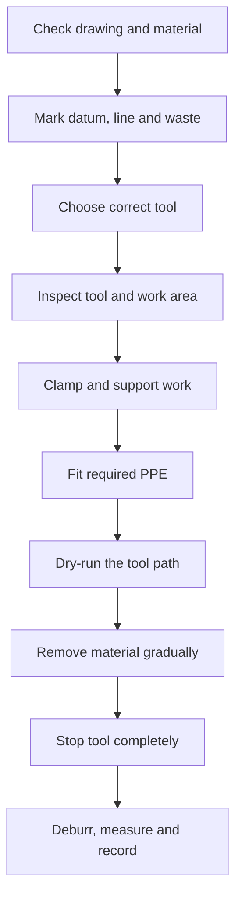
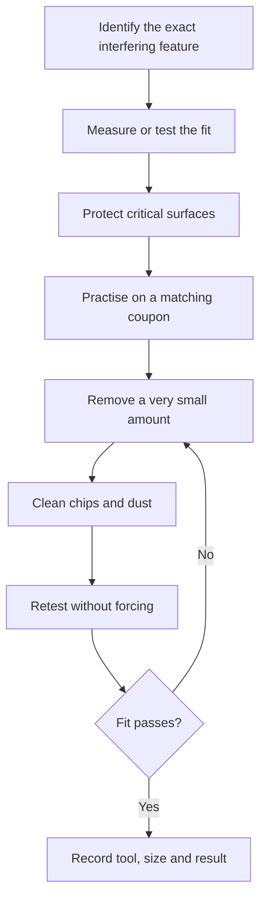

# Topic 2.8 - Cutting, Drilling and Finishing

> **"The best cut is not the fastest cut. It is the cut that leaves the right part behind."**

---

# Learning Objectives 🎯

By the end of this topic you will be able to:

- Mark a cut or hole from a clear datum instead of guessing from several edges.
- Explain the difference between the wanted side and the waste side of a line.
- Choose a sensible tool for cutting card, printed plastic, rod or thin sheet.
- Prepare work safely using clamps, a cutting mat and a backing board.
- Explain how a drill bit cuts and why a pilot hole can guide a larger hole.
- Reduce tearing, cracking and breakout as a drill exits a part.
- Remove sharp edges, burrs and printing remains without changing important fits.
- Use files and abrasives in controlled stages.
- Inspect a finished part before fitting fasteners or electronics.
- Build a reusable buggy hole-pattern template from household materials.

---

# Before We Begin

Imagine wrapping a birthday present.

You measure the paper, draw a line and cut it.
If you cut on the wrong side of the line, the paper becomes too short.
No amount of careful folding can put the missing strip back.

Workshop cutting works the same way.

Our buggy will need card shortened, printed supports removed, holes opened to fit screws and rough edges made safe.
A motor mount may need a slot adjusted by half a millimetre.
A chassis plate may need four holes that line up with another module.

The tool does not know which side of the pencil line is your part.
It only removes material wherever you guide it.

So this topic is not mainly about powerful tools.
It is about **controlled material removal**.

We will mark first, hold the work securely, remove a little at a time and inspect before going further.
That is how a rough blank becomes a reliable buggy part.

---

# Why This Matters for Our Buggy

A CAD model can be perfect and a 3D print can still need finishing.

Real parts may need:

- support material removed
- a tight hole opened slightly
- an edge made safe
- a cable slot cleaned
- a screw head seated neatly
- a rod shortened
- a damaged corner trimmed
- a cardboard prototype cut accurately

Bought parts also need adaptation.
A donor bracket may have the right shape but the wrong hole spacing.
A body post may be longer than we need.
A thin aluminium strip may become a temporary brace.

Remember our guiding principle: **buy precision, build structure**.

We do not cut bearings, motor shafts or hardened gears to make them “nearly right”.
Those are precision components.

We cut and finish the structural parts where the process teaches useful engineering and can be done safely.

A good finished part should:

- match the drawing closely enough
- have no dangerous edge
- fit without being forced
- keep enough material around every hole
- assemble with tool access
- survive its planned load

Finishing is not decoration added after engineering.
Finishing is the last stage of making the geometry correct, safe and usable.

---

# Removing Material Is a One-Way Decision

You can always remove another small amount.

You cannot easily put material back.

That simple fact creates the main workshop rule:

> Approach the final size in controlled steps.

A beginner often tries to reach the final line in one heroic cut.
An engineer leaves a small finishing allowance, checks the result and then removes the last amount carefully.

This is the material-removal version of prototyping.

```text
Mark -> rough cut -> inspect -> finish -> measure -> assemble
```

Skipping the inspection step makes every later step a guess.

---

# Marking Out: Give the Tool a Map

Before a journey, a map tells you where to go and where not to go.

Before cutting or drilling, marks do the same job.

**Marking out** means transferring the important dimensions and positions from a drawing onto the real material.

A useful mark must show:

- where the finished edge should be
- which side is waste
- where each hole centre belongs
- which edge or face is the reference
- any area that must not be cut

Weak marking looks like a cloud of thick pencil lines.
Strong marking uses thin lines, one datum and clear labels.

> **[F6 measured drawing - Figure 2.8.1: a rectangular buggy bracket blank seen from above. One edge is labelled DATUM A and one end DATUM B, with every dimension running from those two. A thin cut line crosses the blank; the wanted side carries a large tick and the waste side is shaded with diagonal hatching. Two hole centres are marked with crossing centre lines, dimensioned from the same datums]**
>
> *Figure 2.8.1 - Mark from one datum, and shade the waste before you cut - both decisions are made with a pencil, not a saw.*
>
> *Alt text: A bracket blank marked with two datums, a cut line with the waste side shaded, and two hole centres on crossing lines.*

---

# Start from One Datum

Remember Topic 2.5.
A datum is like measuring everyone’s height from the same floor.

If one hole is measured from the left edge and another from a rough right edge, the errors can fight each other.

Choose one straight, reliable edge as the datum.
Measure important positions from that edge.

For a simple plate, you might use:

```text
Datum A = left edge
Datum B = bottom edge
```

Then every hole position can be described by two distances:

```text
Hole 1: 15 mm from Datum A, 10 mm from Datum B
Hole 2: 45 mm from Datum A, 10 mm from Datum B
```

This is clearer than saying “about one centimetre from each side”.

---

# The Witness Line

A thick pencil mark can be wider than the tolerance you are trying to achieve.

Use a sharp pencil or suitable marking tool to make a thin **witness line**.
A witness line is the visible boundary you approach while cutting or filing.

Do not erase it too early.

The remaining line tells you:

- whether the edge is straight
- where high spots remain
- whether you have crossed into the finished part

For a rough cut, stay on the waste side and leave the witness line visible.
Then finish up to the line.

---

# Wanted Side and Waste Side

Every cut line has two sides.

One side becomes the finished part.
The other side is removed.

Engineers call the removed side the **waste side**.

Shade it before cutting.
A few diagonal pencil strokes are enough.

```text
WANTED PART | cut line | ////// WASTE //////
```

This tiny habit prevents a surprisingly common mistake: carefully cutting the wrong half to the correct size.

---

# Kerf: The Tool Has Width

Draw a line with a pencil, then rub it out with a wide eraser.
The eraser removes a band, not a mathematical line with zero width.

A saw blade behaves similarly.

The width of material removed by a cutting tool is the **kerf**.

A thin saw may remove less than a millimetre.
A wider blade or rough cut may remove more.
The exact value depends on the tool and material.

The important rule is:

> Put the kerf in the waste, not inside the wanted part.

If you cut directly through the centre of your dimension line, part of the wanted material disappears with the kerf.

> **🤔 Think about it.**
> Draw a 20 mm paper strip.
> Cut exactly down the middle of both boundary lines.
> Is the strip still exactly as wide as the space between the original line centres?

The scissors removed some paper where each line used to be.
The finished strip is slightly smaller.

On cardboard this may not matter.
On a bearing pocket or motor mount, a similar error may ruin the fit.

> **🤔 Think about it.** Draw a thick pencil line on a scrap of card and
> cut along it with scissors. Now look at the line. Is it still there, is half
> of it left, or has it gone completely? Which piece did the missing part come
> from - the piece you wanted, or the piece you were throwing away?

Whatever the blade took, it took from somewhere. If you cut down the middle of the line, half of that width came out of the part you are keeping - and on a bearing pocket, half a line is easily enough to lose the fit.

> **[F2 cross-section - Figure 2.8.2: a magnified view of a saw blade part-way through a piece of material. The blade body is drawn, and the slot it has removed is shaded and dimensioned as the kerf, clearly wider than the blade itself because of the tooth set. The cut line is drawn as a fine pencil line, with the blade positioned entirely on the waste side of it. A second panel shows the blade centred on the line instead, with the finished part visibly undersized]**
>
> *Figure 2.8.2 - The saw removes a slot, not a line - so cutting down the middle of your mark makes the part too small every time.*
>
> *Alt text: A magnified saw blade showing the kerf slot it removes, positioned on the waste side of a line, beside a version centred on the line.*

---

# Worked Example - Shortening a Brace

## The question

A temporary buggy brace must finish at `80 mm` long.

The rough plastic strip is `100 mm` long.

You plan to leave `2 mm` for filing after the rough cut.
Where should you make the rough cut, and how much material must be removed in total?

## Known values

```text
Starting length = 100 mm
Final length = 80 mm
Finishing allowance = 2 mm
```

## The rule

```text
Total material to remove = starting length - final length
Rough-cut length = final length + finishing allowance
```

## The calculation

```text
Total material to remove = 100 mm - 80 mm
                         = 20 mm

Rough-cut length = 80 mm + 2 mm
                 = 82 mm
```

## The result

Mark the final witness line at `80 mm` from the datum end.

Mark a rough-cut line at about `82 mm`.
Shade the last `18 mm` as immediate waste.

Cut on the waste side of the `82 mm` line.
Then file or sand carefully towards the `80 mm` witness line.

The full `20 mm` is removed in two controlled stages rather than one risky cut.

The `2 mm` allowance is not a universal rule.
It is a planned amount for this example.
A thin material and fine saw may need less.
A rough process may need more.

---

# Squares, Centre Lines and Hole Centres

A ruler measures distance.
It does not automatically make a line square to an edge.

A try square or small engineer’s square helps mark a line at `90°` to a datum edge.
For paper and card, the corner of a reliable book or set square can demonstrate the idea.

For a hole, do not draw a large circle and guess the middle.

Draw two thin centre lines that cross.
The crossing point is the hole centre.

```text
      |
------+------
      |
```

For a row of holes, draw one centre line along the row first.
Then mark each position along that line from the same datum.

This makes spacing errors easier to see before any material is removed.

---

# A Template Repeats a Pattern

Suppose four chassis modules need the same two-hole mounting pattern.

Measuring all eight holes separately creates eight chances for error.

A **template** carries an existing pattern from one part to another.

A template may be:

- printed paper stuck temporarily to a blank
- thin card with punched centres
- a spare plate used only for marking
- a CAD drawing printed at `100%` scale
- a proper drilling jig in later workshop work

A template improves repeatability.
It does not remove the need to check scale, alignment and orientation.

Print settings can accidentally scale a paper template.
Always measure one known dimension before trusting it.

---

> **☕ Good place to pause.**
> Try Hands-On Activity 1 before continuing.
> The next section moves from marking to holding and cutting.

---

# Workholding: The Part Must Stay Still

Try writing your name on a sheet of paper while someone slides the paper around.
Your hand may be steady, but the result will not be.

Cutting and drilling have the same problem.

**Workholding** means securing the part so it cannot slip, spin, lift or vibrate during the task.

Useful workholding includes:

- a bench vice with suitable soft jaws
- clamps
- a hand vice for very small pieces
- a proper drill vice in a supervised workshop
- a cutting mat beneath sheet material
- a sacrificial board beneath a drilled part

Your fingers are not a clamp.

Never hold a small part in your hand while drilling it.
The bit can grab the part and turn it into a sharp propeller.

---

# Clamp the Work, Not the Feature

A clamp placed over the cut line blocks the tool.
A clamp placed far away may let the part vibrate.

Place clamps so they:

- hold the part close to the work area
- do not cover the mark
- do not sit in the tool path
- do not crush a hollow printed part
- keep the part flat on its support

For a thin printed plate, a scrap block can spread the clamp force.

For an oddly shaped part, stop and make a simple support nest instead of balancing it dangerously.

Remember the packaging envelope from Topic 2.5.
The tool, clamp, hands and removed waste all need space.

> **[F3 right-versus-wrong array - Figure 2.8.3: three views of the same bracket held for drilling. Left, wrong: a hand pinching the part directly beside the drill bit. Middle, wrong: a clamp gripping across the very feature being drilled, distorting it. Right, correct: the clamp holding a solid area well away from the hole, the part flat on a backing board, both hands free and clear]**
>
> *Figure 2.8.3 - Clamp the part, not the feature - and never the bit of it you are about to cut.*
>
> *Alt text: Three views comparing a hand-held part, a clamp distorting the drilled feature, and correct clamping away from the hole.*

---

# A Backing Board Has Two Jobs

Place paper on a table and push a pencil through it.
The exit side often tears.

Place the same paper on a firm scrap of card and push again.
The support beneath the paper reduces the tear.

A **backing board** is sacrificial material placed beneath the work.

It can:

1. support the fibres or plastic as the drill exits
2. protect the real table from the tool

The backing board is expected to be marked or drilled.
That is why it is sacrificial.

Never drill towards a table, floor or hand and hope to stop at exactly the right moment.

---

# The Safe Tool Routine

Topic 2.1 gave us Pause-Plan-Protect.
Use it here in a more detailed form.



A dry run means moving the unplugged or unpowered tool through the planned path without cutting.

Check:

- Can the handle move freely?
- Will the waste fall safely?
- Is the cable clear?
- Are both hands out of the path?
- Can the tool hit the clamp?
- Where will the blade or bit emerge?

Finding a collision during the dry run is a success.
You found it before the tool was moving.

---

# Tool Condition Comes First

A blunt, bent or damaged tool needs more force and gives less control.

Before use, check for:

- cracked handles
- loose blades
- missing guards
- chipped cutting edges
- bent drill bits
- damaged cables or plugs
- loose drill chucks
- clogged files
- torn abrasive paper

Take damaged tools out of use.
Do not repair electrical tools unless you are competent and authorised.

The HSE rule is simple: tools must be suitable for the job and in good condition.

---

# Cutting Tools Are Not Interchangeable

Different tools remove material in different ways.

| Tool | Sensible beginner use | Poor use |
|---|---|---|
| Scissors | Paper, thin card, some soft sheet | Thick hard plastic or wire |
| Craft knife | Adult-supervised straight cuts in card or thin sheet | Cutting towards a hand or through thick stock in one pass |
| Flush cutters | Removing small printed support nubs or cable ties | Cutting hardened wire, screws or thick sheet |
| Side cutters | Suitable electrical wire when the tool is rated for it | Sheet plastic, screws or large rods |
| Junior hacksaw | Adult-supervised cuts in plastic rod, thin metal or printed parts | Loose work or unsupported tiny pieces |
| Fine-tooth saw | Controlled cuts in suitable plastic or wood | Materials not listed by the tool maker |
| File | Bringing an edge to size and removing high spots | Replacing a saw for large amounts of material |
| Abrasive paper | Smoothing and refining surfaces | Correcting a badly located hole |

If the correct tool is not available, change the plan.
Do not force the nearest tool to do a different job.

---

# Scissors and Card

Scissors are the first cutting tool most people learn.
They still reward good technique.

For card:

- use scissors large enough for the material
- keep the wanted part supported
- make long smooth cuts when possible
- turn the work, not your wrist, around curves
- cut on the waste side of the line
- use several relief cuts around a tight inside curve

Do not close the tips violently through thick card.
The material may jump and the tips may slip.

For a long straight line, an adult-supervised knife and metal ruler may produce a straighter result.
But scissors are often the safer choice for a first prototype.

---

# Craft Knives: Light Passes, Not Heroic Force

A craft knife can make accurate cuts in card and thin sheet.
It can also cause a serious injury.

> **⚠️ SAFETY**
>
> A responsible adult must approve and directly supervise craft-knife use.
> Cut on a proper mat, use a suitable ruler and keep the other hand out of the blade path.
> Cut away from your body using several light passes.
> Retract or cover the blade immediately after the cut.
> Never use a loose, damaged or blunt blade.

Several light passes are safer and straighter than one deep pass.

The first pass creates a shallow track.
Later passes follow that track.

This is another example of approaching the final result in controlled stages.

---

# Sawing: Let the Teeth Work

A saw is a row of tiny cutting tools.
Each tooth removes a small chip.

Pushing harder does not automatically make a cleaner cut.
Too much force can:

- bend the blade
- make the saw jump
- crack thin plastic
- heat and melt the cut
- pull the work from the clamp

A general supervised sawing routine is:

1. Mark the final line and waste side.
2. Clamp the part with the cut close to the support.
3. Dry-run the full saw stroke.
4. Start with short, gentle strokes to create a notch.
5. Use smooth strokes once the blade is guided.
6. Keep the blade on the waste side.
7. Support the waste near the end so it does not snap off and tear the part.
8. Stop, unclamp and inspect before filing.

Always follow the instructions for the exact saw and material.

> **⚠️ SAFETY**
>
> Sawing must be supervised by a responsible adult or workshop instructor.
> Wear safety glasses where chips or snapped material could fly.
> Secure long hair, sleeves and cords.
> Keep both hands away from the blade path and never test the teeth with a finger.

---

# Support the Waste Near the End

Bend a chocolate bar slowly.
The last thin connection suddenly snaps.

The end of a saw cut can behave the same way.
If the waste hangs unsupported, its weight bends the final bridge of material.
The wanted edge may split before the saw reaches the line.

Support the waste so it cannot tear away.

Do not trap the blade by squeezing the cut closed.
The support should carry the weight without pinching the saw.

---

# Cutting Printed Parts

Printed parts have layers and hollow internal patterns.
They do not cut exactly like solid sheet.

Before cutting, inspect the sliced design or the printed part.
Ask:

- Where are the walls?
- Is the cut passing through sparse infill?
- Could the layers split?
- Will a trapped nut or insert be exposed?
- Is a wire or bearing hidden behind the cut?
- Would revising and reprinting be safer than cutting?

For a cheap prototype, trimming may be sensible.
For a final structural part, a CAD revision is often better.

The cleanest repair is sometimes Revision V0.2, not a larger file.

---

# Removing Supports and Brims

A brim is a thin printed border used to help a part stick to the build plate.
Support material holds overhangs during printing.

Neither is part of the finished geometry.

Remove them in stages:

1. Let the print cool fully.
2. Identify the part boundary.
3. Break away large support sections only where they are designed to release.
4. Use adult-approved flush cutters for small nubs.
5. Cut away from the finished surface.
6. File or sand only the remaining high spots.
7. Inspect for cracks before assembly.

Do not twist a delicate bracket until the support tears free.
The support may be stronger than the feature you are trying to save.

> **⚠️ SAFETY**
>
> Support fragments and clipped cable ties can fly.
> Wear safety glasses and point the cut away from people.
> Keep one hand out of the cutter path.
> If a blade or heated tool seems necessary, stop and ask an adult to choose the method.

---

> **☕ Good place to pause.**
> Marking, holding and cutting are covered.
> Drilling deserves its own run - it is the operation that bites back.

---

# Drilling: A Rotating Cutting Tool

Twist a pencil into soft clay.
The pointed shape pushes material aside and creates a path.

A drill bit does something more controlled.
Its cutting edges rotate, remove chips and guide the hole forward.

**Drilling** creates or enlarges a round hole using a rotating cutting tool.

The spiral channels on a common twist drill carry chips away from the hole.

A drill bit must match:

- the material
- the required hole
- the drill or hand tool
- the allowed process

A bit labelled for masonry is not the correct choice for a small PETG bracket.
A wood spade bit is not a precision M3 clearance-hole tool.

---

# The Drill Does Not Locate the Hole for You

A spinning bit wants to wander across a flat surface before it starts cutting.

A clear centre mark helps it begin in the right place.
Depending on the material and supervised process, the start may use:

- a small printed centre dimple
- a centre punch mark made by an adult
- a bradawl mark in suitable wood or card
- a small pilot hole
- a drill jig

Do not strike brittle printed plastic with a heavy punch.
It may crack along the layers.

For CAD-designed printed parts, a small modelled hole or dimple can guide later finishing.

---

# Pilot Holes

Try pushing a thick peg through card with no opening.
The peg crushes and tears the card.

Make a small opening first and the larger peg follows more easily.

A **pilot hole** is a smaller hole that guides a later, larger drill.

Pilot holes can:

- reduce wandering
- lower the load on a larger bit
- help keep a hole centred
- make staged enlargement easier

They are not required for every material, bit or hole.
Follow the tool and material guidance.

A poor pilot hole can guide the final hole to the wrong place very accurately.
Mark and inspect first.

---

# Signature Visual - The Clean Hole Sequence

> **[Signature visual, F4 sequence strip - Figure 2.8.4: four cross-sections of the same plate. Panel 1: a drill wandering across an unmarked surface, the point skating off line. Panel 2: a centre punch mark and a small pilot hole giving the drill somewhere to sit. Panel 3: the plate clamped flat onto a backing board while a larger drill follows the pilot. Panel 4: the bit just breaking through into the backing board, leaving a clean supported exit. A contrasting inset shows an unsupported plate with a torn, raised exit burr]**
>
> *Figure 2.8.4 - Hole quality is not one skill - it is location, then workholding, then support, then a controlled feed.*
>
> *Alt text: Four cross-sections showing a wandering drill, a pilot hole, a clamped plate on a backing board, and a clean supported breakthrough.*

The strongest idea in this visual is not “use a bigger drill”.

It is that hole quality comes from the whole setup:

```text
location + workholding + support + suitable bit + controlled feed + inspection
```

---

# Breakthrough: The Last Millimetre Is Different

When most of a hole is drilled, the material supports the cutting edges on both sides.

Near the exit, only a thin layer remains.
The bit can grab and pull through suddenly.

This moment is **breakthrough**.

Breakthrough can cause:

- tearing in card or wood
- a raised burr in metal
- a chipped edge in brittle plastic
- layer splitting in a printed part
- the drill dropping suddenly

Reduce the risk by:

- clamping the work to a backing board
- reducing pressure as the bit nears the exit
- keeping the drill aligned
- using the correct bit and setup
- allowing the bit to cut rather than forcing it

Never place a hand beneath the expected exit.

> **[F5 force and motion overlay - Figure 2.8.5: three side-by-side cross-sections of a drill approaching the far surface of a plate. In the first, material still surrounds the tip and support arrows push evenly from both sides. In the second, only a thin skin remains and the arrows are unbalanced, with the drill beginning to pull itself through. In the third, the same moment with a backing board pressed against the exit face, restoring the support arrows and leaving a clean hole]**
>
> *Figure 2.8.5 - The last millimetre is where the support disappears and the drill tries to snatch itself through the work.*
>
> *Alt text: Three cross-sections of a drill nearing breakthrough, showing balanced support, unbalanced support, and support restored by a backing board.*

---

# Speed, Pressure and Heat

Rub your hands together quickly.
They get warm.

Cutting tools also create heat through friction and deformation.
Plastic is especially sensitive because too much heat can soften or smear it.

Warning signs include:

- melted plastic around the bit
- a strong hot smell
- discoloured chips
- a squealing tool
- smoke
- the bit clogging
- the work becoming too hot to approach safely

Stop if the process looks or sounds wrong.

There is no single correct drill speed for every bit, tool and material.
The responsible adult or instructor should use the tool manufacturer’s guidance and the material supplier’s advice.

General principles are:

- use a sharp suitable bit
- start under control
- use enough feed for the tool to cut
- avoid rubbing in one place
- pause to clear chips when required
- never use hammer mode for ordinary plastic or thin metal work

Do not add oil, water or another coolant unless the exact process permits it and an adult has chosen it.
Some fluids attack plastics or create electrical hazards.

---

# Power Drill Safety

A powered drill adds stored electrical energy and high-speed rotation.

> **⚠️ SAFETY**
>
> Powered drilling requires direct supervision by a responsible adult or trained workshop instructor.
> The work must be clamped; never hold a small part by hand.
> Wear suitable eye protection, tie back hair and remove dangling cords or jewellery.
> Inspect the drill, bit, chuck, battery or cable before use.
> Keep the chuck key out of the chuck before starting.
> Keep hands away until the bit has stopped completely.
> Disconnect or isolate power before changing a bit, clearing a jam or adjusting the work.
> Follow the exact tool manual and workshop rules.

An RCD (a safety device that can disconnect some electrical faults) can reduce risk on suitable mains equipment, but it does not make a damaged tool safe.
Never bypass a protective device.

---

# Hand Drills and Pin Vices

Not every hole needs a powered drill.

A small hand-held chuck, often called a pin vice, can hold tiny drill bits.
A hand drill turns a bit through a handle or gear mechanism.

These tools are slower.
That can be an advantage for:

- cleaning a small printed hole
- making a starter hole in card or soft plastic
- enlarging a test coupon gradually
- learning alignment with lower energy

Slower does not mean harmless.
Tiny drill bits are sharp and brittle.
The work still needs support, and the tool still needs adult approval.

---

# Choosing a Drill Bit

Use the exact bit family recommended for the material and tool.

| Bit or tool | Typical role | Important caution |
|---|---|---|
| Twist drill | General round holes in suitable plastic, metal or wood | Material and speed must match |
| Brad-point bit | Clean location in suitable wood | Point can break through suddenly |
| Step drill | Staged larger holes in suitable thin sheet or plastic | Stop at the correct step |
| Countersink tool | Chamfering the mouth of a hole | Removes diameter quickly |
| Reamer | Bringing an existing hole to a controlled final size | Not for creating a badly misplaced hole |
| Pin vice with small drill | Slow manual work on small holes | Small bits snap easily |

A step drill can make several diameters with one tool.
Its shape also supports gradual enlargement.
But it is not automatically correct for every printed part.

Do not buy specialist bits before a real task needs them.
Borrowing from a supervised workshop may be better.

---

# Drilling Printed Parts

A printed hole may be deliberately modelled slightly small and finished after printing.
This can produce a reliable fit when supported by test-coupon evidence.

But drilling a printed part has special risks:

- the bit may catch on layer ridges
- thin walls may crack
- sparse infill may provide little support
- heat may soften PLA or smear PETG
- a hole close to an edge may split out
- the final hole may expose hollow infill

Before drilling:

1. Check the CAD wall thickness around the hole.
2. Check the print orientation and layer direction.
3. Test the process on a coupon printed with the same settings.
4. Support the part close to the hole.
5. Start smaller if the tested method requires it.
6. Inspect after each size increase.

For a critical bearing or hinge pin fit, a reamer or redesigned printed allowance may be better than pushing a general drill through once.

---

# A Hole Can Be the Right Size and Still Be Wrong

A hole may measure the correct diameter but still fail because it is:

- in the wrong position
- tilted
- oval
- too close to an edge
- rough at the entrance
- unsupported by enough wall material
- misaligned with its matching hole

This is why inspection needs more than one measurement.

For a mounting hole, check:

```text
diameter
position from datums
squareness
edge distance
surface damage
alignment with mating part
```

The drill makes the diameter.
The setup makes the hole useful.

---

# Opening an Undersized Printed Hole

Suppose an M3 through-bolt should pass freely through a printed bracket.
Your fit library says the design needs a finished hole near `Ø3.2 mm` on your printer and material.
The printed hole measures about `Ø2.9 mm`.

A controlled plan is:

1. Confirm that the required fit is clearance, not a thread.
2. Check that enough wall remains around `Ø3.2 mm`.
3. Clamp and support a matching test coupon.
4. Open the coupon using the adult-approved tool and method.
5. Deburr it.
6. Test the actual M3 screw without forcing.
7. Repeat on the real part only after the coupon passes.

Do not jump to a much larger bit because the screw “nearly fits”.

The coupon is cheaper than the bracket.

---

# Reaming: Finishing an Existing Hole

A drill is good at creating and enlarging holes.
A **reamer** is designed to remove a small amount from an existing hole and improve its final size or surface.

Think of a drill as rough road construction and a reamer as laying the final surface.

A reamer does not rescue a badly located hole.
It follows the hole that already exists.

For a buggy, a reamer may be useful for:

- hinge pin holes
- bearing seats designed for reaming
- repeated clearance holes
- alignment features

This is specialist work compared with drilling card or clearing a screw hole.
Use the correct tool and supervised method.

---

# Countersinks and Chamfers

The sharp corner at a hole entrance can catch, chip or raise a burr.

A small angled edge around the opening is a chamfer.
When made specifically to seat a countersunk screw head, it is a **countersink**.

A countersink can:

- remove a burr
- guide a screw into a hole
- allow a countersunk screw to sit flush

It can also ruin a hole quickly.

Too much countersinking:

- removes clamp area
- weakens thin material
- lets a screw head sink too deeply
- enlarges the visible opening
- moves the contact into fragile printed layers

Use only the amount required by the drawing or deburring need.

Do not use a large drill bit as an improvised countersink unless the supervised process specifically permits it.
The cutting geometry is different and can grab.

---

> **☕ Good place to pause.**
> You can now plan and make a controlled hole.
> The next section is about making every cut edge and hole safe, accurate and ready for assembly.

> **[F2 cross-section - Figure 2.8.6: two cross-sections side by side. Left: a countersunk screw seated in a correctly angled countersink, its head exactly flush with the surface, the matching angle marked. Right: the same screw in a hole with no countersink, standing proud of the surface, with a gap under the head and an arrow showing where it will catch. Depth dimensions on both]**
>
> *Figure 2.8.6 - The countersink angle has to match the screw head, or the head either sits proud or never beds down.*
>
> *Alt text: Two cross-sections comparing a countersunk screw sitting flush in a matching countersink with one standing proud in a plain hole.*

---

> **☕ Good place to pause.**
> Every hole in the buggy can now be made accurately.
> What follows is making the results safe to touch and ready to assemble.

---

# Burrs: The Sharp Leftovers

Tear aluminium foil and feel the edge carefully with your eyes, not your finger.
The torn boundary may have raised, sharp fragments.

Cutting and drilling can leave similar raised material.

A **burr** is an unwanted rough or sharp edge left by a manufacturing process.

Burrs can:

- cut skin
- stop parts sitting flat
- scrape wires
- create false measurements
- prevent a screw head seating
- break loose into gears or electronics

Removing them is **deburring**.

Deburring is not the same as rounding every edge heavily.
Remove the unwanted sharp material while preserving the designed shape.

> **[F3 right-versus-wrong array - Figure 2.8.7: three magnified cross-sections of a drilled hole edge. Left, before: a raised curled burr standing up around the rim. Middle, correct: the burr removed with a light chamfer, the hole diameter untouched and dimensioned as unchanged. Right, wrong: over-deburred, with the chamfer cut so deep that the hole is now visibly larger and the flat face has been eaten into]**
>
> *Figure 2.8.7 - Deburring removes the leftover, not the part - the hole size should be exactly the same afterwards.*
>
> *Alt text: Three magnified hole edges showing a raised burr, a correctly removed burr, and an over-deburred hole that has grown.*

---

# Never Find a Burr with Your Fingertip

A burr is sharp enough to cut precisely because it can be difficult to see.

Inspect using:

- bright side lighting
- a magnifier if available
- a scrap cloth lightly drawn across the edge
- a cotton bud that can catch on sharp material
- visual comparison with a known finished edge

Do not slide bare skin along a newly cut metal edge.

After deburring, clean the part so loose chips cannot enter the buggy.

---

# Files: Controlled Edge Cutting

A **file** is a hardened tool covered with many small cutting teeth.

It removes material from high spots in a controlled way.

Common useful shapes include:

- flat file for straight edges
- half-round file for curves and flats
- round file for holes and inside curves
- needle files for small features

Use a file with a proper handle where required.
The pointed tang of an unhandled file can injure your palm.

> **⚠️ SAFETY**
>
> Use files approved for the material and fitted with suitable handles where required.
> Clamp the work and keep hands behind the cutting direction.
> Wear eye protection when brittle chips may fly.
> Clean files with an appropriate file brush, never by scraping the teeth with bare fingers.

---

# Files Cut Best with a Plan

For a straight finished edge:

1. Leave the witness line visible.
2. Clamp the part close to the edge.
3. Mark high spots with pencil.
4. File the high spots first.
5. Check squareness and length often.
6. Stop before the witness line disappears everywhere.
7. Finish with a finer tool or abrasive if required.

Do not rock a flat file over an edge.
Rocking creates a rounded surface.

Keep the file flat if the design needs a flat face.

> **[F5 force and motion overlay - Figure 2.8.8: a file being pushed across a clamped edge, with a bold arrow on the forward stroke marked cutting and a dashed arrow on the return stroke marked lift, do not drag. A second panel shows the file held flat across a face with two hands, one at the handle and one at the tip, and a third shows the file rocking and producing a rounded edge where a flat one was wanted]**
>
> *Figure 2.8.8 - A file cuts on the push only - dragging it back blunts the teeth and rounds the edge you were trying to keep flat.*
>
> *Alt text: A file shown cutting on the forward stroke and lifted on the return, held flat with two hands, and rocking to produce a rounded edge.*

---

# Abrasives: Thousands of Tiny Cutters

A sandy beach slowly smooths broken glass because countless hard grains rub its surface.

Abrasive paper uses the same idea in a controlled sheet.

An **abrasive** is a hard material that wears away a softer surface through rubbing.

The grain size is described by **grit**.

For common abrasive-paper systems:

- lower grit numbers are coarser
- higher grit numbers are finer

A coarse abrasive removes material quickly and leaves deep scratches.
A fine abrasive removes less and leaves a smoother surface.

Exact grit choice depends on the material and required finish.

---

# A Sensible Grit Progression

Do not start with the finest abrasive on a large saw mark.
It may take a long time while rounding the whole part.

Do not use very coarse abrasive on a bearing seat.
One careless stroke may destroy the fit.

A typical non-critical progression might move from coarse to medium to fine, such as:

```text
120 -> 240 -> 400
```

This is an example, not a universal recipe.

Move to the next grit when the previous tool marks are evenly reduced.
Do not skip directly from deep saw scratches to polishing.

For a hidden chassis edge, safe and accurate may matter more than shiny.

> **[F7 comparison array - Figure 2.8.9: a strip of the same printed edge shown at four stages left to right: as-printed with visible layer lines, after a coarse grit, after a medium grit, and after a fine grit. Each stage is labelled with its grit number and the surface drawn progressively smoother. Beneath, an arrow reads coarse to fine, and a note warns that skipping straight to fine grit only polishes the ridges]**
>
> *Figure 2.8.9 - Each grit removes the scratches left by the one before it - skip a step and you polish the marks instead of removing them.*
>
> *Alt text: One printed edge shown at four sanding stages from as-printed through coarse, medium and fine grit.*

---

# Sanding Flat

Wrap abrasive paper around a flat block.

The block spreads your hand pressure and helps preserve a flat surface.
Without a block, fingertips press harder in some places and create dips.

For a straight edge:

- place the abrasive on a flat surface or use a flat sanding block
- keep the part square
- use light, even strokes
- mark the edge with pencil first
- stop and inspect where the pencil remains

The pencil acts like a witness layer.
High spots disappear first.
Low spots remain marked.

---

# Sanding Holes Is Easy to Overdo

Rolling abrasive into a tube can clean a rough hole.
It can also create an oval hole quickly.

For a critical round fit, use a suitable round tool, reamer or revised print allowance.

If abrasive is used:

- remove very small amounts
- rotate the work or tool evenly
- measure in more than one direction
- test the real mating part frequently
- stop before the fit becomes loose

A loose bearing seat is not “extra easy assembly”.
It is a failed interface.

---

# Make It Work Before Making It Pretty

A bumper does not need a mirror shine to work.
A bearing seat does not become better because its outside is polished.

The working finish must make the part safe and able to do its job.
It may include:

- correct final size
- flat mounting faces
- burr-free holes
- safe edges
- free movement
- no loose chips

Extra cosmetic work changes appearance.
It may include:

- smoothing visible layer lines
- filling surface marks
- painting
- polishing

Function comes first.

Do not spend an hour making the wrong-sized bracket beautiful.

---

# Critical Surfaces Need Protection

Some surfaces must not be casually sanded.

Examples include:

- bearing seats
- shaft bores
- datum faces
- gear-mounting faces
- servo locating pockets
- snap fits
- gasket surfaces
- calibrated test coupons

Mark them before finishing:

```text
CRITICAL FIT - DO NOT SAND
```

Protect them with tape where suitable.

A surface can look smoother and become less accurate at the same time.

---

# Dust Is Material in the Wrong Place

Sanding turns a solid part into tiny airborne or loose particles.

Dust can:

- enter eyes and lungs
- settle on food
- contaminate bearings
- coat electronics
- make the work surface slippery
- spread material you do not understand

> **⚠️ SAFETY**
>
> Ask a responsible adult to identify the material before sanding or filing it.
> Work with suitable ventilation and dust control.
> **A cloth face covering is not dust protection.** If a mask is needed, it must
> be a proper filtering mask - FFP2 or N95 rated or better - fitted by an adult.
> Wear eye protection as well.
> Never sand unknown composites, glass-filled or carbon-filled materials casually.
> Keep food and drink away, clean the bench and wash hands after finishing.
>
> **The better answer is to stop the dust existing.** Wet sanding - dipping the
> abrasive in water, or working under a slow trickle - keeps the particles stuck
> to the paper instead of floating into the room. Remember hazard and risk from
> Topic 2.1: a mask lowers the risk, but wet sanding removes most of the hazard.
> Clear up with a damp cloth or a vacuum, never by blowing or brushing dust into
> the air.

> **📚 Learn more**
>
> - HSE: search "dust in the workplace" - why fine dust is treated seriously, and what actually counts as protection
> - Your abrasive's own packet - grit numbers and what each range is for, printed on the thing you already own

Do not blow dust from a part with your mouth.
Use an approved brush, vacuum or cleaning method.

Compressed air can drive particles into eyes, skin, bearings and electronics.
Use it only where a trained adult has selected a safe method.

---

# Heat from Sanding Plastic

Fast sanding can heat plastic.
PLA may soften at a temperature reached inside a hot car and can also soften locally through friction.
PETG may smear instead of cutting cleanly.

Warning signs are:

- gummy dust
- a shiny melted edge
- the part feeling warm
- abrasive paper clogging rapidly
- dimensions changing faster than expected

Use light pressure and pauses.
Let the abrasive cut.

Do not cool a hot electrical tool or unknown material with water.
Change the process safely instead.

---

# Finishing Thin Metal

Thin aluminium sheet can make useful prototype brackets.
Its cut edges can be extremely sharp.

Metal work adds hazards:

- sharp metal chips
- hot chips
- conductive debris near electronics
- springy offcuts
- harder burrs

A trained adult or workshop instructor should select the cutting and drilling process.

Afterwards:

- deburr both faces
- round dangerous corners only as the drawing allows
- clean away all metal chips
- inspect the hole edge
- keep metal debris away from batteries and electronics

Never test a metal edge by running a finger along it.

---

# Printed Plastic Finishing by Material

Different filaments behave differently.

## PLA

PLA is stiff and easy to file, but thin features can chip.
Friction heat can soften the surface.

Use light cuts and support small features.

## PETG

PETG is tougher and can form strings or fuzzy edges.
It may smear if overheated.

Sharp tools and controlled finishing help.

## TPU

TPU bends away from files and abrasives.
Cutting it cleanly requires a sharp suitable tool and strong control of the work.

Do not try to “sand it rigid”.
Its flexibility is the property you chose.

## Filled or specialist materials

Fibre-filled filaments may create abrasive dust and wear tools.
Do not cut or sand them without material-specific guidance, suitable controls and adult supervision.

Return to Topic 2.6 whenever the material changes.

---

> **☕ Good place to pause.**
> Inspect one safe object for a burr, tool mark or protected critical surface.
> The next section brings the whole finishing process together.

---

# The Finish-to-Fit Routine

Use this routine when a printed feature is slightly tight.



Do not sand every surface because the assembly feels tight.
Find the actual interference.

Marker pen or soft pencil on the mating surface can reveal contact points.
Use only a material-safe marking method.

---

# When to Revise Instead of Finish

Hand finishing is useful for:

- removing process leftovers
- fitting a test coupon
- opening a known allowance
- correcting a tiny non-critical high spot
- preparing a prototype

Revise the CAD model when:

- every copy needs heavy rework
- a hole is in the wrong place
- the wall becomes too thin after finishing
- the part repeatedly cracks
- the tool cannot reach safely
- support removal damages the feature
- the fit result varies too much

A repeated finishing operation belongs in the design or process plan.

If every battery tray needs ten minutes of filing, the file is telling you to revise the CAD.

---

# Repairing a Hole That Became Too Large

Once a hole is oversized, the correct response depends on its job.

Possible engineering responses include:

- reprint the part
- use a designed bushing
- use a suitable washer for a non-locating through-hole
- revise the fastener size after checking edge distance
- add a proper insert in a revised design
- reject the part

Do not fill a critical hole with random glue and redrill it without evidence.

A steering hinge or bearing location needs predictable geometry.
Reprinting is often cheaper than building an unreliable repair into the buggy.

---

# Inspection Before Assembly

A part is not finished when the tool stops.
It is finished when inspection shows it meets its requirement.

Use this sequence:

## 1. Clean

Remove loose chips, dust and support fragments.

## 2. Look

Check for cracks, white stress marks, melted edges, torn layers and burrs.

## 3. Feel safely

Use a cloth or cotton bud for sharp-edge checks.
Do not slide a finger along new metal edges.

## 4. Measure

Check the dimensions that matter.
Do not measure every decorative curve.

## 5. Test fit

Use the actual mating part without forcing it.

## 6. Check alignment

Fit all screws loosely before tightening any one fully.

## 7. Record

Write what tool and final size produced the passing result.

---

# A Simple Finish Record

```text
Part: cable-guide bracket
Material: PETG
Revision: V0.2
Operation: opened two M3 clearance holes
Starting hole: designed Ø3.1 mm
Finishing tool: adult-supervised Ø3.2 mm reamer
Backing/support: flat scrap block
Result: M3 screw passes by hand; no visible split
Deburring: light hand chamfer
Inspection: hole spacing passes template
Next change: keep same allowance for this printer/material
```

This record turns one successful part into a repeatable process.

Without the record, the next part starts from memory and guesswork.

---

# Check the Part and Improve the Process

One check asks: did this finished part pass?

A second check asks: did we use a reliable method that should help the next part pass too?

For our buggy:

```text
Check the part:
Measure the finished hole and test the screw.

Improve the process:
Use the same datum, template, backing board and tested tool sequence next time.
```

Both matter.

A lucky good hole is not yet a reliable process.

---

# Fair Test - Does Backing Improve the Exit?

You can test one finishing idea rather than accepting it as a rule.

## Question

Does a backing layer reduce tearing when a hole is made through card?

## Independent variable

Whether the card has a backing layer beneath it.

## Dependent variables

- amount of tearing at the exit
- diameter of the damaged area
- how flat the exit remains

## Control variables

Keep the same:

- card type
- hole-making tool
- operator
- pressure method
- marked hole size
- distance from the edge

## Procedure

1. Prepare six equal card samples.
2. Make three holes with the sample unsupported over a safe gap.
3. Make three holes with identical card backed by scrap card.
4. Photograph the exit faces.
5. Draw a circle around the damaged area.
6. Measure or rank the damage.
7. Compare the average result, not only the best sample.

## Pass condition

The backed group should show consistently less exit tearing or a smaller damaged area.

If it does not, inspect whether the method actually kept the samples and tool conditions equal.

---

> **☕ Good place to pause.**
> The main ideas are complete.
> The activities below turn marking, support and finishing into repeatable habits.

---

> **☕ Good place to pause.**
> That is the whole workshop skill set for removing material.
> The activities below build the habits - none of them needs a power tool.

---

# Hands-On Activity 1 - Cut on the Waste Side

*No special equipment is needed. You need paper, a ruler, pencil and scissors.*

1. Draw three strips, each `20 mm` wide and `100 mm` long.
2. Shade the waste outside every strip.
3. Cut Strip A through the centres of the boundary lines.
4. Cut Strip B just inside the wanted strip.
5. Cut Strip C just outside the wanted strip, leaving the witness lines visible.
6. Measure the widths with a ruler.
7. Trim Strip C carefully towards the witness lines.

Record:

| Strip | Cutting choice | Final width | Too small, correct or too large? |
|---|---|---:|---|
| A | Through line | | |
| B | Wanted side | | |
| C | Waste side then finish | | |

**Reflection:** Which strip gave you a chance to correct the result after the first cut?

That is why engineers protect the wanted material.

---

# Hands-On Activity 2 - Backing Board Comparison

*No powered tool is needed. You need scrap card, a blunt pencil or hole punch, and adult approval.*

> **⚠️ SAFETY**
>
> Show the adult exactly how you plan to make the holes.
> Use only an approved blunt pencil, hole punch or other safe tool.
> Keep hands away from the exit side and work on a sacrificial surface.
> Do not use a knife, awl or powered drill for this activity.

1. Cut six equal squares of card.
2. Mark one hole centre in the same place on each square.
3. Make three holes with the sample unsupported over a safe gap.
4. Make three holes with each sample resting on two layers of scrap card.
5. Turn the pieces over and inspect the exit faces.
6. Rank the tear from `1` for cleanest to `5` for worst.
7. Write one sentence explaining the difference.

This is the fair test described earlier.

---

# Hands-On Activity 3 - Pencil Witness Layer

*You need scrap wood, thick card or a safe printed offcut; a pencil; and an adult-approved nail file or abrasive block.*

1. Shade one edge completely with pencil.
2. Make three light passes with the abrasive block.
3. Inspect where pencil remains.
4. Repeat while keeping the block flat.
5. Stop when the edge is safe and the high spots are reduced.

Do not chase every pencil mark if that would change the required size.

**Reflection:** Did your hand remove material evenly, or did one corner disappear first?

The pencil converted an invisible pressure pattern into visible evidence.

---

# Hands-On Activity 4 - Hole Alignment Template

*No drill is needed. You need paper, card, ruler, pencil, tape and a hole punch if available.*

1. Choose a datum edge on a card strip.
2. Draw a centre line `10 mm` from the bottom edge.
3. Mark hole centres `15 mm` and `45 mm` from the left datum.
4. Punch or carefully open the centres using an adult-approved method.
5. Place the template on a second card strip.
6. Align the datum edges.
7. Transfer the two centres.
8. Flip the template over and repeat.

Did flipping change the pattern direction?

Add a large arrow labelled `FRONT` so future users cannot mirror the template accidentally.

---

# Hands-On Activity 5 - Supervised Drill Setup Dry Run

*This is a preparation exercise, not a powered drilling instruction.*

You need:

- a scrap part approved by an adult
- a backing board
- clamps
- safety glasses
- an unplugged drill or a pencil acting as the drill

> **⚠️ SAFETY**
>
> A responsible adult or workshop instructor must lead this activity.
> Keep the drill unplugged, battery removed or otherwise isolated for the entire dry run.
> Do not install or touch a drill bit unless the adult directs you.
> The purpose is to practise setup and hand position, not to make a hole.

1. Mark a hole centre.
2. Place the scrap on the backing board.
3. Clamp both securely.
4. Check the expected exit point.
5. Put on safety glasses.
6. Move the unpowered drill or pencil into position.
7. Check that the tool can remain square.
8. Check that neither hand enters the rotating path.
9. Check that the tool cannot hit a clamp.
10. Say the stop plan aloud.

Write the one setup change that improved safety most.

---

# Hands-On Activity 6 - Finish Inspection Detective

*You need any safe finished object: a printed part, a metal bracket, a ruler or a household item approved by an adult.*

Inspect it without taking it apart.

Look for:

- tool marks
- burrs or softened edges
- a countersink
- a drilled hole
- a moulded hole
- a filed surface
- a critical fit that was left untouched

Make an evidence table:

| Observation | Process that may have caused it | Does it affect function? |
|---|---|---|
| Circular scratches in hole | Drilling or reaming | Possibly |
| Flat smooth edge | Filing or sanding block | Possibly |

Do not claim certainty when you only have a clue.
Engineers separate observation from inference.

---

# Topic Mini Project - Reusable Buggy Hole-Pattern Template 🛠️

Build a keepable template that transfers an accurate two-hole mounting pattern onto future cardboard buggy prototypes.

The template embodies the complete topic:

- datum selection
- marking out
- waste-side cutting
- supported hole making
- edge finishing
- orientation control
- inspection
- reuse

It is not a drilling jig for powered tools.
It is a marking template for paper and cardboard prototypes.

## What the artifact teaches

Your template will:

- locate two mounting-hole centres from one datum
- include a centre line
- include a `FRONT` direction arrow
- include a no-cut safety border
- transfer the same pattern repeatedly
- reveal whether repeated marks stay aligned

This is exactly how a reusable interface reduces measurement errors across buggy modules.

## Materials

Use household and scrap materials only:

- cereal-box card or similar thin card
- corrugated cardboard for a storage backing
- paper
- pencil
- ruler
- tape or glue
- scissors
- hole punch if available
- blunt pencil for marking through holes
- optional nail file or small scrap of abrasive paper approved by an adult
- two pencils, drinking straws or rolled-paper tubes for the alignment test

Nothing needs to be purchased specially.

## Tools

- scissors
- ruler
- adult-approved hole punch
- optional adult-approved safe finishing tool

> **⚠️ SAFETY**
>
> Show a responsible adult or guardian what you plan to build before starting, and build with them nearby.
> Ask the adult to approve the card, scissors, hole-making method and finishing tool.
> Keep fingers away from the path of scissors and hole punches.
> Work on a sacrificial surface and never push a pointed tool towards your hand or leg.
> Do not use a craft knife, awl or powered drill for this mini project.

> **🎬 Watch the build**
> - BBC Bitesize (KS3 Design and Technology) - search “marking out, cutting and shaping” to see how tools and datum marks guide accurate work.
> - Original Prusa Knowledge Base - search “How to post-process the printed parts” for photographs of holes and printed features being prepared before assembly.
> - YouTube - search “cardboard drilling template hole pattern” **with an adult**, and watch only to compare how templates transfer repeated centres; do not copy powered-tool steps.

## Step 1 - Write the requirement

In your notebook, write:

```text
Artifact: reusable two-hole marking template
Material: cereal-box card
Hole spacing: 30 mm centre-to-centre
Centre-line height: 10 mm from bottom datum
Left-hole position: 15 mm from left datum
Direction: FRONT arrow required
Use: mark cardboard buggy modules only
```

The dimensions are deliberately simple.
The engineering value comes from repeating them accurately.

## Step 2 - Choose the datums

Choose the left edge as Datum A.
Choose the bottom edge as Datum B.

Draw them boldly outside the working area:

```text
A = LEFT
B = BOTTOM
```

Add a small square symbol in the corner where they meet.

## Step 3 - Mark the outer shape

Draw a rectangle:

```text
70 mm wide
30 mm high
```

Shade the outside waste area.

Draw a second rectangle `5 mm` inside the first.
Label this:

```text
NO-CUT SAFETY BORDER
```

The hole centres must remain inside this border.

## Step 4 - Cut on the waste side

Cut outside the outer witness line.

Leave the line visible.

Use small finishing cuts to approach the line.
Do not remove the datum labels.

Check that the template lies flat.

## Step 5 - Finish the datum edges

Shade the left and bottom edges lightly with pencil.

Use an adult-approved nail file or abrasive block to remove high spots.
Keep the tool flat.

Stop when the edges are safe and reasonably straight.

The aim is a reliable reference, not polished card.

## Step 6 - Draw the centre line

Measure `10 mm` up from Datum B at two locations.

Join those marks with a thin line.

Label it:

```text
HOLE CENTRE LINE
```

If the two marks do not line up, do not average them by eye.
Check the datum and measure again.

## Step 7 - Mark the hole centres

From Datum A, mark:

```text
Hole 1 = 15 mm
Hole 2 = 45 mm
```

Draw short crossing centre lines at each position.

The spacing should be:

```text
45 mm - 15 mm = 30 mm
```

Measure the spacing as a check.

## Step 8 - Make supported transfer holes

Place the template on two layers of scrap card.

Use an adult-approved hole punch or blunt hole-making method.

Keep the opening only large enough for a pencil point to mark through.

Large holes make centre transfer less precise.

Inspect the rear for tearing.
Trim only loose fibres.

## Step 9 - Add orientation control

Draw a large arrow:

```text
FRONT ->
```

Add:

```text
THIS FACE UP
```

These labels prevent accidental mirroring.

A pattern can have correct spacing and still be installed backwards.

## Step 10 - Build the storage backing

Cut a piece of corrugated cardboard slightly larger than the template.

Make a paper pocket or two corner straps that hold the template without gluing it permanently.

Label the backing:

```text
VOLTFORGE BUGGY INTERFACE TEMPLATE
Pattern: 30 mm two-hole
Revision: V0.1
```

This protects the datum edges between uses.

## Step 11 - Repetition test

Prepare five small card samples.

For each sample:

1. Align Datum A and Datum B.
2. Keep `THIS FACE UP` visible.
3. Mark both hole centres through the template.
4. Number the sample.

Stack the five samples.
Hold them up to a light.

Do the marks overlap?

If the spread is large, investigate:

- template movement
- unclear datum contact
- holes too large
- blunt pencil
- card edges not square
- orientation errors

## Step 12 - Alignment test

With adult approval, open the marked holes in two samples using the same safe method.

Tape the samples upright and parallel on a cardboard base.

Pass two pencils, straws or rolled-paper tubes through the matching holes.

If both pass without bending the card, the pattern is reasonably aligned.

If one jams, do not force it.
Find which hole moved.

Your model does not prove a powered-drilled metal chassis will align.
It proves that the marking interface is repeatable in card.

## Step 13 - Reflection

Complete these statements:

```text
The datum prevents: __________________________________
The backing layer improved: ___________________________
The FRONT arrow prevents: _____________________________
The witness line helped because: ______________________
```

Then answer:

- Which error came from measurement?
- Which error came from the hole-making process?
- Which feature makes the template reusable?
- What would you change in Revision V0.2?
- How could this pattern become a standard buggy interface?

## Step 14 - Keep the artifact

Store the template in its backing pocket.

Put it on your showcase shelf beside the fastener training board from Topic 2.7.

Your shelf now holds two connected engineering tools:

- a board showing how parts are joined
- a template showing how matching holes are located

That is the beginning of a real workshop system.

---

# Thinking Like an Engineer - The Operation Plan

Before changing a real buggy part, write an operation plan.

```text
Part:
Material:
Drawing revision:
Datum:
Operation:
Tool:
Workholding:
Backing/support:
PPE:
Adult supervision:
Critical dimension:
Inspection method:
Stop condition:
```

Example:

```text
Part: PETG electronics tray coupon
Material: PETG, 4 walls, 0.2 mm layers
Drawing revision: V0.2
Datum: lower flat face
Operation: open M3 clearance hole
Tool: adult-approved hand reamer
Workholding: padded clamp on flat support
Backing/support: scrap PETG block
PPE: safety glasses
Adult supervision: direct
Critical dimension: screw passes freely; wall stays intact
Inspection method: visual crack check + actual M3 screw
Stop condition: whitening, crack, heat or tool grab
```

Planning is part of the operation.

---

# Stop Point Before Buying More Tools

Do not buy a rotary tool, large drill-bit set, countersink kit and polishing machine because this topic mentioned them.

First prove that you can:

- mark from one datum
- identify the waste side
- clamp work correctly
- use a backing board
- finish to a witness line
- inspect safely
- record the result

A ruler, pencil, scissors, file or nail file, scrap board and borrowed supervised drill can teach the essential process.

Buy a tool only when a real project operation requires it.

This protects the project budget and follows the guiding principle **learn more than you spend**.

---

# Common Beginner Mistakes ❌

## Mistake 1 - Cutting through the middle of the line

The kerf removes wanted material.

Cut on the waste side and finish towards the witness line.

## Mistake 2 - Measuring every feature from a different edge

Rough edges create different errors.

Choose clear datums and measure important positions from them.

## Mistake 3 - Holding a small part while drilling

The bit can grab and spin the part.

Clamp it to suitable support.

## Mistake 4 - Forgetting the exit side

The drill breaks through into the table, a hand or unsupported material.

Plan the exit and use a backing board.

## Mistake 5 - Forcing a blunt tool

More force reduces control and may crack the part.

Stop and replace or service the tool through an adult or competent person.

## Mistake 6 - Using a large drill to “find” the centre

The bit wanders and removes too much material.

Mark the centre and use the tested starting method.

## Mistake 7 - Drilling printed plastic too fast

The plastic softens, smears or catches.

Use material-specific guidance and a tested coupon.

## Mistake 8 - Treating deburring as heavy rounding

The designed edge disappears and the screw loses support.

Remove only the unwanted sharp material.

## Mistake 9 - Sanding every surface of a tight fit

The real interference remains unknown and critical dimensions drift.

Find the contact point first.

## Mistake 10 - Checking sharp metal with a fingertip

The inspection causes the injury it was meant to prevent.

Use light, magnification, cloth or a cotton bud.

## Mistake 11 - Making the part beautiful before checking size

A polished wrong part is still wrong.

Verify function before cosmetic work.

## Mistake 12 - Reworking every copy instead of revising CAD

Repeated finishing hides a design or process problem.

Record the evidence and make a revision.

---

> **[F3 right-versus-wrong array - Figure 2.8.10: twelve compact rows of paired panels, one per mistake above, consistent viewing angle within each pair. Examples: a cut made down the centre of the line beside one made on the waste side; a part held by hand under a drill beside the same part clamped to a backing board; a drill started on an unmarked surface beside one started in a centre-punched pilot; a blunt blade forced through card beside a sharp blade making light passes; dry sanding filling the air with dust beside the same job wet-sanded]**
>
> *Figure 2.8.10 - Every pair is the same operation done twice - and the right-hand version is the one that keeps both the part and your hands intact.*
>
> *Alt text: Twelve right-versus-wrong pairs covering marking out, waste side, workholding, backing boards, pilot holes, blade sharpness, deburring and wet sanding.*

# Topic Summary 📝

In this topic we learned that:

- Cutting, drilling and finishing are controlled material-removal processes.
- Material removal is mostly one-way, so approach the final size in stages.
- **Marking out** transfers dimensions and positions from the drawing to the material.
- A datum gives every important mark a shared reference.
- The **waste side** is removed; the wanted side must be protected.
- **Kerf** is the width removed by a cutting tool, so it belongs in the waste.
- A thin **witness line** helps you see when the finished boundary is approaching.
- **Workholding** prevents the part moving, spinning or vibrating.
- A **backing board** supports the exit face and protects the bench.
- Tool choice depends on the material, geometry and operation.
- A **pilot hole** can guide a larger hole when the tested process requires one.
- **Breakthrough** is the final stage when a drill exits and the material is least supported.
- Printed parts need special care because of layers, heat sensitivity, walls and infill.
- A **burr** is an unwanted sharp process edge; **deburring** removes it without destroying the design.
- Files and abrasives should approach critical dimensions gradually.
- A functional finish makes a part safe, correctly sized and ready to work.
- Inspection, fit testing and records turn one good result into a repeatable process.

---

# New Words 📖

| Word | Meaning |
|---|---|
| Marking out | Transferring dimensions, lines and hole positions from a drawing onto real material. |
| Witness line | A thin visible line that shows the finished boundary while material is removed. |
| Waste side | The side of a cut line intended to be removed. |
| Kerf | The width of material removed by a cutting tool such as a saw. |
| Template | A reusable pattern used to transfer the same shape or positions onto other parts. |
| Workholding | The method used to secure a part so it cannot slip, lift, spin or vibrate. |
| Backing board | Sacrificial material beneath work that supports the exit and protects the bench. |
| Pilot hole | A smaller hole used to guide a later, larger hole. |
| Breakthrough | The moment a drill or cutter exits the far side of the material. |
| Reamer | A tool that removes a small amount from an existing hole to improve its final size or finish. |
| Countersink | An angled recess at a hole entrance, often used for a countersunk screw head. |
| Burr | An unwanted rough or sharp edge left by cutting, drilling or another process. |
| Deburring | Removing burrs while preserving the intended part shape. |
| Abrasive | A hard material used to wear away a surface through rubbing. |
| Grit | A number describing abrasive grain size; lower is generally coarser and higher is finer. |

---

# Review Questions ❓

1. Why is material removal described as a one-way decision?
2. What is the difference between the wanted side and the waste side of a line?
3. What is kerf, and where should it fall during a cut?
4. Why should important dimensions be marked from the same datum?
5. What are the two main jobs of a backing board?
6. Why must a small part be clamped instead of held by hand during drilling?
7. What is a pilot hole, and why does a badly positioned pilot not solve a location error?
8. What changes during breakthrough, and how can support reduce damage?
9. Name four warning signs that drilling or sanding plastic is creating too much heat.
10. What is the difference between a burr and a designed chamfer?
11. Why can sanding a bearing seat make a part look better but work worse?
12. A printed M3 clearance hole is tight in every copy of a bracket. When should you finish the holes, and when should you revise the CAD model?

---

# Topic Checklist ✅

- [ ] I can choose and label a datum edge.
- [ ] I shade the waste side before cutting.
- [ ] I understand kerf and keep it out of the wanted part.
- [ ] I leave a witness line for controlled finishing.
- [ ] I can explain why workholding is part of accuracy and safety.
- [ ] I use a backing board for supported hole making.
- [ ] I know that small parts must never be held by hand while drilling.
- [ ] I can explain the purpose of a pilot hole.
- [ ] I understand the special risk at breakthrough.
- [ ] I know that a powered drill requires direct adult or instructor supervision.
- [ ] I can distinguish drilling, reaming, countersinking and deburring.
- [ ] I protect critical fits from casual sanding.
- [ ] I clean dust and chips before assembly.
- [ ] I completed the waste-side cutting activity.
- [ ] I completed the backing-board comparison.
- [ ] I practised an isolated drill-setup dry run.
- [ ] I built and kept my reusable buggy hole-pattern template.
- [ ] I can write a simple operation and inspection record.

---


# Looking Ahead 🔭

You can now turn a marked blank or printed prototype into a safe, usable part.

You can locate holes from a datum, protect the wanted material, control breakthrough, remove burrs and inspect the result before assembly.

The next workshop skill joins electrical parts rather than mechanical parts.

In Topic 2.9 - **Soldering and Wire Connections**, we will learn how to prepare wires, make a sound solder joint, use heat-shrink insulation and inspect a connection before electricity flows through it.

The habits remain the same:

```text
prepare -> control -> inspect -> test
```

Only the tools and hazards change.

---

# Answers 🔑

1. Because you cannot put material back. Every cut, hole and sanding stroke is permanent, so the thinking has to happen before the tool touches the work - measure, mark, check, then cut.
2. The wanted side is the part you are keeping; the waste side is the material you are throwing away. Naming them before cutting is what stops you removing the wrong one.
3. Kerf is the width of material the cutting tool actually removes. It should fall entirely on the waste side of your line, so the line itself survives on the finished part.
4. Because errors do not accumulate from a single datum. If each feature is measured from the previous one, every small error adds to the next; measured from one datum, each error stays local.
5. It supports the material where the tool exits, so the edge does not tear or burst out, and it protects the bench underneath from the tool.
6. Because a drill bit can catch and spin the part far faster than you can let go. It stops being a part and becomes a spinning object with sharp corners. Clamping also frees both hands to control the tool.
7. A pilot hole is a smaller hole drilled first to guide a larger one. It does not fix a location error because the larger drill simply follows wherever the pilot is - a pilot in the wrong place gives you an accurate hole in the wrong place.
8. The material supporting the cutting edges disappears, so the drill is no longer pushed evenly from both sides and tries to snatch itself through. A backing board restores that support and keeps the exit clean.
9. Any four of: melted or smeared plastic rather than chips or dust, a smell of hot plastic, the part becoming too hot to hold comfortably, material clogging the abrasive or the drill flutes, a glazed shiny patch appearing, or the tool starting to grab.
10. A burr is unwanted material left behind by the process - an accident. A chamfer is a designed feature with a size and an angle, put there deliberately to guide assembly or remove a sharp edge.
11. Because a bearing seat is a fit, not a surface. Sanding removes material from the seat, so the hole grows and the bearing that was a press fit becomes loose. It looks smoother and holds worse.
12. Finish the holes when a small number of parts need to work now and the CAD model is otherwise correct. Revise the CAD model when every copy is tight, because that is evidence of a systematic error - and the fix belongs in the design, recorded in your fit library, not repeated by hand on every part forever.
