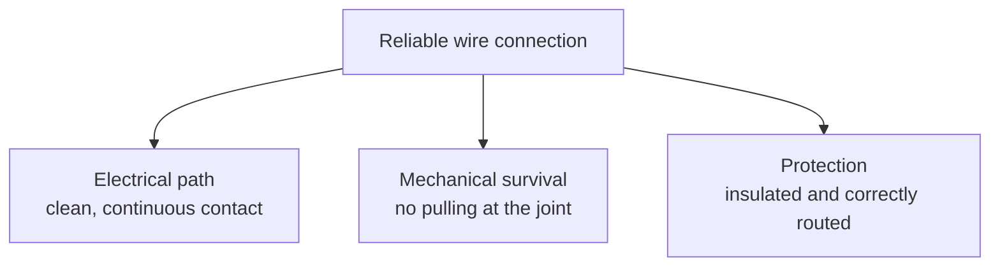
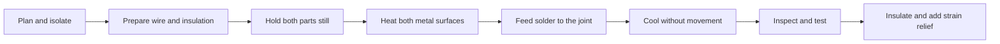

# Topic 2.9 - Soldering and Wire Connections

> **"A solder joint carries electricity.
> A good wiring design also keeps the joint from carrying every pull, bend and crash."**

---

# Learning Objectives 🎯

By the end of this topic you will be able to:

- Explain the three jobs of a dependable wire connection.
- Identify the conductor, strands and insulation in a flexible wire.
- Explain why solder must flow onto hot metal rather than be painted on with the iron.
- Prepare, join and inspect scrap wire under direct adult supervision.
- Recognise a cold joint, solder bridge, damaged strand and overheated connection.
- Choose between a soldered joint, plug connector, screw terminal and properly crimped terminal.
- Add insulation, strain relief and a service loop.
- Route buggy wiring away from gears, tyres, sharp edges and hot components.
- Use a multimeter safely on an unpowered connection to check continuity and accidental shorts.
- Build a reusable wiring-harness trainer from household materials.

---

# Before We Begin

Think about a pair of wired headphones that works only when the cable is held at a certain angle.

The music has not forgotten how to travel.
One tiny connection inside the cable has probably cracked or pulled loose.
The metal touches when you bend the cable one way, then separates when you let go.

That is an electrical problem caused by a mechanical problem.

Our buggy will shake, steer, jump, crash and vibrate.
Its wires must carry power and control signals while the chassis flexes around them.
A connection that works perfectly on a still workbench may fail after ten rough landings if the wire keeps bending at the joint.

This topic is about much more than melting solder.

We will learn to make a connection, protect it, route it and test it as one small engineered system.

---

# Why This Matters for Our Buggy

The buggy will eventually contain:

- a battery and connector (covered safely in Topic 3.3)
- an ESC (the motor's electronic speed controller - Topic 3.6)
- a motor
- a steering servo (the actuator that moves the steering - Topic 3.5)
- a radio receiver (the part that receives the driver's commands - Topic 3.4)
- switches, sensor leads and extension wires

These parts form electrical paths between separate modules.

A loose motor connection may stop the buggy.
A reversed connection may damage electronics.
An exposed conductor may touch another conductor and create a short circuit (an unintended low-resistance path - covered in Topic 3.2).
A wire rubbing against a gear may lose its insulation.
A heavy cable hanging from a small circuit-board pad may tear the pad away.

Remember the guiding principle **modular by default**.

Good wiring lets us:

- unplug one module without cutting wires
- replace a damaged part
- identify each connection quickly
- keep moving wires clear of the drivetrain
- inspect faults without dismantling the whole buggy
- reuse electronics in the next version

A neat harness is not decoration.
It is part of safety, reliability and serviceability.

---

# Every Connection Has Three Jobs

Imagine a bridge between two riverbanks.

The bridge must provide a path across the river.
It must survive the loads placed on it.
It must also stop people falling through gaps.

A wire connection has three similar jobs.

## Job 1 - Carry electricity

The metal path must be continuous and have good contact.

## Job 2 - Survive mechanically

The wire must resist pulling, bending, vibration and accidental movement.

## Job 3 - Stay protected

Bare metal must not touch the wrong terminal, a chassis part or another wire.



A shiny blob of solder may complete Job 1 for a moment.
It can still fail Jobs 2 and 3.

That is why the joint is only one part of the connection.

---

# Meet the Wire

A winter coat has a warm inside and a protective outside.

An electrical wire also has an inside and an outside, but they do different jobs.

The metal inside is the **conductor**.
It provides the path through which electric charge can move.
Electric current is covered properly in Topic 3.2.

The plastic outside is the **insulation**.
It stops the conductor touching people, tools and other conductors.

> **[F2 cross-section - Figure 2.9.1: a magnified cross-section of a flexible wire. Many fine copper strands are drawn as separate circles forming the conductor, with a coloured plastic ring around them labelled insulation. Beside it, a stripped end shows the strands exposed and still neatly twisted together, with a second version showing several strands nicked and broken off during stripping and a callout naming the lost current capacity]**
>
> *Figure 2.9.1 - The conductor is dozens of thin strands, not one wire - which is why nicking a few during stripping quietly weakens the joint.*
>
> *Alt text: Magnified cross-section of a stranded wire with insulation labelled, beside a cleanly stripped end and one with broken strands.*

Never treat insulation as if it were the conductor.
The plastic coating does not carry the electrical load.

Never treat the conductor as if it were mechanically indestructible.
Copper strands can fatigue and break when bent repeatedly.

---

# Why Flexible Wire Uses Strands

Try bending a thick wooden skewer.
Then imagine replacing it with a bundle of thin broom bristles.

The bundle can bend more easily because each small piece moves a little.

Buggy wiring usually uses **stranded wire**.
The conductor is made from many thin metal strands twisted together.

Stranded wire is useful because it:

- bends more easily than one solid conductor
- survives movement better
- routes around components
- tolerates vibration better when supported correctly

A broken strand still matters.

If a wire stripper cuts several strands, the remaining strands must carry the same job through a smaller metal path.
The damaged point also becomes a weak place for bending.

> Do not accept a wire end just because some copper remains.
> If strands are cut, trim the end and strip it again.

---

# Wire Size Is a Design Choice

A drinking straw can carry a small flow of water.
A fire hose can carry much more.

Electrical wires also come in different sizes.
The correct size depends on the current, length, flexibility, connector and temperature limits.
Those calculations belong in Part 3 after we learn voltage, current, resistance and power.

For now, use these rules:

- Keep the original wire size supplied by a trusted manufacturer unless the design has been checked.
- Use the wire range specified for the connector or terminal.
- Do not join a thick power cable to a tiny signal wire merely because both are available.
- Do not remove strands to force a wire into a terminal.
- Do not assume thicker is always better; a huge stiff cable can overload a small connector or circuit-board pad mechanically.

The wire, connector and tool must belong to the same planned system.

---

# Polarity: Direction Must Be Clear

Some plugs can be connected only one way.
Some electrical parts care which terminal is positive and which is negative.

**Polarity** means the identification of those opposite electrical directions or terminals.

Red is commonly used for positive and black for negative in low-voltage hobby wiring.
That colour convention is useful, but colour alone is not proof.

Wires can be replaced incorrectly.
A manufacturer may use another colour.
A previous owner may have repaired the harness.

Before connecting power later in the handbook, we will verify:

- the markings on the component
- the connector orientation
- the wiring diagram
- the actual continuity of the harness

> **⚠️ SAFETY**
>
> Never practise soldering on a battery, battery lead or live circuit.
> Never solder directly to a LiPo cell (a high-energy rechargeable battery cell - Topic 3.3) or attempt to repair a battery pack.
> Use disconnected scrap wire and training components only.
> Battery connectors and battery safety are covered in Topic 3.3 with stricter controls.

---

> **☕ Good place to pause.**
> Try Hands-On Activity 1 or Activity 2 now.
> The next section explains what soldering actually does.

---

# Soldering Is Not Hot Glue

Hot glue works mainly by cooling around a surface and gripping its shape.

A soldered electrical joint works differently.

**Solder** is a metal alloy designed to melt at a lower temperature than the parts being joined.
The iron heats the metal conductors or terminals.
Solder then melts against those hot surfaces, flows over them and cools into a joined metal path.

The iron is a heat-delivery tool.
It is not a paintbrush for carrying a blob from the tip to a cold wire.

This gives us the most important technique rule:

> Heat the joint.
> Feed solder to the joint.
> Do not melt a ball on the iron and wipe it onto cold metal.

---

# Wetting: When Solder Flows Properly

Put a drop of water on a clean glass plate.
It spreads into a smooth shape.

Put water on a greasy surface.
It may pull into a bead and refuse to spread.

Solder behaves in a similar way.

**Wetting** means molten solder spreads across and bonds to the metal surface instead of sitting as a separate blob.

Good wetting needs:

- suitable metal surfaces
- enough heat at both parts
- clean surfaces
- suitable flux
- enough time for flow, but not so much heat that parts are damaged

A rounded ball clinging to one side often means the surfaces did not wet properly.

> **[Signature visual, F3 right-versus-wrong array - Figure 2.9.2: four enlarged wire-to-terminal joints photographed at the same angle and magnification. Panel A, correct: solder has flowed smoothly onto both the wire and the terminal, forming a shiny concave fillet that curves up onto each surface. Panel B, cold joint: dull, lumpy solder sitting on top of the metal with a visible line where it never bonded. Panel C, too much solder: a rounded blob hiding the joint completely so it cannot be inspected. Panel D, dry joint: solder wetting only the terminal, with a gap around the wire. Each panel carries a one-word verdict]**
>
> *Figure 2.9.2 - A good joint is concave and shiny and lets you see the wire inside it - a blob hides the truth and a dull lump never bonded.*
>
> *Alt text: Four magnified solder joints comparing correct wetting, a cold joint, an over-soldered blob and a dry joint.*

---

# Flux: The Surface Helper

Leave a clean metal spoon wet and exposed, and its surface slowly changes.
Metal surfaces can collect oxides and contamination that make solder flow badly.

**Flux** is a chemical material that helps clean the hot metal surface and helps solder wet it.

Most beginner electronics solder contains a thin flux core inside the wire.
Extra electronics flux may sometimes help a repair, but it must be suitable for the materials and process.

> **⚠️ SAFETY**
>
> Use only flux and solder intended for electronics.
> Never use plumbing acid flux on electronic wiring.
> It can remain corrosive and damage conductors and boards.
> Follow the product safety instructions and the supervising adult's risk assessment.

Flux does not replace preparation.
Dirty, oily or badly oxidised parts may still need to be replaced or cleaned by a suitable approved method.

---

# Soldering Safety: Hot, Fuming and Precise

A temperature-controlled soldering iron commonly operates at roughly `330-400 °C`, depending on the solder, tip and job.

That is much hotter than a kitchen oven.
The tip can burn skin, melt insulation and ignite clutter.
The metal joint and clipped wire ends may also remain hot after the iron moves away.

Flux produces a visible fume plume when heated.
Lead-free solder does not make that plume harmless.
Rosin-based flux fume can irritate airways and is a recognised cause of occupational asthma.

Here is the part that makes the rules worth following. Rosin flux fume is one of the most common causes of occupational asthma in the UK, and the damage is not temporary. Once somebody becomes **sensitised**, their body reacts every time afterwards - and from then on even a tiny amount of fume can trigger an attack. There is no going back to how it was before. You are not protecting yourself from a cough this afternoon; you are protecting the lungs you will still be using in fifty years.

> **🤔 Think about it.** Hold a cold spoon over a steaming mug for a
> few seconds, then look at the underside. Where did the steam go - up past
> the spoon, or did it stop when it met something solid? Now picture your own
> face in the place of that spoon, thirty centimetres above a soldering iron.

Rising fume behaves exactly like the steam: it goes straight up until something moves it. Leaning in for a better view puts your face directly in that column, which is why extraction has to pull the plume sideways and away before it ever reaches you.

The safe response is not to hold your breath for a few seconds.
The safe response is to control the fume at the source.

> **⚠️ SAFETY**
>
> Any live soldering in this handbook requires direct supervision by a responsible adult or trained instructor.
> Use suitable local fume extraction positioned to pull the plume away from your breathing zone.
> Keep your head out of the plume; an open window alone is not a substitute for source extraction.
> Work on a stable heat-resistant surface with the iron in its proper stand.
> Wear safety glasses because clipped leads and tiny solder droplets can fly.
> Tie back hair, secure loose clothing and keep cables out of walking paths.
> Keep food and drink away, and wash hands with soap after handling solder or flux.
> Use lead-free electronics solder for the handbook's practice tasks.
> Treat unknown old solder as potentially leaded and ask an adult to handle it.
> Disconnect every power source before work begins.
> Turn the iron off when the supervised task is complete and leave it in the stand until fully cool.

A small desk fan that merely pushes the plume across the room may expose someone else.

> **📚 Learn more**
>
> - HSE: search "rosin colophony solder flux fume" - the official UK guidance (INDG249) on why this fume is controlled so strictly
> - Adafruit Learn: search "Guide to Excellent Soldering" - clear photographs of good joints and every common fault, worth looking at before your first attempt
Use equipment intended to capture or remove solder fume, following its instructions.

If your eyes water, your throat feels irritated, or you start coughing, stop immediately, move to clean air and tell the supervising adult.

---

# Set Up the Hot Zone Before Switching On

Remember the four-zone workspace from Topic 2.1.

Soldering happens in the hot-tool zone, not among loose paper, batteries and rolling screws.

Prepare the bench in this order:

1. Clear the surface.
2. Put down a suitable heat-resistant mat.
3. Place the iron stand on your dominant-hand side where the cable will not snag.
4. Position the local fume extractor according to its instructions.
5. Put the work holder in front of you.
6. Place solder, tools and heat-shrink where they can be reached without crossing over the hot tip.
7. Put safety glasses on.
8. Confirm every power source is disconnected from the work.
9. Ask the supervising adult to inspect the setup.
10. Only then switch on the iron.

The work should be held before the iron leaves its stand.

Trying to hold the wire, solder and iron with two hands turns the task into a circus act.
Use a small vice, helping-hands tool or another suitable heat-safe holder.

---

# The Basic Soldering Kit

You do not need a bench full of expensive equipment.
You need a small set of correct, safe tools.

| Item | Job | Important check |
|---|---|---|
| Temperature-controlled soldering station | Supplies controlled heat | Sound cable, secure stand, suitable tip |
| Local fume extractor | Captures flux fume near the source | Correct position and maintained filter |
| Lead-free electronics solder | Provides the joining metal and usually flux | Correct type and diameter for small work |
| Wire stripper | Removes insulation without cutting strands | Correct slot or adjustment for wire size |
| Side cutters | Cuts wire and component leads | Sharp, undamaged jaws; cut directed safely |
| Heat-safe work holder | Keeps parts still | Stable and not crushing the wire |
| Brass tip cleaner or approved sponge | Removes surface contamination from the tip | Used as the station manufacturer directs |
| Heat-shrink tubing | Insulates and protects a finished joint | Correct diameter and length before soldering |
| Multimeter | Checks an unpowered path | Correct mode and undamaged probes |
| Safety glasses | Protects against clipped leads and droplets | Worn before cutting or heating |

Optional specialist tools are added only when a real task needs them.

Do not buy a giant soldering kit before learning the basic process.

---

# Choose the Right Solder

Solder sold for plumbing and solder sold for electronics may look similar.
They are not interchangeable.

For this handbook, use:

- lead-free solder intended for electronics
- a thin diameter suitable for small wires and terminals
- a flux system approved for electronics
- the temperature recommended by the solder and station manufacturers

Do not guess the temperature from an internet comment.
Different alloys, tips and joints need different settings.

An iron that is too cool makes you hold heat on the joint for too long.
An iron that is far too hot burns flux quickly, damages insulation and oxidises the tip.

Controlled heat beats maximum heat.

---

# The Tip Is a Heat Bridge

Touch a cold metal spoon to a hot pan.
The wide contact carries heat better than the very edge of the spoon.

A soldering tip also transfers heat through contact area.
The narrow point is not always the best place to heat a joint.
A suitable chisel-shaped tip often transfers heat more effectively through its flat side.

A thin film of fresh solder on the tip fills microscopic air gaps and improves heat transfer.
Coating the working surface with that thin film is called **tinning**.

Tinning the tip is not the same as loading it with a giant blob to paint onto the joint.

A healthy tip should be:

- correctly fitted
- clean enough to wet with a thin solder coating
- free from deep pits or holes
- returned to the stand when not touching the work
- left with a protective solder coating before shutdown, if the manufacturer recommends it

Never file or sand a modern plated soldering tip unless its manufacturer specifically tells you to.
Filing can remove the protective plating and destroy the tip.

---

# Heat Both Parts

Imagine trying to stick butter between one hot slice of toast and one frozen slice.
The butter melts against the warm side but stays lumpy against the cold side.

A solder joint can fail in the same way.

The iron tip must touch both conductors or the conductor and terminal at the same time.
When both surfaces are hot enough, solder fed to the connection melts and flows across them.

```text
Iron heats both parts -> solder touches the joint -> solder flows -> iron leaves -> joint cools still
```

Do not press hard with the iron.
Pressure does not replace heat transfer.
It can bend terminals and damage circuit-board pads.

---

# A Joint Must Cool Without Moving

Set a jelly dessert in the fridge, then shake it before it has formed.
The final structure will not be smooth.

Molten solder also needs a still cooling moment.

A **cold joint** is a poorly formed connection, often caused by insufficient heating, poor wetting or movement while the solder cools.

It may look rough, cracked or piled up.
It may work when still and fail under vibration.

Lead-free solder can naturally look more matt than older leaded solder.
Do not judge by shininess alone.

Judge the whole result:

- Did solder wet both surfaces?
- Is the shape controlled rather than balled up?
- Did the joint cool without movement?
- Is the insulation undamaged?
- Are all strands captured?
- Is there no contact with a neighbouring terminal?

---

# Solder Bridges

Imagine two railway tracks that should remain separate.
A fallen metal bar across them creates an unwanted path.

A **solder bridge** is unwanted solder joining two conductors or terminals that should remain separate.

Bridges may be:

- obvious blobs between neighbouring pads
- tiny whiskers of solder
- stray wire strands
- excess solder hidden beneath insulation

Inspect with good light and magnification before connecting power.

A connection can pass a continuity test and still be wrong if it also connects to a neighbouring wire.
That is why we test both the intended path and unintended paths.

> **[F3 right-versus-wrong array - Figure 2.9.3: two magnified views of the same row of three closely spaced terminals. Left, wrong: a bridge of solder spanning between two adjacent terminals, drawn with an arrow showing the unintended path the current can now take. Right, correct: three separate joints with a clean gap between each, and the gap dimensioned. A magnifier icon on both marks this as an inspection step, not a feel step]**
>
> *Figure 2.9.3 - A bridge is a joint you did not mean to make - and the circuit obeys it exactly as willingly as the ones you did.*
>
> *Alt text: Two magnified views of three terminals, one with an unintended solder bridge between two of them and one correctly separated.*

---

> **☕ Good place to pause.**
> You now know what a good joint is and why it works.
> The next run is the sequence itself - the part your hands have to learn.

---

# The Reliable Joint Sequence

The exact details depend on the connector and component instructions.
The following sequence is the foundation for beginner scrap-wire practice.



## Step 1 - Plan the finished connection

Before cutting anything, decide:

- what is being joined
- which connector or terminal is required
- which wire colour and size belong there
- where the wire will route
- how the joint will be insulated
- where strain relief will act
- how the connection will be tested

## Step 2 - Isolate every power source

Remove batteries and unplug power supplies.

Do not rely on a switch.
Do not work on one wire while another live terminal remains exposed.

## Step 3 - Cut the wire to a planned length

Include the real route, a small service allowance and the amount needed by the terminal.

Do not create a stretched wire that pulls whenever the module moves.
Do not create a huge loop that can reach the gears.

## Step 4 - Slide on heat-shrink first

For a wire-to-wire joint, put the correctly sized heat-shrink tubing onto one wire before soldering.

Move it far enough away that the soldering heat cannot shrink it early.

Everyone forgets this once.
Good engineers arrange the sequence so they do not forget twice.

## Step 5 - Strip only the required length

Use the correct wire-stripper setting.

The exposed conductor should match the terminal or splice design.
Too little copper prevents full contact.
Too much leaves an exposed section after insulation.

Inspect all around the conductor.
If strands are nicked or cut, trim and repeat.

## Step 6 - Gather the strands

Twist the strands gently enough to keep them together.
Do not twist so hard that the bundle becomes kinked or breaks.

No strand should escape towards a neighbouring terminal.

## Step 7 - Hold the parts still

Use a heat-safe holder.
Arrange the connection in its natural alignment before heating.

The joint should not need your fingers to remain in position.

## Step 8 - Prepare the tip

The supervising adult sets the temperature from the equipment and solder guidance.

Clean the working surface using the approved tip cleaner.
Add only enough fresh solder to create a thin tinned surface for heat transfer.

## Step 9 - Heat both metal surfaces

Touch the suitable face of the tip to both parts.
Allow a brief moment for heat to enter the joint.

## Step 10 - Feed solder to the joint

Touch solder to the hot metal near the tip, not merely to the iron.

It should melt because the joint is hot.
Let it flow through the contact area.
Use only enough to wet and join the surfaces.

## Step 11 - Remove in the right order

Remove the solder wire first.
Then remove the iron.

This avoids dragging a long thread of solder across the work.

## Step 12 - Hold still

Do not blow on the joint.
Do not tug it.
Do not slide the heat-shrink over molten solder.

Wait until it has solidified and cooled enough for safe inspection.

## Step 13 - Inspect

Look from more than one side.
Check for:

- wetting on both parts
- controlled solder amount
- no loose strands
- no solder bridge
- no melted or burnt insulation
- no cracked pad or terminal
- no sharp spike

## Step 14 - Test while unpowered

Use the inspection and continuity methods later in this topic.

## Step 15 - Insulate and support

Move the heat-shrink into the planned position and shrink it with a controlled tool under adult supervision.

Then add the mechanical strain relief and route the wire.

The connection is not finished until all three jobs are complete.

> **[F4 sequence strip - Figure 2.9.4: five panels of one joint being made, each showing both hands. Panel 1: tinned tip touching both the wire and the terminal at once, with a heat arrow into each. Panel 2: solder fed to the joint on the far side from the iron, not onto the tip. Panel 3: solder flowing and forming a concave fillet. Panel 4: solder removed first, then the iron. Panel 5: the joint held completely still while it cools, with a stopwatch icon and a do-not-move symbol]**
>
> *Figure 2.9.4 - Heat both parts, feed the solder to the joint rather than the iron, then let go of nothing until it has set.*
>
> *Alt text: Five panels showing a solder joint being heated, fed, flowed, released and held still while cooling.*

---

# Worked Example - Choosing a Wire Cut Length

## The question

A receiver lead must follow a safe `140 mm` route around the chassis.

The design needs:

- `25 mm` of service allowance so the receiver tray can lift for inspection
- `10 mm` at each end for preparation and termination

How long should the wire blank be before it is stripped?

## Known values

```text
Safe route length = 140 mm
Service allowance = 25 mm
Termination allowance at end A = 10 mm
Termination allowance at end B = 10 mm
```

## The rule

```text
Wire cut length = route length + service allowance + both termination allowances
```

## The calculation

```text
Wire cut length = 140 mm + 25 mm + 10 mm + 10 mm
                = 185 mm
```

## The result

Cut a wire blank about `185 mm` long for this planned process.

After the actual terminals are fitted, check that:

- the tray can lift without pulling the wire
- the service loop cannot touch a gear or tyre
- the wire is not sharply bent at either joint

The numbers are not universal.
They belong to this harness, route and termination method.

---

> **☕ Good place to pause.**
> The core soldering method is complete.
> The next section protects the connection from real buggy movement.

---

# Tinning a Wire End

A thin coat of solder can hold strands together and prepare a wire for certain soldered terminals.
This is also called tinning.

For a wire end:

1. Strip the specified length.
2. Gather the strands.
3. Hold the wire safely.
4. Heat the conductor.
5. Feed a small amount of solder so it flows through the exposed strands.
6. Stop before solder travels far beneath the insulation.

The finished end should still resemble a wire bundle.
It should not become a large silver club.

> **🤔 Think about it.**
> Bend a paper clip repeatedly at exactly the same point.
> Then bend another through a gentle curve spread over a longer length.
> Which one develops a sharp weak point first?

Solder can creep along strands under the insulation, like water travelling through a paper towel.
That section becomes stiff.
If the flexible wire begins bending exactly where the stiff section ends, the strands can fatigue there.

This is why more solder is not more protection.
Use controlled tinning and add strain relief.

> **Important:** Do not tin a wire before a crimp terminal unless that terminal's manufacturer explicitly requires it.
> Most standard crimp systems are designed for clean, untinned strands.

---

# Wire-to-Wire Joints

A wire-to-wire joint joins one length of wire to another.

A good wire-to-wire joint must be:

- made from compatible wire sizes and materials
- mechanically arranged for the chosen method
- fully wetted if soldered
- completely insulated
- supported so bending does not concentrate at the solder edge
- located where it can be inspected and serviced

Do not make a chain of random joints to use up short wire scraps.
Every extra joint creates another possible failure point.

For the buggy, a correctly chosen plug connector is often better where modules need regular removal.
A permanent wire-to-wire joint is suitable only when the harness design genuinely needs it.

Never hide an untested joint deep inside a sealed bundle.

# A Simple Practice Joint

For the handbook practice task, the supervising adult may choose a simple parallel overlap joint.

The stripped ends lie side by side with every strand gathered into the overlap.
A heat-safe holder keeps both wires aligned while the joint is heated.

This small joint teaches:

- heating both conductors
- feeding solder to hot metal
- controlling solder amount
- cooling without movement
- inspecting before insulation

It is only a training sample.
It has not been rated for buggy current, vibration or temperature and must not be installed in the vehicle.

---

> **☕ Good place to pause.**
> The joint itself is covered.
> What follows is everything that protects it once the buggy starts moving.

---

# Heat-Shrink Tubing

Imagine wrapping a parcel in a sleeve that becomes smaller and grips when warmed.

**Heat-shrink tubing** is plastic sleeving made to shrink around a wire or joint when heated correctly.

It can provide:

- electrical insulation
- protection from rubbing
- colour identification
- limited strain relief
- a tidy transition between wire and connector

Choose tubing that:

- slides over the largest part before shrinking
- shrinks small enough to grip the finished connection
- covers all exposed conductor
- extends onto sound insulation on both sides
- has the temperature and material rating required by the design

> **⚠️ SAFETY**
>
> Heat-shrink work requires adult supervision.
> Use a controlled heat source intended for the task and follow its instructions.
> Do not use an open flame.
> A heat gun can burn skin, soften printed parts and damage nearby insulation.
> Keep the airflow away from loose solder, paper and people.
> Allow the connection to cool before handling.

Heat-shrink does not repair a bad solder joint.
It can hide one.

Inspect and electrically test before covering the joint.

> **[F3 right-versus-wrong array - Figure 2.9.5: two sequences of the same joint. Top row, correct: the heat-shrink slid onto the wire well before soldering, the joint made, then the sleeve slid over and shrunk evenly to cover the bare metal completely. Bottom row, wrong: the joint soldered first, the sleeve then found to be on the wrong side of the connector, and a version where the sleeve is too short and leaves bare metal showing at one end]**
>
> *Figure 2.9.5 - The sleeve has to go on before the joint exists - there is no way to thread it on afterwards.*
>
> *Alt text: Two sequences comparing heat-shrink slid on before soldering with attempts to fit it afterwards or with a sleeve too short.*

---

# Strain Relief: Move the Load Away

A shopping bag handle works because the load spreads into the bag.
If the entire bag hung from one tiny stitch, that stitch would tear out.

**Strain relief** is the mechanical support that prevents pulling and repeated bending from reaching the electrical joint.

Strain relief may come from:

- a connector shell that grips the cable insulation
- a proper crimp around the insulation
- heat-shrink extending beyond the stiff joint
- a cable clamp
- a cable tie placed on the insulated wire near the connector
- a printed channel or guide
- a flexible boot

The key idea is simple:

> The wire may move.
> The joint should not be the hinge.

Do not clamp directly onto a fragile wire so tightly that the insulation is crushed.
The support must hold without damaging.

> **[F5 force and motion overlay - Figure 2.9.6: two side views of a wire entering a connector. Left, wrong: a pulling arrow on the wire runs straight through to the solder joint, with a stress concentration marked right at the joint and a crack starting. Right, correct: the wire is anchored to the chassis a short distance back, so the same pulling arrow stops at the anchor and the joint beyond it carries no load at all. The load path is shaded in both]**
>
> *Figure 2.9.6 - Strain relief does not make the joint stronger - it makes sure the pull never reaches the joint in the first place.*
>
> *Alt text: Two side views comparing a pull reaching a solder joint and cracking it against a pull stopped by an anchor before the joint.*

---

# Service Loops

Open the door of a kitchen cupboard.
The hinge needs enough space to move, but a long loose cord would catch in the door.

A **service loop** is a planned small amount of spare wire that lets a module move far enough for assembly or inspection.

A service loop should:

- allow the required access
- form a gentle curve
- stay away from moving parts
- remain controlled by guides or ties
- avoid rubbing a sharp edge

A service loop is not a handful of wire pushed into any empty space.

> **[F3 right-versus-wrong array - Figure 2.9.7: two views inside a buggy electronics bay. Left, wrong: excess wire bunched into a random tangle jammed beside the receiver, with the loop touching a moving steering link. Right, correct: a deliberate gentle loop of the same spare length, routed clear of moving parts, secured at both ends, with an arrow showing the tray lifting freely for inspection]**
>
> *Figure 2.9.7 - The spare length is deliberate and shaped - enough to lift the tray, routed where nothing moving can reach it.*
>
> *Alt text: Two views of a buggy electronics bay comparing tangled excess wire against a deliberate routed service loop.*

---

# Route Wires Like Moving Parts Matter

The shortest line between two components is not always the safest route.

Before fixing a harness, imagine every nearby movement:

- the steering reaches full left and full right
- suspension arms move through their travel
- tyres grow dirty and throw grit
- the motor and ESC warm up
- gears and shafts rotate
- the battery tray opens
- the body shell comes off

Keep wires away from:

- gears, belts and shafts
- tyres and steering links
- sharp metal or printed edges
- hot motor and ESC surfaces
- screw tips
- pinch points between modules

Where a wire passes through a panel, use a smooth edge, suitable grommet or protected guide.

Remember Topic 1.4.
Repeated rubbing is a force applied thousands of times.

---

# Pull the Connector, Not the Wire

You open a door by the handle, not by pulling the electrical cable of the doorbell.

Connectors also have a housing or grip area.
Use it.

When unplugging:

- disconnect power first
- grip the connector housing
- release any latch
- pull in the designed direction
- support the mating half if needed
- never yank the wires

Pulling wires can loosen a crimp, crack a solder joint or tear a circuit-board pad.

---

# Connectors Make Modules Replaceable

A connector is an agreed interface between electrical modules.

It should have:

- suitable electrical capacity
- correct number of contacts
- a clear orientation
- secure retention
- insulation around live contacts
- wire strain relief
- enough access for safe plugging and unplugging

Common connection families include:

| Method | Best use | Main caution |
|---|---|---|
| Plug-and-socket connector | Removable buggy modules | Must be correctly rated and polarised |
| Soldered wire-to-terminal joint | Permanent connection to a suitable terminal | Needs insulation and strain relief |
| Proper crimp terminal | Repeatable connector systems | Requires the exact terminal and tool |
| Screw terminal | Some test and low-vibration connections | Can loosen; exposed strands must be controlled |
| PCB solder joint | Component or wire to a printed circuit board | Pad can lift if overheated or pulled |
| Temporary test lead | Bench diagnosis only | Must not become permanent buggy wiring |

The real battery, motor and radio connectors are selected in Part 3.
Do not choose them by appearance alone.

---

# Crimping Is a Different Process

Press a metal clip around a rope with the correct shaped tool.
The shape of the press decides whether the rope is held evenly or merely squashed.

A **crimp** is a connection made by deforming a metal terminal around a conductor using a specified tool.

A good crimp often has two separate grips:

- the conductor crimp grips the bare strands electrically and mechanically
- the insulation support grips the insulation for strain relief

Crimp systems are engineered combinations of:

- terminal
- wire size
- strip length
- tool die
- tool adjustment
- inspection requirements

> Do not make a proper connector crimp with ordinary pliers.
> A flattened terminal is not automatically a controlled crimp.

Do not solder a poor crimp to rescue it unless the connector manufacturer approves that method.
Solder can hide the failed crimp and create a stiff fatigue point.

For beginner work, buy correctly pre-crimped leads or use the matching approved crimp tool under instruction.

> **[F2 cross-section - Figure 2.9.8: three cross-sections through a crimped terminal. Left, correct: the metal barrel deformed evenly around all the strands, gas-tight, with the insulation gripped separately by the rear wings. Middle, wrong: crimped with pliers instead of the correct tool, the barrel squashed flat and the strands loose inside. Right, wrong: the insulation trapped inside the conductor barrel so the metal never touches the copper at all]**
>
> *Figure 2.9.8 - A crimp is a controlled deformation, not a squeeze - the correct tool shapes the barrel around every strand.*
>
> *Alt text: Three cross-sections comparing a correct gas-tight crimp with one flattened by pliers and one gripping insulation instead of copper.*

---

# Screw Terminals Need Prepared Strands

A screw terminal clamps a conductor mechanically.

Stray strands can escape and touch another terminal.
Too much exposed copper can remain outside the housing.
Too little insertion can create weak contact.

Follow the terminal instructions.
Depending on its design, it may require:

- bare stranded wire
- the end preparation specified by the terminal manufacturer
- a specified strip length
- a specified tightening torque

Do not add solder to stranded wire under a screw terminal unless the manufacturer requires it.
Solder can creep under pressure, reducing clamp force over time.

---

# Circuit-Board Pads Are Not Cable Anchors

A **PCB** (printed circuit board - introduced fully in Topic 3.1) has thin copper areas called pads where parts are soldered.

The pad provides an electrical connection.
It is not designed to support a cable swinging like a skipping rope.

Repeated pulling can:

- crack the solder
- lift the pad from the board
- break the wire at the solder edge
- damage a nearby component

Support the cable to the board or enclosure before the joint takes the load.
Use the connector's intended shell, clamp or strain-relief feature.

---

> **☕ Good place to pause.**
> Every connection on the buggy can now be made.
> The next run is how to prove it is right before any power goes near it.

---

# Inspection: Read the Joint Before Testing

Topic 2.8 taught us to inspect a finished hole before assembly.
A soldered connection deserves the same discipline.

Use bright light and magnification if available.

## Check the conductor

- All strands are present or the end has been redone.
- No loose strand points towards another terminal.
- The strip length matches the connection.

## Check the solder

- It has wetted both metal surfaces.
- It is not a loose rounded ball.
- There is enough for the joint, not a giant blob.
- No bridge, whisker or sharp spike is present.
- No crack is visible.

## Check the insulation

- It has not melted back excessively.
- No bare conductor remains outside the planned joint.
- Heat-shrink will cover the whole exposed area.

## Check the support

- The wire leaves in a gentle direction.
- The joint is not the bend point.
- The connector housing or cable clamp can carry normal handling loads.

## Check cleanliness

- No clipped strand remains on the bench or board.
- Flux residue is treated according to the solder and component instructions.

Inspection comes before power.

---

# Continuity: Is There a Complete Path?

A road may look continuous from above but still contain a closed gate.

**Continuity** means there is an unbroken electrical path between two points.

A multimeter (an electrical measuring tool - Topic 3.2) often has a continuity mode that beeps when the resistance between its probes is very low.

> **⚠️ SAFETY**
>
> Continuity testing in this topic is performed only on completely unpowered scrap wiring.
> Remove batteries and unplug power supplies before connecting the meter.
> Never use continuity mode on a powered circuit.
> Inspect the meter, leads and setting with the supervising adult.

A basic check:

1. Set the meter to continuity mode with adult guidance.
2. Touch the probes together and confirm the meter responds.
3. Place one probe at one end of the intended conductor.
4. Place the other probe at the far end.
5. A stable response suggests a continuous path.
6. Flex the wire gently only if the test plan calls for it.
7. An intermittent response suggests a loose or cracked connection.

A beep does not prove the joint can safely carry the buggy's full current.
It only verifies that a low-resistance path exists under the test condition.

Validation under real load comes later with proper equipment and adult control.

---

# Check for Accidental Shorts

A path should exist where we want it.
A path should not exist where conductors must remain separate.

After checking each intended conductor, test between neighbouring conductors.

For a simple red-and-black two-wire harness:

```text
Red end A -> red end B: continuity expected
Black end A -> black end B: continuity expected
Red -> black: continuity NOT expected
```

If red and black show continuity in an isolated harness, stop.
There may be a solder bridge, stray strand, damaged insulation or incorrect wiring.

Do not connect a battery to “see what happens”.

---

# The Gentle Tug Test

A good-looking joint may still be mechanically weak.

After the connection has cooled, been inspected and the method permits it, apply a gentle controlled pull to the insulated wires.

The aim is not to test destruction.
It is to find an obviously loose wire before the buggy does.

The pass condition should be stated before the test.
For example:

```text
Question: Does the scrap joint remain secure under a gentle hand pull?
Pass: No movement, exposed strand or change in continuity.
Stop: Insulation stretches, joint moves, or any damage appears.
```

Never pull on a delicate PCB pad as a test.
Support the board and use the manufacturer's inspection method.

---

# Verification and Validation

Remember Topic 1.9.

**Verification** asks: did we make the connection according to the drawing and process?

We verify by checking:

- wire colour
- connector position
- strip length
- joint shape
- insulation coverage
- continuity
- absence of shorts

**Validation** asks: does the harness survive real buggy use?

We validate later by checking:

- steering through full travel
- suspension movement
- vibration
- temperature
- repeated plugging and unplugging
- service access
- controlled running tests

A continuity beep verifies one property.
It does not validate the whole harness.

---

# Common Joint Faults and What They Teach

| Symptom | Likely cause | Safe next action |
|---|---|---|
| Solder forms a ball | Metal not hot or clean enough; poor wetting | Stop, cool, inspect and repeat on scrap with adult guidance |
| Joint looks rough or cracked | Movement while cooling or insufficient heat | Rework using the approved process after cooling |
| Insulation shrinks far back | Too much heat or too long on the joint | Replace damaged section and review tip, temperature and timing |
| Solder joins two terminals | Too much solder or poor control | Keep power off; remove bridge under supervision and re-inspect |
| Strands escape from joint | Poor stripping or strand preparation | Cut back and prepare a new end |
| Wire breaks beside solder | Solder travelled too far or no strain relief | Replace section; shorten tinned length and support flex point |
| Joint passes until wire bends | Internal strand damage or cracked joint | Isolate, locate intermittent fault and replace damaged section |
| Tip will not wet with solder | Oxidised, damaged or wrongly maintained tip | Stop and follow station manufacturer maintenance guidance |
| Heat-shrink is loose | Wrong tubing size or shrink ratio | Replace with correctly specified tubing |
| Connector pulls off by its wires | Missing housing grip or strain relief | Replace or reterminate using correct connector system |

Failure is information only when we record the cause and change the process.

> **[F1 annotated photograph - Figure 2.9.9: a panel of six magnified joint faults photographed at the same scale, each labelled with its name and what it proves: cold joint, dry joint, solder bridge, insufficient solder, disturbed joint showing a frosted crazed surface, and a joint where insulation has melted back from the heat. A short line under each names the most likely cause]**
>
> *Figure 2.9.9 - Learning to name a fault from its appearance is what turns a failed joint into a fixed process.*
>
> *Alt text: Six magnified solder joint faults labelled with their names and most likely causes.*

---

# Rework and Desoldering

Rework means correcting an existing connection.
It is not simply adding more solder until the fault disappears.

Too many heating cycles can:

- damage insulation
- lift PCB pads
- overheat components
- spread solder into unwanted places
- weaken wire strands

Common supervised rework tools include:

- solder wick, which absorbs molten solder
- a desoldering pump, which draws molten solder away
- flux suitable for electronics
- tweezers or holders designed for hot work

> **⚠️ SAFETY**
>
> Desoldering requires direct adult or instructor supervision.
> The removed solder and tool tips remain hot.
> Never pull a component while solder is solid; the pad or terminal may tear.
> Keep fume extraction operating during rework.
> If repeated attempts are heating the part without improvement, stop and allow a full cool-down.

A damaged connector often costs less than the time and risk of rescuing it.
Replace precision connector parts when the approved repair is uncertain.

---

# Record the Connection

A wiring fault becomes much easier to solve when the original choices were recorded.

For each important harness, keep:

```text
Harness name:
Revision:
Wire colours:
Wire sizes:
Connector names:
Pin or terminal order:
Route:
Strain-relief points:
Continuity result:
Short-circuit check:
Inspector:
Date:
Photo or sketch:
```

Photograph both connector ends before covering or installing the harness.

Label connectors that could otherwise be confused.
Do not rely on memory after the body shell hides everything.

---

# Fair Test - Does Strain Relief Protect the Joint?

This test can be performed with string and card, so no electricity or heat is needed.

## Question

Does adding strain relief reduce movement at a model wire joint?

## Independent variable

Whether the model wire has a strain-relief anchor near the joint.

## Dependent variable

Movement at the marked joint when the free end is pulled the same distance.

## Control variables

Keep the same:

- string type and length
- card connector design
- joint tape
- pull direction
- pull distance
- anchor distance from the joint
- observation method

## Procedure

1. Make two identical card connector tabs.
2. Tape identical strings to them as model wires.
3. On Sample A, leave the string unsupported.
4. On Sample B, route the string through a paper loop fixed near the joint.
5. Draw a witness mark across each taped joint.
6. Pull each free end by the same gentle distance.
7. Observe how much the witness mark moves or peels.
8. Repeat three times.

## Pass condition

The strain-relieved model should show less movement or peeling at the joint than the unsupported model.

The test does not prove a real electrical joint is safe.
It demonstrates how moving the mechanical load away protects the interface.

---

> **☕ Good place to pause.**
> That is the whole skill, from stripping to testing.
> The activities below build it in order - and the first three need no iron at all.

---

# Hands-On Activity 1 - Build a Wire Cross-Section

*No electrical equipment needed.*

You need:

- six to ten short pieces of string or thread
- a strip of scrap paper
- tape

1. Hold the threads together as the conductor strands.
2. Wrap the paper around them as insulation.
3. Tape the paper sleeve closed.
4. Leave one end exposed.
5. Bend the bundle gently.
6. Remove half the threads and bend it again.

Record:

- what the threads represent
- what the paper represents
- why losing strands changes the conductor
- why the outside sleeve must remain intact

**Upgrade:** With an adult, examine the cut end of a disconnected scrap low-voltage cable using a magnifier.
Do not cut any cable that may still be connected or reused.

---

# Hands-On Activity 2 - The Soldering Choreography Dry Run

*No hot tool needed.*

You need:

- two short strings as wires
- a pencil as the pretend iron
- another thin strip of paper as pretend solder
- a card stand or cup as the pretend iron stand

Practise the order:

1. Say “Power isolated.”
2. Put pretend heat-shrink on one string.
3. Hold both model wires in a clip or under tape.
4. Lift the pencil from its stand.
5. Touch both model conductors.
6. Feed the paper solder to the model joint.
7. Remove the solder first.
8. Remove the iron second.
9. Return the pencil to the stand.
10. Count three seconds without moving the joint.
11. Inspect, test, cover and support.

Repeat until the sequence feels calm.

The aim is not speed.
The aim is reducing decisions while a real hot tool is in your hand.

---

# Hands-On Activity 3 - Strip and Inspect Scrap Wire

*Direct adult supervision required.*

Use only disconnected scrap low-voltage stranded wire approved by the supervising adult.

> **⚠️ SAFETY**
>
> Show the adult the wire and stripping tool before starting.
> Confirm the wire is disconnected at both ends and contains no stored-energy component.
> Wear safety glasses.
> Keep fingers away from cutting jaws and direct clipped ends away from people.
> Do not use a craft knife to strip wire.

1. Choose the correct stripper opening or adjustment.
2. Mark a short target strip length.
3. Remove the insulation without twisting the tool sideways.
4. Inspect the strands under good light.
5. Count or estimate any damaged strands.
6. Bend the insulation gently and look for hidden nicks.
7. If damaged, cut off the end and repeat.

Make three samples:

- too short
- too long
- correct for the chosen practice terminal

Label and keep them as an inspection reference.

---

# Hands-On Activity 4 - Make a First Scrap-Wire Solder Joint

*Direct adult or trained-instructor supervision required.*

Use two short pieces of clean, disconnected scrap copper wire.
Do not use a battery lead, motor lead or valuable electronic component.

> **⚠️ SAFETY**
>
> The supervising adult checks the hot zone, fume extraction, iron, stand, lead-free electronics solder and work holder before power is switched on.
> Wear safety glasses and keep your head out of the fume plume.
> The iron, solder and joint can burn long after contact ends.
> Never hold the wire in your fingers while heating it.
> Stop immediately if the iron cable snags, the holder moves, insulation burns, or fume reaches your face.

1. Read the Reliable Joint Sequence again.
2. Slide on heat-shrink, but move it far from the joint.
3. Strip and inspect both wires.
4. Arrange the approved practice joint.
5. Hold it in the heat-safe fixture.
6. Prepare the tip as instructed.
7. Heat both conductors.
8. Feed a small amount of solder to the joint.
9. Remove solder, then iron.
10. Return the iron to its stand.
11. Let the joint cool untouched.
12. Inspect from every side.
13. Ask the adult to review it before insulation.

Make at least three practice joints rather than chasing perfection in one joint.
Label them `A`, `B` and `C` and record one improvement between each attempt.

---

# Hands-On Activity 5 - Insulate and Support the Joint

*Adult supervision required for the heat source.*

> **⚠️ SAFETY**
>
> The adult selects and operates or directly supervises the controlled heat source.
> Do not use a lighter, candle or other open flame.
> Protect nearby plastic, paper and skin from hot airflow.
> Allow the joint to cool before touching it.

1. Inspect and continuity-test the unpowered joint first.
2. Centre the correct heat-shrink over all exposed conductor.
3. Shrink it evenly according to the tubing instructions.
4. Allow it to cool.
5. Add a paper clip, cable tie or clamp to support the insulated wire near the joint without crushing it.
6. Bend the free wire gently.
7. Observe whether the bend happens at the joint or in the flexible wire.

Record a pass only when:

- no bare conductor is visible
- heat-shrink grips sound insulation on both sides
- the joint remains straight
- the flexible bend occurs away from the solder edge

---

# Hands-On Activity 6 - Continuity and Short Check

*Use only an unpowered scrap harness with adult guidance.*

> **⚠️ SAFETY**
>
> Remove every battery and power supply.
> Confirm the meter is in continuity mode, not a current-measurement socket or mode.
> Inspect probe insulation.
> Never probe a battery or powered circuit during this activity.

1. Touch the probes together and confirm the meter response.
2. Test the intended path through Wire A.
3. Test the intended path through Wire B.
4. Test between Wire A and Wire B.
5. Record `path`, `expected result` and `actual result`.
6. Gently move the wire while watching for an intermittent result.
7. Stop if the connection changes.
8. Inspect the likely fault before any rework.

Example record:

| Test | Expected | Actual | Pass? |
|---|---|---|---|
| Red end A to red end B | Continuity |  |  |
| Black end A to black end B | Continuity |  |  |
| Red to black | No continuity |  |  |

---

# Hands-On Activity 7 - Joint Detective

*No hot tools needed.*

Use:

- your labelled practice joints after they are fully cool
- photographs from an approved soldering guide
- instructor-made fault samples

For each joint, score:

| Check | Pass or concern? | Evidence |
|---|---|---|
| Both surfaces wetted |  |  |
| Solder amount controlled |  |  |
| No loose strands |  |  |
| No bridge or spike |  |  |
| Insulation undamaged |  |  |
| Joint cooled still |  |  |
| Strain relief present |  |  |
| Continuity correct |  |  |
| No unintended continuity |  |  |

Do not repair every fault immediately.
First practise describing exactly what the evidence shows.

---

# Topic Mini Project - Modular Buggy Wiring-Harness Trainer 🛠️

You will build a cardboard buggy wiring board with removable paper connectors and model wires.

The trainer carries no electricity.
It teaches the mechanical and organisational parts of a reliable harness before real electronics arrive.

The finished artifact will demonstrate:

- polarity identification
- modular connectors
- safe routing
- service loops
- strain relief
- moving-part clearance
- inspection and labelling

> **⚠️ SAFETY**
>
> Show a responsible adult or guardian what you plan to build before starting, and build with them nearby.
> Ask the adult to approve your scissors, hole-making method and materials.
> Cut away from your body and keep your free hand out of the cutting path.
> Do not connect any battery, charger, motor or mains-powered item to this model.
> The paper connectors are models only and must never be used on real electrical wiring.

> **🎬 Watch the build**
> - Adafruit Learn - search “Guide to Excellent Soldering” for clear photographs of tools, good joints and common faults; watch with an adult.
> - SparkFun Learn - search “How to Solder Through-Hole Soldering” for a visual beginner sequence; watch with an adult.
> - HSE - search “solderer rosin flux fume” to see why fume capture and head position belong in every real soldering setup.

## What the artifact teaches

Real wires must connect modules while avoiding heat, movement and sharp edges.

Your board turns those invisible design decisions into something visible and testable.
The removable paper plugs model modularity.
The string models flexible wire.
The taped anchors model strain relief.
The drawn steering and gear zones model moving hazards.

What it does **not** have is an electrical path.
You are testing routing and serviceability, not electricity.

## Materials

Use household and scrap materials only:

- corrugated cardboard or a cereal box
- coloured string, wool or thread
- red and black paper strips, or white paper coloured with pencils
- scrap paper
- tape
- glue
- paper clips, split pins or folded paper loops
- a pencil and ruler
- scissors approved by the supervising adult
- optional drinking straws as cable guides

Nothing needs to be bought specially.

## Step 1 - Draw the buggy zones

Draw a simple top view of a buggy chassis on the card.

Add four module boxes:

```text
Battery module
ESC module
Motor module
Receiver and steering module
```

These are models of future systems.
Their electrical details arrive in Part 3.

## Step 2 - Mark the keep-clear areas

Shade areas where wires must not travel:

- beside each tyre
- through the steering-link path
- over the gear or shaft zone
- across the motor heat zone
- beneath a sharp screw tip

Use arrows to show movement.

## Step 3 - Make removable paper connectors

Create pairs of folded paper tabs that slide together.

Each pair should have:

- a plug half
- a socket half
- an orientation mark
- a connector name
- a small grip area

The grip area must be larger than the model wire attachment.
This encourages pulling the housing instead of the wire.

## Step 4 - Add polarity

Use red and black string, or label white string clearly.

At every model power connector, mark:

```text
+ red
- black
```

Add a shape or stripe so orientation remains visible even if colour is hard to distinguish.

## Step 5 - Plan the first route

Route the model battery wires to the ESC.

Do not tape them yet.

Check:

- shortest safe path
- no keep-clear-zone crossing
- gentle curves
- connector access
- room to remove the model battery

## Step 6 - Add a service loop

Give the receiver module enough spare string to lift from the card for inspection.

The loop must still stay outside the steering and tyre zones.

Test by lifting the paper module.

## Step 7 - Add strain relief

Near each connector, pass the string through a folded paper loop or under a taped paper strap.

Leave a short flexible distance between the anchor and connector.
Do not attach the entire pulling load to the paper joint.

## Step 8 - Route the motor wires

Route three model wires from the ESC to the motor area.

The real number and purpose of brushless motor wires are explained in Topic 3.7.
For this model, the three strings simply teach grouping and clearance.

Keep them away from the drawn shaft and gear zone.

## Step 9 - Route the steering lead

Route a three-string model lead between the steering module and receiver.

Turn the drawn steering arm through its full paper movement.
The string must not become tight or enter the tyre zone.

## Step 10 - Add cable guides

Make guides from paper loops, short straw pieces or folded card.

Place guides where they:

- control a loose loop
- protect a corner
- separate wire groups
- keep a route visible

Do not cover the whole harness with tape.
A serviceable harness can be inspected and removed.

## Step 11 - Label both ends

Label both ends of every model cable.

Examples:

```text
BATTERY -> ESC
ESC -> MOTOR
RECEIVER -> STEERING
```

Give matching connectors the same code, such as `J1`, `J2` and `J3`.

## Step 12 - Perform the connector test

Unplug every paper connector by its grip area.

Pass when:

- the string does not pull away
- the connector halves remain identifiable
- polarity marks still match
- the route can be restored without guessing

## Step 13 - Perform the service test

Lift each removable module.

Pass when:

- required modules can move far enough for inspection
- no model wire crosses a keep-clear zone
- no joint becomes the bend point
- no connector is trapped beneath another module

## Step 14 - Perform the vibration test

Tap the edge of the board gently ten times.

Observe which loops move towards a danger zone.
Add or move one cable guide, then repeat.

Record the revision:

```text
Problem:
Evidence:
Change:
Result:
```

## Step 15 - Reflection

Label on the board:

- one electrical path model
- one modular interface
- one polarity control
- one service loop
- one strain-relief point
- one keep-clear zone
- one inspection point

Then answer:

1. Which route is shortest?
2. Which route is safest?
3. Where would real heat-shrink be used?
4. Which joint would fail first without strain relief?
5. What electrical property can this cardboard model not test?

## Step 16 - Keep the artifact

Write on the back:

```text
Topic 2.9 - Wiring-Harness Trainer
Version: V0.1
Main lesson: protect the joint from electrical contact and mechanical load
```

Keep it on your showcase shelf.

The handbook's trophy cabinet should show not only what you built, but how your thinking improved.

---

# Thinking Like an Engineer - The Harness Plan

Before making a real buggy harness later, complete a simple plan.

| Question | Planned answer |
|---|---|
| Which modules connect? |  |
| What connector family is specified? |  |
| What wire size and colour are required? |  |
| Which route avoids movement and heat? |  |
| Where is the service loop? |  |
| Where is strain relief applied? |  |
| How is polarity controlled? |  |
| How can the connector be reached? |  |
| What continuity tests are required? |  |
| What unintended paths must not exist? |  |
| What photo or drawing records the pin order? |  |

This plan prevents a common wiring mistake: making each connection separately and discovering later that the finished harness cannot be installed.

Design the whole route before shortening every wire.

---

# Cheapest Valid Prototype

Before touching real electronics, prove the route with:

- string for wires
- card for modules
- paper tabs for connectors
- tape loops for cable guides

This answers:

- Is the wire long enough?
- Can the module be removed?
- Does steering pull the lead?
- Can fingers reach the connector?
- Is the cable near a hot or moving part?

Only after those questions are answered should real wire be cut.

String costs less than a replacement receiver lead.

---

# What to Buy, Reuse and Make

## Reuse

- offcuts of known low-voltage stranded wire for supervised practice
- safe scrap circuit boards with no battery or hazardous component, approved by an adult
- paper, card and string for routing models
- existing safety glasses and work holders

## Buy when the task requires it

- a temperature-controlled soldering station with a stable stand
- suitable local fume extraction
- lead-free electronics solder from a reputable supplier
- a correct wire stripper
- side cutters
- heat-shrink tubing in planned sizes
- a multimeter
- approved connectors or pre-crimped leads

## Do not buy yet

- a huge mixed connector box with unknown ratings
- battery connectors before the battery and current requirements are chosen
- a mains-powered heat gun for a single practice joint if a supervised workshop already has one
- bargain solder of unknown alloy or flux
- a random crimp tool that does not match the terminals

This follows the project rule **learn more than you spend**.

---

# Stop Point Before the Workshop Skills Challenge

You are ready to move on when you can:

- explain the three jobs of a connection
- prepare scrap stranded wire without losing strands
- perform the soldering choreography calmly
- make a supervised practice joint that wets both surfaces
- inspect without trusting shine alone
- insulate the joint fully
- move bending away with strain relief
- check continuity and unintended continuity while unpowered
- route a model harness around keep-clear zones
- document polarity and connector identity

Stop before buying or soldering real buggy power connectors.

Their required current, battery type and connector rating are not yet defined.
That decision belongs in Part 3.

---

# Common Beginner Mistakes ❌

## Mistake 1 - Melting solder on the tip and painting the joint

The solder sticks as a blob because the workpieces were not heated together.

Heat both metal surfaces and feed solder to the joint.

## Mistake 2 - Holding the wire by hand

The wire moves, fingers enter the hot zone and the joint cools badly.

Use a heat-safe holder.

## Mistake 3 - Forgetting heat-shrink until after soldering

The tubing cannot pass over the finished connector.

Place it on the wire before the joint is made.

## Mistake 4 - Cutting strands while stripping

The wire becomes electrically and mechanically weaker.

Trim the damaged end and strip it again with the correct setting.

## Mistake 5 - Using too much solder

A large blob hides the surfaces and may create a bridge.

Use enough for wetting and contact, not decoration.

## Mistake 6 - Moving the joint while it cools

The cooling metal forms a weak cold joint.

Hold it still until solid.

## Mistake 7 - Judging lead-free solder only by shine

A sound lead-free joint may look matt.

Inspect wetting, shape, strands, insulation and test results.

## Mistake 8 - Shrinking tubing before inspecting

The cover hides a bridge or damaged strand.

Inspect and test first, then insulate.

## Mistake 9 - Letting the soldered joint become the hinge

Repeated bending breaks strands at the stiff-to-flexible transition.

Add strain relief and route a gentle bend away from the joint.

## Mistake 10 - Pulling a plug by its wires

The connection or circuit-board pad takes the force.

Grip and release the connector housing.

## Mistake 11 - Crimping with ordinary pliers

The terminal looks crushed but may not grip the conductor correctly.

Use the specified terminal, wire and crimp tool.

## Mistake 12 - Testing continuity on a powered circuit

The wrong meter mode can cause damage or danger.

Remove all power and confirm the meter setup first.

## Mistake 13 - Assuming a continuity beep proves full reliability

The test does not prove current capacity, temperature behaviour or vibration survival.

Verify the path now and validate the harness later.

## Mistake 14 - Blowing fumes away with any nearby fan

The plume may travel across your face or towards another person.

Use suitable source extraction positioned according to its instructions.

## Mistake 15 - Practising on a battery connector

A mistake can short a battery or reverse polarity.

Practise only on isolated scrap wire until Part 3 defines the real system.

---

> **[F3 right-versus-wrong array - Figure 2.9.10: a compact grid of paired panels, one per mistake above, consistent viewing angle within each pair. Examples: an iron used to carry a blob of solder to the joint beside one heating the joint so the solder flows in; a joint moved while cooling beside one held still; insulation melted back by a slow iron beside a clean fast joint; heat-shrink forgotten until after the joint beside it slid on first; a wire tugged by its lead beside one released by its connector body]**
>
> *Figure 2.9.10 - Every pair is the same joint made twice - the right-hand version is the one still working after a season of vibration.*
>
> *Alt text: Right-versus-wrong pairs covering heating the joint, movement while cooling, melted insulation, heat-shrink order and connector handling.*

# Topic Summary 📝

In this topic we learned that:

- A dependable connection must carry electricity, survive mechanical movement and remain safely insulated.
- The **conductor** is the metal path and **insulation** is the protective outer covering.
- Flexible buggy wiring normally uses many strands so it can bend, but cut strands create weakness.
- **Polarity** identifies opposite terminals or directions and must be verified rather than guessed from colour alone.
- **Solder** is a lower-melting metal alloy that joins heated conductors or terminals.
- The iron heats the joint; solder is fed to the hot joint rather than painted on from the tip.
- **Flux** helps hot solder wet suitable metal surfaces, but its fume must be captured and kept out of the breathing zone.
- **Wetting** is solder spreading and bonding to both metal surfaces.
- **Tinning** places a thin solder coating on a tip or suitable wire end.
- A **cold joint** may result from poor heating, poor wetting or movement during cooling.
- A **solder bridge** creates an unwanted path between conductors.
- Heat-shrink tubing insulates and protects a tested joint but cannot repair a poor one.
- **Strain relief** moves pulling and bending loads away from the electrical joint.
- A **service loop** provides controlled spare length for movement or maintenance.
- A plug connector improves modularity when parts need regular removal.
- A proper **crimp** needs a matched terminal, wire and tool; ordinary pliers are not enough.
- **Continuity** confirms an unbroken unpowered path, while separate tests check for accidental shorts.
- Inspection, records and routing checks are as important as the moment of soldering.
- Real battery and high-current connector work waits until Part 3 defines the electrical requirements.

---

# New Words 📖

| Word | Meaning |
|---|---|
| Conductor | The metal part of a wire that provides an electrical path. |
| Insulation | Protective material around a conductor that prevents unwanted contact. |
| Stranded wire | Flexible wire whose conductor is made from many thin metal strands. |
| Polarity | Identification of opposite electrical terminals or directions, such as positive and negative. |
| Solder | A metal alloy melted to join suitable heated metal surfaces. |
| Flux | Material that helps clean hot metal surfaces and allows solder to flow and wet them. |
| Wetting | Molten solder spreading across and bonding to the metal surfaces being joined. |
| Tinning | Applying a thin solder coating to a soldering tip or suitable conductor before joining. |
| Cold joint | A poorly formed solder joint caused by insufficient heat, poor wetting or movement while cooling. |
| Solder bridge | Unwanted solder connecting conductors or terminals that should remain separate. |
| Service loop | A planned small amount of spare wire that allows controlled movement or maintenance access. |
| Heat-shrink tubing | Plastic sleeving that shrinks when heated to insulate and protect a connection. |
| Strain relief | Mechanical support that keeps pulling and repeated bending away from an electrical joint. |
| Crimp | A connection made by deforming a specified terminal around a conductor with the correct tool. |
| Continuity | An unbroken electrical path between two points. |

---

# Review Questions ❓

1. What three jobs must a reliable wire connection perform?
2. What is the difference between a conductor and insulation?
3. Why does buggy wiring usually use stranded wire, and what is wrong with cutting several strands during stripping?
4. Why should solder melt against the joint rather than be carried as a blob on the iron?
5. What is wetting, and what four conditions help it happen?
6. Why is lead-free solder not a reason to ignore flux fume?
7. What can create a cold joint, and why might it fail only when the buggy vibrates?
8. Why must heat-shrink be installed only after inspection and electrical testing?
9. What does strain relief do, and where should a flexible wire bend instead of at the solder edge?
10. Why should an ordinary pair of pliers not be used for a connector crimp?
11. A red wire has continuity from end to end, but the meter also beeps between red and black. What should you do next?
12. Why does a continuity beep verify only part of the harness requirement?

---

# Topic Checklist ✅

- [ ] I can explain the electrical, mechanical and protective jobs of a connection.
- [ ] I can identify conductor, strands and insulation.
- [ ] I know why cut strands require the wire end to be redone.
- [ ] I understand polarity and do not trust colour alone.
- [ ] I know that soldering practice must use disconnected scrap wire.
- [ ] I can set up a hot zone with a stand, work holder and suitable fume extraction.
- [ ] I understand why flux fume must be captured at the source.
- [ ] I can explain solder wetting using my own words.
- [ ] I can perform the soldering choreography without a hot tool.
- [ ] Under direct supervision, I prepared and inspected a scrap wire end.
- [ ] Under direct supervision, I made at least three practice joints and recorded an improvement.
- [ ] I can recognise a cold joint and solder bridge.
- [ ] I inspect and test a joint before covering it.
- [ ] I can choose and position heat-shrink tubing.
- [ ] I can add strain relief without crushing the wire.
- [ ] I understand the purpose of a service loop.
- [ ] I route wires away from tyres, steering, gears, heat and sharp edges.
- [ ] I unplug connectors by their housings, not their wires.
- [ ] I know that a proper crimp needs a matched tool and terminal.
- [ ] I can test continuity only on an unpowered connection.
- [ ] I can test for an unintended path between separate wires.
- [ ] I built and kept the modular wiring-harness trainer.
- [ ] I know why real battery connector work must wait until Part 3.

---


# Looking Ahead 🔭

Part 2 has given us a working set of workshop skills.

We can organise a safe bench, understand 3D printing, slice models, create CAD parts, choose materials, use fasteners, remove material carefully and make protected wire connections.

The next topic brings those skills together.

In Topic 2.10 - **Workshop Skills Challenge**, you will plan and make a small modular buggy-related assembly.

You will need to decide:

- what to prototype cheaply
- what to measure
- what to print or make
- how to fasten it
- how to finish it
- how to route a model or low-risk connection
- how to inspect and test the result

The challenge is not about using every tool.

It is about choosing the smallest safe process that proves the design works.

---

# Answers 🔑

1. It must carry the current reliably, hold together mechanically while the buggy vibrates and moves, and stay insulated so it only touches what it is supposed to touch.
2. The conductor is the metal inside that carries the electricity. The insulation is the covering around it that stops the current going anywhere it should not.
3. Because stranded wire is flexible - it bends repeatedly without breaking, which matters on a buggy where wires move. Cutting strands during stripping removes part of the conductor, so the remaining strands carry more current, heat up more, and the joint becomes a weak point.
4. Because solder carried on the iron has already given up its flux and started to oxidise before it arrives. Melting it against the heated joint lets the flux clean the surfaces at the moment the solder flows, which is what allows it to wet the metal instead of sitting on top of it.
5. Wetting is molten solder spreading across the metal and bonding to it rather than balling up. It needs clean surfaces, enough heat in *both* parts, active flux, and the correct solder for the job.
6. Because the hazard is the flux fume, not the lead. Rosin-based flux produces the fume whether the solder contains lead or not, and that fume is a recognised cause of occupational asthma.
7. A cold joint comes from not enough heat, poor wetting, or the joint moving while it cools. It can look connected and even work at first, because the parts are touching - but the bond is weak, so vibration eventually breaks the contact and the fault appears only when the buggy is moving.
8. Because once the sleeve is shrunk over the joint you cannot see or test it any more. Inspect and test first, while the joint is still visible, then cover it.
9. Strain relief takes the pulling and repeated bending away from the joint and moves it to an anchor further back. The wire should bend in the free length between the anchor and the connector, not at the stiff edge where the solder ends.
10. Because pliers squash the barrel flat instead of forming it. A proper crimp tool deforms the barrel to a controlled shape around every strand, producing a gas-tight joint. A flattened barrel leaves strands loose inside and the connection fails under vibration.
11. Stop and find the short circuit before connecting any power. A beep between red and black means there is a path where there should not be one - most likely a solder bridge, a stray strand, or insulation trapped or melted. Inspect the joints under magnification first.
12. Because continuity only proves that a path exists. It does not prove the joint is mechanically strong, that it is properly insulated, that it will survive vibration, or that it can carry the current the buggy actually draws. That is the difference between verification and validation.
