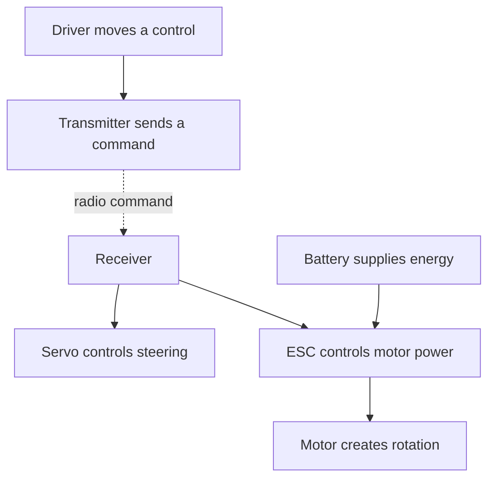

# Topic 3.1 - Meet the RC Electronics

> **"The buggy does not have one brain or one muscle.
> It moves because several small systems pass power and instructions to one another."**

---

# Learning Objectives 🎯

By the end of this topic you will be able to:

- Name the five main electronic modules carried by an RC buggy.
- Match each module to its job.
- Separate the energy path from the command path.
- Trace a steering command from your hand to the front wheels.
- Trace a throttle command from your finger to the motor.
- Explain why the receiver sends instructions but does not drive the motor directly.
- Recognise polarity, channel labels and keyed connectors.
- Perform a visual pre-power check without connecting a battery.
- Diagnose missing, reversed and misplaced links on a system map.
- Build a reusable RC electronics connection trainer from card and household materials.

---

# Before We Begin

Imagine a theatre just before a show.

The lighting operator receives instructions.
The power cables provide energy.
The lamps turn that energy into light.

An instruction is not the same thing as the energy needed to carry it out.

Your VoltForge buggy works in a similar way.
The transmitter in your hands sends instructions, while the battery provides the energy that makes the steering and wheels move.

The receiver, servo, electronic speed controller and motor each perform one smaller job.
If one module is missing or connected incorrectly, the whole buggy may stop behaving as a system.

In this first topic of Part 3, we will meet the complete team before studying each member closely.

---

# Why Start with the Whole System?

Open a jigsaw box and look at the picture on the lid.
That complete picture helps you understand where each small piece belongs.

Part 3 follows the same idea.

This topic gives you the picture on the lid:

- the **battery** stores energy
- the **receiver** receives the driver's radio commands
- the **servo** moves the steering
- the **electronic speed controller** controls motor power
- the **motor** creates rotation

Later topics will open each module and investigate its important ideas.

For now, your job is to understand the connections.

Remember systems thinking from Topic 1.2.
A system has inputs, a process and outputs.

For our buggy:

| System view | Buggy example |
|---|---|
| Input | Driver moves the steering wheel or trigger |
| Process | Radio and electronic modules interpret the command |
| Output | Front wheels steer or driven wheels rotate |
| Feedback | Driver sees the buggy move and corrects the controls |

The buggy is more than a collection of purchased parts.
It is the relationships between those parts.

---

# Meet the Complete RC Team

Think of a football team.
One player cannot defend, pass, shoot and keep goal at the same moment.

RC modules also have specialised jobs.

| Module | Plain-language job | Buggy result |
|---|---|---|
| Battery | Stores and supplies electrical energy | The electronics can operate |
| Receiver | Listens for commands from the transmitter | Steering and throttle instructions enter the buggy |
| Servo | Turns an instruction into controlled angular movement | Steering links move left or right |
| Electronic speed controller (ESC) | Regulates electrical power sent to the motor | Motor speed and direction can change |
| Motor | Turns electrical energy into rotation | The drivetrain can turn the wheels |

The handheld **transmitter** belongs to the complete control system, but it is not carried by the buggy.
It sends the driver's commands by radio.

The **drivetrain** is the mechanical system from motor to driven wheels.
We will explore it in Topic 3.8.

> **[Signature visual: a top-down RC buggy with five large labelled modules. A red energy path runs from BATTERY to ESC to MOTOR. A blue command path runs from TRANSMITTER through the air to RECEIVER, then branches to SERVO and ESC. Mechanical arrows continue from SERVO to STEERING and from MOTOR to DRIVETRAIN.]**

This picture is the map for the whole of Part 3.

---

# Two Paths, One Working Buggy

A restaurant order and the food that reaches the table travel by different paths.

The waiter carries information to the kitchen.
The kitchen supplies the meal.

Our RC system also has two different pathways.

## The energy path

The **energy path** is the route through which useful electrical energy reaches a device that performs work.

The main drive-energy route is:

```text
Battery -> ESC -> Motor -> Drivetrain -> Wheels
```

The battery supplies energy.
The ESC controls how much reaches the motor.
The motor changes it into rotation.

## The command path

The **command path** is the route followed by information about what the driver wants.

The steering command route is:

```text
Driver -> Transmitter -> Radio link -> Receiver -> Servo -> Steering links
```

The throttle command route is:

```text
Driver -> Transmitter -> Radio link -> Receiver -> ESC -> Motor
```

The two paths meet inside active modules.
The servo needs a command and energy before it can move.
The ESC needs a throttle command and battery energy before it can control the motor.



> **🤔 Think about it.**
>
> Pretend to steer a switched-off toy car with its controller.
> Your hand can still make the command, but why does the car not respond?

The command is only information.
Without an energy source, the modules cannot carry out the instruction.

The reverse is also true.
A connected battery does not tell the buggy whether to steer left or right.

---

# Module 1 - The Battery 🔋

Imagine a reusable water bottle carried on a walk.
It stores something useful until you need it.

A **battery** stores energy chemically and makes electrical energy available at its terminals.

In an RC buggy, the battery may supply:

- the high-power drive system
- the ESC electronics
- the receiver and servo through the system's designed power route

The exact route depends on the equipment.
We will follow the manufacturer's diagram rather than guessing.

Three battery ideas matter immediately:

- **polarity** identifies positive and negative connections
- voltage must suit every connected component
- the connector must be mechanically and electrically suitable

Battery chemistry, capacity, charging and storage belong to Topic 3.3.

> **⚠️ SAFETY**
>
> Do not connect, charge, open or modify an RC battery for this topic.
> Never use a swollen, punctured, hot, leaking or damaged battery.
> Keep real batteries disconnected while mapping or arranging the system.
> LiPo battery handling begins in Topic 3.3 under direct adult supervision.

For today's work, a paper battery card is safer and teaches the connection equally well.

---

# Module 2 - The Receiver 📻

Think of a radio-controlled garage door.
The controller sends a coded message, and a receiver listens for the correct one.

The RC **receiver** is the small module on the buggy that receives radio commands from the transmitter.

It provides connection positions called **channels**.
Each channel carries a separate control job.

A common two-channel car arrangement is:

| Channel job | Typical connection |
|---|---|
| Steering | Servo |
| Throttle | ESC signal lead |

Do not assume the channel number from this table.
Manufacturers may label and arrange their equipment differently.

Read the receiver markings and manual.

The receiver does not normally supply the drive motor's heavy current directly.
It passes the throttle instruction to the ESC.

That division of work protects the small control electronics and lets the ESC handle the motor's larger energy flow.

Binding, channels, range checks and failsafe settings belong to Topic 3.4.

---

# Module 3 - The Steering Servo

Push a door near its hinge and it hardly turns.
Push near the handle and it turns more easily.

The position of a push matters as much as the push itself.

A **servo** is an actuator that moves to a controlled position in response to a command.
An actuator is a device that creates movement.

The steering servo usually turns a removable arm called a servo horn.
The horn pushes steering links, which turn the front wheels.

```text
Receiver command -> Servo rotation -> Servo horn -> Steering links -> Front wheels
```

The servo is not a drive motor.
It is designed to move to controlled positions and hold them within its limits.

Important servo ideas include:

- angle
- torque
- speed
- centre position
- travel limits
- horn geometry

Those ideas belong to Topic 3.5.

> **[Sketch: top view of a steering servo. The servo horn is centred. Two steering links lead to left and right front wheel pivots. Three faint positions show left, centre and right movement.]**

For now, remember this sentence:

> The receiver tells the servo where to move; the servo supplies the physical movement.

---

# Module 4 - The Electronic Speed Controller

Imagine turning a tap.
The water supply contains energy, but the tap controls how much flow reaches the sink.

The **electronic speed controller**, usually shortened to **ESC**, controls the electrical power delivered to the motor.

It listens to a throttle command from the receiver.
It then switches motor power in a controlled way.

Depending on its design and settings, an ESC may control:

- acceleration
- maximum forward power
- braking
- reverse
- protection against unsafe conditions
- power supplied to the receiver system

The ESC sits at an important meeting point.

```text
Command input: Receiver -> ESC
Energy input:  Battery  -> ESC
Power output:  ESC      -> Motor
```

This is why an ESC has several different leads.
They do not all perform the same job.

Electronic speed controllers are covered properly in Topic 3.6.

> **⚠️ SAFETY**
>
> Never connect a motor and battery merely to see what happens.
> An incorrectly configured system can start suddenly.
> A spinning wheel, shaft, pinion or propeller-like part can catch hair, clothing and fingers.
> Real powered testing requires adult supervision, wheels raised clear and the manufacturer's procedure.

---

# Module 5 - The Motor

An electric fan takes electrical energy and turns its blades.
An RC motor performs the same broad energy change, but its rotation enters a drivetrain.

An electric **motor** changes electrical energy into mechanical rotation.

The motor shaft does not normally touch the tyre directly.
It usually drives gears, shafts or other drivetrain parts that carry rotation to the wheels.

```text
Electrical energy -> Motor rotation -> Drivetrain -> Wheel rotation -> Buggy movement
```

Motor speed is not the same as buggy speed.
Gear ratio, wheel diameter, load, grip and losses all affect the final movement.

Brushed and brushless motors are introduced in Topic 3.7.
Gears and the drivetrain follow in Topic 3.8.

For today's system map, the motor is the final electronic module in the main drive-energy path.

---

> **☕ Good place to pause.**
> Point to each module in the signature visual and say its job aloud.
> The next section follows complete commands from the driver to the buggy.

---

# Follow a Steering Command

Suppose you turn the transmitter wheel to the left.

What must happen before the buggy turns?

## Step 1 - Your hand creates the input

You rotate the steering control.

## Step 2 - The transmitter encodes the request

The transmitter changes your movement into a radio command.

## Step 3 - The receiver accepts the command

The receiver identifies the steering information and directs it to the steering channel.

## Step 4 - The servo moves

The servo turns towards a commanded position.

## Step 5 - The linkage transfers movement

The servo horn pushes and pulls the steering links.

## Step 6 - The wheels change direction

The front wheels point left, so the rolling buggy can follow a curved path.

The complete chain is:

```text
Hand -> Transmitter -> Radio -> Receiver -> Servo -> Linkage -> Wheels
```

If the wheels turn right when you command left, the system is responding but the direction is wrong.
That is a configuration or mechanism problem, not proof that every module has failed.

---

# Follow a Throttle Command

Now suppose you gently pull the throttle trigger.

## Step 1 - Your finger creates the input

You move the throttle control.

## Step 2 - The transmitter sends the request

The radio message carries throttle information.

## Step 3 - The receiver routes the command

The receiver sends the throttle signal through the correct channel.

## Step 4 - The ESC interprets the command

The ESC decides how to control motor power according to its settings.

## Step 5 - The motor rotates

Controlled electrical energy reaches the motor and produces rotation.

## Step 6 - The drivetrain moves the buggy

Mechanical parts carry the rotation to the driven wheels.

The complete chain is:

```text
Finger -> Transmitter -> Radio -> Receiver -> ESC -> Motor -> Drivetrain -> Wheels
```

Notice that the receiver does not sit in the high-power path between battery and motor.
It supplies the command to the ESC.

---

# One Cable Can Carry More Than One Kind of Connection

A motorway bridge may carry cars, signs and communication cables at the same crossing.
Those things use the same location but perform different jobs.

An RC lead can also contain several conductors serving different purposes.

A typical three-wire servo-style lead provides connections for:

- a command signal
- positive supply
- negative or return connection

The colours and order are not guaranteed across every product.
Check the markings and instructions for the actual equipment.

This explains an important detail.
The receiver must exchange command information with a module, while the receiver system also needs electrical power.

We do not need to follow individual electrons yet.
Voltage, current, resistance and power begin in Topic 3.2.

---

# Connectors Are Interfaces

Remember modular design from Part 2.
A removable module needs an agreed place to connect.

An **interface** is the boundary where two parts meet and exchange something useful.

An RC connector interface may define:

- physical shape
- contact positions
- polarity
- number of conductors
- current capacity
- locking or retention method
- signal arrangement

Two plugs that fit are not automatically electrically compatible.
Two components with similar voltage labels are not automatically signal-compatible.

The interface must be checked as a complete agreement.

| Check | Question |
|---|---|
| Mechanical | Do the correct plug and socket mate without force? |
| Polarity | Do positive and negative contacts align correctly? |
| Electrical | Are voltage and current ratings suitable? |
| Signal | Does the signal type and contact order match? |
| Retention | Will vibration pull the connector apart? |
| Service | Can the correct module be unplugged without cutting wires? |

Never trim a keyed connector to make it fit.
The shape may be preventing a dangerous mistake.

---

# Polarity Is Not a Colour Guess

Put two magnets together.
Their orientation changes the result even though the magnets are the same objects.

Electrical connections can also depend on orientation.

**Polarity** identifies opposite electrical terminals, commonly positive and negative in a low-voltage DC system.

Red is often positive and black is often negative.
That convention helps, but it is not evidence by itself.

Verify polarity from:

- clear `+` and `-` markings
- the manufacturer's wiring diagram
- the keyed connector orientation
- a checked harness record
- suitable measurement by a competent adult when required

Topic 2.9 taught us to label both ends of a harness.
That habit becomes especially valuable when several black connector housings look alike.

---

# Compatibility Comes Before Connection

A USB-shaped plug does not prove that every device behind it expects the same job.

RC electronics also need more than matching shapes.

Before connecting real parts, check:

1. Battery type and voltage suit the ESC.
2. ESC type suits the motor.
3. ESC current rating suits the motor and load.
4. Receiver supply voltage is within its permitted range.
5. Servo supply voltage is within its permitted range.
6. Connector polarity and contact order match.
7. Transmitter and receiver use a compatible radio system.
8. The selected components fit the buggy's packaging envelope.

The **packaging envelope** is the space a part needs, including room for wires, cooling and access.
Remember the suitcase analogy from Part 1: the suitcase must fit, and you still need room to open it and grab the handle.

This topic does not ask you to choose final components.
It teaches the questions that come before buying.

---

# Safe Connection Order

You put ingredients into a recipe in a planned order.
Changing the order can create a mess even when every ingredient is correct.

Electrical setup also needs a planned sequence.

For an unpowered inspection:

1. Read the manuals for the exact modules.
2. Check all parts for damage.
3. Confirm the motor and drivetrain cannot move unexpectedly.
4. Place the power switch in the specified off position, if fitted.
5. Verify channel positions, connector orientation and polarity.
6. Connect only the unpowered signal and module leads required by the diagram.
7. Ask a responsible adult to inspect the full system.
8. Stop before connecting the battery.

The later powered sequence may vary by manufacturer.
Topic 3.3 covers battery safety, and Topic 3.6 covers ESC setup.

> **⚠️ SAFETY**
>
> A system map is not permission to power real electronics.
> Keep the battery physically disconnected throughout this topic.
> Do not rely only on a switch.
> Remove pinion gears or raise driven wheels as required by the later supervised test plan.

---

> **☕ Good place to pause.**
> Stretch, get a drink, or explain the two paths to someone else.
> The next section turns the system map into a pre-power checking tool.

---

# The Pre-Power Visual Check

Pilots use checklists because familiar jobs can still hide simple mistakes.

Before power is ever connected, inspect the system from source to output.

## Battery area

- Battery is the correct planned type.
- Battery has no visible damage.
- Connector housing and contacts are undamaged.
- Polarity matches the checked diagram.
- Battery remains disconnected.

## Receiver area

- Steering and throttle leads use the planned channels.
- Plugs face the correct direction.
- No metal contact is exposed.
- The receiver is protected and accessible.

## Servo area

- Servo lead is not trapped.
- Servo horn and links can move without catching wires.
- The mechanism is not forced beyond its travel.

## ESC area

- Battery, motor and receiver leads are identified separately.
- ESC suits the planned battery and motor.
- Cooling area is not blocked.
- Switch and setup button remain accessible.

## Motor and drivetrain area

- Motor leads are secure and clear of rotation.
- Gears and shafts cannot catch loose items.
- Driven wheels are controlled for any later test.

This check verifies the visible arrangement.
It does not prove the system is electrically correct or safe under load.

---

# Fault Finding: Follow the Path

Imagine a row of falling dominoes.
If the final domino remains standing, start at the beginning and find where the sequence stopped.

Systematic **fault finding** means tracing a problem through a planned path instead of changing random parts.

| Symptom on a supervised test system | First path to trace | Possible categories |
|---|---|---|
| Nothing responds | Energy and receiver power paths | Disconnected source, switch, power route |
| Steering works but motor does not | Throttle command and drive-energy paths | Channel, ESC, motor or drivetrain |
| Motor works but steering does not | Steering command path | Channel, plug, servo or linkage |
| Steering responds to throttle | Receiver channel connections | Leads placed in wrong channels |
| Wheels steer opposite to command | Steering configuration and linkage | Reversed setting or geometry |
| Motor starts unexpectedly | Stop immediately | Unsafe setup, calibration or signal fault |

> If movement is unexpected, release the control, switch off by the approved sequence and disconnect the battery when safe.
> Do not reach into moving parts.

A table suggests where to inspect.
It does not replace the equipment manual or adult supervision.

---

# Hands-On Activity 1 - Module Match

## You will need

- five small pieces of scrap paper
- a pencil
- the module table from this topic

## Steps

1. Write one module name on each paper piece.
2. Turn the pieces face down and mix them.
3. Pick one card.
4. Say its job without looking at the table.
5. Place it in either the command path, energy path or both.
6. Check your answer.

## Upgrade

If an adult has a real unpowered RC system, place each paper label beside the correct module.
Do not connect or disconnect the battery.

## What you should discover

Some modules belong mainly to one path.
The ESC sits where command information controls the energy path.

---

# Hands-On Activity 2 - Human RC System

## You will need

- five or more people, or five labelled chairs
- two coloured paper strips

Use one colour for commands and one for energy.

## Steps

1. Assign roles: transmitter, receiver, battery, ESC, motor and servo.
2. Pass a steering command from transmitter to receiver to servo.
3. Pass a throttle command from transmitter to receiver to ESC.
4. Pass the energy strip from battery to ESC to motor.
5. Ask the motor to move only when it has both the controlled energy route and the throttle command.
6. Remove one person or chair and describe the new fault.

## What you should discover

Information and energy cooperate, but they are not interchangeable.

---

# Hands-On Activity 3 - Trace the Steering Path

## You will need

- paper
- two coloured pencils or pens

## Steps

1. Draw boxes for driver, transmitter, receiver, servo and wheels.
2. Arrange them in the order a command travels.
3. Draw blue arrows between them.
4. Add the servo horn and linkage between servo and wheels.
5. Circle the point where electrical output becomes mechanical movement.

## Challenge

Draw a cross through the receiver-to-servo arrow.
Predict which modules can still have energy and which output will be missing.

---

# Hands-On Activity 4 - Trace the Throttle Path

## You will need

- your steering-path drawing
- a second sheet of paper

## Steps

1. Draw the driver, transmitter, receiver, ESC, motor, drivetrain and wheels.
2. Use blue arrows for commands.
3. Add the battery.
4. Use red arrows for the drive-energy path.
5. Circle the ESC where the two paths meet.
6. Label the place where electrical energy becomes rotation.

## Challenge

Remove the receiver-to-ESC command arrow.
Explain why a connected battery alone should not be treated as a throttle command.

---

# Hands-On Activity 5 - Connector Detective

> **⚠️ SAFETY**
>
> Ask a responsible adult before handling any real electronic module.
> Use only clean, undamaged and completely unpowered parts.
> Leave every battery disconnected and do not insert metal objects into connectors.

## No-equipment version

Study the connector table in this topic.
Write six checks you would make before joining two unknown plugs.

## Real-parts upgrade

With an adult, look at disconnected leads from an RC system.

Without joining them, identify:

- housing shape
- key or latch
- number of contacts
- wire colours
- labels
- strain relief

Do not decide compatibility from shape alone.
Record what evidence would still be needed.

---

# Hands-On Activity 6 - Pre-Power Inspection Rehearsal

## You will need

- the pre-power checklist
- your drawings or paper module cards

## Steps

1. Arrange the module cards as a complete buggy system.
2. Pretend one connector is reversed.
3. Pretend the steering lead is in the throttle channel.
4. Place one paper wire across the drawn drivetrain.
5. Work through the checklist in order.
6. Mark every fault you find.
7. Repeat until another person can find all faults.

This rehearsal develops a habit before real stored energy enters the system.

---

> **☕ Good place to pause.**
> You have completed the short activities.
> The next section combines them in a keepable working model.

---

# Topic Mini Project - RC Electronics Connection Trainer 🛠️

Build a keepable card model of the complete RC electronics system.

Your modules will unplug and move.
Two coloured paths will show commands and energy.
Fault cards will turn the model into a diagnosis game.

## What the artifact teaches

The trainer embodies three core ideas:

- modules perform specialised jobs
- energy and commands follow different paths
- interfaces must be correct before power is connected

It does not create radio signals or electrical power.
You provide the reasoning that makes the model work.

## Materials

- corrugated packaging card or a cereal box
- scrap paper
- pencil and coloured pens
- ruler
- scissors suitable for card
- glue or tape
- string, wool or narrow paper strips in two colours
- reusable adhesive, folded paper tabs or hook-and-loop scraps if available
- one small envelope for fault cards

No electronic parts are required.

> **⚠️ SAFETY**
>
> Show a responsible adult or guardian what you plan to build before starting, and build with them nearby.
> Use age-appropriate scissors on a clear table and cut away from fingers.
> Do not use a craft knife.
> Do not add real batteries or power supplies to this model.

> **🎬 Watch the build**
>
> - Science Buddies: search "Make a Paper Circuit" to see how flat paths and labelled parts can make an electrical idea visible.
> - Tinkercad Learn Circuits: open the circuits lessons with an adult to see components arranged as a system before making the card version.

## Step 1 - Make the buggy base

Cut a card rectangle about `420 mm × 250 mm`.

Round the corners with scissors if the card has sharp points.
Draw a simple top view of the buggy chassis.

Mark:

- front
- rear
- left side
- right side
- four wheels
- steering zone
- drivetrain zone

## Step 2 - Create the module cards

Cut six smaller cards.

Label them:

1. BATTERY
2. RECEIVER
3. SERVO
4. ESC
5. MOTOR
6. TRANSMITTER

Make the transmitter card a different shape because it stays in the driver's hands.

## Step 3 - Add each module's job

Write one short job under each name.

For example:

```text
ESC
Receives a throttle command.
Controls electrical power to the motor.
```

Do not write only "makes car go".
That hides the module's real boundary.

## Step 4 - Add interface tabs

Cut or fold paper tabs for each connection.

Label the ESC tabs:

- BATTERY ENERGY IN
- RECEIVER COMMAND IN
- MOTOR POWER OUT

Label the receiver tabs:

- RADIO COMMAND IN
- STEERING CHANNEL OUT
- THROTTLE CHANNEL OUT

These labels make wrong connections visible.

## Step 5 - Place the modules

Arrange the battery, receiver, servo, ESC and motor on the drawn chassis.

Keep the transmitter outside the chassis.

Do not glue the cards permanently.
Use folded paper pockets, reusable adhesive or loops of tape so the layout can change.

## Step 6 - Build the command path

Use blue string or paper strips.

Connect:

```text
Transmitter -> Receiver
Receiver -> Servo
Receiver -> ESC
```

Use a dashed paper strip between transmitter and receiver to represent the radio link through the air.

## Step 7 - Build the energy path

Use red string or paper strips.

Connect:

```text
Battery -> ESC -> Motor
```

Add a small energy branch towards the receiver system labelled:

```text
Receiver-system power route - exact design checked later
```

This avoids pretending every RC system is wired identically.

## Step 8 - Add the mechanical outputs

Use grey paper strips.

Connect:

```text
Servo -> Steering links -> Front wheels
Motor -> Drivetrain -> Driven wheels
```

Mechanical links should look different from electrical wires.

## Step 9 - Add polarity marks

Put `+` and `-` symbols on the paper battery interface and matching ESC interface.

Make the paper shapes fit in only one correct orientation.

This paper key represents a polarised connector.

## Step 10 - Add keep-clear zones

Shade areas around:

- gears
- motor shaft
- steering links
- tyres
- hot electronic surfaces

Route every paper wire outside those zones.

Remember Topic 2.9.
A correct electrical path can still fail through poor mechanical routing.

## Step 11 - Add a system legend

Create a key in one corner:

| Model colour | Meaning |
|---|---|
| Blue | Command or information path |
| Red | Electrical energy path |
| Grey | Mechanical movement path |
| Hatched area | Keep clear |

## Step 12 - Create fault cards

Make at least eight small cards.

Write one fault on each:

- steering lead missing
- throttle lead in steering channel
- battery polarity reversed
- motor lead missing
- wire crosses the drivetrain
- servo horn disconnected
- transmitter not linked to receiver
- ESC-to-motor path broken

Put them in the envelope.

## Step 13 - Test the steering story

Point to each part while saying:

```text
My hand moves the transmitter control.
The transmitter sends a radio command.
The receiver routes the steering command.
The servo moves.
The linkage turns the wheels.
```

Pass if you can follow every step without jumping directly from transmitter to wheels.

## Step 14 - Test the throttle story

Trace the blue command path first.
Then trace the red energy path.

Pass if both meet at the ESC and continue correctly to motor rotation.

## Step 15 - Run the fault game

Ask another person to choose a fault card secretly.

They alter the model.
You inspect it without random rearrangement.

State:

1. the missing or incorrect link
2. the affected path
3. the expected symptom
4. the safe correction

Swap roles after each fault.

## Step 16 - Perform the interface test

Try to place the battery paper connector backwards.

Your paper key should block the wrong orientation.
If it does not, revise the shape.

Then check whether every tab has one clear job.

## Step 17 - Reflection

Answer these questions on the back of the model:

1. Which module belongs to both the command and energy stories?
2. Where does electrical energy become rotation?
3. Where does a radio command become steering movement?
4. Why can matching connector shapes still be unsafe?
5. Which real check must happen before a battery is connected?

The model has succeeded when it helps you explain and diagnose the system.
Neat decoration is useful only if it improves that job.

## Step 18 - Keep the artifact

Store the fault cards in their envelope and attach it to the back.

Keep the trainer on your showcase shelf.
You will reuse it as Topics 3.2-3.10 add real engineering detail to each module.

---

# Thinking Like an Engineer - The System Architecture

An architect decides how rooms connect before choosing every light fitting.

Engineers also create a high-level arrangement before final component selection.
That arrangement is the **system architecture**.

For our RC buggy, the architecture records:

- which modules exist
- which module connects to which
- what crosses each interface
- what each module must output
- what safety boundary surrounds the system

Your card trainer is an early architecture model.

It is deliberately simple.
Simple models make missing connections easier to see.

---

# Cheapest Valid Prototype

The cheapest valid prototype for this topic is the card connection trainer.

It costs almost nothing and tests whether you can:

- identify every module
- trace both paths
- explain every interface
- detect planned faults

Buying an ESC or motor would not improve that test.
Real parts add cost and stored energy before the system idea is secure.

---

# What to Buy, Reuse and Make

## Reuse

- packaging card
- cereal boxes
- scrap paper
- wool or string
- removable tape
- old envelopes

## Make

- module cards
- interface tabs
- coloured path strips
- fault cards
- chassis base

## Buy later

- battery only after Topic 3.3 safety and compatibility work
- transmitter and receiver after Topic 3.4 requirements are understood
- servo after Topic 3.5 torque and geometry work
- ESC after Topic 3.6 compatibility checks
- motor after Topic 3.7 performance needs are known

Do not buy a random bundle merely because the plugs appear to fit.

---

# Cost Checkpoint

| Item | Expected cost now | Decision |
|---|---:|---|
| Scrap-card system trainer | £0 | Build now |
| Pens, tape and string already available | £0 | Reuse |
| Real RC electronics | £0 in this topic | Delay purchase |

The target cost for Topic 3.1 is `£0` using household scraps.

The learning result is an accurate system map, not a powered demonstration.

---

# Modular Interfaces

Your trainer uses removable modules on purpose.

Each card has:

- a clear name
- one defined job
- labelled inputs
- labelled outputs
- a removable connection

That mirrors the buggy's modular design.

If you later replace the servo, you should not need to redesign the battery-to-motor path.
If you later replace the motor, the steering command path should remain understandable.

Modules reduce the size of a problem.
Interfaces stop the modules becoming isolated pieces.

---

# Test Plan

## Test 1 - Module identification

**Question:** Can a learner identify all six control-system components?

**Independent variable:** The order and position of the module cards.

**Dependent variable:** Number of modules named with the correct job.

**Control variables:** Same six cards, same time limit and no reference table.

**Procedure:** Mix the cards, reveal them one at a time and state each job.

**Pass condition:** Six correct names and six correct jobs.

## Test 2 - Path tracing

**Question:** Can a learner distinguish commands from energy?

**Independent variable:** Steering or throttle scenario.

**Dependent variable:** Correct sequence of traced modules.

**Control variables:** Same trainer, same colour legend and all modules present.

**Procedure:** Trace the requested output without consulting the topic.

**Pass condition:** Every step is in order and the two path types are named correctly.

## Test 3 - Fault diagnosis

**Question:** Can a learner locate a single introduced fault systematically?

**Independent variable:** Fault card selected.

**Dependent variable:** Correct fault, symptom and correction identified.

**Control variables:** One fault at a time, same trainer and no powered equipment.

**Procedure:** Another person alters the trainer using one fault card. Trace the affected path from its beginning.

**Pass condition:** Identify the fault and propose the safe correction without changing unrelated modules.

---

# Upgrade Path

Your trainer can grow with Part 3.

| Later topic | Trainer upgrade |
|---|---|
| 3.2 | Add voltage, current and power labels |
| 3.3 | Add battery specification and charging-safety cards |
| 3.4 | Add channel, binding and failsafe information |
| 3.5 | Add servo angle, torque and linkage geometry |
| 3.6 | Add ESC ratings, calibration and motor connections |
| 3.7 | Add motor type, speed and torque notes |
| 3.8 | Add gears and drivetrain route |
| 3.9 | Add steering geometry |
| 3.10 | Add suspension, wheel and grip effects |

By the end of Part 3, the simple map becomes a compact record of the whole RC system.

---

# Stop Point Before the Next Purchase

Stop before buying or powering RC electronics.

Continue only when you can:

- name every main module
- explain its job in one sentence
- trace steering and throttle commands
- trace the main drive-energy path
- explain why the ESC is not the receiver
- identify polarity and channel checks
- pass the card trainer's three tests

The next topic teaches the electrical ideas needed to compare real specifications.

---

# Common Beginner Mistakes ❌

## Mistake 1 - Treating every wire as a power wire

Some connections carry commands, some carry useful energy, and some leads contain conductors for both purposes.

Trace the job, not only the cable shape.

## Mistake 2 - Calling the receiver the brain of everything

The receiver accepts radio commands, but the ESC controls motor power and the servo creates steering movement.

Each module performs part of the decision-and-action chain.

## Mistake 3 - Connecting the motor directly to the receiver

The small receiver channel carries control information.
The ESC handles the motor's power route.

## Mistake 4 - Assuming matching plugs mean matching systems

Shape is only one compatibility check.
Voltage, polarity, current, signal and contact order must also agree.

## Mistake 5 - Trusting wire colours alone

Colours are conventions, not proof.
Use markings, diagrams and verified orientation.

## Mistake 6 - Powering the system to find out what happens

Unexpected movement can damage parts or injure someone.
Inspect, verify and plan the test before connecting stored energy.

## Mistake 7 - Forgetting the mechanical output

Electronics do not move the buggy by magic.
Servo movement enters steering links, and motor rotation enters the drivetrain.

## Mistake 8 - Diagnosing by replacing random parts

Trace the affected command or energy path from beginning to end.
Change one controlled thing at a time.

## Mistake 9 - Gluing the trainer modules permanently

The model should remain modular so you can rearrange, upgrade and diagnose it.

## Mistake 10 - Buying before defining requirements

An attractive component may not suit the voltage, load, space or other modules.
Learn the requirements first.

---

# Topic Summary 📝

- The complete RC control system contains a transmitter, receiver, battery, servo, ESC and motor.
- The transmitter sends the driver's commands by radio.
- The receiver routes steering and throttle commands through separate channels.
- The servo turns a steering command into controlled movement.
- The ESC uses a throttle command to regulate motor power.
- The motor changes electrical energy into rotation for the drivetrain.
- The command path carries information about what should happen.
- The energy path supplies the ability to perform work.
- An interface includes shape, polarity, electrical ratings, signal arrangement and retention.
- Matching plug shapes do not prove compatibility.
- Real batteries remain disconnected until the later safety and test procedures are understood.
- A system map helps us find faults by tracing paths instead of guessing.

---

# New Words 📖

| Word | Meaning |
|---|---|
| Actuator | A device that creates controlled physical movement |
| Battery | A device that stores energy chemically and makes electrical energy available |
| Channel | A separate control route used for one radio-control job |
| Command path | The route followed by information about what the driver wants |
| Electronic speed controller (ESC) | A module that controls electrical power delivered to a motor |
| Energy path | The route through which useful electrical energy reaches a device that performs work |
| Fault finding | Tracing a problem systematically to locate its cause |
| Interface | A boundary where two parts meet and exchange power, information or movement |
| Motor | A device that changes electrical energy into mechanical rotation |
| Polarity | Identification of opposite electrical terminals, such as positive and negative |
| Receiver | The buggy module that receives radio commands from the transmitter |
| Servo | An actuator that moves to a controlled position in response to a command |
| System architecture | A high-level arrangement showing modules and the connections between them |
| Transmitter | The handheld device that sends the driver's control commands by radio |

---

# Review Questions ❓

1. What are the five main electronic modules carried by the buggy?
2. Which control-system component remains in the driver's hands?
3. What is the difference between a command path and an energy path?
4. Trace a steering command from the driver's hand to the front wheels.
5. Trace a throttle command from the driver's finger to the driven wheels.
6. Why does the receiver send a command to the ESC instead of driving the motor directly?
7. At which module do the main throttle-command and drive-energy paths meet?
8. What useful energy change happens inside the motor?
9. Why can two connectors that fit together still be incompatible?
10. Name four checks included in an electrical interface.
11. Steering works, but the motor does not. Which two paths would you trace first?
12. Why must the battery remain disconnected during a pre-power visual check?

---

# Topic Checklist ✅

- [ ] I can identify the battery, receiver, servo, ESC and motor.
- [ ] I can explain the transmitter's role.
- [ ] I can distinguish an energy path from a command path.
- [ ] I can trace a steering command in the correct order.
- [ ] I can trace a throttle command and the drive-energy path.
- [ ] I know where electrical energy becomes motor rotation.
- [ ] I understand why connector shape alone does not prove compatibility.
- [ ] I can perform an unpowered visual check using a checklist.
- [ ] I can diagnose a simple fault by following the affected path.
- [ ] I have built and tested my RC electronics connection trainer.
- [ ] I have kept all real RC batteries disconnected in this topic.
- [ ] I have recorded what must be learned before buying components.

---

# Learn More

> **📚 Learn more**
>
> - Tinkercad Learn Circuits: explore virtual components and connections without powering real hardware.
> - BBC Bitesize KS3 Physics: search "electric circuits" for school-level circuit ideas that prepare you for Topic 3.2.
> - Science Buddies: search "Make a Paper Circuit" for a visual example of representing a complete electrical path on card.

---

# Looking Ahead 🔭

We now know who belongs in the RC electronics team and how the modules connect.

But we have used words such as voltage, current and power without opening them properly.

In **Topic 3.2 - Voltage, Current, Resistance and Power**, we will use everyday analogies and a simple low-voltage investigation to understand what electrical values mean.

Those ideas will let us read component labels, compare requirements and explain why a safe system needs more than matching plugs.
