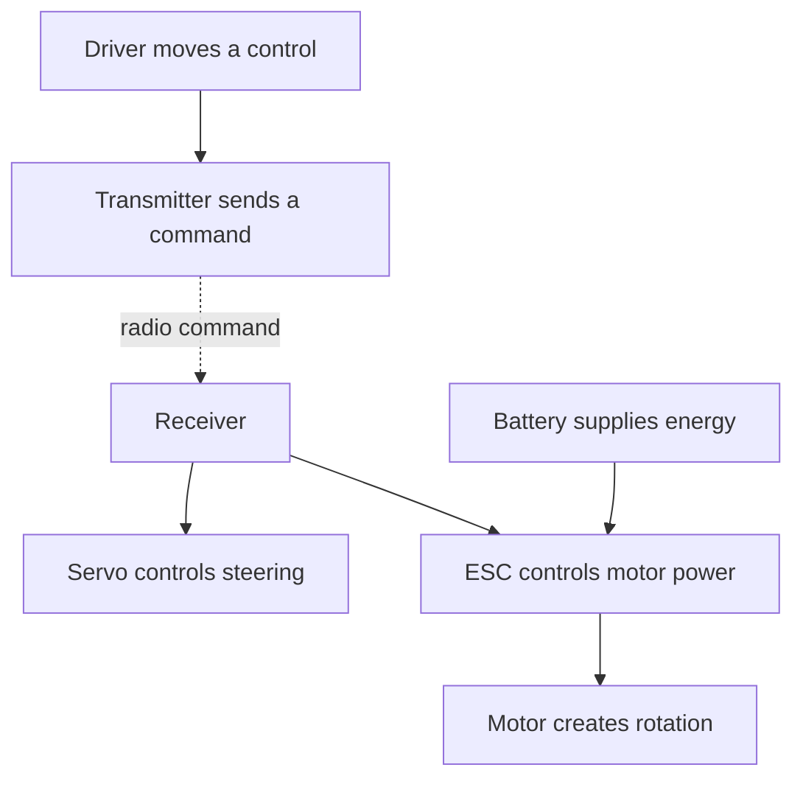

# Topic 3.1 - Meet the RC Electronics

> **"The buggy does not have one brain or one muscle.
> It moves because several small systems pass power and instructions to one another."**

---

# Learning Objectives 🎯

By the end of this topic you will be able to:

- Identify the battery, receiver, servo, ESC, motor and transmitter.
- Explain the jobs of the command, energy and movement paths.
- Trace steering and throttle actions from your hands to the buggy.
- Check basic interfaces, polarity and channel connections before power is connected.
- Find simple faults by following one path at a time.
- Build and test a reusable RC electronics connection trainer.

---

# Before We Begin

Your VoltForge buggy is waiting on the start line.
You pull the trigger, but nothing moves.
There is no smoke, no broken wheel and no clue shouting, "The fault is here."

Where would you look first?

A racing team does not replace every part of a silent car.
It follows the route from the driver's command to the final movement and finds where the story stops.

That is our mission in this first topic of Part 3.
We will meet the electronic team inside the buggy, trace what each member passes onwards and solve faults without connecting a real battery.

---

# Why Start with the Whole System?

Open a jigsaw box and look at the picture on the lid.
That complete picture helps you understand where each small piece belongs.

Part 3 follows the same idea.

This topic gives you the picture on the lid:

- the **battery** stores energy
- the **receiver** receives the driver's radio commands
- the **servo** moves the steering
- the **electronic speed controller** controls motor power
- the **motor** creates rotation

Later topics will open each module and investigate its important ideas.

For now, your job is to understand the connections.

Remember systems thinking from Topic 1.2.
A system has inputs, a process and outputs.

For our buggy:

| System view | Buggy example |
|---|---|
| Input | Driver moves the steering wheel or trigger |
| Process | Radio and electronic modules interpret the command |
| Output | Front wheels steer or driven wheels rotate |
| Feedback | Driver sees the buggy move and corrects the controls |

The buggy is more than a collection of purchased parts.
It becomes a working system only when those parts exchange the right things in the right order.

---

# Meet the Complete RC Team

Think of a football team.
One player cannot defend, pass, shoot and keep goal at the same moment.

RC modules also have specialised jobs.

| Module | Plain-language job | Buggy result |
|---|---|---|
| Battery | Stores and supplies electrical energy | The electronics can operate |
| Receiver | Listens for commands from the transmitter | Steering and throttle instructions enter the buggy |
| Servo | Turns an instruction into controlled angular movement | Steering links move left or right |
| Electronic speed controller (ESC) | Regulates electrical power sent to the motor | Motor speed and direction can change |
| Motor | Turns electrical energy into rotation | The drivetrain can turn the wheels |

The handheld **transmitter** belongs to the complete control system, but it is not carried by the buggy.
It sends the driver's commands by radio.

The **drivetrain** is the mechanical system from motor to driven wheels.
We will explore it in Topic 3.8.

> **[Signature visual, F1 - Figure 3.1.1: annotated top-down photograph of a real, unpowered RC buggy with its body removed. Label the battery, receiver, servo, ESC and motor on the chassis, with the transmitter shown beside the buggy. Overlay a dashed blue command path, a solid forge-orange energy path and a double-line grey movement path. Use arrow shapes and labels as well as colour. The reader should notice that the ESC is where the throttle command meets battery energy.]**
>
> *Figure 3.1.1 - Follow the three paths rather than seeing the electronics as a pile of separate boxes.*
>
> *Alt text: A body-off RC buggy with six labelled electronic components and distinct command, energy and movement paths.*

This picture is the map for the whole of Part 3.

---

# Two Paths, One Working Buggy

A restaurant order and the food that reaches the table travel by different paths.

The waiter carries information to the kitchen.
The kitchen supplies the meal.

Our RC system also has two different pathways.

## The energy path

The **energy path** is the route through which useful electrical energy reaches a device that performs work.

The main drive-energy route is:

```text
Battery -> ESC -> Motor -> Drivetrain -> Wheels
```

The battery supplies energy.
The ESC controls how much reaches the motor.
The motor changes it into rotation.

## The command path

The **command path** is the route followed by information about what the driver wants.

The steering command route is:

```text
Driver -> Transmitter -> Radio link -> Receiver -> Servo -> Steering links
```

The throttle command route is:

```text
Driver -> Transmitter -> Radio link -> Receiver -> ESC -> Motor
```

The two paths meet inside active modules.
The servo needs a command and energy before it can move.
The ESC needs a throttle command and battery energy before it can control the motor.

**Figure 3.1.2 (F0)**



*Figure 3.1.2 - The command and energy routes meet at active modules, but they do different jobs.*

*Alt text: A flowchart in which transmitter commands reach the receiver, servo and ESC, while battery energy reaches the ESC and motor.*

> **[F7 comparison array - Figure 3.1.3: two tabletop scenes using the same switched-off toy car and controller. Left, the controller is being moved but the car has no battery, labelled "command available; energy missing". Right, a battery is beside the car but nobody touches the controller, labelled "energy available; command missing". The reader should notice that neither scene can produce controlled movement.]**
>
> *Figure 3.1.3 - Controlled movement needs both a valid command and a safe energy supply.*
>
> *Alt text: Two toy-car scenes compare a command without energy and energy without a command.*

> **🤔 Think about it.**
>
> Pretend to steer a switched-off toy car with its controller.
> Your hand can still make the command, but why does the car not respond?

The command is only information.
Without an energy source, the modules cannot carry out the instruction.

The reverse is also true.
A connected battery does not tell the buggy whether to steer left or right.

---

# Module 1 - The Battery 🔋

Imagine a reusable water bottle carried on a walk.
It stores something useful until you need it.

A **battery** stores energy chemically and makes electrical energy available at its terminals.

In an RC buggy, the battery may supply:

- the high-power drive system
- the ESC electronics
- the receiver and servo through the system's designed power route

The exact route depends on the equipment.
We will follow the manufacturer's diagram rather than guessing.

Three battery ideas matter immediately:

- **polarity** identifies positive and negative connections
- voltage must suit every connected component
- the connector must be mechanically and electrically suitable

Battery chemistry, capacity, charging and storage belong to Topic 3.3.

> **⚠️ SAFETY**
>
> Do not connect, charge, open or modify an RC battery for this topic.
> Never use a swollen, punctured, hot, leaking or damaged battery.
> Keep real batteries disconnected while mapping or arranging the system.
> LiPo battery handling begins in Topic 3.3 under direct adult supervision.

For today's work, a paper battery card is safer and teaches the connection equally well.

---

# Module 2 - The Receiver 📻

Think of a radio-controlled garage door.
The controller sends a coded message, and a receiver listens for the correct one.

The RC **receiver** is the small module on the buggy that receives radio commands from the transmitter.

It provides connection positions called **channels**.
Each channel carries a separate control job.

A common two-channel car arrangement is:

| Channel job | Typical connection |
|---|---|
| Steering | Servo |
| Throttle | ESC signal lead |

Do not assume the channel number from this table.
Manufacturers may label and arrange their equipment differently.

Read the receiver markings and manual.

The receiver does not normally supply the drive motor's heavy current directly.
It passes the throttle instruction to the ESC.

That division of work protects the small control electronics and lets the ESC handle the motor's larger energy flow.

Binding, channels, range checks and failsafe settings belong to Topic 3.4.

---

# Module 3 - The Steering Servo

Push a door near its hinge and it hardly turns.
Push near the handle and it turns more easily.

The position of a push matters as much as the push itself.

A **servo** is an actuator that moves to a controlled position in response to a command.
An actuator is a device that creates movement.

The steering servo usually turns a removable arm called a servo horn.
The horn pushes steering links, which turn the front wheels.

```text
Receiver command -> Servo rotation -> Servo horn -> Steering links -> Front wheels
```

The servo is not a drive motor.
It is designed to move to controlled positions and hold them within its limits.

Important servo ideas include:

- angle
- torque
- speed
- centre position
- travel limits
- horn geometry

Those ideas belong to Topic 3.5.

> **[F5 motion overlay - Figure 3.1.4: top view of a steering servo, servo horn, two steering links and front wheel pivots. Show the centred position solid and left/right positions as pale outlines. Add curved arrows at the horn and matching direction arrows at the wheels. The reader should notice that a small servo rotation becomes linked movement at both wheels.]**
>
> *Figure 3.1.4 - The servo creates controlled rotation; the horn and links deliver it to the wheels.*
>
> *Alt text: A top-view steering mechanism showing three servo-horn positions linked to left, centred and right wheel positions.*

For now, remember this sentence:

> The receiver tells the servo where to move; the servo supplies the physical movement.

---

# Module 4 - The Electronic Speed Controller

Imagine turning a tap.
The water supply contains energy, but the tap controls how much flow reaches the sink.

The **electronic speed controller**, usually shortened to **ESC**, controls the electrical power delivered to the motor.

It listens to a throttle command from the receiver.
It then switches motor power in a controlled way.

Depending on its design and settings, an ESC may control:

- acceleration
- maximum forward power
- braking
- reverse
- protection against unsafe conditions
- power supplied to the receiver system

The ESC sits at an important meeting point.

```text
Command input: Receiver -> ESC
Energy input:  Battery  -> ESC
Power output:  ESC      -> Motor
```

This is why an ESC has several different leads.
They do not all perform the same job.

Electronic speed controllers are covered properly in Topic 3.6.

> **⚠️ SAFETY**
>
> Never connect a motor and battery merely to see what happens.
> An incorrectly configured system can start suddenly.
> A spinning wheel, shaft, pinion or propeller-like part can catch hair, clothing and fingers.
> Real powered testing requires adult supervision, wheels raised clear and the manufacturer's procedure.

---

# Module 5 - The Motor

An electric fan takes electrical energy and turns its blades.
An RC motor performs the same broad energy change, but its rotation enters a drivetrain.

An electric **motor** changes electrical energy into mechanical rotation.

The motor shaft does not normally touch the tyre directly.
It usually drives gears, shafts or other drivetrain parts that carry rotation to the wheels.

```text
Electrical energy -> Motor rotation -> Drivetrain -> Wheel rotation -> Buggy movement
```

Motor speed is not the same as buggy speed.
Gear ratio, wheel diameter, load, grip and losses all affect the final movement.

Brushed and brushless motors are introduced in Topic 3.7.
Gears and the drivetrain follow in Topic 3.8.

For today's system map, the motor is the final electronic module in the main drive-energy path.

---

> **☕ Good place to pause.**
> Point to each module in the signature visual and say its job aloud.
> The next section follows complete commands from the driver to the buggy.

---

# Follow a Steering Command

Suppose you turn the transmitter wheel left as the buggy approaches a cardboard gate.
The front wheels must turn before the buggy reaches it.

The command story has six moments:

1. Your hand turns the steering control.
2. The transmitter turns that movement into a radio message.
3. The receiver recognises the steering information.
4. The receiver passes it through the steering channel.
5. The servo turns, and its horn pushes the steering links.
6. The front wheels point left, changing the buggy's direction as it rolls.

> **[F4 sequence strip - Figure 3.1.5: six panels following one left-turn command. Keep the same buggy orientation throughout. Panels show hand on transmitter wheel, radio waves, receiver steering port, servo horn rotating, links moving and front wheels pointing left. Number the panels 1-6 and use one dashed blue arrow running through them. The reader should notice that radio information becomes physical movement only at the servo.]**
>
> *Figure 3.1.5 - A steering command becomes movement in stages, so each stage gives you a place to test.*
>
> *Alt text: Six panels trace a left-turn command from the driver's hand through the transmitter and receiver to the servo, linkage and front wheels.*

If the wheels turn right when you command left, several parts are already working.
The fault is likely to be direction setup or linkage geometry, not a completely dead system.

---

# Follow a Throttle Command

Now you gently pull the throttle trigger.
This action needs two stories to meet.

The command story is:

1. Your finger moves the trigger.
2. The transmitter sends throttle information by radio.
3. The receiver routes that information through the throttle channel.
4. The ESC interprets the request.

At the same time, the energy story runs from battery to ESC.
The ESC controls the energy passed to the motor, and the drivetrain carries the resulting rotation to the wheels.

> **[F4 sequence strip - Figure 3.1.6: two rows that join at the ESC. The upper row shows finger, transmitter, receiver and ESC as the command sequence. The lower row shows battery and ESC as the energy sequence. From their meeting point, continue to motor, drivetrain and driven wheels. Use blue dashed, forge-orange solid and grey double-line arrows with text labels. The reader should notice that the receiver is beside the high-current route, not inside it.]**
>
> *Figure 3.1.6 - The ESC turns a small throttle instruction into controlled motor power.*
>
> *Alt text: Parallel command and energy sequences meet at the ESC before continuing as motor rotation through the drivetrain.*

This boundary matters when you diagnose a fault.
Steering can work while the drive system does not, because the two outputs share some modules but not all of them.

---

# One Cable Can Carry More Than One Kind of Connection

A motorway bridge may carry cars, signs and communication cables at the same crossing.
Those things use the same location but perform different jobs.

An RC lead can also contain several conductors serving different purposes.

A typical three-wire servo-style lead provides connections for:

- a command signal
- positive supply
- negative or return connection

The colours and order are not guaranteed across every product.
Check the markings and instructions for the actual equipment.

This explains an important detail.
The receiver must exchange command information with a module, while the receiver system also needs electrical power.

We do not need to follow individual electrons yet.
Voltage, current, resistance and power begin in Topic 3.2.

> **📚 Learn more**
>
> - Autodesk Tinkercad: search "Circuits" to build and test a virtual circuit before you ever connect a real one - nothing you do there can overheat.
> - BBC Bitesize KS3 Physics: search "electric circuits" for the school-level version of the ideas Topic 3.2 opens up.

---

# Connectors Are Interfaces

Remember modular design from Part 2.
A removable module needs an agreed place to connect.

An **interface** is the boundary where two parts meet and exchange something useful.

An RC connector interface may define:

- physical shape
- contact positions
- polarity
- number of conductors
- current capacity
- locking or retention method
- signal arrangement

Two plugs that fit are not automatically electrically compatible.
Two components with similar voltage labels are not automatically signal-compatible.

The interface must be checked as a complete agreement.

| Check | Question |
|---|---|
| Mechanical | Do the correct plug and socket mate without force? |
| Polarity | Do positive and negative contacts align correctly? |
| Electrical | Are voltage and current ratings suitable? |
| Signal | Does the signal type and contact order match? |
| Retention | Will vibration pull the connector apart? |
| Service | Can the correct module be unplugged without cutting wires? |

> **[F2 cross-section - Figure 3.1.7: enlarged cutaway of a keyed three-contact plug approaching its matching socket. Label housing key, latch, contact order, positive supply, return and signal. Beside it, show a same-shaped but incorrectly ordered connector stopped before insertion. The reader should notice that shape is only one part of the interface agreement.]**
>
> *Figure 3.1.7 - A connector can fit mechanically while its contact order is still wrong.*
>
> *Alt text: A cutaway compares a correctly matched three-contact connector with a same-shaped connector whose electrical contacts are in the wrong order.*

Never trim a keyed connector to make it fit.
The shape may be preventing a dangerous mistake.

---

# Polarity Is Not a Colour Guess

Put two magnets together.
Their orientation changes the result even though the magnets are the same objects.

Electrical connections can also depend on orientation.

**Polarity** identifies opposite electrical terminals, commonly positive and negative in a low-voltage DC system.

Red is often positive and black is often negative.
That convention helps, but it is not evidence by itself.

Verify polarity from:

- clear `+` and `-` markings
- the manufacturer's wiring diagram
- the keyed connector orientation
- a checked harness record
- suitable measurement by a competent adult when required

Topic 2.9 taught us to label both ends of a harness.
That habit becomes especially valuable when several black connector housings look alike.

---

# Compatibility Comes Before Connection

A USB-shaped plug does not prove that every device behind it expects the same job.

RC electronics also need more than matching shapes.

> **🤔 Think about it.**
>
> Find two leads at home with the same plug on the end - two USB cables, or two chargers from different devices. Swap them over. They fit perfectly, first time, with no force. Does fitting perfectly prove that the two devices behind those plugs want the same thing?

No. A connector only agrees on shape and contact positions; it says nothing about the voltage, the current or the kind of signal the device behind it expects. That is why the eight checks below are done before anything is plugged in - the plug will happily mate with something that is about to be damaged by it.

Before connecting real parts, check:

1. Battery type and voltage suit the ESC.
2. ESC type suits the motor.
3. ESC current rating suits the motor and load.
4. Receiver supply voltage is within its permitted range.
5. Servo supply voltage is within its permitted range.
6. Connector polarity and contact order match.
7. Transmitter and receiver use a compatible radio system.
8. The selected components fit the buggy's packaging envelope.

The **packaging envelope** is the space a part needs, including room for wires, cooling and access.
Remember the suitcase analogy from Part 1: the suitcase must fit, and you still need room to open it and grab the handle.

This topic does not ask you to choose final components.
It teaches the questions that come before buying.

---

# Safe Connection Order

You put ingredients into a recipe in a planned order.
Changing the order can create a mess even when every ingredient is correct.

Electrical setup also needs a planned sequence.

For an unpowered inspection:

1. Read the manuals for the exact modules.
2. Check all parts for damage.
3. Confirm the motor and drivetrain cannot move unexpectedly.
4. Place the power switch in the specified off position, if fitted.
5. Verify channel positions, connector orientation and polarity.
6. Connect only the unpowered signal and module leads required by the diagram.
7. Ask a responsible adult to inspect the full system.
8. Stop before connecting the battery.

The later powered sequence may vary by manufacturer.
Topic 3.3 covers battery safety, and Topic 3.6 covers ESC setup.

> **⚠️ SAFETY**
>
> A system map is not permission to power real electronics.
> Keep the battery physically disconnected throughout this topic.
> Do not rely only on a switch.
> Remove pinion gears or raise driven wheels as required by the later supervised test plan.

---

> **☕ Good place to pause.**
> Stretch, get a drink, or explain the two paths to someone else.
> The next section turns the system map into a pre-power checking tool.

---

# The Pre-Power Visual Check

Pilots use checklists because familiar jobs can still hide simple mistakes.

Before power is ever connected, inspect the system from source to output.

## Battery area

- Battery is the correct planned type.
- Battery has no visible damage.
- Connector housing and contacts are undamaged.
- Polarity matches the checked diagram.
- Battery remains disconnected.

## Receiver area

- Steering and throttle leads use the planned channels.
- Plugs face the correct direction.
- No metal contact is exposed.
- The receiver is protected and accessible.

## Servo area

- Servo lead is not trapped.
- Servo horn and links can move without catching wires.
- The mechanism is not forced beyond its travel.

## ESC area

- Battery, motor and receiver leads are identified separately.
- ESC suits the planned battery and motor.
- Cooling area is not blocked.
- Switch and setup button remain accessible.

## Motor and drivetrain area

- Motor leads are secure and clear of rotation.
- Gears and shafts cannot catch loose items.
- Driven wheels are controlled for any later test.

This check verifies the visible arrangement.
It does not prove the system is electrically correct or safe under load.

---

# Fault Finding: Follow the Path

Imagine a row of falling dominoes.
If the final domino remains standing, start at the beginning and find where the sequence stopped.

Systematic **fault finding** means tracing a problem through a planned path instead of changing random parts.

| Symptom on a supervised test system | First path to trace | Possible categories |
|---|---|---|
| Nothing responds | Energy and receiver power paths | Disconnected source, switch, power route |
| Steering works but motor does not | Throttle command and drive-energy paths | Channel, ESC, motor or drivetrain |
| Motor works but steering does not | Steering command path | Channel, plug, servo or linkage |
| Steering responds to throttle | Receiver channel connections | Leads placed in wrong channels |
| Wheels steer opposite to command | Steering configuration and linkage | Reversed setting or geometry |
| Motor starts unexpectedly | Stop immediately | Unsafe setup, calibration or signal fault |

> If movement is unexpected, release the control, switch off by the approved sequence and disconnect the battery when safe.
> Do not reach into moving parts.

A table suggests where to inspect.
It does not replace the equipment manual or adult supervision.

---

# Hands-On Activity 1 - Become the RC System

This activity needs no equipment.

## Solo version

Point to six places around the room and give them these jobs:

- transmitter
- receiver
- battery
- ESC
- servo
- motor

Walk the steering route first.
At each place, say what enters, what happens and what leaves.

Then walk the throttle-command route.
Finally, walk the battery-to-motor energy route.

Where do the last two routes meet?

## Team upgrade

Give each role to a person or labelled chair.
Pass a blue paper strip as the command and an orange strip as the energy.
The person playing the motor may turn only when both routes have reached the ESC correctly.

Remove one role and ask the team to predict the symptom.

## What you should discover

Information and energy cooperate, but they are not interchangeable.

---

# Hands-On Activity 2 - The Silent Buggy Mystery

## You will need

- paper
- a pencil
- blue, orange and grey pens if available

## Steps

1. Draw the transmitter, receiver, battery, ESC, servo, motor and wheels.
2. Add the steering command route in blue or with dashed arrows.
3. Add the throttle command route in the same style.
4. Add the energy route in orange or with solid arrows.
5. Add movement routes in grey or with double-line arrows.
6. Secretly erase or cover one link.
7. Ask another person to predict what will still work and what will stop.
8. Reveal the missing link and explain the evidence.

Try these three mysteries:

- steering works, but the driven wheels do not turn
- motor power is available, but no throttle command reaches the ESC
- the servo turns, but the front wheels do not

## What you should discover

A useful symptom rules out parts of the system.
You do not need to blame every module.

---

# Hands-On Activity 3 - Connector and Pre-Power Detective

> **⚠️ SAFETY**
>
> Ask a responsible adult before handling any real electronic module.
> Use only clean, undamaged and completely unpowered parts.
> Leave every battery physically disconnected and do not insert metal objects into connectors.

## No-equipment version

Look at Figure 3.1.7 and write six questions you would ask before joining two plugs.

Then arrange paper module labels as a buggy system and introduce three faults:

- one connector reversed
- steering lead placed in the throttle channel
- one paper wire crossing the drivetrain

Use the pre-power checklist to find all three.

## Real-parts upgrade

With an adult, inspect disconnected leads from an unpowered RC system.
Do not join them.

Identify the housing, key or latch, number of contacts, labels and strain relief.
Record what evidence is still missing before you could confirm compatibility.

> **[F1 annotated photograph - Figure 3.1.8: overhead view of the Connector and Pre-Power Detective setup. Show an unpowered receiver, servo and ESC spaced apart on a clear table, with the battery connector capped and physically separated. Label the receiver channel marks, keyed housings, latch, strain relief and one deliberately trapped signal wire. The reader should notice the disconnected battery and the visible fault before touching anything.]**
>
> *Figure 3.1.8 - A safe inspection begins with separation, clear labels and no stored energy connected.*
>
> *Alt text: Unpowered RC components on a clear table with a disconnected battery connector and labelled interface details, including one trapped wire to find.*

---

> **☕ Good place to pause.**
> You have completed the short activities.
> The next section combines them in a keepable working model.

---

# Topic Mini Project - RC Electronics Connection Trainer 🛠️

Build a keepable card model of the complete RC electronics system.

Your modules will unplug and move.
Two coloured paths will show commands and energy.
Fault cards will turn the model into a diagnosis game.

## What the artifact teaches

The trainer embodies three core ideas:

- modules perform specialised jobs
- energy and commands follow different paths
- interfaces must be correct before power is connected

It does not create radio signals or electrical power.
You provide the reasoning that makes the model work.

## Materials

- corrugated packaging card or a cereal box
- scrap paper
- pencil and coloured pens
- ruler
- scissors suitable for card
- glue or tape
- string, wool or narrow paper strips in two colours
- reusable adhesive, folded paper tabs or hook-and-loop scraps if available
- one small envelope for fault cards

No electronic parts are required.

> **⚠️ SAFETY**
>
> Show a responsible adult or guardian what you plan to build before starting, and build with them nearby.
> Use age-appropriate scissors on a clear table and cut away from fingers.
> Do not use a craft knife.
> Do not add real batteries or power supplies to this model.

> **🎬 Watch the build**
>
> - Science Buddies: search "Make a Paper Circuit" to study how labels and flat paths make an invisible electrical idea visible. Do not add a battery to this trainer.
> - Autodesk Tinkercad: search "Circuits" to see components arranged and tested virtually before making your card model.

> **[F4 sequence strip - Figure 3.1.9: five panels showing the card trainer build. Panel 1 marks the buggy base; panel 2 makes removable module cards; panel 3 adds three differently styled paths; panel 4 adds keyed tabs and fault cards; panel 5 shows a learner tracing a fault. Label the three path styles in every relevant panel. The reader should notice that the model becomes a testing tool, not just a poster.]**
>
> *Figure 3.1.9 - Build the explanation first, then use it to diagnose deliberately planted faults.*
>
> *Alt text: Five panels show a cardboard buggy map becoming a removable, colour-and-pattern-coded RC system trainer.*

## Step 1 - Make the base and modules

Cut a card base about `420 mm × 250 mm` and draw a simple top view of the chassis.
Mark the front, rear, wheels, steering zone and drivetrain zone.

Make removable cards for BATTERY, RECEIVER, SERVO, ESC, MOTOR and TRANSMITTER.
Keep the transmitter outside the chassis drawing because it stays with the driver.

## Step 2 - Give every module a job

Write one input, one job and one output on each card.

For the ESC, write:

```text
Input: throttle command and battery energy
Job: control motor power
Output: controlled electrical power to the motor
```

## Step 3 - Add labelled interfaces

Give the ESC three paper tabs: BATTERY ENERGY IN, RECEIVER COMMAND IN and MOTOR POWER OUT.
Give the receiver RADIO COMMAND IN, STEERING CHANNEL OUT and THROTTLE CHANNEL OUT.

Add `+` and `-` to the paper battery interface.
Shape the tabs so the paper connector fits in only one correct orientation.

## Step 4 - Build three visible paths

Use blue dashed strips for commands, forge-orange solid strips for energy and grey double-line strips for movement.

Build these routes:

```text
Transmitter -> Receiver -> Servo -> Steering links -> Front wheels
Transmitter -> Receiver -> ESC -> Motor -> Drivetrain -> Driven wheels
Battery -> ESC -> Motor
```

Add a note near the receiver: `receiver power route depends on the equipment - check its manual`.

## Step 5 - Protect the layout

Shade keep-clear zones around the motor shaft, gears, tyres and steering links.
Route every paper wire outside them.

Keep all modules removable.
The trainer must be easy to revise when Part 3 adds new knowledge.

## Step 6 - Make fault cards

Create at least six cards:

- steering lead missing
- throttle lead in the wrong channel
- paper battery connector reversed
- motor link missing
- wire crossing the drivetrain
- servo horn disconnected

Store them in a small envelope attached to the back.

## Step 7 - Test both control stories

Trace the steering command from hand to wheels.
Pass if you name every change from information to movement.

Trace the throttle command and energy paths separately.
Pass if both reach the ESC before motor movement begins.

## Step 8 - Run the fault game

Ask another person to choose one fault card and alter the model.
Trace the affected path from its beginning.

State the fault, affected path, expected symptom and safe correction.
Do not rearrange unrelated modules.

## Step 9 - Improve the trainer

Try to insert the paper battery connector backwards.
Revise the key if the wrong orientation still fits.

Ask someone unfamiliar with the model to explain it.
Improve any label they cannot understand.

## Step 10 - Reflect and keep it

Write answers on the back:

1. Where do the throttle command and drive-energy paths meet?
2. Where does electrical energy become rotation?
3. Where does a steering command become movement?
4. Which fault was hardest to locate, and what evidence solved it?

> **[F1 annotated photograph - Figure 3.1.10: finished RC Electronics Connection Trainer on a shelf. Show removable module cards, a dashed blue command path, solid forge-orange energy path, double-line grey movement path, keyed battery tab, keep-clear hatching and the fault-card envelope. Include one hand lifting the ESC card to prove modularity. The reader should notice that the artifact remains usable and upgradeable.]**
>
> *Figure 3.1.10 - A successful trainer can explain, test and change; it is more than a neat diagram.*
>
> *Alt text: A finished cardboard RC system trainer with removable labelled modules, three path styles, safety zones and an attached fault-card envelope.*

Keep the trainer on your showcase shelf.
You will upgrade it as later Part 3 topics reveal what happens inside each module.

---

# Thinking Like an Engineer - The System Architecture

An architect decides how rooms connect before choosing every light fitting.
Engineers call the equivalent high-level arrangement the **system architecture**.

Your trainer records the buggy's modules, connections, interface jobs and safety boundary.
Its simplicity makes a missing link easier to see.

---

# Cheapest Valid Prototype

The card trainer is the cheapest prototype that can test module identification, path tracing and fault diagnosis.
Buying electronics would add cost and stored energy without improving those tests.

---

# What to Buy, Reuse and Make

| Decision | Items |
|---|---|
| Reuse now | Packaging card, scrap paper, string, removable tape and an envelope |
| Make now | Base, removable module cards, interface tabs, paths and fault cards |
| Buy later | Battery, radio set, servo, ESC and motor after their dedicated topics |

Do not buy a random bundle merely because the plugs appear to fit.

---

# Cost Checkpoint

| Item | Expected cost now | Decision |
|---|---:|---|
| Scrap-card system trainer | £0 | Build now |
| Pens, tape and string already available | £0 | Reuse |
| Real RC electronics | £0 in this topic | Delay purchase |

The target cost for Topic 3.1 is `£0` using household scraps.
The learning result is an accurate system map, not a powered demonstration.

---

# Modular Interfaces

Each removable card has one job, labelled inputs and labelled outputs.
That mirrors the buggy: replacing a servo should not redesign the battery-to-motor route.

---

# Test Plan

## Test 1 - Module identification

**Question:** Can a learner identify all six control-system components?

**Independent variable:** The order and position of the module cards.

**Dependent variable:** Number of modules named with the correct job.

**Control variables:** Same six cards, same time limit and no reference table.

**Procedure:** Mix the cards, reveal them one at a time and state each job.

**Pass condition:** Six correct names and six correct jobs.

## Test 2 - Path tracing

**Question:** Can a learner distinguish commands from energy?

**Independent variable:** Steering or throttle scenario.

**Dependent variable:** Correct sequence of traced modules.

**Control variables:** Same trainer, same colour legend and all modules present.

**Procedure:** Trace the requested output without consulting the topic.

**Pass condition:** Every step is in order and the two path types are named correctly.

## Test 3 - Fault diagnosis

**Question:** Can a learner locate a single introduced fault systematically?

**Independent variable:** Fault card selected.

**Dependent variable:** Correct fault, symptom and correction identified.

**Control variables:** One fault at a time, same trainer and no powered equipment.

**Procedure:** Another person introduces one fault. Trace the affected path from its beginning.

**Pass condition:** Identify the fault and propose the safe correction without changing unrelated modules.

---

# Upgrade Path

| Later topic | Trainer upgrade |
|---|---|
| 3.2 | Add voltage, current and power labels |
| 3.3 | Add battery specification and charging-safety cards |
| 3.4 | Add channel, binding and failsafe information |
| 3.5 | Add servo angle, torque and linkage geometry |
| 3.6 | Add ESC ratings, calibration and motor connections |
| 3.7 | Add motor type, speed and torque notes |
| 3.8 | Add gears and drivetrain route |
| 3.9 | Add steering geometry |
| 3.10 | Add suspension, wheel and grip effects |

By the end of Part 3, the simple map becomes a compact record of the whole RC system.

---

# Stop Point Before the Next Purchase

Stop before buying or powering RC electronics.

Continue only after you can name each module, trace both control stories, trace the drive-energy path and pass all three trainer tests.

The next topic teaches the electrical ideas needed to compare real specifications.

---

# Common Beginner Mistakes ❌

## Mistake 1 - Treating every wire as a power wire

Some conductors carry commands, some supply energy and some leads contain both kinds.
Trace the job instead of guessing from the cable shape.

## Mistake 2 - Connecting the motor to the receiver

The receiver routes the small throttle instruction.
The ESC handles the motor's power route.

## Mistake 3 - Trusting a plug because it fits

Matching housings do not prove that voltage, polarity, current capacity, signal and contact order agree.

> **[F3 right-versus-wrong array - Figure 3.1.11: three rows of paired panels for Mistakes 1-3. Row 1 contrasts identical-looking paths all marked "power" with three paths correctly distinguished by arrow style and labels. Row 2 contrasts a motor lead aimed at a receiver port with the motor connected to the ESC. Row 3 contrasts two same-shaped plugs being forced together with a correct pause to compare markings and contact order. Keep the viewing angle consistent within each pair. The reader should notice the evidence used on the right.]**
>
> *Figure 3.1.11 - Correct connections follow each interface's job, not appearance alone.*
>
> *Alt text: Three right-versus-wrong pairs compare path labels, motor connection and connector compatibility.*

## Mistake 4 - Trusting wire colours alone

Colours are conventions, not proof.
Use markings, diagrams and verified orientation.

## Mistake 5 - Powering the system to find the fault

Unexpected movement can damage parts or injure someone.
Inspect, verify and plan the test before connecting stored energy.

## Mistake 6 - Replacing parts at random

Trace the affected command or energy path from beginning to end.
Change one controlled thing at a time.

> **[F3 right-versus-wrong array - Figure 3.1.12: three rows of paired panels for Mistakes 4-6. Row 1 contrasts following red and black wires blindly with checking `+`, `-` and a wiring diagram. Row 2 contrasts reaching towards a suddenly spinning wheel with an unpowered checklist inspection and restrained test setup. Row 3 contrasts a scattered pile of swapped parts with one highlighted path traced step by step. The reader should notice that the right panels use evidence before action.]**
>
> *Figure 3.1.12 - Safe fault finding slows the decision down before it speeds the repair up.*
>
> *Alt text: Three right-versus-wrong pairs compare polarity evidence, safe pre-power inspection and systematic fault tracing.*

---

# Topic Summary 📝

- The complete RC control system contains a transmitter, receiver, battery, servo, ESC and motor.
- The transmitter sends the driver's commands by radio.
- The receiver routes steering and throttle commands through separate channels.
- The servo turns a steering command into controlled movement.
- The ESC uses a throttle command to regulate motor power.
- The motor changes electrical energy into rotation for the drivetrain.
- The command path carries information about what should happen.
- The energy path supplies the ability to perform work.
- An interface includes shape, polarity, electrical ratings, signal arrangement and retention.
- Matching plug shapes do not prove compatibility.
- Real batteries remain disconnected until the later safety and test procedures are understood.
- A system map helps us find faults by tracing paths instead of guessing.

---

# New Words 📖

| Word | Meaning |
|---|---|
| Actuator | A device that creates controlled physical movement |
| Battery | A device that stores energy chemically and makes electrical energy available |
| Channel | A separate control route used for one radio-control job |
| Command path | The route followed by information about what the driver wants |
| Electronic speed controller (ESC) | A module that controls electrical power delivered to a motor |
| Energy path | The route through which useful electrical energy reaches a device that performs work |
| Fault finding | Tracing a problem systematically to locate its cause |
| Interface | A boundary where two parts meet and exchange power, information or movement |
| Motor | A device that changes electrical energy into mechanical rotation |
| Polarity | Identification of opposite electrical terminals, such as positive and negative |
| Receiver | The buggy module that receives radio commands from the transmitter |
| Servo | An actuator that moves to a controlled position in response to a command |
| System architecture | A high-level arrangement showing modules and the connections between them |
| Transmitter | The handheld device that sends the driver's control commands by radio |

---

# Review Questions ❓

1. What are the five main electronic modules carried by the buggy?
2. Which control-system component remains in the driver's hands?
3. What is the difference between a command path and an energy path?
4. Trace a steering command from the driver's hand to the front wheels.
5. Trace a throttle command from the driver's finger to the driven wheels.
6. Why does the receiver send a command to the ESC instead of driving the motor directly?
7. At which module do the main throttle-command and drive-energy paths meet?
8. What useful energy change happens inside the motor?
9. Why can two connectors that fit together still be incompatible?
10. Name four checks included in an electrical interface.
11. Steering works, but the motor does not. Which two paths would you trace first?
12. Why must the battery remain disconnected during a pre-power visual check?

---

# Topic Checklist ✅

- [ ] I can identify the battery, receiver, servo, ESC and motor.
- [ ] I can explain the transmitter's role.
- [ ] I can distinguish an energy path from a command path.
- [ ] I can trace a steering command in the correct order.
- [ ] I can trace a throttle command and the drive-energy path.
- [ ] I know where electrical energy becomes motor rotation.
- [ ] I understand why connector shape alone does not prove compatibility.
- [ ] I can perform an unpowered visual check using a checklist.
- [ ] I can diagnose a simple fault by following the affected path.
- [ ] I have built and tested my RC electronics connection trainer.
- [ ] I have kept all real RC batteries disconnected in this topic.
- [ ] I have recorded what must be learned before buying components.

---

# Looking Ahead 🔭

We now know who belongs in the RC electronics team and how the modules connect.

But we have used words such as voltage, current and power without opening them properly.

In **Topic 3.2 - Voltage, Current, Resistance and Power**, we will use everyday analogies and a simple low-voltage investigation to understand what electrical values mean.

Those ideas will let us read component labels, compare requirements and explain why a safe system needs more than matching plugs.

# Answers 🔑

1. The battery, receiver, servo, ESC and motor are carried by the buggy.
2. The transmitter remains in the driver's hands.
3. A command path carries information about what should happen; an energy path supplies the ability to do the work.
4. Hand → transmitter → radio link → receiver → servo → horn and linkage → front wheels.
5. Finger → transmitter → radio link → receiver → ESC; battery energy also reaches the ESC, then motor → drivetrain → driven wheels.
6. The receiver routes a small control signal, while the ESC is designed to control the motor's larger energy flow.
7. The throttle-command and drive-energy paths meet at the ESC.
8. The motor changes electrical energy into mechanical rotation.
9. Their voltage, polarity, current capacity, signal or contact order may not agree.
10. Any four of: shape, contact position, polarity, current capacity, signal arrangement, retention and service access.
11. Trace the throttle-command path and the battery-to-motor energy path.
12. The check is meant to find visible faults before stored energy can cause heat, damage or unexpected movement.
