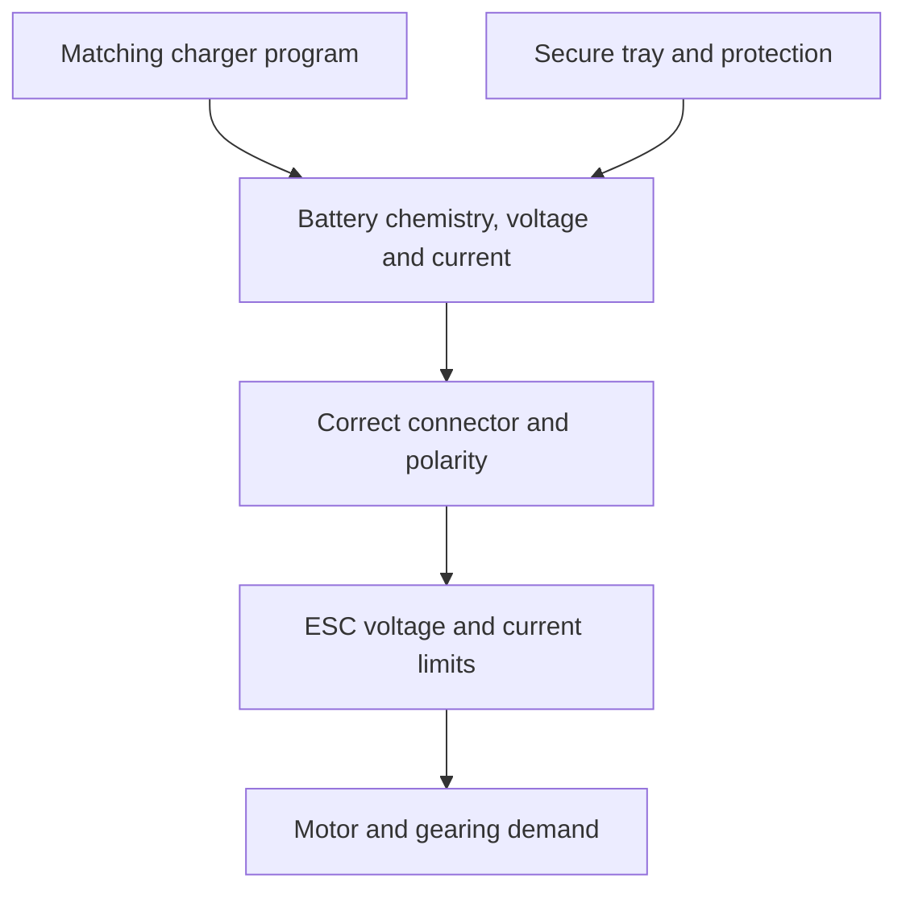

# Topic 3.3 - Batteries and Battery Safety

> **"A battery is not just fuel for the buggy. It is stored energy that deserves a plan, a safe place and constant respect."**

---

# Learning Objectives 🎯

By the end of this topic you will be able to:

- explain the difference between a cell and a battery pack
- compare alkaline, NiMH and LiPo batteries for suitable uses
- read cell count and nominal voltage
- distinguish capacity, energy and discharge capability
- explain series connections without opening or modifying a pack
- match a battery to a compatible charger and RC system
- carry out a visual inspection without powering the battery
- describe safe charging, storage and transport boundaries
- respond correctly to a damaged, swollen, hot or unusual battery
- build a keepable battery safety station from household materials

---

# Before We Begin

Imagine a coiled spring held inside a strong box.
The spring can do useful work when released through the correct mechanism.
If the box is damaged or the release is uncontrolled, the stored energy becomes a hazard.

A battery also stores energy.
It can run the receiver, turn the servo and drive the motor of our VoltForge buggy.
That same stored energy can produce intense current and heat when a pack is damaged, shorted, charged incorrectly or used outside its limits.

This topic therefore has two equal goals:

1. understand battery specifications
2. develop safe habits before handling real RC packs

The most advanced battery skill is not making a pack.
It is knowing when to stop, disconnect and ask a responsible adult.

---

# The Non-Negotiable Battery Boundary ⚠️

> **⚠️ SAFETY**
>
> Every real RC battery activity requires direct supervision by a responsible adult who has read the battery and charger instructions.
> Charge a LiPo only with a compatible LiPo balance charger, using the correct chemistry, cell count and current settings.
> Charge on a non-flammable surface, away from combustible materials, with the pack inside a suitable LiPo safety bag or other manufacturer-approved charging container.
> Remain present and attentive throughout charging.
> Never charge or use a damaged, punctured, crushed, wet, leaking, unusually hot, swollen or puffed pack.
> Never short, open, modify, solder directly to, crush, bend, burn or dismantle a battery pack.
> Follow the manufacturer and local recycling service for isolation and disposal of a suspect pack.

These instructions do not replace the manual supplied with a specific pack or charger.
Where instructions differ, stop and ask an experienced responsible adult to confirm the safe procedure.

---

# Cell, Battery and Pack

Think of one drinking-water bottle.
It is one container of stored water.

A **cell** is one electrochemical unit that stores chemical energy and provides an electrical potential difference.

Several cells connected and packaged together form a **battery pack**.
In everyday speech, people often call one cell a battery.

For RC specifications, the distinction matters.

| Label | Meaning |
|---|---|
| 1S | One lithium-polymer cell in series |
| 2S | Two cells in series |
| 3S | Three cells in series |
| 6-cell NiMH | Six nickel-metal hydride cells in series |

The `S` tells us the number of series-connected cells.
It does not tell us capacity, connector, physical size or safe current by itself.

Do not open a pack to count its cells.
Read its undamaged label and documentation.

> **[Signature visual: three sealed battery packs labelled 1S, 2S and 3S. Each pack is shown as cell blocks in series, with nominal voltage calculated below. A large boundary states READ THE LABEL - NEVER OPEN THE PACK.]**

---

# Chemistry Changes the Rules

Two cups can look similar while holding very different liquids.
Battery cases and connectors can also hide different chemistries.

**Battery chemistry** describes the materials and reactions used to store and release energy.

| Chemistry | Common role | Strengths | Important boundary |
|---|---|---|---|
| Alkaline | Low-drain household devices and some transmitter trays | Easy to obtain | Usually not rechargeable |
| NiMH | Beginner RC packs and rechargeable transmitter packs | Generally robust and simple | Still needs a compatible NiMH charger |
| LiPo | Many modern RC drive systems | High energy and current for its mass | Requires strict charging, balance, storage and damage procedures |

Do not charge an alkaline cell.
Do not use a NiMH program for a LiPo pack.
Do not use a LiPo program for a NiMH pack.

A charger must match the chemistry.
Connector fit cannot identify chemistry safely.

---

# Nominal Voltage and Cell Count

Remember nominal values from Topic 3.2.
A nominal value is the convenient named value used to classify a device.

A typical LiPo cell is labelled `3.7 V nominal`.

Series cell voltages add:

```text
Pack nominal voltage = cell nominal voltage x number of series cells
```

## Worked Example - A 2S LiPo Pack

### The question

What is the nominal voltage of a two-cell LiPo pack?

### Known values

```text
Cell nominal voltage = 3.7 V
Series cell count = 2
```

### The rule

```text
Pack nominal voltage = cell nominal voltage x series cell count
```

### The calculation

```text
Pack nominal voltage = 3.7 x 2
Pack nominal voltage = 7.4 V
```

### The meaning

The pack is described as a `7.4 V nominal 2S LiPo`.
Its actual voltage changes with state of charge and load.

The exact maximum, minimum and storage voltages come from the pack and charger instructions.
Do not guess them from nominal voltage.

---

# Capacity - A Charge Quantity

Imagine two water bottles feeding the same small tap.
The larger bottle can supply the tap for longer, but it does not automatically create a faster flow.

Battery **capacity** is commonly labelled in ampere-hours (`Ah`) or milliampere-hours (`mAh`).
It represents a quantity of charge under stated conditions.

```text
1000 mAh = 1 Ah
```

A `3000 mAh` pack has a labelled capacity of `3 Ah`.

Larger capacity can increase possible run time under similar use.
It can also increase mass, size, charging time and cost.

Real buggy run time depends on:

- average current
- driving style
- gearing
- terrain
- motor and ESC efficiency
- temperature
- battery condition
- safe cut-off settings

Capacity is not a promise of exact run time.

## Worked Estimate - Idealised Run Time

### The question

A `3 Ah` pack supplies an idealised constant average of `6 A`.
What simple run-time estimate results?

### The rule

```text
Time in hours = capacity in Ah / current in A
```

### The calculation

```text
Time = 3 / 6
Time = 0.5 hours
Time = 30 minutes
```

### The meaning

The idealised estimate is `30 minutes`.
A real RC system will differ, and safe discharge limits must still be respected.

---

# Energy - Capacity and Voltage Together

Capacity alone does not tell us total stored electrical energy.
A higher-voltage pack can store more energy than a lower-voltage pack with the same ampere-hour capacity.

Battery energy is often estimated in watt-hours (`Wh`):

```text
Energy in Wh = nominal voltage x capacity in Ah
```

## Worked Example - Battery Energy

For a `7.4 V`, `3 Ah` pack:

```text
Energy = 7.4 x 3
Energy = 22.2 Wh
```

This is a nominal energy figure.
Usable energy depends on operating limits and conditions.

More watt-hours may extend run time, but the heavier pack can change acceleration, suspension and handling.

---

# C-Rating - A Claimed Discharge Rate

Imagine a large water tank with a very small outlet.
The tank holds plenty of water but cannot release it quickly.

Capacity and discharge capability are different.

A LiPo **C-rating** is a claimed discharge rate expressed as a multiple of capacity.

An idealised calculation is:

```text
Claimed current = C-rating x capacity in Ah
```

For a fictional `3 Ah`, `20C` pack:

```text
Claimed current = 20 x 3
Claimed current = 60 A
```

This calculation explains the label.
It does not guarantee that every pack can safely sustain the result in every installation.

Ratings may depend on temperature, cooling, pack condition, voltage drop and manufacturer test method.
Choose reputable parts with documented limits and a safety margin.

Do not conduct a maximum-current discharge test.

---

# Main Lead and Balance Lead

Many multi-cell LiPo packs have two connection systems.

| Connection | Main job |
|---|---|
| Main power lead | Carries drive current between battery and ESC or charger |
| Balance lead | Lets a compatible balance charger monitor individual cell groups |

The balance connector is not a spare motor-power connector.
The main connector is not enough for a multi-cell balance charge when the charger requires the balance lead.

Both connectors must be inspected for:

- cracked housings
- bent or exposed contacts
- damaged insulation
- pulled wires
- dirt or moisture
- heat discolouration

Pull a connector by its housing, not by the wires.

---

# What Balance Charging Does

Imagine three runners meant to finish together.
If one is far ahead or behind, treating only the team's average hides the difference.

Cells in a pack can reach slightly different voltages.
**Balance charging** lets a compatible charger monitor and manage the cells so they finish within the allowed balance defined by the equipment.

Balance charging cannot repair a damaged or unsafe pack.
Repeated imbalance is a warning that needs adult investigation and manufacturer guidance.

Never bypass a balance warning just to make charging continue.

---

# The Battery Compatibility Chain

The battery sits inside a chain of requirements.



Before use, confirm:

- chemistry matches charger program
- cell count matches charger setting
- charging current follows pack instructions
- battery voltage fits ESC and motor system limits
- connector type and polarity match
- wire size and connector rating are suitable
- physical dimensions fit the tray
- pack is retained without crushing or puncture risk
- ESC low-voltage protection is correct for the chemistry
- pack can be removed quickly without pulling wires

One failed interface can make the complete system unsafe.

---

# Inspect Before Every Use

Pilots inspect aircraft before take-off even when yesterday's flight was successful.
Battery users need the same habit.

Use a consistent inspection order.

## Pack body

Look for:

- swelling or puffing
- dents, crushing or bending
- punctures or cuts
- split wrapping
- leaks, residue or unusual smell
- water exposure
- unusual heat

## Wires

Look for:

- exposed conductor
- crushed insulation
- cuts or melted areas
- wire pulled from pack or plug

## Connectors

Look for:

- bent or recessed contacts
- cracked housing
- dirt or moisture
- blackening or heat damage
- wrong polarity markings

## History

Ask:

- Was the pack involved in a crash?
- Was it over-discharged or left connected?
- Did the charger report an error?
- Did it become unusually hot?
- Has its shape changed since the last record?

If any answer causes doubt, do not use or charge the pack.
Move people away and ask the responsible adult to follow the manufacturer's isolation and disposal instructions.

---

# Charging Is an Attended Process

Charging is not background housekeeping.
It is a supervised engineering operation.

The adult charging checklist should include:

1. Read the pack and charger labels.
2. Confirm chemistry.
3. Confirm series cell count.
4. Confirm charging-current limit.
5. Inspect the pack, leads and connectors.
6. Place the charger and pack on a non-flammable surface.
7. Put the LiPo inside a suitable LiPo safety bag as instructed.
8. Keep the area away from paper, fabric, fuel, aerosols and escape routes.
9. Connect in the order specified by the charger manufacturer.
10. Select the correct balance-charge program where required.
11. Check the display before starting.
12. Remain present and attentive.
13. Stop for swelling, odour, smoke, hissing, unexpected heat or errors.
14. Disconnect in the specified order after completion.
15. Record the charge and any unusual observation.

Never charge:

- while sleeping
- while leaving the building
- on a bed, sofa, carpet or wooden cluttered desk
- inside the buggy
- near an exit route
- in direct sunlight
- immediately after a hot run

Allow a used pack to cool to the manufacturer's permitted charging temperature.

---

# If Something Looks or Smells Wrong

Smoke, hissing, rapid swelling, strong unusual odour or rising heat means stop.

Do not pick up a failing pack.
Do not carry it through the building.
Do not pour water or use an extinguisher unless the responsible adult's emergency plan and local fire guidance specify the correct action.

Warn everyone nearby.
Move away.
Call the responsible adult and emergency services if there is fire, smoke or immediate danger.

The charging location should be chosen before charging so people can retreat safely.

---

# Storage and Transport

A buggy may run for minutes but the battery is stored for days or weeks.
Storage is therefore part of the design.

Follow the manufacturer's storage-charge instructions for LiPo packs.
Do not store a LiPo fully charged for long periods or deeply discharged.

Store batteries:

- disconnected from the buggy and charger
- at the manufacturer's storage state
- cool and dry
- away from direct sunlight and heat sources
- away from metal objects that could bridge terminals
- protected from crushing, puncture and falling
- in an adult-approved fire-resistant arrangement
- where children or pets cannot access them unsupervised

For transport:

- protect connectors individually
- use a suitable battery bag or rigid protective container
- prevent movement and crushing
- keep packs away from loose tools and screws
- follow carrier, airline and venue rules

Regulations can change.
Check the current carrier or airline instructions before travel.

---

# Battery Mounting in the Buggy

A safe pack still needs a safe home.

The battery tray should:

- fit the pack without bending it
- stop forward, backward and sideways movement
- avoid sharp screw ends
- protect the pack from gears and hot components
- allow airflow where specified
- keep wires clear of rotating parts
- allow quick inspection and removal
- use a removable strap or cover
- retain the pack during the planned crash test

Do not glue the battery into the chassis.
Serviceability is a requirement.

> **🤔 Think about it.**
>
> Place an empty cardboard box on a tray and tilt the tray slowly.
> Does one strap across the middle stop every direction of movement?

A strap may stop upward movement but still allow sliding.
The tray geometry and strap must work together.

---

# Battery Records

A battery cannot tell you its history by appearance alone.

Give each pack a unique identifier and record:

- chemistry
- series cell count
- nominal voltage
- capacity
- connector type
- purchase or first-use date
- charger used
- charge cycles if tracked
- unusual heat or errors
- crashes or physical damage
- storage check dates
- retirement decision

This record is the battery's **passport**.
It turns memory into evidence.

---

# Hands-On Activity 1 - Read Fictional Battery Labels

## You will need

- scrap paper
- pencil

## Steps

1. Create three fictional labels: alkaline, NiMH and LiPo.
2. Add chemistry, nominal voltage and capacity.
3. Add series cell count where relevant.
4. Add a warning that the charger must match chemistry.
5. Swap labels with another learner.
6. Identify what each label tells you.
7. List the information still missing before use.

No real battery is needed.

---

# Hands-On Activity 2 - Pack Inspection Rehearsal

## You will need

- three paper battery drawings
- coloured pens

## Steps

1. Draw one undamaged pack.
2. Draw one with a swollen outline.
3. Draw one with damaged wire insulation.
4. Add a hidden connector fault to one drawing.
5. Inspect in the order: body, wires, connectors, history.
6. Mark each as PASS, STOP or ASK AN ADULT.
7. Explain why appearance alone cannot prove health.

---

# Hands-On Activity 3 - Charger Setting Match

## You will need

- fictional battery cards
- fictional charger-program cards

## Steps

1. Lay out the battery cards.
2. Match chemistry first.
3. Match cell count second.
4. Check the permitted charging current.
5. Reject any combination with missing information.
6. Add a fault card saying "connector fits".
7. Explain why this does not rescue an incompatible match.

This is a paper exercise only.

---

# Hands-On Activity 4 - Battery-Tray Shake Test

## You will need

- empty small cardboard box representing a battery
- shallow card tray
- paper strap

## Steps

1. Place the empty model pack in the tray.
2. Tilt forward, backward and sideways.
3. Add side walls or end stops.
4. Add a removable strap.
5. Repeat the same gentle tilt angles.
6. Record which feature controls each direction.

Never perform this activity with a real battery.

---

# Topic Mini Project - Battery Safety Station and Passport 🛠️

Build a keepable unpowered station that guides inspection, charging preparation, storage and record keeping.

It uses a cardboard model pack.
No real battery or charger enters the project.

## What the artifact teaches

The station embodies four habits:

- inspect before connecting
- match every charging setting
- create a controlled charging area
- record battery history

It does not make charging safe by itself.
The responsible adult, manufacturer instructions and correct equipment remain essential.

## Materials

- corrugated packaging card
- one empty tea box or folded paper pack model
- scrap paper
- ruler
- pencil and coloured pens
- scissors suitable for card
- glue or tape
- string or paper strap
- two envelopes

> **⚠️ SAFETY**
>
> Show a responsible adult or guardian what you plan to build before starting, and build with them nearby.
> Use age-appropriate scissors on a clear table and cut away from fingers.
> Do not use a craft knife.
> Use only an empty cardboard model battery.
> Do not place, charge, store or connect a real battery in this paper station.

> **🎬 Watch the build**
>
> - Horizon Hobby Support: search "LiPo battery safety" with an adult for manufacturer safety demonstrations.
> - Traxxas Support: search "LiPo battery charging safety" with an adult and compare the checklist with your pack instructions.

## Step 1 - Make the station base

Cut a base about `420 mm x 300 mm`.

Divide it into four zones:

1. INSPECT
2. MATCH
3. CHARGE PREPARATION
4. STORE

## Step 2 - Make the model pack

Fold a paper or empty-box model.

Label it clearly:

```text
MODEL ONLY - NO STORED ENERGY
```

Add paper main and balance leads.

## Step 3 - Build the inspection gate

Create four flaps:

- BODY
- WIRES
- CONNECTORS
- HISTORY

Under each flap, list the warning signs.

The model pack may move forward only when all four are checked.

## Step 4 - Build chemistry and cell-count gates

Make removable cards for:

- alkaline
- NiMH
- LiPo
- 1S
- 2S
- 3S

Create matching charger-program cards.

An incorrect pair must not fit through the MATCH zone.

## Step 5 - Add the charging-area checklist

Write checks for:

- adult present
- instructions read
- non-flammable surface
- combustibles removed
- suitable LiPo safety bag
- chemistry correct
- cell count correct
- current correct
- pack cool and undamaged
- charger attended

## Step 6 - Add the emergency boundary

Draw a red stop panel.

Write:

```text
SWELLING - SMOKE - HISSING - ODOUR - UNEXPECTED HEAT
STOP. MOVE AWAY. WARN AN ADULT.
```

Do not write improvised disposal or firefighting instructions.
Those must follow local and manufacturer guidance.

## Step 7 - Build the storage bay

Use card walls and a removable paper strap to hold the model pack.

Label requirements:

- disconnected
- protected terminals
- cool and dry
- no crushing
- adult-approved location
- manufacturer storage state

## Step 8 - Make the battery passport

Create a folded card with fields for:

- pack ID
- chemistry
- cell count
- nominal voltage
- capacity
- connector
- first-use date
- inspection result
- charge record
- incident record
- retirement status

## Step 9 - Make fault cards

Create at least eight:

- puffed side
- split wrap
- exposed conductor
- hot after run
- wrong charger chemistry
- wrong cell count
- unattended charging plan
- loose metal screw in storage box

Store them in the first envelope.

## Step 10 - Run the inspection test

Choose a fault card without showing the inspector.

Alter the model or scenario.
The inspector must stop it at the correct gate.

## Step 11 - Run the charging-plan test

Create one safe and one unsafe paper setup.

Identify every difference.
Do not use real equipment.

## Step 12 - Run the retention test

Place the model pack in the bay.

Tilt the station gently in four directions.
The pack must remain secure and still be removable without pulling its paper wires.

## Step 13 - Reflection

Write answers on the back:

1. Why is capacity not the same as current capability?
2. Why does a 2S label not prove ESC compatibility?
3. Which warning sign would make you stop immediately?
4. Who makes the final decision about a suspect pack?

## Step 14 - Keep the artifact

Store the fault cards in one envelope and blank passport forms in the other.

Keep the station on your showcase shelf.
Use a real battery passport later only under the adult-led battery procedure.

---

# Thinking Like an Engineer - Stored Energy Needs Layers

No single feature creates battery safety.

Safe work uses layers:

- suitable chemistry and ratings
- reputable undamaged equipment
- correct charger and program
- inspection
- controlled location
- supervision
- physical protection
- low-voltage protection
- records
- emergency plan

If one layer fails, the others reduce the chance of harm.

---

# Cheapest Valid Prototype

The cheapest valid prototype is the paper safety station and model battery.

It tests whether you can:

- read labels
- match charger settings
- find visible faults
- prepare a safe area
- retain a pack mechanically
- keep a battery record

Stored energy adds no learning value to those rehearsals.

---

# What to Buy, Reuse and Make

## Reuse

- packaging card
- empty small box
- paper
- envelopes
- string

## Make

- model pack
- inspection gate
- compatibility cards
- storage bay
- battery passport
- fault cards

## Buy only after requirements and adult agreement

- suitable pack from a reputable supplier
- charger explicitly compatible with its chemistry and cell count
- suitable LiPo safety bag for LiPo charging and transport
- correct connector system
- protective tray and strap

Do not buy a battery merely because it promises the highest voltage, capacity or C-rating.

---

# Cost Checkpoint

| Item | Expected cost now | Decision |
|---|---:|---|
| Paper safety station | £0 | Build now |
| Real battery and charger | £0 in this topic | Delay until system requirements are known |
| LiPo safety equipment | Later system cost | Required if LiPo is selected |

The topic prototype costs `£0`.
Future battery cost must include the correct charger and safety equipment, not only the pack.

---

# Modular Interfaces

Treat the battery as a removable energy module.

Its interfaces include:

- chemistry
- voltage range
- current capability
- main connector and polarity
- balance connector where required
- physical envelope
- mounting and protection
- charging procedure
- removal access

A change of battery can affect the ESC, motor, tray, suspension and handling.
That is why the interface is documented before purchase.

---

# Test Plan

## Test 1 - Label interpretation

**Question:** Can the learner extract the important specification from a battery label?

**Independent variable:** Fictional label shown.

**Dependent variable:** Correct chemistry, cell count, nominal voltage, capacity and warnings identified.

**Control variables:** Same five fields and no real battery.

**Procedure:** Inspect four shuffled label cards.

**Pass condition:** All fields correct and missing information is marked rather than guessed.

## Test 2 - Safety-gate diagnosis

**Question:** Can the station stop an unsafe battery scenario?

**Independent variable:** Fault card.

**Dependent variable:** Correct gate and response selected.

**Control variables:** One fault at a time and same inspection order.

**Procedure:** Run eight fault cards through the station.

**Pass condition:** Every damage, setting and supervision fault is stopped before the charge zone.

## Test 3 - Model retention

**Question:** Does the model tray restrain the pack in every planned direction?

**Independent variable:** Tilt direction.

**Dependent variable:** Model-pack movement.

**Control variables:** Same model, tilt angle, strap and tray.

**Procedure:** Tilt gently forward, rearward, left and right.

**Pass condition:** Pack stays inside the bay and remains removable without pulling wires.

---

# Upgrade Path

| Later topic | Battery-system upgrade |
|---|---|
| 3.4 | Confirm receiver power arrangement |
| 3.5 | Check servo voltage and current demand |
| 3.6 | Match ESC chemistry, voltage and low-voltage protection |
| 3.7 | Match motor and gearing demand |
| 4.2 | Test physical battery packaging with a card dummy |
| 4.5 | Perform first adult-supervised low-power system test |

---

# Stop Point Before the Next Purchase

Stop before purchasing or charging an RC battery.

Continue when:

- a responsible adult accepts the battery procedure
- chemistry and cell count are understood
- charger requirements are documented
- ESC and motor voltage ranges will be checked
- capacity and physical envelope are defined
- connector and polarity are defined
- a suitable charging location and LiPo bag are planned
- storage, transport and emergency arrangements exist
- the paper station passes all tests

---

# Common Beginner Mistakes ❌

## Mistake 1 - Calling a pack safe because it is new

Inspect every pack before every use and charge.

## Mistake 2 - Choosing by connector shape

Connector fit does not identify chemistry, voltage or polarity.

## Mistake 3 - Treating capacity as maximum current

Capacity and discharge capability describe different things.

## Mistake 4 - Treating C-rating as a complete guarantee

Conditions, quality and safety margin still matter.

## Mistake 5 - Guessing cell count from pack size

Read the label and documentation.

## Mistake 6 - Using the wrong charger program

Chemistry and cell count must match exactly.

## Mistake 7 - Leaving a charging pack unattended

Charging requires a present, attentive adult.

## Mistake 8 - Charging inside the buggy

Remove the pack and use the planned charging area.

## Mistake 9 - Using a puffed pack one last time

Stop using it and follow adult-led manufacturer and local disposal guidance.

## Mistake 10 - Pulling connectors by their wires

Grip the housing to protect conductors and contacts.

## Mistake 11 - Storing the pack connected

Disconnect and follow the manufacturer's storage-state instructions.

## Mistake 12 - Gluing the battery into the chassis

The pack must remain inspectable, removable and replaceable.

---

# Topic Summary 📝

- A cell is one electrochemical unit; a battery pack contains one or more cells.
- Chemistry determines charging and operating rules.
- Series cell voltages add.
- A typical LiPo cell is described as `3.7 V nominal`, so a 2S pack is `7.4 V nominal`.
- Capacity is commonly stated in Ah or mAh and relates to charge quantity.
- Watt-hours estimate stored electrical energy from nominal voltage and Ah capacity.
- C-rating is a claimed discharge-rate multiple, not a complete safety guarantee.
- Multi-cell LiPo packs commonly use main and balance connections for different jobs.
- A compatible balance charger monitors individual cell groups.
- LiPo charging must be supervised, correctly configured and contained using appropriate safety equipment.
- Damaged, swollen, hot, leaking or unusual packs are stopped and isolated by a responsible adult.
- Storage, transport, mechanical retention and records are parts of battery engineering.

---

# New Words 📖

| Word | Meaning |
|---|---|
| Balance charging | Charging that monitors and manages the cell groups in a multi-cell pack |
| Battery chemistry | The materials and reactions used to store and release electrical energy |
| Battery passport | A record of one pack's identity, specifications, use and condition |
| Battery pack | One or more cells connected and enclosed as a usable energy source |
| Capacity | A labelled quantity of electrical charge, usually stated in Ah or mAh |
| Cell | One electrochemical unit that stores chemical energy |
| C-rating | A claimed discharge rate expressed as a multiple of capacity |
| LiPo | A rechargeable lithium-polymer battery chemistry widely used in RC systems |
| NiMH | A rechargeable nickel-metal hydride battery chemistry |
| Series connection | A connection in which cell voltage differences add along one path |
| State of charge | An estimate of how much charge remains in a battery |
| Watt-hour | A unit of energy, written Wh |

---

# Review Questions ❓

1. What is the difference between a cell and a battery pack?
2. What does `2S` mean on a LiPo label?
3. Calculate the nominal voltage of a 3S LiPo using `3.7 V` per cell.
4. Why must charger chemistry match battery chemistry?
5. What is the difference between capacity and energy?
6. Estimate the nominal energy of a `7.4 V`, `5 Ah` pack.
7. What does a C-rating attempt to describe, and why is it not enough alone?
8. What different jobs do the main lead and balance lead perform?
9. Name six signs that require a battery to be stopped and checked.
10. Why should a recently used hot pack not be charged immediately?
11. What features make a battery tray safe and serviceable?
12. Why is a battery passport useful even when a pack looks normal?

---

# Topic Checklist ✅

- [ ] I can distinguish a cell from a pack.
- [ ] I can identify alkaline, NiMH and LiPo as different chemistries.
- [ ] I can calculate nominal pack voltage from series cell count.
- [ ] I can convert mAh to Ah.
- [ ] I can estimate nominal watt-hours.
- [ ] I can explain capacity and C-rating without confusing them.
- [ ] I know the jobs of main and balance leads.
- [ ] I can perform the paper inspection sequence.
- [ ] I can state the non-negotiable LiPo charging rules.
- [ ] I know which warning signs require an immediate stop.
- [ ] I have built and tested my battery safety station and passport.
- [ ] I have not charged, opened, modified or experimented on a real pack.

---

# Learn More

> **📚 Learn more**
>
> - Horizon Hobby Support: search "LiPo battery safety" and use the instructions for the exact product.
> - Traxxas Support: search "battery charging safety" for manufacturer guidance and videos.
> - Your local council website: search "household battery recycling" before disposing of any battery, and ask an adult to confirm the current service.

---

# Looking Ahead 🔭

We now have a safe source of stored energy on our system map.

The buggy still needs to receive the driver's intentions without a cable stretching across the floor.

In **Topic 3.4 - Radio Transmitters and Receivers**, we will follow steering and throttle commands through a 2.4 GHz radio system.

We will learn channels, binding, trims, range checks and failsafe behaviour before any motor is allowed to drive the wheels.
