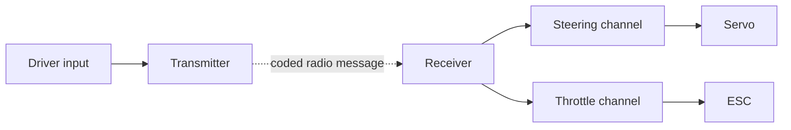

# Topic 3.4 - Radio Transmitters and Receivers

> **"Radio control is a conversation: the transmitter sends a request, the receiver identifies it, and the correct channel passes it to the correct subsystem."**

---

# Learning Objectives 🎯

By the end of this topic you will be able to:

- identify the transmitter and receiver
- explain why the radio command path is not the drive-energy path
- distinguish steering and throttle channels
- describe binding as an identification process
- explain trim, endpoints and control reversal
- state why a failsafe must be tested
- plan a safe range check
- route receiver power without assuming every socket is identical
- build a keepable command-routing console from card and string

---

# Before We Begin

Imagine a teacher calling instructions across a sports hall.
The message carries information, but it does not provide the energy in a pupil's muscles.

An RC transmitter works in a similar way.
It sends information about what the driver wants.
The buggy's battery provides the energy used by the receiver, servo, ESC and motor.

In our VoltForge buggy, one hand movement may ask for left steering while a finger simultaneously asks for gentle throttle.
The radio system must keep those commands separate, send them reliably and respond safely if communication is lost.

The goal is not simply to make the buggy react.
The goal is to make its reaction predictable.

---

# The Radio-Control Chain

A letter needs a writer, an addressed delivery route and a recipient.

An RC command needs:

1. a **transmitter** in the driver's hands
2. a radio link through the air
3. a **receiver** in the buggy
4. a channel connection to the correct output device



The receiver does not normally drive the motor.
It sends a low-power control command to the ESC, which handles motor power.

Remember the two paths from Topic 3.1:

- command path: driver to transmitter to receiver to servo or ESC
- energy path: battery through the designed power route to the electronics and drive system

> **[Signature visual: a pistol-grip transmitter on the left with steering wheel and trigger highlighted. A dotted 2.4 GHz radio link reaches a receiver on the right. Receiver ports CH1 and CH2 are enlarged, with CH1 leading to servo and CH2 to ESC. Red power, black return and white/yellow/orange signal conductors are labelled as examples, with a warning to follow the actual manual.]**

---

# From Hand Movement to Data

The steering wheel and throttle trigger are **inputs**.
Sensors inside the transmitter measure their positions.

The transmitter converts those positions into coded information and sends it by radio.
The receiver listens for the compatible signal and produces channel commands.

This happens repeatedly, so control feels continuous.

The exact coding method belongs to the manufacturer and radio protocol.
Different brands or product families are not automatically compatible merely because both use `2.4 GHz`.

---

# Frequency and the 2.4 GHz Band

Frequency describes how often a repeating wave cycle occurs each second.
It is measured in hertz.

Many modern surface RC systems operate in the `2.4 GHz` band.
`GHz` means billions of cycles per second.

That number identifies a frequency region.
It does not prove two radio systems understand the same message format.

Think of two people using the same room but speaking different languages.
Sharing the space does not make their messages compatible.

Use a transmitter and receiver explicitly listed as compatible by the manufacturer.

---

# Channels Keep Jobs Separate

A television can carry many programmes without turning them into one picture.
An RC receiver also provides separate control routes called **channels**.

A basic surface radio commonly uses:

| Channel | Common assignment | Output device |
|---|---|---|
| CH1 | Steering | Servo |
| CH2 | Throttle and brake | ESC |
| CH3 or AUX | Optional function | Light, switch or accessory controller |

The exact assignment must be checked in the manual.

Putting the steering servo into the throttle channel does not necessarily damage it.
It does make the trigger move the steering, which reveals a routing error.

Channel labels are interface information.
Record them on the system diagram.

---

# Binding - Agreeing on Identity

Imagine entering a crowded hall and agreeing on a private call sign with one teammate.
When the call sign is heard, the teammate knows the message is intended for them.

**Binding** is the manufacturer's process that associates a compatible receiver with a transmitter.

The exact steps vary.
They may involve:

- a bind button or plug
- a defined switch-on order
- holding controls in safe positions
- waiting for an indicator pattern
- storing the relationship in memory

Never invent a binding sequence.
Use the exact manuals for both products.

Before binding:

- remove driven wheels or lift the chassis securely where the manual permits
- disconnect the motor or use the manufacturer's safe setup method
- centre throttle and steering controls
- ensure the ESC cannot drive an exposed drivetrain
- keep fingers, hair, clothing and tools away from moving parts

---

# Powering the Receiver

The receiver needs suitable low-voltage power.
In many electric RC systems, the ESC contains a **battery eliminator circuit**, or **BEC**, which supplies regulated power to the receiver and servo.

The name comes from eliminating a separate receiver battery.

Not every ESC has the same BEC voltage or current capability.
Not every receiver or servo accepts the same voltage range.

Check the full chain:

```text
Battery -> ESC/BEC -> Receiver power rails -> Servo
```

Never connect two active receiver power sources unless the equipment instructions explicitly permit and explain it.

Topic 3.6 studies BECs in detail.

---

# Three Conductors, Different Jobs

Many servo-style leads have three conductors:

- supply
- return or ground
- signal

Colour conventions vary.
The connector housing may not prevent every reversed or offset insertion.

Check:

- receiver markings such as `S`, `+` and `-`
- connector orientation
- channel number
- voltage compatibility
- damaged pins
- strain relief

Do not rely on one remembered colour rule.

---

# Steering Wheel and Throttle Trigger

A surface transmitter often uses a small steering wheel and a trigger.

## Steering input

Turning the wheel changes the steering command around a centre position.
Releasing it normally returns the input to centre.

## Throttle input

Pulling the trigger commonly requests forward throttle.
Pushing it may request brake and then reverse, depending on ESC settings.

Never assume reverse is available or immediate.
ESC mode and calibration determine the response.

---

# Trim - Moving the Neutral Reference

Imagine a bicycle that drifts left when the handlebars look straight.
A small adjustment can restore straight travel without redesigning the frame.

**Trim** makes a small change to a channel's neutral command.

Steering trim can help the buggy travel straight when the transmitter wheel is centred.

Trim should correct a small final offset.
It should not hide:

- bent steering parts
- unequal links
- loose servo horn
- incorrect servo centring
- damaged suspension
- severe toe error

Mechanical geometry is corrected mechanically first.

Throttle trim is safety-critical.
Follow the radio and ESC instructions so neutral is recognised reliably.

---

# Endpoints - Limiting the Command Range

Imagine a door that can open `90°` before it hits a wall.
Pushing harder after contact only strains the hinge and handle.

An **endpoint** limits how far a channel commands an output in one direction.

Steering endpoints should stop the servo before:

- steering links bind
- the servo horn hits the chassis
- tyres rub the body
- steering knuckles reach a hard stop under force

Too little endpoint wastes steering range.
Too much endpoint creates buzzing, heat and load.

Set left and right limits separately if the transmitter provides that function.

---

# Reversing a Channel

If turning the transmitter wheel left makes the buggy steer right, the steering channel direction is reversed.

A **channel reverse** setting changes the direction of response.

Use it only after confirming:

- the servo and linkage are installed as designed
- the horn starts near its intended centre
- the correct channel is used
- endpoints are reduced for first motion

For throttle, direction changes affect safety and ESC calibration.
Follow both transmitter and ESC manuals.

---

# Dual Rate and Exponential

Some transmitters provide additional response settings.

**Dual rate** changes the overall amount of steering command available.
Reducing it can make a fast buggy less twitchy.

**Exponential** changes sensitivity around centre without simply removing the full endpoint.
The direction and naming of exponential settings can vary between manufacturers.

These are tuning tools, not repairs.
Start with documented basic settings.

---

# Failsafe - Planned Behaviour After Signal Loss

Imagine a lift losing its control signal.
The safe response is not to continue accelerating randomly.

A **failsafe** is the planned receiver or system response when a valid radio signal is lost or becomes unusable.

For an electric buggy, the desired throttle response is normally neutral or braking as specified by the equipment.
Steering behaviour may hold, centre or follow another configured response.

The actual behaviour must be configured and tested.

> **🤔 Think about it.**
>
> If the transmitter is switched off while the buggy is moving, what should happen before it reaches a person, road or wall?

The answer must be decided before driving.
`It probably stops` is not a test result.

> **⚠️ SAFETY**
>
> Perform a failsafe test only with a responsible adult, using the manufacturer's procedure.
> Keep the buggy securely raised or remove drive capability so the wheels cannot propel it.
> Keep people, hair, clothing and tools away from the drivetrain.
> Confirm neutral or the planned safe response before any ground test.

Failsafe does not replace a safe driving area or responsible driver.

---

# Range Checking

A radio may work perfectly on the bench and fail at distance or in a different orientation.

A **range check** verifies control at a defined distance using the manufacturer's reduced-power or specified method.

A safe range-check plan includes:

- open area away from roads and people
- adult supervision
- manufacturer procedure and distance
- battery condition confirmed
- antenna installed correctly
- initial steering-only or drive-disabled check
- observer near the buggy if safe
- clear stop response for glitches or loss

Do not drive to the edge of control until the buggy stops responding.
That is not a safe range test.

---

# Antenna Placement

An antenna is part of the radio system, not spare wire.

Keep the receiver antenna:

- in the orientation recommended by the manufacturer
- away from motor and high-current wires where practical
- away from carbon-fibre or metal shielding that the manual warns against
- protected from gears, shafts and tyres
- uncut and uncoiled unless instructions permit it
- supported without crushing its active section

Do not shorten an antenna to improve appearance.

---

# Start-Up and Shut-Down Order

Many surface-radio systems use this general intention:

1. transmitter on and controls neutral
2. buggy power on
3. perform control check

At shutdown:

1. buggy power off
2. transmitter off

This helps ensure the receiver has a valid command source while the vehicle is energised.

However, the exact equipment manual is authoritative.
Some systems have special procedures for calibration or binding.

---

# The First-Control Test

Before motor power is enabled, verify one function at a time.

## Test steering direction

Turn left slightly.
The front wheels should point left.

## Test neutral

Release controls.
The steering should return to the planned centre and throttle should remain neutral.

## Test endpoints

Approach full left and right slowly.
Stop if the mechanism binds, buzzes or strikes a stop.

## Test failsafe

Use the manufacturer procedure with drive disabled.

## Test range

Use the manufacturer procedure in a suitable area.

Only then does a low-speed ground test become reasonable.

---

# Diagnosing Radio Symptoms

Follow the command path instead of replacing random parts.

| Symptom | First checks |
|---|---|
| No steering or throttle | Receiver power, binding, battery state and connection orientation |
| Steering works, throttle does not | CH2 connection, ESC neutral/calibration and motor-power path |
| Throttle works, steering does not | CH1 connection, servo lead, servo power and linkage |
| Controls swapped | Channel assignment |
| Steering direction wrong | Linkage layout and channel reverse |
| Short range or glitches | Battery state, antenna, damage, installation and interference |
| Servo buzzes at full lock | Endpoints, mechanical binding and steering stops |

Record one change at a time.

---

# Hands-On Activity 1 - Human Radio Relay

## You will need

- three people if available
- command cards

## Steps

1. One person is DRIVER/TRANSMITTER.
2. One person is RECEIVER.
3. One person is SERVO or ESC.
4. Create separate blue steering and orange throttle cards.
5. The transmitter passes each card to the receiver.
6. The receiver routes it to the correct output person.
7. Deliberately swap the routes.
8. Describe the symptom.

The activity shows routing, not radio-wave physics.

---

# Hands-On Activity 2 - Channel Mapping

## You will need

- paper receiver drawing
- servo and ESC cards
- string

## Steps

1. Label receiver ports from the example manual.
2. Route CH1 to the servo.
3. Route CH2 to the ESC.
4. Add supply, return and signal labels.
5. Rotate one plug drawing by `180°`.
6. Explain which checks would detect the error.

Do not use real electronics.

---

# Hands-On Activity 3 - Endpoint Door Model

## You will need

- card
- paper fastener or folded paper hinge
- two small stop blocks

## Steps

1. Make a card arm that rotates around a pivot.
2. Place stop blocks at left and right limits.
3. Mark a safe endpoint just before each stop.
4. Try to push past the stop gently.
5. Observe the unnecessary load.
6. Move one endpoint too far and diagnose it.

---

# Hands-On Activity 4 - Failsafe Scenarios

## You will need

- scrap-paper scenario cards

## Steps

1. Write SIGNAL PRESENT on one card.
2. Write SIGNAL LOST on another.
3. Create response cards: FULL THROTTLE, NEUTRAL, BRAKE, HOLD and CENTRE.
4. Choose the intended safe throttle response from the manual scenario.
5. Explain why the behaviour must be tested.
6. List the physical precautions needed before a real test.

---

# Hands-On Activity 5 - Range-Test Plan

## You will need

- paper
- pencil

## Steps

1. Draw a safe open test area.
2. Mark roads, people and obstacles as exclusion zones.
3. Mark driver and observer positions.
4. Write the manufacturer's required distance as a blank to fill later.
5. Add the stop condition.
6. Add the planned failsafe result.

This produces a plan, not a real range test.

---

# Topic Mini Project - Radio Command-Routing Console 🛠️

Build a card transmitter, receiver and two moving outputs.
String paths will route steering and throttle commands separately.

## What the artifact teaches

The console embodies:

- one transmitter can send several commands
- channels keep jobs separate
- receiver outputs must reach the correct subsystem
- endpoints and failsafe are planned behaviours

It does not transmit radio waves.
You act as the encoding and decoding system.

## Materials

- corrugated card
- scrap paper
- pencil and pens
- ruler
- scissors suitable for card
- tape or glue
- two lengths of differently coloured string
- drinking straws or rolled-paper guides
- paper fasteners, or folded-paper pivots
- one envelope

> **⚠️ SAFETY**
>
> Show a responsible adult or guardian what you plan to build before starting, and build with them nearby.
> Use age-appropriate scissors on a clear table and cut away from fingers.
> Do not use a craft knife.
> Keep real batteries, motors and RC electronics disconnected from this model.

> **🎬 Watch the build**
>
> - Science Buddies: search "cardboard automata" for ways to turn sliders and pivots into movement.
> - A compatible radio manufacturer's support site: search the exact model plus "binding and failsafe" with an adult before any later real setup.

## Step 1 - Make the base

Cut a base about `450 mm x 280 mm`.

Mark DRIVER on the left and BUGGY on the right.

## Step 2 - Build the transmitter

Make a rotating paper steering wheel and a sliding trigger.

Mark:

- LEFT, CENTRE and RIGHT
- FORWARD, NEUTRAL and BRAKE/REVERSE REQUEST

## Step 3 - Build the receiver

Make a removable card with ports labelled:

- CH1 STEERING
- CH2 THROTTLE
- AUX

Add `S`, `+` and `-` as example interface labels.
Write `CHECK ACTUAL MANUAL` beside them.

## Step 4 - Route the steering command

Run blue string through paper guides from transmitter wheel to CH1.

Continue it to a card servo arm.
Make the arm rotate left and right.

## Step 5 - Route the throttle command

Run orange string from the trigger to CH2.

Continue it to a throttle pointer marked:

- reverse request
- neutral
- forward request

## Step 6 - Add the radio gap

Leave a physical gap between transmitter and receiver.

Bridge it with a dotted paper strip labelled:

```text
CODED RADIO LINK - INFORMATION, NOT DRIVE POWER
```

## Step 7 - Add trim

Make a small sliding tab that shifts the steering neutral mark.

Label it SMALL CORRECTION ONLY.

## Step 8 - Add endpoints

Add removable stop tabs before the servo arm's hard limits.

Make left and right stops adjustable.

## Step 9 - Add channel reverse

Create a two-sided card:

```text
NORMAL / REVERSED
```

Flip it to change which way the output moves.

## Step 10 - Add bind cards

Create matching transmitter and receiver ID cards.

Only a matching pair may be placed across the radio gap.

## Step 11 - Add failsafe card

Make a red card that covers the radio link.

When it is inserted, the throttle pointer must be moved to the planned safe position.

## Step 12 - Add antenna and power checks

Draw an antenna route away from the model motor zone.

Add a receiver-power card stating:

- voltage must match
- polarity must match
- one designed power source only

## Step 13 - Make fault cards

Create at least eight:

- wrong channel
- reversed plug
- unbound receiver
- wrong steering direction
- endpoint beyond stop
- trim hiding bent linkage
- antenna beside motor wires
- failsafe not tested

## Step 14 - Test steering routing

Move the wheel left, centre and right.

The servo pointer must follow the intended direction without hitting the stops.

## Step 15 - Test throttle routing

Move the trigger through each marked position.

The throttle pointer must follow without moving the steering output.

## Step 16 - Test signal loss

Insert the failsafe card.

State the planned throttle result and why it must be confirmed on real equipment.

## Step 17 - Run fault diagnosis

Ask another person to apply one fault card.

Trace:

```text
input -> transmitter -> radio link -> receiver -> channel -> output
```

Correct only the identified fault.

## Step 18 - Reflection

Write on the back:

1. A radio command differs from motor power because...
2. Binding differs from channel selection because...
3. Failsafe must be tested because...
4. Endpoints protect the steering because...

## Step 19 - Keep the artifact

Store fault and ID cards in the envelope.

Keep the console on your showcase shelf.
It will connect directly to the servo model in Topic 3.5 and ESC model in Topic 3.6.

---

# Thinking Like an Engineer - Predictable Control

A control system is useful when the same input produces the intended output reliably.

Radio verification therefore asks:

- Is the correct receiver bound?
- Is each function on the correct channel?
- Is direction correct?
- Is neutral stable?
- Are endpoints safe?
- Is range adequate?
- Is signal-loss behaviour safe?

Passing one steering test on the bench does not answer all seven questions.

---

# Cheapest Valid Prototype

The command-routing console is the cheapest valid prototype.

It tests the system logic without:

- buying a radio
- powering a receiver
- moving a motor
- exposing a drivetrain

The next valid upgrade is a receiver-and-servo bench test with adult supervision and drive power disconnected.

---

# What to Buy, Reuse and Make

## Reuse

- packaging card
- paper
- string
- straws
- envelopes

## Make

- transmitter controls
- receiver card
- channel routes
- endpoint stops
- bind and failsafe cards

## Buy later

- transmitter and compatible receiver as one documented system
- receiver-compatible servo
- suitable ESC with compatible receiver lead and BEC
- receiver box or protection if the design requires it

Avoid buying an unknown receiver simply because it says `2.4 GHz`.

---

# Cost Checkpoint

| Item | Expected cost now | Decision |
|---|---:|---|
| Card console | £0 | Build now |
| Real radio system | £0 in this topic | Define requirements first |
| Extra channels and telemetry | Optional later | Do not pay before a use exists |

Target prototype cost is `£0`.

---

# Modular Interfaces

Document the radio module through:

- protocol compatibility
- channel count
- receiver supply-voltage range
- channel assignment
- connector orientation
- antenna envelope
- binding procedure
- failsafe behaviour
- physical mounting pattern

The receiver should be removable without disturbing the steering geometry or drivetrain.

---

# Test Plan

## Test 1 - Channel routing

**Question:** Does each input reach only its intended output?

**Independent variable:** Steering or throttle input selected.

**Dependent variable:** Output pointer that moves.

**Control variables:** Same console, channel map and string tension.

**Procedure:** Apply six mixed inputs.

**Pass condition:** Steering moves only steering and throttle moves only throttle every time.

## Test 2 - Endpoint protection

**Question:** Do endpoints prevent the steering output reaching its hard stops?

**Independent variable:** Endpoint-tab position.

**Dependent variable:** Gap between moving arm and hard stop.

**Control variables:** Same arm, pivot and command movement.

**Procedure:** Test conservative, correct and excessive endpoint positions.

**Pass condition:** Correct setting gives useful travel with visible clearance at both stops.

## Test 3 - Failsafe reasoning

**Question:** Can the learner state and verify planned signal-loss behaviour?

**Independent variable:** Radio-link card present or removed.

**Dependent variable:** Throttle-pointer position and explanation.

**Control variables:** Same channel map and neutral mark.

**Procedure:** Remove the link card at three starting commands.

**Pass condition:** Learner moves to the documented safe position and states that real behaviour needs a drive-disabled test.

---

# Upgrade Path

| Stage | Upgrade |
|---|---|
| Paper | Command-routing console |
| Unpowered real parts | Identify ports, antenna and labels |
| Low-energy bench | Bind receiver and move servo with drive disconnected |
| Drive-disabled system | Configure directions, endpoints and failsafe |
| Open-area test | Manufacturer range check |
| Low-speed ground | Controlled steering and throttle verification |

---

# Stop Point Before the Next Purchase

Stop before buying a radio system until you know:

- required channel count
- transmitter style and handedness needs
- compatible receiver model
- receiver supply range
- failsafe capability
- endpoint and reverse adjustments
- antenna installation needs
- replacement-receiver availability
- budget for the complete compatible pair

Do not enable drive power until binding, direction, neutral, endpoints, failsafe and range are verified.

---

# Common Beginner Mistakes ❌

## Mistake 1 - Believing all 2.4 GHz equipment is compatible

Frequency band does not prove matching protocol.

## Mistake 2 - Swapping CH1 and CH2

Use the channel map and test one function at a time.

## Mistake 3 - Trusting wire colours alone

Check the receiver and connector markings.

## Mistake 4 - Using trim to hide bad geometry

Correct mechanical faults before small electronic adjustment.

## Mistake 5 - Setting endpoints by listening for servo strain

Approach limits slowly and stop before binding or buzzing.

## Mistake 6 - Forgetting throttle neutral during start-up

Follow the transmitter and ESC start procedure.

## Mistake 7 - Assuming failsafe is automatic and correct

Configure and test it with drive disabled.

## Mistake 8 - Range-testing by driving until control is lost

Use the manufacturer's defined safe procedure.

## Mistake 9 - Cutting or hiding the antenna

Install it exactly as instructed.

## Mistake 10 - Switching off the transmitter first

Use the specified start-up and shutdown order.

---

# Topic Summary 📝

- The transmitter converts driver inputs into coded radio commands.
- The receiver accepts compatible commands and routes them through channels.
- Steering commonly uses CH1 and throttle commonly uses CH2, but the manual must confirm this.
- A shared 2.4 GHz band does not prove protocol compatibility.
- Binding associates a compatible transmitter and receiver.
- The receiver needs a suitable power source, often supplied by an ESC's BEC.
- Servo-style leads commonly carry supply, return and signal.
- Trim adjusts a small neutral offset.
- Endpoints limit commanded movement before mechanical binding.
- Channel reverse corrects response direction after the installation is checked.
- Failsafe defines planned behaviour after signal loss and must be tested with drive disabled.
- A range check follows the manufacturer's procedure before ground driving.
- Antenna placement, start-up order and systematic diagnosis affect reliability.

---

# New Words 📖

| Word | Meaning |
|---|---|
| Antenna | The part of a radio system that sends or receives radio-frequency energy |
| Battery eliminator circuit (BEC) | A circuit, often in an ESC, that supplies regulated power to the receiver and servo |
| Binding | Associating a compatible receiver with a transmitter |
| Channel reverse | A setting that changes a channel's response direction |
| Dual rate | A setting that changes the total commanded movement range |
| Endpoint | A configured limit on channel movement in one direction |
| Exponential | A setting that changes control sensitivity around the centre region |
| Failsafe | Planned control behaviour when a valid radio signal is lost |
| Frequency | The number of repeating cycles each second |
| Protocol | The defined format and rules used to exchange information |
| Range check | A controlled test of reliable radio operation at a specified distance |
| Trim | A small adjustment to a channel's neutral command |

---

# Review Questions ❓

1. What four stages connect the driver's hand to a receiver output?
2. Why is the radio command path different from the motor-energy path?
3. Why are two products labelled 2.4 GHz not necessarily compatible?
4. Which receiver channels commonly serve steering and throttle?
5. What does binding achieve?
6. What three jobs commonly travel through a servo-style lead?
7. When should trim be used, and what should it not hide?
8. Why can excessive steering endpoints damage or heat a servo?
9. What should a throttle failsafe normally aim to achieve?
10. What precautions are required before a real failsafe test?
11. Why is driving until control disappears not a valid range check?
12. Which command-path checks would you make if steering works but throttle does not?

---

# Topic Checklist ✅

- [ ] I can trace a command from driver to receiver output.
- [ ] I can distinguish radio information from drive power.
- [ ] I can map steering and throttle channels.
- [ ] I know that protocol compatibility matters.
- [ ] I can explain binding.
- [ ] I can explain trim, endpoints and channel reverse.
- [ ] I can state the purpose of a BEC.
- [ ] I can plan a drive-disabled failsafe test.
- [ ] I can plan a manufacturer-defined range check.
- [ ] I can inspect a paper antenna and receiver-power route.
- [ ] I have built and tested my command-routing console.
- [ ] I will not enable drive power before control checks pass.

---

# Learn More

> **📚 Learn more**
>
> - The transmitter manufacturer's support site: search the exact model plus "manual, binding and failsafe".
> - Spektrum Support: search "surface transmitter receiver binding" for examples, while following the manual for your own equipment.
> - BBC Bitesize KS3 Physics: search "electromagnetic waves" for the school-science background to radio communication.

---

# Looking Ahead 🔭

Our receiver can now route a steering command to Channel 1.

The next question is how that small electrical instruction becomes a precise physical movement strong enough to turn two loaded front tyres.

In **Topic 3.5 - Steering Servos**, we will explore position control, torque, speed, centring, servo horns, endpoints and linkages.

We will build a working cardboard steering mechanism before choosing a real servo.
