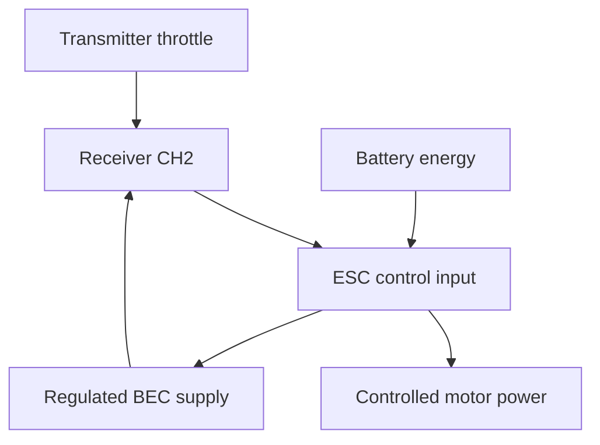

# Topic 3.6 - Electronic Speed Controllers

> **"The receiver asks for speed; the ESC decides how to switch the battery's power safely enough for the motor."**

---

# Learning Objectives 🎯

By the end of this topic you will be able to:

- locate battery, motor, receiver and switch connections
- explain why the receiver does not power the drive motor
- describe rapid electronic switching and average motor power
- match an ESC to motor type, battery voltage and current demand
- explain BEC, calibration, brake, reverse and low-voltage cut-off
- recognise heat, damaged insulation and wrong polarity as stop signs
- create a fair ESC selection and fault-finding plan
- build a card ESC trainer

---

# Before We Begin

Imagine filling a cup from a powerful tap.
Your hand on the tap controls the flow, but it does not create the water pressure.

The receiver's throttle channel is like your instruction to the hand.
The battery supplies energy, while the **electronic speed controller**, or **ESC**, regulates how it reaches the motor.

Without the ESC, a direct battery connection would give little useful proportional control.
With an unsuitable ESC, the VoltForge buggy may overheat, lose receiver power or damage its motor system.

---

# The ESC Sits Where Two Paths Meet

The command path tells the ESC what is requested.
The energy path gives it something powerful to control.

> **[Signature visual: ESC at the centre of two coloured paths. A blue receiver signal enters one side, thick red/black battery wires enter another, motor wires leave, and a thin BEC power arrow returns through the receiver lead. Labels distinguish brushed two-wire and brushless three-phase outputs.]**

---

# Switching Instead of Wasting

A dimmer could reduce a lamp by turning energy into waste heat, but efficient controllers switch power rapidly instead.

Many ESCs use **pulse-width modulation** (PWM).
Power is switched on and off quickly.
Changing the fraction of each cycle spent on changes the motor's average applied power.

That fraction is the **duty cycle**.

| Simplified command | On-time picture | Expected effect |
|---|---|---|
| Neutral | No drive pulses | Motor stopped |
| Low throttle | Short on-time | Low average drive |
| High throttle | Long on-time | High average drive |

The motor smooths much of the rapid switching mechanically.
Exact control methods differ between brushed, sensorless brushless and sensored systems.

---

# Brushed and Brushless ESCs

A brushed motor commonly has two power wires.
A brushed ESC switches those two connections to control speed and direction.

A brushless motor commonly has three phase wires.
A brushless ESC energises the phases in a timed sequence called **electronic commutation**.

| Feature | Brushed ESC | Brushless ESC |
|---|---|---|
| Motor leads | Usually two | Usually three phase leads |
| Commutation | Mechanical brushes in motor | Electronic sequence in ESC |
| Sensor cable | No | Optional on sensored systems |
| Interchangeable? | No | No |

Never connect a brushed motor to a brushless ESC or vice versa unless a specific controller explicitly supports that mode.

---

# Read the Ratings as a Chain

An ESC choice must match:

- motor type
- battery chemistry and series cell count
- operating-voltage range
- realistic continuous and peak current
- connector and wire capability
- cooling conditions
- BEC voltage and current
- intended brake and reverse mode
- environment and mounting space

**Continuous current** is the current the ESC claims to handle under stated continuing conditions.
**Peak current** applies only for a stated short interval and conditions.

Do not compare peak current on one product with continuous current on another.

Current margin is useful, but a huge rating does not repair poor cooling, gearing or soldering.

---

# Heat and Efficiency

The ESC is not perfectly efficient.
Some input energy becomes heat in its switching devices, wires and connectors.

Heat increases with factors including:

- high current
- repeated acceleration
- unsuitable gearing
- stalled or overloaded motor
- weak connectors
- poor airflow
- high ambient temperature
- switching losses

Thermal protection may reduce or stop output, but it is a final protection layer rather than a tuning method.

If the ESC repeatedly overheats, find the cause.
Do not simply disable protection or add a bigger fan without diagnosis.

---

# BEC - Power for Control Electronics

The **battery eliminator circuit** supplies regulated power to the receiver and servo through the receiver lead in many systems.

Check:

- BEC output voltage
- continuous and peak current if specified
- servo voltage range
- receiver voltage range
- number and type of servos

If the BEC voltage falls under servo load, the receiver may reset.
This is sometimes called a **brownout**.

Symptoms can look like radio failure even though the root cause is power delivery.

---

# Calibration - Teaching Neutral and Full Range

The ESC needs to understand which receiver commands mean:

- full forward
- neutral
- full brake or reverse request

**Throttle calibration** records these reference points.

The exact sequence varies by manufacturer.
It may involve tones, LEDs, buttons and trigger positions.

Never follow a generic sequence when the exact manual is available.

Before calibration:

- set transmitter throttle trim as instructed
- choose the correct channel direction
- securely raise the buggy or disconnect motor power
- keep the drivetrain clear
- confirm battery and ESC compatibility
- have an adult supervise

> **⚠️ SAFETY**
>
> A connected ESC can start a motor unexpectedly.
> Use the manufacturer's drive-disabled calibration method with a responsible adult.
> Remove the pinion, disconnect motor leads or raise/remove driven wheels only as the equipment procedure allows.
> Keep hair, fingers, clothing and tools away from shafts, gears and tyres.
> Stop for smoke, odour, swelling, damaged insulation or unusual heat.

---

# Braking, Reverse and Driving Mode

ESC modes may include:

- forward/brake
- forward/brake/reverse
- forward/reverse
- drag brake
- adjustable braking strength

A racing mode may remove reverse.
A crawler mode may apply drag brake strongly.

Choose the mode for the test and environment.
Confirm that the driver understands the trigger sequence before ground use.

Reverse motor direction using the manufacturer's approved method.
For a sensorless brushless system, swapping two phase wires often reverses rotation, but sensored systems may require matched wiring or a setting.
Check the manual.

---

# Low-Voltage Protection

LiPo cells must not be discharged below their safe operating limit.

An ESC's **low-voltage cut-off** reduces or stops motor output when pack voltage reaches its configured threshold.

It does not make an incompatible or damaged pack safe.

Confirm:

- correct battery chemistry mode
- correct cell-count detection or setting
- manufacturer threshold
- behaviour when cut-off activates

When power suddenly reduces, stop driving and inspect.
Do not keep restarting to extract the last energy.

---

# Capacitors, Sparks and Switches

ESC input capacitors smooth rapid current changes.
Connecting a battery can cause a small spark as capacitors charge, especially in higher-power systems.

Unexpected large sparks, heat or damaged connectors require an immediate stop.

Many ESC switches control electronics rather than physically isolating the battery.
The battery remains connected energy until unplugged.

Always disconnect the battery after use according to the instructions.

---

# Waterproof Does Not Mean Invincible

Water-resistant or waterproof claims have stated conditions.
Connectors, motors, bearings and receivers may have different protection.

Wet use may still require:

- fresh-water cleaning where permitted
- drying
- bearing maintenance
- connector inspection
- corrosion checks

Never charge a wet battery or connect wet electronics.

---

# Worked Selection Example

## Requirement

A fictional brushed motor system uses a `2S LiPo`, may draw `25 A` continuously in the planned test and needs a `6 V` receiver supply for one servo.

## Candidate ESC

- brushed motor support
- 2S LiPo support
- `40 A continuous` under adequate cooling
- `6 V, 3 A BEC`
- LiPo cut-off
- forward/brake/reverse mode

## Decision

The labels appear compatible and include margin.
The next checks are connector ratings, servo peak demand, cooling, dimensions and manufacturer conditions.

This paper decision does not authorise connection.

---

# Hands-On Activity 1 - Human PWM

Tap a table for ten equal counts.

- low command: tap for two, rest for eight
- half command: tap for five, rest for five
- high command: tap for nine, rest for one

The cycle time stays similar while on-time changes.
This models duty cycle, not real ESC frequency.

---

# Hands-On Activity 2 - Connection Sort

Make cards for BATTERY, RECEIVER, BRUSHED MOTOR and BRUSHLESS MOTOR.
Give the ESC thick power leads, a thin receiver lead, two brushed outputs and three brushless outputs.

Build only valid arrangements.
Explain why a fitting plug still needs rating checks.

---

# Hands-On Activity 3 - Calibration Role Play

One person is transmitter and one is ESC.
Use cards for FULL FORWARD, NEUTRAL and FULL BRAKE.

The ESC records the three positions only when presented in the order on a fictional manual card.
Change one card and diagnose the result.

---

# Hands-On Activity 4 - ESC Decision Matrix

Compare three fictional ESCs against motor type, battery voltage, current, BEC, cut-off, size and cost.

Reject any candidate that fails a non-negotiable requirement before scoring optional features.

---

# Topic Mini Project - ESC Throttle and Safety Trainer 🛠️

Build a card ESC with a sliding throttle input, switching wheel, compatibility gates and fault cards.

## Materials

- cereal-box card and scrap paper
- ruler, pens and scissors
- tape or glue
- paper fastener or folded-paper pivot
- two envelopes

> **⚠️ SAFETY**
>
> Show a responsible adult or guardian what you plan to build before starting, and build with them nearby.
> Use age-appropriate scissors.
> Do not connect real batteries, motors or electronics.

> **🎬 Watch the build**
>
> - BBC Bitesize KS3 Design and Technology: search "electronic systems inputs processes outputs".
> - Your ESC manufacturer's support site: search the exact model plus "setup and calibration" with an adult.

## Build steps

1. Make a base labelled COMMAND PATH and ENERGY PATH.
2. Add removable BATTERY, ESC, RECEIVER and MOTOR cards.
3. Give battery leads thick red/black paper paths.
4. Give the receiver lead signal, supply and return labels.
5. Add reversible two-wire brushed and three-wire brushless motor cards.
6. Build a throttle slider marked reverse, brake, neutral and forward.
7. Make a rotating PWM wheel with `20%`, `50%` and `90%` shaded sectors.
8. Add gates for motor type, voltage, current, BEC and chemistry mode.
9. Add a calibration strip with three reference positions.
10. Add mode cards for forward/brake and forward/brake/reverse.
11. Add low-voltage cut-off and thermal-protection cards.
12. Create faults: wrong motor type, reversed battery, weak BEC, wrong cell count, no airflow, peak used as continuous, neutral missing and drive enabled during calibration.
13. Trace one throttle command and one energy transfer.
14. Run every fault through the correct stop gate.
15. Write a reflection explaining why the receiver lead cannot power the motor.
16. Store cards in the envelopes and keep the trainer on your showcase shelf.

---

# Thinking Like an Engineer - Protection Is Evidence

An ESC protection feature should be documented and tested safely.

Do not assume the label "protected" answers:

- what triggers it
- how quickly it acts
- what output remains
- how the driver recognises it
- how the system recovers

Record the actual behaviour during later low-power tests.

---

# Cheapest Valid Prototype

The paper trainer tests architecture, compatibility, calibration order and diagnosis for `£0`.
It is valid because no question in this topic requires a spinning motor.

# What to Buy, Reuse and Make

## Reuse

- card, paper and envelopes
- a proven ESC only if its manual and history are available

## Make

- selection matrix
- mounting-envelope card
- connection diagram
- calibration checklist

## Buy later

- ESC matched to motor type and battery
- correct connectors and mounting hardware
- cooling equipment only when evidence requires it

# Cost Checkpoint

| Item | Cost now | Decision |
|---|---:|---|
| Paper trainer | £0 | Build now |
| ESC | Later | Buy after motor and battery requirements |
| Programmer | Optional | Only if needed settings cannot be configured otherwise |

# Modular Interfaces

Record motor type, battery range, current rating, BEC output, receiver connector, motor connector, dimensions, cooling envelope, switch access and programming method.

# Test Plan

## Test 1 - Compatibility gates

**Question:** Does a candidate pass every non-negotiable interface?

**Independent variable:** Candidate ESC card.

**Dependent variable:** Pass/reject result and reason.

**Control variables:** Same fictional buggy requirements.

**Procedure:** Test three candidates.

**Pass condition:** Every incompatible candidate is rejected before cost comparison.

## Test 2 - Calibration sequence

**Question:** Can the learner order the throttle references safely?

**Independent variable:** Shuffled sequence.

**Dependent variable:** Correct order and drive-disabled checks.

**Control variables:** Same fictional manual.

**Procedure:** Arrange six mixed cards.

**Pass condition:** All steps and precautions are correct.

## Test 3 - Fault diagnosis

**Question:** Can one fault be traced without random changes?

**Independent variable:** Fault card.

**Dependent variable:** Correct cause and safe action.

**Control variables:** Same trainer and one fault at a time.

**Procedure:** Trace command, energy and protection paths.

**Pass condition:** Eight of eight faults are found.

# Upgrade Path

Paper trainer -> unpowered label inspection -> drive-disabled receiver setup -> unloaded brief motor test -> low-power rolling test -> temperature and cut-off validation.

# Stop Point Before the Next Purchase

Stop until motor type, battery voltage, realistic current, BEC demand, cooling, dimensions, connectors, modes and cut-off are documented.

# Common Beginner Mistakes ❌

## Mistake 1 - Matching only the current number

Motor type, voltage, conditions and BEC matter too.

## Mistake 2 - Comparing peak with continuous ratings

They describe different durations.

## Mistake 3 - Assuming the switch disconnects the battery

Unplug the pack after use.

## Mistake 4 - Calibrating with exposed drive

Disable propulsion first.

## Mistake 5 - Ignoring BEC load

Receiver resets may be power faults.

## Mistake 6 - Selecting the wrong battery mode

Low-voltage protection depends on chemistry and cell count.

## Mistake 7 - Treating thermal cut-off as normal operation

Repeated overheating needs diagnosis.

## Mistake 8 - Reversing battery polarity

Check markings before connection.

# Topic Summary 📝

- An ESC combines a low-power command path with a high-current energy path.
- PWM changes average drive using rapid switching.
- Brushed and brushless controllers are not interchangeable.
- Ratings need voltage, duration and cooling conditions.
- The BEC supplies regulated receiver and servo power in many systems.
- Calibration teaches the ESC full, neutral and brake references.
- Driving mode defines braking and reverse behaviour.
- Low-voltage cut-off helps protect suitable battery chemistry.
- Heat, connectors, gearing and current are system issues.
- Propulsion stays disabled during first setup.

# New Words 📖

| Word | Meaning |
|---|---|
| Brownout | A temporary voltage drop that can reset control electronics |
| Commutation | Switching current through motor windings in the sequence needed for rotation |
| Continuous current | Current allowed continuously under stated conditions |
| Duty cycle | The fraction of each switching cycle spent on |
| Low-voltage cut-off | ESC protection that reduces output at a configured low battery voltage |
| Peak current | Current allowed briefly under stated conditions |
| Pulse-width modulation | Control using rapid switching with adjustable on-time |
| Throttle calibration | Recording the receiver commands for throttle reference positions |

# Review Questions ❓

1. Why can the receiver not drive the motor directly?
2. What two paths meet at the ESC?
3. How does PWM change average drive?
4. Why do brushless motors normally need three phase leads?
5. What is the difference between continuous and peak current?
6. What does a BEC supply?
7. Why can an overloaded BEC look like radio failure?
8. What must be disabled before calibration?
9. What does low-voltage cut-off protect against?
10. Why should repeated thermal cut-off be investigated?

# Topic Checklist ✅

- [ ] I can trace ESC command and energy paths.
- [ ] I can explain PWM and duty cycle.
- [ ] I can distinguish brushed and brushless connections.
- [ ] I can read voltage, current and BEC ratings.
- [ ] I can explain calibration, modes and cut-off.
- [ ] I can plan a drive-disabled setup.
- [ ] I have built and tested my ESC trainer.

# Looking Ahead 🔭

The ESC can now deliver controlled electrical power, but the motor must turn that power into useful rotation.

In **Topic 3.7 - Brushed and Brushless Motors**, we will explore magnetic force, commutation, torque, speed, kV, efficiency and heat before selecting a motor.
