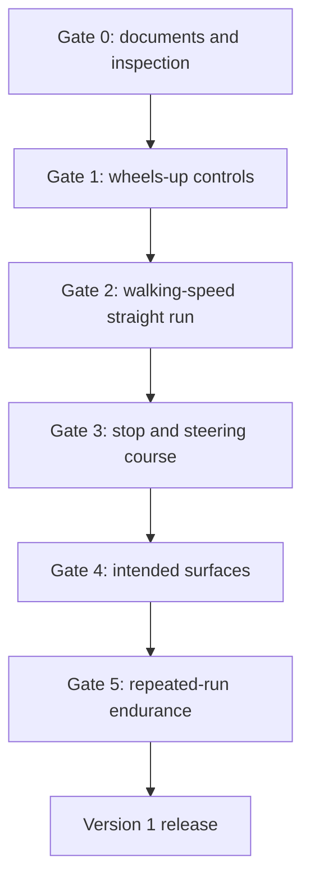

# Topic 4.10 - Testing, Debugging and Version 1

> **"Version 1 is not the buggy with no problems; it is the first buggy whose capabilities and limits are honestly known."**

---

# Learning Objectives 🎯

By the end of this topic you will be able to:

- distinguish verification, validation, debugging and tuning
- freeze the exact configuration, operating envelope and stop conditions before testing
- release capability from static inspection to controlled low-speed endurance in gates
- record repeated raw results, context, anomalies and honest pass status
- diagnose faults through competing causes, one main change and regression tests
- release Version 1 with traceable requirements, limits, costs and open issues

---

# Before We Begin

The completed buggy reaches the test lane.

Its first run is fast, straight and exciting.
The second stops much farther away, the third pulls right, and a wheel nut witness mark has moved.

Which run describes the buggy?
None of them alone.

Topic 4.9 proved that the installed systems operate on a stand.
Topic 4.10 builds enough repeated evidence to say what Version 1 can safely and usefully do.

Use six checks:

1. **Prepare** - are configuration, area, limits, roles and stop conditions frozen?
2. **Isolate** - does each gate introduce only the capability needed for its question?
3. **Measure** - are raw readings, observations and context recorded for every trial?
4. **Compare** - do repeated results satisfy the requirement and expose anomalies?
5. **Correct** - does one evidence-led change remove the cause without breaking earlier passes?
6. **Release** - are capability, limits, open issues and operating rules honest and reproducible?

# Verification and Validation

NASA's systems-engineering guidance makes a useful distinction.

**Verification** provides evidence that a product complies with its written requirements.

**Validation** provides evidence that it accomplishes its intended purpose in its intended environment.

For VoltForge:

| Question | Type | Example evidence |
|---|---|---|
| Does the battery remain retained? | Verification | Retention inspection and handling test |
| Does failsafe stop throttle? | Verification | Wheels-up signal-loss demonstration |
| Is the buggy enjoyable and controllable on short grass? | Validation | Supervised intended-surface trial |
| Can the battery be changed without dismantling suspension? | Verification | Timed service demonstration |
| Can an 11-year-old learner use the starting-speed mode confidently? | Validation | Observed learner trial with adult |

Remember the style-guide analogy:

```text
Verification: does it fit the drawing?
Validation: does it survive and serve real use?
```

> **[Signature visual, F0 two-gate relationship - Figure 4.10.1: left Verification gate connects requirement IDs to inspection, analysis, demonstration and test evidence; right Validation gate places the passing buggy with learner, mission, smooth path and tested short grass. A return arrow sends failed or incomplete evidence to debugging rather than around the gate. Six release labels—prepare, isolate, measure, compare, correct and release—span the bottom.]**
>
> *Figure 4.10.1 - Version 1 must comply with its written requirements and fulfil its intended low-speed use.*
>
> *Alt text: Verification evidence leads to a separate intended-use validation gate before Version 1 release.*

> **📚 Learn more**
>
> - [NASA - verification and validation](https://www.nasa.gov/reference/2-4-distinctions-between-product-verification-and-product-validation/): the official distinction between meeting the requirement and being fit for the purpose. Worth reading slowly - it is the idea this whole topic rests on.

# Four Ways to Verify

Not every requirement needs a driving test.

| Method | Meaning | Buggy example |
|---|---|---|
| Inspection | Look or measure directly | Wire clear of gear |
| Analysis | Use calculation or data | Battery capacity estimate |
| Demonstration | Show an action works | Battery removal |
| Test | Apply controlled conditions and measure response | Stopping distance |

Choose the safest method that provides convincing evidence.

Do not drive the buggy to verify a visible revision label.

> **📚 Learn more**
>
> - [NASA Systems Engineering Handbook](https://www.nasa.gov/wp-content/uploads/2018/09/nasa_systems_engineering_handbook_0.pdf): the deeper reference for configuration control, verification, validation and technical reviews. If the link has moved, search "systems engineering handbook" on nasa.gov.

# Freeze the Test Configuration

Test data is meaningless if the buggy changes silently between runs.

A **configuration baseline** identifies the exact version under test.

Record:

- date and location
- chassis and module revisions
- donor parts
- motor and ESC
- battery model, chemistry and state
- radio model and settings
- gear ratio
- wheels and tyres
- ride height and toe
- vehicle mass
- body/guards installed
- surface and weather if outdoors
- driver
- test procedure revision

Photograph the buggy from top, side and front with its version card.

> **[F1 annotated photograph - Figure 4.10.2: buggy photographed from top, side and front beside configuration card VF-V1.0-Candidate-A. Callouts identify chassis modules, motor/ESC, battery, gearing, tyres, ride height, radio mode, mass, body and test-procedure revision.]**
>
> *Figure 4.10.2 - A result becomes reusable only when it points to the exact hardware, settings and conditions tested.*
>
> *Alt text: Version candidate photographs and card define a complete configuration baseline.*

# Define the Safe Operating Envelope

An **operating envelope** is the set of conditions in which use has been shown acceptable.

Version 1 may initially allow only:

- adult-supervised operation
- dry conditions
- smooth flat surface
- starting-speed throttle limit
- stated battery type
- stated gearing
- stated maximum run duration before inspection
- clear separation from people, animals, roads and water

This is not an embarrassment.
It is an honest boundary supported by evidence.

Expand it only through new tests.

> **[F7 comparison array - Figure 4.10.3: operating-envelope card shows approved dry surfaces, starting-speed mode, battery, gearing, supervision and run duration; beside it, a red stop-condition sheet lists control loss, failed neutral, movement, heat, smell, smoke, loose retainers and structural damage. Unproved wet, road and high-speed conditions remain outside a dashed boundary.]**
>
> *Figure 4.10.3 - Evidence creates a usable boundary and a pre-decided reason to stop.*
>
> *Alt text: Version 1 operating envelope and immediate stop conditions separate tested from untested use.*

# Write Stop Conditions First

Tests create pressure to continue.
A written stop list makes the decision before excitement begins.

Stop immediately for:

- person or animal entering the test area
- loss or hesitation of control
- failure to return to neutral throttle
- steering jam or servo strain
- unusual gear noise
- sudden change in direction or drift
- loose wheel or visible fastener movement
- battery movement
- damaged wire or connector
- motor, ESC, battery or servo heat outside the approved boundary
- smell, smoke, swelling, sparking or discolouration
- cracked printed structure
- body or guard touching movement
- unexpected weather or wet surface
- supervisor calling stop

After a stop, switch off and disconnect safely.
Do not restart until the cause and next check are recorded.

# Plan the Test Area

Choose a space with:

- permission to use it
- flat, dry, visible surface
- no public road or vehicle traffic
- no stairs, drops or water
- no fragile objects
- controlled entry
- enough braking distance beyond the measured lane
- safe observer position
- recovery route that does not require entering moving traffic

Use cones, paper markers or chalk where allowed.

An adult acts as test director.
A second person can act as spotter.

# Use a Capability Ladder

Release one capability at a time.



A failed gate does not unlock the next one.

> **[F4 sequence strip - Figure 4.10.4: Gate 0 static readiness, Gate 1 wheels-up commands, Gate 2 walking-speed straight run, Gate 3 stop and steering course, Gate 4 intended surfaces and Gate 5 repeated endurance lead to Version 1. Each panel has pass, stop and problem-report branches, with no bypass arrows.]**
>
> *Figure 4.10.4 - Capability is released in the smallest stages that keep a failure safe and diagnosable.*
>
> *Alt text: Six-stage buggy test ladder blocks progression whenever a gate fails.*

# Gate 0 - Static Readiness

Confirm:

- Topic 4.9 certificate signed
- battery condition acceptable
- wheel nuts and critical fasteners checked
- witness marks aligned
- drivetrain turns freely
- steering returns freely
- suspension settles
- battery restrained
- guards secure
- wires protected
- switch and disconnect reachable
- transmitter battery adequate
- failsafe and model memory confirmed
- test area and stop signals understood

Use a spoken call-and-response:

```text
Test director: Area clear?
Spotter: Clear.
Test director: Driver ready?
Driver: Ready, throttle neutral.
Test director: Vehicle power?
Technician: On, control confirmed.
Test director: Begin Gate 1.
```

# Gate 1 - Wheels-Up Recheck

Repeat:

- steering direction and endpoints
- throttle neutral
- low forward command
- brake
- permitted reverse behaviour
- failsafe
- unusual vibration or noise

Inspect after every short command.

No floor movement is allowed if the result differs from Topic 4.9.

---

> **☕ Good place to pause.**
> Static readiness and a wheels-up recheck, both passed.
> From here the buggy moves under its own power, one gate at a time.

---

# Gate 2 - Walking-Speed Straight Run

Set the lowest useful speed limit.

Use a short lane with a large clear run-off area.

The first run tests only:

- gentle start
- straight tracking
- throttle return to neutral
- commanded stop

Do not steer aggressively.

After the run:

- disconnect battery
- inspect temperature and smell
- inspect wheel nuts and witness marks
- check battery movement
- rotate drivetrain by hand
- record drift and stopping position

# Gate 3 - Stopping and Steering Course

Build a wide course:

- start box
- straight lane
- large left gate
- large right gate
- stop box

Reduce speed until success is repeatable.

The goal is predictable control, not a fast lap.

Measure:

- gate contacts
- missed commands
- stop-box result
- run time only if it helps consistency
- driver comments
- vehicle inspection result

# Measure Stopping Distance

Stopping distance depends on speed, surface, tyres, braking setting and reaction.

Use a fixed low approach command and a marked braking line.

Measure from the line to the final front-axle position.

## Worked Example

Five stopping distances are:

```text
1.20 m, 1.05 m, 1.10 m, 1.85 m, 1.15 m
```

Sort them:

```text
1.05, 1.10, 1.15, 1.20, 1.85
```

The **median**, the middle result, is 1.15 m.

The 1.85 m run is not deleted.
Investigate whether it came from driver timing, radio hesitation, surface change or braking inconsistency.

A safe run-off area must exceed the worst credible distance, not only the median.

> **🤔 Think about it.** Four stops finish near 1.15 m and one reaches 1.85 m. If you erase the long run, what safety decision becomes falsely easy?

The outlier may reveal a real control, timing or surface problem. The median describes the centre of the results, but the run-off boundary and fault investigation must still respect credible long stops.

> **[F6 measured drawing - Figure 4.10.5: top view of test area shows start box, fixed approach lane, braking line, five labelled front-axle stopping positions, wide left/right steering gates, stop box, observer zone and run-off beyond 1.85 m.]**
>
> *Figure 4.10.5 - A useful test course controls the approach and provides space for the worst credible stop.*
>
> *Alt text: Dimensioned low-speed lane combines straight tracking, stopping measurements and a wide steering course.*

# Gate 4 - Intended-Surface Validation

Return to the mission from Topic 4.1.

If the intended use includes smooth paths and short grass, validate them separately.

Begin with:

- shortest run
- lowest speed
- no sharp steering
- dry, clear conditions
- inspection after each surface

Observe:

- ability to start
- steering authority
- ground clearance
- tyre grip
- drivetrain noise
- collected debris
- motor/ESC load indicators
- battery and fastener retention

Do not continue if grass or debris wraps around shafts.

# Gate 5 - Repeated-Run Endurance

**Endurance** means continuing to function through repeated operation for a defined period or cycle count.

Start with short cycles such as:

```text
60 seconds gentle operation -> stop -> power off -> inspect -> cool as required
```

Repeat only within battery and component instructions.

Record after each cycle:

- motor temperature measurement if safe equipment is available
- ESC temperature or warning state
- battery condition
- servo condition
- gear noise
- fastener marks
- tyre and wire condition
- remaining control quality

Do not use touch as the only temperature instrument or touch a suspect hot component.

# Test Thermal Behaviour Conservatively

Heat is evidence of energy loss and load.

Temperature depends on:

- ambient conditions
- gearing
- vehicle mass
- surface resistance
- driving style
- motor/ESC cooling
- drivetrain friction

Use manufacturer temperature limits where supplied.

Without reliable limits and instruments, stay conservative: short runs, long inspections and immediate stops for rapid heating or warning signs.

Never continue until thermal shutdown just to find the limit.

> **[F4 sequence strip - Figure 4.10.6: repeated 60-second gentle cycle is followed by power-off, disconnect, non-contact temperature measurement, battery/servo/gear/fastener/wire inspection and cooling. A trend chart rises gently inside the approved boundary; a steep-rise example stops early.]**
>
> *Figure 4.10.6 - Endurance is a repeated operate-inspect-cool cycle, not one long run towards failure.*
>
> *Alt text: Conservative endurance and thermal checks stop on warning trends before shutdown.*

# Record Data with Context

A result needs:

- test ID
- configuration ID
- question
- variables
- procedure
- raw readings
- observations
- pass/fail
- anomalies
- photo/video reference
- reviewer

Example:

```text
Test: V1-STR-03
Configuration: VF-V1.0-Candidate-A
Surface: dry indoor smooth floor
Throttle limit: 30%
Question: Does median drift remain below 0.25 m at 3 m?
Trials: +0.18, +0.21, +0.19, +0.42, +0.20 m
Result: FAIL because one run crossed stop threshold of 0.35 m
Action: inspect front-right steering return and repeat after cause is found
```

Do not move a pass limit after seeing disappointing data.

---

> **☕ Good place to pause.**
> Five gates, and you have data with context rather than opinions.
> The rest of the topic is about what to do when the data says something is wrong.

---

# Understand Debugging

**Debugging** is the structured process of finding and correcting the cause of unwanted behaviour.

Use this chain:

```text
symptom -> evidence -> possible causes -> discriminating test -> root cause -> corrective action -> regression test
```

A **root cause** is a fundamental causal factor whose correction prevents recurrence of the problem.

NASA reliability lessons emphasise documented problem reporting, root-cause analysis and corrective action.

# Symptom Is Not Cause

Symptom:

```text
Buggy pulls left under throttle.
```

Possible causes:

- front toe asymmetry
- steering trim or servo-centre error
- right drivetrain friction
- unequal tyre diameter or grip
- chassis twist
- battery mass strongly offset
- one wheel loose
- test surface slope
- driver input

“Adjust trim” changes the symptom but may not remove the root cause.

# Build a Fault Tree

Start with the symptom and branch into domains.

> **[F0 fault tree - Figure 4.10.7: symptom “pulls left” branches vertically into steering geometry, drivetrain drag, tyre/surface and mass/chassis. Each domain has three candidate causes, and small test cards show which observation would separate the branches.]**
>
> *Figure 4.10.7 - A fault tree organises competing causes so the next test can remove the most uncertainty.*
>
> *Alt text: Left-pull symptom branches into four causal domains linked to discriminating tests.*

Choose the next test that best separates branches.

For example, swap left and right tyres only if the wheel interface permits and direction markings are respected.
If the pull follows the tyres, the tyre branch becomes stronger.

# Change One Main Variable

If you change toe, tyre position, battery location and trim together, a better result cannot identify the cause.

Use:

- one hypothesis
- one main change
- same test
- same conditions
- before/after data

This is a **corrective-action test**.

After a fix, repeat earlier tests that the change could affect.
This is **regression testing**.

Example:

Changing servo linkage may require repeating:

- neutral
- endpoints
- failsafe observation
- steering course
- tyre clearance through suspension travel

> **📚 Learn more**
>
> - [NASA - problem reporting and corrective action](https://llis.nasa.gov/lesson/738): why failures, root causes and corrective actions get written down rather than remembered.

# Use a Problem Report

| Field | Record |
|---|---|
| Problem ID | PR-001 |
| Symptom |  |
| Configuration |  |
| When observed |  |
| Stop condition triggered |  |
| Evidence |  |
| Possible causes |  |
| Discriminating test |  |
| Root cause confidence |  |
| Corrective action |  |
| Regression tests |  |
| Status | Open/controlled/resolved/accepted limitation |

Do not close a problem because it disappeared once.
Require repeat evidence.

# Distinguish Debugging from Tuning

**Debugging** removes behaviour that violates requirements or expectations.

**Tuning** deliberately adjusts a working system to trade one acceptable behaviour against another.

Examples:

- loose wheel nut: debugging
- steering servo binds: debugging
- compare slightly different ride heights after all requirements pass: tuning
- choose softer or firmer damping for surface grip: tuning

Do not tune around a safety fault.

# Trace Requirements to Evidence

Return to Topic 4.1.

| Requirement ID | Requirement | Method | Test/result ID | Status | Issue link |
|---|---|---|---|---|---|
| R-01 | Battery removable without suspension removal | Demonstration | V1-SRV-01 | Pass |  |
| R-02 | Lost radio signal produces neutral throttle | Test | V1-RAD-02 | Pass |  |
| R-03 | Operates on short dry grass at starting-speed mode | Validation test | V1-SUR-02 |  |  |

Every requirement becomes:

- pass
- fail
- not tested
- not applicable with reason
- accepted limitation with adult approval

Do not mark `not tested` as `pass`.

> **[F7 comparison array - Figure 4.10.8: requirement traceability matrix shows pass, fail, not tested, not applicable with reason and accepted limitation. Each row links requirement ID to design feature, method, raw-result ID, problem report and operating rule; a crossed-out row changes not tested to pass without evidence.]**
>
> *Figure 4.10.8 - Honest status keeps missing evidence visible instead of turning hope into compliance.*
>
> *Alt text: Requirement matrix connects each status to evidence, issues and operating limits.*

# Decide What Version 1 Means

Version 1 is ready when:

- all safety-critical requirements pass
- intended low-speed use is validated
- open issues are understood and do not cross the operating envelope
- configuration is reproducible
- manuals and evidence are stored
- adult supervisor approves the use boundary

Version 1 does not require:

- maximum speed
- perfect appearance
- every optional upgrade
- high-power brushless operation
- zero future revisions

Name it clearly:

```text
VoltForge Buggy V1.0
Approved mode: supervised starting-speed operation
Approved surfaces: dry smooth path and tested short grass
Configuration baseline: VF-CB-001
```

# Create the Release Pack

Include:

- mission and requirements
- configuration baseline
- final BOM and cumulative cost ledger
- donor Atlas
- CAD and module revision list
- slicer/material records
- assembly traveller
- fastener map
- wiring diagram
- Manual Cards
- battery and charging plan
- test procedures and raw results
- verification matrix
- validation record
- problem reports and corrective actions
- operating envelope
- pre-run and post-run checklists
- maintenance and spare-parts list
- upgrade gates

This pack allows another person to understand what V1.0 actually is.

# Build Pre-Run and Post-Run Checks

## Pre-run

- area and weather suitable
- battery undamaged and correctly charged
- transmitter model and battery checked
- wheel nuts and fasteners checked
- witness marks aligned
- steering and throttle neutral checked
- failsafe status current
- guards and body secure
- wires and antenna undamaged
- battery restrained
- operating mode selected

## Post-run

- vehicle switched off and battery disconnected
- battery condition checked
- motor, ESC and servo inspected safely
- debris removed from shafts and cooling
- fasteners and witness marks checked
- printed parts checked for cracks
- tyre and drivetrain condition recorded
- battery stored or charged according to instructions
- anomalies entered before next use

> **☕ Good place to pause.**
>
> Complete the configuration baseline, stop list and Gate 0 checklist before going to the test area.
> A running buggy is not the place to invent the procedure.

# Hands-On Activity 1 - Verification or Validation Sort

Write twelve buggy checks on cards.

Sort each into verification, validation or both.
State the requirement or intended use behind every card.

# Hands-On Activity 2 - Stop-Condition Rehearsal

Use an unpowered buggy.

Another person calls `PERSON ENTERS`, `SIGNAL LOSS`, `HOT MOTOR`, `LOOSE WHEEL` or `NORMAL END`.
Practise the safe verbal and power-down response.

# Hands-On Activity 3 - Fault Tree and Requirement Trace

Choose a harmless simulated symptom such as a card wheel rubbing.

Teams list possible causes, then select the smallest test that separates them.
The winner is not the longest list; it is the clearest discriminating test.

Then pick one Build Passport requirement.

Follow it to design feature, module, inspection/test, result and operating rule.
Repair every missing link.

> **[F7 comparison array - Figure 4.10.9: three paper activities show verification/validation cards being sorted, an unpowered stop-condition call-and-response, and a harmless rubbing card wheel traced through possible causes to one requirement-evidence chain.]**
>
> *Figure 4.10.9 - Test logic and emergency response should be rehearsed before the powered course begins.*
>
> *Alt text: Card activities practise evidence type, stop response, fault trees and requirement traceability.*

# Topic Build - Version 1 Verification and Showcase Pack 🛠️

Test the complete buggy through staged gates and create the evidence needed to release VoltForge Buggy V1.0.

## Materials

- completed Topic 4.9 buggy and signed certificate
- exact manuals and Build Passport
- approved battery, charger and safety equipment
- transmitter
- cones, paper markers or permitted chalk
- tape measure and ruler
- timer
- suitable non-contact thermometer as an optional adult-led tool
- camera
- inspection tools
- test sheets, problem reports and release checklist
- responsible adult test director and preferably a spotter

> **⚠️ SAFETY**
>
> Show a responsible adult or guardian the test area, exact configuration, procedures, pass limits, stop conditions and battery plan before starting; they direct every powered test.
> Use only a permission-controlled area away from roads, stairs, water, people, animals and fragile objects, with more run-off space than the worst stopping distance.
> Begin with the lowest useful speed and complete every gate in order; a failed or incomplete gate blocks later capability.
> Follow exact transmitter, receiver, ESC, motor, battery and charger instructions.
> Charge rechargeable batteries supervised with the correct settings and safety setup; never charge unattended or use a damaged, swollen, hot or punctured pack.
> Keep clear of wheels, gears and shafts; switch off and disconnect before touching, recovering, adjusting or inspecting the vehicle.
> Stop immediately for any written stop condition or whenever the adult supervisor says stop.
> Do not deliberately crash, stall, overheat, immerse, jump or run the buggy into a person to “test the limit”.

> **🎬 Watch the build**
>
> - [NASA Verification and Validation](https://www.nasa.gov/reference/2-4-distinctions-between-product-verification-and-product-validation/) - official explanation of proving requirements and intended purpose.
> - [NASA/JPL Engineering Design Process](https://www.jpl.nasa.gov/edu/resources/image/engineering-design-process-flow-chart/) - shows the build, test, evaluate and refine loop.
> - Your exact RC manufacturer - search the model plus "official pre-run inspection maintenance" for equipment-specific limits.

## Step 1 - Create configuration baseline

Assign the Version 1 candidate ID and photograph it.

## Step 2 - Approve the V&V plan

Link each requirement to a method, test ID and pass condition.

## Step 3 - Prepare the area

Mark lane, steering gates, stop box, observer zone and run-off area.

## Step 4 - Complete Gate 0

Adult and learner sign static readiness.

## Step 5 - Complete Gate 1

Repeat wheels-up commands and failsafe.

## Step 6 - Complete Gate 2

Perform short walking-speed straight runs.

Inspect between every run.

## Step 7 - Debug if necessary

Open a problem report before changing the vehicle.

Use one hypothesis and one main change.

## Step 8 - Complete Gate 3

Measure stopping and steering-course consistency.

## Step 9 - Complete Gate 4

Validate only the intended surfaces named in the mission.

## Step 10 - Complete Gate 5

Use short repeated cycles with inspections and cooling.

## Step 11 - Run service demonstrations

Remove battery, wheel and electronics module using normal tools.

## Step 12 - Complete requirement traceability

Every requirement gets a status and evidence reference.

## Step 13 - Resolve or bound issues

Close only with repeat evidence.

Accepted limitations become operating rules.

## Step 14 - Freeze V1.0

Record exact approved configuration.

Changes after this point create V1.1 or another controlled revision.

## Step 15 - Build the showcase

Display:

- final buggy
- packaging board
- card rolling chassis photo
- low-power and RC prototype photos
- donor interface template
- passing coupons
- one failed part with its lesson
- V1 requirement dashboard
- cost and learning summary

## Step 16 - Reflection

Write:

- the most important safety gate
- the clearest root-cause investigation
- one requirement that changed the design
- the real cumulative cost
- the most valuable reused component
- the next upgrade that evidence justifies
- one tempting upgrade that remains locked

Keep the Release Pack with the buggy.
It turns the build into a reproducible engineering achievement.

> **[F4 sequence strip - Figure 4.10.10: Version 1 campaign progresses through configuration photograph, approved V&V plan, six capability gates, problem report plus corrective action, complete requirement dashboard, frozen V1.0 card and showcase table with prototypes, coupon and failed part.]**
>
> *Figure 4.10.10 - The showcase earns its story from the evidence trail, including failures and limits.*
>
> *Alt text: Version 1 is tested, debugged, frozen and displayed with its complete release evidence.*

# Learning Goal

Prove, bound and document the first complete buggy so that its safe capability, intended usefulness and remaining limitations are known.

# Cheapest Valid Prototype

The completed buggy at its lowest power/speed mode, tested over the shortest safe lane that can answer the current requirement.

No new performance part is required to test Version 1.

# What to Buy, Reuse and Make

## Buy now

Normally nothing beyond simple test markers or replacement safety-critical hardware identified during inspection.

Do not buy an upgrade before baseline tests are complete.

## Reuse now

- complete buggy
- batteries and charger already approved
- cones, tape measure and timer
- Build Passport, templates and coupons
- camera and ordinary inspection tools

## Make now

- V&V plan
- configuration card
- stop-condition sheet
- test course
- raw-data records
- problem reports
- verification matrix
- operating envelope
- pre/post-run checklists
- Version 1 Release Pack and showcase

## Buy later

Only a documented limitation may unlock a future purchase.

Examples:

- repeated overheating may justify gearing/cooling analysis, not automatically a bigger ESC
- weak radio range may require installation diagnosis, not a faster motor
- broken bumper may justify a replaceable bumper revision
- worn bearing may justify the correct spare bearing

# Cost Checkpoint

Close the Version 1 ledger.

Summarise:

| Category | Planned | Actual | Difference | Learning note |
|---|---:|---:|---:|---|
| Prototypes |  |  |  |  |
| Donor |  |  |  |  |
| Radio/electronics |  |  |  |  |
| Battery/charging safety |  |  |  |  |
| Filament/printing |  |  |  |  |
| Fasteners/service parts |  |  |  |  |
| Failed purchases |  |  |  |  |
| Total |  |  |  |  |

Also record reusable asset value separately.

The radio, charger, tools and donor parts may serve future variants.

# Modular Interfaces

Testing must preserve module identity.

When a module changes, record:

- old and new revision
- affected interfaces
- reason
- tests invalidated
- regression tests required
- cost and mass change

Do not call a substantially changed buggy V1.0 merely to avoid repeating tests.

# Test Plan

## Test 1 - Readiness and Command Release

**Question:** Does the frozen candidate satisfy every static and wheels-up requirement needed for floor testing?

**Independent variable:** Checklist item or commanded steering/throttle condition.

**Dependent variables:** Pass status, steering result, throttle neutral, failsafe result and anomaly count.

**Control variables:** Same configuration baseline, manuals, stand, battery state and two-person procedure.

**Procedure:** Complete Gate 0 inspection and Gate 1 steering, low-throttle, brake and manual-approved signal-loss checks.

**Pass condition:** Every safety-critical item passes, neutral and failsafe are demonstrated and no unexplained anomaly remains.

## Test 2 - Low-Speed Mission Validation

**Question:** Does the learner control, steer and stop the candidate repeatably on every named Version 1 surface?

**Independent variable:** Trial number or approved surface.

**Dependent variables:** Signed drift, stopping distance, gate contacts, stop-box result, clearance, noise and inspection result.

**Control variables:** Same configuration, driver, course geometry, speed mode, battery-state range and short duration.

**Procedure:** Complete at least five straight and stopping trials, then the preselected consecutive steering-course runs and one surface at a time from easiest to more demanding.

**Pass condition:** Prewritten median and stop limits pass, the steering success count is achieved, intended use remains controllable and no stop condition, damage or unacceptable trend occurs.

## Test 3 - Endurance, Service and Corrective-Action Release

**Question:** Does the candidate remain secure and serviceable through repeated cycles, and do any corrective actions preserve earlier passes?

**Independent variable:** Cycle number, service task or before/after corrective-action configuration.

**Dependent variables:** Temperature trend, witness marks, battery movement, control quality, damage, service errors, original symptom and regression results.

**Control variables:** Same route, duration, cooling/inspection interval, battery type, speed mode, service instructions and diagnostic environment.

**Procedure:** Complete the approved operate-power-off-inspect cycles, demonstrate battery/wheel/electronics/gear access, and for each problem apply one main change before repeating its discriminating and linked regression tests.

**Pass condition:** No unsafe trend, loosening, crack, wire damage or battery movement occurs; service restores every interface correctly; the symptom is repeatably removed or bounded and every affected earlier test still passes.

# Upgrade Path

V1.0 supervised starting-speed buggy -> V1.1 reliability fixes -> maintenance and spares -> data logging -> controlled material or geometry comparisons -> specialised variant -> higher power only after a new safety, drivetrain, braking and thermal gate.

# Stop Point Before Any Upgrade

Do not increase power, speed or test severity until:

- Version 1 configuration is frozen
- every safety requirement passes
- intended-use validation passes
- all raw test results are stored
- open problems are resolved or bounded by operating rules
- thermal behaviour is understood within the tested envelope
- braking and failsafe are reliable
- drivetrain, steering, suspension and fasteners survive endurance
- battery handling remains compliant
- service procedures pass
- cumulative cost is known
- the proposed upgrade addresses a measured limitation
- the upgrade's new risks, invalidated tests and regression plan are written
- a responsible adult approves the new gate

A desire for more speed is not evidence of need.

---

# Common Beginner Mistakes ❌

## Mistake 1 - Testing Before the Plan Exists

Capability is released through gates.

Write limits and stop conditions first.

> **[F3 right-versus-wrong pair - Figure 4.10.11: left panel launches at maximum speed while pass limits and stop sheet are blank; right panel approves area, configuration, limits and stop calls before a walking-speed gate.]**
>
> *Figure 4.10.11 - A test plan decides what evidence means before excitement can move the boundary.*
>
> *Alt text: Unplanned high-speed run is contrasted with prewritten staged capability release.*

## Mistake 2 - Keeping Only Convenient Evidence

Outliers and failures may contain the most important evidence.

Results must point to the exact version tested.

> **[F3 right-versus-wrong pair - Figure 4.10.12: left panel deletes two failed trials and silently changes tyres under the same configuration ID; right panel retains all raw readings and creates a new candidate card for the changed tyres.]**
>
> *Figure 4.10.12 - Complete data and configuration identity prevent two different buggies from becoming one misleading result.*
>
> *Alt text: Cherry-picked mixed-configuration data is contrasted with complete traceable records.*

## Mistake 3 - Confusing Verification with Validation

Written compliance and real intended usefulness answer different questions.

> **[F3 right-versus-wrong pair - Figure 4.10.13: left panel marks “works on short grass” as passed because battery restraint and steering dimensions passed inspection; right panel verifies those requirements first and then performs a separate supervised short-grass mission trial.]**
>
> *Figure 4.10.13 - Correct parts do not automatically prove useful operation in the intended environment.*
>
> *Alt text: Paper compliance is contrasted with separate intended-surface validation.*

## Mistake 4 - Treating a Symptom as Its Cause

Use a fault tree and discriminating test.

One main change allows interpretation.

> **[F3 right-versus-wrong pair - Figure 4.10.14: left panel responds to a right pull by changing toe, trim, tyres and battery position together; right panel branches possible causes and runs one tyre or surface discriminating test before one controlled correction.]**
>
> *Figure 4.10.14 - The clearest next test is more valuable than the longest list of guesses.*
>
> *Alt text: Multi-variable adjustment is contrasted with a fault tree and one discriminating change.*

## Mistake 5 - Declaring Victory After One Good Run

Repeat and regression evidence are required.

Resolve failed requirements before performance trade-offs.

> **[F3 right-versus-wrong pair - Figure 4.10.15: left panel closes a loose-wheel problem after one successful lap and begins tuning; right panel repeats the corrective test, endurance cycle and affected regression checks before closure.]**
>
> *Figure 4.10.15 - A problem closes when recurrence is prevented and earlier capability still passes.*
>
> *Alt text: One lucky run is contrasted with repeated corrective and regression evidence.*

## Mistake 6 - Calling Every Limitation a Reason to Buy

Some limitations need adjustment, maintenance or a better test.

> **[F3 right-versus-wrong pair - Figure 4.10.16: left panel points from weak range, heat and pull directly to a faster motor, larger ESC and new tyres; right panel links each symptom to diagnosis, maintenance, gearing or installation checks and leaves purchase behind a requirement gate.]**
>
> *Figure 4.10.16 - Evidence should name the limitation before money names the solution.*
>
> *Alt text: Upgrade shopping from vague symptoms is contrasted with measured causes and gated purchases.*

# Topic Summary 📝

- Verification proves compliance with written requirements.
- Validation proves usefulness in the intended environment.
- Inspection, analysis, demonstration and test provide different evidence.
- Configuration baselines connect results to exact parts and settings.
- An operating envelope states where proven use is allowed.
- Stop conditions are written before testing.
- Capability progresses from static checks to wheels-up, walking-speed, steering, surfaces and endurance.
- Raw data, median, spread and anomalies all matter.
- Debugging follows symptom, evidence, hypothesis, test, root cause, action and regression.
- A symptom is not automatically its cause.
- One main change preserves interpretability.
- Requirement traceability distinguishes pass, fail and not tested.
- Version 1 includes known limits and open issues.
- The Release Pack makes the buggy reproducible and ready for responsible future development.

# New Words 📖

| Word | Meaning |
|---|---|
| Configuration baseline | Controlled record of the exact parts, settings and conditions defining a version |
| Corrective action | Change intended to remove or control a known problem cause |
| Debugging | Structured process of finding and correcting the cause of unwanted behaviour |
| Discriminating test | Test chosen to separate competing explanations |
| Endurance | Ability to continue functioning through a defined time or cycle count |
| Median | Middle value after results are placed in order |
| Operating envelope | Conditions in which operation has been shown acceptable |
| Regression testing | Repeating earlier tests to ensure a change has not broken passing behaviour |
| Root cause | Fundamental causal factor whose correction prevents recurrence |
| Tuning | Adjusting a working system to trade one acceptable behaviour against another |
| Validation | Evidence that a product fulfils its intended purpose in its intended environment |
| Verification | Evidence that a product complies with written requirements |

# Review Questions ❓

1. Distinguish verification from validation using a buggy example.
2. What four methods can verify a requirement?
3. Why must a configuration baseline include tyres and radio settings?
4. What is an operating envelope?
5. Name eight immediate stop conditions.
6. Why does the capability ladder begin with static and wheels-up checks?
7. What is the median of 0.8, 1.1, 0.9, 1.6 and 1.0 metres?
8. Why must a run-off area consider more than the median stopping distance?
9. Build three possible cause branches for a buggy pulling right.
10. What makes a test discriminating?
11. Why is regression testing needed after a steering-link change?
12. What evidence and documents must exist before the candidate becomes Version 1.0 or unlocks an upgrade?

# Topic Checklist ✅

- [ ] I can distinguish verification and validation.
- [ ] Version 1 candidate configuration is frozen and photographed.
- [ ] Every test has variables, pass limits and stop conditions.
- [ ] The area, driver, spotter and emergency response are planned.
- [ ] Static and wheels-up gates pass before floor movement.
- [ ] Walking-speed straight and stopping tests are repeatable.
- [ ] Steering-course and intended-surface tests pass.
- [ ] Endurance inspections show no unsafe trend.
- [ ] Raw data, failed trials and anomalies are retained.
- [ ] Problems use root-cause and corrective-action records.
- [ ] Regression tests follow every relevant change.
- [ ] Every requirement has an honest evidence status.
- [ ] The operating envelope and open issues are visible.
- [ ] BOM, cost ledger, CAD, wiring and manuals are in the Release Pack.
- [ ] Learner and responsible adult approve Version 1.0.

# Looking Ahead 🔭

Part 4 ends with a tested **VoltForge Buggy Version 1** and a controlled operating envelope.

In **Topic 5.1 - Maintenance, Repairs and Spare Parts**, we will use the inspection evidence and modular architecture to keep the buggy reliable.

You will create maintenance intervals, diagnose wear, plan spares, repair local failures and decide when a part should be restored, revised or retired.

# Answers 🔑

1. Verification shows compliance with a written requirement, such as a retention test proving the battery stays located; validation shows intended usefulness, such as controlled operation on the named short-grass surface.
2. Inspection, analysis, demonstration and test.
3. Tyres change grip, diameter and tracking, while radio settings change steering, throttle and limits; results are meaningful only for the exact combination tested.
4. It is the set of surfaces, conditions, components, settings, supervision and duration in which operation has been shown acceptable.
5. Examples include a person or animal entering, control loss, failure to reach neutral, steering jam, unusual gear noise, sudden drift, loose wheel, battery movement, damaged wire, excessive heat, smell or smoke, cracked structure and a supervisor stop call.
6. They expose inspection and control faults without first adding the energy, distance and consequences of moving on the floor.
7. Sorted values are `0.8, 0.9, 1.0, 1.1, 1.6`, so the median is `1.0 m`.
8. The longest credible result may represent a real timing, surface, brake or control anomaly, so safety space cannot be designed only around the middle result.
9. Valid branches include steering geometry or neutral, drivetrain drag or wheel rub, tyre diameter/grip or surface slope, and mass offset or chassis twist.
10. It produces different expected observations for competing explanations, allowing one or more cause branches to be weakened or removed.
11. Linkage changes can affect neutral, endpoints, tyre clearance, steering-course behaviour and possibly signal-loss observations, so those earlier passes must be checked again.
12. All safety-critical requirements and intended low-speed validation must pass; raw results, configuration, costs, operating envelope, problem reports, traceability and Release Pack must be complete. An upgrade additionally needs a measured limitation, new-risk review, invalidated-test list, regression plan and adult approval.
