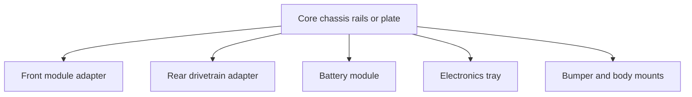

# Topic 4.7 - Modular Printed Chassis

> **"Print the smallest part that can prove the next important thing."**

---

# Learning Objectives 🎯

By the end of this topic you will be able to:

- convert donor datums and envelopes into controlled skeleton CAD
- divide the chassis into replaceable modules with explicit interfaces
- create continuous load paths through walls, ribs, fillets and fastener zones
- choose print orientation and material from force, accuracy and process needs
- derive risky fits from labelled coupons on the actual printing process
- inspect, dry-fit and release only traceable modules that pass their tests

---

# Before We Begin

The complete chassis finishes printing after many hours.

It looks excellent, but the rear module holes miss by half a millimetre.
One screw is hidden behind a rib, the battery can enter but cannot leave, and the front arm splits between layers during a gentle hand test.

The printer followed the file faithfully.
The design asked it to make an unproved system.

Topic 4.6 produced a Donor Interface Atlas.
Now we convert its datums and critical dimensions into replaceable printed modules.

Use six checks:

1. **Datum** - does every module share the controlled chassis references?
2. **Divide** - can one failed or changed job be replaced locally?
3. **Load** - does material connect the force entry to the supporting structure?
4. **Fit** - has the actual printer proved every risky interface?
5. **Orient** - do layers, accuracy, support and surfaces suit the job?
6. **Prove** - does the labelled module pass inspection, movement and service gates?

> **[Figure 4.7.1, Signature visual, F5 interface and load overlay: exploded modular chassis with front adapter, core, rear adapter, battery tray and electronics tray. Controlled interface planes show datum tabs, fastener holes, tool-access cylinders and removal arrows; orange force paths cross modules only through declared faces, and a labelled coupon sits beside each risky fit. Six gate labels—datum, divide, load, fit, orient and prove—surround the assembly. Caption: A modular chassis is a controlled set of interfaces and load paths, not one large printed shape. Alt text: Exploded printed chassis shows controlled interfaces, force routes, service paths and matching test coupons.]**

# Define the Chassis Architecture

Use the Build Passport and Atlas to choose modules.

A useful architecture is:



Every module needs:

- one clear job
- defined datums
- known fasteners
- installation direction
- removal route
- movement clearance
- revision identity
- failure contained locally where possible

Do not combine the battery tray, servo pocket, suspension mounts and electronics cover into one enormous print merely because CAD allows it.

# Create the Chassis Coordinate System

Reuse the physical logic from Topics 4.2 and 4.6.

```text
X direction: front to rear
Y direction: left to right
Z direction: bottom to top

Datum A: chassis bottom or primary mounting plane
Datum B: longitudinal centre plane
Datum C: front axle or selected module interface plane
```

Place donor datums relative to this system.

For example:

```text
Rear axle axis: X = 260 mm, Z = 32 mm, centred on datum B
Rear adapter face: X = 238 mm
Battery centre: X = 145 mm, Y = -18 mm
```

Do not type more decimal places than the measurements support.

> **[Figure 4.7.2, F6 measured drawing: skeleton CAD in top, side and front views shows datum A bottom plane, B centre plane and C front-axle plane, with rear axle axis, donor envelopes, battery centre and movement keep-clear zones located from them. Decorative surfaces are absent. Caption: Skeleton CAD controls where systems belong before deciding what the chassis looks like. Alt text: Chassis coordinate system locates axle, donor and battery geometry from three shared datums.]**

# Control Interfaces Before Styling

An **interface-control table** records the features that two modules must share.

| Interface | Datum features | Fasteners | Clearance | Owner |
|---|---|---|---|---|
| Core to rear adapter | Flat face + two locating edges | 4 × M3 | Hole coupon result | Core/rear CAD |
| Core to battery tray | Rail slots | 2 × M3 + strap | Battery envelope + service gap | Battery module |
| Core to electronics tray | Common mounting grid | 4 × M3 | Plug and tool access | Electronics module |
| Front adapter to donor module | Atlas datums A/B/C | Donor fasteners | Motion envelope | Front CAD |

Changing a controlled interface requires a recorded revision to every affected module.

This prevents a front module silently becoming incompatible with the core.

> **[Figure 4.7.3, F6 measured drawing: core-to-rear interface shown as a drawing and matching table row. Labels identify datum face, two locating edges, four M3 clearances, allowed adjustment, tool cylinder, installation arrow and compatible revisions R0.3/R0.2. Caption: One controlled record keeps connected modules from changing independently. Alt text: Dimensioned module interface is linked to its datums, fasteners, access and revision ownership.]**

# Turn Loads into Geometry

Remember the force paths from Topic 1.4.

Loads enter the chassis through:

- suspension mounts
- drivetrain reaction
- motor mount
- battery restraint
- bumper impact
- servo reaction

Draw arrows from each load to the core structure.

Then create continuous material paths using:

- walls
- ribs
- flanges
- gussets
- fillets
- local bosses around fasteners

Avoid a thin wall suddenly meeting a large block.
A gradual transition spreads stress.

> **[Figure 4.7.4, F5 force overlay: suspension, motor, battery and bumper loads enter four chassis regions. Continuous orange arrows travel through flanges, ribs, gussets and filleted bosses to the core; a faded alternative ends abruptly at a thin wall and shows a crack start. Caption: Strong geometry gives every important load a continuous route into the supporting structure. Alt text: Chassis load paths compare gradual reinforced transitions with an abrupt thin-wall failure.]**

# Walls and Ribs Before Blind Infill

Infill supports internal regions, but an arbitrary high percentage does not automatically place material where loads need it.

For many functional prints:

- outer walls carry important surface and bending loads
- ribs increase stiffness with targeted material
- top and bottom layers close the structure
- local modifiers can strengthen fastener zones
- infill supports surfaces and shares load

Manufacturer knowledge bases sometimes suggest examples such as additional walls and moderate infill for structural parts.
These are starting points, not universal guarantees.

Test the actual geometry, material, printer and orientation.

# Use Fillets Carefully

A sharp inside corner concentrates stress like a tear starting at a notch in paper.

A **fillet** is a rounded inside or outside transition.

Fillets can:

- reduce stress concentration
- improve material flow through the shape
- make ribs easier to print
- reduce sharp handling edges

Do not use a large decorative fillet that blocks a tool or donor movement envelope.

# Design Fastener Zones

A screw head pressing onto sparse plastic can crush or creep.

Provide:

- flat seating surface
- enough wall material around the hole
- washer where appropriate
- tool access along the screw axis
- nut capture with insertion access
- edge distance from the hole to the part boundary
- clearance for the full fastener length

For frequently removed modules, prefer:

- through-bolt and nut
- captured nut
- metal threaded insert installed correctly by an adult

Direct self-tapping into printed plastic may suit low-cycle covers, but repeated service can wear the hole.

Heat-set inserts involve a hot tool and are an optional adult-performed process, not required for Version 1.

> **[Figure 4.7.5, F2 cross-section: three serviceable fastener zones show through-bolt and nut, captured nut with insertion route, and optional heat-set insert marked ADULT PROCESS. Each includes flat head seating, washer where needed, local wall thickness, edge distance and a clear driver cylinder. Caption: A fastener zone must carry clamp load and remain reachable throughout service. Alt text: Printed fastener cross-sections show seating, local material, nut access and tool clearance.]**

# Clearance, Transition and Interference Fits

Remember the three fit families from Topic 1.7.

| Fit | Intended behaviour | Buggy example |
|---|---|---|
| Clearance | Parts assemble freely | Screw through-hole |
| Transition | Close location with gentle assembly | Removable locating tab |
| Interference | Part is intentionally pressed | Bearing seat only when proven and appropriate |

Printed dimensions depend on:

- machine calibration
- material shrinkage
- orientation
- layer height
- extrusion width
- hole direction
- slicer compensation

Therefore, a number copied from another printer is not evidence for yours.

# Build a Coupon Ladder

A **coupon ladder** is a small test containing several dimension variants.

Example bearing-seat ladder:

```text
Nominal bearing outside diameter: 12.0 mm
Test pockets: 12.0, 12.1, 12.2, 12.3 and 12.4 mm
```

Label each pocket in the CAD model.

Test:

- insertion force
- retention
- damage
- removal
- measured printed size

Do not force a precision bearing into an obviously undersized plastic seat.

> **[Figure 4.7.6, F7 comparison array: labelled bearing-seat coupon ladder contains 12.0 to 12.4 mm pockets and a result card for insertion, retention, damage and removal. The winning size is transferred to the interface-control table; the full adapter remains unprinted until then. Caption: A coupon converts uncertain allowance into evidence for one controlled feature. Alt text: Five bearing-seat variants are tested and one result updates the chassis interface.]**

## Worked Example - Material Cost

**Question:** What is the material cost of a 42 g module using filament costing £20 per kilogram?

**Known values:**

- module mass = 42 g
- filament cost = £20 per 1000 g

**Rule:**

```text
material cost = mass ÷ 1000 × price per kilogram
```

**Calculation:**

```text
material cost = 42 ÷ 1000 × 20
              = £0.84
```

Add support, purge, failed prints and test coupons to the actual cost ledger.
The slicer estimate is a planning value until the print is complete.

# Orientation Changes Behaviour

Imagine a deck of cards.
It is strong when pressed across the whole stack, but individual cards can slide or separate between layers.

FFF/FDM printed parts are **anisotropic**, meaning behaviour depends on direction.

When choosing orientation, compare:

- main force direction
- risk of layer separation
- accuracy of holes and faces
- support requirement
- surface quality at interfaces
- print-bed contact
- removal and post-processing
- print time and material

Bambu Lab's PETG guidance recommends considering force direction relative to extrusion planes.
Prusa's modelling guidance emphasises overhang angles and design for support-free printing.

There is rarely one perfect orientation.
Write which requirement won the trade-off.

> **🤔 Think about it.** Hold a deck of cards flat and bend the whole stack gently. Now slide one card sideways. Why can the same stack resist one action but allow another?

The interfaces between cards behave differently from the card material itself. Printed roads of plastic and the bonds between layers also create directional behaviour, so the important load should not be considered without print orientation.

> **[Figure 4.7.7, F7 comparison array: the same suspension bracket appears in three print orientations. Overlays compare main load across layers, hole shape, support scars on datum faces, bed contact and print time; no single column wins every row. Caption: Orientation is a trade-off between directional behaviour, accuracy, support and surface quality. Alt text: Three orientations of one printed bracket are compared against five engineering requirements.]**

# Orient Holes and Pins Deliberately

Horizontal round holes can print slightly flattened underneath.
Vertical holes may be more circular but place layers differently around the load.

Options include:

- orienting the hole vertically
- using a teardrop or supported profile for a horizontal hole
- printing undersize and carefully drilling to final size where appropriate
- splitting a part at a controlled interface
- using a metal bush or bearing

UltiMaker's FFF design guidance notes that accurate holes may need post-processing and that minimum printable features depend on material and settings.

The handbook does not prescribe one magic compensation.
Print a coupon.

# Design for Support-Free Printing Where Useful

Supports cost material and can damage interface surfaces when removed.

Reduce them with:

- 45°-style chamfers where the printer can handle them
- arched or teardrop holes
- self-supporting ribs
- flat split faces
- separate adapter modules
- orientation changes

Printer cooling and geometry affect the real overhang limit.
Use the machine's validated profile and a small test.

# Choose Material from Requirements

Topic 2.6 compared materials.

Ask:

- Will the part see heat from motor or sunlight?
- Does it need stiffness or controlled flex?
- Must it resist impact?
- Can the available printer process it safely and reliably?
- Is the material dry and stored correctly?
- Has the printer profile been tested?

Possible paths:

- PLA for easy indoor geometry prototypes and coupons
- PETG for many functional mounts where toughness and temperature resistance are useful
- tougher specialist materials only after printer capability, ventilation and safety are established

Do not assume a material name guarantees performance.
Brand, moisture, print settings, geometry and orientation matter.

# Add Revision Identity

Emboss or engrave a small code on each module:

```text
VF4-RAD-R0.2
```

Also record:

- CAD file version
- slicer profile
- material and colour
- orientation
- print date
- printer
- observed defects
- test status

A revised file with the old label creates confusion.

# Inspect Before Assembly

Look for:

- missing layers
- cracks or layer separation
- warped mounting faces
- poor first layer
- damaged holes
- support scars on datums
- loose strings near moving parts
- incorrect revision label

Measure only critical dimensions.

Reject or mark a print `TEST ONLY` if a defect affects load, alignment or retention.

Do not hide a crack under a washer and call it complete.

> **[Figure 4.7.8, F1 annotated photograph: four printed modules under raking light are labelled PASS, REWORK, TEST ONLY and REPRINT. Callouts identify warped datum, layer split across a load path, damaged hole, harmless stringing and correct revision code. Caption: Structural acceptance depends on where a defect is and what the module must do. Alt text: Printed chassis modules are classified by defects at critical and non-critical features.]**

> **☕ Good place to pause.**
>
> Finish the interface-control table and coupon list before modelling the full modules.
> The next stage should be a few grams of evidence.

# Hands-On Activity 1 - Layer-Direction Card Stack

Tape card strips into two small beams.

In one, stack strips flat.
In the other, stand the layers differently relative to the bend.

Load them gently and label the analogy's limits.

# Hands-On Activity 2 - Tool-Access Cylinder

Roll paper into a tube the diameter of a screwdriver handle or driver shaft.

Place it over every planned fastener on the card or CAD printout.
Mark blocked access before printing.

# Hands-On Activity 3 - Coupon and Module Decision Game

For each risky feature, write:

- question
- smallest test geometry
- variants
- pass condition
- next action

Reject any coupon that attempts to answer five unrelated questions at once.

Then cut front, rear, battery and electronics modules from card.

Join them on the controlled interface grid.
Replace one without disturbing the others.

Revise the interface if the swap requires tearing or bending.

> **[Figure 4.7.9, F7 comparison array: three no-print rehearsals show card-strip beams loaded across different layer analogies, a paper tool cylinder testing a buried screw and card modules swapped on a controlled grid beside one-question coupon cards. Caption: Layer direction, tool access and modularity can be challenged before any filament is used. Alt text: Household activities rehearse printed-part direction, service access and coupon planning.]**

# Topic Project - Modular Printed Chassis 🛠️

Design, validate and print the minimum structural set needed to carry the approved donor modules.

## Materials

- Donor Interface Atlas and fit templates
- passing layouts and prototype dimensions
- CAD software from Topic 2.4
- slicer and validated printer profile
- suitable known filament
- printer in the supervised workshop setup
- small quantity of standard fasteners, washers and nuts
- callipers or ruler
- card tool-access tubes
- labels and Build Passport

> **⚠️ SAFETY**
>
> Show a responsible adult or guardian the CAD, material, printer setup and assembly plan before printing, and work with them nearby.
> The nozzle and build plate can cause burns; never touch them during printing or cooling, and follow the printer manufacturer's procedures.
> Use the material in the ventilated environment required by its manufacturer and workshop risk assessment.
> Stop a print for smoke, unusual smell, scraping, detached parts or unsafe printer behaviour.
> An adult must handle hot insert tools, craft knives, drills and difficult support removal.
> Wear eye protection when the adult risk assessment requires it, and keep sharp swarf and clipped plastic controlled.
> Never print a battery, gear, high-speed shaft, wheel hub or other specialist safety-critical precision part merely to avoid buying the correct component.

> **🎬 Watch the build**
>
> - [Prusa: Modelling with 3D Printing in Mind](https://help.prusa3d.com/article/modeling-with-3d-printing-in-mind_164135) - official visual guidance on overhangs and printable geometry.
> - [Bambu Lab: Printing Large Files](https://wiki.bambulab.com/en/bambu-studio/manual/3d-print-large-files) - shows how splitting, orientation, strength and surface quality interact.
> - [UltiMaker: Design for FFF](https://ultimaker.com/learn/design-for-fff-3d-printing-maximize-your-success/) - official design guidance for holes, gaps and post-processing.

## Step 1 - Freeze the architecture

List modules and controlled interfaces.

## Step 2 - Create skeleton CAD

Model datums, axle axes, donor envelopes and movement keep-clear regions first.

Do not add styling.

## Step 3 - Model coupons

Create the bearing, hole, nut, servo, motor and donor-pattern tests required by the Atlas.

## Step 4 - Slice and review coupons

Check orientation, perimeters, toolpath, support and labels.

## Step 5 - Print and measure coupons

Record actual result rather than only `fits/does not fit`.

## Step 6 - Update controlled dimensions

Write the coupon-derived allowance and evidence source.

## Step 7 - Model one module

Start with the interface carrying the greatest uncertainty.

Add load paths, fastener zones, tool access and revision ID.

## Step 8 - Run digital interference checks

Compare solids, movement envelopes and service routes.

## Step 9 - Review print orientation

Use a table:

| Requirement | Orientation effect | Decision |
|---|---|---|
| Main load |  |  |
| Hole accuracy |  |  |
| Support |  |  |
| Interface surface |  |  |
| Print time/material |  |  |

## Step 10 - Print one module

Inspect and dry-fit it before slicing the next.

## Step 11 - Repeat by module

Core, rear adapter, front adapter, battery tray and electronics tray are separate approval steps.

## Step 12 - Dry mechanical fit

Use no battery and no motor power.

Install donor parts gently with the intended fasteners.

## Step 13 - Check datums and movement

Measure axle relationship and move suspension/steering by hand.

## Step 14 - Perform service demonstration

Remove each module with the intended tools.

## Step 15 - Reflection

Record:

- the coupon that prevented the most waste
- the orientation trade-off chosen
- one load path visible in the geometry
- one module revised independently
- actual filament used and wasted

Keep passing coupons beside the chassis.
They show that the structure grew from evidence.

> **[Figure 4.7.10, F4 sequence strip: six gated panels show skeleton CAD, labelled coupon ladder, updated interface table, first module slice review, inspected dry fit, then complete unpowered modular chassis with service arrows and revision labels. Caption: The full chassis appears only after small proofs remove the highest interface risks. Alt text: Modular chassis progresses from datums and coupons to inspected, serviceable printed modules.]**

# Learning Goal

Create a dimensionally controlled, printable and serviceable structure that adapts proven donor systems without trapping them.

# Cheapest Valid Prototype

One interface coupon and one small adapter module.

The full chassis print is justified only after those features pass.

# What to Buy, Reuse and Make

## Buy now

- enough known filament for coupons and approved modules
- missing standard fasteners, washers and nuts

Do not buy exotic filament to compensate for untested geometry.

## Reuse now

- donor modules and fasteners
- radio and drive equipment from Topic 4.5 where compatible
- card templates and tool-access tubes
- existing printer, tools and filament where suitable

## Make now

- skeleton CAD
- interface-control table
- coupon ladders
- chassis core
- donor adapters
- battery tray
- electronics tray
- revision and inspection records

## Buy later

Optional inserts, guards or upgraded materials wait until Version 1 tests reveal a need.

# Cost Checkpoint

Create a print ledger:

| Item | Slicer mass | Actual/estimated material cost | Print time | Result | Waste reason |
|---|---:|---:|---:|---|---|
| Bearing coupon |  |  |  |  |  |
| Rear pattern coupon |  |  |  |  |  |
| Rear adapter R0.1 |  |  |  |  |  |

Include:

- coupons
- supports and brim
- purge or calibration waste
- failed modules
- hardware
- replacement nozzle only if actually consumed for the project

Do not hide failed prints.
They are part of cost and learning evidence.

# Modular Interfaces

Use a common fastener family where the donor allows it.

Record:

- datum surfaces
- locating features
- hole size and spacing
- nut or insert type
- allowed adjustment
- tool direction
- installation direction
- removal order
- compatible module revisions

Avoid creating two nearly identical hole grids.
One standard grid makes future sensor or cover modules easier.

# Test Plan

## Test 1 - Fit and Interface Gate

**Question:** Which allowance and module revision produce the required fit and datum alignment without force?

**Independent variable:** Coupon dimension or module revision.

**Dependent variables:** Insertion force, movement, retention, face gap, hole alignment and datum offset.

**Control variables:** Same printer profile, material, orientation, donor part, fasteners and inspection method.

**Procedure:** Test labelled coupons from loosest to tightest where safe, update the controlled dimension, then dry-fit the related module pair with fasteners inserted by hand.

**Pass condition:** The chosen fit survives installation and removal without damage, parts seat on their datums and screws do not pull misaligned faces together.

## Test 2 - Structure and Motion Gate

**Question:** Does the assembled chassis carry representative load while preserving the complete powered-down movement envelope?

**Independent variable:** Applied load or mechanism position.

**Dependent variables:** Deflection, permanent set, crack formation, minimum clearance and contact count.

**Control variables:** Same support points, assembly, fastener state, load positions, duration and movement range.

**Procedure:** Apply representative mass in safe increments and measure a datum gap; remove it, then move steering, suspension and drivetrain slowly through their complete envelopes.

**Pass condition:** No crack, layer separation or permanent deformation occurs, deflection stays within the project limit and there is zero unintended contact.

## Test 3 - Quality, Identity and Service Gate

**Question:** Is each correctly identified module structurally acceptable and independently serviceable?

**Independent variable:** Module selected.

**Dependent variables:** Critical defects, removal time, tools used and unrelated interfaces disturbed.

**Control variables:** Same inspection light, acceptance rules, assembly and tool set.

**Procedure:** Mark every print `PASS`, `REWORK`, `TEST ONLY` or `REPRINT`, then remove and reinstall each passing major module by its planned route.

**Pass condition:** Only the correct revision with no critical defect enters assembly; removal needs no forced bending and disturbs no unrelated module.

# Upgrade Path

PLA geometry coupons -> functional-material coupons -> printed adapters -> modular chassis R0.x -> mechanically assembled rolling chassis -> electronics installation -> tested Version 1 -> alternative module revisions.

# Stop Point Before Topic 4.8

Do not begin final mechanical assembly until:

- chassis coordinate system and interfaces are controlled
- donor envelopes and motion spaces exist in CAD
- every risky fit has a passing coupon
- coupon results are written into CAD decisions
- each module has a revision ID
- material and print orientation decisions are recorded
- prints have no critical defect
- modules dry-fit without fasteners forcing alignment
- representative static load passes
- steering, suspension and drivetrain clearances pass by hand
- all fasteners have tool access
- major modules pass the service demonstration
- actual print cost and waste are recorded
- the adult supervisor approves assembly tools and procedures

The next stage purchases only missing standard mechanical hardware confirmed by the dry fit.

---

# Common Beginner Mistakes ❌

## Mistake 1 - Printing the Full Chassis First

Coupons should discover fit errors with grams, not hundreds of grams.

> **[Figure 4.7.11, F3 right-versus-wrong pair: left panel shows a large failed chassis surrounding one undersized bearing seat; right panel shows the same error caught in a five-pocket coupon before the adapter is sliced. Caption: Small tests make interface failure cheap and informative. Alt text: Wasteful full-chassis fit failure is contrasted with an early coupon ladder.]**

## Mistake 2 - Styling Before Datums and Modules

Control interfaces and movement first.

Modules localise revisions and failures.

> **[Figure 4.7.12, F3 right-versus-wrong pair: left panel is one sculpted shell with hidden axle and battery assumptions; right panel begins with A/B/C datums, envelopes and separable front, core, rear and tray modules. Caption: Appearance cannot rescue an uncontrolled or unserviceable architecture. Alt text: Monolithic styled chassis is contrasted with datum-led modular skeleton CAD.]**

## Mistake 3 - Copying Someone Else's Fit Number

Your machine, material, orientation and geometry need their own evidence.

> **[Figure 4.7.13, F3 right-versus-wrong pair: left panel copies “add 0.2 mm” from another printer and cracks a seat; right panel prints labelled local variants using the chosen material, profile and orientation. Caption: A fit allowance belongs to a process and feature, not to the internet in general. Alt text: Copied tolerance fails beside a locally validated coupon result.]**

## Mistake 4 - Treating Infill as the Whole Structure

Improve load paths, walls, ribs and orientation deliberately.

FFF/FDM parts behave differently across and between layers.

> **[Figure 4.7.14, F3 right-versus-wrong pair: left panel has dense infill inside a thin arm that ends abruptly and splits between layers; right panel adds a flange, rib, fillet, local boss and chosen layer route with less blind infill. Caption: Material helps only when geometry and orientation place it in the load path. Alt text: Dense but poorly shaped printed arm is contrasted with deliberate structure and orientation.]**

## Mistake 5 - Letting Fasteners Correct the CAD

Test the complete tool path.

Fasteners clamp correct interfaces; they do not correct CAD.

> **[Figure 4.7.15, F3 right-versus-wrong pair: left panel bends two misaligned modules together with a screw whose driver path is blocked by a rib; right panel shows seated datums, hand-inserted screw and clear tool cylinder. Caption: A serviceable fastener clamps an already aligned interface. Alt text: Forced hidden screw joint is contrasted with aligned faces and accessible fastening.]**

## Mistake 6 - Hiding Defects or Identity

Mark structural acceptance before installing donor parts.

An unidentifiable module cannot be compared or reproduced reliably.

> **[Figure 4.7.16, F3 right-versus-wrong pair: left panel hides a layer split beneath a washer on an unlabelled black part; right panel quarantines it as TEST ONLY and installs a dated, inspected R0.3 module. Caption: A traceable rejection protects the assembly from an attractive but unsuitable print. Alt text: Hidden defect on an unknown print is contrasted with labelled inspection and controlled release.]**

# Topic Summary 📝

- Modular architecture allows local replacement, comparison and upgrade.
- Chassis and donor datums share one coordinate system.
- Interface-control tables prevent silent incompatibility.
- Loads need continuous paths through walls, ribs, gussets, fillets and fastener zones.
- More infill is not a substitute for purposeful geometry.
- Printed-fit allowances must be established by coupons on the actual process.
- Orientation trades layer strength, accuracy, supports and surface quality.
- Material selection begins with environment and function.
- Fastener zones require seating, edge distance, local material and tool access.
- Every module carries a revision identity and print record.
- Inspection separates structural parts from test-only prints.
- Dry fitting, static load, movement and service tests precede mechanical assembly.

# New Words 📖

| Word | Meaning |
|---|---|
| Anisotropic | Having different properties in different directions |
| Boss | Locally thickened feature supporting a hole, fastener or shaft |
| Coupon ladder | Test piece containing several labelled size variants |
| Fillet | Rounded transition between faces or features |
| Interface-control table | Record of datums, dimensions and rules shared by connected modules |
| Local modifier | Slicer region given different settings from the rest of a model |
| Skeleton CAD | Early model containing datums, axes, envelopes and interfaces before detailed structure |
| Structural acceptance | Decision that a printed part is suitable for its intended load-bearing job |

# Review Questions ❓

1. Why should a modular chassis avoid one enormous print?
2. What information belongs in the chassis coordinate system?
3. What does an interface-control table prevent?
4. Name five geometry tools used to create a load path.
5. Why may increasing infill fail to solve a weak mounting arm?
6. What is a coupon ladder?
7. A 65 g part uses £24/kg filament. What is its material cost before waste?
8. Why does print orientation affect strength and accuracy?
9. When might a captured nut be preferable to a screw directly in plastic?
10. What should a revision code identify?
11. Why must screws not pull misaligned modules into position?
12. Which tests must pass before Topic 4.8?

# Topic Checklist ✅

- [ ] My chassis has controlled A, B and C datums.
- [ ] Modules have clear jobs and removal routes.
- [ ] Shared interfaces are recorded in one table.
- [ ] Force paths are visible in the geometry.
- [ ] Fastener zones have material, seating and tool access.
- [ ] Every risky fit passed a coupon.
- [ ] Coupon evidence updated the CAD.
- [ ] Material and orientation decisions are justified.
- [ ] Every module carries the correct revision ID.
- [ ] Critical print defects are absent.
- [ ] Modules dry-fit without forced alignment.
- [ ] Static load and movement-clearance tests pass.
- [ ] Major modules can be removed independently.
- [ ] Print costs, failures and waste are recorded.
- [ ] A responsible adult approved mechanical assembly.

# Learn More

> **📚 Learn more**
>
> - [Prusa: Modelling with 3D Printing in Mind](https://help.prusa3d.com/article/modeling-with-3d-printing-in-mind_164135) - official guidance for printable overhangs and process-aware geometry.
> - [Bambu Lab PETG Guide](https://wiki.bambulab.com/en/filament/petg) - official example of considering force direction and print orientation.
> - [UltiMaker Design for FFF](https://ultimaker.com/learn/design-for-fff-3d-printing-maximize-your-success/) - official guidance on holes, moving gaps and post-processing.

# Looking Ahead 🔭

The chassis modules now fit, carry representative load and preserve movement on the bench.

In **Topic 4.8 - Final Mechanical Assembly**, we will assemble the donor drivetrain, suspension, steering, wheels and printed structure in a controlled sequence, set gear mesh and alignment, secure fasteners correctly and prove a smooth unpowered rolling chassis before electronics are installed.

# Answers 🔑

1. Separate modules confine fit errors, print failures, repairs and future changes to one job instead of wasting the complete structure.
2. Record X/Y/Z directions and shared A/B/C datums, then locate axle axes, interfaces, envelopes and keep-clear regions from them.
3. It prevents one connected module changing its datums, holes, clearance, access or compatible revision without the other module being updated.
4. Walls, ribs, flanges, gussets and filleted bosses can create continuous load paths.
5. Extra infill may leave the same thin wall, sharp transition, poor layer route or weak fastener zone unchanged.
6. A coupon ladder is a small labelled test piece containing several size variants of one risky feature.
7. `65 ÷ 1000 × £24 = £1.56` before support, purge or failed-print waste.
8. Layers create directional behaviour, while orientation also changes hole quality, interface surfaces, support needs and bed contact.
9. A captured nut provides a replaceable metal thread for a module that will be removed repeatedly without requiring a hot insert process.
10. It should identify the module and exact design revision so the CAD, slicer record, material, inspection and test evidence can be matched.
11. Pulling parts together stores stress, hides a datum or hole error and may distort alignment; screws should clamp parts that already seat.
12. Coupon and interface fit, representative static load, full powered-down movement clearance, print-quality identity and independent service tests must pass.
