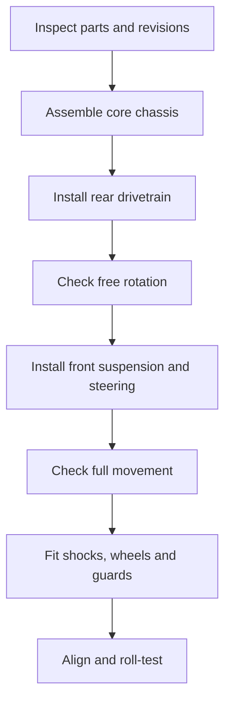

# Topic 4.8 - Final Mechanical Assembly

> **"A correct assembly is not a pile of correct parts; it is a controlled sequence of correct relationships."**

---

# Learning Objectives 🎯

By the end of this topic you will be able to:

- organise revisions, donor parts and fasteners into a controlled assembly sequence
- distinguish locating, clamping, retaining and adjusting jobs at each joint
- seat and secure printed modules without using screws to correct alignment
- identify new drivetrain resistance through incremental freedom checks
- establish manual-specific gear mesh, suspension symmetry, ride height and toe
- release a smooth, traceable and serviceable unpowered rolling chassis

---

# Before We Begin

The buggy looks complete on the bench.

When pushed, it stops after half a metre and curves left.
One gearbox screw is too long, a printed joint has been crushed, and the motor screws pulled a misaligned adapter into place.

Every part was present.
Their relationships were not controlled.

Topic 4.7 produced passing printed modules.
Now we combine them with donor precision parts to create the final mechanical chassis.

No propulsion battery is connected in this topic.
Every important mechanism must first work by hand.

Use six checks:

1. **Identity** - is each part, revision, fastener and instruction known?
2. **Seat** - do datum faces meet cleanly before tightening?
3. **Align** - do shafts, gears, axles and paired suspension parts share the intended geometry?
4. **Move** - does each mechanism remain free after every addition?
5. **Retain** - is each part secured by the correct hardware and method?
6. **Prove** - does the finished chassis roll, return and come apart as planned?

> **[Signature visual, F2 joint cross-section - Figure 4.8.1: one modular joint appears in four linked panels—tabs locate on clean datums, bolts clamp seated faces, a captive nut retains the bolt and a slot permits controlled adjustment. A crossed-out fifth panel shows a screw bending separated faces together. Six outer labels—identity, seat, align, move, retain and prove—connect the joint to the assembly release.]**
>
> *Figure 4.8.1 - Fasteners secure a correct relationship; they do not create one by force.*
>
> *Alt text: Modular printed joint distinguishes locating, clamping, retaining and adjusting from forced alignment.*

# Start with an Assembly Plan

Use three sources:

1. donor manufacturer's official manual
2. Donor Interface Atlas
3. printed-chassis interface-control table

Create a sequence that preserves access and allows intermediate tests.

A useful order is:



Your donor manual may require a different internal gearbox sequence.
Follow it for donor mechanisms.

> **[F4 sequence strip - Figure 4.8.2: six gated panels show identity audit, core seated on datums, rear drivetrain with freedom check, paired front suspension and steering, shocks and wheels, then unpowered alignment, roll and service proof. A stop sign appears whenever a new bind or mismatch is found.]**
>
> *Figure 4.8.2 - Assembly advances only while each added relationship remains understood.*
>
> *Alt text: Mechanical chassis is assembled in stages with movement and alignment checks between them.*

# Create an Assembly Station

Prepare:

- clean, well-lit bench
- shallow trays
- printed parts arranged by revision
- donor parts grouped by module
- fastener map
- correct drivers
- ruler, square and callipers where useful
- paper towels
- manufacturer-approved lubricant only where specified
- witness marker
- inspection sheet

Keep batteries and powered electronics away from the mechanical bench.

Do not open every fastener bag at once.

> **[F1 annotated photograph - Figure 4.8.3: clean assembly station has printed modules grouped by revision, donor parts by stage, shallow labelled trays, fastener map, exact drivers, measurement tools, witness marker and a battery exclusion zone.]**
>
> *Figure 4.8.3 - An organised bench preserves component identity and makes the intended sequence visible.*
>
> *Alt text: Mechanical assembly station separates revisions, parts, fasteners, tools and records.*

# Understand Four Mechanical Jobs

A fastener or feature may:

- **locate**: place one part accurately
- **clamp**: press mating faces together
- **retain**: stop a part escaping
- **adjust**: permit a controlled position change

One screw should not be expected to correct a poor locating interface while clamping and adjusting at the same time.

Printed tabs or datum faces can locate.
Screws then clamp.

# Read Fastener Identity Fully

`M3 × 12` means a metric thread with nominal 3 mm diameter and 12 mm length, but the exact length reference depends on head style.

Also record:

- head type
- material
- thread type
- washer
- nut or insert
- donor-manual position

Do not replace a shoulder screw or hinge pin with an ordinary fully threaded screw.
The smooth bearing surface may be essential.

Before tightening, check that a screw cannot:

- bottom inside a blind hole
- touch a gear
- clamp a rotating bearing
- protrude into a battery space
- crack a thin wall
- damage an electronic component later

# Tighten Printed Parts Differently

Metal parts often tolerate greater clamp load than printed thermoplastic.

For printed joints:

- seat parts fully by hand
- turn fasteners with the correct driver
- tighten gradually in a cross pattern where appropriate
- use washers to spread load when designed
- stop when faces are seated and the joint is secure
- follow any specified torque from the component/manual
- never continue merely because the tool can turn

Signs of over-tightening include:

- whitening around a hole
- sinking screw head
- crushed surface
- cracking sound
- distorted module
- sudden loss of resistance

If one appears, stop and inspect.

> **[F2 cross-section - Figure 4.8.4: four M3 fastener stacks show correct through-bolt length, blind-hole bottoming, a screw touching a gear and a head crushing printed plastic. Labels identify head style, washer, grip length, thread engagement and keep-clear depth.]**
>
> *Figure 4.8.4 - Diameter alone cannot tell whether a fastener is correct for its complete stack.*
>
> *Alt text: Fastener cross-sections compare safe engagement with bottoming, gear contact and plastic crushing.*

# Use Thread-Locking Products Carefully

Some metal-to-metal RC fasteners may require a removable thread-locking product.

Thread-locker is a chemical, so it comes with chemical rules.

> **⚠️ SAFETY**
>
> An adult handles the thread-locking product, opens it and reads its safety data before any is used.
>
> - follow the donor or component manual, and use it only where that manual specifies
> - keep it away from incompatible plastics - it can craze and weaken a printed part
> - a tiny controlled amount, never a coated screw
> - allow the stated cure time before loading the joint
> - keep it off skin and eyes, and away from food and drink on the bench

Do not put thread-locker on every screw.
Nylon lock nuts, captive nuts, correctly designed plastic threads and self-locking features work differently.

> **📚 Learn more**
>
> - Your donor manufacturer's official assembly manual: the primary authority for order, fasteners, lubrication and settings. Where it disagrees with this book, it wins.

# Assemble the Core on Datums

Place the core chassis on a known flat surface.

Install cross-members or plates loosely first.

Check:

- correct revision
- datum faces clean
- no trapped filament string
- fasteners enter by hand
- left and right pieces are not swapped
- diagonals agree within the chosen limit

Tighten progressively while rechecking squareness.

Add witness marks only after final inspection.

# Install Bearings and Shafts Without Force

Bearings should enter the coupon-proven seats using the validated method.

Support the surrounding printed structure.

Do not:

- hammer bearings
- press through a delicate gearbox shell
- force a tilted bearing
- push dirt into the seat
- apply load through the wrong ring when the manufacturer's procedure specifies otherwise

Shafts should pass through aligned supports without being used as levers.

If a shaft enters one support but not the next, investigate alignment.

# Build the Drivetrain in Testable Layers

Use this logic:

1. rotate gearbox output alone
2. add bearings and shafts; rotate again
3. add driveshafts or dogbones; rotate again
4. add hubs; rotate again
5. add wheels loosely; rotate again
6. tighten wheel retainers correctly; rotate again

Record the first step that changes resistance or noise.

This is **incremental freedom testing**.

Do not complete the entire rear module and then report “it feels tight”.

> **[F4 sequence strip - Figure 4.8.5: gearbox output, bearings and shafts, driveshafts, hubs, loose wheels and retained wheels are added one stage at a time. A resistance/sound card is completed after each spin, and stage four reveals the first hard point.]**
>
> *Figure 4.8.5 - The first changed reading identifies the assembly stage that introduced resistance.*
>
> *Alt text: Drivetrain is hand-spun after each component layer to isolate a bind.*

# Understand Differential Behaviour

With a differential and both driven wheels raised, turning one wheel may make the other rotate oppositely or differently depending on what is held.

Follow the donor manual and Topic 3.8.

Check:

- smooth rotation
- no regular clicking
- no seized output
- correct washers and shims
- no case screws over-tightened

Do not diagnose differential behaviour from one wheel movement alone.

> **📚 Learn more**
>
> - Your motor and gearbox manufacturer's instructions: the primary authority for pinion fitting, gear mesh and securing methods - the numbers are model-specific and this book cannot supply them.

# Set Gear Mesh

Meshing gears need a small amount of free movement called **backlash**.

Too tight:

- friction and noise increase
- motor and gears heat
- wear accelerates

Too loose:

- teeth contact poorly
- impact and stripping risk increase
- noise may increase

Use the motor or gearbox manufacturer's mesh procedure.

A common low-power workshop method uses a thin paper strip between spur and pinion while setting the motor, but this is only a starting method when appropriate to the exact gears.
The finished mesh must be checked around a full revolution because gears and shafts have runout.

> **🤔 Think about it.**
>
> Put two combs together so their teeth engage.
> Push them tightly until they cannot slide, then separate them until they barely touch.
> Why does useful engagement sit between those extremes?

The gear teeth need enough engagement to carry load and enough clearance to rotate without binding.

> **[F7 comparison array - Figure 4.8.6: pinion and spur are shown too tight, usable and too loose in magnified side views, with rotation, backlash and tooth engagement arrows. A second strip checks the chosen mesh at four quarter-turn positions and across tooth width; “follow exact manual” sits above the array.]**
>
> *Figure 4.8.6 - Useful mesh must survive a full revolution and correct axial overlap, not only one convenient tooth position.*
>
> *Alt text: Gear mesh conditions and four-position runout check show model-specific adjustment evidence.*

# Align Pinion and Spur Across Their Width

Top-view gear mesh can look correct while only part of each tooth width overlaps.

Check axial alignment:

- pinion is secured to the correct shaft position
- grub screw sits on a flat where specified
- teeth overlap across the intended face width
- neither gear rubs a cover or housing
- motor shaft does not bottom inside the pinion

Use thread-locking product only as the manual instructs.

---

> **☕ Good place to pause.**
> The drivetrain is in and still turns freely by hand.
> The next sections add suspension and steering, and every one of them is a symmetry check.

---

# Assemble Suspension Symmetrically

Build left and right sides in paired steps.

Compare:

- arm orientation
- hinge pin direction
- spacer order
- shock mounting hole
- spring preload
- droop limit
- hub and steering-knuckle orientation

Symmetry makes mistakes visible.

Do not assume mirrored parts are identical.
Look for `L`, `R`, part numbers or asymmetrical features.

> **📚 Learn more**
>
> - NASA Engineering Design Process: search "test evaluate refine" for why each assembly stage is checked before the next variable is added.

# Check Suspension Freedom Before Shocks

With shocks disconnected where the manual permits, move each suspension arm slowly.

It should move through the intended range without:

- hard binding
- scraping printed structure
- driveshaft jamming
- hinge pin bending
- steering link collision

Then add shocks and compare the new resistance and return behaviour.

# Fit Shocks Correctly

Use donor shocks as assembled and maintained according to their manual.

Check:

- no leakage
- free pivot at both eyes
- correct left-right pair
- no spring rubbing a shaft or chassis
- no shock body collision through travel
- fastener allows intended pivot without looseness

Do not grip a polished shock shaft with pliers.
Damage can destroy seals.

# Establish Provisional Ride Height

**Ride height** is the distance between a chosen chassis point and the ground at rest.

Use:

- intended wheels and tyres
- representative mechanical mass
- flat surface
- suspension settled by gently lifting and releasing
- same measurement points left and right

## Worked Example

**Question:** Is left-right front ride height inside a ±1 mm symmetry target?

**Measurements:**

- front left = 24.5 mm
- front right = 22.0 mm

**Difference:**

```text
|24.5 - 22.0| = 2.5 mm
```

**Meaning:**

The 2.5 mm difference exceeds the 1 mm target.
Check spring preload, shock position, binding, chassis twist and measurement method before adjusting randomly.

Ride height will be revisited after electronics add real mass.

> **[F5 motion and measurement overlay - Figure 4.8.7: left and right suspension are assembled as mirrored stages, then compressed without shocks and with shocks. Defined ride-height points show 24.5 and 22.0 mm, while arrows point to preload, bind, twist and measurement method as possible causes.]**
>
> *Figure 4.8.7 - Symmetry is measured after movement is proved, not guessed from appearance.*
>
> *Alt text: Paired suspension build and ride-height measurement reveal a 2.5 millimetre difference.*

# Centre the Steering Mechanically

Install the servo saver, rack, bellcranks and links according to the donor geometry.

With the servo disconnected or safely centred later:

- place rack at geometric centre
- make left and right links the intended lengths
- set wheels approximately straight
- check equal travel toward both sides
- confirm no link crosses over-centre
- preserve servo-horn and tool access

Do not use powered servo force to move a binding steering system.

# Measure Toe

Toe compares distance between the fronts and rears of a wheel pair at the same height.

```text
toe difference = front spacing - rear spacing
```

Define your sign convention in the test record.

Example:

```text
front spacing = 198 mm
rear spacing = 200 mm
front is 2 mm narrower -> toe-in by this project's convention
```

Use the donor's starting setup where available.
The aim now is symmetry and predictable rolling, not performance tuning.

> **[F6 measured drawing - Figure 4.8.8: two front wheels are shown at the same ride height with front spacing and rear spacing measured on a common horizontal line. Insets compare parallel, toe-in and toe-out and state the project sign convention; steering links clear the chassis through full hand movement.]**
>
> *Figure 4.8.8 - Toe becomes repeatable only when height, measurement points and sign convention are controlled.*
>
> *Alt text: Dimensioned front-wheel plan explains toe measurement and steering-clearance inspection.*

# Install Wheels and Retainers

Check:

- wheel hex seated on its pin
- correct wheel offset
- tyre direction if marked
- nut thread starts by hand
- wheel rotates after tightening
- no excessive side play
- no tyre-body or suspension rub

Wheel nuts are safety-relevant retainers.
Use the correct type and manufacturer method.

Mark inspected wheel nuts with small witness lines if appropriate.

# Add Guards Without Hiding Inspection

Fit only guards or covers needed for mechanical protection.

Keep access to:

- gear mesh
- wheel nuts
- suspension pins
- chassis module screws
- motor adjustment
- future wiring routes

A cover should not force complete disassembly for routine inspection.

> **☕ Good place to pause.**
>
> Stop after the drivetrain module and perform incremental freedom checks.
> Steering and suspension should not be added until rotation is understood.

# Hands-On Activity 1 - Locate, Clamp, Retain or Adjust

Choose ten interfaces on household objects or the buggy.

Label which mechanical job each feature performs.
Find one feature performing two jobs and discuss the trade-off.

# Hands-On Activity 2 - Fastener Length Stack

Stack card layers representing printed wall, washer, nut engagement and clearance.

Use paper screw strips of different lengths.
Choose one that engages correctly without entering a marked keep-clear space.

# Hands-On Activity 3 - Freedom and Alignment Record

Use a pencil shaft and several paper supports.

Add one support at a time and spin the shaft.
Deliberately misalign one support and identify when resistance appears.

Then use two books as wheels.

Set them parallel, toe-in and toe-out.
Measure front and rear spacing at the same height and define the sign convention.

> **[F7 comparison array - Figure 4.8.9: three household rehearsals show objects classified as locate/clamp/retain/adjust, paper fastener strips passing or entering a keep-clear zone, and a pencil shaft plus book wheels used for incremental freedom and toe measurements.]**
>
> *Figure 4.8.9 - Joint jobs, fastener length and alignment can be rehearsed without the real chassis.*
>
> *Alt text: Card and household activities model fastening, rotating alignment and toe.*

---

> **☕ Good place to pause.**
> Every mechanism has been checked at the moment it was added.
> Now the whole rolling chassis is proved as one thing.

---

# Topic Build - Final Mechanical Rolling Chassis 🛠️

Assemble the printed and donor parts into a complete, serviceable, unpowered rolling buggy chassis.

## Materials

- all structurally accepted Topic 4.7 modules
- approved donor drivetrain, suspension and steering parts
- official donor manual and exploded diagram
- fastener map and interface-control table
- correct screws, nuts, washers, pins and clips
- correct hand tools
- manufacturer-approved lubricants or removable thread-locking product only where specified
- flat setup surface
- ruler, square and callipers
- thin paper for permitted gear-mesh method
- witness marker
- trays and inspection sheet

> **⚠️ SAFETY**
>
> Show a responsible adult or guardian the complete assembly plan, manuals, tools and chemical products before starting, and work with them nearby.
> Keep all batteries disconnected and away from the bench.
> Wear eye protection where the adult risk assessment identifies spring clips, loaded suspension parts or flying debris.
> Use correct drivers, protect sharp shafts and stop rather than forcing a part.
> An adult must handle thread-locking chemicals, lubricants, drills, hot inserts or difficult press fits according to product instructions.
> Never grip polished shock shafts with pliers, hammer bearings or spin the drivetrain with a motor during this topic.
> Keep small clips, pins and fasteners away from young children and pets.

> **🎬 Watch the build**
>
> - Your donor manufacturer's official manual - follow its exact numbered assembly diagrams, fasteners and settings.
> - Tamiya official support: search your kit or comparable chassis manual for clear staged RC assembly illustrations.
> - Prusa Knowledge Base: search "assembling printed parts fasteners" for examples of careful printed-part assembly.

## Step 1 - Audit parts and revisions

Match every printed code and donor part number to the plan.

## Step 2 - Dry-plan the sequence

Place parts in order without opening chemicals or adding power.

## Step 3 - Assemble the core

Use datum faces and a progressive cross-tightening pattern where appropriate.

## Step 4 - Install the rear drivetrain

Follow the donor manual.

Perform a freedom check after every added rotating layer.

## Step 5 - Set motor position or gear mesh

Use the approved method with motor electrically disconnected.

Check around a full gear revolution.

## Step 6 - Install front suspension

Build left and right in matched stages.

## Step 7 - Install steering mechanism

Centre the rack mechanically and check free travel.

## Step 8 - Fit shocks

Check pivots, travel and collision before setting ride height.

## Step 9 - Fit wheels

Seat hexes or pins, tighten correct retainers and recheck rotation.

## Step 10 - Align

Set provisional ride height and toe from donor starting values or project targets.

## Step 11 - Mark controlled fasteners

Add witness marks after final inspection where useful.

## Step 12 - Conduct bench movement test

Rotate drivetrain, steer, compress each corner and inspect every movement envelope.

## Step 13 - Conduct rolling tests

Use the same smooth-floor lane principles from Topic 4.3.

## Step 14 - Conduct service tests

Remove a wheel, front module and rear module in the planned sequence, then restore them.

## Step 15 - Reflection

Record:

- the assembly step that changed resistance most
- one fastener choice that protected a printed part
- measured ride-height and toe results
- one module that can be replaced independently
- every remaining mechanical limitation before electronics

Keep the chassis with its mechanical acceptance sheet.
It is now a real rolling machine rather than a collection of modules.

> **[F4 sequence strip - Figure 4.8.10: final mechanical build moves from audited trays through core, rear drivetrain, paired suspension, steering and wheels to a flat-surface rolling chassis. Final panels show witness marks, five-run coast record and front/rear module removal.]**
>
> *Figure 4.8.10 - Mechanical release requires smooth movement, stable retention and planned service—not merely complete appearance.*
>
> *Alt text: Final unpowered chassis is assembled, inspected, roll-tested and serviced in controlled stages.*

# Learning Goal

Create a smooth, aligned and serviceable mechanical vehicle whose drivetrain, steering and suspension work by hand before electrical power is introduced.

# Cheapest Valid Prototype

Assemble one donor drivetrain module to one printed adapter and prove free rotation before committing the entire chassis.

# What to Buy, Reuse and Make

## Buy now

Only missing confirmed mechanical items:

- correct standard fasteners
- washers or lock nuts
- specified bearings or service parts
- approved lubricant or thread-locking product if the manual requires it

## Reuse now

- donor drivetrain, suspension, steering and wheels
- approved printed modules
- donor fasteners that pass inspection
- tools, trays and setup materials

## Make now

- assembly traveller/checklist
- fastener-length checks
- alignment gauges or card pointers
- witness marks
- mechanical acceptance record

## Buy later

Do not buy higher-power electronics because the chassis rolls well.
Topic 4.9 installs the already approved control and power architecture.

# Cost Checkpoint

Record:

- new fasteners and washers
- bearings and service parts
- lubricant or consumables
- reprinted part caused by assembly damage
- replacement donor part
- tools purchased specifically for this assembly

Expected additional cost may be **£5-£25**, but the real amount depends on donor condition and owned hardware.

The correct £2 fastener is better value than damaging a £20 module with the wrong one.

# Modular Interfaces

| Interface | Assembly evidence |
|---|---|
| Core to front module | Datums seated, fasteners accessible, steering clear |
| Core to rear module | Datums seated, drivetrain aligned, service route open |
| Bearings to seats | Coupon-proven fit, fully seated, no crack |
| Motor to gearbox | Correct screws, axial gear overlap, backlash |
| Suspension to mounts | Correct pins/spacers, free movement, retention |
| Wheels to hubs | Hex/pin seated, correct nut, rotation and end play |

# Test Plan

## Test 1 - Drivetrain Freedom and Alignment Gate

**Question:** Which assembly stage changes drivetrain resistance or noise?

**Independent variable:** Component layer or loose-versus-tightened assembly state.

**Dependent variables:** Hand-rotation effort, sound, diagonal difference, axle position and wheel alignment.

**Control variables:** Same input method, supports, lubrication state, datums and measurement tools.

**Procedure:** Rotate after gearbox, shafts, hubs and wheels are added; measure chassis and axle relationships before and after final tightening.

**Pass condition:** No unexplained hard point, scrape or sharp increase remains, and final tightening preserves the approved alignment limits.

## Test 2 - Suspension and Steering Gate

**Question:** Do paired suspension and steering mechanisms move, settle and align consistently?

**Independent variable:** Corner, rack position or repeated trial.

**Dependent variables:** Ride height, travel, return position, toe difference and minimum clearance.

**Control variables:** Same surface, representative mass, settling method, linkage lengths and measurement height.

**Procedure:** Repeat the ride-height and corner-compression measurements three times, record neutral toe, then move steering by hand to both limits.

**Pass condition:** No bind, leak or contact occurs; repeated readings and left-right results stay inside the chosen starting limits.

## Test 3 - Roll, Retention and Service Gate

**Question:** Does the complete chassis roll predictably while retention and planned service remain intact?

**Independent variable:** Trial number, before/after test state or module selected.

**Dependent variables:** Roll distance, drift, noise, witness-mark movement, removal time and damage.

**Control variables:** Same surface, controlled release, tyres, mass, inspection method and tools.

**Procedure:** Complete at least five unpowered coast trials, inspect every controlled retainer, then remove and reinstall the named front, rear and wheel items.

**Pass condition:** Results are repeatable with no bind or excessive drift, witness marks remain stable and every service item returns without damage or hardware confusion.

# Upgrade Path

Unpowered mechanical chassis -> installed low-power electronics -> wheels-up commissioning -> low-speed Version 1 -> data-led alignment and suspension revisions -> higher-power gate later.

# Stop Point Before Topic 4.9

Do not install electronics until:

- all printed revisions and donor parts are verified
- fastener identities and lengths are confirmed
- core chassis is square within the chosen limit
- bearings and shafts seat without damage
- drivetrain freedom passes at every layer
- gear mesh is checked around a full revolution
- pinion/spur axial overlap is correct
- suspension moves and returns without bind or leak
- ride-height symmetry is inside the provisional limit
- steering mechanism moves freely with starting toe recorded
- wheel retainers are correct and inspected
- unpowered rolling tests are repeatable
- fastener witness marks remain stable
- front, rear and wheel service demonstrations pass
- the mechanical acceptance sheet is signed by the responsible adult

Electronics installation must not be used to force or conceal a mechanical fault.

---

# Common Beginner Mistakes ❌

## Mistake 1 - Losing Part and Fastener Identity

Preserve identity and length throughout assembly.

Hinge pins, shoulder screws and wheel nuts have specialised jobs that an ordinary screw cannot inherit.

> **[F3 right-versus-wrong pair - Figure 4.8.11: left panel mixes all donor screws, clips, spacers and printed revisions in one tray; right panel follows an assembly traveller with staged packets, part codes and exact specialist retainers.]**
>
> *Figure 4.8.11 - Identity prevents a nearly correct part from entering the wrong mechanical job.*
>
> *Alt text: Mixed assembly hardware is contrasted with controlled staged parts and records.*

## Mistake 2 - Tightening Before Datum Faces Seat

Fasteners should clamp the correct relationship, not bend it into place.

> **[F3 right-versus-wrong pair - Figure 4.8.12: left panel tightens across a visible face gap and curves the printed adapter; right panel cleans the datums, seats them by hand and inserts screws freely before cross-tightening.]**
>
> *Figure 4.8.12 - Seating proves the geometry before clamp load is added.*
>
> *Alt text: Bent misaligned printed joint is contrasted with clean seated datums and progressive tightening.*

## Mistake 3 - Over-Tightening Printed Plastic

Stop at secure seating and follow specified torque where available.

> **[F3 right-versus-wrong pair - Figure 4.8.13: left panel shows a sunken screw head, whitening and a crack around a printed boss; right panel shows a flat seat, designed washer and undistorted witness mark.]**
>
> *Figure 4.8.13 - More turning after secure seating can remove strength rather than add it.*
>
> *Alt text: Crushed printed joint is contrasted with a securely seated undamaged fastener.*

## Mistake 4 - Completing the Drivetrain Before Spinning It

Incremental tests reveal the exact source of resistance.

> **[F3 right-versus-wrong pair - Figure 4.8.14: left panel tests a fully assembled tight drivetrain with six possible causes marked; right panel records free rotation after gearbox, shafts, hubs and wheels and identifies the first change.]**
>
> *Figure 4.8.14 - Frequent hand checks turn one vague fault into one bounded assembly stage.*
>
> *Alt text: Complete drivetrain mystery is contrasted with incremental freedom evidence.*

## Mistake 5 - Treating Gear Mesh as One Universal Setting

Check around a full revolution.

Use only where the manual and material compatibility allow it.

> **[F3 right-versus-wrong pair - Figure 4.8.15: left panel sets mesh once with a generic paper rule and floods a plastic joint with thread-locker; right panel follows the exact gear procedure, checks four rotational positions and applies a tiny approved amount only to the specified metal thread.]**
>
> *Figure 4.8.15 - Mesh and retention methods belong to the exact mechanism and materials.*
>
> *Alt text: Generic gear and chemical treatment is contrasted with manual-specific full-revolution checks.*

## Mistake 6 - Using Force or Power to Hide Binding

Investigate seat size and alignment.

Prove mechanical freedom by hand first.

Keep fault domains separate.

> **[F3 right-versus-wrong pair - Figure 4.8.16: left panel hammers a tilted bearing and powers a servo against stiff steering; right panel stops, checks the coupon-proven seat and shaft alignment, then moves the disconnected steering by hand.]**
>
> *Figure 4.8.16 - Power multiplies a mechanical fault; it does not diagnose or correct it.*
>
> *Alt text: Forced bearing and powered binding are contrasted with alignment inspection and hand movement.*

# Topic Summary 📝

- Mechanical assembly depends on sequence, identity and relationships.
- Official donor instructions, the Atlas and interface table control the build.
- Locating and clamping are different jobs.
- Correct fastener diameter, length, head, washer and retention matter.
- Printed parts require controlled clamp load and visible inspection.
- Incremental freedom testing identifies the exact step that adds resistance.
- Gears require suitable engagement, backlash and axial overlap.
- Suspension is assembled symmetrically and tested before shocks add resistance.
- Ride height and toe are measured from defined points and methods.
- Wheels need correct hexes, pins and retainers.
- Witness marks reveal fastener movement.
- Electronics remain outside until the chassis rolls, steers and suspends smoothly by hand.

# New Words 📖

| Word | Meaning |
|---|---|
| Assembly traveller | Checklist and record that follows a product through each assembly and inspection step |
| Backlash | Small free movement between meshing gear teeth |
| Clamp | Hold mating faces together with controlled force |
| Incremental freedom testing | Checking motion after each component is added to identify new resistance |
| Locate | Place a part accurately using a datum or feature |
| Retain | Prevent a part from escaping its intended position |
| Ride height | Distance from a chosen chassis point to the ground at rest |
| Thread-locking product | Chemical used in specified metal threaded joints to resist loosening |

# Review Questions ❓

1. Why must the assembly sequence be planned?
2. Distinguish locating, clamping, retaining and adjusting.
3. What must be checked beyond `M3 × 12`?
4. Name four signs of an over-tightened printed joint.
5. Why is thread-locker not applied to every screw?
6. What is incremental freedom testing?
7. Compare gear mesh that is too tight with mesh that is too loose.
8. Why should gear mesh be checked around a full revolution?
9. Why is suspension tested before shocks are attached?
10. A left ride height is 25 mm and right is 23.5 mm. What is the difference?
11. How is toe measured in this topic?
12. What mechanical evidence unlocks electronics installation?

# Topic Checklist ✅

- [ ] Parts, revisions, manuals and fasteners are organised.
- [ ] I can identify locate, clamp, retain and adjust functions.
- [ ] Every screw has the correct diameter, length and purpose.
- [ ] Printed joints show no crushing or cracks.
- [ ] Core datums remain within their limits after tightening.
- [ ] Drivetrain freedom was checked after every layer.
- [ ] Gear mesh and axial overlap are correct.
- [ ] Suspension moves freely and symmetrically.
- [ ] Ride height and toe are recorded.
- [ ] Steering moves by hand without bind.
- [ ] Wheels and retainers are correctly fitted.
- [ ] Unpowered rolling tests are repeatable.
- [ ] Witness marks show no unexplained fastener movement.
- [ ] Major mechanical modules remain serviceable.
- [ ] A responsible adult signed mechanical acceptance.

# Looking Ahead 🔭

The buggy is now a complete mechanical machine that rolls, steers and suspends by hand.

In **Topic 4.9 - Electronics Installation**, we will install the battery tray, servo, receiver, ESC and motor wiring as protected, ventilated and removable modules, then recommission the command and energy paths on a wheels-up stand before any floor drive.

# Answers 🔑

1. Order preserves access, fastener identity and intermediate tests, so a trapped item or new resistance is discovered before later parts hide it.
2. Locating places parts accurately, clamping holds seated faces together, retaining prevents escape and adjusting permits a controlled position change.
3. Check head style, material, thread type, washer or nut, grip length, engagement, keep-clear depth and the exact manual position.
4. Whitening, a sinking head, crushed surface, cracking sound, distortion and sudden loss of resistance are warning signs.
5. Some joints use lock nuts, captive nuts or plastic threads, and thread-locking chemicals may be unnecessary or incompatible; use them only where specified.
6. It is hand-checking freedom after each component layer so the first added resistance can be linked to one assembly stage.
7. Too-tight mesh increases friction, heat and wear; too-loose mesh reduces tooth engagement and increases impact and stripping risk.
8. Gear or shaft runout can make one rotational position tighter than another.
9. Removing shocks exposes arm, hinge pin, driveshaft and chassis binding before damping and spring forces mask it.
10. `|25.0 - 23.5| = 1.5 mm`.
11. Measure the front and rear spacing of the wheel pair at the same height and record the sign convention used for the difference.
12. Identity and seating checks, free drivetrain stages, manual-specific mesh, symmetric suspension and steering, stable retainers, repeatable unpowered rolls and successful service demonstrations unlock installation.
