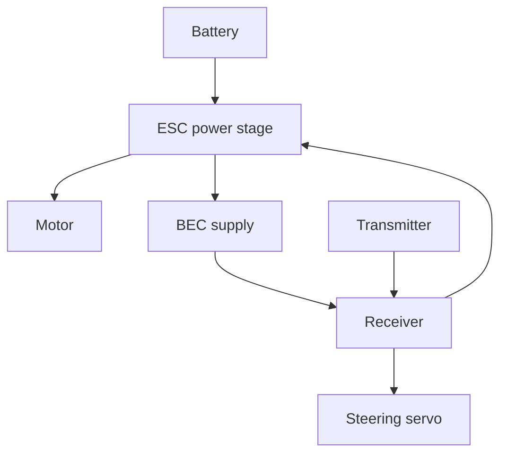

# Topic 4.9 - Electronics Installation

> **"Good wiring is not hidden; it is protected, traceable and easy to disconnect."**

---

# Learning Objectives 🎯

By the end of this topic you will be able to:

- freeze the exact installed system and verify compatibility before power
- prove battery fit, restraint and removal using an inert weighted dummy
- mount electronics for cooling, protection, access and independent service
- route command and energy wiring outside movement, heat and abrasion envelopes
- verify pinout, polarity, insulation and strain relief at every connection
- recommission steering, throttle, failsafe and range in adult-led stages

---

# Before We Begin

The buggy passes every unpowered mechanical test.

After the electronics are installed, the left suspension no longer returns fully.
A signal lead crosses the steering link, the battery connector hangs from its wires, and a sealed cover traps heat above the ESC.

Nothing is electrically broken.
The installation has created three new faults.

Topic 4.8 proved the mechanism with no powered electronics installed.
Now we add the command and energy paths without disturbing that evidence.

Use six checks:

1. **Identity** - is every exact model, manual, rating and pinout recorded?
2. **Match** - are voltage, current, chemistry, signal, BEC and connector roles compatible?
3. **Mount** - can each item cool, survive impact and leave for service?
4. **Route** - do wires avoid movement, heat, sharp edges and unwanted tension?
5. **Protect** - are battery restraint, insulation, strain relief and disconnect access proven?
6. **Commission** - do neutral, direction, limits, failsafe and range still pass in the final geometry?

> **[Signature visual, F5 command and energy overlay - Figure 4.9.1: top view of final buggy with red battery power, orange motor leads, green receiver signals and blue antenna route. Grey swept envelopes surround steering, suspension, shafts and the battery service path; rounded clips support structure-side cable sections while connector joints remain unloaded. Six gate labels—identity, match, mount, route, protect and commission—sit at the relevant interfaces.]**
>
> *Figure 4.9.1 - A safe installation keeps energy and command paths visible while every mechanical envelope remains free.*
>
> *Alt text: Final buggy wiring separates power, motor, signal and antenna routes from moving and service spaces.*

# Begin with the Final System Table

Reconfirm the exact installed system.

| Device | Exact model | Voltage/current role | Connection | Manual checked? |
|---|---|---|---|---|
| Battery |  | Energy source | Main connector |  |
| ESC |  | Motor control and possible BEC | Battery, motor, receiver |  |
| Motor |  | Mechanical output | ESC motor leads |  |
| Receiver |  | Command hub | Antenna, CH1, CH2 |  |
| Servo |  | Steering actuator | Receiver CH1 |  |
| Transmitter |  | Driver command | Radio link |  |
| Charger |  | Battery charging | Battery/charge lead |  |

If one exact model has changed since Topic 4.5, repeat the compatibility review.

> **[F1 annotated photograph - Figure 4.9.2: battery, ESC, motor, receiver, servo, transmitter and charger are arranged beside the completed final system table and exact manuals. Labels connect voltage, current, chemistry, BEC, protocol, channel and charger roles across the chain.]**
>
> *Figure 4.9.2 - Installation begins with one fully identified system rather than a pile of familiar connectors.*
>
> *Alt text: Exact RC components and manuals are linked through a completed compatibility table.*

# Trace Two Paths Again



The battery-to-ESC-to-motor path can carry much more current than receiver signal leads.

The transmitter-to-receiver-to-servo/ESC path carries commands.

Keep both understandable.

# Build an Installation Order

Use this order:

1. dummy battery and unpowered component fit
2. mounts and trays
3. signal and antenna routes
4. motor and power routes
5. restraints and guards
6. independent connection inspection
7. battery introduction with switch off
8. steering-only commissioning
9. throttle-only wheels-up commissioning
10. combined wheels-up test
11. short floor test in Topic 4.10

Install the hardest-to-reach removable item first only if later items do not trap it.

> **[F4 sequence strip - Figure 4.9.3: dummy components and trays, mounts, signal/antenna route, motor/power route, independent inspection, battery-off introduction, steering-only stand test and throttle/failsafe stand test appear as gated panels. The floor remains locked.]**
>
> *Figure 4.9.3 - Physical installation and powered commissioning are different sessions separated by an inspection gate.*
>
> *Alt text: Electronics installation proceeds from inert layout to isolated wheels-up commissioning.*

# Battery Position Controls More Than Fit

The battery is often one of the heaviest components.

Its position affects:

- fore-aft balance
- left-right balance
- centre-of-mass height
- suspension load
- wire length
- access
- crash protection

Keep it as low as practical without exposing it to ground impact.

Do not place it where a suspension arm, screw tip, driveshaft or motor can contact it.

# Prove the Tray with a Dummy Battery

Create a card or wooden block matching the approved battery's maximum envelope and representative mass.

Test:

- insertion
- restraint
- connector space
- strap path
- removal
- chassis clearance
- body/cover clearance
- impact direction

The dummy should not include live cells or exposed metal.

Only after the tray passes should the adult introduce the disconnected real battery for a gentle fit check.

> **[F6 measured drawing - Figure 4.9.4: inert weighted dummy battery shows maximum length, width, height and connector envelope inside a tray. Arrows demonstrate insertion, two-axis restraint, strap path, padding, tool-safe disconnect and straight removal; nearby screw tips and shafts have keep-clear zones.]**
>
> *Figure 4.9.4 - The tray must prove fit, retention, connection and escape before real stored energy enters it.*
>
> *Alt text: Dimensioned dummy battery validates a removable tray and independent restraint system.*

# Use Two Independent Retention Ideas Where Needed

The tray locates the battery.
A strap, clip or approved retainer prevents it leaving.

Useful battery retention may combine:

- side walls or end stops
- hook-and-loop strap
- removable crossbar
- padded non-slip surface compatible with the battery case

Do not rely only on adhesive stuck to the battery.

Do not crush a soft battery pouch with an over-tight strap.
Follow the battery manufacturer's protection and mounting guidance.

# Keep the Battery Exit Simple

The normal removal sequence should be:

```text
switch off -> disconnect by connector housings -> release restraint -> lift battery out
```

It should not require:

- pulling wires
- removing suspension
- opening the gearbox
- placing a tool beside battery terminals
- bending the pack

Time the process only after safety and gentleness are established.

# Mount the ESC for Cooling and Protection

The ESC must be:

- protected from direct impact
- exposed to the airflow required by its manual
- clear of moving parts
- connected without tight cable bends
- removable
- accessible for its switch and programming button
- positioned so indicators can be seen where useful

Horizon Hobby's Firma manual, for example, instructs users to choose a location with good ventilation and secure wiring away from damage and moving parts.

Do not bury a cooling fan under a body panel or bundle wires across it.

# Mount the Receiver and Antenna

The receiver needs:

- dry, protected location appropriate to its rating
- accessible channel ports
- secure but removable attachment
- no fastener crushing its case
- signal leads with strain relief
- antenna route from the exact manual

Official receiver manuals commonly warn not to cut, kink or modify antennas.
Some also recommend separation from metal, batteries or carbon-fibre structures.

Follow the exact receiver instructions, especially if it has stabilisation and a required orientation.

> **[F7 comparison array - Figure 4.9.5: ESC tray shows protected airflow, visible switch and programming access; receiver tray shows accessible ports and exact-manual antenna route; servo mount shows supported lugs, horn sweep and removable cable exit. Transparent arrows show each upward service route.]**
>
> *Figure 4.9.5 - Protection is successful only when cooling, movement and removal remain available.*
>
> *Alt text: ESC, receiver and servo mounts balance protection with airflow, access and service.*

# Mount the Servo Without Distortion

The servo case must be supported at its mounting lugs or intended surfaces.

Check:

- horn clears the chassis at full permitted travel
- cable leaves without rubbing the horn
- screws do not distort the case
- servo can be removed without opening the gearbox
- link stays near its intended plane
- suspension travel does not pull the steering link into bind

Use grommets, spacers or direct mounting exactly as the servo and chassis design require.

# Route Power and Motor Leads

Power cables should be:

- as direct as practical
- free from sharp edges
- clear of gears, shafts and tyres
- supported near heavy connectors
- not stretched at full service movement
- protected from suspension compression
- away from hot motor surfaces

Brushless motor phase leads may connect in different orders depending on the system, but direction reversal procedures vary.
Follow the ESC manual before swapping anything.

Brushed motor polarity controls direction.
Disconnect power before correcting it.

# Route Signal Leads Separately Where Practical

Signal leads carry small control signals.

Avoid running long receiver leads tightly alongside motor and high-current battery wires when another route is practical.

Also avoid:

- tight coils around receiver antenna
- pinching under trays
- crossing sharp printed edges
- loose loops near steering

Separation improves organisation and may reduce electrical noise risk.

# Provide Strain Relief

Imagine carrying a shopping bag by the thin wires of its handle attachment instead of the handle itself.

Connectors should not carry cable weight or vibration.

Provide a restraint point near:

- motor terminals
- ESC case
- battery connector route
- receiver tray
- switch

Leave a gentle service loop between restraint and connector.

Do not tighten a cable tie until it cuts insulation.

> **[F2 cross-section and motion overlay - Figure 4.9.6: cable passes through a rounded clip with a gentle service loop before a heavy connector. Adjacent wrong examples show connector carrying cable weight, tie cutting insulation, wire crossing steering sweep and lead rubbing a screw thread.]**
>
> *Figure 4.9.6 - Strain relief transfers force into structure while leaving the electrical joint unstressed.*
>
> *Alt text: Correct cable support and service loop are compared with four damaging routing conditions.*

# Label Both Ends

Use small durable labels:

- `BATTERY`
- `MOTOR A/B/C` or approved phase identity
- `CH1 STEERING`
- `CH2 THROTTLE`
- `SWITCH`

Label polarity where connectors do not make reversal physically impossible.

Do not place a loose label where it can enter gears.

# Inspect Soldered and Crimped Joints

Topic 2.9 taught reliable wire connections.

Before installation, inspect:

- conductor fully insulated
- no exposed strands
- no cold or cracked solder joint
- connector housing locked
- polarity correct
- heat-shrink undamaged
- wire gauge appropriate to the component
- no adapter chain of unknown rating

Never twist bare high-current wires together as a temporary RC connection.

# Check Connector Compatibility Beyond Shape

Two connectors may physically mate but still be wired with opposite polarity.

Verify:

- manufacturer pinout
- polarity marks
- wire colours as supporting, not sole, evidence
- connector current rating
- mechanical locking
- no damaged or recessed contact

A multimeter continuity or polarity check is an optional adult-led upgrade.
It does not replace reading the diagram.

> **[F3 right-versus-wrong pair - Figure 4.9.7: matching-looking plugs mate on the left while polarity, current and BEC source remain question marks; on the right, official pinouts, housing marks and an independent adult check approve each contact before connection.]**
>
> *Figure 4.9.7 - Connector shape is only one part of electrical compatibility.*
>
> *Alt text: Unverified matching plugs are contrasted with documented pinout, polarity and supply checks.*

# Protect Against Abrasion

Wires vibrate against surfaces during driving.

Use:

- rounded cable guides
- sleeves or grommets at pass-throughs
- smooth clip edges
- separation from screw threads
- inspection points

Do not trap a cable permanently inside a closed printed wall.
Future damage must be visible and repairable.

# Recalculate Balance and Suspension Load

The dummy and real electronics add mass.

Measure:

- total mass if a suitable scale is available
- front and rear ride height
- left and right ride height
- static tyre clearance
- battery position from datum
- suspension sag

If one corner sits low, investigate before adding spring preload.
The cause may be cable tension, a trapped wire, binding arm or misplaced heavy part.

## Worked Example - Battery Connector Reach

**Question:** Does a 95 mm cable reach safely when the required route is 82 mm and the minimum service loop is 10 mm?

```text
required length = route + service loop
                = 82 + 10
                = 92 mm

available margin = 95 - 92
                 = 3 mm
```

The cable reaches on paper, but 3 mm is a small margin for measurement error and movement.
Repositioning the connector may be better than stretching the lead.

# Recommission from Zero

Do not assume settings remain correct because the electronics worked in Topic 4.5.

The final steering geometry, drivetrain and battery may differ.

Repeat:

- model memory check
- receiver binding status
- steering direction
- mechanical centre
- endpoints
- throttle direction
- ESC calibration if required by the manual after changes
- battery mode/cut-off setting
- throttle limit
- neutral failsafe
- range check

Use the stable wheels-up stand.

> **[F4 sequence strip - Figure 4.9.8: final system is recommissioned with model memory and identity, steering centre/direction/endpoints, throttle neutral/direction/limit, exact-manual calibration and battery mode, neutral failsafe, then stationary range check. Each stage has an immediate disconnect hand and pass box.]**
>
> *Figure 4.9.8 - Final geometry earns control capability again from zero; earlier settings are evidence to recheck, not permission to assume.*
>
> *Alt text: Wheels-up commissioning restores steering, throttle, failsafe and range in separate stages.*

# LiPo and Rechargeable Battery Boundary

If Version 1 uses a LiPo battery, all Topic 3.3 rules apply:

- adult-supervised charging
- correct chemistry, cell count and current settings
- compatible balance connection where required
- LiPo charging bag or approved fire-resistant charging setup
- never charge unattended
- never use or charge a damaged, swollen or punctured pack
- stop for unusual heat, smell or behaviour
- storage voltage and location according to manufacturer guidance
- disconnect after use

A suitable NiMH system remains a valid lower-complexity Version 1 choice.

No battery chemistry makes careless handling safe.

> **☕ Good place to pause.**
>
> Finish dummy fit, cable routes and the independent connection inspection before the real battery enters the workspace.
> Powered recommissioning is a separate adult-supervised session.

# Hands-On Activity 1 - Four-Route String Model

Use four colours of string for power, motor, signal and antenna paths.

Move steering and suspension.
Remove the battery and electronics tray.

Revise every route that tightens or crosses danger.

# Hands-On Activity 2 - Strain-Relief Demonstrator

Connect two card blocks with string.

First let a paper connector carry a pull.
Then add a tie point with a short service loop.

Label where the force travels in each version.

# Hands-On Activity 3 - Dummy Battery and Independent Trace

Use only the inert dummy.

Tilt and gently roll the unpowered chassis by hand over a padded surface while an adult supervises.
Observe whether the locator and retainer have separate jobs.

Then give the unpowered installation drawing to another person.

Ask them to trace energy and command paths, point to every disconnect and identify the failsafe result.

> **[F7 comparison array - Figure 4.9.9: four-colour string routes move with a card steering rig, a paper connector gains a nearby strain-relief loop, and an inert dummy stays located while a second person traces disconnects on the wiring diagram.]**
>
> *Figure 4.9.9 - Routing, restraint and independent traceability can be proved without energising the buggy.*
>
> *Alt text: Household activities model cable routes, strain relief, battery retention and wiring review.*

# Topic Project - Installed and Commissioned RC System 🛠️

Install the approved electronics into the final mechanical chassis and produce a signed pre-test certificate.

## Materials

- mechanically accepted Topic 4.8 chassis
- compatible approved battery, ESC, motor, receiver, servo and transmitter
- exact manuals and Manual Cards
- printed battery and electronics modules
- inert dummy battery
- approved straps, removable mounting tape, screws and cable guides
- insulated connectors and wire protection
- stable wheels-up stand
- ruler, labels and inspection sheet
- charger and battery safety equipment required by the exact battery

> **⚠️ SAFETY**
>
> Show a responsible adult or guardian the exact electronics, battery, charger, wiring diagram and commissioning plan before starting, and perform every powered step with them present.
> Keep the main battery disconnected while mounting, routing, soldering, plugging receiver leads or adjusting mechanisms.
> Follow exact manufacturer voltage, chemistry, polarity, BEC, binding, calibration, antenna and cooling instructions.
> Charge rechargeable batteries under adult supervision using the correct charger settings and required fire-resistant safety setup; never charge unattended or use a damaged, swollen, hot or punctured pack.
> First power occurs on a stable wheels-up stand with the transmitter ready, throttle neutral and vehicle switch accessible.
> Keep people, hair, clothing, jewellery, tools and wires away from wheels, gears and shafts.
> Stop immediately for unexpected movement, signal loss, servo buzz, stall, heat, smell, smoke, sparking, damaged insulation or loose battery.
> Disconnect the battery after every session.

> **🎬 Watch the build**
>
> - [Horizon Hobby Firma ESC Manual](https://www.horizonhobby.com/on/demandware.static/-/Sites-horizon-master/default/dwda06580f/Manuals/Firma-Manual-EN.pdf) - official example of mounting, ventilation, wiring restraint and calibration.
> - Your receiver manufacturer's official installation manual - follow its exact antenna position and range-check procedure.
> - Your battery and charger manufacturers' official manuals - use their exact chemistry, cell-count, current and storage requirements.

## Step 1 - Update the final system table

No blank rating or model field is allowed at the power gate.

## Step 2 - Fit the dummy battery

Prove insertion, retention, connection space and removal.

## Step 3 - Install servo and receiver tray

Keep horn, link, ports and antenna clear.

## Step 4 - Install ESC and switch

Preserve airflow, indicator view and immediate switch access.

## Step 5 - Route signal and antenna paths

Add labels and strain relief.

## Step 6 - Route motor and power paths

Protect from heat, motion and abrasion.

## Step 7 - Inspect every connector

An adult independently checks pinout, polarity, rating and insulation.

## Step 8 - Recheck mechanical freedom

With no battery, rotate drivetrain, steer by hand and compress every corner.

No cable may alter the mechanical result.

## Step 9 - Introduce the real battery with switch off

Perform a gentle fit and connector-reach check.

Disconnect again before any adjustment.

## Step 10 - Recommission steering

Use wheels-up support and no active motor command.

Check centre, direction, endpoints and full suspension movement.

## Step 11 - Recommission throttle

Follow the exact ESC manual.

Check neutral, direction, brake, limit and battery settings.

## Step 12 - Test failsafe

Use the manual-approved signal-loss method with driven wheels raised.

## Step 13 - Repeat range check

The final antenna location must prove itself.

## Step 14 - Short wheels-up heat/noise observation

Use brief commands and inspect between them.

## Step 15 - Recheck mass and ride height

Record final installed values before driving.

## Step 16 - Service demonstration

Power off and disconnect.

Remove battery, electronics tray and servo without disturbing drivetrain datums.

## Step 17 - Sign the pre-test certificate

Adult and learner confirm:

- compatibility
- battery condition
- polarity
- retention
- cooling
- cable protection
- mechanical freedom
- steering endpoints
- throttle neutral
- failsafe
- range
- emergency stop

## Step 18 - Reflection

Record:

- one route changed after movement testing
- one feature that prevents battery escape
- one feature that protects a connector
- how installed mass changed ride height
- why floor driving remains locked until Topic 4.10

Keep the wiring diagram and signed certificate with the buggy.

> **[F4 sequence strip - Figure 4.9.10: final installation moves from approved system table and dummy tray through mounted modules, labelled protected wiring, independent connection inspection, powered wheels-up stages, ride-height recheck and powered-down service demonstration. The final panel is a signed pre-test certificate beside a disconnected buggy.]**
>
> *Figure 4.9.10 - Floor testing unlocks only after installation, control and service evidence agree.*
>
> *Alt text: Installed RC electronics progress through physical and powered gates to a signed release certificate.*

# Learning Goal

Install a traceable, protected and serviceable electrical/control system without disturbing the accepted mechanical chassis.

# Cheapest Valid Prototype

Use dummy component blocks and coloured string to prove every route before installing the already approved electronics.

# What to Buy, Reuse and Make

## Buy now

Only confirmed installation items:

- correct battery strap or retainer
- appropriate removable mounting material
- wire sleeve, grommet or cable guides
- correct connectors if the approved system lacks them
- small standard fasteners

## Reuse now

- approved Topic 4.5 radio and control system
- mechanically accepted chassis
- printed trays and mounts
- wheels-up stand
- labels and workshop tools

## Make now

- dummy battery
- wiring diagram
- route labels
- strain-relief points
- connector access guide
- pre-test certificate

## Buy later

No performance upgrade belongs here.
Topic 4.10 tests Version 1 before any new component is justified.

# Cost Checkpoint

Expected installation-only cost may be **£5-£20**.

Record separately:

- restraints
- mounting tape or pads
- cable protection
- connectors and heat-shrink
- reprinted tray or guide
- damaged connector caused during installation
- battery safety equipment not already owned

Do not hide the cost of adapters created by an incompatible component choice.

# Modular Interfaces

| Interface | Installation evidence |
|---|---|
| Battery to tray | Envelope, locator, restraint, connector and removal |
| ESC to tray | Cooling, impact protection, switch and wire access |
| Receiver to tray | Port access, orientation, antenna and removal |
| Servo to mount | Case support, horn sweep, link plane and cable exit |
| Cables to chassis | Rounded guides, strain relief, service loops and labels |
| Electronics tray to core | Standard fasteners, datum and independent removal |

# Test Plan

## Test 1 - Battery, Mount and Route Gate

**Question:** Do the inert battery and installed routes remain located, protected and serviceable through handling and full movement?

**Independent variable:** Chassis orientation, mechanism position or module service position.

**Dependent variables:** Dummy movement, retainer state, minimum cable slack, contact, pinch and bend condition.

**Control variables:** Same dummy mass, tray, strap setting, unpowered installation, restraint points and padded area.

**Procedure:** Complete the adult-approved dummy tilt test, then move every mechanism slowly and remove each service module while observing the routes.

**Pass condition:** The dummy stays within its locators, its retainer remains engaged, no tension reaches a connector and no cable touches a moving, sharp or hot part.

## Test 2 - Steering, Throttle and Loss Gate

**Question:** Do the final installation and exact settings produce correct steering, throttle, neutral and signal-loss behaviour?

**Independent variable:** Steering or throttle command, suspension position or manual-approved signal condition.

**Dependent variables:** Wheel angle, return, clearance, motor response, neutral result and warning signs.

**Control variables:** Same stable stand, approved battery, endpoints, throttle limit and exact controller settings.

**Procedure:** Commission steering at increasing commands and suspension extremes; then follow the exact ESC procedure for small throttle, neutral, brake and signal loss.

**Pass condition:** Direction and centre are correct, neutral stops the motor, signal loss holds neutral throttle, and there is no contact, buzz, heat, noise or unexpected movement.

## Test 3 - Range and Electronics Service Gate

**Question:** Does the final antenna installation pass its official range method, and can each electrical module then be serviced without damage?

**Independent variable:** Distance, manual-approved orientation or module selected.

**Dependent variables:** Response reliability, receiver indication, service time, connector handling and disturbed interfaces.

**Control variables:** Same area, battery state, installation, commands, powered-down service instructions and tool set.

**Procedure:** Perform the exact stationary range check with the vehicle made safe; then power down, disconnect and remove plus reinstall the battery, electronics tray, receiver and servo module.

**Pass condition:** Manual and project range requirements pass without interruption, connectors are handled by housings, routes restore correctly and no mechanical datum or cable is damaged.

# Upgrade Path

String routing model -> installed low-power control system -> fully commissioned wheels-up Version 1 -> staged floor tests -> thermal and endurance evidence -> only then justified cooling, gearing, material or power upgrades.

# Stop Point Before Topic 4.10

Do not place the powered buggy on the floor until:

- final device models and ratings are recorded
- battery, ESC, motor, BEC, receiver, servo and charger are compatible
- dummy battery retention passes
- real battery is undamaged and properly restrained
- connector polarity and pinout are independently checked
- every joint is insulated and strain-relieved
- power, motor, signal and antenna routes are protected
- ESC and motor cooling paths are open
- switch and main disconnect are immediately accessible
- unpowered mechanical freedom is unchanged
- steering direction, centre and endpoints pass
- throttle neutral, direction, brake and limit pass
- neutral failsafe passes with wheels raised
- final antenna installation passes range check
- ride height and installed mass are recorded
- battery and electronics service tests pass
- learner and responsible adult sign the pre-test certificate

Topic 4.10 begins with walking-speed checks in a controlled area, not a maximum-throttle run.

---

# Common Beginner Mistakes ❌

## Mistake 1 - Installing the Real Battery Before Proving the Tray

Use an inert dummy first.

> **[F3 right-versus-wrong pair - Figure 4.9.11: left panel pushes a live pack into an untested tray beside an exposed screw tip; right panel uses a dimensioned weighted dummy to prove insertion, restraint, connector space and straight removal.]**
>
> *Figure 4.9.11 - Inert mass should discover packaging faults before stored energy does.*
>
> *Alt text: Untested live-battery fit is contrasted with a complete dummy-battery proof.*

## Mistake 2 - Confusing Hidden with Protected

Protection must preserve inspection and repair.

Airflow and fan clearance are installation requirements.

> **[F3 right-versus-wrong pair - Figure 4.9.12: left panel seals receiver, wires and ESC fan beneath one opaque cover; right panel uses a ventilated ESC guard, visible inspection routes and removable receiver tray.]**
>
> *Figure 4.9.12 - Protection controls exposure without removing cooling, inspection or service.*
>
> *Alt text: Sealed overheating electronics bay is contrasted with ventilated accessible modules.*

## Mistake 3 - Letting Wires and Connectors Carry Loads

Use strain relief and service loops.

Trace full steering, suspension and service envelopes.

> **[F3 right-versus-wrong pair - Figure 4.9.13: left panel hangs a heavy connector from its solder joints while the cable crosses steering travel; right panel supports the cable on structure, leaves a service loop and stays outside the swept envelope.]**
>
> *Figure 4.9.13 - A wire route must survive vibration and movement without loading the electrical joint.*
>
> *Alt text: Unsupported snagging cable is contrasted with strain relief and movement clearance.*

## Mistake 4 - Guessing the Electrical Path

Use the official pinout and independent check.

The ESC/BEC manual determines allowed supply arrangements.

> **[F3 right-versus-wrong pair - Figure 4.9.14: left panel trusts red/black colours and adds a receiver battery beside an active ESC BEC; right panel traces official polarity and confirms the permitted single receiver supply.]**
>
> *Figure 4.9.14 - Familiar colours and spare connectors cannot replace the exact power diagram.*
>
> *Alt text: Guessed polarity and double receiver supply are contrasted with documented pinout and BEC arrangement.*

## Mistake 5 - Assuming Earlier Settings Remain Valid

Recommission after final geometry and component changes.

> **[F3 right-versus-wrong pair - Figure 4.9.15: left panel places the final buggy on the floor because the electronics worked in Topic 4.5; right panel repeats steering limits, throttle neutral, exact-manual calibration, failsafe and range on the stable stand.]**
>
> *Figure 4.9.15 - Final geometry must earn command release again.*
>
> *Alt text: Assumed old radio settings are contrasted with complete final recommissioning.*

## Mistake 6 - Hiding an Installation Fault with Adjustment

Find the real cause of ride-height imbalance.

Switch off and disconnect according to the manual.

> **[F3 right-versus-wrong pair - Figure 4.9.16: left panel adds spring preload to a corner held down by a tight cable and leaves the battery connected; right panel disconnects, frees the route and remeasures ride height before any suspension change.]**
>
> *Figure 4.9.16 - Remove the installation cause before adjusting the mechanism it disturbed.*
>
> *Alt text: Preload masking a trapped wire is contrasted with power-down diagnosis and corrected routing.*

# Topic Summary 📝

- Good wiring is protected, traceable, ventilated and serviceable.
- The final system table rechecks every model, rating and connection.
- Dummy battery testing proves fit and retention before real energy enters.
- Battery locators and retainers perform different jobs.
- ESC position must balance cooling, impact protection, access and cable bends.
- Receiver and antenna installation follows the exact manual.
- Power, motor, signal and antenna routes have different needs.
- Strain relief keeps force away from joints and connectors.
- Labels and a wiring diagram make the system fault-findable.
- Final mass requires new ride-height and balance measurements.
- Steering, throttle, failsafe and range are recommissioned from zero.
- Floor testing stays locked until the signed certificate passes.

# New Words 📖

| Word | Meaning |
|---|---|
| Abrasion | Wear caused by repeated rubbing against a surface |
| Dummy battery | Inert model matching a battery's envelope and representative mass for safe fit tests |
| Installation order | Planned sequence that preserves access, inspection and safe commissioning |
| Pinout | Record of the electrical job and polarity of connector contacts |
| Pre-test certificate | Signed checklist confirming that required safety and function evidence exists before driving |
| Service loop | Controlled extra wire length allowing connection, movement or module removal without strain |

# Review Questions ❓

1. Why must the final compatibility table be updated?
2. What does a dummy battery test that a flat drawing cannot?
3. Distinguish battery location from retention.
4. What four needs influence ESC position?
5. Why does the receiver antenna follow its exact manual?
6. Name four places needing strain relief.
7. Why may power and signal wires use different routes?
8. What checks connector compatibility beyond shape?
9. A route is 105 mm and needs a 12 mm loop. Is a 115 mm lead enough, and what is the margin?
10. Why is ride height remeasured after installation?
11. Which radio and throttle tests must be repeated?
12. What does the pre-test certificate unlock?

# Topic Checklist ✅

- [ ] The final system table contains exact models and ratings.
- [ ] The dummy battery passed fit, retention and removal tests.
- [ ] The real battery is undamaged and correctly restrained.
- [ ] ESC and motor cooling paths are open.
- [ ] Receiver and antenna follow exact instructions.
- [ ] Servo mount, horn and cable clear all movement.
- [ ] Power, motor, signal and antenna routes are protected.
- [ ] Every important connector has strain relief and access.
- [ ] Pinout, polarity and insulation were independently checked.
- [ ] Mechanical freedom remained unchanged after wiring.
- [ ] Steering and throttle were recommissioned separately.
- [ ] Neutral failsafe and final range check pass.
- [ ] Installed mass and ride height are recorded.
- [ ] Electronics modules remain serviceable.
- [ ] Learner and adult signed the pre-test certificate.

# Learn More

> **📚 Learn more**
>
> - [Horizon Hobby Firma ESC Manual](https://www.horizonhobby.com/on/demandware.static/-/Sites-horizon-master/default/dwda06580f/Manuals/Firma-Manual-EN.pdf) - official guidance on ventilation, wiring, receiver supply and calibration.
> - [Spektrum Brushed ESC/Receiver Manual](https://www.horizonhobby.com/on/demandware.static/-/Sites-horizon-master/default/dwcf7cf482/Manuals/SPMXSE1040RX-Manual-EN.pdf) - official example of antenna placement, binding, failsafe and battery disconnection.
> - Your exact battery, charger and radio manuals - primary authority for installation, charging, storage, range and failsafe.

# Looking Ahead 🔭

The buggy is mechanically complete, electrically installed and safely commissioned on the stand.

In **Topic 4.10 - Testing, Debugging and Version 1**, we will release capability in stages: static checks, walking-speed control, braking, steering, surface trials, thermal inspection, endurance and service tests.

The result will be a documented Version 1 buggy and an evidence-led revision plan, not an uncontrolled speed attempt.

# Answers 🔑

1. Any changed device can alter voltage, current, chemistry, signal, BEC, connector, charger or setup compatibility, so the final installed chain must be checked again.
2. It proves three-dimensional insertion, restraint, connector room, movement clearance, body clearance and the real removal route with representative mass.
3. Tray walls or stops locate the battery; a strap, crossbar or approved retainer prevents it escaping.
4. Cooling and ventilation, impact protection, switch/programming access and safe cable routes all influence ESC position.
5. Antenna type, orientation, separation, stabilisation direction and range procedure depend on the exact receiver design.
6. Useful points include near motor terminals, the ESC case, battery connector route, receiver tray and switch.
7. High-current power and motor wiring has different current, heat and electrical-noise concerns from low-level signal and antenna paths.
8. Check official pinout, polarity, voltage, current rating, signal role, locking, contact condition and permitted supply arrangement.
9. Required length is `105 + 12 = 117 mm`; a 115 mm lead is 2 mm too short, so its margin is `-2 mm`.
10. Real electronics change total mass, balance, suspension sag and can reveal cable tension or a trapped route.
11. Recheck model memory and binding status, steering direction/centre/endpoints, throttle direction/neutral/limit, exact-manual calibration and battery mode, neutral failsafe and final range.
12. It unlocks the first controlled walking-speed stage in Topic 4.10; it does not unlock maximum-speed driving.
