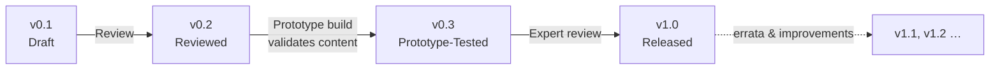

# Document Versioning & Lifecycle

Every document in this handbook (topics, glossary, worksheets, guides) carries its own version and status in its YAML front matter:

```yaml
version: "0.1"
status: "Draft"
```

Documents mature through a fixed lifecycle. A document only moves forward when it passes the gate for the next stage — just like a real engineering release process.

## The Lifecycle



| Version | Status | Gate to reach this stage |
| --- | --- | --- |
| **v0.1** | Draft | Document is complete and self-contained: full topic structure, diagrams, experiment, challenge, checklist. Written, but unverified. |
| **v0.2** | Reviewed | A human has read it end-to-end for clarity, correctness and age-appropriateness. Experiments have been sanity-checked on paper. Glossary terms extracted. |
| **v0.3** | Prototype-Tested | The content has been validated against the real build: experiments physically performed, measurements/values confirmed on actual hardware, instructions followed as written by someone other than the author. |
| **v1.0** | Released | An experienced engineer or educator has reviewed the document. It is considered trustworthy for independent use by a young reader. |
| v1.1+ | Released | Errata, clarifications and improvements after release. Minor bump per meaningful revision. |

## Rules

- **Version lives in the document**, in the YAML front matter — not in filenames. Filenames never change when versions change.
- **Git history is the changelog.** Each version bump is its own commit, e.g. `Topic 1.4 → v0.2 (reviewed)`.
- **A version bump commits only when its gate is genuinely passed.** A draft that was merely re-edited stays at v0.1.
- **Regressions are allowed.** If a prototype test invalidates part of a v0.3 topic, it drops back to v0.2 until fixed and re-tested.
- **The SUMMARY tracks stages at a glance** using these markers:

  | Marker | Meaning |
  | --- | --- |
  | 📋 | Planned — not yet written |
  | ✍️ | In progress |
  | 🟡 v0.1 | Draft |
  | 🔵 v0.2 | Reviewed |
  | 🟠 v0.3 | Prototype-tested |
  | 🟢 v1.0 | Released |

## Part & Handbook Releases

When **every topic in a part** reaches v1.0, the part is released and tagged in git (e.g. `part-1-v1.0`). When all five parts are released, the handbook itself becomes **Edition 1**.
